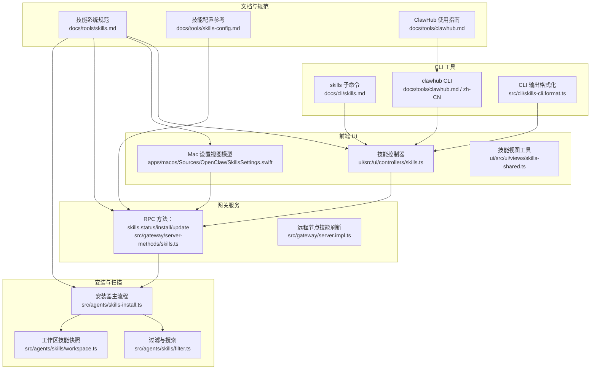
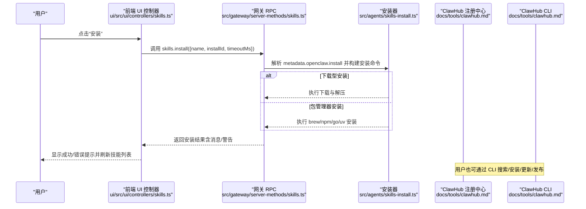
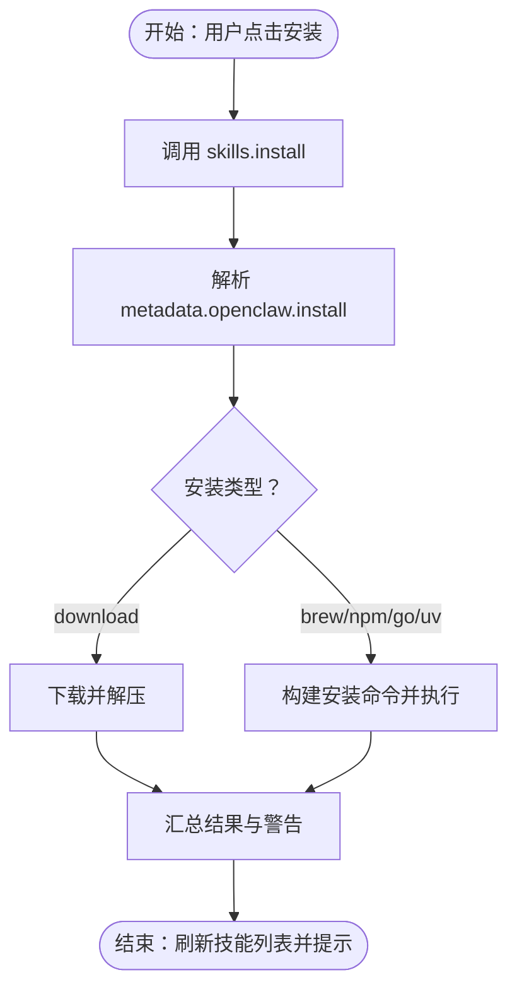
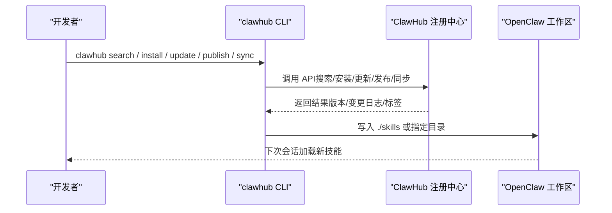
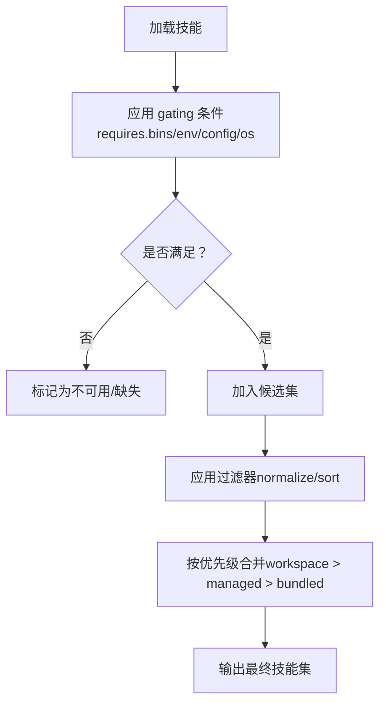
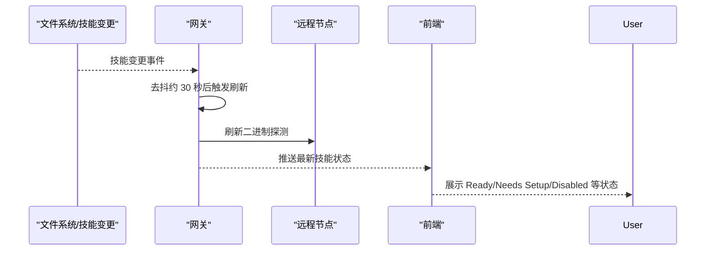
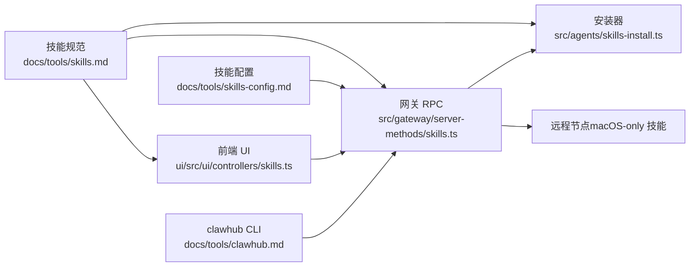

# 技能管理

## 目录
1. [简介](#简介)
2. [项目结构](#项目结构)
3. [核心组件](#核心组件)
4. [架构总览](#架构总览)
5. [详细组件分析](#详细组件分析)
6. [依赖关系分析](#依赖关系分析)
7. [性能考量](#性能考量)
8. [故障排除指南](#故障排除指南)
9. [结论](#结论)
10. [附录](#附录)

## 简介
本指南面向 OpenClaw 技能管理系统的使用者与维护者，系统讲解技能的安装、卸载、更新与版本管理流程；说明技能商店（ClawHub）的功能与使用方法；解释技能依赖关系与冲突处理策略；提供安装失败的故障排除清单（网络、权限、兼容性等）；并覆盖自动更新与手动更新机制，以及技能状态监控与健康检查方法。

## 项目结构
OpenClaw 的技能管理由“文档规范 + 前端 UI + 网关服务 + 安装器 + CLI 工具链”共同组成：
- 文档层：定义技能格式、加载顺序、配置项、安全与性能影响等
- 前端层：提供技能状态查看、过滤、安装入口与错误提示
- 网关层：暴露 RPC 方法（如 skills.status、skills.install、skills.update），协调安装与状态刷新
- 安装器层：解析 SKILL.md 中的 metadata.openclaw.install 规范，执行 brew/npm/go/uv/download 等安装流程
- CLI 层：提供 skills list/info/check 与 clawhub 命令族，支撑搜索、安装、更新、发布与同步

图表来源
- [skills.md](file://docs/tools/skills.md#L1-L303)
- [skills-config.md](file://docs/tools/skills-config.md#L1-L78)
- [clawhub.md](file://docs/tools/clawhub.md#L1-L158)
- [skills.ts](file://ui/src/ui/controllers/skills.ts#L39-L157)
- [skills.ts](file://apps/macos/Sources/OpenClaw/SkillsSettings.swift#L111-L593)
- [skills-shared.ts](file://ui/src/ui/views/skills-shared.ts#L1-L52)
- [skills.ts](file://src/gateway/server-methods/skills.ts#L134-L180)
- [skills-install.ts](file://src/agents/skills-install.ts#L1-L200)
- [skills-filter.ts](file://src/agents/skills/filter.ts#L1-L33)
- [skills-workspace.ts](file://src/agents/skills/workspace.ts#L68-L691)
- [skills.md](file://docs/cli/skills.md#L1-L27)
- [clawhub.md（中文）](file://docs/zh-CN/tools/clawhub.md#L1-L158)
- [skills-cli.format.ts](file://src/cli/skills-cli.format.ts#L272-L301)

章节来源
- [skills.md](file://docs/tools/skills.md#L1-L303)
- [skills-config.md](file://docs/tools/skills-config.md#L1-L78)
- [clawhub.md](file://docs/tools/clawhub.md#L1-L158)
- [skills.md](file://docs/cli/skills.md#L1-L27)
- [clawhub.md（中文）](file://docs/zh-CN/tools/clawhub.md#L1-L158)

## 核心组件
- 技能系统规范与加载顺序：定义 bundled/managed/workspace 三类来源及优先级、元数据字段、环境注入、远程节点适配、技能快照与热刷新等
- 技能配置：允许对 bundled 技能进行白名单、安装偏好、额外扫描目录、监听与去抖设置、条目级覆盖（启用/禁用、环境变量、密钥）
- 技能商店（ClawHub）：提供搜索、安装、更新、发布、同步等能力，支持版本管理与标签
- 前端技能界面：展示技能状态、过滤与搜索、安装入口、错误提示与进度
- 网关 RPC：提供 skills.status/install/update 等方法，负责安装执行与状态刷新
- 安装器：解析 metadata.openclaw.install，按平台选择 brew/npm/go/uv/download，执行命令并收集扫描警告
- CLI：skills list/info/check 与 clawhub 子命令，支持搜索、安装、更新、发布、同步

章节来源
- [skills.md](file://docs/tools/skills.md#L11-L303)
- [skills-config.md](file://docs/tools/skills-config.md#L1-L78)
- [clawhub.md](file://docs/tools/clawhub.md#L1-L158)
- [skills.ts](file://ui/src/ui/controllers/skills.ts#L39-L157)
- [skills.ts](file://apps/macos/Sources/OpenClaw/SkillsSettings.swift#L111-L593)
- [skills.ts](file://src/gateway/server-methods/skills.ts#L134-L180)
- [skills-install.ts](file://src/agents/skills-install.ts#L1-L200)

## 架构总览
下图展示了从用户操作到技能安装与状态刷新的关键路径，以及与 ClawHub 的集成。

图表来源
- [skills.ts](file://ui/src/ui/controllers/skills.ts#L125-L157)
- [skills.ts](file://src/gateway/server-methods/skills.ts#L134-L145)
- [skills-install.ts](file://src/agents/skills-install.ts#L392-L439)
- [clawhub.md](file://docs/tools/clawhub.md#L1-L158)

## 详细组件分析

### 技能安装与更新流程
- 安装入口：前端 UI 通过 RPC 调用 skills.install，传入技能名与安装 ID，并设置超时时间
- 网关处理：校验参数，加载配置，调用安装器执行安装
- 安装器逻辑：解析 metadata.openclaw.install，支持 brew/npm/go/uv/download；对下载型安装进行校验与提取；对包管理器安装构建命令并执行
- 结果返回：安装器返回 ok/message/stdout/stderr/code/warnings，前端刷新并展示消息

图表来源
- [skills.ts](file://ui/src/ui/controllers/skills.ts#L125-L157)
- [skills.ts](file://src/gateway/server-methods/skills.ts#L134-L145)
- [skills-install.ts](file://src/agents/skills-install.ts#L392-L439)

章节来源
- [skills.ts](file://ui/src/ui/controllers/skills.ts#L125-L157)
- [skills.ts](file://src/gateway/server-methods/skills.ts#L134-L145)
- [skills-install.ts](file://src/agents/skills-install.ts#L392-L439)

### 技能商店（ClawHub）功能与使用
- 功能概览：公开浏览、语义化搜索、版本管理、下载、星标与评论、审核钩子、CLI 友好 API
- 常用工作流：搜索、安装、更新（单个/全部）、列表、发布、同步（扫描本地并发布新增/更新）
- 与 OpenClaw 集成：默认将技能安装到工作区 skills 目录，下一次会话生效；支持覆盖工作区与目录

图表来源
- [clawhub.md](file://docs/tools/clawhub.md#L60-L158)
- [clawhub.md（中文）](file://docs/zh-CN/tools/clawhub.md#L1-L158)

章节来源
- [clawhub.md](file://docs/tools/clawhub.md#L1-L158)
- [clawhub.md（中文）](file://docs/zh-CN/tools/clawhub.md#L1-L158)

### 技能依赖关系与冲突解决
- 依赖声明：metadata.openclaw.requires 支持 bins/env/config/os 等条件；支持 anyBins 至少满足一项
- 过滤与排序：前端与网关侧均支持过滤与排序；过滤器标准化并去重排序，确保比较一致性
- 冲突与优先级：workspace > managed/local > bundled；同名冲突时按优先级覆盖
- 允许列表：可对 bundled 技能设置 allowBundled 白名单，仅允许特定技能

图表来源
- [skills.md](file://docs/tools/skills.md#L106-L187)
- [skills-filter.ts](file://src/agents/skills/filter.ts#L1-L33)
- [skills-workspace.ts](file://src/agents/skills/workspace.ts#L68-L89)

章节来源
- [skills.md](file://docs/tools/skills.md#L106-L187)
- [skills-filter.ts](file://src/agents/skills/filter.ts#L1-L33)
- [skills-workspace.ts](file://src/agents/skills/workspace.ts#L68-L89)

### 技能状态监控与健康检查
- 状态刷新：网关在收到技能变更事件后，延迟批量刷新远程节点的二进制探测，避免频繁触发
- 健康评估：通道健康监控基于运行状态、忙碌态、最近启动/活动时间等指标进行评估
- 前端刷新：前端提供 Refresh 按钮与自动刷新，展示技能列表、过滤与错误信息

图表来源
- [server.impl.ts](file://src/gateway/server.impl.ts#L675-L698)
- [channel-health-monitor.ts](file://src/gateway/channel-health-monitor.ts#L76-L111)
- [channel-health-policy.ts](file://src/gateway/channel-health-policy.ts#L57-L81)
- [skills.ts](file://ui/src/ui/controllers/skills.ts#L46-L68)

章节来源
- [server.impl.ts](file://src/gateway/server.impl.ts#L675-L698)
- [channel-health-monitor.ts](file://src/gateway/channel-health-monitor.ts#L76-L111)
- [channel-health-policy.ts](file://src/gateway/channel-health-policy.ts#L57-L81)
- [skills.ts](file://ui/src/ui/controllers/skills.ts#L46-L68)

## 依赖关系分析
- 前端依赖文档与规范：技能格式、加载顺序、配置项、安装器规范
- 网关依赖安装器与配置：解析 metadata.openclaw.install，结合用户配置决定安装偏好
- 安装器依赖平台工具：brew、npm/pnpm/yarn/bun、go、uv、系统 PATH
- CLI 与前端共同依赖网关 RPC：skills.status/install/update
- 远程节点依赖：macOS-only 技能在具备必要二进制时可被识别为 eligible

图表来源
- [skills.md](file://docs/tools/skills.md#L1-L303)
- [skills-config.md](file://docs/tools/skills-config.md#L1-L78)
- [skills.ts](file://ui/src/ui/controllers/skills.ts#L39-L157)
- [skills.ts](file://src/gateway/server-methods/skills.ts#L134-L180)
- [skills-install.ts](file://src/agents/skills-install.ts#L1-L200)
- [clawhub.md](file://docs/tools/clawhub.md#L1-L158)

章节来源
- [skills.md](file://docs/tools/skills.md#L1-L303)
- [skills-config.md](file://docs/tools/skills-config.md#L1-L78)
- [skills.ts](file://ui/src/ui/controllers/skills.ts#L39-L157)
- [skills.ts](file://src/gateway/server-methods/skills.ts#L134-L180)
- [skills-install.ts](file://src/agents/skills-install.ts#L1-L200)
- [clawhub.md](file://docs/tools/clawhub.md#L1-L158)

## 性能考量
- 技能提示长度：当有技能时，系统会将技能列表注入系统提示，字符开销与技能数量、字段长度相关；建议合理控制技能数量与描述长度
- 技能快照：会话开始时快照技能列表，同一会话内复用；变更在新会话生效，减少重复计算
- 监听与去抖：技能文件变更触发的远程节点探测有去抖窗口，避免频繁刷新
- 安装超时：安装请求有超时上限，防止长时间阻塞

章节来源
- [skills.md](file://docs/tools/skills.md#L242-L286)
- [server.impl.ts](file://src/gateway/server.impl.ts#L675-L698)
- [skills-install.ts](file://src/agents/skills-install.ts#L392-L394)

## 故障排除指南
- 网络问题
  - 症状：安装失败、下载超时、无法访问注册中心
  - 处理：检查代理/防火墙、DNS、SSL 证书；确认 clawhub 与技能仓库可达；必要时使用 --registry 指定镜像源
  - 参考：ClawHub CLI 支持 --registry 与 --site 参数
- 权限问题
  - 症状：brew/npm/go/uv 安装失败；写入目录权限不足
  - 处理：确保 PATH 中对应工具可用；以管理员权限运行或修正目录权限；检查沙箱容器内权限与网络
  - 参考：安装器会根据平台选择 brew/npm/go/uv；下载型安装需目标目录可写
- 兼容性问题
  - 症状：技能在 macOS 上可用但在 Linux 上不可用；缺少特定二进制
  - 处理：使用 metadata.openclaw.os 限定平台；在远程 macOS 节点上安装所需二进制；或切换到 Linux 对应安装器
  - 参考：远程节点探测与 macOS-only 技能的识别
- 安装器错误
  - 症状：metadata.openclaw.install 缺失字段、命令构建失败、下载链接无效
  - 处理：检查 SKILL.md 中 metadata.openclaw.install 字段；确认包管理器可用；验证下载 URL 与归档格式
- 前端错误提示
  - 症状：安装后未显示成功；状态未刷新
  - 处理：点击“刷新”按钮；查看错误消息；确认网关连接正常；必要时重启网关

章节来源
- [skills-install.ts](file://src/agents/skills-install.ts#L101-L154)
- [skills-install.ts](file://src/agents/skills-install.ts#L148-L150)
- [skills.ts](file://ui/src/ui/controllers/skills.ts#L125-L157)
- [skills.md](file://docs/tools/skills.md#L138-L184)
- [server.impl.ts](file://src/gateway/server.impl.ts#L675-L698)

## 结论
OpenClaw 的技能管理体系通过清晰的规范、灵活的配置、完善的安装器与前端 UI，实现了从技能发现、安装、更新到状态监控的全链路闭环。借助 ClawHub，用户可以便捷地搜索与管理技能；通过网关的 RPC 与安装器，系统能够安全、可控地完成安装与更新；通过过滤、优先级与健康检查，保障了技能在多平台与多节点上的稳定运行。

## 附录

### 技能安装、卸载、更新与版本管理操作指引
- 安装
  - 通过前端：在“技能”页面选择技能与安装选项，点击安装；安装完成后刷新列表查看状态
  - 通过 CLI：使用 clawhub install &lt;slug&gt;；或使用 openclaw skills list/info/check 辅助诊断
- 卸载
  - 通过前端：禁用技能或删除工作区中的技能目录
  - 通过 CLI：删除 ./skills 中的技能文件夹或使用 clawhub 删除
- 更新
  - 自动更新：开启 skills.load.watch 并保持运行，变更会自动触发刷新
  - 手动更新：使用 clawhub update --all 或针对单个 slug 更新；也可直接替换工作区技能目录
- 版本管理
  - 使用 clawhub 支持的 semver、标签与变更日志；通过 --version 指定版本
  - 同步（sync）可扫描本地并发布新增/更新的技能

章节来源
- [skills.md](file://docs/tools/skills.md#L56-L68)
- [clawhub.md](file://docs/tools/clawhub.md#L104-L158)
- [clawhub.md（中文）](file://docs/zh-CN/tools/clawhub.md#L104-L158)
- [skills-config.md](file://docs/tools/skills-config.md#L17-L21)

### 技能商店（ClawHub）搜索、筛选与排序
- 搜索：支持自然语言与向量检索；可通过 --limit 控制结果数量
- 筛选：可在前端输入框中输入关键词进行过滤；后端对过滤器进行标准化与去重排序
- 排序：前端按名称字母序展示；后端对候选集进行二分搜索以满足提示长度预算

章节来源
- [clawhub.md](file://docs/tools/clawhub.md#L60-L97)
- [skills-filter.ts](file://src/agents/skills/filter.ts#L1-L33)
- [skills-workspace.ts](file://src/agents/skills/workspace.ts#L538-L565)

### 技能状态监控与健康检查方法
- 前端刷新：点击“刷新”按钮或等待自动刷新；查看 Ready/Needs Setup/Disabled 状态
- CLI 检查：使用 openclaw skills check 输出缺失要求与可用技能列表
- 健康评估：通道健康监控关注运行状态、忙碌态与最近活动时间；远程节点探测有去抖窗口

章节来源
- [skills.ts](file://ui/src/ui/controllers/skills.ts#L46-L68)
- [skills-cli.format.ts](file://src/cli/skills-cli.format.ts#L272-L301)
- [channel-health-monitor.ts](file://src/gateway/channel-health-monitor.ts#L76-L111)
- [channel-health-policy.ts](file://src/gateway/channel-health-policy.ts#L57-L81)