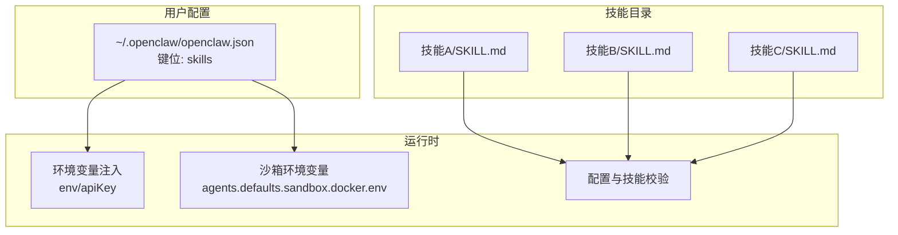
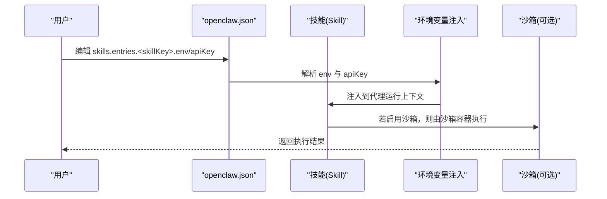
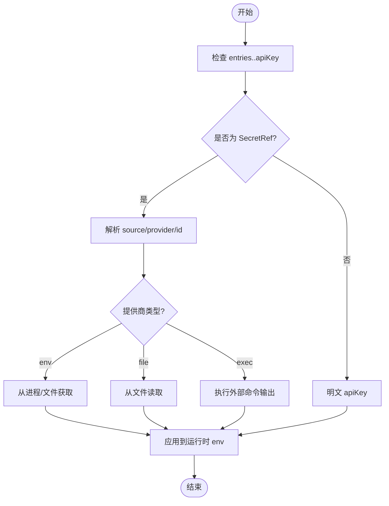
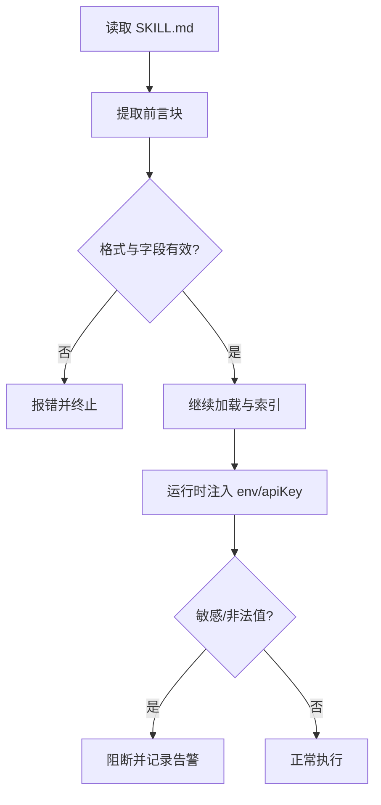
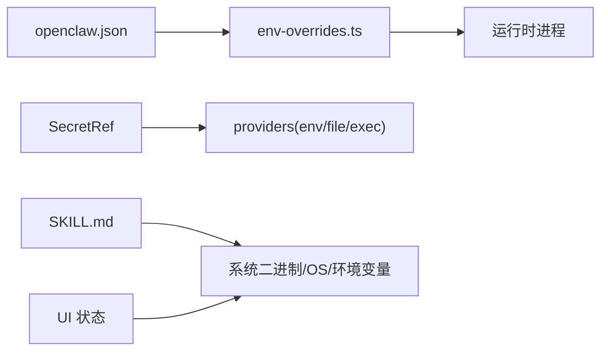

# 技能配置

## 目录
1. [简介](#简介)
2. [项目结构](#项目结构)
3. [核心组件](#核心组件)
4. [架构总览](#架构总览)
5. [详细组件分析](#详细组件分析)
6. [依赖关系分析](#依赖关系分析)
7. [性能考量](#性能考量)
8. [故障排查指南](#故障排查指南)
9. [结论](#结论)
10. [附录](#附录)

## 简介
本指南面向在 OpenClaw 中配置“技能（Skill）”的用户与维护者，系统性阐述以下内容：
- 技能配置文件 SKILL.md 的标准格式与必需字段
- 技能参数的配置方法：必填、可选与默认值
- 环境变量的使用与安全存储（含 SecretRef）
- 技能权限与沙箱策略、API 密钥管理
- 配置验证机制与错误处理
- 配置示例与最佳实践

## 项目结构
与技能配置直接相关的关键位置：
- 技能元数据与说明：位于各技能目录下的 SKILL.md（如 gemini、peekaboo、skill-creator）
- 全局技能配置入口：位于用户配置文件中，键位为 skills
- 环境变量与密钥注入：通过 skills.entries.&lt;skillKey&gt; 下的 env 与 apiKey 字段
- 沙箱运行时的环境变量注入：通过 agents.defaults.sandbox.docker.env 或自定义镜像
- 技能创建与校验工具：技能创建器与快速校验脚本

图示来源
- [docs/tools/skills-config.md](file://docs/tools/skills-config.md#L11-L78)
- [docs/gateway/configuration.md](file://docs/gateway/configuration.md#L449-L539)
- [skills/gemini/SKILL.md](file://skills/gemini/SKILL.md#L1-L44)
- [skills/peekaboo/SKILL.md](file://skills/peekaboo/SKILL.md#L1-L191)

章节来源
- [docs/tools/skills-config.md](file://docs/tools/skills-config.md#L11-L78)
- [docs/gateway/configuration.md](file://docs/gateway/configuration.md#L449-L539)

## 核心组件
- 技能配置根对象 skills
  - allowBundled：对“内置技能”的可安装白名单
  - load：扫描额外目录、是否监听变更、监听去抖间隔
  - install：安装偏好（Node 管理器、brew 优先）
  - entries.&lt;skillKey&gt;：按技能覆盖项，支持 enabled、env、apiKey
- 环境变量与密钥
  - env：为代理运行注入环境变量（仅在未被外部设置时生效）
  - apiKey：便捷字段，支持明文或 SecretRef 对象
  - SecretRef：source/provider/id 组合，支持 env/file/exec 提供商
- 沙箱与宿主差异
  - 宿主模式：全局 env 与 entries.&lt;skill&gt;.env/apiKey 生效
  - 沙箱模式：Docker 不继承宿主 process.env，需通过 agents.defaults.sandbox.docker.env 或自定义镜像注入

章节来源
- [docs/tools/skills-config.md](file://docs/tools/skills-config.md#L13-L78)
- [docs/gateway/configuration.md](file://docs/gateway/configuration.md#L449-L539)

## 架构总览
下图展示从配置到运行时环境注入的整体流程，以及与沙箱的关系。

图示来源
- [docs/tools/skills-config.md](file://docs/tools/skills-config.md#L26-L78)
- [docs/gateway/configuration.md](file://docs/gateway/configuration.md#L449-L539)

## 详细组件分析

### SKILL.md 标准格式与必需字段
- 文件位置：每个技能目录下的 SKILL.md
- 前言块（YAML）必需字段
  - name：字符串，小写字母、数字、连字符组成，最大长度限制
  - description：字符串，最多 1024 字符，不可包含尖括号
- 可选字段
  - metadata：开放字段，用于扩展技能元信息（例如 openclaw 扩展键）
  - allowed-tools：允许使用的工具清单
  - license：许可证信息
- 内容体：Markdown 指令与工作流说明
- 创建与校验
  - 使用技能创建器生成模板并填充必要字段
  - 快速校验脚本支持无 PyYAML 环境的回退解析，确保基本格式正确

章节来源
- [skills/gemini/SKILL.md](file://skills/gemini/SKILL.md#L1-L44)
- [skills/peekaboo/SKILL.md](file://skills/peekaboo/SKILL.md#L1-L191)
- [skills/skill-creator/SKILL.md](file://skills/skill-creator/SKILL.md#L46-L126)
- [skills/skill-creator/scripts/quick_validate.py](file://skills/skill-creator/scripts/quick_validate.py#L67-L159)

### 技能参数配置方法
- 必填参数
  - skills.entries.&lt;skillKey&gt;：当需要覆盖某技能行为时，至少应包含 enabled 字段
- 可选参数
  - env：注入环境变量（仅在未被外部设置时生效）
  - apiKey：便捷字段，支持明文或 SecretRef 对象
- 默认值与继承
  - enabled 默认值取决于技能来源与策略；若未显式设置，可能遵循全局策略
  - entries.&lt;skillKey&gt; 会覆盖全局策略与内置策略

章节来源
- [docs/tools/skills-config.md](file://docs/tools/skills-config.md#L26-L66)

### 环境变量与 SecretRef
- 明文注入
  - 在 entries.&lt;skillKey&gt;.env 中设置键值对
- SecretRef 对象
  - 支持 source/provider/id 三元组
  - 支持提供商：env（进程/文件）、file（文件路径）、exec（外部命令）
- 环境变量替换
  - 在任意字符串值中使用 $&#123;VAR_NAME&#125; 引用环境变量
  - 缺失或空变量会在加载时报错
- Shell 导入
  - 可启用从登录 shell 导入缺失的变量，超时可控

图示来源
- [docs/gateway/configuration.md](file://docs/gateway/configuration.md#L456-L539)

章节来源
- [docs/gateway/configuration.md](file://docs/gateway/configuration.md#L456-L539)

### 沙箱与宿主的环境变量差异
- 宿主模式
  - 全局 env 与 entries.&lt;skill&gt;.env/apiKey 仅对宿主运行生效
- 沙箱模式
  - Docker 容器不继承宿主 process.env
  - 通过 agents.defaults.sandbox.docker.env 或自定义镜像注入
- 适用场景
  - 需要隔离的技能执行建议启用沙箱，并在沙箱层注入所需环境变量

章节来源
- [docs/tools/skills-config.md](file://docs/tools/skills-config.md#L67-L78)
- [docs/gateway/configuration.md](file://docs/gateway/configuration.md#L449-L539)

### 技能权限与 API 密钥管理
- 运行时权限
  - 某些技能声明了系统二进制、操作系统、环境变量等前置条件
  - UI 层会汇总缺失项并提示（如 bin/env/os/config）
- 访问控制
  - 通过 channels.* 的 dmPolicy/groupPolicy 控制消息来源
  - 通过 tools.elevated.* 与命令访问组控制高危命令
- 密钥管理
  - 优先使用 SecretRef，避免明文写入配置
  - 通过 providers（env/file/exec）集中管理密钥来源

章节来源
- [ui/src/ui/views/skills-shared.ts](file://ui/src/ui/views/skills-shared.ts#L1-L52)
- [docs/gateway/configuration-reference.md](file://docs/gateway/configuration-reference.md#L18-L91)
- [docs/gateway/configuration.md](file://docs/gateway/configuration.md#L456-L539)

### 配置验证机制与错误处理
- 技能元数据校验
  - 快速校验脚本检查：前言块格式、必需字段、名称与描述约束
  - 回退解析器在缺少 PyYAML 时仍可用
- 运行时环境校验
  - 对敏感键进行拦截与告警
  - 对空字节等非法值进行阻断
- 状态检查
  - 服务端状态接口会返回技能配置检查结果，敏感值不会泄露

图示来源
- [skills/skill-creator/scripts/quick_validate.py](file://skills/skill-creator/scripts/quick_validate.py#L67-L159)
- [src/agents/skills/env-overrides.ts](file://src/agents/skills/env-overrides.ts#L92-L134)
- [src/gateway/server.skills-status.test.ts](file://src/gateway/server.skills-status.test.ts#L36-L49)

章节来源
- [skills/skill-creator/scripts/quick_validate.py](file://skills/skill-creator/scripts/quick_validate.py#L67-L159)
- [src/agents/skills/env-overrides.ts](file://src/agents/skills/env-overrides.ts#L92-L134)
- [src/gateway/server.skills-status.test.ts](file://src/gateway/server.skills-status.test.ts#L36-L49)

### 配置示例与最佳实践
- 示例：在 skills.entries.&lt;skillKey&gt; 中启用技能并注入密钥
  - 明文方式：直接设置 apiKey 为字符串
  - SecretRef 方式：指定 source/provider/id
- 最佳实践
  - 尽量使用 SecretRef 管理密钥
  - 仅在 entries.&lt;skill&gt;.env 中注入必要变量，避免污染全局
  - 在沙箱模式下，通过 agents.defaults.sandbox.docker.env 注入变量
  - 保持 SKILL.md 前言块最小化，复杂内容放入 references/ 资源文件
  - 使用技能创建器初始化与打包技能，确保结构一致

章节来源
- [docs/tools/skills-config.md](file://docs/tools/skills-config.md#L26-L66)
- [skills/skill-creator/SKILL.md](file://skills/skill-creator/SKILL.md#L46-L126)

## 依赖关系分析
- 配置到运行时的依赖
  - openclaw.json 的 skills.entries.&lt;skillKey&gt; 依赖于运行时环境注入模块
  - SecretRef 依赖于 providers（env/file/exec）实现
- 技能到系统资源的依赖
  - 某些技能声明了系统二进制、操作系统、环境变量等前置条件
  - UI 层根据缺失项进行聚合提示

图示来源
- [src/agents/skills/env-overrides.ts](file://src/agents/skills/env-overrides.ts#L92-L134)
- [ui/src/ui/views/skills-shared.ts](file://ui/src/ui/views/skills-shared.ts#L1-L52)

章节来源
- [src/agents/skills/env-overrides.ts](file://src/agents/skills/env-overrides.ts#L92-L134)
- [ui/src/ui/views/skills-shared.ts](file://ui/src/ui/views/skills-shared.ts#L1-L52)

## 性能考量
- 监听与热重载
  - 启用 load.watch 并合理设置 watchDebounceMs，避免频繁刷新
- 沙箱启动成本
  - 沙箱模式会引入镜像拉取与容器启动开销，建议在需要隔离时启用
- 配置体积
  - 使用 $include 分割大型配置，减少单文件体积与解析时间

## 故障排查指南
- 配置严格校验
  - 未知键、类型错误、无效值会导致网关拒绝启动
  - 使用 doctor 命令查看具体问题并尝试修复
- 环境变量问题
  - 检查是否使用了不允许的敏感键
  - 确认 SecretRef 的提供商与凭据路径正确
- 沙箱变量未生效
  - 确认 agents.defaults.sandbox.docker.env 已正确注入
  - 自定义镜像中已包含所需变量
- 技能状态异常
  - 查看服务端技能状态接口，确认配置检查项与缺失项
  - 关注 UI 层聚合的缺失提示（bin/env/os/config）

章节来源
- [docs/gateway/configuration.md](file://docs/gateway/configuration.md#L61-L73)
- [src/gateway/server.skills-status.test.ts](file://src/gateway/server.skills-status.test.ts#L36-L49)

## 结论
- SKILL.md 是技能能力与触发条件的唯一权威来源，务必保证前言块格式与字段合规
- 技能配置以 openclaw.json 的 skills 为中心，通过 entries.&lt;skillKey&gt; 实现细粒度覆盖
- 环境变量与密钥管理应优先采用 SecretRef，并结合 providers 进行集中治理
- 沙箱模式下需单独注入环境变量，避免宿主与容器环境混淆
- 通过快速校验与运行时校验双保险，确保配置质量与安全性

## 附录
- 相关参考
  - 技能配置任务导向概览与完整参考
  - 渠道配置与模型配置参考
  - 环境变量与 SecretRef 管理

章节来源
- [docs/tools/skills-config.md](file://docs/tools/skills-config.md#L1-L78)
- [docs/tools/creating-skills.md](file://docs/tools/creating-skills.md#L1-L59)
- [docs/gateway/configuration.md](file://docs/gateway/configuration.md#L1-L547)
- [docs/gateway/configuration-reference.md](file://docs/gateway/configuration-reference.md#L1-L800)