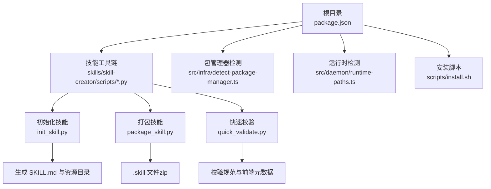
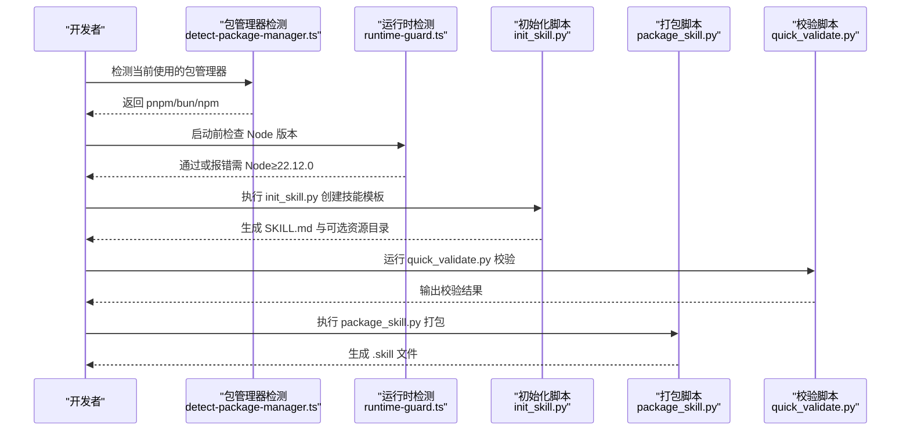
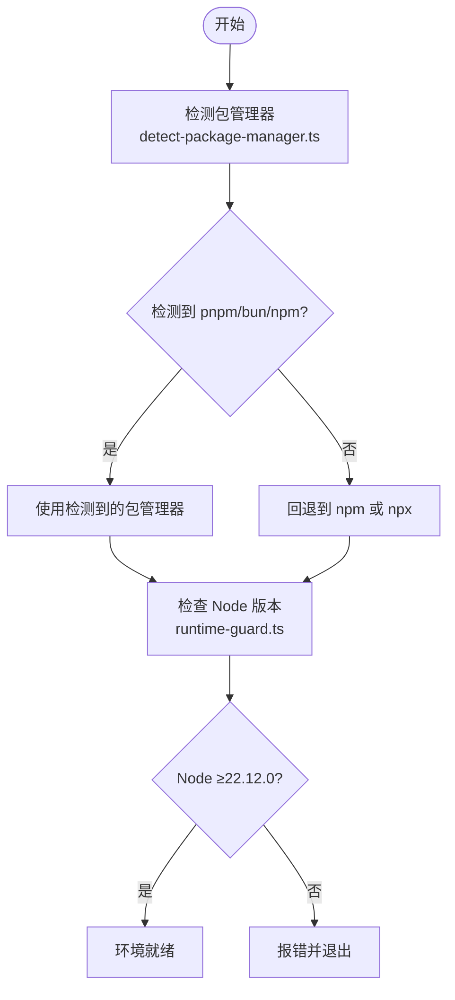
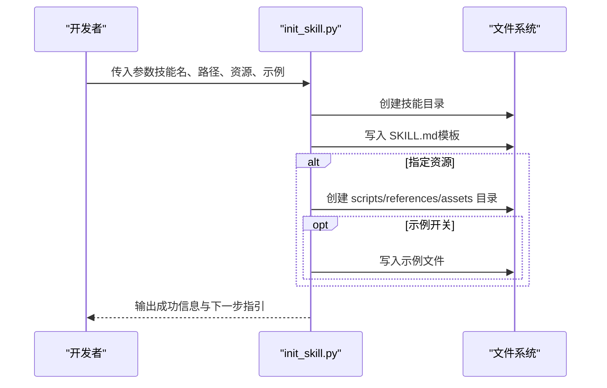
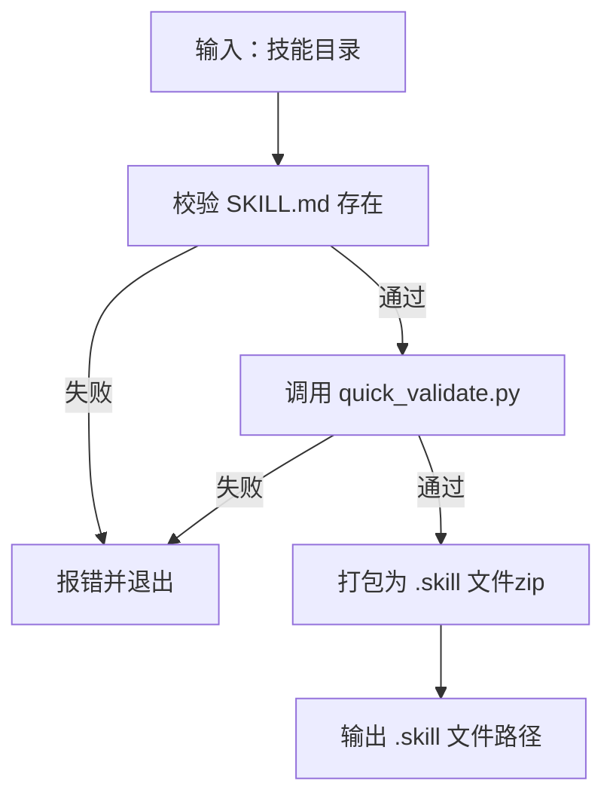
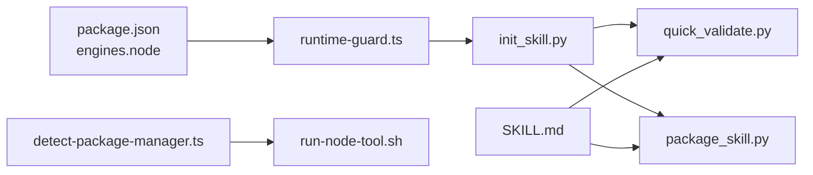

# 开发环境搭建

## 目录
1. [简介](#简介)
2. [项目结构](#项目结构)
3. [核心组件](#核心组件)
4. [架构总览](#架构总览)
5. [详细组件分析](#详细组件分析)
6. [依赖关系分析](#依赖关系分析)
7. [性能考虑](#性能考虑)
8. [故障排查指南](#故障排查指南)
9. [结论](#结论)

## 简介
本指南面向希望在 OpenClaw 技能开发环境中进行开发的工程师，系统讲解以下内容：
- 开发工具与运行时要求：Node.js 版本、包管理器选择与配置
- 技能创建工具链：init_skill.py 的安装、配置与使用
- 技能目录结构与组织原则：必需文件与可选资源目录
- 环境验证与测试：如何验证开发环境是否正确配置

## 项目结构
OpenClaw 采用多语言混合工程：核心以 TypeScript/JavaScript 实现，技能工具链包含 Python 脚本，文档与安装脚本覆盖 Shell 等。技能开发相关的关键位置如下：
- 根级包管理与运行时约束：package.json 中定义 Node 引擎版本、脚本与工作区
- 技能工具链：skills/skill-creator/scripts 下的 Python 初始化、打包与校验脚本
- 技能规范与模板：skills/skill-creator/SKILL.md
- 包管理器检测与工具调用：src/infra/detect-package-manager.ts、scripts/pre-commit/run-node-tool.sh
- Node.js 运行时检测与版本校验：src/daemon/runtime-paths.ts、apps/macos/Sources/OpenClaw/RuntimeLocator.swift、src/infra/runtime-guard.ts、scripts/install.sh
- 非交互式技能安装配置：src/commands/onboard-non-interactive/local/skills-config.ts

图表来源
- [package.json](file://package.json#L1-L458)
- [skills/skill-creator/scripts/init_skill.py](file://skills/skill-creator/scripts/init_skill.py#L1-L379)
- [skills/skill-creator/scripts/package_skill.py](file://skills/skill-creator/scripts/package_skill.py#L1-L140)
- [skills/skill-creator/scripts/quick_validate.py](file://skills/skill-creator/scripts/quick_validate.py#L1-L160)
- [src/infra/detect-package-manager.ts](file://src/infra/detect-package-manager.ts#L1-L29)
- [src/daemon/runtime-paths.ts](file://src/daemon/runtime-paths.ts#L38-L87)
- [scripts/install.sh](file://scripts/install.sh#L1252-L1428)

章节来源
- [package.json](file://package.json#L1-L458)
- [README.md](file://README.md#L1-L560)

## 核心组件
- Node.js 运行时与引擎版本
  - 最低版本要求：Node ≥22.12.0
  - 根级 package.json 指定 engines.node
  - 多处运行时检测与错误提示确保满足最低版本
- 包管理器支持
  - 支持 npm、pnpm、bun；优先 pnpm 用于构建，Bun 可选用于直接运行 TypeScript
  - 包管理器检测逻辑与 pre-commit 工具调用脚本
- 技能工具链
  - init_skill.py：创建技能模板与资源目录
  - package_skill.py：将技能打包为 .skill 文件（zip）
  - quick_validate.py：最小化校验技能规范与前端元数据
- 技能规范与模板
  - SKILL.md 提供技能结构、资源目录与命名约定

章节来源
- [package.json](file://package.json#L416-L418)
- [src/infra/detect-package-manager.ts](file://src/infra/detect-package-manager.ts#L1-L29)
- [scripts/pre-commit/run-node-tool.sh](file://scripts/pre-commit/run-node-tool.sh#L1-L31)
- [src/daemon/runtime-paths.ts](file://src/daemon/runtime-paths.ts#L38-L87)
- [apps/macos/Sources/OpenClaw/RuntimeLocator.swift](file://apps/macos/Sources/OpenClaw/RuntimeLocator.swift#L87-L113)
- [src/infra/runtime-guard.ts](file://src/infra/runtime-guard.ts#L56-L99)
- [scripts/install.sh](file://scripts/install.sh#L1252-L1428)
- [skills/skill-creator/scripts/init_skill.py](file://skills/skill-creator/scripts/init_skill.py#L1-L379)
- [skills/skill-creator/scripts/package_skill.py](file://skills/skill-creator/scripts/package_skill.py#L1-L140)
- [skills/skill-creator/scripts/quick_validate.py](file://skills/skill-creator/scripts/quick_validate.py#L1-L160)
- [skills/skill-creator/SKILL.md](file://skills/skill-creator/SKILL.md#L1-L373)

## 架构总览
下图展示从环境准备到技能创建与验证的整体流程。

图表来源
- [src/infra/detect-package-manager.ts](file://src/infra/detect-package-manager.ts#L1-L29)
- [src/infra/runtime-guard.ts](file://src/infra/runtime-guard.ts#L56-L99)
- [skills/skill-creator/scripts/init_skill.py](file://skills/skill-creator/scripts/init_skill.py#L1-L379)
- [skills/skill-creator/scripts/package_skill.py](file://skills/skill-creator/scripts/package_skill.py#L1-L140)
- [skills/skill-creator/scripts/quick_validate.py](file://skills/skill-creator/scripts/quick_validate.py#L1-L160)

## 详细组件分析

### 组件一：Node.js 运行时与包管理器
- 运行时要求
  - 根级 package.json 声明 engines.node ≥22.12.0
  - 多处运行时检测与错误提示确保满足最低版本
- 包管理器支持
  - 支持 npm、pnpm、bun；优先 pnpm 用于构建，Bun 可选用于直接运行 TypeScript
  - pre-commit 工具调用脚本按顺序尝试 pnpm、bun、npm、npx
  - 包管理器检测逻辑根据 package.json 的 packageManager 字段与锁文件推断

图表来源
- [src/infra/detect-package-manager.ts](file://src/infra/detect-package-manager.ts#L1-L29)
- [scripts/pre-commit/run-node-tool.sh](file://scripts/pre-commit/run-node-tool.sh#L1-L31)
- [src/infra/runtime-guard.ts](file://src/infra/runtime-guard.ts#L56-L99)

章节来源
- [package.json](file://package.json#L416-L418)
- [src/infra/detect-package-manager.ts](file://src/infra/detect-package-manager.ts#L1-L29)
- [scripts/pre-commit/run-node-tool.sh](file://scripts/pre-commit/run-node-tool.sh#L1-L31)
- [src/daemon/runtime-paths.ts](file://src/daemon/runtime-paths.ts#L38-L87)
- [apps/macos/Sources/OpenClaw/RuntimeLocator.swift](file://apps/macos/Sources/OpenClaw/RuntimeLocator.swift#L87-L113)
- [src/infra/runtime-guard.ts](file://src/infra/runtime-guard.ts#L56-L99)
- [scripts/install.sh](file://scripts/install.sh#L1252-L1428)

### 组件二：技能创建工具链（init_skill.py）
- 功能概述
  - 创建技能目录与模板 SKILL.md
  - 可选创建资源目录：scripts、references、assets
  - 可选生成示例文件
- 使用要点
  - 必须提供技能名称与输出路径
  - 可通过 --resources 指定资源类型（逗号分隔）
  - --examples 仅在指定 --resources 时生效
  - 名称规范化为小写连字符形式，长度限制为 64 字符以内
- 输出与后续步骤
  - 成功后提示下一步：编辑 SKILL.md、添加资源、运行验证脚本

图表来源
- [skills/skill-creator/scripts/init_skill.py](file://skills/skill-creator/scripts/init_skill.py#L255-L317)

章节来源
- [skills/skill-creator/scripts/init_skill.py](file://skills/skill-creator/scripts/init_skill.py#L1-L379)
- [skills/skill-creator/SKILL.md](file://skills/skill-creator/SKILL.md#L263-L293)

### 组件三：技能打包与校验（package_skill.py 与 quick_validate.py）
- 打包流程
  - 校验技能目录存在且包含 SKILL.md
  - 调用 quick_validate.py 执行最小化校验
  - 将技能目录压缩为 .skill 文件（zip），排除特定目录与符号链接
- 校验规则
  - 必须存在 SKILL.md
  - 前端元数据（name、description 等）格式与取值范围校验
  - 名称必须为小写连字符，长度不超过 64；描述长度不超过 1024，不含尖括号

图表来源
- [skills/skill-creator/scripts/package_skill.py](file://skills/skill-creator/scripts/package_skill.py#L28-L111)
- [skills/skill-creator/scripts/quick_validate.py](file://skills/skill-creator/scripts/quick_validate.py#L67-L149)

章节来源
- [skills/skill-creator/scripts/package_skill.py](file://skills/skill-creator/scripts/package_skill.py#L1-L140)
- [skills/skill-creator/scripts/quick_validate.py](file://skills/skill-creator/scripts/quick_validate.py#L1-L160)

### 组件四：技能目录结构与组织原则
- 必需文件
  - SKILL.md：包含 YAML 前端元数据（name、description 等），正文为使用说明
- 可选资源目录
  - scripts/：可执行代码（Python/Bash 等），适合重复使用与确定性任务
  - references/：按需加载的参考文档，避免 SKILL.md 过长
  - assets/：输出中使用的资源文件（模板、图标、字体等）
- 命名与触发
  - 技能名称应为小写连字符，长度不超过 64；description 作为触发条件的重要依据

章节来源
- [skills/skill-creator/SKILL.md](file://skills/skill-creator/SKILL.md#L46-L126)

### 组件五：非交互式技能安装配置
- 支持的包管理器：npm、pnpm、bun
- 配置注入：在非交互式引导中可设置 skills.install.nodeManager，影响技能安装行为

章节来源
- [src/commands/onboard-non-interactive/local/skills-config.ts](file://src/commands/onboard-non-interactive/local/skills-config.ts#L1-L31)

## 依赖关系分析
- 运行时与包管理器
  - package.json 声明 Node 引擎版本
  - detect-package-manager.ts 与 run-node-tool.sh 协同决定工具链调用
  - runtime-guard.ts 在启动前强制校验 Node 版本
- 技能工具链
  - init_skill.py 与 quick_validate.py/ package_skill.py 形成“创建-校验-打包”的闭环
  - SKILL.md 为工具链与后续流程的契约

图表来源
- [package.json](file://package.json#L416-L418)
- [src/infra/detect-package-manager.ts](file://src/infra/detect-package-manager.ts#L1-L29)
- [scripts/pre-commit/run-node-tool.sh](file://scripts/pre-commit/run-node-tool.sh#L1-L31)
- [src/infra/runtime-guard.ts](file://src/infra/runtime-guard.ts#L56-L99)
- [skills/skill-creator/scripts/init_skill.py](file://skills/skill-creator/scripts/init_skill.py#L1-L379)
- [skills/skill-creator/scripts/quick_validate.py](file://skills/skill-creator/scripts/quick_validate.py#L1-L160)
- [skills/skill-creator/scripts/package_skill.py](file://skills/skill-creator/scripts/package_skill.py#L1-L140)
- [skills/skill-creator/SKILL.md](file://skills/skill-creator/SKILL.md#L1-L373)

章节来源
- [package.json](file://package.json#L1-L458)
- [src/infra/detect-package-manager.ts](file://src/infra/detect-package-manager.ts#L1-L29)
- [scripts/pre-commit/run-node-tool.sh](file://scripts/pre-commit/run-node-tool.sh#L1-L31)
- [src/infra/runtime-guard.ts](file://src/infra/runtime-guard.ts#L56-L99)
- [skills/skill-creator/scripts/init_skill.py](file://skills/skill-creator/scripts/init_skill.py#L1-L379)
- [skills/skill-creator/scripts/quick_validate.py](file://skills/skill-creator/scripts/quick_validate.py#L1-L160)
- [skills/skill-creator/scripts/package_skill.py](file://skills/skill-creator/scripts/package_skill.py#L1-L140)
- [skills/skill-creator/SKILL.md](file://skills/skill-creator/SKILL.md#L1-L373)

## 性能考虑
- 使用 pnpm 作为默认构建工具，提升安装与缓存效率
- Bun 可用于直接运行 TypeScript，缩短热更新循环（部分脚本仍硬编码 pnpm）
- 技能打包采用 ZIP 压缩，建议仅包含必要资源，避免过大的 assets 目录

## 故障排查指南
- Node 版本不满足要求
  - 症状：启动时报错，提示需要 Node ≥22.12.0
  - 排查：确认已安装 Node，并查看版本；参考安装脚本中的版本解析与升级逻辑
- 包管理器未找到或工具链不可用
  - 症状：pre-commit 工具调用失败
  - 排查：确认 pnpm/bun/npm 已安装；检查 PATH；必要时使用 run-node-tool.sh 自动选择
- 技能校验失败
  - 症状：quick_validate.py 报告前端元数据格式或取值错误
  - 排查：检查 SKILL.md 的 YAML 前端元数据，确保 name、description 符合规范
- 打包失败
  - 症状：package_skill.py 报告缺少 SKILL.md 或发现符号链接
  - 排查：确认技能目录结构完整；移除符号链接；确保输出目录不在技能根内

章节来源
- [src/infra/runtime-guard.ts](file://src/infra/runtime-guard.ts#L76-L99)
- [scripts/install.sh](file://scripts/install.sh#L1252-L1428)
- [scripts/pre-commit/run-node-tool.sh](file://scripts/pre-commit/run-node-tool.sh#L1-L31)
- [skills/skill-creator/scripts/quick_validate.py](file://skills/skill-creator/scripts/quick_validate.py#L67-L149)
- [skills/skill-creator/scripts/package_skill.py](file://skills/skill-creator/scripts/package_skill.py#L28-L111)

## 结论
通过遵循本指南，您可以完成 OpenClaw 技能开发环境的搭建与验证：
- 确保 Node.js 版本满足 ≥22.12.0，并正确配置包管理器（npm/pnpm/bun）
- 使用 init_skill.py 快速生成技能模板与资源目录
- 通过 quick_validate.py 与 package_skill.py 完成技能校验与打包
- 严格遵守 SKILL.md 与资源目录的组织原则，保证技能可维护性与可复用性