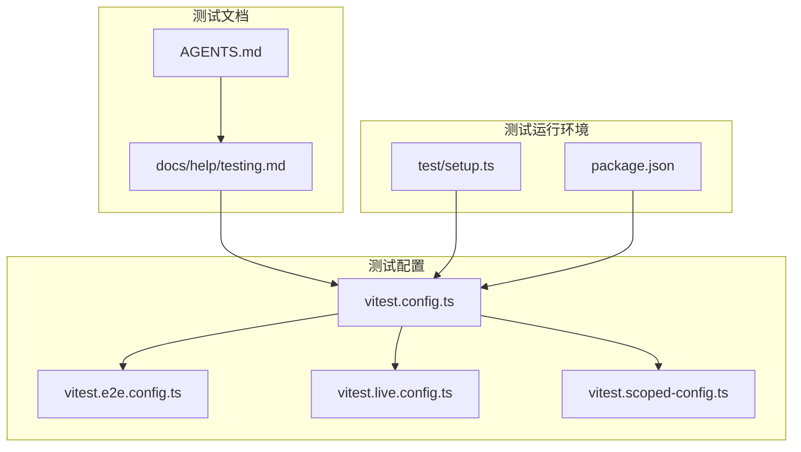
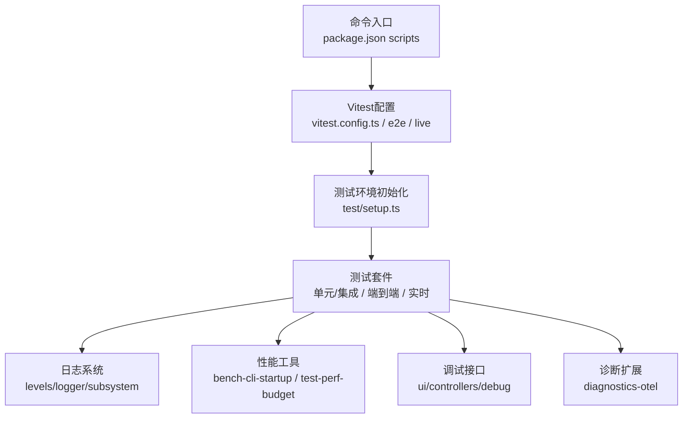
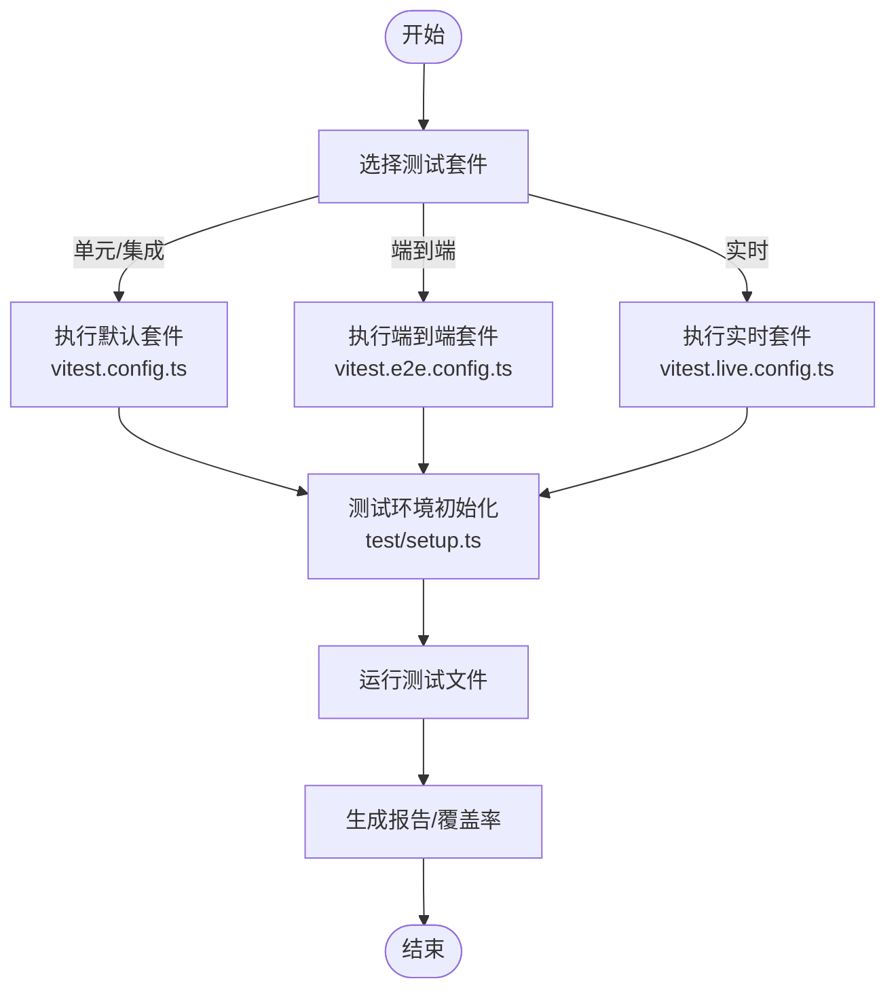
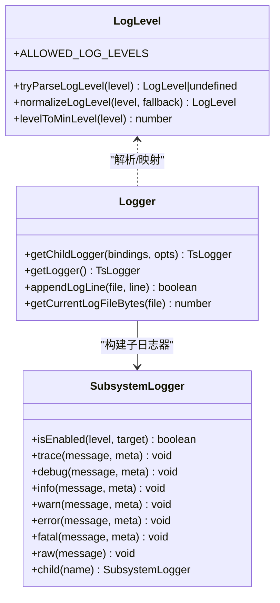
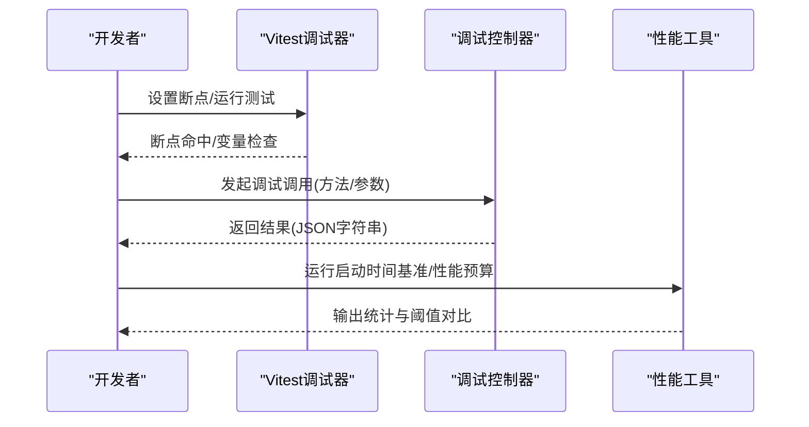
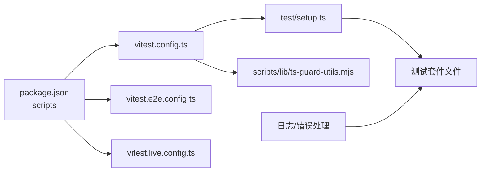

# 技能测试和调试

## 目录
1. [简介](#简介)
2. [项目结构](#项目结构)
3. [核心组件](#核心组件)
4. [架构总览](#架构总览)
5. [详细组件分析](#详细组件分析)
6. [依赖关系分析](#依赖关系分析)
7. [性能考量](#性能考量)
8. [故障排查指南](#故障排查指南)
9. [结论](#结论)
10. [附录](#附录)

## 简介
本指南面向OpenClaw技能开发与维护者，系统阐述技能测试策略与调试方法，涵盖单元测试、集成测试与端到端测试的实施要点；介绍日志记录、断点调试与性能分析工具；给出测试用例设计原则与编写规范；并总结常见问题的排查路径与解决方案，包括性能瓶颈、内存泄漏与兼容性问题。

## 项目结构
OpenClaw采用多包工作区与分层模块化组织，测试体系由Vitest驱动，按“单元/集成—端到端—实时”三层套件划分，并辅以Docker运行器验证跨平台与真实环境行为。

**图表来源**
- [vitest.config.ts](file://vitest.config.ts#L57-L202)
- [vitest.e2e.config.ts](file://vitest.e2e.config.ts#L1-L33)
- [vitest.live.config.ts](file://vitest.live.config.ts#L1-L17)
- [vitest.scoped-config.ts](file://vitest.scoped-config.ts#L1-L17)
- [docs/help/testing.md](file://docs/help/testing.md#L10-L412)
- [AGENTS.md](file://AGENTS.md#L128-L141)
- [test/setup.ts](file://test/setup.ts#L1-L195)
- [package.json](file://package.json#L305-L322)

**章节来源**
- [vitest.config.ts](file://vitest.config.ts#L57-L202)
- [vitest.e2e.config.ts](file://vitest.e2e.config.ts#L1-L33)
- [vitest.live.config.ts](file://vitest.live.config.ts#L1-L17)
- [vitest.scoped-config.ts](file://vitest.scoped-config.ts#L1-L17)
- [docs/help/testing.md](file://docs/help/testing.md#L10-L412)
- [AGENTS.md](file://AGENTS.md#L128-L141)
- [test/setup.ts](file://test/setup.ts#L1-L195)
- [package.json](file://package.json#L305-L322)

## 核心组件
- 测试框架与覆盖率
  - 使用Vitest，V8覆盖率阈值：行/分支/函数/语句均为70%（部分场景可放宽至55%）。排除策略明确，仅统计被测试套件实际覆盖的源码。
- 测试套件与运行策略
  - 单元/集成：默认套件，进程内集成与确定性回归，强调速度与稳定性。
  - 端到端：多实例网关行为、WebSocket/HTTP表面、节点配对与重网络交互。
  - 实时：真实提供商与模型，包含“直连模型”与“网关烟雾测试”，支持工具调用与图像探测。
- 运行环境与隔离
  - 统一的测试环境初始化脚本，隔离用户态配置目录，安装全局警告过滤，避免跨文件污染。
- 日志与可观测性
  - 结构化日志、子系统日志、级别解析与最小级别映射、文件滚动与子日志器构建。
- 性能与基准
  - 启动时间基准脚本与性能预算工具，支持统计量汇总与回归阈值控制。
- 调试与诊断
  - 网关调试接口控制器、诊断扩展（OTEL导出）、错误图谱收集与敏感信息脱敏。

**章节来源**
- [vitest.config.ts](file://vitest.config.ts#L101-L200)
- [docs/help/testing.md](file://docs/help/testing.md#L42-L94)
- [AGENTS.md](file://AGENTS.md#L128-L141)
- [test/setup.ts](file://test/setup.ts#L1-L195)
- [src/logging/levels.ts](file://src/logging/levels.ts#L1-L37)
- [src/logging/logger.ts](file://src/logging/logger.ts#L210-L233)
- [src/logging/subsystem.ts](file://src/logging/subsystem.ts#L1-L37)
- [scripts/bench-cli-startup.ts](file://scripts/bench-cli-startup.ts#L59-L111)
- [scripts/test-perf-budget.mjs](file://scripts/test-perf-budget.mjs#L98-L127)
- [extensions/diagnostics-otel/src/service.ts](file://extensions/diagnostics-otel/src/service.ts#L78-L587)
- [src/infra/errors.ts](file://src/infra/errors.ts#L1-L52)

## 架构总览
下图展示测试执行与调试链路的整体架构：从命令入口到Vitest配置，再到具体测试文件与辅助工具，最终输出结果与日志。

**图表来源**
- [package.json](file://package.json#L305-L322)
- [vitest.config.ts](file://vitest.config.ts#L57-L202)
- [vitest.e2e.config.ts](file://vitest.e2e.config.ts#L1-L33)
- [vitest.live.config.ts](file://vitest.live.config.ts#L1-L17)
- [test/setup.ts](file://test/setup.ts#L1-L195)
- [src/logging/levels.ts](file://src/logging/levels.ts#L1-L37)
- [src/logging/logger.ts](file://src/logging/logger.ts#L210-L233)
- [src/logging/subsystem.ts](file://src/logging/subsystem.ts#L1-L37)
- [scripts/bench-cli-startup.ts](file://scripts/bench-cli-startup.ts#L59-L111)
- [scripts/test-perf-budget.mjs](file://scripts/test-perf-budget.mjs#L98-L127)
- [ui/src/ui/controllers/debug.ts](file://ui/src/ui/controllers/debug.ts#L45-L60)
- [extensions/diagnostics-otel/src/service.ts](file://extensions/diagnostics-otel/src/service.ts#L78-L587)

## 详细组件分析

### 测试套件与运行策略
- 单元/集成（默认）
  - 命令：`pnpm test`
  - 配置：默认配置与并行脚本组合，包含扩展与网关专用配置
  - 文件：`src/**/*.test.ts`, `extensions/**/*.test.ts`
  - 特点：纯单元、进程内集成（认证、路由、工具、解析、配置）、已知问题确定性回归
  - 环境：CI稳定、无需真实密钥、快速稳定
- 端到端（网关冒烟）
  - 命令：`pnpm test:e2e`
  - 配置：独立配置，进程池，自适应工作线程，静默模式
  - 文件：`src/**/*.e2e.test.ts`
  - 特点：多实例网关、WS/HTTP、节点配对、重网络交互
  - 环境：CI可选、无需真实密钥、比单元更慢
- 实时（真实提供商+模型）
  - 命令：`pnpm test:live`
  - 配置：最大工作线程1，显式包含`src/**/*.live.test.ts`
  - 文件：`src/**/*.live.test.ts`
  - 特点：直连模型+网关烟雾测试、工具调用+图像探测、真实网络与配额
  - 环境：需真实密钥、成本与波动性高、建议窄化允许列表

**图表来源**
- [docs/help/testing.md](file://docs/help/testing.md#L42-L94)
- [vitest.config.ts](file://vitest.config.ts#L57-L202)
- [vitest.e2e.config.ts](file://vitest.e2e.config.ts#L1-L33)
- [vitest.live.config.ts](file://vitest.live.config.ts#L1-L17)
- [test/setup.ts](file://test/setup.ts#L1-L195)

**章节来源**
- [docs/help/testing.md](file://docs/help/testing.md#L42-L94)
- [vitest.config.ts](file://vitest.config.ts#L57-L202)
- [vitest.e2e.config.ts](file://vitest.e2e.config.ts#L1-L33)
- [vitest.live.config.ts](file://vitest.live.config.ts#L1-L17)
- [test/setup.ts](file://test/setup.ts#L1-L195)

### 测试用例设计原则与编写规范
- 命名规范
  - 源文件与测试文件一一对应，单元测试以`*.test.ts`命名，端到端以`*.e2e.test.ts`命名。
- 覆盖范围
  - 单元/集成：纯单元与进程内集成，重点覆盖关键逻辑与回归路径。
  - 端到端：网关多实例行为、WS/HTTP、节点配对与网络交互。
  - 实时：真实提供商与模型，工具调用与图像探测，优先窄化允许列表。
- 执行与隔离
  - 使用统一的测试环境初始化脚本，隔离用户态配置目录，安装全局警告过滤，避免跨文件污染。
- 并发与稳定性
  - 单元套件默认使用进程池，端到端强制进程池以避免VM状态泄漏；实时套件单工作线程保证确定性。
- 覆盖率与排除
  - 仅统计被测试套件实际覆盖的源码，排除入口、桥接与大型集成面，确保阈值稳定。

**章节来源**
- [docs/help/testing.md](file://docs/help/testing.md#L42-L94)
- [AGENTS.md](file://AGENTS.md#L128-L141)
- [test/setup.ts](file://test/setup.ts#L1-L195)
- [vitest.config.ts](file://vitest.config.ts#L101-L200)

### 日志记录与可观测性
- 日志级别与解析
  - 支持级别枚举与解析，提供最小级别映射，便于控制台与文件输出。
- 子系统日志
  - 提供子日志器构建与绑定，支持按子系统输出与过滤。
- 文件滚动与写入
  - 提供文件大小上限、当前文件大小读取与追加写入封装，保障日志持久化。
- 敏感信息脱敏
  - 错误对象图谱收集与敏感文本脱敏，降低泄露风险。

**图表来源**
- [src/logging/levels.ts](file://src/logging/levels.ts#L1-L37)
- [src/logging/logger.ts](file://src/logging/logger.ts#L210-L233)
- [src/logging/subsystem.ts](file://src/logging/subsystem.ts#L1-L37)

**章节来源**
- [src/logging/levels.ts](file://src/logging/levels.ts#L1-L37)
- [src/logging/logger.ts](file://src/logging/logger.ts#L210-L233)
- [src/logging/subsystem.ts](file://src/logging/subsystem.ts#L1-L37)
- [src/infra/errors.ts](file://src/infra/errors.ts#L1-L52)

### 断点调试与性能分析
- 断点调试
  - 使用Vitest内置断点能力，在测试文件中设置断点进行逐步调试。
  - 对于网关调试，可通过UI控制器发起调试调用，传参与结果均以JSON形式处理。
- 性能分析
  - 启动时间基准：统计多次启动耗时，计算平均、中位数、95分位等指标。
  - 性能预算：设定最大墙钟时间与基线回归阈值，超限即失败并输出详细统计。
- OTEL诊断
  - 诊断扩展支持HTTP/protobuf协议导出追踪、指标与日志，按服务名与采样率配置，记录队列深度、等待时间与会话状态等事件。

**图表来源**
- [ui/src/ui/controllers/debug.ts](file://ui/src/ui/controllers/debug.ts#L45-L60)
- [scripts/bench-cli-startup.ts](file://scripts/bench-cli-startup.ts#L59-L111)
- [scripts/test-perf-budget.mjs](file://scripts/test-perf-budget.mjs#L98-L127)
- [extensions/diagnostics-otel/src/service.ts](file://extensions/diagnostics-otel/src/service.ts#L78-L587)

**章节来源**
- [ui/src/ui/controllers/debug.ts](file://ui/src/ui/controllers/debug.ts#L45-L60)
- [scripts/bench-cli-startup.ts](file://scripts/bench-cli-startup.ts#L59-L111)
- [scripts/test-perf-budget.mjs](file://scripts/test-perf-budget.mjs#L98-L127)
- [extensions/diagnostics-otel/src/service.ts](file://extensions/diagnostics-otel/src/service.ts#L78-L587)

## 依赖关系分析
- 命令到配置
  - package.json中的测试脚本分别指向不同配置文件，实现套件级隔离与差异化运行策略。
- 配置到套件
  - 默认配置统一管理别名、包含/排除规则与覆盖率策略；端到端与实时配置在默认基础上限定包含文件与工作线程。
- 环境初始化
  - 测试环境脚本负责隔离用户态目录、安装警告过滤、注册插件测试桩与默认注册表，减少跨文件污染。
- 工具与辅助
  - TypeScript文件收集与类型判断工具用于测试文件扫描与筛选；日志与错误处理贯穿测试生命周期。

**图表来源**
- [package.json](file://package.json#L305-L322)
- [vitest.config.ts](file://vitest.config.ts#L57-L202)
- [vitest.e2e.config.ts](file://vitest.e2e.config.ts#L1-L33)
- [vitest.live.config.ts](file://vitest.live.config.ts#L1-L17)
- [test/setup.ts](file://test/setup.ts#L1-L195)
- [scripts/lib/ts-guard-utils.mjs](file://scripts/lib/ts-guard-utils.mjs#L16-L41)

**章节来源**
- [package.json](file://package.json#L305-L322)
- [vitest.config.ts](file://vitest.config.ts#L57-L202)
- [vitest.e2e.config.ts](file://vitest.e2e.config.ts#L1-L33)
- [vitest.live.config.ts](file://vitest.live.config.ts#L1-L17)
- [test/setup.ts](file://test/setup.ts#L1-L195)
- [scripts/lib/ts-guard-utils.mjs](file://scripts/lib/ts-guard-utils.mjs#L16-L41)

## 性能考量
- 启动时间基准
  - 通过多次同步启动测量耗时，输出平均、中位数、95分位与最值，便于定位启动阶段瓶颈。
- 性能预算
  - 支持最大墙钟时间与基于基线的回归阈值，超限则失败并打印详细统计，防止性能回退。
- 运行时优化
  - 单元套件在特定Node版本下使用vmForks提升文件启动速度；端到端强制进程池避免VM状态泄漏；实时套件单工作线程保证确定性。

**章节来源**
- [scripts/bench-cli-startup.ts](file://scripts/bench-cli-startup.ts#L59-L111)
- [scripts/test-perf-budget.mjs](file://scripts/test-perf-budget.mjs#L98-L127)
- [docs/help/testing.md](file://docs/help/testing.md#L56-L58)

## 故障排查指南
- 常见问题与定位
  - 性能瓶颈：使用启动时间基准与性能预算工具定位异常；结合日志子系统输出与最小级别过滤，聚焦关键路径。
  - 内存泄漏：端到端套件强制进程池，避免VM状态泄漏；若仍出现内存压力，参考测试配置中的工作线程与静默模式调整。
  - 兼容性问题：实时套件窄化允许列表，先验证单一模型/提供商，再逐步扩大；必要时使用Docker运行器在Linux环境下复现。
- 日志与错误
  - 使用子系统日志与最小级别映射，区分控制台与文件输出；对错误对象进行图谱收集与敏感信息脱敏，避免泄露。
- 调试接口
  - 通过UI控制器发起调试调用，传入方法与参数，捕获并展示返回结果或错误信息，辅助快速定位问题。

**章节来源**
- [scripts/test-perf-budget.mjs](file://scripts/test-perf-budget.mjs#L98-L127)
- [src/logging/subsystem.ts](file://src/logging/subsystem.ts#L1-L37)
- [src/infra/errors.ts](file://src/infra/errors.ts#L1-L52)
- [ui/src/ui/controllers/debug.ts](file://ui/src/ui/controllers/debug.ts#L45-L60)

## 结论
OpenClaw的测试与调试体系以Vitest为核心，配合明确的套件边界、严格的覆盖率策略与丰富的诊断工具，形成从单元到实时的全链路质量保障。遵循本文的测试设计原则与调试方法，可显著提升技能开发的稳定性与可维护性。

## 附录
- 命令速查
  - 单元/集成：`pnpm test`
  - 端到端：`pnpm test:e2e`
  - 实时：`pnpm test:live`
  - 覆盖率：`pnpm test:coverage`
  - Docker运行器：`pnpm test:docker:*`系列
- 关键配置
  - 默认配置：`vitest.config.ts`
  - 端到端配置：`vitest.e2e.config.ts`
  - 实时配置：`vitest.live.config.ts`
  - 环境初始化：`test/setup.ts`
  - 文档参考：`docs/help/testing.md`、`AGENTS.md`

**章节来源**
- [package.json](file://package.json#L305-L322)
- [docs/help/testing.md](file://docs/help/testing.md#L21-L36)
- [AGENTS.md](file://AGENTS.md#L128-L141)