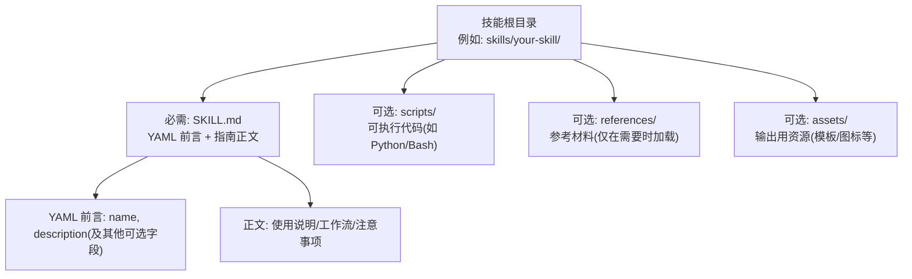
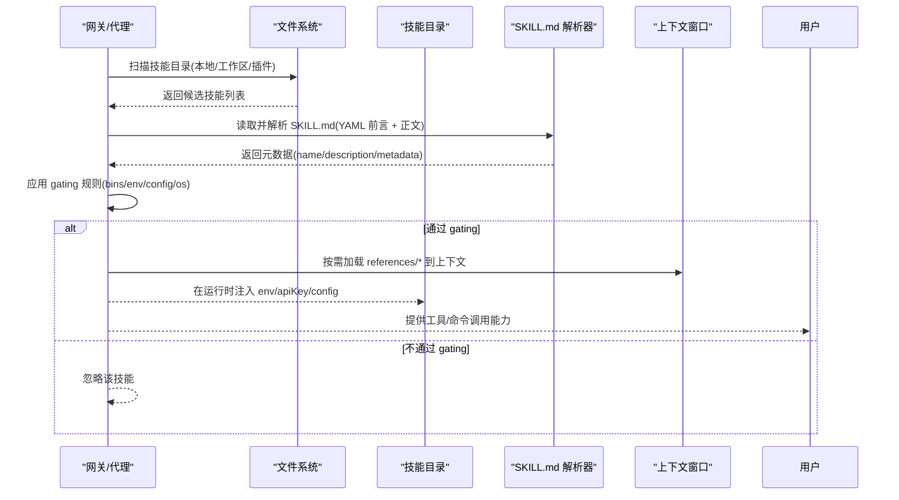
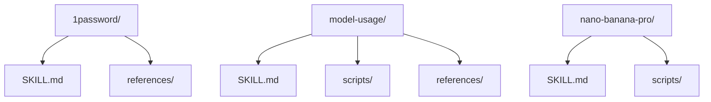
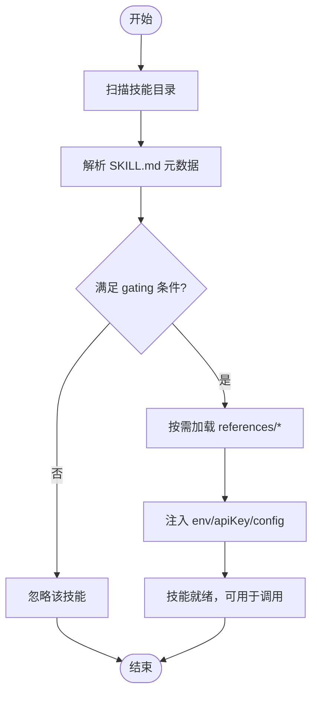

# 技能项目结构

## 目录
1. [简介](#简介)
2. [项目结构](#项目结构)
3. [核心组件](#核心组件)
4. [架构总览](#架构总览)
5. [详细组件分析](#详细组件分析)
6. [依赖关系分析](#依赖关系分析)
7. [性能考量](#性能考量)
8. [故障排查指南](#故障排查指南)
9. [结论](#结论)
10. [附录](#附录)

## 简介
本文件系统性说明 OpenClaw 技能（Skill）项目的标准结构与编写规范，覆盖以下要点：
- 技能目录的必备与可选组成：必需的 SKILL.md 文件、可选的 scripts/、references/ 和 assets/ 目录及其职责与组织方式
- 技能清单文件（SKILL.md）的 YAML 前言元数据字段定义、命名规范与描述要求
- 技能目录命名规则与最佳实践：文件组织、命名约定与目录层次设计原则
- 基于仓库中真实示例的结构化解读与可视化呈现

## 项目结构
OpenClaw 的技能以“技能目录”为单位进行管理，每个技能目录通常包含一个 SKILL.md 文件，以及按需组织的 scripts/、references/、assets/ 等资源目录。下图展示了技能目录的典型结构与各部分职责：

图表来源
- [skills/1password/SKILL.md](file://skills/1password/SKILL.md#L1-L71)
- [skills/skill-creator/SKILL.md](file://skills/skill-creator/SKILL.md#L46-L100)
- [skills/model-usage/SKILL.md](file://skills/model-usage/SKILL.md#L1-L70)
- [skills/nano-banana-pro/SKILL.md](file://skills/nano-banana-pro/SKILL.md#L1-L66)

章节来源
- [skills/1password/SKILL.md](file://skills/1password/SKILL.md#L1-L71)
- [skills/skill-creator/SKILL.md](file://skills/skill-creator/SKILL.md#L46-L100)
- [skills/model-usage/SKILL.md](file://skills/model-usage/SKILL.md#L1-L70)
- [skills/nano-banana-pro/SKILL.md](file://skills/nano-banana-pro/SKILL.md#L1-L66)

## 核心组件
- SKILL.md（必需）
  - YAML 前言：包含 name、description 等触发与元信息字段；可选 homepage、user-invocable、disable-model-invocation、command-dispatch 等
  - 正文：面向使用的 Markdown 指南，按需包含工作流、引用链接、注意事项等
- scripts/（可选）
  - 可执行代码集合，用于确定性任务或重复性逻辑，支持直接运行而无需加载到上下文窗口
- references/（可选）
  - 参考材料目录，按需加载到上下文，避免 SKILL.md 过长
- assets/（可选）
  - 输出阶段使用的资源文件，如模板、图标、字体等，不直接加载到上下文

章节来源
- [docs/tools/skills.md](file://docs/tools/skills.md#L78-L102)
- [skills/skill-creator/SKILL.md](file://skills/skill-creator/SKILL.md#L46-L100)
- [skills/1password/SKILL.md](file://skills/1password/SKILL.md#L1-L71)
- [skills/model-usage/SKILL.md](file://skills/model-usage/SKILL.md#L1-L70)
- [skills/nano-banana-pro/SKILL.md](file://skills/nano-banana-pro/SKILL.md#L1-L66)

## 架构总览
下图展示 OpenClaw 加载与使用技能的整体流程：从发现技能目录、解析 SKILL.md 元数据，到根据 gating 条件筛选、按需加载 references 资源，并在运行时注入环境变量与配置。

图表来源
- [docs/tools/skills.md](file://docs/tools/skills.md#L106-L187)
- [docs/tools/skills.md](file://docs/tools/skills.md#L189-L229)
- [docs/tools/skills.md](file://docs/tools/skills.md#L230-L246)

章节来源
- [docs/tools/skills.md](file://docs/tools/skills.md#L106-L187)
- [docs/tools/skills.md](file://docs/tools/skills.md#L189-L229)
- [docs/tools/skills.md](file://docs/tools/skills.md#L230-L246)

## 详细组件分析

### 组件A：技能清单文件（SKILL.md）的编写规范
- YAML 前言元数据
  - 必填字段
    - name：技能名称，应简洁明确，遵循命名规则（见后文）
    - description：技能用途与触发场景的简明描述，决定何时使用该技能
  - 可选字段（示例）
    - homepage：技能主页链接（用于 UI 展示）
    - user-invocable：是否作为用户可触发的斜杠命令暴露
    - disable-model-invocation：是否从模型提示中排除该技能
    - command-dispatch：当设置为 tool 时，斜杠命令直接分发到工具
    - command-tool：当 command-dispatch=tool 时指定工具名
    - command-arg-mode：raw 表示将原始参数字符串传递给工具
  - metadata.openclaw（单行 JSON 对象）
    - emoji：UI 显示的图标
    - os：平台过滤列表(darwin/linux/win32)
    - requires.bins/anyBins：二进制依赖检查
    - requires.env：环境变量存在性检查（或可在配置中提供）
    - requires.config：openclaw.json 中的路径检查
    - primaryEnv：与 skills.entries.&lt;name&gt;.apiKey 关联的主密钥环境变量
    - install：安装器规格数组（brew/node/go/uv/download 等）
- 正文内容
  - 指南性说明、工作流步骤、引用链接、注意事项等
  - 避免冗长，保持“渐进披露”：先加载元数据，再按需加载正文与资源

章节来源
- [docs/tools/skills.md](file://docs/tools/skills.md#L78-L102)
- [docs/tools/skills.md](file://docs/tools/skills.md#L106-L187)
- [docs/tools/skills.md](file://docs/tools/skills.md#L189-L229)
- [skills/1password/SKILL.md](file://skills/1password/SKILL.md#L1-L71)
- [skills/model-usage/SKILL.md](file://skills/model-usage/SKILL.md#L1-L70)
- [skills/nano-banana-pro/SKILL.md](file://skills/nano-banana-pro/SKILL.md#L1-L66)

### 组件B：可选目录 scripts/、references/、assets/ 的作用与组织
- scripts/
  - 用途：存放可执行代码（Python/Bash 等），适合需要确定性与可复用性的任务
  - 最佳实践：仅在必要时包含；可被直接运行而无需加载到上下文
- references/
  - 用途：存放参考材料，按需加载到上下文，避免 SKILL.md 过长
  - 最佳实践：大文档建议提供搜索模式；避免与 SKILL.md 重复；保持一级目录结构清晰
- assets/
  - 用途：输出阶段使用的资源文件（模板、图标、字体等），不直接加载到上下文
  - 最佳实践：与文档分离，便于在最终输出中使用而不占用上下文

章节来源
- [skills/skill-creator/SKILL.md](file://skills/skill-creator/SKILL.md#L70-L100)
- [skills/model-usage/SKILL.md](file://skills/model-usage/SKILL.md#L1-L70)
- [skills/nano-banana-pro/SKILL.md](file://skills/nano-banana-pro/SKILL.md#L1-L66)

### 组件C：技能目录命名规则与最佳实践
- 命名规则
  - 仅允许小写字母、数字与连字符
  - 推荐短小、动词开头的短语
  - 当有助于清晰度或触发时可加工具前缀（如 gh-、linear-）
  - 技能目录名应与技能 name 一致
- 目录层次设计原则
  - 以“单一职责”组织：一个技能目录聚焦一个领域或任务
  - 渐进披露：将核心流程保留在 SKILL.md，细节放入 references/，可执行逻辑放入 scripts/
  - 资源分离：assets/ 仅放输出用文件，避免与文档混杂

章节来源
- [skills/skill-creator/SKILL.md](file://skills/skill-creator/SKILL.md#L214-L221)
- [docs/tools/creating-skills.md](file://docs/tools/creating-skills.md#L21-L25)
- [skills/skill-creator/SKILL.md](file://skills/skill-creator/SKILL.md#L46-L61)

### 组件D：基于示例的结构解读
- 示例1：1password 技能
  - 结构：SKILL.md + references/（CLI 使用与示例）
  - 元数据：包含 openclaw.emoji、requires.bins、install 等
  - 特点：强调安全与 tmux 会话约束
- 示例2：model-usage 技能
  - 结构：SKILL.md + scripts/（model_usage.py）+ references/（codexbar-cli.md）
  - 元数据：包含 openclaw.os、requires.bins、install 等
  - 特点：通过脚本实现对本地成本日志的汇总
- 示例3：nano-banana-pro 技能
  - 结构：SKILL.md + scripts/（generate_image.py）
  - 元数据：包含 openclaw.emoji、requires.env、primaryEnv、install 等
  - 特点：提供图像生成/编辑的多场景用法与分辨率/比例说明

图表来源
- [skills/1password/SKILL.md](file://skills/1password/SKILL.md#L1-L71)
- [skills/model-usage/SKILL.md](file://skills/model-usage/SKILL.md#L1-L70)
- [skills/nano-banana-pro/SKILL.md](file://skills/nano-banana-pro/SKILL.md#L1-L66)

章节来源
- [skills/1password/SKILL.md](file://skills/1password/SKILL.md#L1-L71)
- [skills/model-usage/SKILL.md](file://skills/model-usage/SKILL.md#L1-L70)
- [skills/nano-banana-pro/SKILL.md](file://skills/nano-banana-pro/SKILL.md#L1-L66)

### 组件E：技能加载与 gating 流程

图表来源
- [docs/tools/skills.md](file://docs/tools/skills.md#L106-L187)
- [docs/tools/skills.md](file://docs/tools/skills.md#L189-L229)
- [docs/tools/skills.md](file://docs/tools/skills.md#L230-L246)

章节来源
- [docs/tools/skills.md](file://docs/tools/skills.md#L106-L187)
- [docs/tools/skills.md](file://docs/tools/skills.md#L189-L229)
- [docs/tools/skills.md](file://docs/tools/skills.md#L230-L246)

## 依赖关系分析
- 技能与外部依赖
  - 二进制依赖：通过 metadata.openclaw.requires.bins/anyBins 检查 PATH 或容器内可用性
  - 环境变量：通过 requires.env 或配置提供
  - 配置项：通过 openclaw.json 中的 skills.entries.&lt;name&gt; 提供
- 插件与技能
  - 插件可通过 openclaw.plugin.json 声明 skills 目录，参与常规优先级与 gating
- 安全与沙箱
  - gating 时检查 host 与容器内的二进制可用性
  - secrets 注入仅在当前 agent 运行期生效，避免污染全局环境

章节来源
- [docs/tools/skills.md](file://docs/tools/skills.md#L106-L187)
- [docs/tools/skills.md](file://docs/tools/skills.md#L189-L229)
- [docs/tools/skills.md](file://docs/tools/skills.md#L138-L147)

## 性能考量
- 上下文开销控制
  - 元数据始终在上下文中（约 100 字），正文按需加载（建议 &lt;5k 字），资源按需加载（脚本可直接执行）
  - 技能列表注入到系统提示的成本是确定性的，字符数与技能数量及字段长度相关
- 缓存与热重载
  - 会话开始时快照可复用；支持监视器自动刷新（watch/watchDebounceMs）

章节来源
- [skills/skill-creator/SKILL.md](file://skills/skill-creator/SKILL.md#L113-L126)
- [docs/tools/skills.md](file://docs/tools/skills.md#L269-L286)
- [docs/tools/skills.md](file://docs/tools/skills.md#L254-L267)

## 故障排查指南
- 常见问题与定位
  - 技能未被加载：检查 gating（bins/env/config/os）是否满足；确认目录名与 name 一致
  - 二进制不可用：确认 host 与容器内均具备所需二进制；必要时通过 install 规格或 sandbox.setupCommand 安装
  - secrets 未注入：核对 openclaw.json 中的 skills.entries.&lt;name&gt;.env/apiKey 设置；注意仅在当前运行期生效
  - 资源未加载：确认 references/* 是否被正确引用；避免与 SKILL.md 重复
- 实操建议
  - 使用 openclaw agent --message "use my new skill" 进行本地测试
  - 通过 clawhub 安装/更新技能，确保来源可信并已阅读

章节来源
- [docs/tools/skills.md](file://docs/tools/skills.md#L69-L77)
- [docs/tools/skills.md](file://docs/tools/skills.md#L189-L229)
- [docs/tools/creating-skills.md](file://docs/tools/creating-skills.md#L46-L54)

## 结论
OpenClaw 技能体系以“最小必要 + 渐进披露”为核心设计思想：以 SKILL.md 的 YAML 前言承载触发与元信息，正文与资源按需加载，配合 gating 机制实现安全可控的扩展。通过 scripts/、references/、assets/ 的清晰分工，既能保证上下文效率，又能满足复杂领域的可复用需求。遵循本文的命名与组织规范，可显著提升技能的可维护性与可发现性。

## 附录
- 快速参考
  - 目录命名：小写、数字、连字符；推荐动词开头；与 name 一致
  - 必备文件：SKILL.md（含 YAML 前言）
  - 可选目录：scripts/、references/、assets/
  - 元数据字段：name、description、homepage、user-invocable、disable-model-invocation、command-*、metadata.openclaw.*
  - gating 字段：always、emoji、homepage、os、requires.*、primaryEnv、install

章节来源
- [skills/skill-creator/SKILL.md](file://skills/skill-creator/SKILL.md#L214-L221)
- [docs/tools/skills.md](file://docs/tools/skills.md#L78-L102)
- [docs/tools/skills.md](file://docs/tools/skills.md#L106-L187)