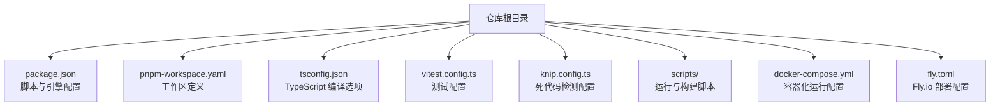
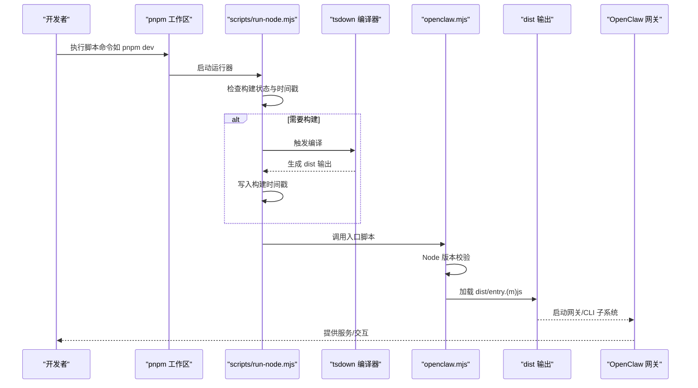
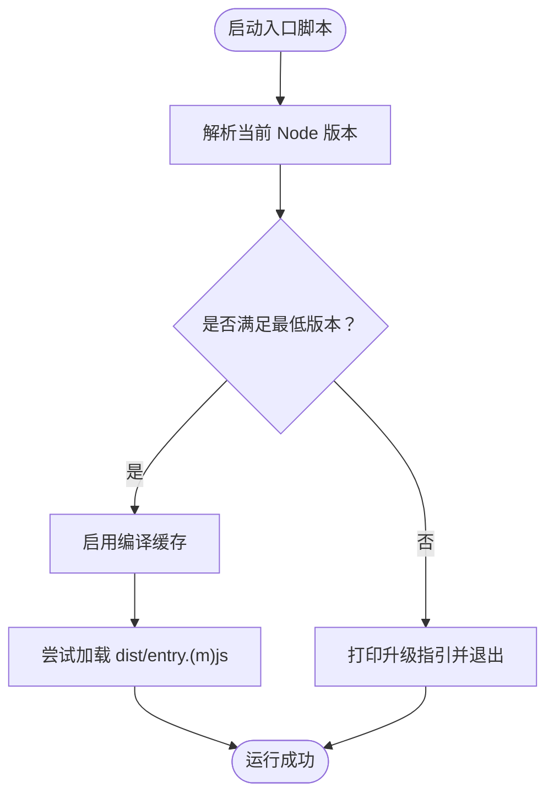
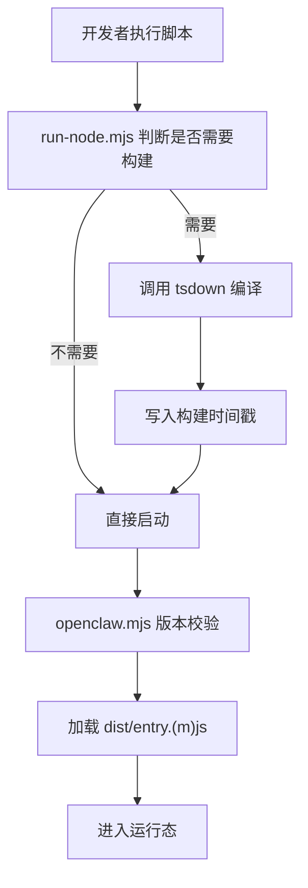
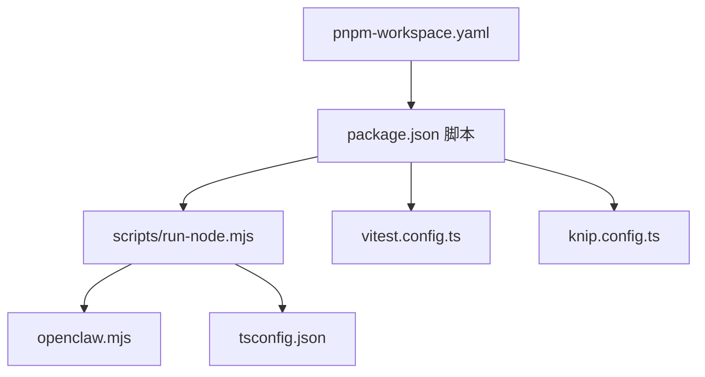

# 开发环境搭建

## 目录
1. [简介](#简介)
2. [项目结构](#项目结构)
3. [核心组件](#核心组件)
4. [架构总览](#架构总览)
5. [详细组件分析](#详细组件分析)
6. [依赖关系分析](#依赖关系分析)
7. [性能考虑](#性能考虑)
8. [故障排除指南](#故障排除指南)
9. [结论](#结论)
10. [附录](#附录)

## 简介
本指南面向希望在本地搭建 OpenClaw 开发环境的工程师与贡献者，覆盖 Node.js 版本要求、包管理器选择（pnpm）、依赖安装步骤、关键配置文件的作用、工作区与脚本命令、跨平台安装要点、开发工具链（TypeScript 编译器、ESLint、Prettier 等）、环境变量与本地数据库设置，以及开发服务器启动的完整流程。

## 项目结构
OpenClaw 采用 monorepo 结构，使用 pnpm 工作区统一管理多个子包与扩展。根目录包含核心应用、UI、扩展、脚本与文档等模块；同时提供 Docker Compose 与 Fly.io 部署配置，便于本地与云端运行。

图表来源
- [package.json](file://package.json#L1-L458)
- [pnpm-workspace.yaml](file://pnpm-workspace.yaml#L1-L18)
- [tsconfig.json](file://tsconfig.json#L1-L29)
- [vitest.config.ts](file://vitest.config.ts#L1-L203)
- [knip.config.ts](file://knip.config.ts#L1-L106)
- [docker-compose.yml](file://docker-compose.yml#L1-L77)
- [fly.toml](file://fly.toml#L1-L35)

章节来源
- [package.json](file://package.json#L1-L458)
- [pnpm-workspace.yaml](file://pnpm-workspace.yaml#L1-L18)

## 核心组件
- Node.js 运行时与版本校验：通过入口脚本对 Node 版本进行强制校验，确保满足最低版本要求。
- TypeScript 编译与类型检查：使用 tsdown 执行编译，tsconfig.json 定义严格模式与模块解析策略。
- 测试框架：Vitest 提供并发与隔离的测试执行，并通过覆盖阈值与排除规则聚焦核心代码覆盖率。
- 依赖管理：pnpm 工作区统一管理根包与扩展包，支持仅构建特定原生依赖。
- 构建与运行：scripts/run-node.mjs 负责增量构建与启动，自动判断是否需要重新编译并写入构建时间戳。
- 部署与容器化：docker-compose.yml 定义网关与 CLI 服务，fly.toml 提供 Fly.io 平台部署参数。

章节来源
- [openclaw.mjs](file://openclaw.mjs#L1-L90)
- [scripts/run-node.mjs](file://scripts/run-node.mjs#L1-L264)
- [tsconfig.json](file://tsconfig.json#L1-L29)
- [vitest.config.ts](file://vitest.config.ts#L1-L203)
- [knip.config.ts](file://knip.config.ts#L1-L106)
- [docker-compose.yml](file://docker-compose.yml#L1-L77)
- [fly.toml](file://fly.toml#L1-L35)

## 架构总览
下图展示了从开发者命令到实际运行的端到端流程，涵盖版本校验、增量构建、运行入口与容器化部署。

图表来源
- [scripts/run-node.mjs](file://scripts/run-node.mjs#L1-L264)
- [openclaw.mjs](file://openclaw.mjs#L1-L90)
- [package.json](file://package.json#L217-L334)

## 详细组件分析

### Node.js 版本要求与入口校验
- 最低版本：根据入口脚本与 package.json 的 engines 字段，要求 Node.js ≥ 22.12.0。
- 入口脚本会解析当前 Node 版本并输出升级指引（如 nvm 使用建议）。
- 建议使用 nvm 管理多版本 Node，确保默认版本满足要求。

图表来源
- [openclaw.mjs](file://openclaw.mjs#L1-L90)
- [package.json](file://package.json#L416-L418)

章节来源
- [openclaw.mjs](file://openclaw.mjs#L1-L90)
- [package.json](file://package.json#L416-L418)

### 包管理器选择与工作区配置
- 推荐使用 pnpm：README 明确推荐 pnpm，且 package.json 中声明了 pnpm 版本与 overrides。
- 工作区范围：根目录、UI、packages/*、extensions/* 均纳入工作区，便于统一安装与构建。
- 仅构建依赖：通过 onlyBuiltDependencies 指定原生绑定库，减少非必要编译成本。

章节来源
- [README.md](file://README.md#L94-L101)
- [package.json](file://package.json#L419-L456)
- [pnpm-workspace.yaml](file://pnpm-workspace.yaml#L1-L18)

### 关键配置文件详解
- package.json
  - 脚本命令：包含构建、测试、格式化、UI 构建、iOS/Android 工程构建、文档与检查等。
  - 引擎与包管理器：声明 Node 版本与 pnpm 版本。
  - 依赖与开发依赖：集中管理运行时与工具链依赖。
- tsconfig.json
  - 严格模式、模块解析策略、目标语言版本、路径映射等。
- vitest.config.ts
  - 测试并发、超时、覆盖率阈值与排除规则，聚焦核心 src 目录。
- knip.config.ts
  - 死代码检测的入口与工作区范围，避免误报扩展与 UI 包。

章节来源
- [package.json](file://package.json#L1-L458)
- [tsconfig.json](file://tsconfig.json#L1-L29)
- [vitest.config.ts](file://vitest.config.ts#L1-L203)
- [knip.config.ts](file://knip.config.ts#L1-L106)

### 构建与运行流程
- 增量构建：run-node.mjs 会比较源码与构建时间戳、Git HEAD、配置变更等，决定是否触发编译。
- 编译器：使用 tsdown 执行编译，生成 dist 输出。
- 启动入口：openclaw.mjs 在满足版本要求后加载 dist/entry.(m)js。
- 脚本命令：如 pnpm dev、pnpm gateway:watch、pnpm build 等，分别对应开发模式、监听模式与一次性构建。

图表来源
- [scripts/run-node.mjs](file://scripts/run-node.mjs#L1-L264)
- [openclaw.mjs](file://openclaw.mjs#L1-L90)

章节来源
- [scripts/run-node.mjs](file://scripts/run-node.mjs#L1-L264)
- [openclaw.mjs](file://openclaw.mjs#L1-L90)

### 跨平台安装步骤与注意事项
- macOS
  - 安装 nvm 并切换到 Node ≥ 22.12.0。
  - 使用 Homebrew 安装依赖（如 Xcode 命令行工具、SwiftLint 等，详见 README 的平台指南）。
  - 使用 pnpm 安装依赖并执行构建与 UI 构建。
- Linux
  - 安装 nvm 与 Node ≥ 22.12.0。
  - 安装系统依赖（如 Python、make、gcc 等），按需安装 Docker 以支持沙箱功能。
  - 使用 pnpm 安装依赖并执行构建。
- Windows（WSL2）
  - 在 WSL2 中安装 nvm 与 Node ≥ 22.12.0。
  - 安装 pnpm 与必要的构建工具。
  - 使用 pnpm 安装依赖并执行构建；部分原生依赖可能需要额外配置。

章节来源
- [README.md](file://README.md#L28-L31)
- [README.md](file://README.md#L476-L477)

### 开发工具链配置
- TypeScript 编译器
  - 目标：ES2023；模块解析：NodeNext；严格模式开启；路径别名映射至 src/plugin-sdk。
- ESLint 与 Prettier
  - 使用 oxlint 作为 Linter，oxfmt 作为格式化工具；Markdown 文档也有独立的格式化与检查脚本。
- 单元测试与覆盖率
  - Vitest 配置包含并发 worker 数、超时、覆盖率阈值与排除规则，确保核心代码质量。

章节来源
- [tsconfig.json](file://tsconfig.json#L1-L29)
- [package.json](file://package.json#L269-L276)
- [vitest.config.ts](file://vitest.config.ts#L1-L203)

### 环境变量与本地数据库设置
- 环境变量
  - 通过 docker-compose.yml 可见常用变量：OPENCLAW_GATEWAY_TOKEN、OPENCLAW_ALLOW_INSECURE_PRIVATE_WS、CLAUDE_AI_SESSION_KEY、OPENCLAW_CONFIG_DIR、OPENCLAW_WORKSPACE_DIR 等。
  - Fly.io 配置中包含 NODE_ENV、OPENCLAW_PREFER_PNPM、OPENCLAW_STATE_DIR、NODE_OPTIONS 等。
- 本地数据库
  - 项目未内置数据库服务；可通过外部 SQLite 或第三方向量数据库（如 sqlite-vec）配合插件实现本地检索增强。具体取决于插件与配置。

章节来源
- [docker-compose.yml](file://docker-compose.yml#L1-L77)
- [fly.toml](file://fly.toml#L1-L35)

### 开发服务器启动完整流程
- 一次性构建
  - pnpm build：触发 Canvas 打包、tsdown 编译、复制插件 SDK、生成构建信息与 CLI 兼容文件。
- UI 构建
  - pnpm ui:build：自动安装 UI 依赖并在首次运行时生成构建产物。
- 开发模式
  - pnpm dev：通过 run-node.mjs 启动 TypeScript 直接运行（tsx），支持热重载与增量编译。
- 监听模式
  - pnpm gateway:watch：监听源码变化并自动重启网关。
- 容器化运行
  - docker-compose up：启动网关与 CLI 服务，挂载配置与工作空间目录，暴露端口并健康检查。

章节来源
- [package.json](file://package.json#L226-L233)
- [package.json](file://package.json#L243-L262)
- [docker-compose.yml](file://docker-compose.yml#L1-L77)

## 依赖关系分析
- 组件耦合
  - run-node.mjs 与 openclaw.mjs 形成“运行器-入口”关系，前者负责构建与启动，后者负责版本校验与入口加载。
  - package.json 的脚本命令串联了构建、测试、格式化、文档与部署流程。
- 外部依赖
  - TypeScript、Vitest、oxlint/oxfmt、Docker、Fly.io 等工具链通过脚本与配置文件集成。
- 工作区依赖
  - pnpm-workspace.yaml 将根包与扩展包纳入统一管理，knip.config.ts 用于死代码检测，避免误删扩展与 UI 包。

图表来源
- [package.json](file://package.json#L1-L458)
- [scripts/run-node.mjs](file://scripts/run-node.mjs#L1-L264)
- [openclaw.mjs](file://openclaw.mjs#L1-L90)
- [tsconfig.json](file://tsconfig.json#L1-L29)
- [vitest.config.ts](file://vitest.config.ts#L1-L203)
- [knip.config.ts](file://knip.config.ts#L1-L106)
- [pnpm-workspace.yaml](file://pnpm-workspace.yaml#L1-L18)

章节来源
- [package.json](file://package.json#L1-L458)
- [scripts/run-node.mjs](file://scripts/run-node.mjs#L1-L264)
- [openclaw.mjs](file://openclaw.mjs#L1-L90)
- [tsconfig.json](file://tsconfig.json#L1-L29)
- [vitest.config.ts](file://vitest.config.ts#L1-L203)
- [knip.config.ts](file://knip.config.ts#L1-L106)
- [pnpm-workspace.yaml](file://pnpm-workspace.yaml#L1-L18)

## 性能考虑
- 并发测试：Vitest 在本地与 CI 下分别设置最大 worker 数，提升测试效率。
- 构建缓存：入口脚本启用 Node 编译缓存，减少重复编译开销。
- 仅构建原生依赖：pnpm 的 onlyBuiltDependencies 降低编译成本，加速安装与构建。
- 覆盖率阈值：通过合理阈值与排除规则，平衡覆盖率与维护成本。

## 故障排除指南
- Node 版本不满足要求
  - 症状：启动时报错提示需要更高版本的 Node。
  - 处理：使用 nvm 安装并切换到 ≥ 22.12.0 的版本。
- 构建失败或增量构建异常
  - 症状：修改源码后未触发重新编译或编译报错。
  - 处理：清理构建时间戳或设置 OPENCLAW_FORCE_BUILD=1 强制构建；检查 tsconfig.json 与依赖安装。
- 测试超时或不稳定
  - 症状：Windows 平台测试超时或 CI 下并发不足。
  - 处理：调整 Vitest 的 hookTimeout 与 maxWorkers；在 Windows 上适当放宽超时。
- 容器化运行问题
  - 症状：端口冲突、权限不足或沙箱未生效。
  - 处理：检查 docker-compose.yml 的端口映射与卷挂载；如需沙箱，按注释启用 Docker Socket 挂载并设置 DOCKER_GID。

章节来源
- [openclaw.mjs](file://openclaw.mjs#L1-L90)
- [scripts/run-node.mjs](file://scripts/run-node.mjs#L1-L264)
- [vitest.config.ts](file://vitest.config.ts#L1-L203)
- [docker-compose.yml](file://docker-compose.yml#L1-L77)

## 结论
通过遵循本指南，您可以在 macOS、Linux 与 Windows（WSL2）上快速搭建 OpenClaw 开发环境。重点在于满足 Node.js 版本要求、使用 pnpm 工作区管理依赖、理解构建与运行流程、正确设置环境变量与容器化配置，并利用 TypeScript、ESLint、Prettier 与 Vitest 等工具链保证开发效率与代码质量。

## 附录
- 常用脚本速览
  - pnpm install：安装依赖
  - pnpm ui:build：构建 UI
  - pnpm build：构建项目
  - pnpm dev / pnpm gateway:watch：开发模式与监听模式
  - pnpm test / pnpm test:fast：单元测试与覆盖率
  - pnpm format / pnpm lint：格式化与静态检查
  - docker-compose up：容器化运行
  - fly deploy：Fly.io 部署（需配置密钥）

章节来源
- [package.json](file://package.json#L217-L334)
- [docker-compose.yml](file://docker-compose.yml#L1-L77)
- [fly.toml](file://fly.toml#L1-L35)