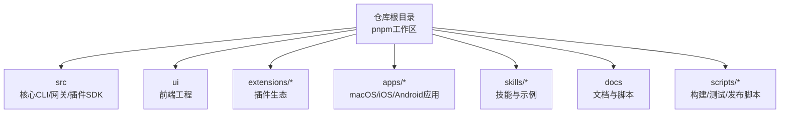
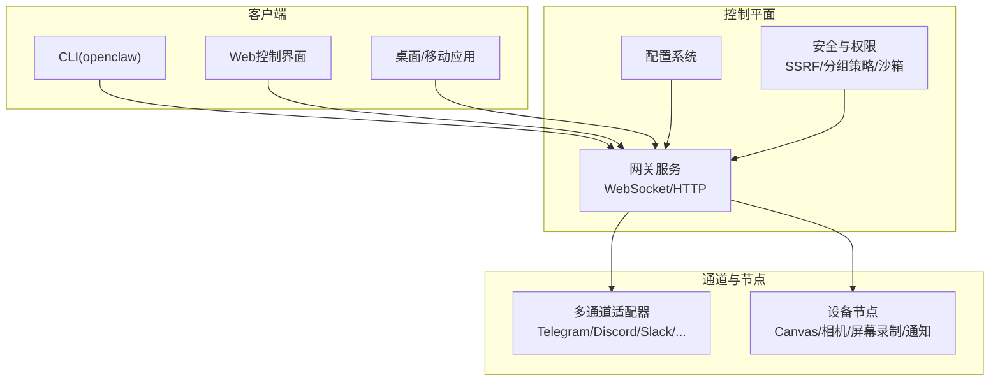
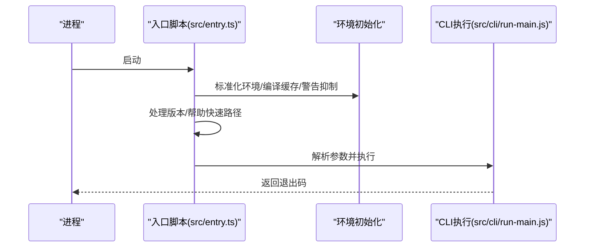
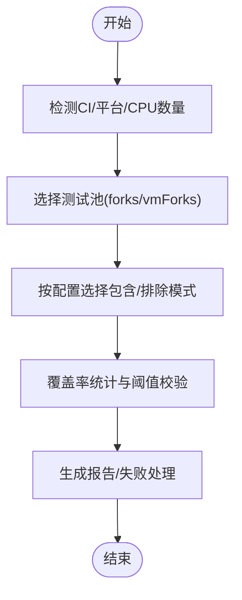
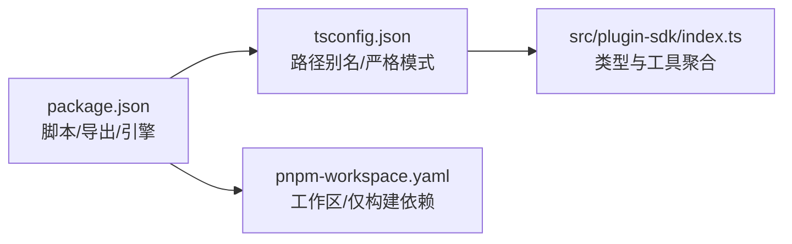

# 开发者指南

## 目录
1. [简介](#简介)
2. [项目结构](#项目结构)
3. [核心组件](#核心组件)
4. [架构总览](#架构总览)
5. [详细组件分析](#详细组件分析)
6. [依赖分析](#依赖分析)
7. [性能考虑](#性能考虑)
8. [故障排查指南](#故障排查指南)
9. [结论](#结论)
10. [附录](#附录)

## 简介
本指南面向OpenClaw开发者，提供从环境搭建、代码结构与架构、测试策略、贡献流程、调试与性能优化到常见问题解决的完整开发手册。OpenClaw是一个可在本地设备上运行的个人AI助理，支持多通道消息、多平台节点、可扩展插件体系与本地优先的安全模型。

## 项目结构
仓库采用monorepo结构，根目录通过pnpm工作区管理多个子包与应用：
- 核心CLI与网关：src（TypeScript）
- UI工程：ui（Vite + Vitest）
- 扩展生态：extensions/*（插件SDK与各渠道插件）
- 平台应用：apps/*（macOS、iOS、Android）
- 技能与示例：skills/*
- 文档与脚本：docs、scripts、scripts/dev、scripts/e2e等

图表来源
- [pnpm-workspace.yaml](file://pnpm-workspace.yaml#L1-L18)
- [package.json](file://package.json#L1-L458)

章节来源
- [pnpm-workspace.yaml](file://pnpm-workspace.yaml#L1-L18)
- [package.json](file://package.json#L1-L458)

## 核心组件
- CLI入口与启动链路：入口脚本负责环境初始化、实验性警告抑制、参数解析与CLI执行。
- 运行时环境：统一的日志输出、错误处理与终端状态恢复。
- 插件SDK：抽象通道适配器、认证、消息路由、Webhook、SSRF防护、分组策略等能力的统一接口。
- 测试框架：基于Vitest的多套配置，覆盖单元、集成、端到端与扩展测试。

章节来源
- [src/entry.ts](file://src/entry.ts#L1-L195)
- [src/runtime.ts](file://src/runtime.ts#L1-L54)
- [src/plugin-sdk/index.ts](file://src/plugin-sdk/index.ts#L1-L812)
- [vitest.config.ts](file://vitest.config.ts#L1-L203)

## 架构总览
OpenClaw以“网关控制平面”为核心，通过WebSocket连接各客户端、节点与工具，形成统一的消息与事件中枢；同时提供CLI、Web控制界面与桌面应用作为操作入口。

图表来源
- [README.md](file://README.md#L185-L238)
- [src/index.ts](file://src/index.ts#L1-L94)

## 详细组件分析

### 启动与入口链路
- 入口脚本负责：
  - 环境标准化、编译缓存启用、实验性警告抑制与进程重启策略
  - 快速路径处理版本/帮助输出
  - 参数解析与CLI执行
- 主模块在被直接调用时安装未捕获异常处理器，并解析命令行参数。

图表来源
- [src/entry.ts](file://src/entry.ts#L16-L194)
- [src/index.ts](file://src/index.ts#L75-L94)

章节来源
- [src/entry.ts](file://src/entry.ts#L1-L195)
- [src/index.ts](file://src/index.ts#L1-L94)

### 运行时与日志
- 统一的运行时环境封装了日志输出与进程退出逻辑，支持在测试中非退出式模拟。
- 终端进度线清理与状态恢复确保交互体验一致。

章节来源
- [src/runtime.ts](file://src/runtime.ts#L1-L54)

### 插件SDK与通道抽象
- 插件SDK导出大量类型与工具函数，涵盖：
  - 通道适配器接口与上下文
  - 认证、Webhook、SSRF防护
  - 分组策略、提及门控、回复前缀
  - 命令授权、会话键、媒体处理
  - Windows子进程策略、临时路径、持久化去重
- 该SDK是扩展生态与多通道实现的基础契约。

章节来源
- [src/plugin-sdk/index.ts](file://src/plugin-sdk/index.ts#L1-L812)

### 测试策略与配置
- 单元测试：聚焦纯函数与小模块，排除大面集成与外部依赖。
- 集成测试：覆盖网关、通道、浏览器、代理等集成面。
- 端到端测试：通过进程级隔离与真实环境验证。
- 扩展测试：针对extensions/*的独立配置。
- 覆盖率阈值与排除规则明确，避免对入口与UI等难以单元测试模块计数。

图表来源
- [vitest.config.ts](file://vitest.config.ts#L57-L202)
- [vitest.unit.config.ts](file://vitest.unit.config.ts#L1-L31)
- [vitest.e2e.config.ts](file://vitest.e2e.config.ts#L1-L33)
- [vitest.extensions.config.ts](file://vitest.extensions.config.ts#L1-L4)
- [vitest.gateway.config.ts](file://vitest.gateway.config.ts#L1-L4)

章节来源
- [vitest.config.ts](file://vitest.config.ts#L1-L203)
- [vitest.unit.config.ts](file://vitest.unit.config.ts#L1-L31)
- [vitest.e2e.config.ts](file://vitest.e2e.config.ts#L1-L33)
- [vitest.extensions.config.ts](file://vitest.extensions.config.ts#L1-L4)
- [vitest.gateway.config.ts](file://vitest.gateway.config.ts#L1-L4)

## 依赖分析
- 包管理：根package.json声明了二进制入口、导出映射、脚本与引擎(Node版本≥22)；pnpm工作区定义了仅构建依赖列表。
- 类型与路径别名：tsconfig启用NodeNext模块解析、严格模式与装饰器支持，并为插件SDK提供路径别名。
- 关键依赖：CLI命令行、WebSocket、通道SDK、富文本解析、PDF处理、SQLite向量扩展、Canvas与图像处理等。

图表来源
- [package.json](file://package.json#L1-L458)
- [tsconfig.json](file://tsconfig.json#L1-L29)
- [pnpm-workspace.yaml](file://pnpm-workspace.yaml#L1-L18)
- [src/plugin-sdk/index.ts](file://src/plugin-sdk/index.ts#L1-L812)

章节来源
- [package.json](file://package.json#L1-L458)
- [tsconfig.json](file://tsconfig.json#L1-L29)
- [pnpm-workspace.yaml](file://pnpm-workspace.yaml#L1-L18)

## 性能考虑
- 启动与编译缓存：入口脚本尝试启用编译缓存以加速启动。
- 测试并发：根据CPU核数动态设置最大worker数，CI下Windows默认较小并发，其他平台默认较大并发。
- 覆盖率门槛：设定行/函数/分支/语句70%/55%门槛，鼓励高质量测试。
- 性能分析与热点定位：提供性能预算与热点分析脚本入口，便于定位瓶颈。

章节来源
- [src/entry.ts](file://src/entry.ts#L48-L54)
- [vitest.config.ts](file://vitest.config.ts#L7-L11)
- [package.json](file://package.json#L314-L327)

## 故障排查指南
- 版本/帮助快速路径：当传入版本或帮助参数时，入口脚本直接输出信息并退出，避免完整启动。
- 实验性警告抑制：若未显式禁用，入口会自动以特定Node选项重启进程以抑制实验性警告。
- CLI异常处理：主模块安装未捕获异常处理器，记录错误并优雅退出。
- 端到端测试隔离：端到端测试强制使用进程池(forks)，避免VM上下文泄漏导致的状态污染。
- 环境与端口：入口与主模块均包含端口可用性检查与错误描述逻辑，便于诊断端口占用问题。

章节来源
- [src/entry.ts](file://src/entry.ts#L128-L164)
- [src/entry.ts](file://src/entry.ts#L80-L126)
- [src/index.ts](file://src/index.ts#L79-L94)
- [vitest.e2e.config.ts](file://vitest.e2e.config.ts#L24-L26)

## 结论
本指南提供了OpenClaw开发的全景视图：从环境准备、代码组织、测试策略到贡献流程与调试优化。建议新开发者先完成Node版本与依赖安装，再通过工作区脚本构建与运行，随后结合Vitest配置进行针对性测试，最后利用插件SDK与通道抽象扩展功能。

## 附录

### 开发环境搭建
- Node版本：要求Node ≥22（根package.json engines字段）。
- 包管理：推荐使用pnpm（根package.json指定版本），并遵循工作区配置。
- 安装与构建：克隆仓库后执行安装、UI依赖安装与构建；随后可通过脚本运行网关或CLI。
- 运行方式：支持直接运行TypeScript（tsx）与构建产物两种方式。

章节来源
- [README.md](file://README.md#L52-L111)
- [package.json](file://package.json#L416-L418)

### 代码贡献流程
- 提交前检查：确保通过构建、类型检查与测试；PR需聚焦单一主题，描述变更原因与影响。
- 评审与跟进：机器人评论需由作者自行跟进与关闭；UI使用传统装饰器语法，保持兼容。
- 安全披露：敏感问题请按贡献指南中的渠道与模板提交。

章节来源
- [CONTRIBUTING.md](file://CONTRIBUTING.md#L76-L101)
- [CONTRIBUTING.md](file://CONTRIBUTING.md#L102-L116)
- [CONTRIBUTING.md](file://CONTRIBUTING.md#L162-L187)

### 测试策略与工具
- 单元测试：默认配置排除大量集成与UI相关文件，聚焦核心逻辑。
- 集成测试：覆盖网关、通道、浏览器、代理等关键集成面。
- 端到端测试：通过进程隔离与真实环境验证，适合跨模块协作场景。
- 扩展测试：针对extensions/*的独立配置，便于插件生态回归。
- 覆盖率：严格门槛与排除清单，确保覆盖率稳定且聚焦实际执行路径。

章节来源
- [vitest.config.ts](file://vitest.config.ts#L71-L202)
- [vitest.unit.config.ts](file://vitest.unit.config.ts#L1-L31)
- [vitest.e2e.config.ts](file://vitest.e2e.config.ts#L1-L33)
- [vitest.extensions.config.ts](file://vitest.extensions.config.ts#L1-L4)
- [vitest.gateway.config.ts](file://vitest.gateway.config.ts#L1-L4)

### 调试技巧与开发工具
- 启动参数：通过NODE_OPTIONS与进程参数抑制实验性警告，避免干扰日志。
- 日志与终端：统一运行时日志输出，测试中可选择非退出式运行以捕获退出行为。
- 端口与守护：入口与主模块包含端口占用检测与错误描述，便于快速定位冲突。
- 性能分析：提供性能预算与热点分析脚本入口，辅助定位瓶颈。

章节来源
- [src/entry.ts](file://src/entry.ts#L65-L126)
- [src/runtime.ts](file://src/runtime.ts#L21-L54)
- [src/index.ts](file://src/index.ts#L25-L29)