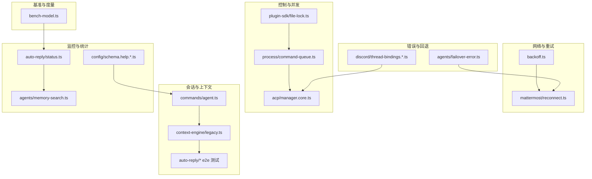
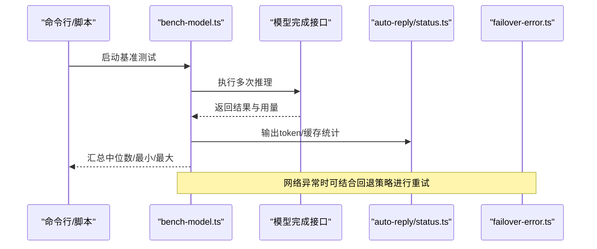
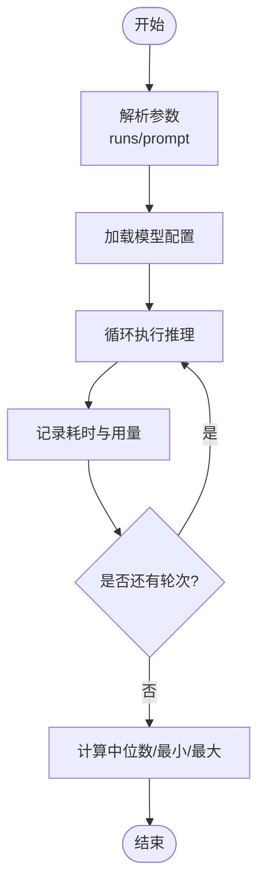
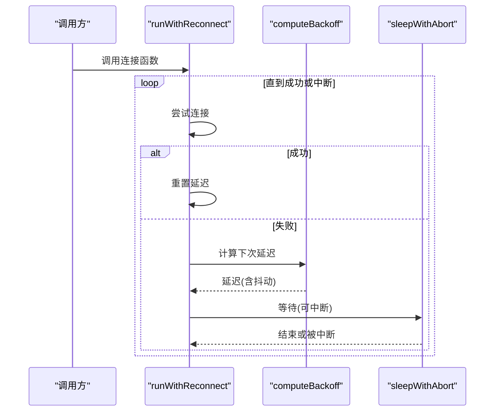
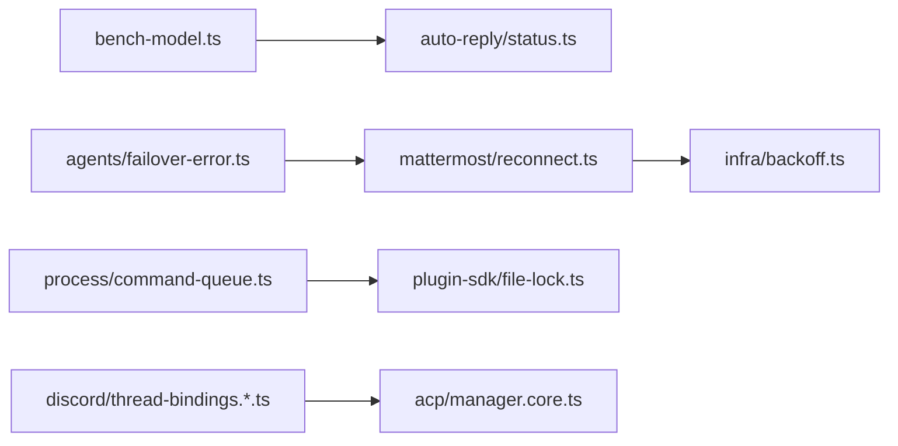

# 性能优化和最佳实践

## 目录
1. [简介](#简介)
2. [项目结构](#项目结构)
3. [核心组件](#核心组件)
4. [架构总览](#架构总览)
5. [详细组件分析](#详细组件分析)
6. [依赖关系分析](#依赖关系分析)
7. [性能考量与优化建议](#性能考量与优化建议)
8. [故障排查指南](#故障排查指南)
9. [结论](#结论)
10. [附录](#附录)

## 简介
本指南面向OpenClaw项目的性能优化与最佳实践，聚焦以下方面：
- 性能监控指标与基准测试：模型响应时间、内存使用、并发处理能力等
- 代码优化策略：算法优化、数据结构选择、缓存机制、异步处理
- 内存管理与垃圾回收优化：在AI代理与大量会话场景下的技巧
- 网络性能优化：连接池、超时、重试策略
- 并发编程最佳实践：多线程安全、锁竞争避免、资源池管理
- 生产环境调优参数与监控配置

## 项目结构
OpenClaw采用多语言混合架构（TypeScript/JavaScript、Swift），包含CLI、网关、插件扩展、跨平台应用与脚本工具。与性能相关的关键模块分布如下：
- 基准测试与度量：scripts/bench-model.ts
- 重试与退避：src/infra/backoff.ts、extensions/mattermost/src/mattermost/reconnect.ts
- 失败回退与错误分类：src/agents/failover-error.ts
- 控制平面与运行时统计：src/acp/control-plane/manager.core.ts
- 并发队列与任务调度：src/process/command-queue.ts
- 文件锁与进程内资源管理：src/plugin-sdk/file-lock.ts
- 使用量与缓存命中统计：src/auto-reply/status.ts、src/agents/memory-search.ts
- 会话与上下文维护：src/commands/agent.ts、src/context-engine/legacy.ts、src/auto-reply/reply/agent-runner.runreplyagent.e2e.test.ts
- 线程绑定与空闲清理：src/discord/monitor/thread-bindings.*.ts
- 配置帮助与会话维护参数：src/config/schema.help.quality.test.ts

**图表来源**
- [scripts/bench-model.ts](file://scripts/bench-model.ts#L1-L147)
- [src/infra/backoff.ts](file://src/infra/backoff.ts#L1-L28)
- [extensions/mattermost/src/mattermost/reconnect.ts](file://extensions/mattermost/src/mattermost/reconnect.ts#L1-L103)
- [src/acp/control-plane/manager.core.ts](file://src/acp/control-plane/manager.core.ts#L1079-L1108)
- [src/process/command-queue.ts](file://src/process/command-queue.ts#L43-L90)
- [src/plugin-sdk/file-lock.ts](file://src/plugin-sdk/file-lock.ts#L1-L51)
- [src/auto-reply/status.ts](file://src/auto-reply/status.ts#L306-L343)
- [src/agents/memory-search.ts](file://src/agents/memory-search.ts#L263-L284)
- [src/config/schema.help.quality.test.ts](file://src/config/schema.help.quality.test.ts#L681-L714)
- [src/commands/agent.ts](file://src/commands/agent.ts#L1021-L1060)
- [src/context-engine/legacy.ts](file://src/context-engine/legacy.ts#L36-L75)
- [src/auto-reply/reply/agent-runner.runreplyagent.e2e.test.ts](file://src/auto-reply/reply/agent-runner.runreplyagent.e2e.test.ts#L1708-L1817)
- [src/discord/monitor/thread-bindings.lifecycle.test.ts](file://src/discord/monitor/thread-bindings.lifecycle.test.ts#L1028-L1069)
- [src/discord/monitor/thread-bindings.state.ts](file://src/discord/monitor/thread-bindings.state.ts#L236-L274)
- [src/discord/monitor/thread-bindings.manager.ts](file://src/discord/monitor/thread-bindings.manager.ts#L161-L193)

**章节来源**
- [scripts/bench-model.ts](file://scripts/bench-model.ts#L1-L147)
- [src/infra/backoff.ts](file://src/infra/backoff.ts#L1-L28)
- [extensions/mattermost/src/mattermost/reconnect.ts](file://extensions/mattermost/src/mattermost/reconnect.ts#L1-L103)
- [src/acp/control-plane/manager.core.ts](file://src/acp/control-plane/manager.core.ts#L1079-L1108)
- [src/process/command-queue.ts](file://src/process/command-queue.ts#L43-L90)
- [src/plugin-sdk/file-lock.ts](file://src/plugin-sdk/file-lock.ts#L1-L51)
- [src/auto-reply/status.ts](file://src/auto-reply/status.ts#L306-L343)
- [src/agents/memory-search.ts](file://src/agents/memory-search.ts#L263-L284)
- [src/config/schema.help.quality.test.ts](file://src/config/schema.help.quality.test.ts#L681-L714)
- [src/commands/agent.ts](file://src/commands/agent.ts#L1021-L1060)
- [src/context-engine/legacy.ts](file://src/context-engine/legacy.ts#L36-L75)
- [src/auto-reply/reply/agent-runner.runreplyagent.e2e.test.ts](file://src/auto-reply/reply/agent-runner.runreplyagent.e2e.test.ts#L1708-L1817)
- [src/discord/monitor/thread-bindings.lifecycle.test.ts](file://src/discord/monitor/thread-bindings.lifecycle.test.ts#L1028-L1069)
- [src/discord/monitor/thread-bindings.state.ts](file://src/discord/monitor/thread-bindings.state.ts#L236-L274)
- [src/discord/monitor/thread-bindings.manager.ts](file://src/discord/monitor/thread-bindings.manager.ts#L161-L193)

## 核心组件
- 模型基准测试与度量：通过脚本对不同模型进行多次推理，记录耗时与用量，支持中位数统计与对比
- 重试与退避：指数退避+抖动，支持最大延迟、中断信号、自定义策略钩子
- 失败回退与错误分类：基于HTTP状态码、错误代码与消息进行失败原因归类
- 控制平面统计：记录回合耗时、最大耗时、失败计数与错误码分布
- 并发队列与任务调度：按“通道”分层并发，支持生成版本隔离与排空检测
- 文件锁与进程内资源：带退避与过期判断的文件锁，减少竞争与死锁风险
- 使用量与缓存统计：格式化输出token输入/输出、缓存命中率与读写统计
- 会话与上下文：思考级别解析、会话转录解析与压缩流程
- 线程绑定与空闲清理：线程绑定的空闲超时与最大存活时间计算与清理

**章节来源**
- [scripts/bench-model.ts](file://scripts/bench-model.ts#L50-L79)
- [src/infra/backoff.ts](file://src/infra/backoff.ts#L10-L14)
- [extensions/mattermost/src/mattermost/reconnect.ts](file://extensions/mattermost/src/mattermost/reconnect.ts#L29-L76)
- [src/agents/failover-error.ts](file://src/agents/failover-error.ts#L151-L209)
- [src/acp/control-plane/manager.core.ts](file://src/acp/control-plane/manager.core.ts#L1079-L1089)
- [src/process/command-queue.ts](file://src/process/command-queue.ts#L55-L70)
- [src/plugin-sdk/file-lock.ts](file://src/plugin-sdk/file-lock.ts#L31-L38)
- [src/auto-reply/status.ts](file://src/auto-reply/status.ts#L306-L343)
- [src/commands/agent.ts](file://src/commands/agent.ts#L1021-L1051)
- [src/context-engine/legacy.ts](file://src/context-engine/legacy.ts#L63-L75)
- [src/discord/monitor/thread-bindings.state.ts](file://src/discord/monitor/thread-bindings.state.ts#L236-L274)

## 架构总览
下图展示从“模型推理”到“统计与回退”的关键路径，以及“重试/退避”在不同模块中的协作方式。

**图表来源**
- [scripts/bench-model.ts](file://scripts/bench-model.ts#L50-L79)
- [src/auto-reply/status.ts](file://src/auto-reply/status.ts#L306-L343)
- [src/agents/failover-error.ts](file://src/agents/failover-error.ts#L151-L209)

## 详细组件分析

### 组件A：模型基准测试与度量（bench-model.ts）
- 功能要点
  - 支持指定运行次数与提示词
  - 对比多个模型的单次推理耗时
  - 输出中位数、最小值、最大值
  - 记录用量（输入/输出/缓存读写/总token）
- 性能意义
  - 提供稳定、可复现的基准数据，便于对比不同模型与配置
  - 中位数降低极端值影响，更贴近真实分布
- 最佳实践
  - 固定提示词与上下文，避免冷启动差异
  - 在相同硬件与网络环境下执行
  - 结合token用量观察吞吐与成本

**图表来源**
- [scripts/bench-model.ts](file://scripts/bench-model.ts#L19-L79)

**章节来源**
- [scripts/bench-model.ts](file://scripts/bench-model.ts#L1-L147)
- [src/auto-reply/status.ts](file://src/auto-reply/status.ts#L306-L343)

### 组件B：重试与退避（backoff.ts 与 mattermost/reconnect.ts）
- 功能要点
  - 指数退避+抖动，支持最大延迟与随机化
  - 可中断（AbortSignal）与策略钩子（shouldReconnect）
  - Mattermost扩展提供完整的重连循环实现
- 性能意义
  - 减少对上游服务的压力峰值，提升稳定性
  - 抖动避免“同步风暴”，提升整体可用性
- 最佳实践
  - 初始延迟与最大延迟根据SLA设定
  - 对幂等操作启用重试，非幂等需谨慎
  - 使用onError/onReconnect回调进行观测与告警

**图表来源**
- [extensions/mattermost/src/mattermost/reconnect.ts](file://extensions/mattermost/src/mattermost/reconnect.ts#L29-L76)
- [src/infra/backoff.ts](file://src/infra/backoff.ts#L10-L14)

**章节来源**
- [src/infra/backoff.ts](file://src/infra/backoff.ts#L1-L28)
- [extensions/mattermost/src/mattermost/reconnect.ts](file://extensions/mattermost/src/mattermost/reconnect.ts#L1-L103)
- [extensions/mattermost/src/mattermost/reconnect.test.ts](file://extensions/mattermost/src/mattermost/reconnect.test.ts#L50-L192)

### 组件C：失败回退与错误分类（failover-error.ts）
- 功能要点
  - 从错误中提取HTTP状态、错误码与消息
  - 归类为超时、配额、网络不可达等
  - 提供描述性信息用于诊断
- 性能意义
  - 快速识别失败原因，指导是否重试与切换后端
- 最佳实践
  - 对超时与网络瞬断启用自动重试
  - 对配额/权限错误快速降级或切换模型

**章节来源**
- [src/agents/failover-error.ts](file://src/agents/failover-error.ts#L151-L209)

### 组件D：控制平面统计与运行时管理（acp/manager.core.ts）
- 功能要点
  - 记录回合耗时、最大耗时、失败计数
  - 统计错误码分布
  - 空闲运行时句柄回收
- 性能意义
  - 量化系统瓶颈，辅助容量规划
  - 及时释放闲置资源，降低内存占用
- 最佳实践
  - 设置合理的空闲TTL，平衡冷启动与资源占用
  - 定期导出统计指标至监控系统

**章节来源**
- [src/acp/control-plane/manager.core.ts](file://src/acp/control-plane/manager.core.ts#L1079-L1108)

### 组件E：并发队列与任务调度（process/command-queue.ts）
- 功能要点
  - 按“通道”分层并发，每层独立队列与活跃任务集合
  - 生成版本隔离，避免旧任务干扰
  - 排空检测与日志告警
- 性能意义
  - 限制每通道并发度，防止资源争用
  - 通过生成版本避免竞态条件
- 最佳实践
  - 为高优先级任务分配独立通道
  - 监控队列长度与活跃任务数，动态调整maxConcurrent

**章节来源**
- [src/process/command-queue.ts](file://src/process/command-queue.ts#L43-L90)

### 组件F：文件锁与进程内资源（plugin-sdk/file-lock.ts）
- 功能要点
  - 带退避与抖动的重试延迟
  - 过期判定与进程存活检查
  - 进程作用域内的持有锁映射
- 性能意义
  - 降低锁竞争冲突，避免死锁
  - 通过过期清理减少僵尸锁
- 最佳实践
  - 合理设置最小/最大超时与重试倍数
  - 对长时间持有锁的操作进行拆分

**章节来源**
- [src/plugin-sdk/file-lock.ts](file://src/plugin-sdk/file-lock.ts#L1-L51)

### 组件G：使用量与缓存统计（auto-reply/status.ts 与 agents/memory-search.ts）
- 功能要点
  - 格式化token输入/输出显示
  - 计算缓存命中率、缓存读取与新增token
  - 内存搜索缓存开关与容量配置
- 性能意义
  - 评估缓存效果，指导容量与策略调优
  - 识别token浪费与上下文膨胀
- 最佳实践
  - 开启缓存并设置合理上限
  - 结合上下文压缩策略降低token消耗

**章节来源**
- [src/auto-reply/status.ts](file://src/auto-reply/status.ts#L306-L343)
- [src/agents/memory-search.ts](file://src/agents/memory-search.ts#L263-L284)

### 组件H：会话与上下文（commands/agent.ts 与 context-engine/legacy.ts）
- 功能要点
  - 解析思考级别，必要时降级
  - 解析会话转录文件，驱动上下文组装
  - 旧引擎直接持久化上下文，支持压缩
- 性能意义
  - 通过思考级别与上下文压缩控制token与延迟
- 最佳实践
  - 在高延迟模型上适当降低思考级别
  - 定期触发压缩，避免上下文无限增长

**章节来源**
- [src/commands/agent.ts](file://src/commands/agent.ts#L1021-L1051)
- [src/context-engine/legacy.ts](file://src/context-engine/legacy.ts#L36-L75)
- [src/auto-reply/reply/agent-runner.runreplyagent.e2e.test.ts](file://src/auto-reply/reply/agent-runner.runreplyagent.e2e.test.ts#L1708-L1817)

### 组件I：线程绑定与空闲清理（discord/thread-bindings.*.ts）
- 功能要点
  - 解析线程绑定空闲超时与最大存活时间
  - 计算到期时间，支持清理
  - 生命周期测试验证健康探测并发行为
- 性能意义
  - 避免长期占用资源，提升系统弹性
- 最佳实践
  - 根据业务活跃度调整空闲超时
  - 清理周期与探测间隔协调

**章节来源**
- [src/discord/monitor/thread-bindings.state.ts](file://src/discord/monitor/thread-bindings.state.ts#L236-L274)
- [src/discord/monitor/thread-bindings.manager.ts](file://src/discord/monitor/thread-bindings.manager.ts#L161-L193)
- [src/discord/monitor/thread-bindings.lifecycle.test.ts](file://src/discord/monitor/thread-bindings.lifecycle.test.ts#L1028-L1069)

## 依赖关系分析
- 低耦合高内聚
  - 基准测试与统计模块相互独立，便于替换
  - 重试与退避策略可复用到不同网络模块
- 关键依赖链
  - bench-model.ts 依赖模型完成接口与统计输出
  - mattermost/reconnect.ts 依赖 backoff.ts 的退避策略
  - failover-error.ts 为网络异常提供统一分类
  - command-queue.ts 与 file-lock.ts 共同保障并发安全
  - thread-bindings.*.ts 与 ACP管理器协同进行资源回收

**图表来源**
- [scripts/bench-model.ts](file://scripts/bench-model.ts#L50-L79)
- [src/auto-reply/status.ts](file://src/auto-reply/status.ts#L306-L343)
- [extensions/mattermost/src/mattermost/reconnect.ts](file://extensions/mattermost/src/mattermost/reconnect.ts#L29-L76)
- [src/infra/backoff.ts](file://src/infra/backoff.ts#L10-L14)
- [src/agents/failover-error.ts](file://src/agents/failover-error.ts#L151-L209)
- [src/process/command-queue.ts](file://src/process/command-queue.ts#L55-L70)
- [src/plugin-sdk/file-lock.ts](file://src/plugin-sdk/file-lock.ts#L31-L38)
- [src/discord/monitor/thread-bindings.state.ts](file://src/discord/monitor/thread-bindings.state.ts#L236-L274)
- [src/acp/control-plane/manager.core.ts](file://src/acp/control-plane/manager.core.ts#L1079-L1108)

**章节来源**
- [scripts/bench-model.ts](file://scripts/bench-model.ts#L1-L147)
- [src/infra/backoff.ts](file://src/infra/backoff.ts#L1-L28)
- [extensions/mattermost/src/mattermost/reconnect.ts](file://extensions/mattermost/src/mattermost/reconnect.ts#L1-L103)
- [src/agents/failover-error.ts](file://src/agents/failover-error.ts#L151-L209)
- [src/process/command-queue.ts](file://src/process/command-queue.ts#L43-L90)
- [src/plugin-sdk/file-lock.ts](file://src/plugin-sdk/file-lock.ts#L1-L51)
- [src/auto-reply/status.ts](file://src/auto-reply/status.ts#L306-L343)
- [src/agents/memory-search.ts](file://src/agents/memory-search.ts#L263-L284)
- [src/config/schema.help.quality.test.ts](file://src/config/schema.help.quality.test.ts#L681-L714)
- [src/commands/agent.ts](file://src/commands/agent.ts#L1021-L1060)
- [src/context-engine/legacy.ts](file://src/context-engine/legacy.ts#L36-L75)
- [src/auto-reply/reply/agent-runner.runreplyagent.e2e.test.ts](file://src/auto-reply/reply/agent-runner.runreplyagent.e2e.test.ts#L1708-L1817)
- [src/discord/monitor/thread-bindings.lifecycle.test.ts](file://src/discord/monitor/thread-bindings.lifecycle.test.ts#L1028-L1069)
- [src/discord/monitor/thread-bindings.state.ts](file://src/discord/monitor/thread-bindings.state.ts#L236-L274)
- [src/discord/monitor/thread-bindings.manager.ts](file://src/discord/monitor/thread-bindings.manager.ts#L161-L193)

## 性能考量与优化建议

### 指标与基准测试
- 关键指标
  - 模型响应时间：中位数、最小/最大值
  - Token用量：输入/输出/缓存读写/总token
  - 并发指标：队列长度、活跃任务数、通道并发度
  - 错误与回退：失败率、超时比例、错误码分布
- 基准方法
  - 使用脚本固定提示词与运行次数，对比不同模型与配置
  - 在相同环境与负载下重复测试，剔除首帧冷启动

**章节来源**
- [scripts/bench-model.ts](file://scripts/bench-model.ts#L130-L143)
- [src/auto-reply/status.ts](file://src/auto-reply/status.ts#L306-L343)

### 算法与数据结构优化
- 上下文压缩与思考级别
  - 在高延迟模型上降低思考级别，减少token与延迟
  - 定期触发压缩，避免上下文无限增长
- 缓存策略
  - 启用并合理设置缓存上限，关注命中率
  - 对热点查询开启缓存，对时效性要求高的场景谨慎使用

**章节来源**
- [src/commands/agent.ts](file://src/commands/agent.ts#L1021-L1051)
- [src/context-engine/legacy.ts](file://src/context-engine/legacy.ts#L63-L75)
- [src/agents/memory-search.ts](file://src/agents/memory-search.ts#L281-L284)

### 异步与并发优化
- 重试与退避
  - 指数退避+抖动，设置合理初始与最大延迟
  - 使用中断信号快速退出，避免资源浪费
- 并发队列
  - 为不同类型任务分配独立通道
  - 监控队列长度与活跃任务数，动态调整并发度
- 文件锁
  - 合理设置重试参数与过期时间，避免死锁

**章节来源**
- [extensions/mattermost/src/mattermost/reconnect.ts](file://extensions/mattermost/src/mattermost/reconnect.ts#L29-L76)
- [src/infra/backoff.ts](file://src/infra/backoff.ts#L10-L14)
- [src/process/command-queue.ts](file://src/process/command-queue.ts#L55-L70)
- [src/plugin-sdk/file-lock.ts](file://src/plugin-sdk/file-lock.ts#L31-L38)

### 内存管理与GC优化
- 会话与上下文
  - 定期压缩与清理，避免上下文膨胀
  - 合理设置会话维护参数（轮转大小、保留策略）
- 运行时回收
  - 控制平面定期回收空闲运行时句柄
- 缓存与用量
  - 关注token用量与缓存命中率，避免无谓开销

**章节来源**
- [src/context-engine/legacy.ts](file://src/context-engine/legacy.ts#L63-L75)
- [src/acp/control-plane/manager.core.ts](file://src/acp/control-plane/manager.core.ts#L1096-L1108)
- [src/config/schema.help.quality.test.ts](file://src/config/schema.help.quality.test.ts#L681-L714)
- [src/auto-reply/status.ts](file://src/auto-reply/status.ts#L306-L343)

### 网络性能优化
- 连接池与超时
  - 为外部服务配置合理的连接池与超时
  - 对幂等请求启用重试，非幂等谨慎重试
- 重试策略
  - 指数退避+抖动，避免同步风暴
  - 使用策略钩子根据错误类型决定是否继续重试

**章节来源**
- [extensions/mattermost/src/mattermost/reconnect.ts](file://extensions/mattermost/src/mattermost/reconnect.ts#L10-L19)
- [src/agents/failover-error.ts](file://src/agents/failover-error.ts#L151-L209)

### 并发编程最佳实践
- 多线程安全
  - 使用通道隔离任务，避免共享可变状态
  - 通过生成版本避免旧任务干扰
- 锁竞争避免
  - 文件锁配合过期与进程存活检查
  - 将长锁拆分为短锁，减少持有时间
- 资源池管理
  - 合理设置并发度与队列长度
  - 定期清理空闲资源，避免泄漏

**章节来源**
- [src/process/command-queue.ts](file://src/process/command-queue.ts#L55-L70)
- [src/plugin-sdk/file-lock.ts](file://src/plugin-sdk/file-lock.ts#L31-L38)
- [src/discord/monitor/thread-bindings.state.ts](file://src/discord/monitor/thread-bindings.state.ts#L236-L274)

### 生产环境调优与监控
- 参数建议
  - 初始/最大重试延迟：根据SLA与上游能力设定
  - 并发通道：按任务类型划分，动态调整maxConcurrent
  - 会话维护：轮转大小、保留策略、磁盘上限
- 监控配置
  - 导出回合耗时、失败率、错误码分布
  - 监控队列长度、活跃任务数、缓存命中率

**章节来源**
- [src/config/schema.help.quality.test.ts](file://src/config/schema.help.quality.test.ts#L681-L714)
- [src/acp/control-plane/manager.core.ts](file://src/acp/control-plane/manager.core.ts#L1079-L1089)
- [src/auto-reply/status.ts](file://src/auto-reply/status.ts#L306-L343)

## 故障排查指南
- 重试与回退
  - 观察onReconnect回调延迟序列，确认是否符合指数退避
  - 检查shouldReconnect策略是否提前终止
- 错误分类
  - 使用describeFailoverError定位超时、网络不可达、配额等问题
- 并发问题
  - 检查队列长度与活跃任务数，必要时降低并发度
  - 关注排空告警，避免旧任务生成版本导致阻塞
- 资源泄漏
  - 核查文件锁持有情况与过期时间
  - 定期清理空闲运行时句柄与线程绑定

**章节来源**
- [extensions/mattermost/src/mattermost/reconnect.test.ts](file://extensions/mattermost/src/mattermost/reconnect.test.ts#L50-L192)
- [src/agents/failover-error.ts](file://src/agents/failover-error.ts#L188-L209)
- [src/process/command-queue.ts](file://src/process/command-queue.ts#L80-L90)
- [src/plugin-sdk/file-lock.ts](file://src/plugin-sdk/file-lock.ts#L31-L38)
- [src/acp/control-plane/manager.core.ts](file://src/acp/control-plane/manager.core.ts#L1096-L1108)

## 结论
通过基准测试、重试退避、并发队列、缓存与上下文优化、资源回收与监控，OpenClaw可在高并发与大规模会话场景下保持稳定与高效。建议在生产环境中持续观测关键指标，动态调整参数，并结合错误分类与回退策略提升系统韧性。

## 附录
- 相关实现路径
  - 基准测试：scripts/bench-model.ts
  - 重试与退避：src/infra/backoff.ts、extensions/mattermost/src/mattermost/reconnect.ts
  - 失败回退：src/agents/failover-error.ts
  - 并发队列：src/process/command-queue.ts
  - 文件锁：src/plugin-sdk/file-lock.ts
  - 使用量与缓存：src/auto-reply/status.ts、src/agents/memory-search.ts
  - 会话与上下文：src/commands/agent.ts、src/context-engine/legacy.ts
  - 线程绑定：src/discord/monitor/thread-bindings.*.ts
  - 配置帮助：src/config/schema.help.quality.test.ts