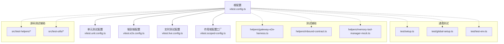
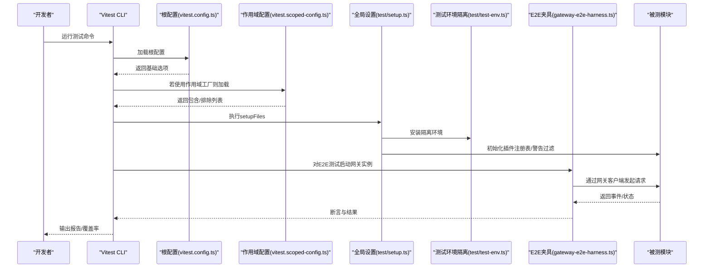
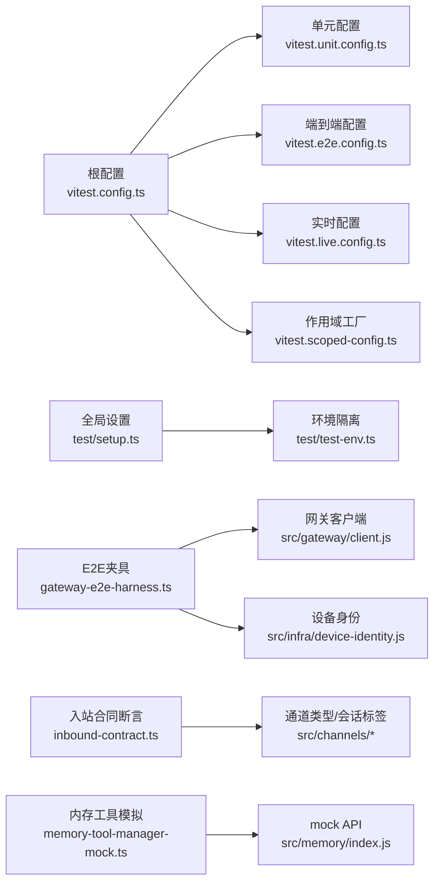

# 测试策略和工具

## 目录
1. [引言](#引言)
2. [项目结构](#项目结构)
3. [核心组件](#核心组件)
4. [架构总览](#架构总览)
5. [详细组件分析](#详细组件分析)
6. [依赖关系分析](#依赖关系分析)
7. [性能考量](#性能考量)
8. [故障排查指南](#故障排查指南)
9. [结论](#结论)
10. [附录](#附录)

## 引言
本指南面向OpenClaw项目的测试体系，系统阐述测试架构（单元测试、集成测试、端到端测试）与工具链，详解Vitest多配置文件的作用与差异、覆盖率门槛、测试环境隔离与清理策略，并提供测试辅助工具与模拟对象的使用方法、最佳实践与运行方式（单文件、全量、CI），帮助开发者高效编写与维护高质量测试。

## 项目结构
OpenClaw采用多包/多平台并行的工程布局，测试分布在以下位置：
- 根级测试目录：test/，包含通用测试脚本、夹具与辅助工具
- 各子包与应用：apps/、extensions/、packages/ 等均包含各自Tests或.test.ts文件
- UI子项目：ui/ 下有独立的Vitest配置与测试
- 源码测试辅助：src/test-helpers/ 与 src/test-utils/

下图展示测试相关目录与关键文件的关系：

图表来源
- [vitest.config.ts](file://vitest.config.ts#L57-L202)
- [vitest.unit.config.ts](file://vitest.unit.config.ts#L1-L31)
- [vitest.e2e.config.ts](file://vitest.e2e.config.ts#L1-L33)
- [vitest.live.config.ts](file://vitest.live.config.ts#L1-L17)
- [vitest.scoped-config.ts](file://vitest.scoped-config.ts#L1-L18)
- [test/setup.ts](file://test/setup.ts#L1-L195)
- [test/global-setup.ts](file://test/global-setup.ts#L1-L7)
- [test/test-env.ts](file://test/test-env.ts#L54-L143)
- [test/helpers/gateway-e2e-harness.ts](file://test/helpers/gateway-e2e-harness.ts#L104-L191)
- [test/helpers/inbound-contract.ts](file://test/helpers/inbound-contract.ts#L7-L19)
- [test/helpers/memory-tool-manager-mock.ts](file://test/helpers/memory-tool-manager-mock.ts#L36-L38)
- [src/test-helpers/*](file://src/test-helpers/normalize-text.ts#L1-L200)
- [src/test-utils/*](file://src/test-utils/plugin-runtime-mock.ts#L1-L200)

章节来源
- [vitest.config.ts](file://vitest.config.ts#L57-L202)
- [vitest.unit.config.ts](file://vitest.unit.config.ts#L1-L31)
- [vitest.e2e.config.ts](file://vitest.e2e.config.ts#L1-L33)
- [vitest.live.config.ts](file://vitest.live.config.ts#L1-L17)
- [vitest.scoped-config.ts](file://vitest.scoped-config.ts#L1-L18)
- [test/setup.ts](file://test/setup.ts#L1-L195)
- [test/global-setup.ts](file://test/global-setup.ts#L1-L7)
- [test/test-env.ts](file://test/test-env.ts#L54-L143)
- [test/helpers/gateway-e2e-harness.ts](file://test/helpers/gateway-e2e-harness.ts#L104-L191)
- [test/helpers/inbound-contract.ts](file://test/helpers/inbound-contract.ts#L7-L19)
- [test/helpers/memory-tool-manager-mock.ts](file://test/helpers/memory-tool-manager-mock.ts#L36-L38)

## 核心组件
- 根Vitest配置：统一别名解析、超时、钩子、工作池、包含/排除规则、覆盖率阈值与排除范围
- 单元测试配置：在根配置基础上进一步缩小测试范围，排除通道/网关/浏览器等集成面
- 端到端配置：强制进程隔离、可调工作线程数、仅包含.e2e测试
- 实时测试配置：串行执行，仅包含.live测试
- 作用域配置工厂：按需动态生成包含/排除列表的配置
- 全局设置与环境隔离：安装警告过滤、插件注册表、临时HOME隔离、清理逻辑
- 测试辅助与模拟：E2E网关实例管理、入站合同断言、内存工具模拟、通道插件桩

章节来源
- [vitest.config.ts](file://vitest.config.ts#L57-L202)
- [vitest.unit.config.ts](file://vitest.unit.config.ts#L11-L30)
- [vitest.e2e.config.ts](file://vitest.e2e.config.ts#L20-L32)
- [vitest.live.config.ts](file://vitest.live.config.ts#L8-L16)
- [vitest.scoped-config.ts](file://vitest.scoped-config.ts#L4-L17)
- [test/setup.ts](file://test/setup.ts#L1-L195)
- [test/test-env.ts](file://test/test-env.ts#L54-L143)

## 架构总览
下图展示测试运行时的总体流程与关键交互：

图表来源
- [vitest.config.ts](file://vitest.config.ts#L57-L202)
- [vitest.scoped-config.ts](file://vitest.scoped-config.ts#L4-L17)
- [test/setup.ts](file://test/setup.ts#L24-L194)
- [test/test-env.ts](file://test/test-env.ts#L54-L143)
- [test/helpers/gateway-e2e-harness.ts](file://test/helpers/gateway-e2e-harness.ts#L104-L191)
- [src/gateway/client.js](file://src/gateway/client.js#L1-L200)

## 详细组件分析

### 根Vitest配置（vitest.config.ts）
- 别名映射：将openclaw/plugin-sdk子路径别名解析到src/plugin-sdk对应文件，便于插件SDK测试
- 超时与钩子：统一测试与钩子超时；开启unstubEnvs/unstubGlobals避免vmForks下的环境泄漏
- 工作池与并发：默认forks池，本地根据CPU动态计算最大worker数，CI按平台固定
- 包含/排除：覆盖src、extensions、test及UI部分视图控制器/工具的测试；排除macOS应用、live/e2e文件
- 覆盖率：v8提供者，输出文本与lcov；仅统计src内实际被测文件，排除入口、CLI、网关服务端、浏览器UI等

章节来源
- [vitest.config.ts](file://vitest.config.ts#L57-L202)

### 单元测试配置（vitest.unit.config.ts）
- 基于根配置，进一步排除网关、各通道、Web/Browser、Line、Agents、AutoReply、Commands等集成面
- 适合快速验证纯函数、工具类与小模块

章节来源
- [vitest.unit.config.ts](file://vitest.unit.config.ts#L1-L31)

### 端到端配置（vitest.e2e.config.ts）
- 强制forks池，避免VM上下文泄漏导致的跨文件状态污染
- 默认单线程，可通过环境变量调整工作线程数
- 仅包含.e2e测试，排除非E2E文件以提升确定性与成本控制

章节来源
- [vitest.e2e.config.ts](file://vitest.e2e.config.ts#L1-L33)

### 实时测试配置（vitest.live.config.ts）
- 串行执行，仅匹配.live测试，适合需要真实外部资源或敏感操作的场景

章节来源
- [vitest.live.config.ts](file://vitest.live.config.ts#L1-L17)

### 作用域配置工厂（vitest.scoped-config.ts）
- 提供createScopedVitestConfig函数，按传入的include数组动态生成配置，便于按文件/目录粒度运行

章节来源
- [vitest.scoped-config.ts](file://vitest.scoped-config.ts#L1-L18)

### 全局设置与环境隔离（test/setup.ts、test/global-setup.ts、test/test-env.ts）
- 设置VITEST标志、警告过滤、插件注册表初始化与恢复
- 使用withIsolatedTestHome隔离HOME与XDG目录，避免污染真实用户状态
- 支持“Live”模式加载真实用户环境变量，用于需要真实密钥/配置的测试

章节来源
- [test/setup.ts](file://test/setup.ts#L1-L195)
- [test/global-setup.ts](file://test/global-setup.ts#L1-L7)
- [test/test-env.ts](file://test/test-env.ts#L54-L143)

### 测试辅助与模拟（test/helpers 与 src/test-helpers/test-utils）
- E2E网关夹具：spawnGatewayInstance/stopGatewayInstance、连接节点、等待节点状态、等待聊天最终事件、HTTP请求封装
- 入站合同断言：对消息上下文进行发送方身份、正文类型、会话标签等校验
- 内存工具模拟：mock内存搜索/读取、状态查询、向量可用性探测等
- 通道插件桩：创建最小化通道插件对象，支持不同通道的发送适配
- 其他辅助：文本归一化、轮询、临时HOME、路径、时间戳、快速超时、向导提示器、入站捕获与分发mock、请求mock等

章节来源
- [test/helpers/gateway-e2e-harness.ts](file://test/helpers/gateway-e2e-harness.ts#L104-L191)
- [test/helpers/inbound-contract.ts](file://test/helpers/inbound-contract.ts#L7-L19)
- [test/helpers/memory-tool-manager-mock.ts](file://test/helpers/memory-tool-manager-mock.ts#L36-L38)
- [src/test-helpers/normalize-text.ts](file://src/test-helpers/normalize-text.ts#L1-L200)
- [src/test-helpers/poll.ts](file://src/test-helpers/poll.ts#L1-L200)
- [src/test-helpers/temp-home.ts](file://src/test-helpers/temp-home.ts#L1-L200)
- [src/test-helpers/paths.ts](file://src/test-helpers/paths.ts#L1-L200)
- [src/test-helpers/envelope-timestamp.ts](file://src/test-helpers/envelope-timestamp.ts#L1-L200)
- [src/test-helpers/fast-short-timeouts.ts](file://src/test-helpers/fast-short-timeouts.ts#L1-L200)
- [src/test-helpers/wizard-prompter.ts](file://src/test-helpers/wizard-prompter.ts#L1-L200)
- [src/test-helpers/dispatch-inbound-capture.ts](file://src/test-helpers/dispatch-inbound-capture.ts#L1-L200)
- [src/test-helpers/inbound-contract-capture.ts](file://src/test-helpers/inbound-contract-capture.ts#L1-L200)
- [src/test-helpers/inbound-contract-dispatch-mock.ts](file://src/test-helpers/inbound-contract-dispatch-mock.ts#L1-L200)
- [src/test-helpers/mock-incoming-request.ts](file://src/test-helpers/mock-incoming-request.ts#L1-L200)
- [src/test-utils/channel-plugins.ts](file://src/test-utils/channel-plugins.ts#L1-L200)
- [src/test-utils/plugin-runtime-mock.ts](file://src/test-utils/plugin-runtime-mock.ts#L1-L200)
- [src/test-utils/start-account-context.ts](file://src/test-utils/start-account-context.ts#L1-L200)
- [src/test-utils/runtime-env.ts](file://src/test-utils/runtime-env.ts#L1-L200)
- [src/test-utils/resolve-target-test-helpers.ts](file://src/test-utils/resolve-target-test-helpers.ts#L1-L200)
- [src/test-utils/windows-cmd-shim-test-fixtures.ts](file://src/test-utils/windows-cmd-shim-test-fixtures.ts#L1-L200)

### 测试夹具与脚本示例
- 夹具：system-run-command-contract.json 等，用于契约/行为验证
- 脚本：check-channel-agnostic-boundaries.test.ts、check-no-random-messaging-tmp.test.ts、check-no-raw-window-open.test.ts、ios-team-id.test.ts 等，用于静态边界检查与平台特定约束验证
- 应用级：appcast.test.ts、cli-json-stdout.e2e.test.ts、gateway.multi.e2e.test.ts、release-check.test.ts、ui.presenter-next-run.test.ts 等

章节来源
- [test/fixtures/system-run-command-contract.json](file://test/fixtures/system-run-command-contract.json#L1-L200)
- [test/scripts/check-channel-agnostic-boundaries.test.ts](file://test/scripts/check-channel-agnostic-boundaries.test.ts#L1-L200)
- [test/scripts/check-no-random-messaging-tmp.test.ts](file://test/scripts/check-no-random-messaging-tmp.test.ts#L1-L200)
- [test/scripts/check-no-raw-window-open.test.ts](file://test/scripts/check-no-raw-window-open.test.ts#L1-L200)
- [test/scripts/ios-team-id.test.ts](file://test/scripts/ios-team-id.test.ts#L1-L200)
- [test/appcast.test.ts](file://test/appcast.test.ts#L1-L200)
- [test/cli-json-stdout.e2e.test.ts](file://test/cli-json-stdout.e2e.test.ts#L1-L200)
- [test/gateway.multi.e2e.test.ts](file://test/gateway.multi.e2e.test.ts#L1-L200)
- [test/release-check.test.ts](file://test/release-check.test.ts#L1-L200)
- [test/ui.presenter-next-run.test.ts](file://test/ui.presenter-next-run.test.ts#L1-L200)

## 依赖关系分析
- 配置继承：unit/e2e/live/scoped配置均基于根配置，确保一致的别名、超时、覆盖率策略
- 辅助依赖：E2E夹具依赖网关客户端与设备身份生成；入站合同断言依赖通道类型与会话标签解析；内存工具模拟依赖mock机制
- 环境隔离：setup依赖test-env进行HOME/XDG隔离与清理；global-setup负责全局生命周期清理

图表来源
- [vitest.config.ts](file://vitest.config.ts#L57-L202)
- [vitest.unit.config.ts](file://vitest.unit.config.ts#L1-L31)
- [vitest.e2e.config.ts](file://vitest.e2e.config.ts#L1-L33)
- [vitest.live.config.ts](file://vitest.live.config.ts#L1-L17)
- [vitest.scoped-config.ts](file://vitest.scoped-config.ts#L1-L18)
- [test/setup.ts](file://test/setup.ts#L24-L194)
- [test/test-env.ts](file://test/test-env.ts#L54-L143)
- [test/helpers/gateway-e2e-harness.ts](file://test/helpers/gateway-e2e-harness.ts#L104-L191)
- [src/gateway/client.js](file://src/gateway/client.js#L1-L200)
- [src/infra/device-identity.js](file://src/infra/device-identity.js#L1-L200)
- [test/helpers/inbound-contract.ts](file://test/helpers/inbound-contract.ts#L7-L19)
- [test/helpers/memory-tool-manager-mock.ts](file://test/helpers/memory-tool-manager-mock.ts#L36-L38)

## 性能考量
- 并发与隔离：根配置默认forks池，本地按CPU动态分配worker；E2E强制forks以避免状态泄漏
- 覆盖率锚定：仅统计src内被测文件，减少无关目录带来的覆盖率波动与计算开销
- 快速超时：提供fast-short-timeouts与OPENCLAW_TEST_FAST，加速常规测试
- 确定性：E2E默认单线程，必要时通过环境变量调整；严格排除非测试文件，降低干扰

章节来源
- [vitest.config.ts](file://vitest.config.ts#L71-L100)
- [vitest.e2e.config.ts](file://vitest.e2e.config.ts#L9-L14)
- [test/test-env.ts](file://test/test-env.ts#L94-L127)
- [src/test-helpers/fast-short-timeouts.ts](file://src/test-helpers/fast-short-timeouts.ts#L1-L200)

## 故障排查指南
- 网关启动失败：检查spawnGatewayInstance返回的stdout/stderr，确认端口占用与权限问题
- 连接超时：增大waitForPortOpen/连接超时参数或检查网关日志
- 状态不一致：使用waitForNodeStatus等待节点连接与配对完成
- 聊天事件未达最终态：使用waitForChatFinalEvent等待指定runId与sessionKey的final事件
- 环境变量泄漏：确认unstubEnvs/unstubGlobals已启用，避免vmForks下的跨文件污染
- HOME污染：确保withIsolatedTestHome正确清理临时目录

章节来源
- [test/helpers/gateway-e2e-harness.ts](file://test/helpers/gateway-e2e-harness.ts#L47-L102)
- [test/helpers/gateway-e2e-harness.ts](file://test/helpers/gateway-e2e-harness.ts#L193-L218)
- [test/helpers/gateway-e2e-harness.ts](file://test/helpers/gateway-e2e-harness.ts#L339-L362)
- [vitest.config.ts](file://vitest.config.ts#L74-L78)
- [test/test-env.ts](file://test/test-env.ts#L133-L142)

## 结论
OpenClaw的测试体系以Vitest为核心，通过根配置统一策略，辅以单元/端到端/实时/作用域配置实现分层测试；配合强大的测试辅助与模拟工具，以及严格的环境隔离与清理策略，既能保证开发效率，又能确保关键路径的稳定性与可维护性。

## 附录

### 测试类型与配置差异
- 单元测试：聚焦纯逻辑与小模块，排除通道/网关/浏览器等集成面
- 端到端测试：强隔离、可调并发、仅包含.e2e测试
- 实时测试：串行执行，仅包含.live测试
- 作用域测试：按需传入include列表，灵活运行特定文件/目录

章节来源
- [vitest.unit.config.ts](file://vitest.unit.config.ts#L11-L30)
- [vitest.e2e.config.ts](file://vitest.e2e.config.ts#L20-L32)
- [vitest.live.config.ts](file://vitest.live.config.ts#L8-L16)
- [vitest.scoped-config.ts](file://vitest.scoped-config.ts#L4-L17)

### 覆盖率要求与策略
- 提供者：v8
- 报告：文本与lcov
- 锚点：仅统计src内被测文件
- 阈值：行/函数/分支/语句≥70%（行/语句70%，函数70%，分支55%）
- 排除：入口、CLI、Daemon、Hooks、Browser/Web、网关服务端、通道实现、TUI/Wizard、部分集成模块

章节来源
- [vitest.config.ts](file://vitest.config.ts#L101-L199)

### 测试环境设置与清理
- 安装：设置VITEST标志、警告过滤、插件注册表、临时HOME与XDG目录
- 清理：退出时恢复环境变量并删除临时HOME
- Live模式：加载~/.profile中的环境变量，保留真实配置与密钥

章节来源
- [test/setup.ts](file://test/setup.ts#L24-L194)
- [test/test-env.ts](file://test/test-env.ts#L54-L143)

### 测试辅助工具与模拟对象使用
- E2E夹具：spawnGatewayInstance/stopGatewayInstance、connectNode、waitForNodeStatus、waitForChatFinalEvent、postJson
- 入站合同断言：expectInboundContextContract
- 内存工具模拟：setMemoryBackend/setMemorySearchImpl/setMemoryReadFileImpl/resetMemoryToolMockState
- 通道插件桩：createStubPlugin/createStubOutbound/createDefaultRegistry
- 其他辅助：文本归一化、轮询、临时HOME、路径、时间戳、快速超时、向导提示器、入站捕获与分发mock、请求mock

章节来源
- [test/helpers/gateway-e2e-harness.ts](file://test/helpers/gateway-e2e-harness.ts#L104-L191)
- [test/helpers/inbound-contract.ts](file://test/helpers/inbound-contract.ts#L7-L19)
- [test/helpers/memory-tool-manager-mock.ts](file://test/helpers/memory-tool-manager-mock.ts#L40-L65)
- [src/test-helpers/normalize-text.ts](file://src/test-helpers/normalize-text.ts#L1-L200)
- [src/test-helpers/poll.ts](file://src/test-helpers/poll.ts#L1-L200)
- [src/test-helpers/temp-home.ts](file://src/test-helpers/temp-home.ts#L1-L200)
- [src/test-helpers/paths.ts](file://src/test-helpers/paths.ts#L1-L200)
- [src/test-helpers/envelope-timestamp.ts](file://src/test-helpers/envelope-timestamp.ts#L1-L200)
- [src/test-helpers/fast-short-timeouts.ts](file://src/test-helpers/fast-short-timeouts.ts#L1-L200)
- [src/test-helpers/wizard-prompter.ts](file://src/test-helpers/wizard-prompter.ts#L1-L200)
- [src/test-helpers/dispatch-inbound-capture.ts](file://src/test-helpers/dispatch-inbound-capture.ts#L1-L200)
- [src/test-helpers/inbound-contract-capture.ts](file://src/test-helpers/inbound-contract-capture.ts#L1-L200)
- [src/test-helpers/inbound-contract-dispatch-mock.ts](file://src/test-helpers/inbound-contract-dispatch-mock.ts#L1-L200)
- [src/test-helpers/mock-incoming-request.ts](file://src/test-helpers/mock-incoming-request.ts#L1-L200)
- [src/test-utils/channel-plugins.ts](file://src/test-utils/channel-plugins.ts#L1-L200)

### 测试编写最佳实践
- 组织：按功能/模块划分测试文件，遵循“测试文件与被测模块同路径”的约定
- 断言：优先使用明确的断言与上下文信息；对入站消息使用expectInboundContextContract
- 异步：使用轮询与超时策略；E2E中利用夹具提供的等待函数
- 模拟：对网络/外部服务使用mock；对内存工具使用memory-tool-manager-mock
- 隔离：依赖setup.ts与test-env.ts提供的隔离；避免共享状态与全局变量
- 可重复：使用OPENCLAW_TEST_FAST与快速超时；E2E默认单线程，必要时通过环境变量调整

章节来源
- [test/helpers/inbound-contract.ts](file://test/helpers/inbound-contract.ts#L7-L19)
- [src/test-helpers/poll.ts](file://src/test-helpers/poll.ts#L1-L200)
- [test/helpers/memory-tool-manager-mock.ts](file://test/helpers/memory-tool-manager-mock.ts#L40-L65)
- [test/test-env.ts](file://test/test-env.ts#L94-L127)
- [vitest.e2e.config.ts](file://vitest.e2e.config.ts#L9-L14)

### 运行方式与范围
- 全量测试：使用根配置运行所有测试
- 单个文件：使用作用域配置工厂createScopedVitestConfig传入目标文件列表
- 单个目录：传入目录通配符至include
- 单元测试：使用vitest.unit.config.ts
- 端到端测试：使用vitest.e2e.config.ts，可设置OPENCLAW_E2E_WORKERS与OPENCLAW_E2E_VERBOSE
- 实时测试：使用vitest.live.config.ts
- CI环境：根配置自动检测CI环境并调整worker数与超时

章节来源
- [vitest.scoped-config.ts](file://vitest.scoped-config.ts#L4-L17)
- [vitest.unit.config.ts](file://vitest.unit.config.ts#L1-L31)
- [vitest.e2e.config.ts](file://vitest.e2e.config.ts#L6-L15)
- [vitest.live.config.ts](file://vitest.live.config.ts#L1-L17)
- [vitest.config.ts](file://vitest.config.ts#L7-L10)

### 测试数据管理与清理策略
- 数据夹具：使用test/fixtures中的JSON等契约/行为夹具
- 脚本检查：通过test/scripts下的测试脚本验证边界与约束
- 清理：test-env.ts在退出时恢复环境变量并删除临时HOME；E2E夹具在停止时清理实例目录

章节来源
- [test/fixtures/system-run-command-contract.json](file://test/fixtures/system-run-command-contract.json#L1-L200)
- [test/scripts/check-channel-agnostic-boundaries.test.ts](file://test/scripts/check-channel-agnostic-boundaries.test.ts#L1-L200)
- [test/scripts/check-no-random-messaging-tmp.test.ts](file://test/scripts/check-no-random-messaging-tmp.test.ts#L1-L200)
- [test/scripts/check-no-raw-window-open.test.ts](file://test/scripts/check-no-raw-window-open.test.ts#L1-L200)
- [test/test-env.ts](file://test/test-env.ts#L133-L142)
- [test/helpers/gateway-e2e-harness.ts](file://test/helpers/gateway-e2e-harness.ts#L188-L218)