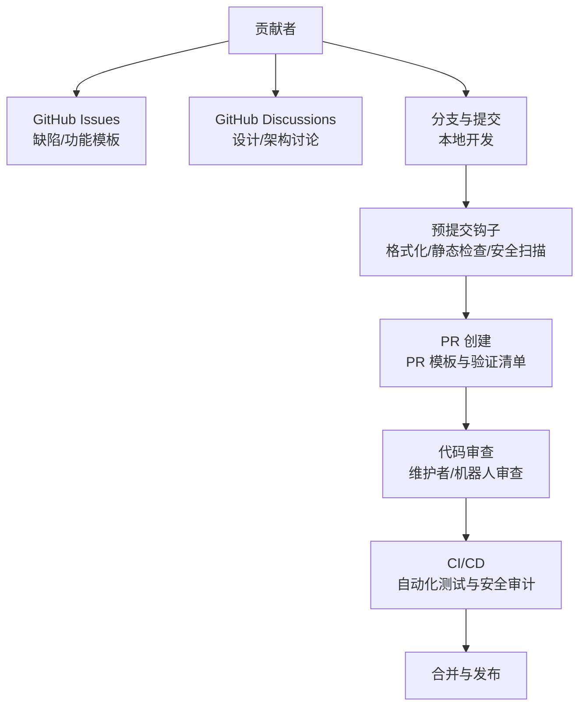
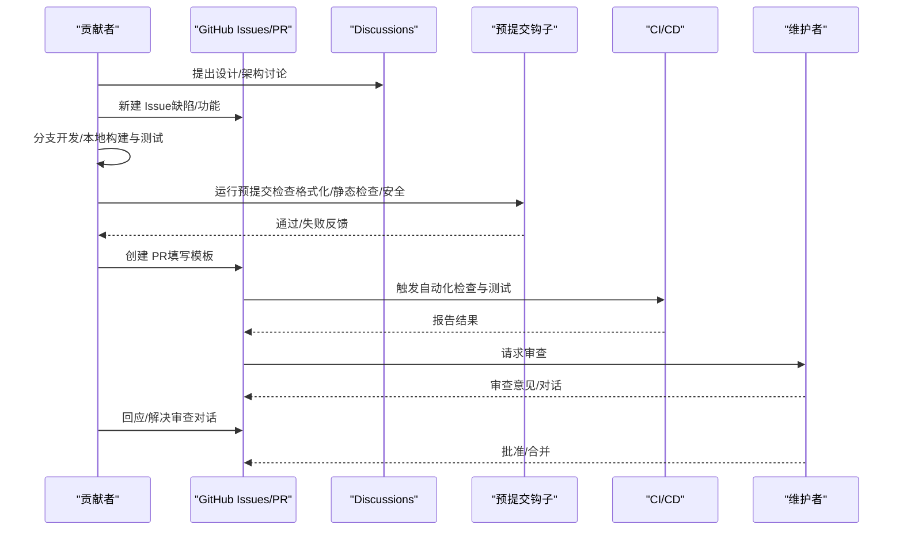
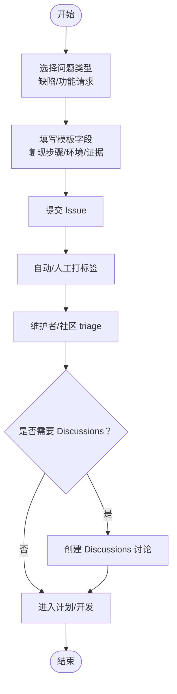
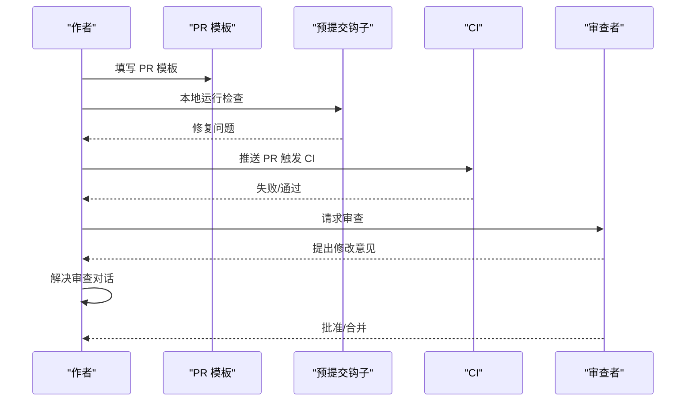
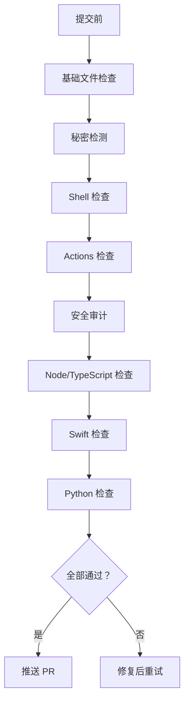
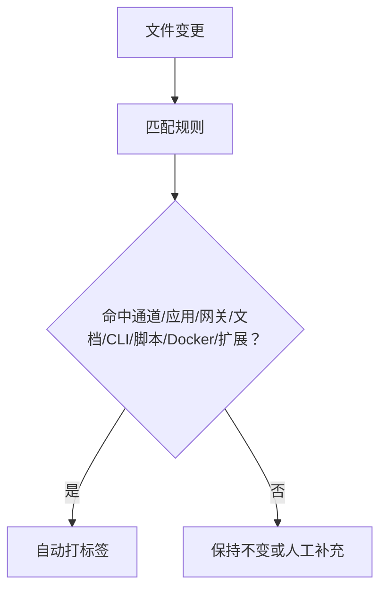
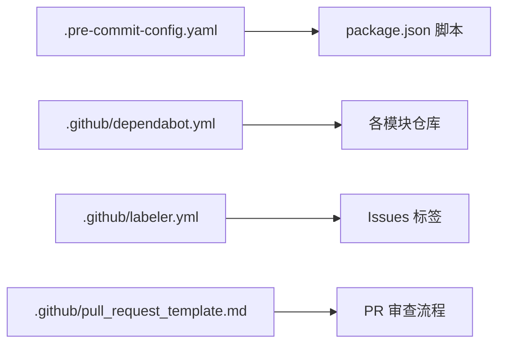

# 贡献流程和规范

## 目录
1. [简介](#简介)
2. [项目结构](#项目结构)
3. [核心组件](#核心组件)
4. [架构总览](#架构总览)
5. [详细组件分析](#详细组件分析)
6. [依赖分析](#依赖分析)
7. [性能考虑](#性能考虑)
8. [故障排除指南](#故障排除指南)
9. [结论](#结论)
10. [附录](#附录)

## 简介
本指南面向所有希望为 OpenClaw 做出贡献的开发者与社区成员，覆盖从问题报告到 Pull Request 合并的完整流程，包括 GitHub Discussions 的使用、Issue 标签系统、PR 模板、分支与提交规范、代码审查流程、预提交钩子与代码质量检查工具、不同类型贡献的实践建议（缺陷修复、功能新增、文档改进、测试增强），以及社区参与方式（Discord 讨论、问题回答、文档翻译）与维护者职责及项目治理结构。

## 项目结构
OpenClaw 是一个大型多语言、多平台的个人 AI 助手项目，采用 monorepo 结构，包含核心网关、CLI、多平台应用（macOS/iOS/Android）、浏览器扩展、技能生态、文档与自动化脚本等模块。贡献流程围绕以下关键要素展开：
- Issue 模板与标签系统：用于分类缺陷、功能请求与支持咨询
- Discussions：重大变更与跨模块设计讨论
- PR 模板：标准化 PR 描述与验证清单
- 预提交钩子与 CI 工具链：统一代码质量与安全基线
- 维护者团队与治理：明确角色与责任边界

[本图为概念性结构图，不直接映射具体源码文件，故无“图表来源”标注]

## 核心组件
- 贡献入口与沟通渠道
  - GitHub Issues：缺陷报告与功能请求，使用模板确保可复现性与影响评估
  - GitHub Discussions：新特性、架构变更、跨模块设计的讨论
  - Discord：实时帮助与社区互动
- PR 流程与模板
  - PR 模板强制填写变更类型、作用范围、安全影响、验证步骤、兼容性与回滚方案等
  - 审查对话作者负责跟进，机器人审查对话需由作者处理
- 代码质量与安全
  - 预提交钩子：文件卫生、大文件检测、合并冲突、私钥扫描、ShellLint、ActionLint、安全审计、Node/TypeScript 检查、SwiftLint/Format、Python 检查与测试
  - CI 工具链：与预提交一致的检查命令，确保一致性
- Issue 标签系统
  - 自动标签：按文件路径匹配自动打上通道、应用、网关、文档、CLI、脚本、Docker、代理扩展等标签
- 依赖更新策略
  - Dependabot：按生态分组与冷却期管理，限制同时打开的 PR 数量

**章节来源**
- file://CONTRIBUTING.md#L76-L101
- file://.github/pull_request_template.md#L1-L116
- file://.github/labeler.yml#L1-L259
- file://.github/dependabot.yml#L1-L128
- file://.pre-commit-config.yaml#L1-L158
- file://package.json#L217-L334

## 架构总览
下图展示了从问题发现到 PR 合并的关键交互与质量控制节点：

**图表来源**
- [CONTRIBUTING.md](file://CONTRIBUTING.md#L76-L101)
- [.pre-commit-config.yaml](file://.pre-commit-config.yaml#L1-L158)
- [.github/pull_request_template.md](file://.github/pull_request_template.md#L1-L116)

## 详细组件分析

### 问题报告与功能请求模板
- 缺陷报告模板强制提供：缺陷类型、摘要、复现步骤、期望行为、实际行为、版本、操作系统、安装方式、模型与路由链、配置位置、日志证据、影响与严重性、附加信息等
- 功能请求模板强制提供：摘要、要解决的问题、提议的解决方案、替代方案、影响与严重性、证据/示例、附加信息等
- 用途：确保问题可复现、可追踪、可评估优先级与影响面

**图表来源**
- [.github/ISSUE_TEMPLATE/bug_report.yml](file://.github/ISSUE_TEMPLATE/bug_report.yml#L1-L138)
- [.github/ISSUE_TEMPLATE/feature_request.yml](file://.github/ISSUE_TEMPLATE/feature_request.yml#L1-L71)
- [.github/ISSUE_TEMPLATE/config.yml](file://.github/ISSUE_TEMPLATE/config.yml#L1-L9)

**章节来源**
- file://.github/ISSUE_TEMPLATE/bug_report.yml#L1-L138
- file://.github/ISSUE_TEMPLATE/feature_request.yml#L1-L71
- file://.github/ISSUE_TEMPLATE/config.yml#L1-L9

### PR 模板与审查流程
- PR 模板涵盖：摘要、变更类型、作用范围、关联 Issue/PR、用户可见行为变化、安全影响、环境与复现步骤、预期/实际结果、证据、人工验证、审查对话状态、兼容性与迁移、故障恢复、风险与缓解
- 审查对话作者负责：解决机器人审查对话；仅保留需要维护者判断的对话
- 本地与 CI 一致性：package.json 中定义的检查脚本与预提交钩子保持一致

**图表来源**
- [.github/pull_request_template.md](file://.github/pull_request_template.md#L1-L116)
- [CONTRIBUTING.md](file://CONTRIBUTING.md#L92-L101)
- [package.json](file://package.json#L217-L334)
- [.pre-commit-config.yaml](file://.pre-commit-config.yaml#L117-L158)

**章节来源**
- file://.github/pull_request_template.md#L1-L116
- file://CONTRIBUTING.md#L92-L101
- file://package.json#L217-L334
- file://.pre-commit-config.yaml#L117-L158

### 预提交钩子与代码质量检查
- 文件与安全
  - 基础文件卫生：尾随空白、文件结尾、YAML 校验、大文件检测、合并冲突检测、私钥扫描
  - 秘密检测：基于 baseline 与排除规则，避免误报
- 脚本与工作流
  - Shell 检查：shellcheck，严格错误级别
  - GitHub Actions 检查：actionlint
  - 安全审计：zizmor，限定最小严重性与置信度
- 项目检查（与 CI 一致）
  - pnpm audit 生产依赖
  - oxlint（TypeScript/JavaScript）与 oxfmt（格式化）
  - SwiftLint/SwiftFormat（Swift）
  - Python：ruff（lint）与 pytest（测试）
- 本地执行
  - 安装：pre-commit install
  - 全量运行：pre-commit run --all-files

**图表来源**
- [.pre-commit-config.yaml](file://.pre-commit-config.yaml#L1-L158)
- [pyproject.toml](file://pyproject.toml#L1-L11)
- [package.json](file://package.json#L217-L334)

**章节来源**
- file://.pre-commit-config.yaml#L1-L158
- file://pyproject.toml#L1-L11
- file://package.json#L217-L334

### Issue 标签系统与自动标签
- 自动标签规则：基于文件路径匹配，自动为不同模块（通道、应用、网关、文档、CLI、脚本、Docker、代理扩展等）打标签
- 优势：提升 triage 效率，便于跨模块协作与责任划分

**图表来源**
- [.github/labeler.yml](file://.github/labeler.yml#L1-L259)

**章节来源**
- file://.github/labeler.yml#L1-L259

### 依赖更新策略（Dependabot）
- 分生态配置：npm、GitHub Actions、Swift（macOS 应用、共享库、Swabble）、Gradle（Android）、Docker（镜像）
- 更新节奏：每日/每周，冷却期与最大 PR 数限制
- 目标：降低供应链风险，减少维护负担

**章节来源**
- file://.github/dependabot.yml#L1-L128

### 安全报告与信任模型
- 安全报告渠道：按模块归属仓库或邮件路由
- 必备信息：标题、严重性评估、影响、受影响组件、技术复现、演示影响、环境、修复建议
- 报告验收门禁：要求可复现 PoC、明确影响边界、排除常见误报模式
- 信任模型：个人助理模型（单用户受信任操作者），不假设多租户对抗边界；插件/扩展视为可信计算基的一部分

**章节来源**
- file://SECURITY.md#L1-L286

## 依赖分析
- 质量与安全工具链
  - 预提交钩子与 CI 使用同一套检查命令，保证一致性
  - 依赖自动更新由 Dependabot 管理，降低供应链风险
- 沟通与协作
  - Issues 模板与标签系统提升问题可追踪性
  - Discussions 作为设计与架构讨论的前置渠道，降低 PR 冲突成本

**图表来源**
- [.pre-commit-config.yaml](file://.pre-commit-config.yaml#L1-L158)
- [package.json](file://package.json#L217-L334)
- [.github/dependabot.yml](file://.github/dependabot.yml#L1-L128)
- [.github/labeler.yml](file://.github/labeler.yml#L1-L259)
- [.github/pull_request_template.md](file://.github/pull_request_template.md#L1-L116)

**章节来源**
- file://.pre-commit-config.yaml#L1-L158
- file://package.json#L217-L334
- file://.github/dependabot.yml#L1-L128
- file://.github/labeler.yml#L1-L259
- file://.github/pull_request_template.md#L1-L116

## 性能考虑
- 预提交检查在本地快速反馈，避免 CI 失败带来的迭代成本
- Dependabot 分组与冷却期减少频繁更新对主干的影响
- 代码格式化与静态检查统一风格，降低审查成本与维护难度

[本节为通用指导，无需“章节来源”]

## 故障排除指南
- 预提交失败
  - 检查本地是否安装并启用 pre-commit
  - 使用全量运行定位问题：pre-commit run --all-files
  - 参考对应工具的配置与排除规则进行修正
- CI 失败
  - 对照 package.json 中的脚本与 .pre-commit-config.yaml 的工具配置
  - 重点关注 Node/TypeScript、Swift、Python、Shell、Actions、安全审计等检查项
- 审查对话未被处理
  - 遵循“审查对话作者负责”的原则，解决机器人审查对话后再请求二次审查
- 安全报告
  - 严格按要求提供复现步骤、影响与修复建议，避免因缺少必要信息导致降级处理

**章节来源**
- file://.pre-commit-config.yaml#L1-L158
- file://package.json#L217-L334
- file://CONTRIBUTING.md#L92-L101
- file://SECURITY.md#L20-L46

## 结论
OpenClaw 的贡献流程以“可复现、可追踪、可审查、可安全”为核心目标，通过模板化的问题与 PR、自动化的预提交与 CI、清晰的标签与讨论渠道，以及明确的安全与信任模型，为高质量贡献提供了系统保障。建议贡献者在提交前充分阅读模板与规范，遵循本地检查与审查流程，共同维护项目的长期健康与可演进性。

[本节为总结性内容，无需“章节来源”]

## 附录

### 不同类型贡献指南
- 缺陷修复
  - 使用缺陷报告模板，提供可复现步骤、日志与影响评估
  - 在 PR 模板中明确问题原因、修复范围与验证方法
- 功能新增
  - 先在 Discussions 中提出设计草案，收集反馈
  - 在 PR 模板中说明变更类型、作用范围、安全影响与兼容性
- 文档改进
  - 使用文档检查脚本与格式化工具，确保一致性
  - 关注链接有效性与拼写检查
- 测试增强
  - 补充单元测试与端到端测试，确保回归覆盖
  - 在 CI 中验证测试通过

**章节来源**
- file://.github/ISSUE_TEMPLATE/bug_report.yml#L1-L138
- file://.github/ISSUE_TEMPLATE/feature_request.yml#L1-L71
- file://.github/pull_request_template.md#L1-L116
- file://package.json#L232-L249

### 社区参与方式
- Discord：加入帮助频道与互助频道，回答问题、分享经验
- GitHub Discussions：参与设计与架构讨论，推动跨模块协作
- 文档翻译：在 docs 与 zh-CN 目录下贡献翻译与校对
- 无障碍与包容：遵循项目包容性准则，营造友好社区氛围

**章节来源**
- file://CONTRIBUTING.md#L7-L11
- file://README.md#L493-L496

### 维护者职责与项目治理
- 维护者职责
  - triage 问题与 PR，分配责任模块
  - 审查代码质量与安全性，确保符合模板与规范
  - 协调跨模块变更，推动 Discussions 中达成共识
- 申请成为维护者
  - 需要积极贡献与社区参与，邮件提交背景、经验与兴趣
  - 由现有维护者评估与决定，逐步扩大团队规模

**章节来源**
- file://CONTRIBUTING.md#L12-L75
- file://CONTRIBUTING.md#L142-L160