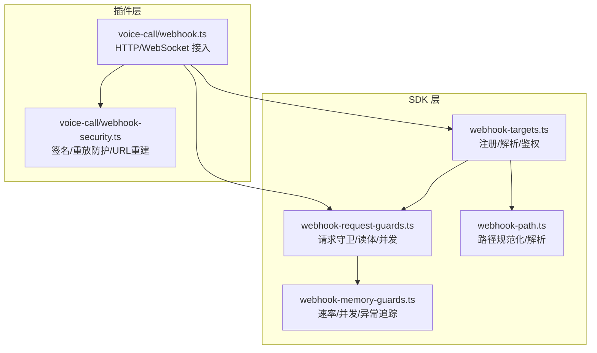
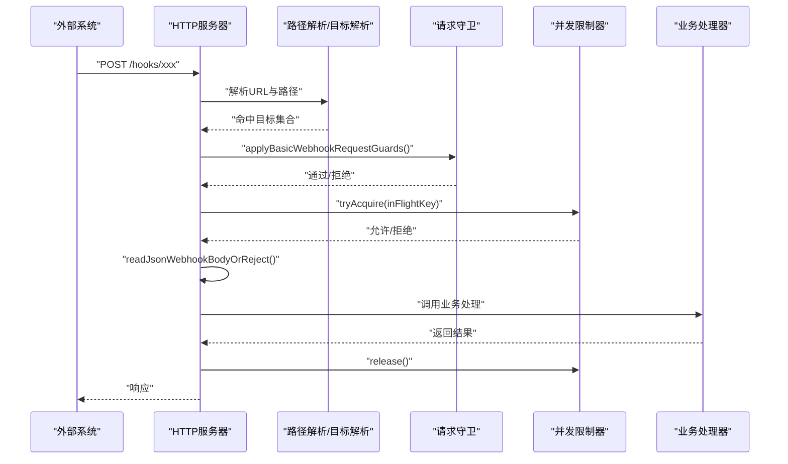
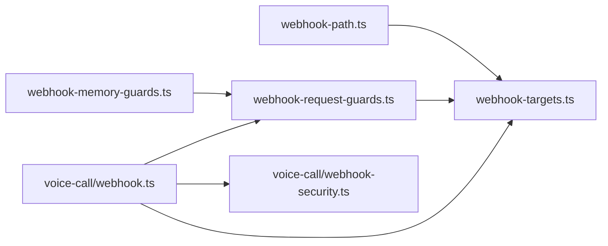

# Webhook事件API

## 目录
1. [简介](#简介)
2. [项目结构](#项目结构)
3. [核心组件](#核心组件)
4. [架构总览](#架构总览)
5. [详细组件分析](#详细组件分析)
6. [依赖关系分析](#依赖关系分析)
7. [性能考量](#性能考量)
8. [故障排查指南](#故障排查指南)
9. [结论](#结论)
10. [附录](#附录)

## 简介
本文件为 OpenClaw Webhook 事件 API 的权威参考文档，覆盖从 Webhook 注册、请求验证、目标解析到事件分发的完整处理流程。重点说明以下核心函数与能力：
- Webhook 目标注册与路由：registerWebhookTarget、registerWebhookTargetWithPluginRoute
- 请求预处理与安全守卫：applyBasicWebhookRequestGuards、beginWebhookRequestPipelineOrReject、readWebhookBodyOrReject、readJsonWebhookBodyOrReject
- 路径规范化与匹配：normalizeWebhookPath、resolveWebhookPath、resolveWebhookTargets
- 单目标选择与鉴权：resolveSingleWebhookTarget、resolveSingleWebhookTargetAsync、resolveWebhookTargetWithAuthOrReject、resolveWebhookTargetWithAuthOrRejectSync
- 并发与限流：createWebhookInFlightLimiter、createFixedWindowRateLimiter、createWebhookAnomalyTracker
- 实战示例与最佳实践：基于 voice-call 插件的实现与安全策略

## 项目结构
OpenClaw 将 Webhook 能力拆分为“SDK 层”和“插件层”：
- SDK 层（plugin-sdk）：提供通用的 Webhook 注册、请求守卫、路径处理、内存守卫等工具。
- 插件层（extensions/*）：具体通道（如 voice-call）实现各自的 Webhook 接收与处理逻辑，并复用 SDK 层能力。

图表来源
- [src/plugin-sdk/webhook-targets.ts](file://src/plugin-sdk/webhook-targets.ts#L1-L282)
- [src/plugin-sdk/webhook-request-guards.ts](file://src/plugin-sdk/webhook-request-guards.ts#L1-L291)
- [src/plugin-sdk/webhook-path.ts](file://src/plugin-sdk/webhook-path.ts#L1-L32)
- [src/plugin-sdk/webhook-memory-guards.ts](file://src/plugin-sdk/webhook-memory-guards.ts#L1-L197)
- [extensions/voice-call/src/webhook.ts](file://extensions/voice-call/src/webhook.ts#L1-L488)
- [extensions/voice-call/src/webhook-security.ts](file://extensions/voice-call/src/webhook-security.ts#L1-L981)

章节来源
- [src/plugin-sdk/webhook-targets.ts](file://src/plugin-sdk/webhook-targets.ts#L1-L282)
- [src/plugin-sdk/webhook-request-guards.ts](file://src/plugin-sdk/webhook-request-guards.ts#L1-L291)
- [src/plugin-sdk/webhook-path.ts](file://src/plugin-sdk/webhook-path.ts#L1-L32)
- [src/plugin-sdk/webhook-memory-guards.ts](file://src/plugin-sdk/webhook-memory-guards.ts#L1-L197)
- [extensions/voice-call/src/webhook.ts](file://extensions/voice-call/src/webhook.ts#L1-L488)
- [extensions/voice-call/src/webhook-security.ts](file://extensions/voice-call/src/webhook-security.ts#L1-L981)

## 核心组件
- Webhook 目标注册与路由
  - registerWebhookTarget：将目标按规范化路径注册到 Map；支持首次/最后生命周期钩子；返回可注销句柄。
  - registerWebhookTargetWithPluginRoute：在首次目标注册时向插件 HTTP 路由表注册路由，在最后目标移除时清理路由。
- 请求处理流水线
  - withResolvedWebhookRequestPipeline：解析路径与目标后，执行方法白名单、速率、JSON 内容类型、并发限制等守卫，再调用业务处理器。
  - applyBasicWebhookRequestGuards：基础守卫（方法、速率、媒体类型）。
  - beginWebhookRequestPipelineOrReject：整合守卫与并发限制，返回 release 钩子确保异常时释放资源。
- 请求体读取
  - readWebhookBodyOrReject：按配置读取原始请求体并做超时/大小限制。
  - readJsonWebhookBodyOrReject：读取 JSON 并做空对象回退、错误映射。
- 路径处理
  - normalizeWebhookPath：统一去除多余空白、补全前缀斜杠、去除尾部斜杠。
  - resolveWebhookPath：优先使用显式路径或从 URL 解析路径，默认路径可选。
- 目标选择与鉴权
  - resolveWebhookTargets：根据请求 URL 解析目标集合。
  - resolveSingleWebhookTarget / resolveSingleWebhookTargetAsync：单目标匹配，遇到多匹配直接判定歧义。
  - resolveWebhookTargetWithAuthOrReject / Sync：同步/异步鉴权，返回目标或写入 401/401 消息。
  - rejectNonPostWebhookRequest：非 POST 直接拒绝。
- 并发与限流
  - createWebhookInFlightLimiter：固定窗口并发限制器。
  - createFixedWindowRateLimiter：固定窗口速率限制器。
  - createWebhookAnomalyTracker：异常状态码计数与日志告警。
- 安全与 URL 重建
  - reconstructWebhookUrl：安全地从转发头重建公网 URL，防止主机头注入。
  - Twilio/Telnyx/Plivo 签名校验与重放检测。

章节来源
- [src/plugin-sdk/webhook-targets.ts](file://src/plugin-sdk/webhook-targets.ts#L57-L100)
- [src/plugin-sdk/webhook-targets.ts](file://src/plugin-sdk/webhook-targets.ts#L115-L162)
- [src/plugin-sdk/webhook-targets.ts](file://src/plugin-sdk/webhook-targets.ts#L139-L177)
- [src/plugin-sdk/webhook-targets.ts](file://src/plugin-sdk/webhook-targets.ts#L179-L220)
- [src/plugin-sdk/webhook-targets.ts](file://src/plugin-sdk/webhook-targets.ts#L222-L248)
- [src/plugin-sdk/webhook-targets.ts](file://src/plugin-sdk/webhook-targets.ts#L273-L281)
- [src/plugin-sdk/webhook-request-guards.ts](file://src/plugin-sdk/webhook-request-guards.ts#L84-L128)
- [src/plugin-sdk/webhook-request-guards.ts](file://src/plugin-sdk/webhook-request-guards.ts#L139-L177)
- [src/plugin-sdk/webhook-request-guards.ts](file://src/plugin-sdk/webhook-request-guards.ts#L179-L227)
- [src/plugin-sdk/webhook-request-guards.ts](file://src/plugin-sdk/webhook-request-guards.ts#L229-L290)
- [src/plugin-sdk/webhook-path.ts](file://src/plugin-sdk/webhook-path.ts#L1-L32)
- [src/plugin-sdk/webhook-memory-guards.ts](file://src/plugin-sdk/webhook-memory-guards.ts#L51-L105)
- [src/plugin-sdk/webhook-memory-guards.ts](file://src/plugin-sdk/webhook-memory-guards.ts#L164-L196)
- [extensions/voice-call/src/webhook-security.ts](file://extensions/voice-call/src/webhook-security.ts#L258-L347)

## 架构总览
下图展示一次 Webhook 请求从接入到处理的端到端流程，包括路径解析、鉴权、并发控制、请求体读取与业务处理。

图表来源
- [src/plugin-sdk/webhook-targets.ts](file://src/plugin-sdk/webhook-targets.ts#L102-L113)
- [src/plugin-sdk/webhook-targets.ts](file://src/plugin-sdk/webhook-targets.ts#L115-L162)
- [src/plugin-sdk/webhook-request-guards.ts](file://src/plugin-sdk/webhook-request-guards.ts#L139-L177)
- [src/plugin-sdk/webhook-request-guards.ts](file://src/plugin-sdk/webhook-request-guards.ts#L179-L227)
- [src/plugin-sdk/webhook-request-guards.ts](file://src/plugin-sdk/webhook-request-guards.ts#L229-L290)

## 详细组件分析

### Webhook 目标注册与路由
- registerWebhookTarget
  - 功能：规范化路径，写入 Map；首次注册触发 onFirstPathTarget 生命周期回调（若返回函数则作为该路径的 teardown）；支持注销清理。
  - 返回：RegisteredWebhookTarget，包含 target 与 unregister。
- registerWebhookTargetWithPluginRoute
  - 功能：在首次目标注册时通过 registerPluginHttpRoute 注册插件路由；最后目标移除时清理路由。
- 生命周期钩子
  - onFirstPathTarget：首次有目标绑定到某路径时调用；若返回函数，则作为该路径的 teardown。
  - onLastPathTargetRemoved：当路径上最后一个目标被注销且 Map 中不再存在该路径时调用。

章节来源
- [src/plugin-sdk/webhook-targets.ts](file://src/plugin-sdk/webhook-targets.ts#L27-L42)
- [src/plugin-sdk/webhook-targets.ts](file://src/plugin-sdk/webhook-targets.ts#L57-L100)
- [src/plugin-sdk/webhook-targets.test.ts](file://src/plugin-sdk/webhook-targets.test.ts#L31-L98)

### 请求处理流水线与守卫
- withResolvedWebhookRequestPipeline
  - 步骤：解析路径与目标 → 守卫（方法、速率、JSON 类型）→ 并发限制 → 执行 handle → finally 释放。
  - 关键参数：allowMethods、rateLimiter/rateLimitKey、requireJsonContentType、inFlightLimiter/inFlightKey、inFlightLimitStatusCode/message。
- applyBasicWebhookRequestGuards
  - 方法白名单校验（405）
  - 速率限制（429）
  - Content-Type 校验（415，仅 POST）
- beginWebhookRequestPipelineOrReject
  - 组合守卫与并发限制，返回 &#123; ok: true, release &#125; 或 &#123; ok: false &#125;。
- readWebhookBodyOrReject / readJsonWebhookBodyOrReject
  - 读取请求体并限制大小与超时；错误映射为 413/408/400 等。

章节来源
- [src/plugin-sdk/webhook-targets.ts](file://src/plugin-sdk/webhook-targets.ts#L115-L162)
- [src/plugin-sdk/webhook-request-guards.ts](file://src/plugin-sdk/webhook-request-guards.ts#L139-L177)
- [src/plugin-sdk/webhook-request-guards.ts](file://src/plugin-sdk/webhook-request-guards.ts#L179-L227)
- [src/plugin-sdk/webhook-request-guards.ts](file://src/plugin-sdk/webhook-request-guards.ts#L229-L290)

### 路径处理与匹配
- normalizeWebhookPath
  - 规范化规则：去空白、补前缀斜杠、去尾斜杠；空路径返回 “/”。
- resolveWebhookPath
  - 优先级：显式路径 > 从 URL 解析 > 默认路径（可为 null）。
- resolveWebhookTargets
  - 基于请求 URL 解析规范化路径，查询 Map 获取目标数组；无匹配返回 null。

章节来源
- [src/plugin-sdk/webhook-path.ts](file://src/plugin-sdk/webhook-path.ts#L1-L11)
- [src/plugin-sdk/webhook-path.ts](file://src/plugin-sdk/webhook-path.ts#L13-L31)
- [src/plugin-sdk/webhook-targets.ts](file://src/plugin-sdk/webhook-targets.ts#L102-L113)

### 目标选择与鉴权
- resolveSingleWebhookTarget / resolveSingleWebhookTargetAsync
  - 同步/异步遍历目标，首个匹配更新；若再次匹配则返回歧义。
- resolveWebhookTargetWithAuthOrReject / Sync
  - 先单目标匹配，再根据结果写入 401/401 消息或返回目标。
- rejectNonPostWebhookRequest
  - 非 POST 直接 405。

章节来源
- [src/plugin-sdk/webhook-targets.ts](file://src/plugin-sdk/webhook-targets.ts#L186-L220)
- [src/plugin-sdk/webhook-targets.ts](file://src/plugin-sdk/webhook-targets.ts#L222-L248)
- [src/plugin-sdk/webhook-targets.ts](file://src/plugin-sdk/webhook-targets.ts#L273-L281)

### 并发与限流
- createWebhookInFlightLimiter
  - tryAcquire/release：基于 key 的并发计数；超过阈值拒绝；自动修剪最大键数。
- createFixedWindowRateLimiter
  - 固定时间窗内统计请求数，超过阈值判定限流。
- createWebhookAnomalyTracker
  - 对 400/401/408/413/415/429 等异常状态码进行计数与周期性日志输出。

章节来源
- [src/plugin-sdk/webhook-request-guards.ts](file://src/plugin-sdk/webhook-request-guards.ts#L84-L128)
- [src/plugin-sdk/webhook-memory-guards.ts](file://src/plugin-sdk/webhook-memory-guards.ts#L51-L105)
- [src/plugin-sdk/webhook-memory-guards.ts](file://src/plugin-sdk/webhook-memory-guards.ts#L164-L196)

### 安全策略与 URL 重建
- reconstructWebhookUrl
  - 优先信任可信代理头（X-Forwarded-*），并进行主机名白名单校验，防止主机头注入。
- Twilio/Telnyx/Plivo 签名校验
  - 提供多种算法与变体尝试，支持时间戳校验与重放窗口。
- 重放检测
  - 基于哈希与时间窗口缓存，避免重复处理。

章节来源
- [extensions/voice-call/src/webhook-security.ts](file://extensions/voice-call/src/webhook-security.ts#L258-L347)
- [extensions/voice-call/src/webhook-security.ts](file://extensions/voice-call/src/webhook-security.ts#L565-L696)
- [extensions/voice-call/src/webhook-security.ts](file://extensions/voice-call/src/webhook-security.ts#L497-L560)

### 实战：Voice Call 插件 Webhook
- 服务启动与升级
  - HTTP 服务器监听配置端口与路径；WebSocket 升级用于媒体流。
- 路径匹配与方法校验
  - 严格匹配配置路径；非 POST 直接 405。
- 请求体读取与错误处理
  - 使用 readRequestBodyWithLimit 限制大小与超时；错误映射为 413/408。
- 签名校验与重放
  - 调用 provider.verifyWebhook 进行签名验证；对重放请求记录并跳过副作用。
- 自动回复与事件处理
  - 解析事件后交由 CallManager 处理；必要时生成语音回复。

章节来源
- [extensions/voice-call/src/webhook.ts](file://extensions/voice-call/src/webhook.ts#L212-L268)
- [extensions/voice-call/src/webhook.ts](file://extensions/voice-call/src/webhook.ts#L341-L410)
- [extensions/voice-call/src/webhook.ts](file://extensions/voice-call/src/webhook.ts#L447-L486)

## 依赖关系分析
- 组件耦合
  - webhook-targets.ts 依赖 webhook-path.ts（路径规范化）、webhook-request-guards.ts（守卫与并发）、plugins/http-registry.js（插件路由注册）。
  - webhook-request-guards.ts 依赖 infra/http-body.js（请求体读取）、webhook-memory-guards.ts（速率/并发）。
  - 插件层（voice-call）依赖 SDK 层能力，同时引入安全模块。
- 外部依赖
  - Node.js http/https、URL、crypto、Buffer。
  - 插件路由注册（registerPluginHttpRoute）来自插件运行时。

图表来源
- [src/plugin-sdk/webhook-targets.ts](file://src/plugin-sdk/webhook-targets.ts#L1-L8)
- [src/plugin-sdk/webhook-request-guards.ts](file://src/plugin-sdk/webhook-request-guards.ts#L1-L9)
- [extensions/voice-call/src/webhook.ts](file://extensions/voice-call/src/webhook.ts#L1-L17)
- [extensions/voice-call/src/webhook-security.ts](file://extensions/voice-call/src/webhook-security.ts#L1-L3)

章节来源
- [src/plugin-sdk/webhook-targets.ts](file://src/plugin-sdk/webhook-targets.ts#L1-L8)
- [src/plugin-sdk/webhook-request-guards.ts](file://src/plugin-sdk/webhook-request-guards.ts#L1-L9)
- [extensions/voice-call/src/webhook.ts](file://extensions/voice-call/src/webhook.ts#L1-L17)

## 性能考量
- 请求体读取
  - 预认证阶段默认上限较小（KB 级），认证后阶段更大（MB 级），避免慢客户端拖垮服务。
- 并发限制
  - 默认每键并发上限与最大跟踪键数可配置；建议按路径+远端地址组合键，避免热点攻击。
- 速率限制
  - 固定窗口大小与最大跟踪键数可调；建议结合客户端 IP 与目标标识构造 key。
- 异常追踪
  - 对高频异常状态码进行周期性日志输出，便于快速定位问题。

章节来源
- [src/plugin-sdk/webhook-request-guards.ts](file://src/plugin-sdk/webhook-request-guards.ts#L13-L27)
- [src/plugin-sdk/webhook-request-guards.ts](file://src/plugin-sdk/webhook-request-guards.ts#L84-L128)
- [src/plugin-sdk/webhook-memory-guards.ts](file://src/plugin-sdk/webhook-memory-guards.ts#L25-L35)
- [src/plugin-sdk/webhook-memory-guards.ts](file://src/plugin-sdk/webhook-memory-guards.ts#L164-L196)

## 故障排查指南
- 405 Method Not Allowed
  - 现象：非 POST 请求。
  - 排查：确认 allowMethods 设置与客户端方法一致。
- 413 Payload Too Large / 408 Request Timeout
  - 现象：请求体过大或读取超时。
  - 排查：检查 readWebhookBodyOrReject/readJsonWebhookBodyOrReject 的 maxBytes/timeoutMs；确认网络稳定性。
- 415 Unsupported Media Type
  - 现象：requireJsonContentType 开启但 Content-Type 不是 application/json 或 +json。
  - 排查：修正 Content-Type 或关闭 requireJsonContentType。
- 429 Too Many Requests
  - 现象：速率限制或并发限制触发。
  - 排查：检查 rateLimiter/rateLimitKey、inFlightLimiter 的 key 设计与阈值；优化客户端重试策略。
- 401 Unauthorized / 401 Ambiguous
  - 现象：鉴权失败或多目标匹配。
  - 排查：确认 isMatch 条件唯一性；检查鉴权头或令牌。
- 主机头注入与重放
  - 现象：URL 重建不正确或重复处理。
  - 排查：使用 reconstructWebhookUrl 并配置 allowedHosts/trustForwardingHeaders；启用重放检测。

章节来源
- [src/plugin-sdk/webhook-request-guards.ts](file://src/plugin-sdk/webhook-request-guards.ts#L58-L82)
- [src/plugin-sdk/webhook-request-guards.ts](file://src/plugin-sdk/webhook-request-guards.ts#L139-L177)
- [src/plugin-sdk/webhook-targets.ts](file://src/plugin-sdk/webhook-targets.ts#L250-L271)
- [extensions/voice-call/src/webhook-security.ts](file://extensions/voice-call/src/webhook-security.ts#L258-L347)

## 结论
OpenClaw 的 Webhook 体系以 SDK 层为核心，提供路径规范化、目标注册、鉴权、并发与速率控制、请求体读取等通用能力，并通过插件层（如 voice-call）落地具体场景。遵循本文档的安全策略与最佳实践，可在保证性能与稳定性的前提下，快速扩展新的 Webhook 接入点。

## 附录

### API 参考速览
- 路径处理
  - normalizeWebhookPath(raw: string): string
  - resolveWebhookPath(params: &#123; webhookPath?: string; webhookUrl?: string; defaultPath?: string | null &#125;): string | null
- 目标注册与解析
  - registerWebhookTarget(targetsByPath, target, opts?): RegisteredWebhookTarget
  - registerWebhookTargetWithPluginRoute(params): RegisteredWebhookTarget
  - resolveWebhookTargets(req, targetsByPath): &#123; path; targets &#125; | null
  - withResolvedWebhookRequestPipeline(params): Promise&lt;boolean&gt;
- 鉴权与单目标选择
  - resolveSingleWebhookTarget(targets, isMatch): WebhookTargetMatchResult
  - resolveSingleWebhookTargetAsync(targets, isMatch): Promise&lt;WebhookTargetMatchResult&gt;
  - resolveWebhookTargetWithAuthOrReject(params): Promise&lt;T | null>
  - resolveWebhookTargetWithAuthOrRejectSync(params): T | null
  - rejectNonPostWebhookRequest(req, res): boolean
- 请求守卫与读体
  - applyBasicWebhookRequestGuards(params): boolean
  - beginWebhookRequestPipelineOrReject(params): &#123; ok; release &#125;
  - readWebhookBodyOrReject(params): Promise&lt;&#123; ok; value &#125; | &#123; ok &#125;>
  - readJsonWebhookBodyOrReject(params): Promise&lt;&#123; ok; value &#125; | &#123; ok &#125;>
- 并发与限流
  - createWebhookInFlightLimiter(options): WebhookInFlightLimiter
  - createFixedWindowRateLimiter(options): FixedWindowRateLimiter
  - createWebhookAnomalyTracker(options): WebhookAnomalyTracker

章节来源
- [src/plugin-sdk/webhook-path.ts](file://src/plugin-sdk/webhook-path.ts#L1-L32)
- [src/plugin-sdk/webhook-targets.ts](file://src/plugin-sdk/webhook-targets.ts#L57-L100)
- [src/plugin-sdk/webhook-targets.ts](file://src/plugin-sdk/webhook-targets.ts#L102-L162)
- [src/plugin-sdk/webhook-targets.ts](file://src/plugin-sdk/webhook-targets.ts#L186-L248)
- [src/plugin-sdk/webhook-targets.ts](file://src/plugin-sdk/webhook-targets.ts#L273-L281)
- [src/plugin-sdk/webhook-request-guards.ts](file://src/plugin-sdk/webhook-request-guards.ts#L139-L290)
- [src/plugin-sdk/webhook-memory-guards.ts](file://src/plugin-sdk/webhook-memory-guards.ts#L51-L196)

### 最佳实践
- 安全
  - 仅在受信网络暴露 Webhook；使用专用令牌；禁止查询串传令牌。
  - 使用 allowedHosts 与信任代理配置，防止主机头注入。
  - 对外网签名（Twilio/Telnyx/Plivo）进行严格校验与重放检测。
- 性能
  - 合理设置并发与速率阈值；按路径+远端地址构造 inFlightKey/rateLimitKey。
  - 预认证阶段读体更严格，认证后阶段放宽。
- 可观测性
  - 启用异常追踪与日志输出；关注 4xx/5xx 分布。
- 文档与 CLI
  - 参考自动化文档了解内置 /hooks/&#123;wake,agent&#125; 端点与配置项。
  - 使用 CLI 命令进行 Gmail Pub/Sub 集成辅助。

章节来源
- [docs/automation/webhook.md](file://docs/automation/webhook.md#L204-L216)
- [docs/cli/webhooks.md](file://docs/cli/webhooks.md#L1-L26)