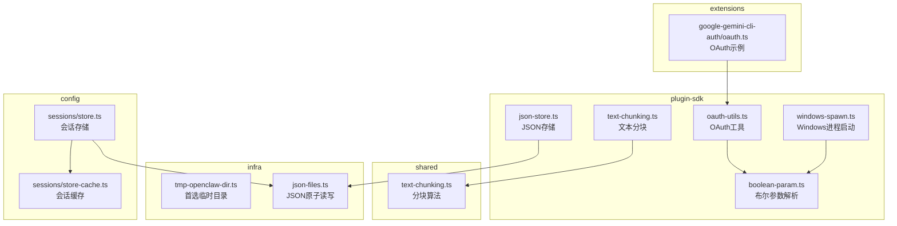
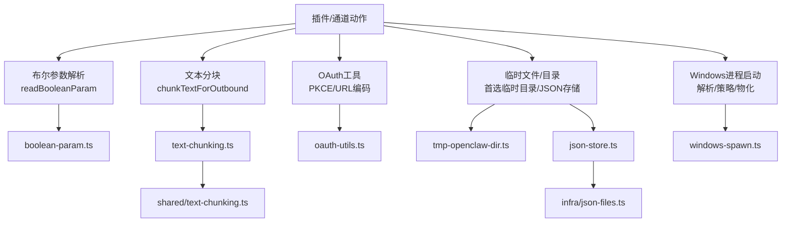
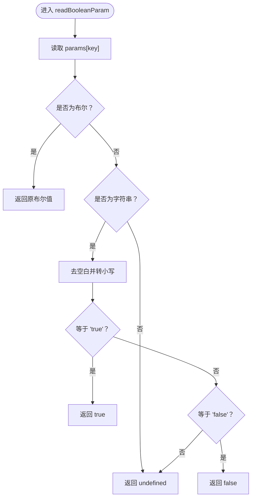
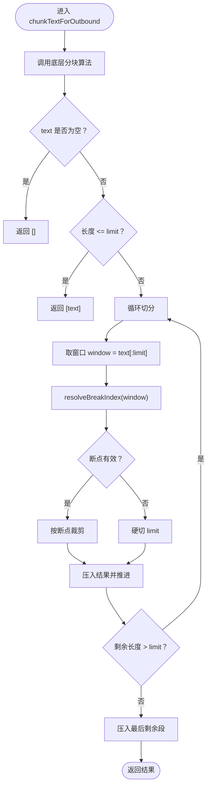
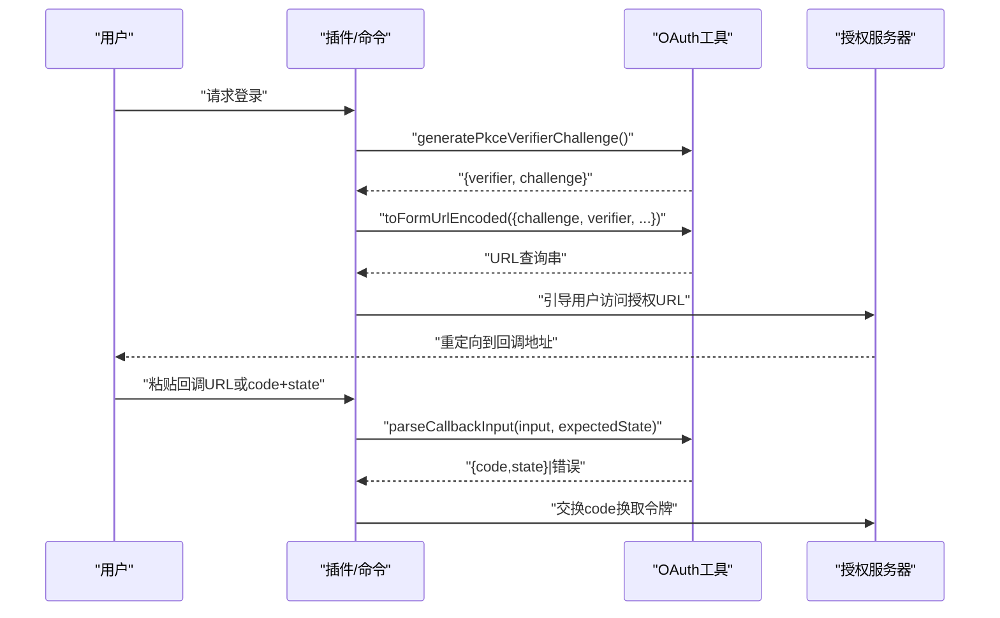
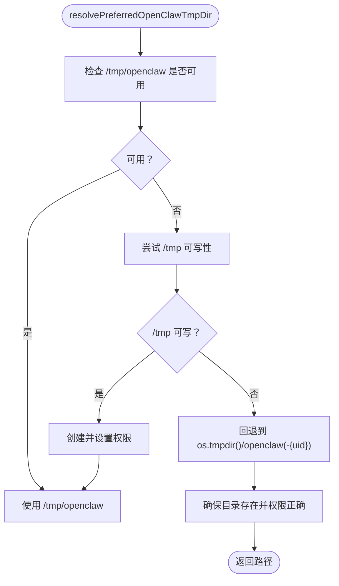
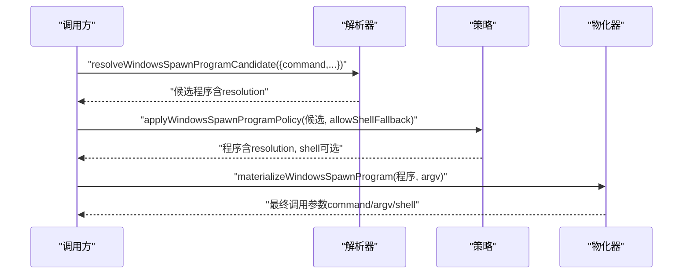
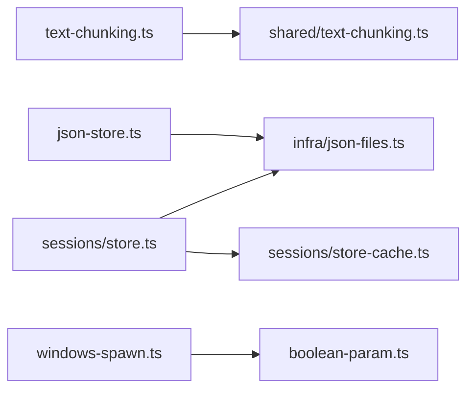

# 工具辅助API

## 目录
1. [简介](#简介)
2. [项目结构](#项目结构)
3. [核心组件](#核心组件)
4. [架构总览](#架构总览)
5. [详细组件分析](#详细组件分析)
6. [依赖关系分析](#依赖关系分析)
7. [性能考量](#性能考量)
8. [故障排查指南](#故障排查指南)
9. [结论](#结论)
10. [附录](#附录)

## 简介
本文件为 OpenClaw 工具辅助API的完整参考文档，覆盖以下主题：
- 布尔参数解析：readBooleanParam
- 文本分块与出站消息：chunkTextForOutbound 及其底层算法
- OAuth 工具：PKCE 验证器与挑战生成、回调解析
- 临时文件与目录管理：首选临时目录解析、原子写入JSON、会话存储缓存
- Windows 进程启动策略：可执行解析、入口点推断、安全策略应用
- JSON 存储与读取：安全读取与原子写入

文档提供每个工具API的函数签名、参数类型、返回值结构、使用场景、设计要点、性能与安全考量，并给出最佳实践建议。

## 项目结构
工具辅助API主要分布在以下模块：
- plugin-sdk：通用工具（布尔参数、文本分块、OAuth工具、Windows进程、JSON存储）
- shared：跨模块共享的文本分块算法
- infra：系统级基础设施（临时目录、JSON原子读写）
- config：配置与会话存储（含缓存与平台差异处理）
- extensions：特定扩展中的OAuth流程示例

**图表来源**
- [src/plugin-sdk/boolean-param.ts](file://src/plugin-sdk/boolean-param.ts#L1-L20)
- [src/plugin-sdk/text-chunking.ts](file://src/plugin-sdk/text-chunking.ts#L1-L10)
- [src/shared/text-chunking.ts](file://src/shared/text-chunking.ts#L1-L35)
- [src/plugin-sdk/oauth-utils.ts](file://src/plugin-sdk/oauth-utils.ts#L1-L14)
- [src/plugin-sdk/windows-spawn.ts](file://src/plugin-sdk/windows-spawn.ts#L1-L300)
- [src/infra/tmp-openclaw-dir.ts](file://src/infra/tmp-openclaw-dir.ts#L1-L169)
- [src/plugin-sdk/json-store.ts](file://src/plugin-sdk/json-store.ts#L1-L31)
- [src/infra/json-files.ts](file://src/infra/json-files.ts#L1-L25)
- [src/config/sessions/store.ts](file://src/config/sessions/store.ts#L213-L509)
- [src/config/sessions/store-cache.ts](file://src/config/sessions/store-cache.ts#L1-L81)
- [extensions/google-gemini-cli-auth/oauth.ts](file://extensions/google-gemini-cli-auth/oauth.ts#L261-L303)

**章节来源**
- [src/plugin-sdk/boolean-param.ts](file://src/plugin-sdk/boolean-param.ts#L1-L20)
- [src/plugin-sdk/text-chunking.ts](file://src/plugin-sdk/text-chunking.ts#L1-L10)
- [src/shared/text-chunking.ts](file://src/shared/text-chunking.ts#L1-L35)
- [src/plugin-sdk/oauth-utils.ts](file://src/plugin-sdk/oauth-utils.ts#L1-L14)
- [src/plugin-sdk/windows-spawn.ts](file://src/plugin-sdk/windows-spawn.ts#L1-L300)
- [src/infra/tmp-openclaw-dir.ts](file://src/infra/tmp-openclaw-dir.ts#L1-L169)
- [src/plugin-sdk/json-store.ts](file://src/plugin-sdk/json-store.ts#L1-L31)
- [src/infra/json-files.ts](file://src/infra/json-files.ts#L1-L25)
- [src/config/sessions/store.ts](file://src/config/sessions/store.ts#L213-L509)
- [src/config/sessions/store-cache.ts](file://src/config/sessions/store-cache.ts#L1-L81)
- [extensions/google-gemini-cli-auth/oauth.ts](file://extensions/google-gemini-cli-auth/oauth.ts#L261-L303)

## 核心组件
本节概述工具API的功能与职责，便于快速定位与使用。

- 布尔参数解析 readBooleanParam
  - 功能：从参数对象中解析布尔值，支持字符串"true"/"false"（大小写不敏感）与原始布尔值
  - 返回：布尔值或未定义
  - 使用场景：插件与通道动作的可选开关参数

- 文本分块 chunkTextForOutbound
  - 功能：将长文本按换行或空格边界进行分块，避免在中间截断单词
  - 返回：字符串数组（每段为一个消息）
  - 使用场景：出站消息发送前的文本切分

- OAuth 工具 generatePkceVerifierChallenge、toFormUrlEncoded
  - 功能：生成PKCE验证器与挑战；将键值对编码为表单URL格式
  - 返回：包含verifier与challenge的对象；URL编码字符串
  - 使用场景：OAuth授权码流程的安全挑战生成与参数拼接

- 临时文件与目录管理
  - resolvePreferredOpenClawTmpDir：解析首选临时目录，优先使用受信任的 /tmp/openclaw，否则回退至用户主目录下的安全子目录
  - writeJsonFileAtomically/readJsonFileWithFallback：原子写入JSON并设置权限，安全读取并提供回退值
  - 会话存储与缓存：带重试与缓存的读写逻辑，Windows 平台下增强容错

- Windows 进程启动
  - resolveWindowsSpawnProgramCandidate/applyWindowsSpawnProgramPolicy/materializeWindowsSpawnProgram：解析命令、选择入口点、应用安全策略并物化调用参数
  - 作用：在Windows上正确解析 .js/.cmd/.bat 包装器，必要时回退到 shell 执行

**章节来源**
- [src/plugin-sdk/boolean-param.ts](file://src/plugin-sdk/boolean-param.ts#L1-L20)
- [src/plugin-sdk/text-chunking.ts](file://src/plugin-sdk/text-chunking.ts#L1-L10)
- [src/shared/text-chunking.ts](file://src/shared/text-chunking.ts#L1-L35)
- [src/plugin-sdk/oauth-utils.ts](file://src/plugin-sdk/oauth-utils.ts#L1-L14)
- [src/infra/tmp-openclaw-dir.ts](file://src/infra/tmp-openclaw-dir.ts#L1-L169)
- [src/plugin-sdk/json-store.ts](file://src/plugin-sdk/json-store.ts#L1-L31)
- [src/infra/json-files.ts](file://src/infra/json-files.ts#L1-L25)
- [src/config/sessions/store.ts](file://src/config/sessions/store.ts#L213-L509)
- [src/plugin-sdk/windows-spawn.ts](file://src/plugin-sdk/windows-spawn.ts#L191-L300)

## 架构总览
工具辅助API围绕“参数解析—文本处理—OAuth—临时文件—进程启动—持久化”六大维度构建，形成清晰的分层与职责边界。

**图表来源**
- [src/plugin-sdk/boolean-param.ts](file://src/plugin-sdk/boolean-param.ts#L1-L20)
- [src/plugin-sdk/text-chunking.ts](file://src/plugin-sdk/text-chunking.ts#L1-L10)
- [src/shared/text-chunking.ts](file://src/shared/text-chunking.ts#L1-L35)
- [src/plugin-sdk/oauth-utils.ts](file://src/plugin-sdk/oauth-utils.ts#L1-L14)
- [src/infra/tmp-openclaw-dir.ts](file://src/infra/tmp-openclaw-dir.ts#L1-L169)
- [src/plugin-sdk/json-store.ts](file://src/plugin-sdk/json-store.ts#L1-L31)
- [src/infra/json-files.ts](file://src/infra/json-files.ts#L1-L25)
- [src/plugin-sdk/windows-spawn.ts](file://src/plugin-sdk/windows-spawn.ts#L1-L300)

## 详细组件分析

### 布尔参数解析：readBooleanParam
- 函数签名与行为
  - 输入：params（参数对象）、key（键名）
  - 输出：布尔值或未定义
  - 支持："true"/"false"（大小写不敏感），以及原始布尔值
- 设计理念
  - 统一处理字符串与布尔两种输入形态，减少调用方的类型判断成本
  - 严格返回未定义以区分“未提供”和“解析失败”
- 使用示例（路径）
  - 插件动作中读取布尔开关参数：[readBooleanParam 调用示例](file://dist/channels/plugins/actions/discord.js#L3013-L3016)
- 性能与安全
  - 时间复杂度 O(1)，无副作用
  - 仅做简单字符串比较，避免正则开销

**图表来源**
- [src/plugin-sdk/boolean-param.ts](file://src/plugin-sdk/boolean-param.ts#L1-L20)

**章节来源**
- [src/plugin-sdk/boolean-param.ts](file://src/plugin-sdk/boolean-param.ts#L1-L20)
- [dist/channels/plugins/actions/discord.js](file://dist/channels/plugins/actions/discord.js#L3013-L3016)

### 文本分块：chunkTextForOutbound 与底层算法
- 函数签名与行为
  - 输入：text（待分块文本）、limit（每段最大长度）
  - 输出：字符串数组（每项为一段）
  - 分块策略：优先在换行符或空格处分割，若无合适分割点则硬切
- 底层算法 chunkTextByBreakResolver
  - 参数：text、limit、resolveBreakIndex（窗口内断点解析器）
  - 流程：滑动窗口，解析候选断点，裁剪并推进剩余文本
- 使用示例（路径）
  - 插件通道中使用分块器：[chunkTextForOutbound 调用示例](file://extensions/zalo/src/channel.ts#L273-L276)
- 性能与安全
  - 时间复杂度近似 O(n)，空间复杂度 O(n)
  - 通过 trim 与边界检查避免空段与越界

**图表来源**
- [src/plugin-sdk/text-chunking.ts](file://src/plugin-sdk/text-chunking.ts#L1-L10)
- [src/shared/text-chunking.ts](file://src/shared/text-chunking.ts#L1-L35)

**章节来源**
- [src/plugin-sdk/text-chunking.ts](file://src/plugin-sdk/text-chunking.ts#L1-L10)
- [src/shared/text-chunking.ts](file://src/shared/text-chunking.ts#L1-L35)
- [extensions/zalo/src/channel.ts](file://extensions/zalo/src/channel.ts#L273-L276)

### OAuth 工具：PKCE 与回调解析
- PKCE 生成：generatePkceVerifierChallenge
  - 生成32字节随机数，作为 verifier（base64url）
  - 对 verifier 做 SHA-256 哈希，得到 challenge（base64url）
- URL 编码：toFormUrlEncoded
  - 将键值对映射为 URL 查询串
- 回调解析与构建授权 URL
  - 解析粘贴的回调输入（完整URL或仅code+state），校验 state 一致性
  - 构建授权URL，包含 client_id、response_type、redirect_uri、scope、code_challenge、prompt 等
- 使用示例（路径）
  - OAuth 授权URL构建：[buildAuthUrl](file://extensions/google-gemini-cli-auth/oauth.ts#L261-L275)
  - 回调输入解析测试：[parseOAuthCallbackInput 测试](file://src/agents/chutes-oauth.test.ts#L1-L52)
  - 登录流程中拒绝缺失 state 的回调：[登录测试](file://src/commands/chutes-oauth.test.ts#L160-L179)

**图表来源**
- [src/plugin-sdk/oauth-utils.ts](file://src/plugin-sdk/oauth-utils.ts#L1-L14)
- [extensions/google-gemini-cli-auth/oauth.ts](file://extensions/google-gemini-cli-auth/oauth.ts#L261-L303)
- [src/agents/chutes-oauth.test.ts](file://src/agents/chutes-oauth.test.ts#L1-L52)
- [src/commands/chutes-oauth.test.ts](file://src/commands/chutes-oauth.test.ts#L160-L179)

**章节来源**
- [src/plugin-sdk/oauth-utils.ts](file://src/plugin-sdk/oauth-utils.ts#L1-L14)
- [extensions/google-gemini-cli-auth/oauth.ts](file://extensions/google-gemini-cli-auth/oauth.ts#L261-L303)
- [src/agents/chutes-oauth.test.ts](file://src/agents/chutes-oauth.test.ts#L1-L52)
- [src/commands/chutes-oauth.test.ts](file://src/commands/chutes-oauth.test.ts#L160-L179)

### 临时文件与目录管理
- 首选临时目录 resolvePreferredOpenClawTmpDir
  - 优先使用 /tmp/openclaw，要求目录存在且安全（属主、权限）
  - 否则回退到 os.tmpdir()/openclaw 或 openclaw-&#123;uid&#125;
  - 通过 lstat/access/mkdir/chmod 确保安全性与可用性
- JSON 存储
  - writeJsonFileAtomically：原子写入，设置权限与目录模式
  - readJsonFileWithFallback：读取失败或不存在时返回回退值
- 会话存储与缓存
  - 会话存储在 Windows 下采用多次重试与共享内存等待，提升并发安全性
  - 提供序列化缓存与对象缓存，支持 TTL 与元信息校验

**图表来源**
- [src/infra/tmp-openclaw-dir.ts](file://src/infra/tmp-openclaw-dir.ts#L34-L169)
- [src/plugin-sdk/json-store.ts](file://src/plugin-sdk/json-store.ts#L25-L31)
- [src/infra/json-files.ts](file://src/infra/json-files.ts#L14-L25)
- [src/config/sessions/store.ts](file://src/config/sessions/store.ts#L213-L509)
- [src/config/sessions/store-cache.ts](file://src/config/sessions/store-cache.ts#L41-L81)

**章节来源**
- [src/infra/tmp-openclaw-dir.ts](file://src/infra/tmp-openclaw-dir.ts#L1-L169)
- [src/plugin-sdk/json-store.ts](file://src/plugin-sdk/json-store.ts#L1-L31)
- [src/infra/json-files.ts](file://src/infra/json-files.ts#L1-L25)
- [src/config/sessions/store.ts](file://src/config/sessions/store.ts#L213-L509)
- [src/config/sessions/store-cache.ts](file://src/config/sessions/store-cache.ts#L1-L81)

### Windows 进程启动
- 关键流程
  - 解析命令：resolveWindowsExecutablePath（PATH 扩展名解析）
  - 入口点推断：resolveWindowsSpawnProgramCandidate（.js/.cmd/.bat 包装器）
  - 安全策略：applyWindowsSpawnProgramPolicy（允许 shell 回退）
  - 物化调用：materializeWindowsSpawnProgram（组装 argv）
- 设计要点
  - 在 Windows 上优先直接执行可执行，其次通过 Node 入口点，最后可选 shell 回退
  - 严格区分不同解析结果，避免无意的 shell 执行

**图表来源**
- [src/plugin-sdk/windows-spawn.ts](file://src/plugin-sdk/windows-spawn.ts#L191-L300)

**章节来源**
- [src/plugin-sdk/windows-spawn.ts](file://src/plugin-sdk/windows-spawn.ts#L1-L300)

## 依赖关系分析
- 模块内聚与耦合
  - text-chunking.ts 依赖 shared/text-chunking.ts 的核心算法，保持算法与接口分离
  - json-store.ts 依赖 infra/json-files.ts 的原子写入能力
  - sessions/store.ts 依赖 json-files.ts 与自身缓存模块，处理平台差异与并发
  - windows-spawn.ts 与 boolean-param.ts 之间无直接依赖，但被上层调用方广泛使用
- 外部依赖
  - Node 内置 crypto/path/fs/os 模块用于 PKCE、路径解析、文件操作与系统信息
- 循环依赖
  - 未发现循环导入；各模块职责清晰

**图表来源**
- [src/plugin-sdk/text-chunking.ts](file://src/plugin-sdk/text-chunking.ts#L1-L10)
- [src/shared/text-chunking.ts](file://src/shared/text-chunking.ts#L1-L35)
- [src/plugin-sdk/json-store.ts](file://src/plugin-sdk/json-store.ts#L1-L31)
- [src/infra/json-files.ts](file://src/infra/json-files.ts#L1-L25)
- [src/config/sessions/store.ts](file://src/config/sessions/store.ts#L213-L509)
- [src/config/sessions/store-cache.ts](file://src/config/sessions/store-cache.ts#L1-L81)
- [src/plugin-sdk/windows-spawn.ts](file://src/plugin-sdk/windows-spawn.ts#L1-L300)
- [src/plugin-sdk/boolean-param.ts](file://src/plugin-sdk/boolean-param.ts#L1-L20)

**章节来源**
- [src/plugin-sdk/text-chunking.ts](file://src/plugin-sdk/text-chunking.ts#L1-L10)
- [src/shared/text-chunking.ts](file://src/shared/text-chunking.ts#L1-L35)
- [src/plugin-sdk/json-store.ts](file://src/plugin-sdk/json-store.ts#L1-L31)
- [src/infra/json-files.ts](file://src/infra/json-files.ts#L1-L25)
- [src/config/sessions/store.ts](file://src/config/sessions/store.ts#L213-L509)
- [src/config/sessions/store-cache.ts](file://src/config/sessions/store-cache.ts#L1-L81)
- [src/plugin-sdk/windows-spawn.ts](file://src/plugin-sdk/windows-spawn.ts#L1-L300)
- [src/plugin-sdk/boolean-param.ts](file://src/plugin-sdk/boolean-param.ts#L1-L20)

## 性能考量
- 布尔参数解析
  - O(1) 时间与常量空间，适合高频调用
- 文本分块
  - O(n) 时间，窗口滑动与断点解析为线性；建议合理设置 limit 以平衡消息数量与延迟
- OAuth
  - PKCE 生成为固定长度随机与哈希计算，开销极低
  - URL 编码为线性扫描，建议复用已生成的查询串
- 临时文件与JSON
  - 原子写入涉及临时文件与重命名，Windows 下增加重试；建议批量写入或合并更新以降低写入次数
  - 会话存储缓存可显著减少磁盘IO，建议根据业务场景调整 TTL
- Windows 进程
  - 解析 PATH 与包装器可能带来额外 IO；建议缓存解析结果或复用已解析程序

[本节为通用指导，无需列出具体文件来源]

## 故障排查指南
- readBooleanParam 返回未定义
  - 检查传入参数类型是否为布尔或"true"/"false"字符串
  - 参考：[布尔参数解析实现](file://src/plugin-sdk/boolean-param.ts#L1-L20)
- chunkTextForOutbound 未按预期分段
  - 确认 limit 设置与文本中换行/空格分布
  - 参考：[分块算法实现](file://src/shared/text-chunking.ts#L1-L35)
- OAuth 回调解析报错
  - 确保粘贴完整URL或同时包含 code 与 state
  - 校验 state 一致性，避免CSRF风险
  - 参考：[回调解析测试](file://src/agents/chutes-oauth.test.ts#L1-L52)
- 会话存储写入失败（Windows）
  - 观察是否存在文件锁定或并发写入；系统会自动重试，必要时检查磁盘状态
  - 参考：[会话存储写入逻辑](file://src/config/sessions/store.ts#L464-L509)
- JSON 文件读取异常
  - 使用 readJsonFileWithFallback 获取回退值，避免中断流程
  - 参考：[JSON 存储工具](file://src/plugin-sdk/json-store.ts#L5-L31)
- Windows 进程启动失败
  - 检查命令解析结果与包装器入口点；必要时允许 shell 回退
  - 参考：[Windows 进程解析与策略](file://src/plugin-sdk/windows-spawn.ts#L191-L300)

**章节来源**
- [src/plugin-sdk/boolean-param.ts](file://src/plugin-sdk/boolean-param.ts#L1-L20)
- [src/shared/text-chunking.ts](file://src/shared/text-chunking.ts#L1-L35)
- [src/agents/chutes-oauth.test.ts](file://src/agents/chutes-oauth.test.ts#L1-L52)
- [src/config/sessions/store.ts](file://src/config/sessions/store.ts#L464-L509)
- [src/plugin-sdk/json-store.ts](file://src/plugin-sdk/json-store.ts#L5-L31)
- [src/plugin-sdk/windows-spawn.ts](file://src/plugin-sdk/windows-spawn.ts#L191-L300)

## 结论
OpenClaw 工具辅助API以简洁、安全、可移植为核心设计原则，覆盖了从参数解析、文本处理、OAuth 到临时文件管理与进程启动的关键场景。通过分层模块化与严格的平台差异处理，这些工具在保证易用性的同时兼顾了性能与可靠性。建议在实际使用中遵循本文的最佳实践，结合具体场景选择合适的工具组合。

[本节为总结，无需列出具体文件来源]

## 附录
- 最佳实践清单
  - 布尔参数：统一使用 readBooleanParam，避免重复的字符串比较
  - 文本分块：根据目标通道限制设置合理 limit，优先保留语义边界
  - OAuth：始终使用 PKCE，严格校验 state，避免明文传输
  - 临时文件：优先使用 resolvePreferredOpenClawTmpDir，确保目录权限与属主安全
  - JSON 存储：使用 writeJsonFileAtomically，配合 readJsonFileWithFallback 提升健壮性
  - Windows 进程：优先直接执行，必要时启用 shell 回退，避免不必要的安全风险

[本节为通用指导，无需列出具体文件来源]