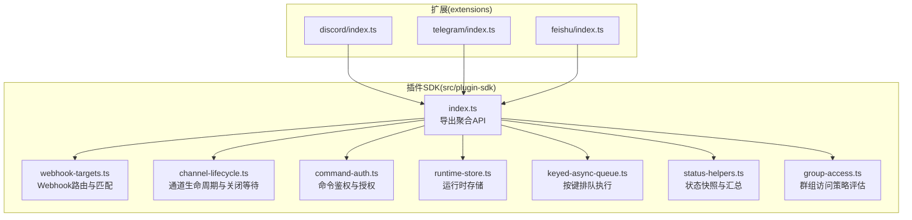
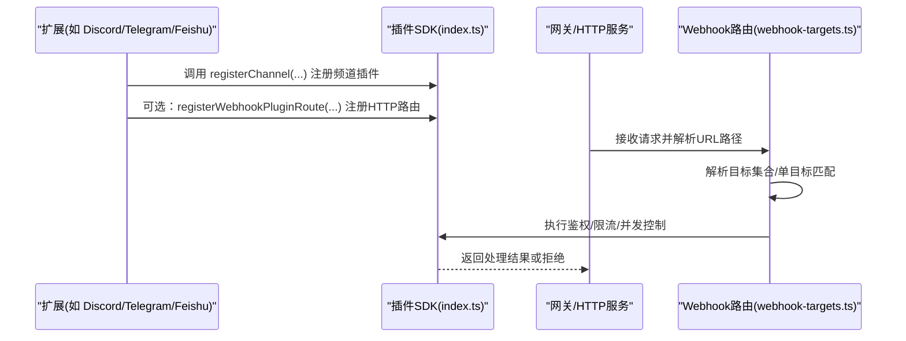
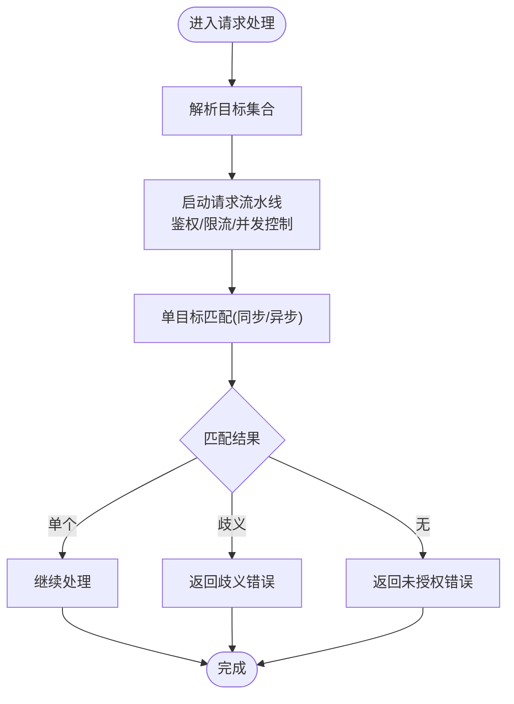
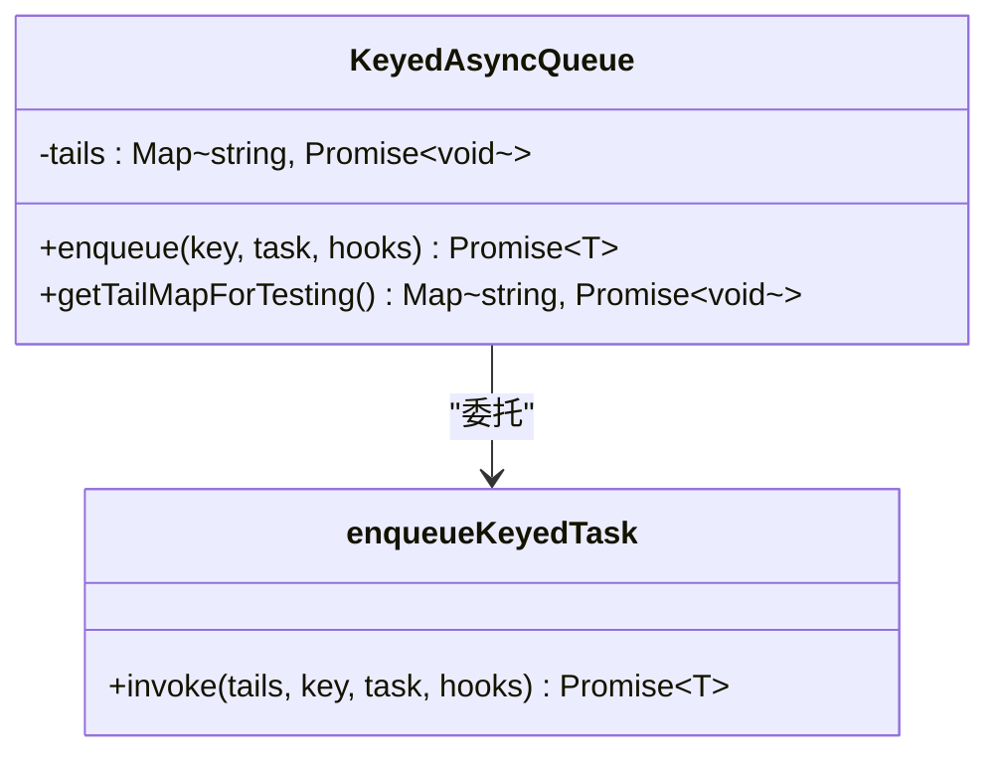
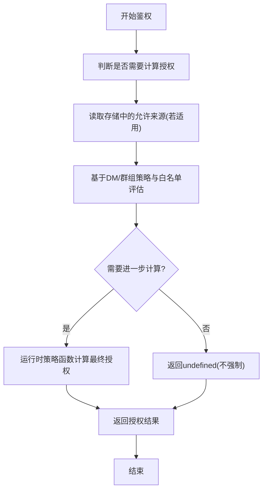
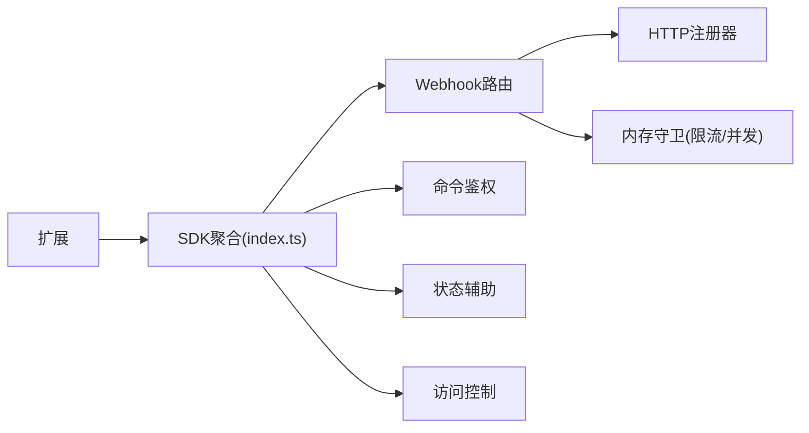

# 插件API参考

## 目录
1. [简介](#简介)
2. [项目结构](#项目结构)
3. [核心组件](#核心组件)
4. [架构总览](#架构总览)
5. [详细组件分析](#详细组件分析)
6. [依赖关系分析](#依赖关系分析)
7. [性能考量](#性能考量)
8. [故障排查指南](#故障排查指南)
9. [结论](#结论)
10. [附录](#附录)

## 简介
本参考文档面向使用 OpenClaw 插件体系进行二次开发的工程师，系统性梳理插件API的对外能力与使用方式，覆盖频道通信、工具调用、事件处理、数据存储、运行时管理、鉴权与访问控制、状态与诊断等模块。文档以“功能分类+接口清单+流程图+最佳实践”的形式组织，确保与实际代码实现保持同步。

## 项目结构
OpenClaw 的插件SDK位于 src/plugin-sdk 目录，提供统一的插件注册、HTTP Webhook 路由、运行时上下文、队列与锁、状态构建、访问控制等能力；各具体频道（如 Discord、Telegram、Feishu）作为扩展在 extensions 下实现，并通过 SDK 注册到宿主系统。

图表来源
- [src/plugin-sdk/index.ts](file://src/plugin-sdk/index.ts#L1-L812)
- [src/plugin-sdk/webhook-targets.ts](file://src/plugin-sdk/webhook-targets.ts#L1-L282)
- [src/plugin-sdk/channel-lifecycle.ts](file://src/plugin-sdk/channel-lifecycle.ts#L1-L67)
- [src/plugin-sdk/command-auth.ts](file://src/plugin-sdk/command-auth.ts#L1-L115)
- [src/plugin-sdk/runtime-store.ts](file://src/plugin-sdk/runtime-store.ts#L1-L27)
- [src/plugin-sdk/keyed-async-queue.ts](file://src/plugin-sdk/keyed-async-queue.ts#L1-L49)
- [src/plugin-sdk/status-helpers.ts](file://src/plugin-sdk/status-helpers.ts#L1-L173)
- [src/plugin-sdk/group-access.ts](file://src/plugin-sdk/group-access.ts#L1-L209)
- [extensions/discord/index.ts](file://extensions/discord/index.ts#L1-L20)
- [extensions/telegram/index.ts](file://extensions/telegram/index.ts#L1-L18)
- [extensions/feishu/index.ts](file://extensions/feishu/index.ts#L1-L66)

章节来源
- [src/plugin-sdk/index.ts](file://src/plugin-sdk/index.ts#L1-L812)

## 核心组件
- 插件注册与通用类型：通过 index.ts 暴露 OpenClawPluginApi、ChannelPlugin、PluginRuntime 等核心类型与工厂方法，便于扩展按约定注册自身。
- Webhook 路由与匹配：提供注册、解析、鉴权、限流、并发控制等能力，支持多目标路径与单目标匹配。
- 通道生命周期：提供 HTTP 服务器关闭前的保活与中断回调机制。
- 命令鉴权：基于 DM 策略、允许白名单、运行时计算结果综合判定命令是否可执行。
- 运行时存储：提供线程安全的运行时对象存取，带错误提示。
- 键控异步队列：按键维度串行化任务，避免竞态并提供钩子回调。
- 状态辅助：构建通道/账号运行时状态快照与汇总，便于健康检查与诊断。
- 访问控制：对发送者、路由、匹配结果进行策略评估，支持 disabled/allowlist/open 等模式。

章节来源
- [src/plugin-sdk/index.ts](file://src/plugin-sdk/index.ts#L1-L812)
- [src/plugin-sdk/webhook-targets.ts](file://src/plugin-sdk/webhook-targets.ts#L1-L282)
- [src/plugin-sdk/channel-lifecycle.ts](file://src/plugin-sdk/channel-lifecycle.ts#L1-L67)
- [src/plugin-sdk/command-auth.ts](file://src/plugin-sdk/command-auth.ts#L1-L115)
- [src/plugin-sdk/runtime-store.ts](file://src/plugin-sdk/runtime-store.ts#L1-L27)
- [src/plugin-sdk/keyed-async-queue.ts](file://src/plugin-sdk/keyed-async-queue.ts#L1-L49)
- [src/plugin-sdk/status-helpers.ts](file://src/plugin-sdk/status-helpers.ts#L1-L173)
- [src/plugin-sdk/group-access.ts](file://src/plugin-sdk/group-access.ts#L1-L209)

## 架构总览
下图展示插件注册与 Webhook 请求处理的关键交互：

图表来源
- [src/plugin-sdk/index.ts](file://src/plugin-sdk/index.ts#L125-L127)
- [src/plugin-sdk/webhook-targets.ts](file://src/plugin-sdk/webhook-targets.ts#L115-L162)
- [extensions/discord/index.ts](file://extensions/discord/index.ts#L12-L16)
- [extensions/telegram/index.ts](file://extensions/telegram/index.ts#L11-L14)
- [extensions/feishu/index.ts](file://extensions/feishu/index.ts#L53-L62)

## 详细组件分析

### 频道通信API（注册与配置）
- 功能概述
  - 通过 OpenClawPluginApi.registerChannel 注册频道插件。
  - 使用空配置模式 emptyPluginConfigSchema 快速声明无配置项插件。
  - 通过 getChatChannelMeta 获取频道元信息，用于 UI 或诊断。
- 关键入口
  - 插件注册与配置：参见扩展中的注册逻辑与配置 Schema。
  - 频道元信息：参见 getChatChannelMeta。
- 使用示例（路径）
  - [extensions/discord/index.ts](file://extensions/discord/index.ts#L12-L16)
  - [extensions/telegram/index.ts](file://extensions/telegram/index.ts#L11-L14)
  - [extensions/feishu/index.ts](file://extensions/feishu/index.ts#L53-L62)
  - [src/plugin-sdk/channel-plugin-common.ts](file://src/plugin-sdk/channel-plugin-common.ts#L1-L22)

章节来源
- [src/plugin-sdk/channel-plugin-common.ts](file://src/plugin-sdk/channel-plugin-common.ts#L1-L22)
- [extensions/discord/index.ts](file://extensions/discord/index.ts#L1-L20)
- [extensions/telegram/index.ts](file://extensions/telegram/index.ts#L1-L18)
- [extensions/feishu/index.ts](file://extensions/feishu/index.ts#L1-L66)

### 工具调用API（运行时与子代理）
- 功能概述
  - 通过 PluginRuntime 提供子代理运行、会话查询、删除等能力。
  - 通过 createPluginRuntimeStore 创建运行时存储，保证运行期上下文可用。
- 关键入口
  - 子代理运行与等待：SubagentRunParams/SubagentWaitParams/SubagentGetSession* 等。
  - 运行时存储：createPluginRuntimeStore。
- 使用示例（路径）
  - [src/plugin-sdk/index.ts](file://src/plugin-sdk/index.ts#L113-L124)
  - [src/plugin-sdk/runtime-store.ts](file://src/plugin-sdk/runtime-store.ts#L1-L27)

章节来源
- [src/plugin-sdk/index.ts](file://src/plugin-sdk/index.ts#L113-L124)
- [src/plugin-sdk/runtime-store.ts](file://src/plugin-sdk/runtime-store.ts#L1-L27)

### 事件处理API（Webhook 路由与匹配）
- 功能概述
  - registerWebhookTarget/registerWebhookTargetWithPluginRoute 注册目标与HTTP路由。
  - withResolvedWebhookRequestPipeline 统一处理请求：鉴权、限流、并发控制、JSON读取。
  - resolveSingleWebhookTarget/resolveSingleWebhookTargetAsync 支持同步/异步单目标匹配。
  - rejectNonPostWebhookRequest 拒绝非 POST 方法。
- 关键入口
  - 注册与注销：registerWebhookTarget/registerWebhookTargetWithPluginRoute。
  - 请求处理流水线：withResolvedWebhookRequestPipeline。
  - 单目标匹配：resolveSingleWebhookTarget/resolveSingleWebhookTargetAsync。
  - 非 POST 拒绝：rejectNonPostWebhookRequest。
- 使用示例（路径）
  - [src/plugin-sdk/webhook-targets.ts](file://src/plugin-sdk/webhook-targets.ts#L27-L100)
  - [src/plugin-sdk/webhook-targets.ts](file://src/plugin-sdk/webhook-targets.ts#L115-L162)
  - [src/plugin-sdk/webhook-targets.ts](file://src/plugin-sdk/webhook-targets.ts#L186-L220)
  - [src/plugin-sdk/webhook-targets.ts](file://src/plugin-sdk/webhook-targets.ts#L273-L282)

图表来源
- [src/plugin-sdk/webhook-targets.ts](file://src/plugin-sdk/webhook-targets.ts#L115-L162)
- [src/plugin-sdk/webhook-targets.ts](file://src/plugin-sdk/webhook-targets.ts#L186-L220)
- [src/plugin-sdk/webhook-targets.ts](file://src/plugin-sdk/webhook-targets.ts#L250-L271)

章节来源
- [src/plugin-sdk/webhook-targets.ts](file://src/plugin-sdk/webhook-targets.ts#L1-L282)

### 数据存储API（运行时与持久化）
- 运行时存储
  - createPluginRuntimeStore：提供 set/clear/tryGet/get 四种操作，get 失败抛错，便于严格约束运行时上下文。
- JSON 文件读写
  - readJsonFileWithFallback：读取 JSON 并提供回退。
  - writeJsonFileAtomically：原子写入 JSON，避免部分写入。
- 使用示例（路径）
  - [src/plugin-sdk/runtime-store.ts](file://src/plugin-sdk/runtime-store.ts#L1-L27)
  - [src/plugin-sdk/index.ts](file://src/plugin-sdk/index.ts#L348-L348)

章节来源
- [src/plugin-sdk/runtime-store.ts](file://src/plugin-sdk/runtime-store.ts#L1-L27)
- [src/plugin-sdk/index.ts](file://src/plugin-sdk/index.ts#L348-L348)

### 通道生命周期API（保活与关闭）
- 功能概述
  - waitUntilAbort：根据 AbortSignal 返回中止信号。
  - keepHttpServerTaskAlive：在 HTTP 服务器 close 之前保持任务存活，支持可选 onAbort 回调。
- 使用示例（路径）
  - [src/plugin-sdk/channel-lifecycle.ts](file://src/plugin-sdk/channel-lifecycle.ts#L10-L21)
  - [src/plugin-sdk/channel-lifecycle.ts](file://src/plugin-sdk/channel-lifecycle.ts#L29-L66)

章节来源
- [src/plugin-sdk/channel-lifecycle.ts](file://src/plugin-sdk/channel-lifecycle.ts#L1-L67)

### 队列与并发API（按键串行）
- 功能概述
  - enqueueKeyedTask：按键排队执行任务，串行化同键任务，提供入队/结算钩子。
  - KeyedAsyncQueue：类封装，内部维护 tails 映射，暴露 enqueue。
- 使用示例（路径）
  - [src/plugin-sdk/keyed-async-queue.ts](file://src/plugin-sdk/keyed-async-queue.ts#L6-L31)
  - [src/plugin-sdk/keyed-async-queue.ts](file://src/plugin-sdk/keyed-async-queue.ts#L40-L48)

图表来源
- [src/plugin-sdk/keyed-async-queue.ts](file://src/plugin-sdk/keyed-async-queue.ts#L33-L48)
- [src/plugin-sdk/keyed-async-queue.ts](file://src/plugin-sdk/keyed-async-queue.ts#L6-L31)

章节来源
- [src/plugin-sdk/keyed-async-queue.ts](file://src/plugin-sdk/keyed-async-queue.ts#L1-L49)

### 事件处理API（命令鉴权）
- 功能概述
  - resolveDirectDmAuthorizationOutcome：直接判定 DM 场景授权结果。
  - resolveSenderCommandAuthorization/resolveSenderCommandAuthorizationWithRuntime：综合配置、白名单、运行时策略，决定是否授权命令。
- 关键输入
  - OpenClawConfig、原始请求体、是否群组、DM 策略、允许来源、发送者 ID、运行时策略函数。
- 使用示例（路径）
  - [src/plugin-sdk/command-auth.ts](file://src/plugin-sdk/command-auth.ts#L36-L51)
  - [src/plugin-sdk/command-auth.ts](file://src/plugin-sdk/command-auth.ts#L63-L114)

图表来源
- [src/plugin-sdk/command-auth.ts](file://src/plugin-sdk/command-auth.ts#L63-L114)

章节来源
- [src/plugin-sdk/command-auth.ts](file://src/plugin-sdk/command-auth.ts#L1-L115)

### 访问控制API（群组策略）
- 功能概述
  - evaluateSenderGroupAccess/evaluateSenderGroupAccessForPolicy：评估发送者是否允许。
  - evaluateMatchedGroupAccessForPolicy：评估匹配到的群组是否允许。
  - evaluateGroupRouteAccessForPolicy：评估路由是否允许。
  - resolveSenderScopedGroupPolicy：根据 groupAllowFrom 推导策略。
- 使用示例（路径）
  - [src/plugin-sdk/group-access.ts](file://src/plugin-sdk/group-access.ts#L43-L51)
  - [src/plugin-sdk/group-access.ts](file://src/plugin-sdk/group-access.ts#L145-L185)
  - [src/plugin-sdk/group-access.ts](file://src/plugin-sdk/group-access.ts#L99-L143)
  - [src/plugin-sdk/group-access.ts](file://src/plugin-sdk/group-access.ts#L53-L97)

章节来源
- [src/plugin-sdk/group-access.ts](file://src/plugin-sdk/group-access.ts#L1-L209)

### 状态与诊断API
- 功能概述
  - createDefaultChannelRuntimeState：初始化通道运行时状态。
  - buildBaseChannelStatusSummary/buildProbeChannelStatusSummary：构建基础/探测型通道状态摘要。
  - buildBaseAccountStatusSnapshot/buildRuntimeAccountStatusSnapshot/buildComputedAccountStatusSnapshot：构建账号级状态快照。
  - collectStatusIssuesFromLastError：从最后错误提取状态问题。
- 使用示例（路径）
  - [src/plugin-sdk/status-helpers.ts](file://src/plugin-sdk/status-helpers.ts#L12-L30)
  - [src/plugin-sdk/status-helpers.ts](file://src/plugin-sdk/status-helpers.ts#L32-L66)
  - [src/plugin-sdk/status-helpers.ts](file://src/plugin-sdk/status-helpers.ts#L68-L123)
  - [src/plugin-sdk/status-helpers.ts](file://src/plugin-sdk/status-helpers.ts#L154-L172)

章节来源
- [src/plugin-sdk/status-helpers.ts](file://src/plugin-sdk/status-helpers.ts#L1-L173)

## 依赖关系分析
- 插件SDK通过 index.ts 对外导出聚合 API，扩展通过该入口注册频道与路由。
- Webhook 路由依赖 HTTP 注册器与内存守卫（速率限制、并发限制）。
- 命令鉴权依赖 DM 策略与允许来源解析。
- 状态构建依赖运行时快照与探测结果。
- 访问控制依赖运行时组策略解析与白名单匹配。

图表来源
- [src/plugin-sdk/index.ts](file://src/plugin-sdk/index.ts#L1-L812)
- [src/plugin-sdk/webhook-targets.ts](file://src/plugin-sdk/webhook-targets.ts#L1-L282)
- [src/plugin-sdk/command-auth.ts](file://src/plugin-sdk/command-auth.ts#L1-L115)
- [src/plugin-sdk/status-helpers.ts](file://src/plugin-sdk/status-helpers.ts#L1-L173)
- [src/plugin-sdk/group-access.ts](file://src/plugin-sdk/group-access.ts#L1-L209)

章节来源
- [src/plugin-sdk/index.ts](file://src/plugin-sdk/index.ts#L1-L812)
- [src/plugin-sdk/webhook-targets.ts](file://src/plugin-sdk/webhook-targets.ts#L1-L282)

## 性能考量
- Webhook 请求处理
  - 合理设置 inFlightLimiter 与 rateLimiter，避免突发流量导致资源耗尽。
  - 使用 withResolvedWebhookRequestPipeline 将鉴权、限流、并发控制集中在一处，减少重复逻辑。
- 队列与并发
  - 使用 KeyedAsyncQueue 按键串行化任务，降低共享资源竞争。
  - 在高并发场景下，注意 onEnqueue/onSettle 钩子中的轻量操作，避免阻塞尾部任务推进。
- 状态与诊断
  - 状态快照尽量只包含必要字段，避免频繁序列化大对象。
  - 将错误收集与诊断事件分离，减少热路径上的 IO 开销。

## 故障排查指南
- Webhook 目标不明确或歧义
  - 现象：resolveSingleWebhookTarget 返回歧义。
  - 处理：检查目标注册是否唯一，或在 isMatch 中增加更严格的过滤条件。
- 非 POST 方法被拒绝
  - 现象：rejectNonPostWebhookRequest 返回 405。
  - 处理：确认客户端使用 POST 方法提交数据。
- 未授权访问
  - 现象：resolveSingleWebhookTarget 返回未授权。
  - 处理：核对鉴权函数 isMatch 与目标路径映射，确保认证通过。
- 命令未授权
  - 现象：resolveSenderCommandAuthorization 返回未授权。
  - 处理：检查 DM 策略、允许来源、运行时策略函数与发送者匹配逻辑。
- 状态错误
  - 现象：collectStatusIssuesFromLastError 报告运行时错误。
  - 处理：查看 lastError 字段，定位最近一次失败原因并修复。

章节来源
- [src/plugin-sdk/webhook-targets.ts](file://src/plugin-sdk/webhook-targets.ts#L222-L271)
- [src/plugin-sdk/webhook-targets.ts](file://src/plugin-sdk/webhook-targets.ts#L273-L282)
- [src/plugin-sdk/command-auth.ts](file://src/plugin-sdk/command-auth.ts#L63-L114)
- [src/plugin-sdk/status-helpers.ts](file://src/plugin-sdk/status-helpers.ts#L154-L172)

## 结论
OpenClaw 插件SDK提供了从注册、路由、鉴权、并发控制到状态与诊断的全链路能力。遵循本文档的分类与最佳实践，可在保证性能与稳定性的同时，快速实现高质量的频道插件与工具集成。

## 附录
- 扩展注册示例（路径）
  - [extensions/discord/index.ts](file://extensions/discord/index.ts#L12-L16)
  - [extensions/telegram/index.ts](file://extensions/telegram/index.ts#L11-L14)
  - [extensions/feishu/index.ts](file://extensions/feishu/index.ts#L53-L62)
- 类型与工厂入口（路径）
  - [src/plugin-sdk/index.ts](file://src/plugin-sdk/index.ts#L1-L812)
  - [src/plugin-sdk/channel-plugin-common.ts](file://src/plugin-sdk/channel-plugin-common.ts#L1-L22)