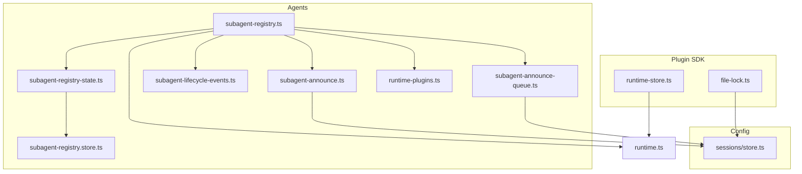
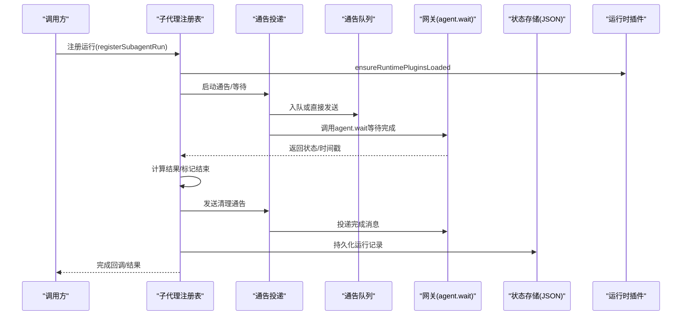
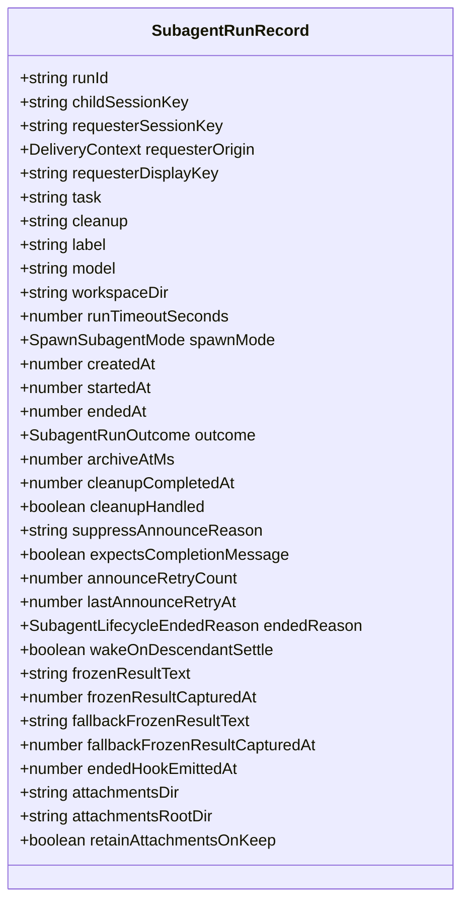
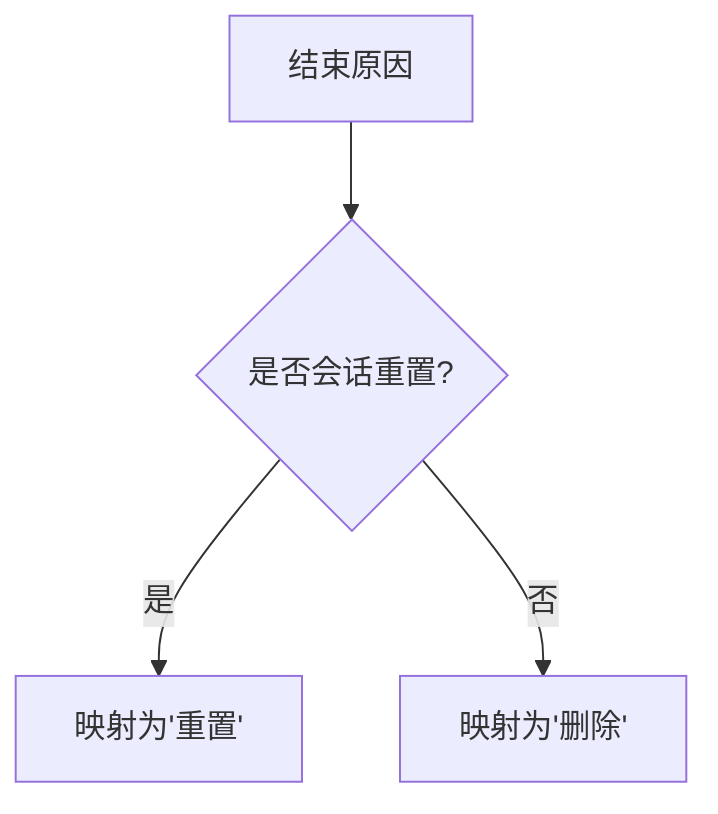
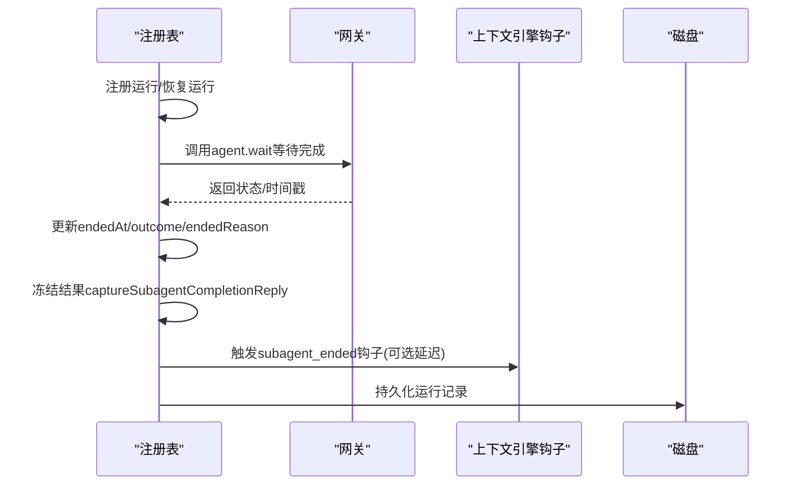
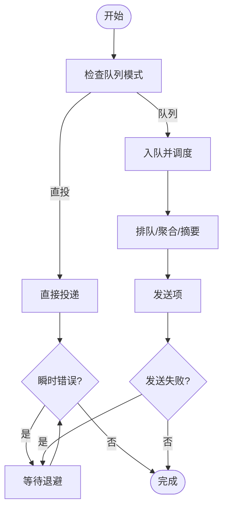
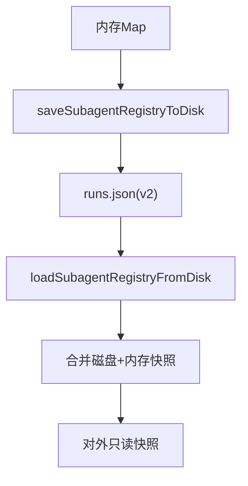
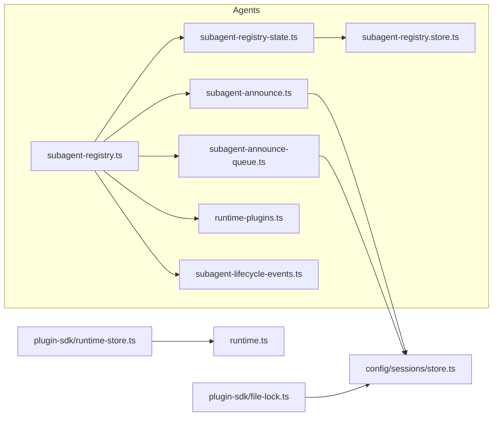

# 运行时子代理API

## 目录
1. [简介](#简介)
2. [项目结构](#项目结构)
3. [核心组件](#核心组件)
4. [架构总览](#架构总览)
5. [详细组件分析](#详细组件分析)
6. [依赖关系分析](#依赖关系分析)
7. [性能考量](#性能考量)
8. [故障排查指南](#故障排查指南)
9. [结论](#结论)
10. [附录](#附录)

## 简介
本文件为 OpenClaw 运行时子代理API的完整参考文档，覆盖子代理生命周期管理（创建、执行、等待、清理）、运行时状态持久化、异步队列与文件锁等辅助能力。重点围绕以下API与数据结构展开：
- 子代理运行时记录类型：SubagentRunRecord
- 生命周期事件常量与结果枚举：SubagentLifecycleEndedReason、SubagentLifecycleEndedOutcome
- 核心运行时管理函数：注册/释放运行、恢复/清理、等待完成、持久化/恢复状态
- 通告投递与队列：直接投递、带重试、队列聚合与退避
- 运行时插件加载：ensureRuntimePluginsLoaded
- 运行时存储：createPluginRuntimeStore
- 文件锁与会话存储锁：withSessionStoreLock、acquireFileLock/withFileLock

## 项目结构
与子代理运行时相关的关键模块分布如下：
- agents：子代理注册表、通告、生命周期事件、状态存取
- config/sessions：会话存储与文件锁队列
- plugin-sdk：运行时存储容器与文件锁工具
- runtime：全局默认运行时环境

**图表来源**
- [src/agents/subagent-registry.ts](file://src/agents/subagent-registry.ts#L1-L1464)
- [src/agents/subagent-announce.ts](file://src/agents/subagent-announce.ts#L1-L1486)
- [src/agents/subagent-announce-queue.ts](file://src/agents/subagent-announce-queue.ts#L1-L239)
- [src/agents/subagent-lifecycle-events.ts](file://src/agents/subagent-lifecycle-events.ts#L1-L48)
- [src/agents/subagent-registry-state.ts](file://src/agents/subagent-registry-state.ts#L1-L57)
- [src/agents/subagent-registry.store.ts](file://src/agents/subagent-registry.store.ts#L1-L132)
- [src/agents/runtime-plugins.ts](file://src/agents/runtime-plugins.ts#L1-L19)
- [src/config/sessions/store.ts](file://src/config/sessions/store.ts#L156-L693)
- [src/plugin-sdk/runtime-store.ts](file://src/plugin-sdk/runtime-store.ts#L1-L26)
- [src/plugin-sdk/file-lock.ts](file://src/plugin-sdk/file-lock.ts#L53-L161)
- [src/runtime.ts](file://src/runtime.ts#L1-L54)

**章节来源**
- [src/agents/subagent-registry.ts](file://src/agents/subagent-registry.ts#L1-L1464)
- [src/agents/subagent-announce.ts](file://src/agents/subagent-announce.ts#L1-L1486)
- [src/agents/subagent-announce-queue.ts](file://src/agents/subagent-announce-queue.ts#L1-L239)
- [src/agents/subagent-lifecycle-events.ts](file://src/agents/subagent-lifecycle-events.ts#L1-L48)
- [src/agents/subagent-registry-state.ts](file://src/agents/subagent-registry-state.ts#L1-L57)
- [src/agents/subagent-registry.store.ts](file://src/agents/subagent-registry.store.ts#L1-L132)
- [src/agents/runtime-plugins.ts](file://src/agents/runtime-plugins.ts#L1-L19)
- [src/config/sessions/store.ts](file://src/config/sessions/store.ts#L156-L693)
- [src/plugin-sdk/runtime-store.ts](file://src/plugin-sdk/runtime-store.ts#L1-L26)
- [src/plugin-sdk/file-lock.ts](file://src/plugin-sdk/file-lock.ts#L53-L161)
- [src/runtime.ts](file://src/runtime.ts#L1-L54)

## 核心组件
- SubagentRunRecord：描述一次子代理运行的完整状态，包括请求者/子会话键、任务、清理策略、超时、归档时间、重试计数、冻结结果、附件目录等。
- 生命周期事件：定义“完成/错误/被杀/会话重置/删除”等结束原因与“成功/错误/超时/被杀/重置/删除”等结束结果。
- 注册表与通告：负责运行注册、恢复、等待完成、清理通告、孤儿运行判定与清理、挂起错误延迟清理、冻结结果捕获与刷新。
- 队列与通告：支持直接投递、带重试、队列聚合、退避与失败指数回退、跨通道聚合摘要。
- 插件与运行时：在上下文引擎与运行时插件初始化前确保插件已加载；提供运行时配置访问。
- 状态持久化：内存映射+磁盘JSON，版本兼容与迁移，快照合并读取。
- 文件锁与会话锁：文件级互斥锁与会话存储写入队列锁，保障并发一致性。

**章节来源**
- [src/agents/subagent-registry.types.ts](file://src/agents/subagent-registry.types.ts#L6-L58)
- [src/agents/subagent-lifecycle-events.ts](file://src/agents/subagent-lifecycle-events.ts#L8-L48)
- [src/agents/subagent-registry.ts](file://src/agents/subagent-registry.ts#L450-L800)
- [src/agents/subagent-announce.ts](file://src/agents/subagent-announce.ts#L730-L800)
- [src/agents/subagent-announce-queue.ts](file://src/agents/subagent-announce-queue.ts#L74-L239)
- [src/agents/runtime-plugins.ts](file://src/agents/runtime-plugins.ts#L5-L19)
- [src/agents/subagent-registry-state.ts](file://src/agents/subagent-registry-state.ts#L7-L57)
- [src/agents/subagent-registry.store.ts](file://src/agents/subagent-registry.store.ts#L48-L132)
- [src/plugin-sdk/runtime-store.ts](file://src/plugin-sdk/runtime-store.ts#L1-L26)
- [src/plugin-sdk/file-lock.ts](file://src/plugin-sdk/file-lock.ts#L103-L161)
- [src/config/sessions/store.ts](file://src/config/sessions/store.ts#L195-L693)

## 架构总览
子代理运行时由“注册表”驱动，贯穿“通告投递/队列”、“生命周期事件”、“状态持久化/恢复”、“插件加载”、“文件锁/会话锁”等模块协作。

**图表来源**
- [src/agents/subagent-registry.ts](file://src/agents/subagent-registry.ts#L568-L800)
- [src/agents/subagent-announce.ts](file://src/agents/subagent-announce.ts#L1206-L1253)
- [src/agents/subagent-announce-queue.ts](file://src/agents/subagent-announce-queue.ts#L212-L239)
- [src/agents/subagent-registry-state.ts](file://src/agents/subagent-registry-state.ts#L7-L13)
- [src/agents/runtime-plugins.ts](file://src/agents/runtime-plugins.ts#L5-L19)

## 详细组件分析

### 数据模型：SubagentRunRecord
- 关键字段：运行标识、子会话键、请求者会话键、请求者显示键、任务、清理策略、标签、模型、工作区路径、运行超时秒、启动/结束时间、结果、归档时间、清理完成标记、抑制通告原因、期望完成消息、通告重试计数与时间、结束原因、唤醒后代稳定标志、冻结/回退冻结结果及其时间戳、附件目录与保留策略等。
- 用途：承载一次子代理运行的全生命周期状态，用于等待、通告、清理、归档与持久化。

**图表来源**
- [src/agents/subagent-registry.types.ts](file://src/agents/subagent-registry.types.ts#L6-L58)

**章节来源**
- [src/agents/subagent-registry.types.ts](file://src/agents/subagent-registry.types.ts#L6-L58)

### 生命周期事件与结果
- 结束原因：完成、错误、被杀、会话重置、会话删除
- 结束结果：成功、错误、超时、被杀、重置、删除
- 会话结束结果映射：根据会话生命周期原因映射到运行结束结果

**图表来源**
- [src/agents/subagent-lifecycle-events.ts](file://src/agents/subagent-lifecycle-events.ts#L40-L48)

**章节来源**
- [src/agents/subagent-lifecycle-events.ts](file://src/agents/subagent-lifecycle-events.ts#L1-L48)

### 注册表与运行管理
- 注册/释放运行：registerSubagentRun/releaseSubagentRun（通过测试桩文件可见）
- 恢复/重启：restoreSubagentRunsOnce/resumeSubagentRun，处理孤儿运行、过期/重试上限、退避重试、完成消息等待、清理通告
- 等待完成：waitForSubagentCompletion，调用网关 agent.wait 获取状态并更新运行记录
- 清理与通告：completeSubagentRun/freezeRunResultAtCompletion/startSubagentAnnounceCleanupFlow
- 勾子与上下文引擎：emitSubagentEndedHookForRun/notifyContextEngineSubagentEnded
- 归档清理：sweepSubagentRuns，定时清理过期运行并删除会话

**图表来源**
- [src/agents/subagent-registry.ts](file://src/agents/subagent-registry.ts#L1206-L1253)
- [src/agents/subagent-registry.ts](file://src/agents/subagent-registry.ts#L450-L566)
- [src/agents/subagent-registry.ts](file://src/agents/subagent-registry.ts#L713-L750)

**章节来源**
- [src/agents/subagent-registry.ts](file://src/agents/subagent-registry.ts#L568-L800)
- [src/agents/subagent-registry.ts](file://src/agents/subagent-registry.ts#L1206-L1253)
- [src/agents/subagent-registry.ts](file://src/agents/subagent-registry.ts#L713-L750)

### 通告与队列
- 直接投递：sendSubagentAnnounceDirectly，支持外部直投、幂等键、来源合并
- 带重试：runAnnounceDeliveryWithRetry，对瞬时错误进行有限次重试
- 队列聚合：enqueueAnnounce，支持收集模式、摘要、丢弃策略、跨通道聚合、指数回退
- 失败回退：连续失败计数，指数回退至最大60秒

**图表来源**
- [src/agents/subagent-announce.ts](file://src/agents/subagent-announce.ts#L730-L800)
- [src/agents/subagent-announce.ts](file://src/agents/subagent-announce.ts#L161-L187)
- [src/agents/subagent-announce-queue.ts](file://src/agents/subagent-announce-queue.ts#L212-L239)
- [src/agents/subagent-announce-queue.ts](file://src/agents/subagent-announce-queue.ts#L121-L210)

**章节来源**
- [src/agents/subagent-announce.ts](file://src/agents/subagent-announce.ts#L730-L800)
- [src/agents/subagent-announce.ts](file://src/agents/subagent-announce.ts#L161-L187)
- [src/agents/subagent-announce-queue.ts](file://src/agents/subagent-announce-queue.ts#L74-L239)

### 状态持久化与恢复
- 持久化：persistSubagentRunsToDisk，保存到 JSON 文件，版本2
- 恢复：restoreSubagentRunsFromDisk，支持仅合并，兼容旧版字段并迁移
- 快照：getSubagentRunsSnapshotForRead，合并磁盘与内存视图，供其他进程观察

**图表来源**
- [src/agents/subagent-registry-state.ts](file://src/agents/subagent-registry-state.ts#L7-L57)
- [src/agents/subagent-registry.store.ts](file://src/agents/subagent-registry.store.ts#L48-L132)

**章节来源**
- [src/agents/subagent-registry-state.ts](file://src/agents/subagent-registry-state.ts#L1-L57)
- [src/agents/subagent-registry.store.ts](file://src/agents/subagent-registry.store.ts#L1-L132)

### 运行时插件与配置
- ensureRuntimePluginsLoaded：按配置与工作区加载插件
- createRuntimeConfig：提供运行时配置读写接口

**章节来源**
- [src/agents/runtime-plugins.ts](file://src/agents/runtime-plugins.ts#L5-L19)
- [src/plugins/runtime/runtime-config.ts](file://src/plugins/runtime/runtime-config.ts#L4-L9)

### 运行时存储容器
- createPluginRuntimeStore：提供运行时对象的设置/获取/清理，带错误提示

**章节来源**
- [src/plugin-sdk/runtime-store.ts](file://src/plugin-sdk/runtime-store.ts#L1-L26)

### 文件锁与会话锁
- 文件锁：acquireFileLock/withFileLock，基于文件系统锁，支持重试与过期清理
- 会话锁：withSessionStoreLock，基于队列的写锁，保障并发写入一致性，支持stale检测与超时

**章节来源**
- [src/plugin-sdk/file-lock.ts](file://src/plugin-sdk/file-lock.ts#L103-L161)
- [src/config/sessions/store.ts](file://src/config/sessions/store.ts#L195-L693)

## 依赖关系分析

**图表来源**
- [src/agents/subagent-registry.ts](file://src/agents/subagent-registry.ts#L1-L1464)
- [src/agents/subagent-announce.ts](file://src/agents/subagent-announce.ts#L1-L1486)
- [src/agents/subagent-announce-queue.ts](file://src/agents/subagent-announce-queue.ts#L1-L239)
- [src/agents/subagent-registry-state.ts](file://src/agents/subagent-registry-state.ts#L1-L57)
- [src/agents/subagent-registry.store.ts](file://src/agents/subagent-registry.store.ts#L1-L132)
- [src/agents/runtime-plugins.ts](file://src/agents/runtime-plugins.ts#L1-L19)
- [src/agents/subagent-lifecycle-events.ts](file://src/agents/subagent-lifecycle-events.ts#L1-L48)
- [src/config/sessions/store.ts](file://src/config/sessions/store.ts#L156-L693)
- [src/plugin-sdk/runtime-store.ts](file://src/plugin-sdk/runtime-store.ts#L1-L26)
- [src/plugin-sdk/file-lock.ts](file://src/plugin-sdk/file-lock.ts#L53-L161)
- [src/runtime.ts](file://src/runtime.ts#L1-L54)

**章节来源**
- [src/agents/subagent-registry.ts](file://src/agents/subagent-registry.ts#L1-L1464)
- [src/agents/subagent-announce.ts](file://src/agents/subagent-announce.ts#L1-L1486)
- [src/agents/subagent-announce-queue.ts](file://src/agents/subagent-announce-queue.ts#L1-L239)
- [src/agents/subagent-registry-state.ts](file://src/agents/subagent-registry-state.ts#L1-L57)
- [src/agents/subagent-registry.store.ts](file://src/agents/subagent-registry.store.ts#L1-L132)
- [src/agents/runtime-plugins.ts](file://src/agents/runtime-plugins.ts#L1-L19)
- [src/agents/subagent-lifecycle-events.ts](file://src/agents/subagent-lifecycle-events.ts#L1-L48)
- [src/config/sessions/store.ts](file://src/config/sessions/store.ts#L156-L693)
- [src/plugin-sdk/runtime-store.ts](file://src/plugin-sdk/runtime-store.ts#L1-L26)
- [src/plugin-sdk/file-lock.ts](file://src/plugin-sdk/file-lock.ts#L53-L161)
- [src/runtime.ts](file://src/runtime.ts#L1-L54)

## 性能考量
- 通告重试与退避：对瞬时错误采用固定次数与指数回退，避免风暴；队列失败也采用指数回退，上限60秒。
- 等待完成：agent.wait 使用超时+额外缓冲，避免阻塞；结束后批量更新endedAt/outcome。
- 状态持久化：磁盘写入失败静默忽略，保证主流程不中断；快照合并减少跨进程读取开销。
- 会话锁：队列化写入，避免竞争；stale检测与超时，防止僵尸锁。
- 冻结结果：限制最大字节，避免过大文本影响通告投递与存储。

[本节为通用指导，无需特定文件来源]

## 故障排查指南
- 通告失败
  - 现象：通告投递失败或超时
  - 排查：确认瞬时错误匹配模式；查看重试日志；检查队列连续失败计数与退避
  - 参考
    - [src/agents/subagent-announce.ts](file://src/agents/subagent-announce.ts#L103-L134)
    - [src/agents/subagent-announce.ts](file://src/agents/subagent-announce.ts#L161-L187)
    - [src/agents/subagent-announce-queue.ts](file://src/agents/subagent-announce-queue.ts#L192-L210)
- 孤儿运行
  - 现象：子会话键缺失或会话ID缺失导致无法清理
  - 排查：检查会话存储路径解析、会话条目是否存在、会话ID是否为空
  - 参考
    - [src/agents/subagent-registry.ts](file://src/agents/subagent-registry.ts#L152-L181)
    - [src/agents/subagent-registry.ts](file://src/agents/subagent-registry.ts#L183-L224)
- 等待完成无响应
  - 现象：agent.wait 返回非预期状态
  - 排查：确认超时设置、缓冲时间、endedAt是否更新
  - 参考
    - [src/agents/subagent-registry.ts](file://src/agents/subagent-registry.ts#L1206-L1253)
- 插件未加载
  - 现象：上下文引擎或运行时插件未生效
  - 排查：确保在使用前调用 ensureRuntimePluginsLoaded，并传入有效配置与工作区路径
  - 参考
    - [src/agents/runtime-plugins.ts](file://src/agents/runtime-plugins.ts#L5-L19)
- 文件锁/会话锁问题
  - 现象：并发写入冲突、锁超时
  - 排查：检查stale阈值、重试次数、锁路径规范化；必要时清理过期锁
  - 参考
    - [src/plugin-sdk/file-lock.ts](file://src/plugin-sdk/file-lock.ts#L103-L161)
    - [src/config/sessions/store.ts](file://src/config/sessions/store.ts#L654-L693)

**章节来源**
- [src/agents/subagent-announce.ts](file://src/agents/subagent-announce.ts#L103-L134)
- [src/agents/subagent-announce.ts](file://src/agents/subagent-announce.ts#L161-L187)
- [src/agents/subagent-announce-queue.ts](file://src/agents/subagent-announce-queue.ts#L192-L210)
- [src/agents/subagent-registry.ts](file://src/agents/subagent-registry.ts#L152-L181)
- [src/agents/subagent-registry.ts](file://src/agents/subagent-registry.ts#L183-L224)
- [src/agents/subagent-registry.ts](file://src/agents/subagent-registry.ts#L1206-L1253)
- [src/agents/runtime-plugins.ts](file://src/agents/runtime-plugins.ts#L5-L19)
- [src/plugin-sdk/file-lock.ts](file://src/plugin-sdk/file-lock.ts#L103-L161)
- [src/config/sessions/store.ts](file://src/config/sessions/store.ts#L654-L693)

## 结论
OpenClaw 的子代理运行时以“注册表+通告+队列+状态持久化+插件加载+锁机制”为核心，形成高可用、可恢复、可观测的子代理生命周期管理体系。通过幂等键、重试与退避、孤儿运行清理、冻结结果与钩子触发等机制，确保复杂场景下的稳定性与一致性。

[本节为总结性内容，无需特定文件来源]

## 附录

### API与数据结构速查

- SubagentRunRecord（部分关键字段）
  - 字段：runId、childSessionKey、requesterSessionKey、requesterDisplayKey、task、cleanup、spawnMode、createdAt、startedAt、endedAt、outcome、archiveAtMs、cleanupCompletedAt、expectsCompletionMessage、announceRetryCount、lastAnnounceRetryAt、endedReason、frozenResultText、attachmentsDir 等
  - 用途：承载一次子代理运行的完整状态
  - 参考
    - [src/agents/subagent-registry.types.ts](file://src/agents/subagent-registry.types.ts#L6-L58)

- SubagentLifecycleEndedReason / SubagentLifecycleEndedOutcome
  - 结束原因：完成、错误、被杀、会话重置、会话删除
  - 结束结果：成功、错误、超时、被杀、重置、删除
  - 参考
    - [src/agents/subagent-lifecycle-events.ts](file://src/agents/subagent-lifecycle-events.ts#L8-L48)

- 注册/释放运行（测试桩）
  - registerSubagentRun、releaseSubagentRun（测试中可见）
  - 参考
    - [src/agents/subagent-registry.context-engine.test.ts](file://src/agents/subagent-registry.context-engine.test.ts#L50-L91)

- 等待完成
  - waitForSubagentCompletion：调用 agent.wait 获取状态并更新运行记录
  - 参考
    - [src/agents/subagent-registry.ts](file://src/agents/subagent-registry.ts#L1206-L1253)

- 清理与通告
  - completeSubagentRun：计算结果、冻结结果、触发钩子、启动清理通告
  - startSubagentAnnounceCleanupFlow：清理通告流程
  - 参考
    - [src/agents/subagent-registry.ts](file://src/agents/subagent-registry.ts#L450-L566)

- 通告投递
  - sendSubagentAnnounceDirectly：直接投递，支持幂等键与来源合并
  - runAnnounceDeliveryWithRetry：瞬时错误重试
  - 参考
    - [src/agents/subagent-announce.ts](file://src/agents/subagent-announce.ts#L730-L800)
    - [src/agents/subagent-announce.ts](file://src/agents/subagent-announce.ts#L161-L187)

- 通告队列
  - enqueueAnnounce：入队、聚合、摘要、丢弃策略、指数回退
  - 参考
    - [src/agents/subagent-announce-queue.ts](file://src/agents/subagent-announce-queue.ts#L212-L239)
    - [src/agents/subagent-announce-queue.ts](file://src/agents/subagent-announce-queue.ts#L121-L210)

- 插件加载
  - ensureRuntimePluginsLoaded：加载运行时插件
  - 参考
    - [src/agents/runtime-plugins.ts](file://src/agents/runtime-plugins.ts#L5-L19)

- 状态持久化
  - persistSubagentRunsToDisk / restoreSubagentRunsFromDisk / getSubagentRunsSnapshotForRead
  - 参考
    - [src/agents/subagent-registry-state.ts](file://src/agents/subagent-registry-state.ts#L7-L57)
    - [src/agents/subagent-registry.store.ts](file://src/agents/subagent-registry.store.ts#L48-L132)

- 运行时存储容器
  - createPluginRuntimeStore：提供运行时对象的设置/获取/清理
  - 参考
    - [src/plugin-sdk/runtime-store.ts](file://src/plugin-sdk/runtime-store.ts#L1-L26)

- 文件锁
  - acquireFileLock / withFileLock：文件级互斥锁
  - 参考
    - [src/plugin-sdk/file-lock.ts](file://src/plugin-sdk/file-lock.ts#L103-L161)

- 会话锁
  - withSessionStoreLock：会话存储写入队列锁
  - 参考
    - [src/config/sessions/store.ts](file://src/config/sessions/store.ts#L654-L693)