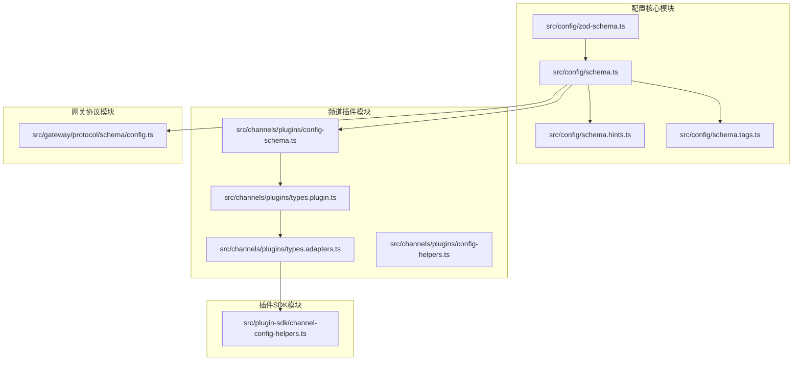
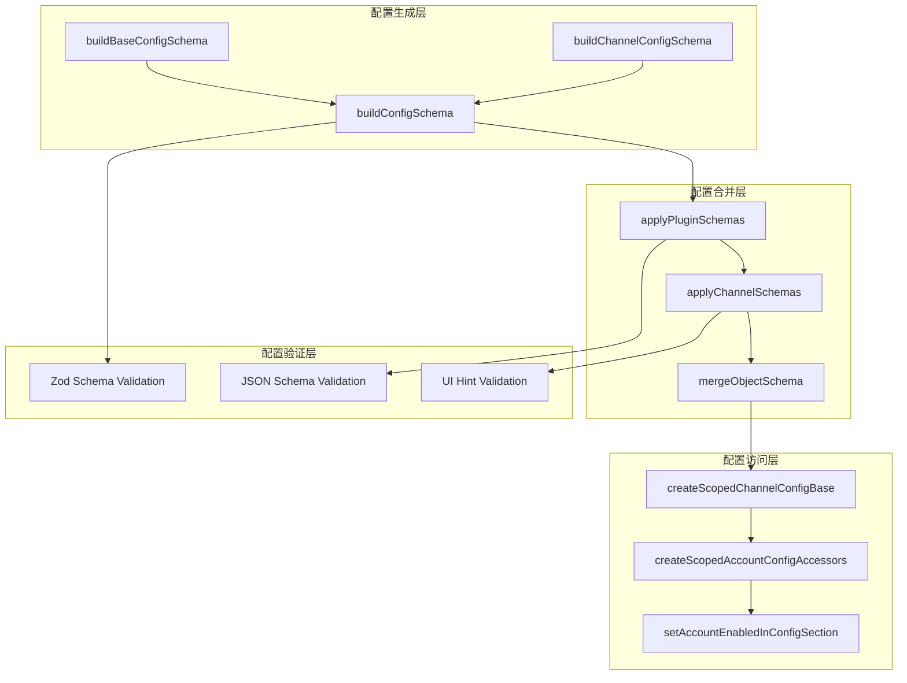
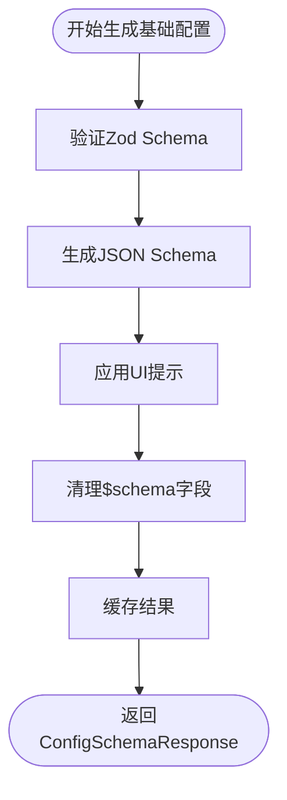
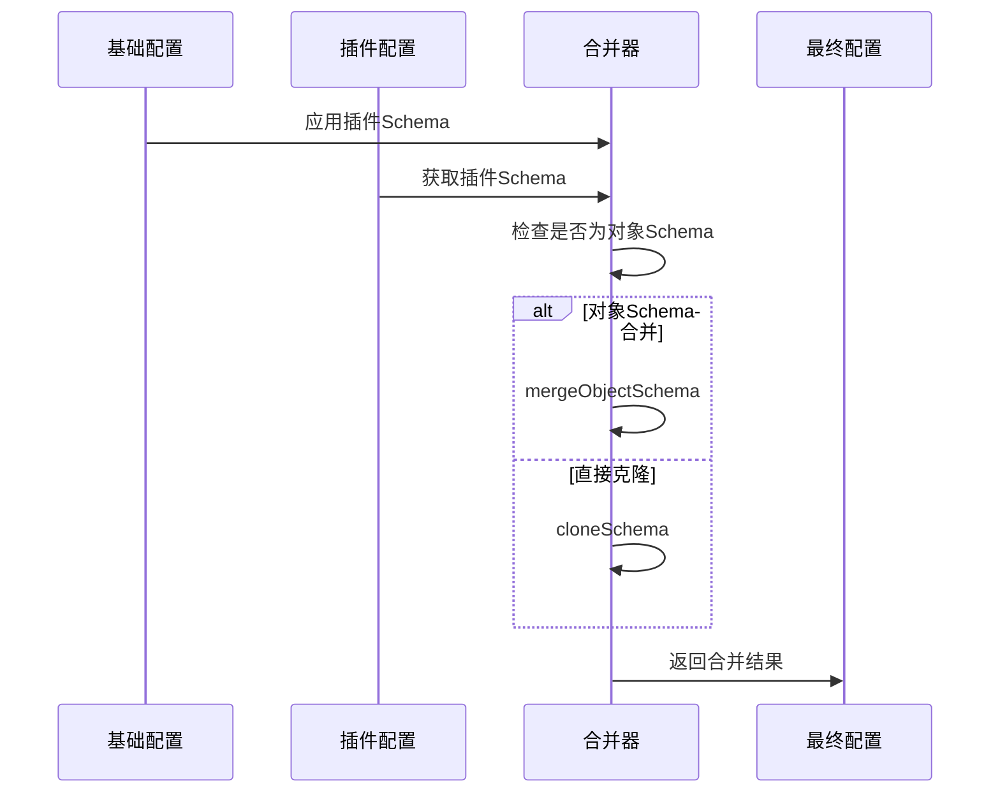
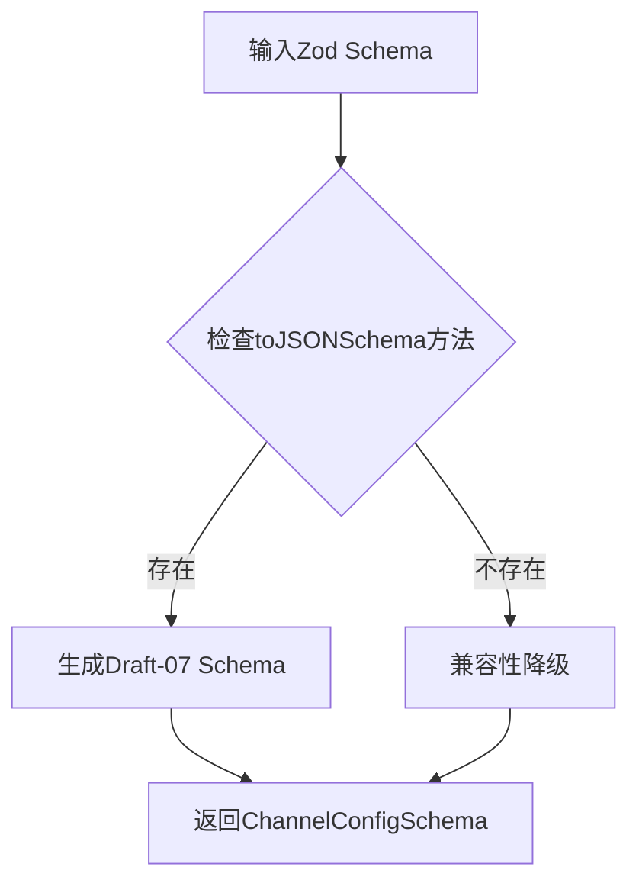
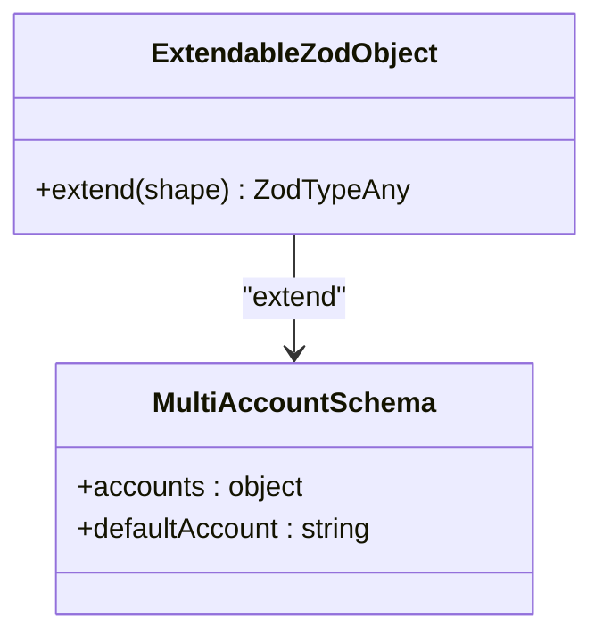
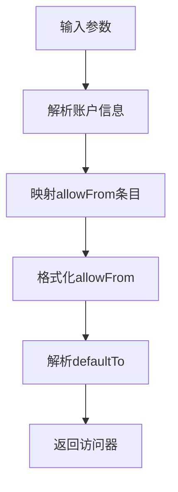
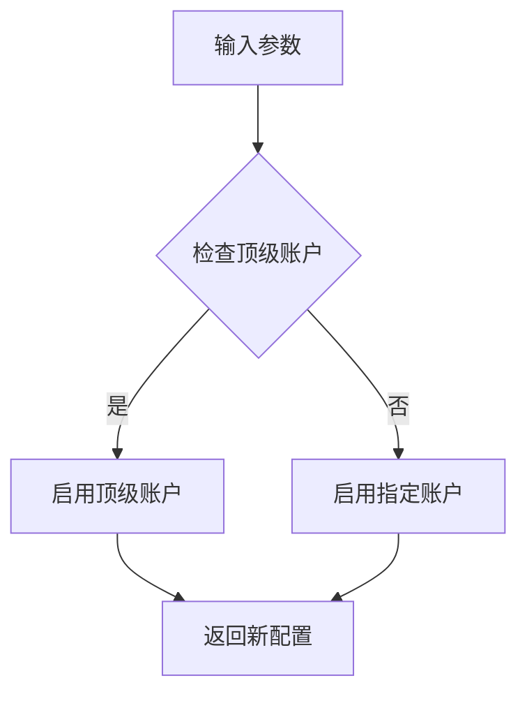
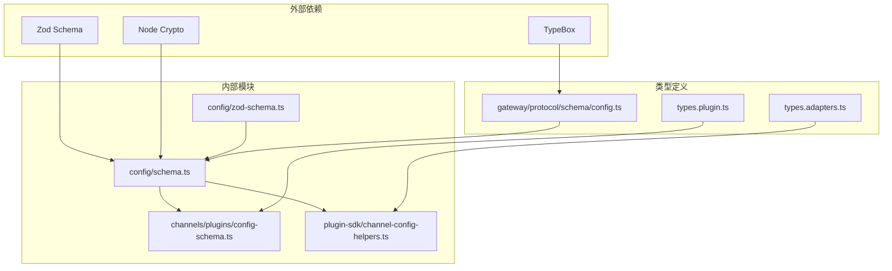

# 配置模式API

## 目录
1. [简介](#简介)
2. [项目结构](#项目结构)
3. [核心组件](#核心组件)
4. [架构概览](#架构概览)
5. [详细组件分析](#详细组件分析)
6. [依赖关系分析](#依赖关系分析)
7. [性能考虑](#性能考虑)
8. [故障排除指南](#故障排除指南)
9. [结论](#结论)
10. [附录](#附录)

## 简介

OpenClaw配置模式API是一套完整的配置系统，用于管理插件、频道和全局配置的模式定义、验证和合并。该API提供了从基础配置模式到频道特定配置的完整解决方案，支持动态模式生成、UI提示集成和配置验证。

本API的核心目标是：
- 提供统一的配置模式定义接口
- 支持插件和频道配置的动态扩展
- 实现配置验证和默认值处理
- 提供配置合并和版本管理
- 支持UI界面的配置表单渲染

## 项目结构

OpenClaw配置模式API主要分布在以下模块中：

**图表来源**
- [src/config/schema.ts](file://src/config/schema.ts#L1-L712)
- [src/channels/plugins/config-schema.ts](file://src/channels/plugins/config-schema.ts#L1-L43)
- [src/plugin-sdk/channel-config-helpers.ts](file://src/plugin-sdk/channel-config-helpers.ts#L1-L141)

**章节来源**
- [src/config/schema.ts](file://src/config/schema.ts#L1-L712)
- [src/channels/plugins/config-schema.ts](file://src/channels/plugins/config-schema.ts#L1-L43)

## 核心组件

### 配置模式基础架构

OpenClaw配置模式API基于Zod Schema构建，提供了完整的配置验证和模式生成能力。核心组件包括：

#### 基础配置模式
- **OpenClawSchema**: 主要配置模式定义
- **ConfigSchemaResponse**: 配置响应结构
- **ConfigUiHints**: UI提示系统

#### 频道配置模式
- **ChannelConfigSchema**: 频道配置模式接口
- **ChannelConfigAdapter**: 频道配置适配器
- **ChannelPlugin**: 频道插件接口

**章节来源**
- [src/config/zod-schema.ts](file://src/config/zod-schema.ts#L206-L911)
- [src/config/schema.ts](file://src/config/schema.ts#L101-L124)
- [src/channels/plugins/types.plugin.ts](file://src/channels/plugins/types.plugin.ts#L43-L46)

### 配置模式API函数

#### emptyPluginConfigSchema
用于创建空的插件配置模式，支持插件配置的默认值处理和验证。

**函数签名**: `emptyPluginConfigSchema() -> ChannelConfigSchema`

**参数**: 无

**返回值**: 
- `schema`: 空的JSON Schema对象
- `uiHints`: 空的UI提示对象

**使用场景**:
- 插件初始化时的默认配置
- 缺少配置时的回退模式
- 插件配置的最小化定义

#### buildChannelConfigSchema
将Zod Schema转换为JSON Schema，支持向后兼容性和Draft-07规范。

**函数签名**: `buildChannelConfigSchema(schema: ZodTypeAny) -> ChannelConfigSchema`

**参数**:
- `schema`: Zod类型定义

**返回值**:
- `schema`: 转换后的JSON Schema
- `uiHints`: 可选的UI提示

**兼容性**:
- 支持Zod v3.x的toJSONSchema方法
- 兼容性降级到additionalProperties: true

#### createScopedChannelConfigBase
创建作用域化的频道配置基类，提供账户管理和配置访问能力。

**函数签名**: `createScopedChannelConfigBase(params: ScopedChannelParams) -> ChannelConfigAdapter`

**参数**:
- `sectionKey`: 配置部分键名
- `listAccountIds`: 列出账户ID的函数
- `resolveAccount`: 解析账户信息的函数
- `defaultAccountId`: 获取默认账户ID的函数
- `clearBaseFields`: 清理的基础字段数组

**返回值**: ChannelConfigAdapter接口实现

**章节来源**
- [src/channels/plugins/config-schema.ts](file://src/channels/plugins/config-schema.ts#L23-L42)
- [src/plugin-sdk/channel-config-helpers.ts](file://src/plugin-sdk/channel-config-helpers.ts#L62-L105)

## 架构概览

OpenClaw配置模式API采用分层架构设计，确保了配置系统的可扩展性和维护性：

**图表来源**
- [src/config/schema.ts](file://src/config/schema.ts#L429-L484)
- [src/channels/plugins/config-schema.ts](file://src/channels/plugins/config-schema.ts#L23-L42)
- [src/plugin-sdk/channel-config-helpers.ts](file://src/plugin-sdk/channel-config-helpers.ts#L62-L105)

## 详细组件分析

### 配置模式生成系统

#### 基础配置模式生成
基础配置模式通过OpenClawSchema生成，包含了所有核心配置项的定义：

**图表来源**
- [src/config/schema.ts](file://src/config/schema.ts#L429-L447)

#### 插件配置模式合并
插件配置模式通过applyPluginSchemas函数进行合并：

**图表来源**
- [src/config/schema.ts](file://src/config/schema.ts#L285-L324)

**章节来源**
- [src/config/schema.ts](file://src/config/schema.ts#L429-L484)

### 频道配置模式系统

#### 频道配置模式构建
频道配置模式通过buildChannelConfigSchema函数构建：

**图表来源**
- [src/channels/plugins/config-schema.ts](file://src/channels/plugins/config-schema.ts#L23-L42)

#### 多账户频道配置
buildCatchallMultiAccountChannelSchema函数支持多账户配置：

**图表来源**
- [src/channels/plugins/config-schema.ts](file://src/channels/plugins/config-schema.ts#L14-L21)

**章节来源**
- [src/channels/plugins/config-schema.ts](file://src/channels/plugins/config-schema.ts#L1-L43)

### 配置访问和操作工具

#### 作用域化配置访问器
createScopedAccountConfigAccessors函数提供配置访问能力：

**图表来源**
- [src/plugin-sdk/channel-config-helpers.ts](file://src/plugin-sdk/channel-config-helpers.ts#L33-L60)

#### 账户配置操作
setAccountEnabledInConfigSection函数处理账户启用状态：

**图表来源**
- [src/channels/plugins/config-helpers.ts](file://src/channels/plugins/config-helpers.ts#L16-L58)

**章节来源**
- [src/plugin-sdk/channel-config-helpers.ts](file://src/plugin-sdk/channel-config-helpers.ts#L1-L141)
- [src/channels/plugins/config-helpers.ts](file://src/channels/plugins/config-helpers.ts#L1-L176)

## 依赖关系分析

OpenClaw配置模式API的依赖关系体现了清晰的分层设计：

**图表来源**
- [src/config/schema.ts](file://src/config/schema.ts#L1-L7)
- [src/channels/plugins/types.plugin.ts](file://src/channels/plugins/types.plugin.ts#L1-L17)
- [src/gateway/protocol/schema/config.ts](file://src/gateway/protocol/schema/config.ts#L53-L100)

**章节来源**
- [src/config/schema.ts](file://src/config/schema.ts#L1-L7)
- [src/channels/plugins/types.plugin.ts](file://src/channels/plugins/types.plugin.ts#L1-L86)

## 性能考虑

### 缓存策略
配置模式API实现了多层次的缓存机制来优化性能：

1. **基础配置缓存**: `cachedBase`存储基础配置模式
2. **合并配置缓存**: `mergedSchemaCache`存储合并后的配置
3. **缓存大小限制**: `MERGED_SCHEMA_CACHE_MAX = 64`

### 内存优化
- 使用`structuredClone`进行深拷贝，避免内存泄漏
- 条件性地应用UI提示，减少不必要的计算
- 智能的Schema合并，避免重复的模式生成

### 并发处理
- 配置模式生成是线程安全的
- 缓存机制支持并发访问
- 异步配置验证不会阻塞主线程

## 故障排除指南

### 常见问题和解决方案

#### 配置模式生成失败
**症状**: `buildConfigSchema`抛出异常
**原因**: 
- Zod Schema定义不正确
- 缺少必要的依赖
- 缓存损坏

**解决方案**:
1. 验证Zod Schema的语法正确性
2. 检查依赖包的版本兼容性
3. 清理配置缓存重新生成

#### 频道配置验证错误
**症状**: 频道配置无法通过验证
**原因**:
- 配置值类型不匹配
- 缺少必需的配置项
- 配置范围超出允许值

**解决方案**:
1. 检查配置值的数据类型
2. 确认所有必需字段都已设置
3. 验证配置值在允许范围内

#### 配置合并冲突
**症状**: 插件或频道配置合并失败
**原因**:
- Schema定义冲突
- 字段名称重复
- 类型不兼容

**解决方案**:
1. 检查Schema定义的一致性
2. 确保字段名称的唯一性
3. 验证数据类型的兼容性

**章节来源**
- [src/config/schema.test.ts](file://src/config/schema.test.ts#L92-L124)
- [src/channels/plugins/config-schema.test.ts](file://src/channels/plugins/config-schema.test.ts#L1-L36)
- [src/plugin-sdk/channel-config-helpers.test.ts](file://src/plugin-sdk/channel-config-helpers.test.ts#L1-L74)

## 结论

OpenClaw配置模式API提供了一套完整、灵活且高性能的配置管理系统。其设计特点包括：

1. **模块化设计**: 清晰的分层架构，便于维护和扩展
2. **类型安全**: 基于Zod的强类型验证，确保配置的正确性
3. **性能优化**: 多层次缓存和智能合并算法
4. **向后兼容**: 支持多种版本的Schema定义
5. **扩展性强**: 插件和频道配置的动态扩展能力

该API为OpenClaw生态系统提供了坚实的配置基础，支持从简单的单用户配置到复杂的多频道、多账户环境。

## 附录

### 配置模式最佳实践

#### 设计原则
1. **最小可用原则**: 仅定义必要的配置项
2. **向后兼容**: 新增配置时保持向后兼容
3. **类型安全**: 使用强类型定义确保配置正确性
4. **文档驱动**: 配置定义应包含完整的文档说明

#### 验证规则
1. **必需字段**: 明确标识必需的配置项
2. **范围限制**: 为数值配置设置合理的范围
3. **格式验证**: 对字符串配置进行格式验证
4. **依赖关系**: 处理配置项之间的依赖关系

#### 错误处理
1. **优雅降级**: 配置错误时提供合理的默认值
2. **详细错误**: 提供清晰的错误信息和修复建议
3. **日志记录**: 记录配置验证过程中的关键信息
4. **恢复机制**: 支持配置的自动恢复和修复

### 配置迁移指南

#### 版本升级
1. **备份现有配置**: 升级前备份当前配置
2. **验证兼容性**: 检查新版本的配置兼容性
3. **逐步迁移**: 分步骤迁移配置项
4. **测试验证**: 验证迁移后的配置功能

#### 配置优化
1. **清理冗余**: 移除不再使用的配置项
2. **标准化命名**: 统一配置项的命名规范
3. **优化性能**: 调整配置以提高系统性能
4. **增强安全**: 加强配置的安全性设置