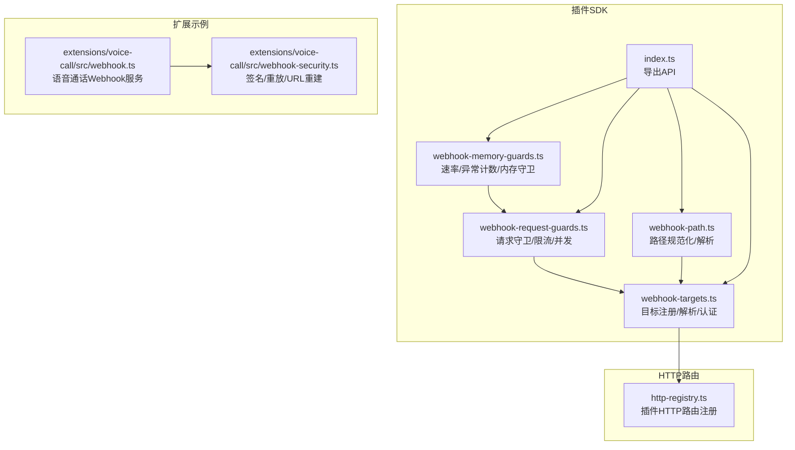
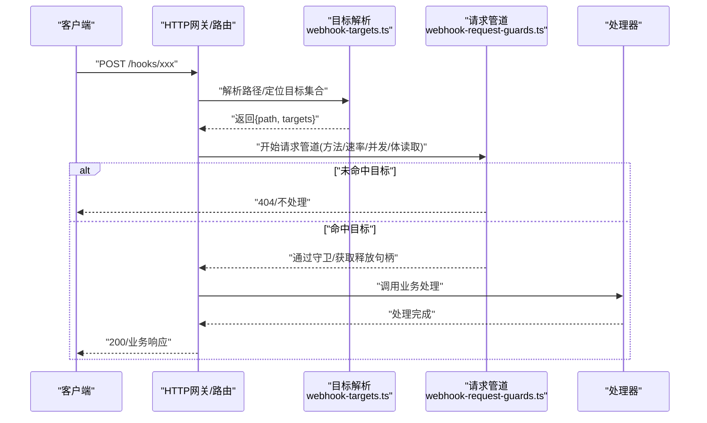
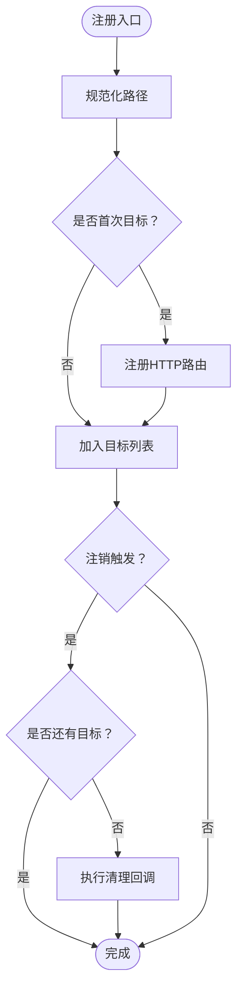
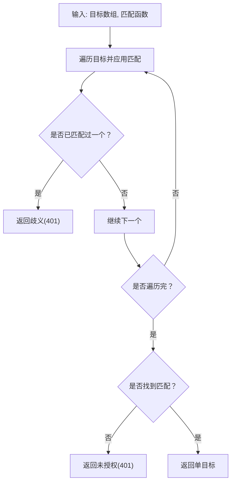
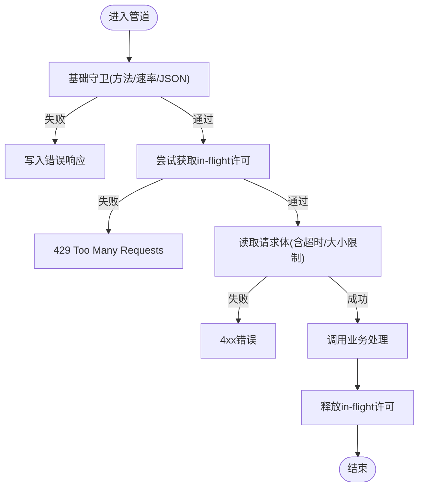
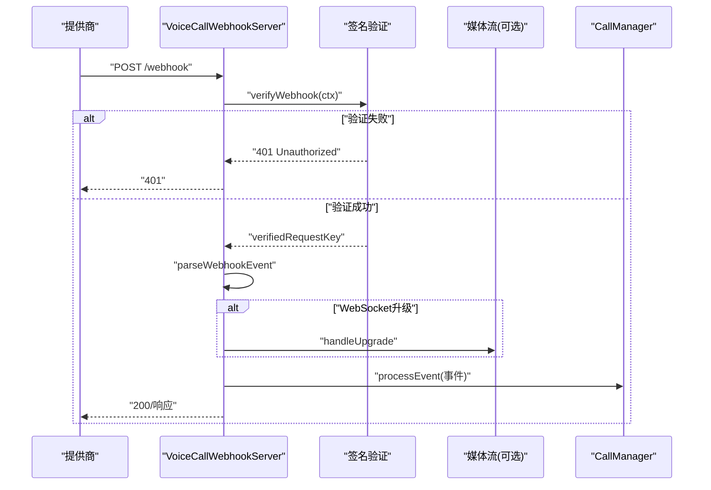
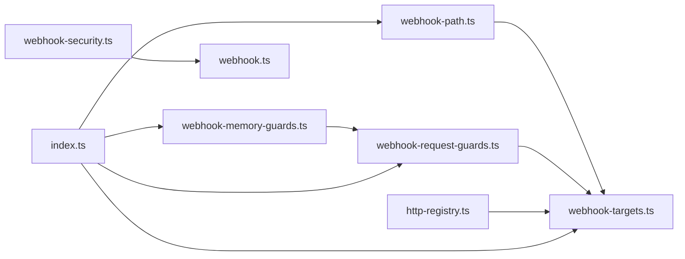

# Webhook集成

## 目录
1. [简介](#简介)
2. [项目结构](#项目结构)
3. [核心组件](#核心组件)
4. [架构总览](#架构总览)
5. [详细组件分析](#详细组件分析)
6. [依赖关系分析](#依赖关系分析)
7. [性能考量](#性能考量)
8. [故障排查指南](#故障排查指南)
9. [结论](#结论)
10. [附录](#附录)

## 简介
本文件面向OpenClaw插件SDK的Webhook集成，系统性阐述Webhook目标注册、请求处理、认证与安全、限流与并发控制、以及调试与监控最佳实践。文档既覆盖通用插件SDK能力（路径规范化、目标注册、请求管道），也结合具体扩展（如语音通话Webhook）展示端到端的请求校验、重放防护与媒体流升级等高级特性。

## 项目结构
围绕Webhook的核心代码位于插件SDK模块中，并通过HTTP路由注册器对外暴露为可被网关或插件使用的HTTP端点；同时在扩展目录中有实际的Webhook服务实现示例。

图表来源
- [webhook-targets.ts](file://src/plugin-sdk/webhook-targets.ts#L1-L282)
- [webhook-request-guards.ts](file://src/plugin-sdk/webhook-request-guards.ts#L1-L291)
- [webhook-path.ts](file://src/plugin-sdk/webhook-path.ts#L1-L32)
- [webhook-memory-guards.ts](file://src/plugin-sdk/webhook-memory-guards.ts#L1-L197)
- [http-registry.ts](file://src/plugins/http-registry.ts#L1-L93)
- [index.ts](file://src/plugin-sdk/index.ts#L148-L176)
- [webhook.ts](file://extensions/voice-call/src/webhook.ts#L1-L488)
- [webhook-security.ts](file://extensions/voice-call/src/webhook-security.ts#L1-L981)

章节来源
- [webhook-targets.ts](file://src/plugin-sdk/webhook-targets.ts#L1-L282)
- [webhook-request-guards.ts](file://src/plugin-sdk/webhook-request-guards.ts#L1-L291)
- [webhook-path.ts](file://src/plugin-sdk/webhook-path.ts#L1-L32)
- [webhook-memory-guards.ts](file://src/plugin-sdk/webhook-memory-guards.ts#L1-L197)
- [http-registry.ts](file://src/plugins/http-registry.ts#L1-L93)
- [index.ts](file://src/plugin-sdk/index.ts#L148-L176)

## 核心组件
- 目标注册与路由绑定：将“目标”按规范化路径注册到映射表，并在首个目标出现时向HTTP路由注册器注册对应路径，最后一个目标移除时自动清理。
- 请求解析与认证：根据请求URL解析目标集合，支持同步/异步匹配函数进行认证，返回单目标或拒绝并写入响应。
- 请求管道与守卫：统一执行方法白名单、速率限制、JSON内容类型要求、请求体读取限制、并发上限（in-flight）等。
- 路径规范化与解析：统一处理前缀斜杠、尾随斜杠、空路径默认值、从URL提取路径等。
- 内存守卫：固定窗口速率限制、异常计数器、可选异常追踪器，用于限流与异常检测。

章节来源
- [webhook-targets.ts](file://src/plugin-sdk/webhook-targets.ts#L27-L100)
- [webhook-targets.ts](file://src/plugin-sdk/webhook-targets.ts#L102-L162)
- [webhook-request-guards.ts](file://src/plugin-sdk/webhook-request-guards.ts#L139-L227)
- [webhook-path.ts](file://src/plugin-sdk/webhook-path.ts#L1-L32)
- [webhook-memory-guards.ts](file://src/plugin-sdk/webhook-memory-guards.ts#L25-L105)

## 架构总览
下图展示了从HTTP请求进入，到目标解析、认证、守卫检查、并发控制，再到业务处理的整体流程。

图表来源
- [webhook-targets.ts](file://src/plugin-sdk/webhook-targets.ts#L102-L162)
- [webhook-request-guards.ts](file://src/plugin-sdk/webhook-request-guards.ts#L179-L227)
- [http-registry.ts](file://src/plugins/http-registry.ts#L12-L92)

## 详细组件分析

### 组件A：Webhook目标注册与路由绑定
- 功能要点
  - 路径规范化：统一去除多余空白、确保以“/”开头、去除尾部“/”，空路径归一化为“/”。
  - 注册行为：首次目标注册时，调用HTTP路由注册器在对应路径上注册插件路由；最后目标移除时清理。
  - 注销：从映射表移除目标，若该路径无剩余目标则触发清理回调。
- 关键接口
  - registerWebhookTarget：注册目标并返回可注销句柄。
  - registerWebhookTargetWithPluginRoute：注册目标并联动HTTP路由注册。
  - resolveWebhookTargets：根据IncomingMessage解析目标集合。
- 测试覆盖
  - 路径规范化、首末目标注册/清理、异常场景（首注册钩子抛错）等。

图表来源
- [webhook-targets.ts](file://src/plugin-sdk/webhook-targets.ts#L57-L100)
- [http-registry.ts](file://src/plugins/http-registry.ts#L12-L92)

章节来源
- [webhook-targets.ts](file://src/plugin-sdk/webhook-targets.ts#L27-L100)
- [http-registry.ts](file://src/plugins/http-registry.ts#L12-L92)
- [webhook-targets.test.ts](file://src/plugin-sdk/webhook-targets.test.ts#L31-L98)

### 组件B：请求解析与认证
- 功能要点
  - 同步/异步目标匹配：支持Promise式异步匹配，返回单目标或“歧义/未命中”结果。
  - 认证拒绝：当匹配为歧义或多于一个目标时返回401；无匹配返回401；成功返回目标。
  - 方法拒绝：非POST请求直接返回405。
- 关键接口
  - resolveSingleWebhookTarget / resolveSingleWebhookTargetAsync
  - resolveWebhookTargetWithAuthOrReject / resolveWebhookTargetWithAuthOrRejectSync
  - rejectNonPostWebhookRequest

图表来源
- [webhook-targets.ts](file://src/plugin-sdk/webhook-targets.ts#L164-L220)
- [webhook-targets.ts](file://src/plugin-sdk/webhook-targets.ts#L222-L271)

章节来源
- [webhook-targets.ts](file://src/plugin-sdk/webhook-targets.ts#L164-L271)
- [webhook-targets.test.ts](file://src/plugin-sdk/webhook-targets.test.ts#L292-L359)

### 组件C：请求管道与守卫
- 功能要点
  - 基础守卫：方法白名单、速率限制、JSON内容类型要求。
  - 并发控制：基于键的in-flight计数器，超过阈值返回429。
  - 请求体读取：带超时与大小限制，支持预认证/后认证不同profile。
  - 异常与错误：统一错误码映射（400/408/413/415/429）。
- 关键接口
  - applyBasicWebhookRequestGuards
  - beginWebhookRequestPipelineOrReject
  - readWebhookBodyOrReject / readJsonWebhookBodyOrReject
  - createWebhookInFlightLimiter
- 默认参数
  - 预认证最大字节/超时、后认证最大字节/超时、in-flight上限与键数量上限。

图表来源
- [webhook-request-guards.ts](file://src/plugin-sdk/webhook-request-guards.ts#L139-L291)

章节来源
- [webhook-request-guards.ts](file://src/plugin-sdk/webhook-request-guards.ts#L139-L291)

### 组件D：路径规范化与解析
- 功能要点
  - normalizeWebhookPath：去除空白、补全“/”前缀、去除尾部“/”。
  - resolveWebhookPath：优先使用显式webhookPath，其次从webhookUrl解析，最后回退默认值。
- 使用场景
  - 注册目标时规范化路径；解析请求URL时标准化路径以便匹配。

章节来源
- [webhook-path.ts](file://src/plugin-sdk/webhook-path.ts#L1-L32)

### 组件E：内存守卫（速率/异常）
- 功能要点
  - 固定窗口速率限制：按key统计请求次数，超过阈值返回限流。
  - 异常计数器：记录特定状态码的异常次数，支持周期日志输出。
  - 可选异常追踪器：对异常事件进行聚合与日志。
- 默认配置
  - 窗口时长、最大请求数、最大跟踪键数、异常状态码集、TTL、日志间隔等。

章节来源
- [webhook-memory-guards.ts](file://src/plugin-sdk/webhook-memory-guards.ts#L25-L197)

### 组件F：扩展示例（语音通话Webhook）
- 功能要点
  - HTTP服务器：接收Webhook，支持WebSocket升级（媒体流）。
  - 安全校验：针对Twilio/Telnyx/Plivo等提供签名验证、时间戳校验、重放检测、URL重建。
  - 事件处理：解析事件、去重、自动应答（工具调用）、媒体流连接/断开处理。
- 关键流程
  - URL重建与主机头验证，防止注入。
  - 签名验证与重放窗口维护。
  - 事件解析与业务处理，必要时生成响应。

图表来源
- [webhook.ts](file://extensions/voice-call/src/webhook.ts#L332-L410)
- [webhook-security.ts](file://extensions/voice-call/src/webhook-security.ts#L565-L696)

章节来源
- [webhook.ts](file://extensions/voice-call/src/webhook.ts#L1-L488)
- [webhook-security.ts](file://extensions/voice-call/src/webhook-security.ts#L1-L981)

## 依赖关系分析
- 模块内依赖
  - webhook-targets.ts 依赖 webhook-path.ts（路径规范化）、webhook-request-guards.ts（请求管道）、http-registry.ts（HTTP路由注册）。
  - webhook-request-guards.ts 依赖 infra/http-body.ts（请求体读取）、webhook-memory-guards.ts（速率/并发）。
  - index.ts 导出上述能力，供插件与扩展使用。
- 扩展依赖
  - voice-call扩展依赖自身安全模块进行签名与重放防护，并与媒体流处理器协作。

图表来源
- [webhook-targets.ts](file://src/plugin-sdk/webhook-targets.ts#L1-L8)
- [webhook-request-guards.ts](file://src/plugin-sdk/webhook-request-guards.ts#L1-L9)
- [webhook-path.ts](file://src/plugin-sdk/webhook-path.ts#L1-L11)
- [webhook-memory-guards.ts](file://src/plugin-sdk/webhook-memory-guards.ts#L1-L2)
- [http-registry.ts](file://src/plugins/http-registry.ts#L1-L6)
- [index.ts](file://src/plugin-sdk/index.ts#L148-L176)
- [webhook.ts](file://extensions/voice-call/src/webhook.ts#L1-L17)
- [webhook-security.ts](file://extensions/voice-call/src/webhook-security.ts#L1-L4)

章节来源
- [index.ts](file://src/plugin-sdk/index.ts#L148-L176)

## 性能考量
- 并发控制
  - in-flight限制默认每键并发上限为8，最大跟踪键数4096，避免热点路径导致资源耗尽。
- 速率限制
  - 固定窗口默认1分钟最多120次，可根据业务调整窗口与阈值。
- 请求体读取
  - 预认证阶段较小的体限制与较短超时，降低恶意请求对后端的影响；认证后允许更大体与更长超时。
- 内存与GC
  - 采用Map裁剪策略，定期清理过期条目，避免无限增长。

章节来源
- [webhook-request-guards.ts](file://src/plugin-sdk/webhook-request-guards.ts#L24-L27)
- [webhook-memory-guards.ts](file://src/plugin-sdk/webhook-memory-guards.ts#L25-L105)

## 故障排查指南
- 常见错误与对策
  - 405 Method Not Allowed：仅允许POST；确认客户端方法。
  - 401 Unauthorized：认证失败；检查令牌/签名；确认重放防护与时间戳。
  - 413 Payload Too Large：请求体过大；调整读取限制或拆分请求。
  - 429 Too Many Requests：速率限制或并发上限；检查in-flight与速率配置。
  - 415 Unsupported Media Type：缺少或不正确的Content-Type；确保application/json。
- 调试建议
  - 开启诊断事件（如Webhook接收/处理/错误事件），便于追踪。
  - 使用测试用例思路复现：构造请求对象、断言响应码与消息。
  - 对扩展Webhook，检查URL重建与主机白名单配置，确保代理转发安全。

章节来源
- [webhook-request-guards.ts](file://src/plugin-sdk/webhook-request-guards.ts#L58-L82)
- [webhook-targets.ts](file://src/plugin-sdk/webhook-targets.ts#L273-L281)
- [webhook-targets.test.ts](file://src/plugin-sdk/webhook-targets.test.ts#L292-L359)

## 结论
OpenClaw插件SDK为Webhook提供了完整的基础设施：目标注册与路由绑定、路径规范化、统一请求管道与守卫、速率与并发控制、以及可扩展的安全校验（签名/重放/URL重建）。结合扩展示例，可在保证安全与性能的前提下，快速接入外部系统并实现稳定的Webhook处理流程。

## 附录
- 文档参考
  - Webhook自动化与端点说明：[Webhook文档](file://docs/automation/webhook.md#L1-L216)
  - CLI帮助（Gmail Pub/Sub等）：[webhooks CLI](file://docs/cli/webhooks.md#L1-L26)
- 导出与使用
  - 插件SDK导出：路径、目标、请求守卫、内存守卫等API均通过index.ts集中导出，便于插件与扩展直接使用。

章节来源
- [webhook.md](file://docs/automation/webhook.md#L1-L216)
- [webhooks.md](file://docs/cli/webhooks.md#L1-L26)
- [index.ts](file://src/plugin-sdk/index.ts#L148-L176)