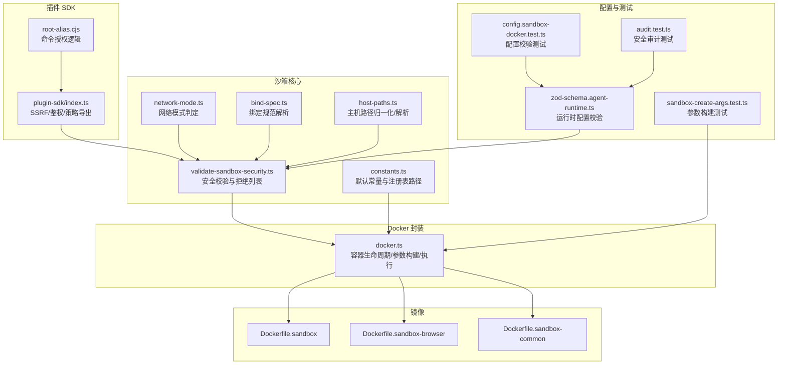
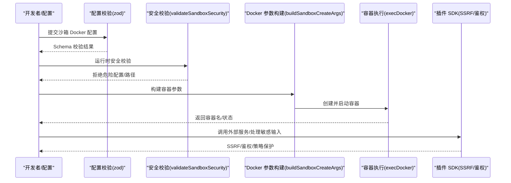
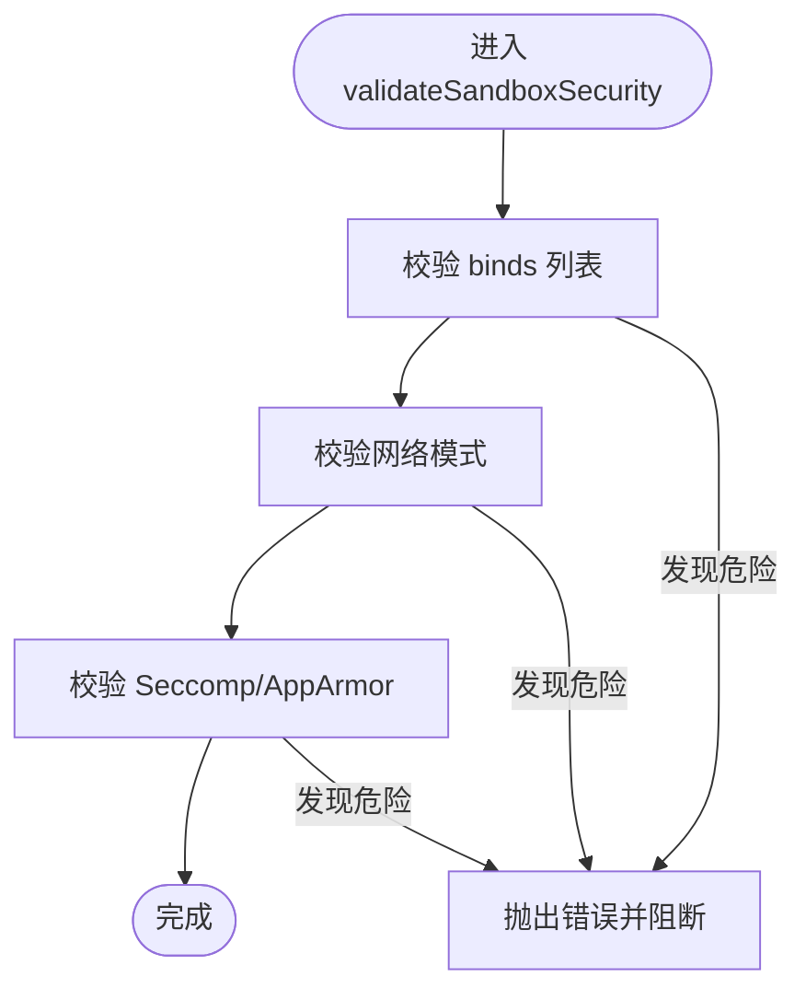
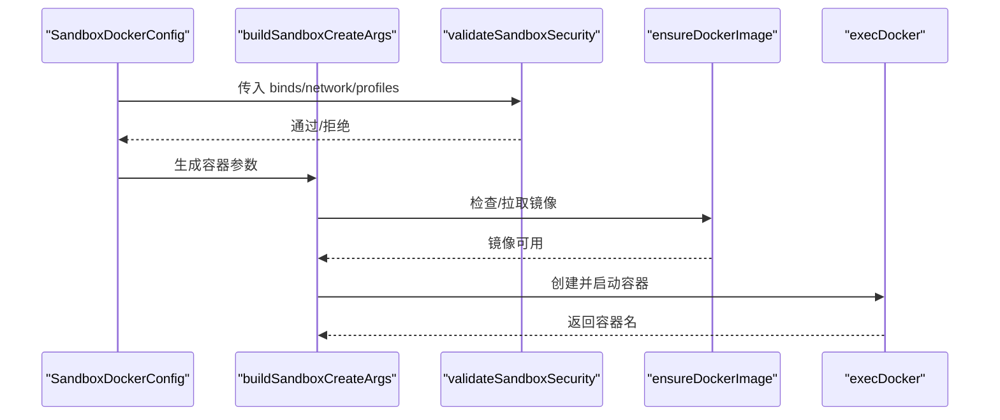
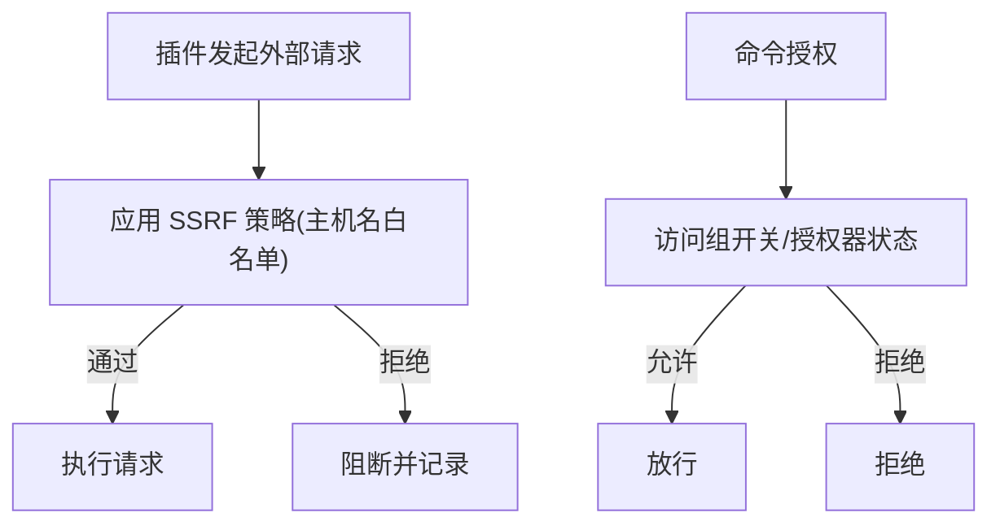
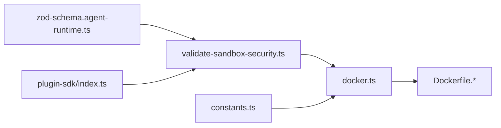

# 安全沙箱机制

## 目录
1. [简介](#简介)
2. [项目结构](#项目结构)
3. [核心组件](#核心组件)
4. [架构总览](#架构总览)
5. [详细组件分析](#详细组件分析)
6. [依赖关系分析](#依赖关系分析)
7. [性能考量](#性能考量)
8. [故障排查指南](#故障排查指南)
9. [结论](#结论)
10. [附录](#附录)

## 简介
本文件系统化阐述 OpenClaw 插件 SDK 的安全沙箱机制，覆盖进程隔离、资源限制、网络访问控制、环境变量与挂载安全、以及面向插件的安全策略（如 SSRF 防护、身份认证与权限控制）。文档同时提供配置与使用指南、最佳实践与审计建议，帮助开发者在插件中正确处理敏感操作并确保运行时安全。

## 项目结构
围绕沙箱的关键代码位于 agents/sandbox 子目录，配合插件 SDK 的安全工具集与 Docker 运行时封装；镜像构建脚本位于仓库根目录，定义了基础与浏览器专用沙箱镜像。

**图表来源**
- [src/agents/sandbox/validate-sandbox-security.ts](file://src/agents/sandbox/validate-sandbox-security.ts#L1-L344)
- [src/agents/sandbox/docker.ts](file://src/agents/sandbox/docker.ts#L1-L566)
- [src/agents/sandbox/constants.ts](file://src/agents/sandbox/constants.ts#L1-L55)
- [src/agents/sandbox/network-mode.ts](file://src/agents/sandbox/network-mode.ts#L1-L29)
- [src/agents/sandbox/bind-spec.ts](file://src/agents/sandbox/bind-spec.ts#L1-L35)
- [src/agents/sandbox/host-paths.ts](file://src/agents/sandbox/host-paths.ts#L1-L44)
- [src/config/zod-schema.agent-runtime.ts](file://src/config/zod-schema.agent-runtime.ts#L131-L165)
- [src/agents/sandbox-create-args.test.ts](file://src/agents/sandbox-create-args.test.ts#L41-L73)
- [src/config/config.sandbox-docker.test.ts](file://src/config/config.sandbox-docker.test.ts#L136-L180)
- [src/security/audit.test.ts](file://src/security/audit.test.ts#L1027-L1088)
- [src/plugin-sdk/index.ts](file://src/plugin-sdk/index.ts#L442-L454)
- [src/plugin-sdk/root-alias.cjs](file://src/plugin-sdk/root-alias.cjs#L35-L52)
- [Dockerfile.sandbox](file://Dockerfile.sandbox#L1-L24)
- [Dockerfile.sandbox-browser](file://Dockerfile.sandbox-browser#L1-L35)
- [Dockerfile.sandbox-common](file://Dockerfile.sandbox-common#L1-L48)

**章节来源**
- [src/agents/sandbox/validate-sandbox-security.ts](file://src/agents/sandbox/validate-sandbox-security.ts#L1-L344)
- [src/agents/sandbox/docker.ts](file://src/agents/sandbox/docker.ts#L1-L566)
- [src/agents/sandbox/constants.ts](file://src/agents/sandbox/constants.ts#L1-L55)
- [src/agents/sandbox/network-mode.ts](file://src/agents/sandbox/network-mode.ts#L1-L29)
- [src/agents/sandbox/bind-spec.ts](file://src/agents/sandbox/bind-spec.ts#L1-L35)
- [src/agents/sandbox/host-paths.ts](file://src/agents/sandbox/host-paths.ts#L1-L44)
- [src/config/zod-schema.agent-runtime.ts](file://src/config/zod-schema.agent-runtime.ts#L131-L165)
- [src/agents/sandbox-create-args.test.ts](file://src/agents/sandbox-create-args.test.ts#L41-L73)
- [src/config/config.sandbox-docker.test.ts](file://src/config/config.sandbox-docker.test.ts#L136-L180)
- [src/security/audit.test.ts](file://src/security/audit.test.ts#L1027-L1088)
- [src/plugin-sdk/index.ts](file://src/plugin-sdk/index.ts#L442-L454)
- [src/plugin-sdk/root-alias.cjs](file://src/plugin-sdk/root-alias.cjs#L35-L52)
- [Dockerfile.sandbox](file://Dockerfile.sandbox#L1-L24)
- [Dockerfile.sandbox-browser](file://Dockerfile.sandbox-browser#L1-L35)
- [Dockerfile.sandbox-common](file://Dockerfile.sandbox-common#L1-L48)

## 核心组件
- 沙箱安全校验器：对 bind 挂载、网络模式、Seccomp/AppArmor 策略进行强制拒绝与路径白/黑名单检查，防止越权与逃逸。
- Docker 参数构建与容器生命周期管理：负责镜像准备、容器创建/启动、标签与注册表维护、热容器重建提示。
- 常量与默认策略：定义默认镜像、工作目录、默认工具允许/禁止清单、浏览器相关端口与网络等。
- 插件 SDK 安全工具：提供 SSRF 防护、鉴权与权限控制辅助函数，供插件在调用外部服务或处理敏感输入时使用。

**章节来源**
- [src/agents/sandbox/validate-sandbox-security.ts](file://src/agents/sandbox/validate-sandbox-security.ts#L1-L344)
- [src/agents/sandbox/docker.ts](file://src/agents/sandbox/docker.ts#L316-L425)
- [src/agents/sandbox/constants.ts](file://src/agents/sandbox/constants.ts#L1-L55)
- [src/plugin-sdk/index.ts](file://src/plugin-sdk/index.ts#L442-L454)

## 架构总览
下图展示从配置到容器运行、再到插件调用外部资源的整体流程与关键安全断点。

**图表来源**
- [src/config/zod-schema.agent-runtime.ts](file://src/config/zod-schema.agent-runtime.ts#L131-L165)
- [src/agents/sandbox/validate-sandbox-security.ts](file://src/agents/sandbox/validate-sandbox-security.ts#L328-L343)
- [src/agents/sandbox/docker.ts](file://src/agents/sandbox/docker.ts#L316-L425)
- [src/plugin-sdk/index.ts](file://src/plugin-sdk/index.ts#L442-L454)

## 详细组件分析

### 组件A：沙箱安全校验器
- 拒绝列表与路径策略
  - 阻止挂载系统关键路径（如 /etc、/proc、/sys、/dev、/root、/boot）及常见 Docker 套接字路径。
  - 对非绝对源路径、超出允许根目录、覆盖根目录、保留目标路径（如 /workspace、/agent）进行拦截。
- 网络模式安全
  - 明确禁止 host 网络与 container:* 命名空间加入，除非显式允许（危险开关）。
- Seccomp/AppArmor 策略
  - 明确拒绝 unconfined 策略，要求使用自定义策略文件或省略该设置。
- 路径解析与硬化工序
  - 归一化主机路径，通过现有祖先解析避免符号链接逃逸，二次校验以提升鲁棒性。

**图表来源**
- [src/agents/sandbox/validate-sandbox-security.ts](file://src/agents/sandbox/validate-sandbox-security.ts#L328-L343)

**章节来源**
- [src/agents/sandbox/validate-sandbox-security.ts](file://src/agents/sandbox/validate-sandbox-security.ts#L16-L37)
- [src/agents/sandbox/validate-sandbox-security.ts](file://src/agents/sandbox/validate-sandbox-security.ts#L96-L117)
- [src/agents/sandbox/validate-sandbox-security.ts](file://src/agents/sandbox/validate-sandbox-security.ts#L182-L227)
- [src/agents/sandbox/validate-sandbox-security.ts](file://src/agents/sandbox/validate-sandbox-security.ts#L283-L306)
- [src/agents/sandbox/validate-sandbox-security.ts](file://src/agents/sandbox/validate-sandbox-security.ts#L308-L326)

### 组件B：Docker 参数构建与容器生命周期
- 参数构建
  - 读取只读根文件系统、tmpfs、网络、用户、能力丢弃、安全选项（no-new-privileges、seccomp、apparmor）、DNS、hosts、PID/内存/CPU/ulimit、bind 挂载等。
  - 在构建阶段即调用安全校验，阻止危险配置进入容器。
- 容器生命周期
  - 确保存在所需镜像，创建容器并启动；支持可选初始化命令；维护注册表与标签（会话键、创建时间、配置哈希）。
  - 若配置哈希变化且容器近期活跃，给出重建提示；否则删除旧容器以应用新配置。

**图表来源**
- [src/agents/sandbox/docker.ts](file://src/agents/sandbox/docker.ts#L316-L425)
- [src/agents/sandbox/docker.ts](file://src/agents/sandbox/docker.ts#L436-L473)
- [src/agents/sandbox/docker.ts](file://src/agents/sandbox/docker.ts#L490-L565)

**章节来源**
- [src/agents/sandbox/docker.ts](file://src/agents/sandbox/docker.ts#L316-L425)
- [src/agents/sandbox/docker.ts](file://src/agents/sandbox/docker.ts#L436-L473)
- [src/agents/sandbox/docker.ts](file://src/agents/sandbox/docker.ts#L490-L565)

### 组件C：插件 SDK 安全策略与工具
- SSRF 防护
  - 提供 fetch 守卫与主机名后缀白名单策略，用于限制对外部主机的访问范围。
- 身份验证与权限控制
  - 插件命令授权逻辑基于访问组与授权器，支持“允许/拒绝/按授权器”组合策略。
  - 网关连接策略对控制界面的设备身份与代理认证进行严格评估，避免不安全认证场景。

**图表来源**
- [src/plugin-sdk/index.ts](file://src/plugin-sdk/index.ts#L442-L454)
- [src/plugin-sdk/root-alias.cjs](file://src/plugin-sdk/root-alias.cjs#L35-L52)
- [src/gateway/server/ws-connection/connect-policy.test.ts](file://src/gateway/server/ws-connection/connect-policy.test.ts#L47-L142)

**章节来源**
- [src/plugin-sdk/index.ts](file://src/plugin-sdk/index.ts#L442-L454)
- [src/plugin-sdk/root-alias.cjs](file://src/plugin-sdk/root-alias.cjs#L35-L52)
- [src/gateway/server/ws-connection/connect-policy.test.ts](file://src/gateway/server/ws-connection/connect-policy.test.ts#L47-L142)

### 组件D：镜像与运行时环境
- 基础镜像
  - 使用 Debian slim 作为基础，安装必要工具，创建非特权用户，CMD 保持容器存活。
- 浏览器镜像
  - 额外安装 Chromium、VNC/novnc/websockify、Xvfb 等，暴露调试端口，入口脚本负责浏览器启动。
- 通用开发镜像
  - 预装 curl/wget/jq/coreutils/grep/node/npm/python/git/ca-certificates/go/rust 及可选 pnpm/bun、Linuxbrew，便于多语言开发。

**章节来源**
- [Dockerfile.sandbox](file://Dockerfile.sandbox#L1-L24)
- [Dockerfile.sandbox-browser](file://Dockerfile.sandbox-browser#L1-L35)
- [Dockerfile.sandbox-common](file://Dockerfile.sandbox-common#L1-L48)

## 依赖关系分析
- 模块耦合
  - validate-sandbox-security 是沙箱安全的核心，被 docker.ts 的参数构建阶段直接调用，形成强约束。
  - constants.ts 提供默认常量与注册表路径，被 docker.ts 与测试用例引用。
  - plugin-sdk/index.ts 导出 SSRF 与鉴权工具，供插件在运行期使用。
- 外部依赖
  - Docker CLI 作为容器运行时；若缺失会在配置阶段明确报错。
  - Linux 安全特性（Seccomp/AppArmor）由宿主内核支持。

**图表来源**
- [src/agents/sandbox/validate-sandbox-security.ts](file://src/agents/sandbox/validate-sandbox-security.ts#L328-L343)
- [src/agents/sandbox/docker.ts](file://src/agents/sandbox/docker.ts#L316-L425)
- [src/agents/sandbox/constants.ts](file://src/agents/sandbox/constants.ts#L1-L55)
- [src/config/zod-schema.agent-runtime.ts](file://src/config/zod-schema.agent-runtime.ts#L131-L165)
- [src/plugin-sdk/index.ts](file://src/plugin-sdk/index.ts#L442-L454)
- [Dockerfile.sandbox](file://Dockerfile.sandbox#L1-L24)

**章节来源**
- [src/agents/sandbox/docker.ts](file://src/agents/sandbox/docker.ts#L316-L425)
- [src/agents/sandbox/validate-sandbox-security.ts](file://src/agents/sandbox/validate-sandbox-security.ts#L328-L343)
- [src/agents/sandbox/constants.ts](file://src/agents/sandbox/constants.ts#L1-L55)
- [src/config/zod-schema.agent-runtime.ts](file://src/config/zod-schema.agent-runtime.ts#L131-L165)
- [src/plugin-sdk/index.ts](file://src/plugin-sdk/index.ts#L442-L454)

## 性能考量
- 容器热复用窗口：对近期使用的容器在配置变更时提供重建提示，减少频繁重启带来的冷启动开销。
- 资源限制：通过 PID/内存/CPU/ulimit 等参数限制插件运行时资源占用，避免资源滥用影响宿主稳定性。
- 只读根文件系统与 tmpfs：降低持久化风险，加速临时任务处理。

[本节为通用指导，无需特定文件引用]

## 故障排查指南
- Docker 命令不可用
  - 现象：创建容器时报错提示未找到 docker 命令。
  - 处理：安装 Docker 并确保 docker 在 PATH 中；或关闭沙箱模式。
  - 参考：[src/agents/sandbox/docker.ts](file://src/agents/sandbox/docker.ts#L114-L123)
- 配置校验失败
  - 现象：binds 非绝对路径、覆盖系统根目录、目标为保留路径、网络模式为 host/container:*、Seccomp/AppArmor 为 unconfined。
  - 处理：修正为绝对路径与受控范围；使用 bridge/none 网络；提供自定义安全配置文件。
  - 参考：[src/agents/sandbox/validate-sandbox-security.ts](file://src/agents/sandbox/validate-sandbox-security.ts#L96-L117)、[src/agents/sandbox/validate-sandbox-security.ts](file://src/agents/sandbox/validate-sandbox-security.ts#L283-L306)、[src/agents/sandbox/validate-sandbox-security.ts](file://src/agents/sandbox/validate-sandbox-security.ts#L308-L326)
- 审计告警
  - 现象：安全审计检测到危险的沙箱配置项。
  - 处理：根据严重级别调整配置；仅在完全信任的环境下启用危险开关。
  - 参考：[src/security/audit.test.ts](file://src/security/audit.test.ts#L1027-L1088)
- 插件 SSRF/鉴权问题
  - 现象：外部请求被阻断或命令未被授权。
  - 处理：完善主机名白名单或调整授权策略；确保控制界面认证策略符合本地/远程场景。
  - 参考：[src/plugin-sdk/index.ts](file://src/plugin-sdk/index.ts#L442-L454)、[src/plugin-sdk/root-alias.cjs](file://src/plugin-sdk/root-alias.cjs#L35-L52)、[src/gateway/server/ws-connection/connect-policy.test.ts](file://src/gateway/server/ws-connection/connect-policy.test.ts#L47-L142)

**章节来源**
- [src/agents/sandbox/docker.ts](file://src/agents/sandbox/docker.ts#L114-L123)
- [src/agents/sandbox/validate-sandbox-security.ts](file://src/agents/sandbox/validate-sandbox-security.ts#L96-L117)
- [src/agents/sandbox/validate-sandbox-security.ts](file://src/agents/sandbox/validate-sandbox-security.ts#L283-L306)
- [src/agents/sandbox/validate-sandbox-security.ts](file://src/agents/sandbox/validate-sandbox-security.ts#L308-L326)
- [src/security/audit.test.ts](file://src/security/audit.test.ts#L1027-L1088)
- [src/plugin-sdk/index.ts](file://src/plugin-sdk/index.ts#L442-L454)
- [src/plugin-sdk/root-alias.cjs](file://src/plugin-sdk/root-alias.cjs#L35-L52)
- [src/gateway/server/ws-connection/connect-policy.test.ts](file://src/gateway/server/ws-connection/connect-policy.test.ts#L47-L142)

## 结论
OpenClaw 的安全沙箱通过“运行时安全校验 + Docker 参数硬限制 + 插件侧安全工具”的三层防护，有效降低了插件在执行敏感操作时的风险。结合严格的网络与挂载策略、资源限制与镜像最小化设计，能够在保证功能灵活性的同时最大化运行时安全性。建议在生产环境中始终使用非 host 网络、提供自定义安全配置文件、严格限定 bind 源路径与目标目录，并配合插件 SDK 的 SSRF 与鉴权工具共同使用。

[本节为总结，无需特定文件引用]

## 附录

### 配置与使用指南（摘要）
- 沙箱 Docker 配置
  - 禁止使用 host 或 container:* 网络模式；禁止使用 unconfined 的 Seccomp/AppArmor。
  - bind 挂载必须为绝对路径，不得覆盖系统根目录或指向保留目标路径；可通过允许根目录与危险开关放宽，但需谨慎。
  - 参考：[src/config/zod-schema.agent-runtime.ts](file://src/config/zod-schema.agent-runtime.ts#L131-L165)、[src/agents/sandbox/validate-sandbox-security.ts](file://src/agents/sandbox/validate-sandbox-security.ts#L328-L343)
- 参数构建与容器生命周期
  - 使用 buildSandboxCreateArgs 构建参数前会先进行安全校验；确保镜像存在后再创建容器；注册表维护配置哈希与使用时间。
  - 参考：[src/agents/sandbox/docker.ts](file://src/agents/sandbox/docker.ts#L316-L425)、[src/agents/sandbox/docker.ts](file://src/agents/sandbox/docker.ts#L490-L565)
- 插件安全策略
  - 使用 fetch 守卫与主机名白名单限制外部访问；命令授权遵循访问组与授权器策略；控制界面认证策略区分本地/远程场景。
  - 参考：[src/plugin-sdk/index.ts](file://src/plugin-sdk/index.ts#L442-L454)、[src/plugin-sdk/root-alias.cjs](file://src/plugin-sdk/root-alias.cjs#L35-L52)、[src/gateway/server/ws-connection/connect-policy.test.ts](file://src/gateway/server/ws-connection/connect-policy.test.ts#L47-L142)
- 最佳实践
  - 默认使用 none/bridge 网络；仅在必要时使用自定义 bridge；避免任何 bind 挂载系统关键路径；启用只读根文件系统与 tmpfs；合理设置 PID/内存/CPU/ulimit；定期清理过期容器与镜像。
  - 参考：[src/agents/sandbox/docker.ts](file://src/agents/sandbox/docker.ts#L357-L424)、[Dockerfile.sandbox](file://Dockerfile.sandbox#L1-L24)、[Dockerfile.sandbox-browser](file://Dockerfile.sandbox-browser#L1-L35)、[Dockerfile.sandbox-common](file://Dockerfile.sandbox-common#L1-L48)

**章节来源**
- [src/config/zod-schema.agent-runtime.ts](file://src/config/zod-schema.agent-runtime.ts#L131-L165)
- [src/agents/sandbox/validate-sandbox-security.ts](file://src/agents/sandbox/validate-sandbox-security.ts#L328-L343)
- [src/agents/sandbox/docker.ts](file://src/agents/sandbox/docker.ts#L316-L425)
- [src/agents/sandbox/docker.ts](file://src/agents/sandbox/docker.ts#L490-L565)
- [src/plugin-sdk/index.ts](file://src/plugin-sdk/index.ts#L442-L454)
- [src/plugin-sdk/root-alias.cjs](file://src/plugin-sdk/root-alias.cjs#L35-L52)
- [src/gateway/server/ws-connection/connect-policy.test.ts](file://src/gateway/server/ws-connection/connect-policy.test.ts#L47-L142)
- [Dockerfile.sandbox](file://Dockerfile.sandbox#L1-L24)
- [Dockerfile.sandbox-browser](file://Dockerfile.sandbox-browser#L1-L35)
- [Dockerfile.sandbox-common](file://Dockerfile.sandbox-common#L1-L48)