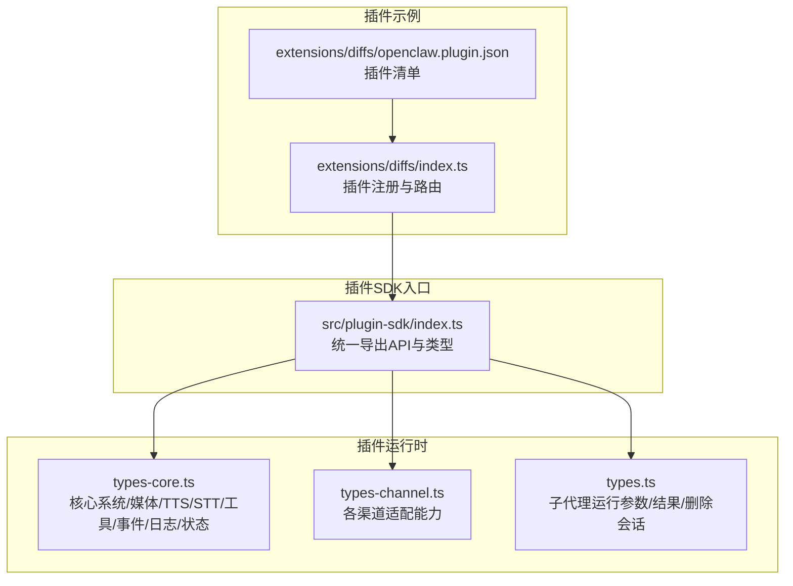
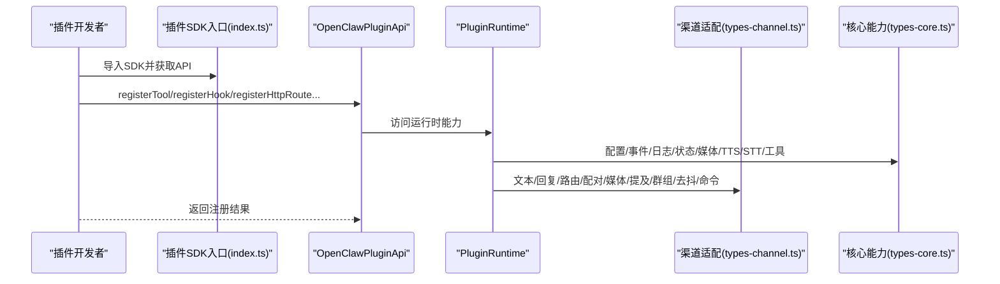
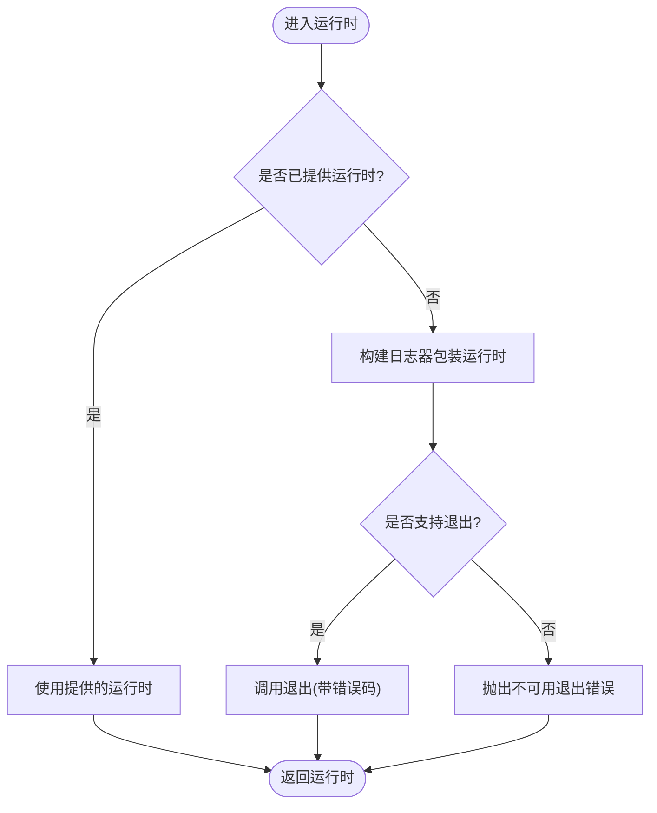
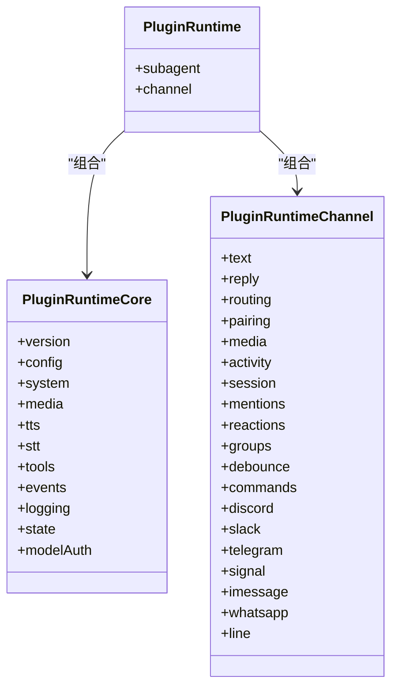
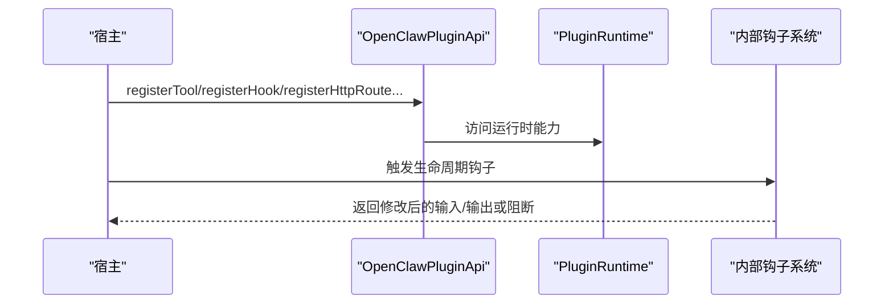
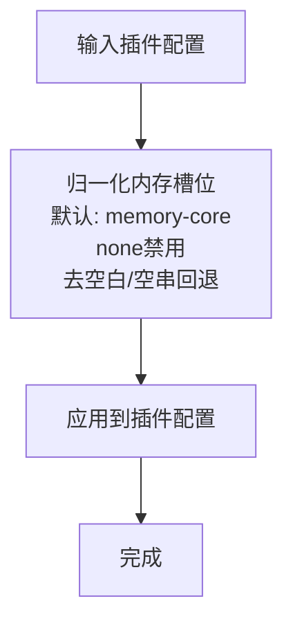
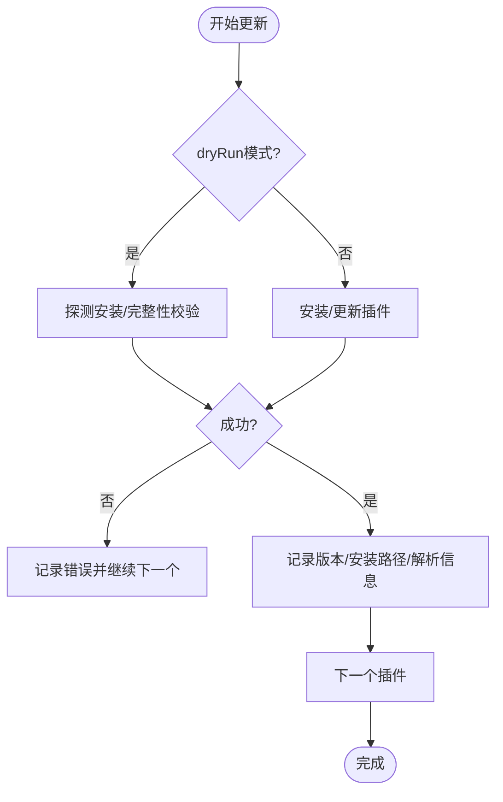
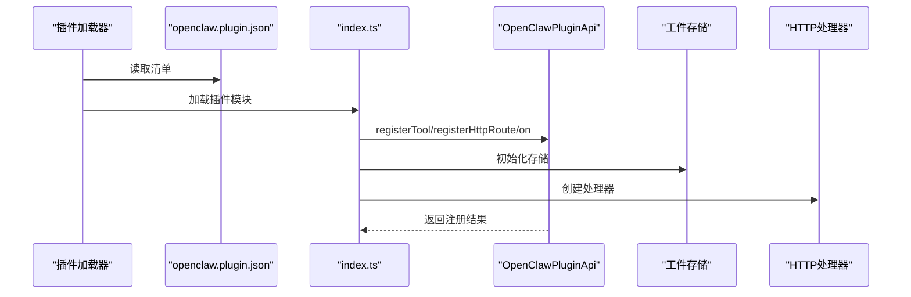
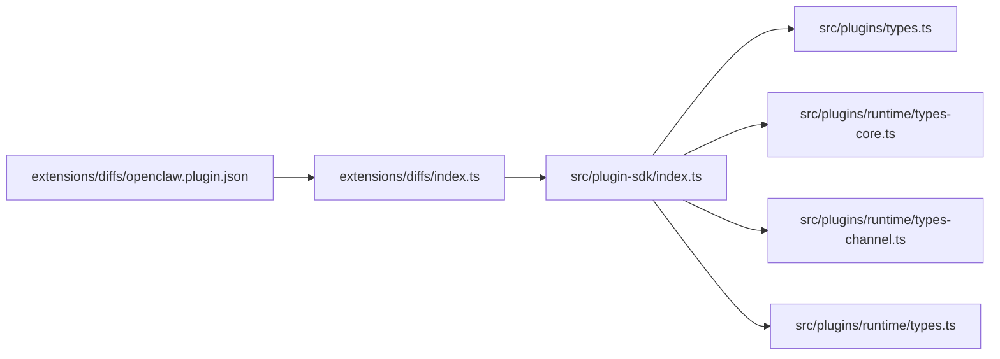

# 插件SDK开发

## 目录
1. [简介](#简介)
2. [项目结构](#项目结构)
3. [核心组件](#核心组件)
4. [架构总览](#架构总览)
5. [详细组件分析](#详细组件分析)
6. [依赖关系分析](#依赖关系分析)
7. [性能考量](#性能考量)
8. [故障排查指南](#故障排查指南)
9. [结论](#结论)
10. [附录](#附录)

## 简介
本文件面向希望基于 OpenClaw 构建插件的开发者，系统化阐述插件 SDK 的架构与实现要点，覆盖运行时环境、配置管理、安全沙箱边界、API 接口（生命周期、事件钩子、数据交换）、安装与配置、开发与调试流程，并给出最佳实践与版本兼容性策略。内容以仓库源码为依据，辅以图示帮助理解。

## 项目结构
OpenClaw 将“插件 SDK”作为统一入口导出，集中暴露插件开发所需类型、工具函数与运行时能力；插件运行时由“核心运行时能力 + 渠道适配层 + 子代理能力”三部分组成；典型插件通过 manifest 与注册函数完成装配。

**图表来源**
- [src/plugin-sdk/index.ts](file://src/plugin-sdk/index.ts#L1-L812)
- [src/plugins/runtime/types-core.ts](file://src/plugins/runtime/types-core.ts#L1-L68)
- [src/plugins/runtime/types-channel.ts](file://src/plugins/runtime/types-channel.ts#L1-L166)
- [src/plugins/runtime/types.ts](file://src/plugins/runtime/types.ts#L1-L64)
- [extensions/diffs/openclaw.plugin.json](file://extensions/diffs/openclaw.plugin.json#L1-L183)
- [extensions/diffs/index.ts](file://extensions/diffs/index.ts#L1-L45)

**章节来源**
- [src/plugin-sdk/index.ts](file://src/plugin-sdk/index.ts#L1-L812)
- [src/plugins/runtime/types-core.ts](file://src/plugins/runtime/types-core.ts#L1-L68)
- [src/plugins/runtime/types-channel.ts](file://src/plugins/runtime/types-channel.ts#L1-L166)
- [src/plugins/runtime/types.ts](file://src/plugins/runtime/types.ts#L1-L64)
- [extensions/diffs/openclaw.plugin.json](file://extensions/diffs/openclaw.plugin.json#L1-L183)
- [extensions/diffs/index.ts](file://extensions/diffs/index.ts#L1-L45)

## 核心组件
- 运行时环境与日志
  - 提供可注入的日志器包装，支持 info/error 输出与进程退出封装，便于在不同宿主环境中复用一致的运行时行为。
  - 支持在不可用退出场景下提供自定义错误对象。
- 运行时存储
  - 提供线程安全的运行时单例存取器，包含设置、清理、可选获取与强制获取，用于在插件生命周期内共享上下文。
- 插件运行时能力
  - 核心能力：配置读写、系统事件、心跳唤醒、命令执行、媒体加载/检测、TTS/STT、内存工具、会话事件、日志、状态目录解析、模型鉴权。
  - 渠道能力：文本分块/限制/控制命令识别、回复派发器、路由会话键、配对码生成/读取/更新、远程媒体抓取/本地保存、提及匹配、群组策略、入站去抖、命令授权、各渠道发送/探测/监控等。
  - 子代理能力：运行、等待、获取会话消息、删除会话等。
- 插件API与生命周期
  - 注册工具、钩子、HTTP 路由、通道、网关方法、CLI、服务、提供商、自定义命令、上下文引擎、路径解析、生命周期钩子等。
- 配置与状态
  - 插件配置 Schema、UI 提示、启用状态归一化、内存槽位默认值与禁用策略等。
- 安装与更新
  - 插件安装/更新/完整性校验、渠道同步、版本一致性维护。

**章节来源**
- [src/plugin-sdk/runtime.ts](file://src/plugin-sdk/runtime.ts#L1-L45)
- [src/plugin-sdk/runtime-store.ts](file://src/plugin-sdk/runtime-store.ts#L1-L26)
- [src/plugins/runtime/types-core.ts](file://src/plugins/runtime/types-core.ts#L1-L68)
- [src/plugins/runtime/types-channel.ts](file://src/plugins/runtime/types-channel.ts#L1-L166)
- [src/plugins/runtime/types.ts](file://src/plugins/runtime/types.ts#L1-L64)
- [src/plugins/types.ts](file://src/plugins/types.ts#L248-L306)
- [src/plugins/config-state.test.ts](file://src/plugins/config-state.test.ts#L1-L46)
- [src/plugins/update.ts](file://src/plugins/update.ts#L48-L416)

## 架构总览
下图展示了插件 SDK 的关键交互：插件通过统一入口导入 API，注册自身能力并接入运行时；运行时向上提供系统/媒体/TTS/STT/工具/事件/日志/状态等能力，向下对接各渠道适配与子代理；插件清单定义能力与配置，示例插件演示注册流程与路由。

**图表来源**
- [src/plugin-sdk/index.ts](file://src/plugin-sdk/index.ts#L1-L812)
- [src/plugins/types.ts](file://src/plugins/types.ts#L248-L306)
- [src/plugins/runtime/types-core.ts](file://src/plugins/runtime/types-core.ts#L1-L68)
- [src/plugins/runtime/types-channel.ts](file://src/plugins/runtime/types-channel.ts#L1-L166)

## 详细组件分析

### 运行时环境与日志
- 设计要点
  - 将宿主日志器包装为统一格式，保证跨平台一致性。
  - 提供“可用/不可用”两种退出策略，便于在不同宿主中优雅失败。
- 使用建议
  - 在 CLI 或网关中注入自有日志器，确保输出可被收集与分级。
  - 对于不可退出的宿主，传入不可用退出消息，避免抛出未捕获异常。

**图表来源**
- [src/plugin-sdk/runtime.ts](file://src/plugin-sdk/runtime.ts#L9-L44)

**章节来源**
- [src/plugin-sdk/runtime.ts](file://src/plugin-sdk/runtime.ts#L1-L45)

### 运行时存储
- 设计要点
  - 提供 set/clear/tryGet/get 四种操作，确保在插件生命周期内安全地共享运行时上下文。
  - getRuntime 在未就绪时抛出明确错误，便于快速定位初始化问题。
- 使用建议
  - 在插件激活阶段设置运行时，确保后续钩子与工具可访问。
  - 对多实例或多线程场景，结合 tryGet 与 get 的组合使用，避免竞态。

**章节来源**
- [src/plugin-sdk/runtime-store.ts](file://src/plugin-sdk/runtime-store.ts#L1-L26)

### 插件运行时能力（核心/渠道/子代理）
- 核心能力（types-core.ts）
  - 配置：loadConfig/writeConfigFile
  - 系统：enqueueSystemEvent/requestHeartbeatNow
  - 命令：runCommandWithTimeout
  - 媒体：loadWebMedia/detectMime/mediaKindFromMime/isVoiceCompatibleAudio/getImageMetadata/resizeToJpeg
  - TTS/STT：textToSpeechTelephony/transcribeAudioFile
  - 工具：createMemoryGetTool/createMemorySearchTool/registerMemoryCli
  - 事件：onAgentEvent/onSessionTranscriptUpdate
  - 日志：shouldLogVerbose/getChildLogger
  - 状态：resolveStateDir
  - 模型鉴权：getApiKeyForModel/resolveApiKeyForProvider
- 渠道能力（types-channel.ts）
  - 文本：chunkByNewline/chunkMarkdownText/chunkText/resolveChunkMode/resolveTextChunkLimit/hasControlCommand/表格转换
  - 回复：dispatchReplyWithBufferedBlockDispatcher/createReplyDispatcherWithTyping/从配置派发/入站上下文收尾/信封格式
  - 路由：buildAgentSessionKey/resolveAgentRoute
  - 配对：buildPairingReply/readAllowFromStore/upsertPairingRequest
  - 媒体：fetchRemoteMedia/saveMediaBuffer
  - 会话：resolveStorePath/readSessionUpdatedAt/recordSessionMetaFromInbound/recordInboundSession/updateLastRoute
  - 提及/反应/群组/去抖/命令：各类策略与工具
  - 各渠道：Discord/Slack/Telegram/Signal/iMessage/WhatsApp/LINE 的发送/探测/监控/动作等
- 子代理能力（types.ts）
  - run/waitForRun/getSessionMessages/getSession/deleteSession
  - 会话消息上限、超时等待、删除会话等

**图表来源**
- [src/plugins/runtime/types-core.ts](file://src/plugins/runtime/types-core.ts#L1-L68)
- [src/plugins/runtime/types-channel.ts](file://src/plugins/runtime/types-channel.ts#L1-L166)
- [src/plugins/runtime/types.ts](file://src/plugins/runtime/types.ts#L51-L63)

**章节来源**
- [src/plugins/runtime/types-core.ts](file://src/plugins/runtime/types-core.ts#L1-L68)
- [src/plugins/runtime/types-channel.ts](file://src/plugins/runtime/types-channel.ts#L1-L166)
- [src/plugins/runtime/types.ts](file://src/plugins/runtime/types.ts#L1-L64)

### 插件API与生命周期
- API 能力
  - registerTool/registerHook/registerHttpRoute/registerChannel/registerGatewayMethod/registerCli/registerService/registerProvider/registerCommand/registerContextEngine/resolvePath/on
- 生命周期钩子
  - 模型解析前、提示构建前、代理开始前、LLM 输入/输出、代理结束、压缩前后、重置前、消息收发/发送/已发送、工具调用前后、结果持久化、消息写入前、会话开始/结束、子代理孵化/投递目标/已孵化/结束、网关启动/停止等
- 自定义命令
  - 优先级高于内置命令，适合无需大模型推理的状态切换或状态查询类指令

**图表来源**
- [src/plugins/types.ts](file://src/plugins/types.ts#L248-L306)
- [src/plugins/types.ts](file://src/plugins/types.ts#L321-L372)

**章节来源**
- [src/plugins/types.ts](file://src/plugins/types.ts#L248-L306)
- [src/plugins/types.ts](file://src/plugins/types.ts#L321-L372)

### 配置管理与状态
- 配置 Schema 与 UI 提示
  - 支持 safeParse/parse/validate/uiHints/jsonSchema 等字段，便于在 UI 中渲染与校验
- 插件启用状态归一化
  - 默认内存槽位为 memory-core；显式 none（大小写不敏感）禁用；去除空白字符；空字符串回退到默认
- 插件清单示例
  - diffs 插件定义了大量 UI 提示与配置项，体现 SDK 对配置体验的支持

**图表来源**
- [src/plugins/config-state.test.ts](file://src/plugins/config-state.test.ts#L8-L46)
- [extensions/diffs/openclaw.plugin.json](file://extensions/diffs/openclaw.plugin.json#L68-L182)

**章节来源**
- [src/plugins/config-state.test.ts](file://src/plugins/config-state.test.ts#L1-L46)
- [extensions/diffs/openclaw.plugin.json](file://extensions/diffs/openclaw.plugin.json#L1-L183)

### 安全与可信边界
- 可信插件概念
  - 安装/启用插件即授予与本地同等级别的信任，允许读取环境变量/文件、执行主机命令等
  - 安全报告需证明越过了边界（如未认证加载、白名单/策略绕过、沙箱/路径越界），而非仅展示插件内的恶意行为
- 沙箱与路径安全
  - 路径解析与越界检查，防止逃逸沙箱根目录
  - 沙箱范围与工具策略按全局/代理粒度解析

**章节来源**
- [SECURITY.md](file://SECURITY.md#L104-L110)
- [src/agents/sandbox-paths.ts](file://src/agents/sandbox-paths.ts#L40-L79)
- [src/agents/sandbox/config.ts](file://src/agents/sandbox/config.ts#L157-L188)

### 安装与更新策略
- 安装/更新流程
  - 校验包存在性、完整性（integrity）、版本解析；支持 dry-run 检查；失败时记录错误信息
  - 更新后记录版本、比较当前/下一版本并输出变更摘要
- 版本同步
  - 维护插件版本一致性，支持更新/跳过/变更日志等统计

**图表来源**
- [src/plugins/update.ts](file://src/plugins/update.ts#L250-L394)

**章节来源**
- [src/plugins/update.ts](file://src/plugins/update.ts#L48-L416)

### 示例：Diffs 插件
- 清单（openclaw.plugin.json）
  - 定义 id/name/description、技能目录、UI 提示、配置 Schema（defaults/security）
- 注册（index.ts）
  - 读取默认配置与安全策略
  - 创建工件存储与 HTTP 处理器
  - 注册工具与 HTTP 路由
  - 通过生命周期钩子注入系统提示

**图表来源**
- [extensions/diffs/openclaw.plugin.json](file://extensions/diffs/openclaw.plugin.json#L1-L183)
- [extensions/diffs/index.ts](file://extensions/diffs/index.ts#L14-L45)

**章节来源**
- [extensions/diffs/openclaw.plugin.json](file://extensions/diffs/openclaw.plugin.json#L1-L183)
- [extensions/diffs/index.ts](file://extensions/diffs/index.ts#L1-L45)

## 依赖关系分析
- 入口聚合
  - SDK 入口集中导出类型与工具，降低使用者心智负担
- 运行时分层
  - 核心能力与渠道能力解耦，便于按需使用
- 插件与示例
  - 示例插件遵循统一清单与注册模式，便于复制与扩展

**图表来源**
- [src/plugin-sdk/index.ts](file://src/plugin-sdk/index.ts#L1-L812)
- [src/plugins/types.ts](file://src/plugins/types.ts#L248-L306)
- [src/plugins/runtime/types-core.ts](file://src/plugins/runtime/types-core.ts#L1-L68)
- [src/plugins/runtime/types-channel.ts](file://src/plugins/runtime/types-channel.ts#L1-L166)
- [src/plugins/runtime/types.ts](file://src/plugins/runtime/types.ts#L1-L64)
- [extensions/diffs/index.ts](file://extensions/diffs/index.ts#L1-L45)
- [extensions/diffs/openclaw.plugin.json](file://extensions/diffs/openclaw.plugin.json#L1-L183)

**章节来源**
- [src/plugin-sdk/index.ts](file://src/plugin-sdk/index.ts#L1-L812)
- [src/plugins/types.ts](file://src/plugins/types.ts#L248-L306)
- [src/plugins/runtime/types-core.ts](file://src/plugins/runtime/types-core.ts#L1-L68)
- [src/plugins/runtime/types-channel.ts](file://src/plugins/runtime/types-channel.ts#L1-L166)
- [src/plugins/runtime/types.ts](file://src/plugins/runtime/types.ts#L1-L64)
- [extensions/diffs/index.ts](file://extensions/diffs/index.ts#L1-L45)
- [extensions/diffs/openclaw.plugin.json](file://extensions/diffs/openclaw.plugin.json#L1-L183)

## 性能考量
- 媒体与文本处理
  - 合理设置文本分块阈值与模式，避免超长消息导致传输/渲染压力
  - 使用媒体缓存与 MIME 检测减少重复计算
- 去抖与批处理
  - 利用入站去抖器合并高频事件，降低下游压力
- 会话与压缩
  - 在压缩前后钩子中进行异步预处理，避免阻塞主链路
- 命令与工具
  - 自定义命令优先处理，减少不必要的 LLM 调用

## 故障排查指南
- 运行时未就绪
  - 使用运行时存储的 getRuntime 抛错定位初始化顺序问题
- 配置异常
  - 检查配置 Schema 与 UI 提示，确认默认值与禁用策略是否符合预期
- 安装/更新失败
  - 关注完整性校验与包名解析错误，必要时开启 dry-run 模式先验证
- 路径越界
  - 沙箱路径解析失败时，检查相对路径与根目录边界

**章节来源**
- [src/plugin-sdk/runtime-store.ts](file://src/plugin-sdk/runtime-store.ts#L19-L24)
- [src/plugins/config-state.test.ts](file://src/plugins/config-state.test.ts#L8-L46)
- [src/plugins/update.ts](file://src/plugins/update.ts#L61-L71)
- [src/agents/sandbox-paths.ts](file://src/agents/sandbox-paths.ts#L60-L79)

## 结论
OpenClaw 插件 SDK 通过统一入口、清晰的运行时分层与完备的生命周期钩子，为插件开发提供了高扩展性与强约束的安全边界。配合示例插件与配置 Schema，开发者可以快速构建稳定、可维护的插件生态。建议在实际开发中严格遵循可信边界原则，合理使用运行时能力与钩子，确保性能与可观测性。

## 附录
- 安装与配置
  - 使用插件清单定义能力与配置，通过 register* 系列 API 完成装配
  - 遵循可信插件原则，避免越界访问
- 开发与调试
  - 在宿主中注入日志器与运行时，利用 getRuntime 获取上下文
  - 使用 dry-run 检查安装/更新流程，关注完整性与版本差异
- 最佳实践
  - 将静态提示注入到系统提示中，减少每轮 token 成本
  - 使用去抖与批处理优化高频事件
  - 通过钩子对消息与工具调用进行可控拦截与修改