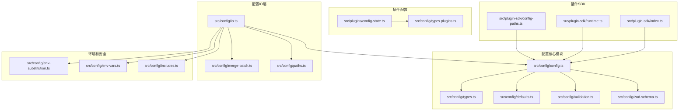
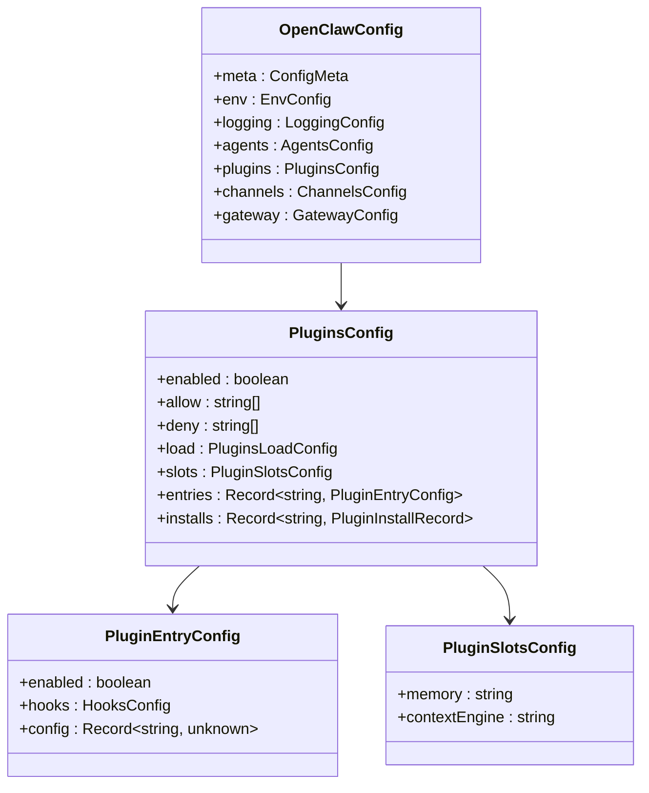
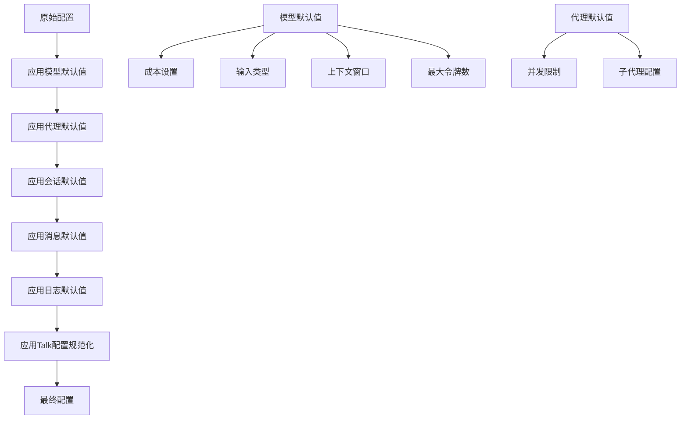
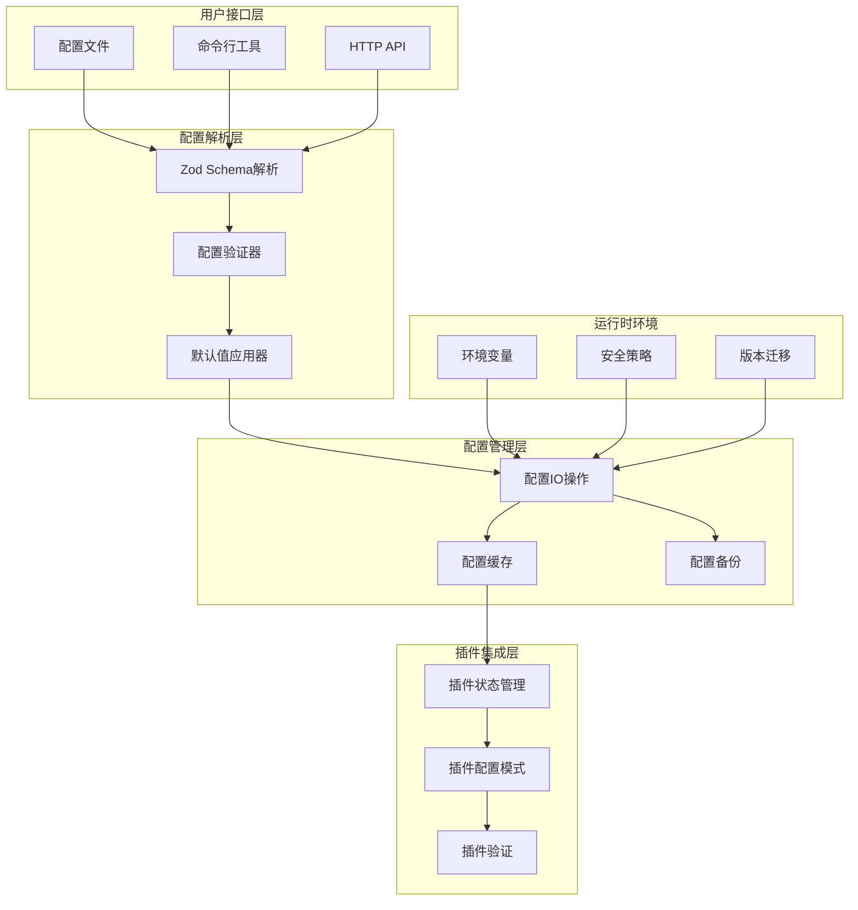
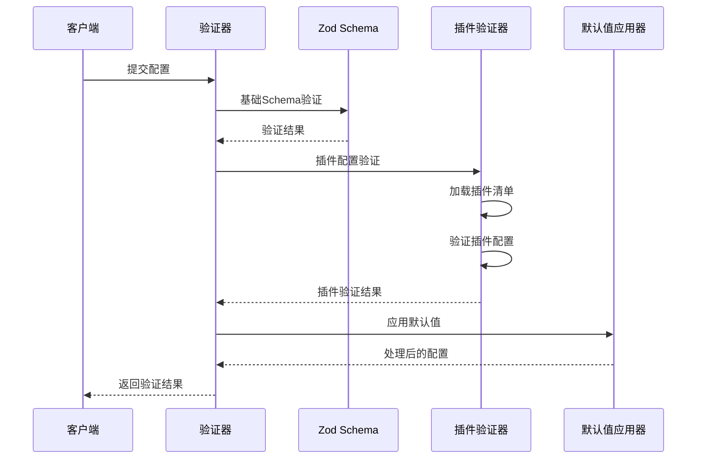
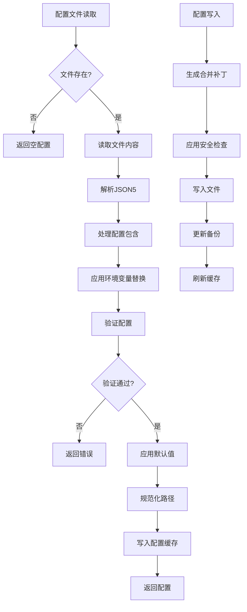
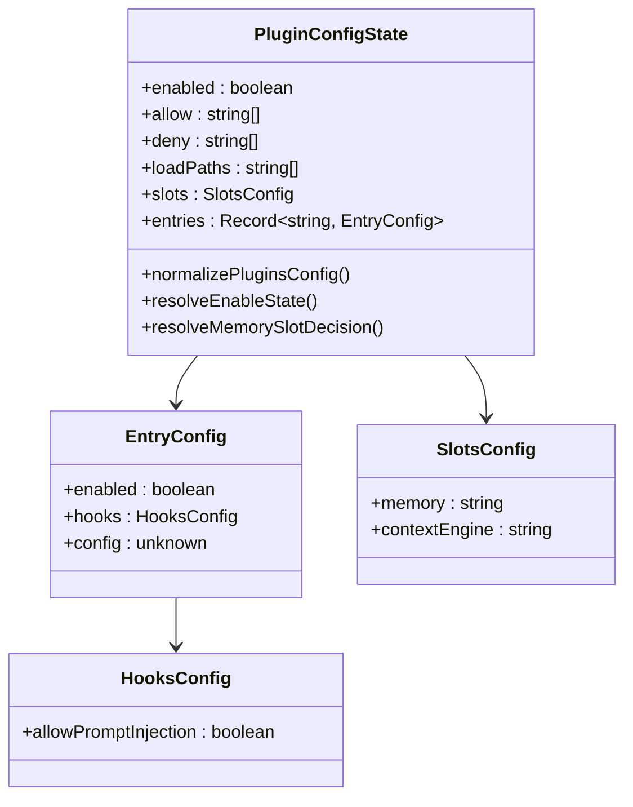
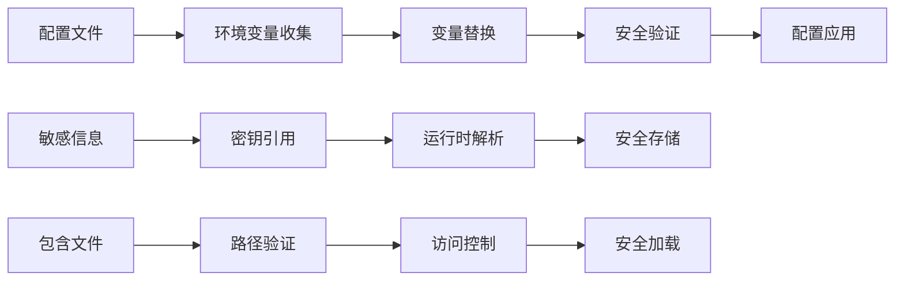
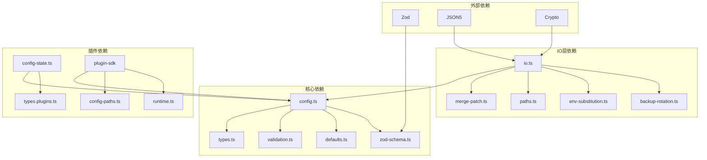

# 配置管理系统

## 目录
1. [简介](#简介)
2. [项目结构](#项目结构)
3. [核心组件](#核心组件)
4. [架构概览](#架构概览)
5. [详细组件分析](#详细组件分析)
6. [依赖关系分析](#依赖关系分析)
7. [性能考虑](#性能考虑)
8. [故障排除指南](#故障排除指南)
9. [结论](#结论)

## 简介

OpenClaw插件SDK配置管理系统是一个完整的配置管理解决方案，专为插件开发和运行时配置而设计。该系统提供了强大的配置验证、默认值处理、动态更新和版本兼容性管理功能。

系统的核心特性包括：
- 基于Zod的强类型配置验证
- 动态配置加载和热重载支持
- 插件配置的独立管理和验证
- 环境变量替换和安全配置处理
- 配置备份和版本控制
- 兼容性迁移和降级策略

## 项目结构

配置管理系统主要分布在以下目录结构中：

**图表来源**
- [src/config/config.ts](file://src/config/config.ts#L1-L28)
- [src/config/io.ts](file://src/config/io.ts#L1-L100)
- [src/plugins/config-state.ts](file://src/plugins/config-state.ts#L1-L50)

**章节来源**
- [src/config/config.ts](file://src/config/config.ts#L1-L28)
- [src/config/types.ts](file://src/config/types.ts#L1-L36)

## 核心组件

### 配置类型系统

配置系统采用分层类型设计，将不同类型的功能分离到专门的模块中：

**图表来源**
- [src/config/types.ts](file://src/config/types.ts#L1-L36)
- [src/config/types.plugins.ts](file://src/config/types.plugins.ts#L1-L37)

### 默认值应用系统

系统实现了多层次的默认值应用机制：

**图表来源**
- [src/config/defaults.ts](file://src/config/defaults.ts#L213-L347)

**章节来源**
- [src/config/types.plugins.ts](file://src/config/types.plugins.ts#L1-L37)
- [src/config/defaults.ts](file://src/config/defaults.ts#L1-L537)

## 架构概览

配置管理系统采用分层架构设计，确保了模块间的清晰职责分离：

**图表来源**
- [src/config/io.ts](file://src/config/io.ts#L698-L800)
- [src/config/validation.ts](file://src/config/validation.ts#L308-L383)

## 详细组件分析

### 配置验证系统

配置验证系统是整个配置管理的核心，采用了多层验证策略：

**图表来源**
- [src/config/validation.ts](file://src/config/validation.ts#L229-L286)
- [src/config/validation.ts](file://src/config/validation.ts#L308-L383)

#### 验证流程详解

验证系统包含以下关键步骤：

1. **基础验证**：使用Zod Schema进行结构化验证
2. **插件验证**：针对插件特定配置进行验证
3. **默认值应用**：自动填充缺失的配置项
4. **警告收集**：识别潜在问题但不影响配置有效性

**章节来源**
- [src/config/validation.ts](file://src/config/validation.ts#L1-L605)

### 配置IO系统

配置IO系统负责配置文件的读取、写入和管理：

**图表来源**
- [src/config/io.ts](file://src/config/io.ts#L707-L800)
- [src/config/io.ts](file://src/config/io.ts#L120-L141)

#### 配置写入保护机制

系统实现了多重安全保护措施：

- **原子写入**：使用临时文件和重命名确保写入完整性
- **备份保留**：自动维护配置文件历史版本
- **审计日志**：记录所有配置变更操作
- **权限检查**：验证文件系统权限和所有权

**章节来源**
- [src/config/io.ts](file://src/config/io.ts#L1-L800)

### 插件配置管理

插件配置管理系统提供了灵活的插件生命周期管理：

**图表来源**
- [src/plugins/config-state.ts](file://src/plugins/config-state.ts#L6-L104)

#### 插件启用策略

系统支持多种插件启用策略：

1. **全局禁用**：通过 `plugins.enabled` 控制
2. **白名单模式**：仅允许指定插件运行
3. **黑名单模式**：阻止特定插件运行
4. **内存槽位管理**：控制内存插件的唯一性

**章节来源**
- [src/plugins/config-state.ts](file://src/plugins/config-state.ts#L189-L256)

### 环境变量和安全处理

系统提供了强大的环境变量处理和安全配置功能：

**图表来源**
- [src/config/env-substitution.ts](file://src/config/env-substitution.ts#L1-L100)
- [src/config/includes.ts](file://src/config/includes.ts#L1-L100)

**章节来源**
- [src/config/env-substitution.ts](file://src/config/env-substitution.ts#L1-L200)
- [src/config/includes.ts](file://src/config/includes.ts#L1-L150)

## 依赖关系分析

配置管理系统展现了良好的模块化设计，各组件间依赖关系清晰：

**图表来源**
- [src/config/config.ts](file://src/config/config.ts#L1-L28)
- [src/config/io.ts](file://src/config/io.ts#L1-L50)

### 循环依赖检测

系统通过以下方式避免循环依赖：
- 明确的模块边界定义
- 反向依赖通过接口抽象
- 运行时依赖注入模式
- 类型定义与实现分离

**章节来源**
- [src/config/config.ts](file://src/config/config.ts#L1-L28)
- [src/plugins/config-state.ts](file://src/plugins/config-state.ts#L1-L50)

## 性能考虑

配置管理系统在性能方面采用了多项优化策略：

### 缓存策略
- **配置缓存**：避免重复解析和验证
- **模式缓存**：缓存Zod Schema编译结果
- **插件清单缓存**：减少插件发现开销

### 异步处理
- **延迟加载**：按需加载配置文件
- **并行验证**：插件配置验证并行执行
- **流式处理**：大配置文件的流式解析

### 内存优化
- **增量更新**：只更新变更的部分
- **对象池**：复用配置对象
- **垃圾回收友好**：避免内存泄漏

## 故障排除指南

### 常见配置错误

| 错误类型 | 症状 | 解决方案 |
|---------|------|----------|
| Schema验证失败 | 配置加载失败，显示详细错误信息 | 检查配置格式，参考错误路径修正 |
| 插件未找到 | 插件被标记为stale或removed | 更新插件配置，移除无效条目 |
| 环境变量缺失 | 功能不可用，出现警告信息 | 设置必需的环境变量或提供默认值 |
| 路径权限问题 | 配置文件无法写入 | 检查文件权限和磁盘空间 |

### 调试技巧

1. **启用详细日志**：使用 `--verbose` 参数获取更多信息
2. **检查配置哈希**：验证配置文件是否发生变化
3. **验证插件清单**：确认插件安装和注册状态
4. **测试环境隔离**：使用独立的测试配置文件

**章节来源**
- [src/config/io.ts](file://src/config/io.ts#L166-L185)
- [src/config/validation.ts](file://src/config/validation.ts#L467-L500)

## 结论

OpenClaw插件SDK配置管理系统展现了现代配置管理的最佳实践。通过分层架构设计、强类型验证、动态配置管理和安全保护机制，系统为插件开发提供了强大而灵活的基础。

关键优势包括：
- **类型安全**：基于Zod的强类型验证确保配置正确性
- **扩展性**：模块化设计支持插件生态系统的持续发展
- **安全性**：多层安全检查保护配置文件和敏感信息
- **可靠性**：完善的错误处理和恢复机制保证系统稳定性

未来发展方向：
- 增强配置模板和示例
- 优化大型配置文件的处理性能
- 扩展配置管理的可视化界面
- 加强配置变更的审计和追踪能力