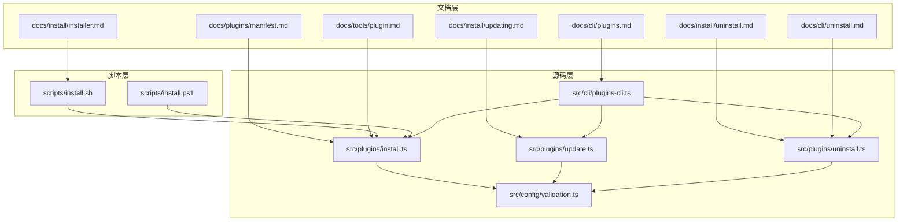
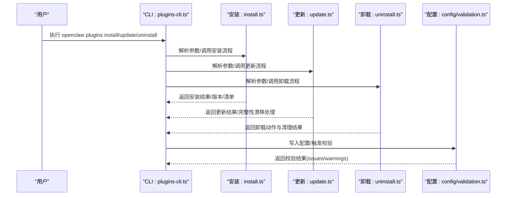
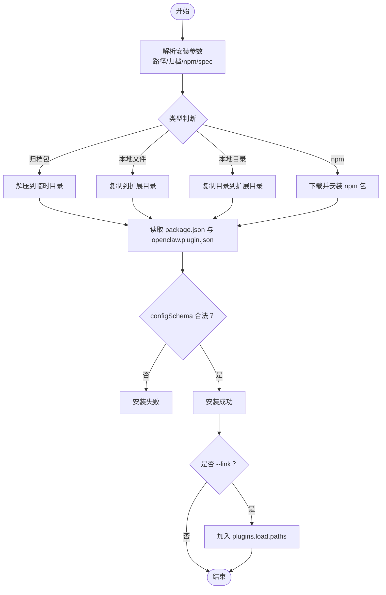
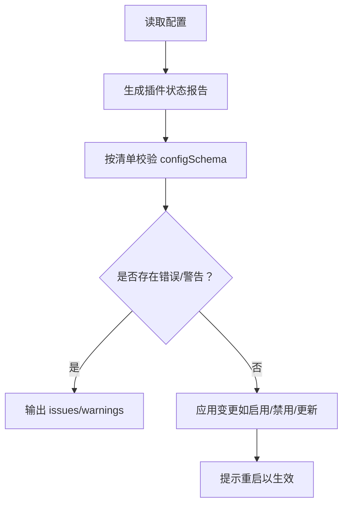
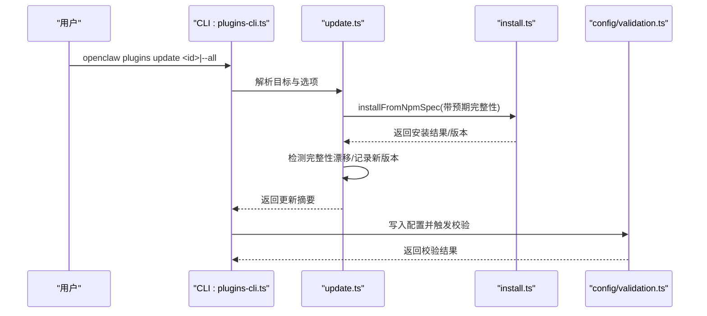
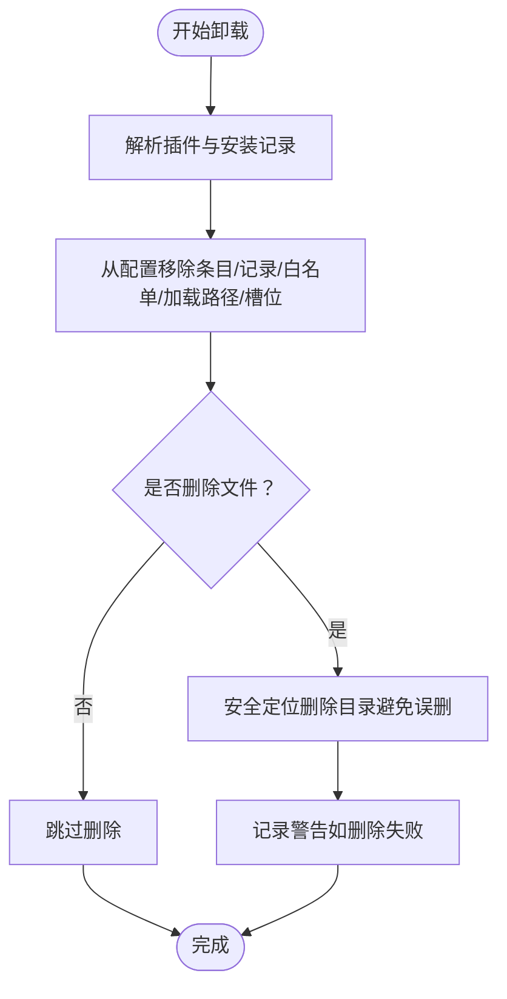
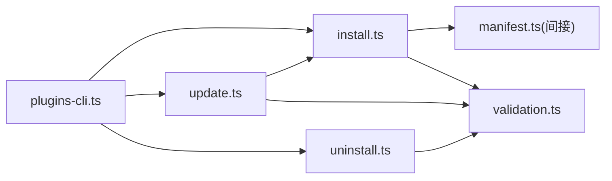

# 插件安装和管理

## 目录
1. [简介](#简介)
2. [项目结构](#项目结构)
3. [核心组件](#核心组件)
4. [架构总览](#架构总览)
5. [详细组件分析](#详细组件分析)
6. [依赖关系分析](#依赖关系分析)
7. [性能考虑](#性能考虑)
8. [故障排除指南](#故障排除指南)
9. [结论](#结论)
10. [附录](#附录)

## 简介
本操作文档面向 OpenClaw 插件的安装与管理，覆盖本地安装、远程安装（npm）、自动安装（链接开发目录）、配置管理（清单与模式校验）、版本与更新机制（npm 安装追踪与完整性漂移检测）、卸载与清理、CLI 命令参考与图形界面操作提示，以及常见问题排查。

## 项目结构
OpenClaw 的插件系统由“清单与模式校验”“安装/更新/卸载流程”“CLI 命令”“配置验证”等模块组成。文档侧提供了官方插件清单规范与 CLI 参考；脚本侧提供了安装器与更新流程；源码侧实现了插件安装、更新、卸载与配置校验逻辑。

图表来源
- [docs/cli/plugins.md](file://docs/cli/plugins.md#L1-L103)
- [docs/plugins/manifest.md](file://docs/plugins/manifest.md#L1-L76)
- [docs/tools/plugin.md](file://docs/tools/plugin.md#L1-L800)
- [docs/install/installer.md](file://docs/install/installer.md#L1-L406)
- [docs/install/updating.md](file://docs/install/updating.md#L1-L258)
- [docs/install/uninstall.md](file://docs/install/uninstall.md#L1-L129)
- [docs/cli/uninstall.md](file://docs/cli/uninstall.md#L1-L21)
- [scripts/install.sh](file://scripts/install.sh#L1-L800)
- [scripts/install.ps1](file://scripts/install.ps1#L1-L330)
- [src/cli/plugins-cli.ts](file://src/cli/plugins-cli.ts#L1-L747)
- [src/plugins/install.ts](file://src/plugins/install.ts#L1-L573)
- [src/plugins/update.ts](file://src/plugins/update.ts#L1-L501)
- [src/plugins/uninstall.ts](file://src/plugins/uninstall.ts#L1-L238)
- [src/config/validation.ts](file://src/config/validation.ts#L504-L604)

章节来源
- [docs/cli/plugins.md](file://docs/cli/plugins.md#L1-L103)
- [docs/plugins/manifest.md](file://docs/plugins/manifest.md#L1-L76)
- [docs/tools/plugin.md](file://docs/tools/plugin.md#L1-L800)
- [docs/install/installer.md](file://docs/install/installer.md#L1-L406)
- [docs/install/updating.md](file://docs/install/updating.md#L1-L258)
- [docs/install/uninstall.md](file://docs/install/uninstall.md#L1-L129)
- [docs/cli/uninstall.md](file://docs/cli/uninstall.md#L1-L21)
- [scripts/install.sh](file://scripts/install.sh#L1-L800)
- [scripts/install.ps1](file://scripts/install.ps1#L1-L330)
- [src/cli/plugins-cli.ts](file://src/cli/plugins-cli.ts#L1-L747)
- [src/plugins/install.ts](file://src/plugins/install.ts#L1-L573)
- [src/plugins/update.ts](file://src/plugins/update.ts#L1-L501)
- [src/plugins/uninstall.ts](file://src/plugins/uninstall.ts#L1-L238)
- [src/config/validation.ts](file://src/config/validation.ts#L504-L604)

## 核心组件
- 插件清单与模式校验：每个插件必须提供 openclaw.plugin.json，内含 id 与 configSchema，用于在不执行代码的前提下进行配置校验。
- 安装器与安装流程：支持 npm 安装、本地路径安装、归档包安装、链接开发目录安装；对 npm 安装支持固定版本与完整性校验。
- 更新机制：仅对 npm 安装的插件生效，支持完整性漂移检测与交互确认或非交互跳过。
- 卸载与清理：从配置中移除条目、安装记录、白名单、加载路径与内存槽位选择，并可选择删除已安装目录。
- 配置验证：严格校验 plugins.entries、plugins.allow、plugins.deny、plugins.slots 中的插件 id 是否存在且有效。
- CLI 命令：plugins list/info/install/update/enable/disable/uninstall/doctor；uninstall CLI 用于卸载网关服务与本地数据。

章节来源
- [docs/plugins/manifest.md](file://docs/plugins/manifest.md#L1-L76)
- [src/plugins/install.ts](file://src/plugins/install.ts#L1-L573)
- [src/plugins/update.ts](file://src/plugins/update.ts#L1-L501)
- [src/plugins/uninstall.ts](file://src/plugins/uninstall.ts#L1-L238)
- [src/config/validation.ts](file://src/config/validation.ts#L504-L604)
- [docs/cli/plugins.md](file://docs/cli/plugins.md#L1-L103)
- [docs/cli/uninstall.md](file://docs/cli/uninstall.md#L1-L21)

## 架构总览
下图展示插件安装、更新、卸载与配置校验的整体流程及组件交互。

图表来源
- [src/cli/plugins-cli.ts](file://src/cli/plugins-cli.ts#L364-L747)
- [src/plugins/install.ts](file://src/plugins/install.ts#L487-L573)
- [src/plugins/update.ts](file://src/plugins/update.ts#L197-L394)
- [src/plugins/uninstall.ts](file://src/plugins/uninstall.ts#L177-L238)
- [src/config/validation.ts](file://src/config/validation.ts#L504-L604)

## 详细组件分析

### 安装流程（本地/远程/自动）
- 支持的安装方式
  - 本地路径：文件、目录、归档包（.zip/.tgz/.tar/.tar.gz）。
  - npm 包：仅支持注册表包名与精确版本或 dist-tag，拒绝 semver 范围与 URL/Git 规范。
  - 开发链接：使用 --link 将本地目录加入 plugins.load.paths，避免复制。
  - 固定版本：--pin 将解析后的 name@version 记录到 plugins.installs，便于后续更新与完整性校验。
- 安全与校验
  - npm 安装依赖以 --ignore-scripts 运行，避免生命周期脚本。
  - 安装前扫描插件源码可疑模式，报告警告但不阻止安装。
  - 必须包含 openclaw.plugin.json 与有效的 configSchema，否则安装失败。
- 安装器脚本
  - install.sh/install-cli.sh（macOS/Linux/WSL）：支持 npm/git 安装、自动安装构建工具、非交互模式。
  - install.ps1（Windows）：支持 npm/git 安装、自动设置执行策略、添加到 PATH。

图表来源
- [src/plugins/install.ts](file://src/plugins/install.ts#L205-L377)
- [src/plugins/install.ts](file://src/plugins/install.ts#L379-L431)
- [src/plugins/install.ts](file://src/plugins/install.ts#L487-L573)
- [docs/cli/plugins.md](file://docs/cli/plugins.md#L39-L78)
- [docs/install/installer.md](file://docs/install/installer.md#L67-L124)
- [scripts/install.sh](file://scripts/install.sh#L674-L800)
- [scripts/install.ps1](file://scripts/install.ps1#L202-L258)

章节来源
- [src/plugins/install.ts](file://src/plugins/install.ts#L1-L573)
- [docs/cli/plugins.md](file://docs/cli/plugins.md#L39-L78)
- [docs/install/installer.md](file://docs/install/installer.md#L67-L124)
- [scripts/install.sh](file://scripts/install.sh#L674-L800)
- [scripts/install.ps1](file://scripts/install.ps1#L202-L258)

### 配置管理（清单、模式校验、动态更新）
- 清单要求
  - 必须包含 id 与 configSchema；可选字段包括 kind、channels、providers、skills、name、description、uiHints、version。
  - JSON Schema 在配置读写时即时校验，而非运行时。
- 配置变更
  - 修改 plugins.entries.&lt;id&gt;.config 后需重启网关使变更生效。
  - 允许通过 uiHints 为 UI 提供标签、占位符与敏感标记。
- 验证行为
  - 未知插件 id 或通道键会报错。
  - 已禁用插件仍保留配置并在 doctor 中给出警告。
  - 严格校验 plugins.allow/deny/slots 中的插件 id。

图表来源
- [docs/plugins/manifest.md](file://docs/plugins/manifest.md#L18-L76)
- [src/config/validation.ts](file://src/config/validation.ts#L504-L604)
- [src/cli/plugins-cli.ts](file://src/cli/plugins-cli.ts#L550-L582)

章节来源
- [docs/plugins/manifest.md](file://docs/plugins/manifest.md#L1-L76)
- [src/config/validation.ts](file://src/config/validation.ts#L504-L604)
- [src/cli/plugins-cli.ts](file://src/cli/plugins-cli.ts#L550-L582)

### 版本管理与更新机制
- 更新范围
  - 仅对 npm 安装的插件生效，记录在 plugins.installs 中。
  - 支持 --all 全量更新与 --dry-run 预览。
- 完整性漂移检测
  - 若存储的完整性哈希与拉取产物哈希不一致，会发出警告并请求确认；可在 CI/非交互环境使用 --yes 跳过。
- 通道同步
  - 切换更新通道时，dev 通道会将 npm 安装切换为本地 bundled 源码路径；release 通道保持 npm 安装以防重复与打包漂移。
- 自动更新（核心功能）
  - 可配置自动检查与延迟/抖动策略，稳定通道等待后随机抖动，beta 通道按小时检查。

图表来源
- [src/cli/plugins-cli.ts](file://src/cli/plugins-cli.ts#L729-L747)
- [src/plugins/update.ts](file://src/plugins/update.ts#L197-L394)
- [src/plugins/install.ts](file://src/plugins/install.ts#L487-L539)
- [src/config/validation.ts](file://src/config/validation.ts#L504-L604)

章节来源
- [src/plugins/update.ts](file://src/plugins/update.ts#L1-L501)
- [src/plugins/install.ts](file://src/plugins/install.ts#L487-L539)
- [docs/install/updating.md](file://docs/install/updating.md#L74-L112)

### 卸载与清理
- 卸载范围
  - 从 plugins.entries、plugins.installs、插件白名单、plugins.load.paths、内存槽位中移除。
  - 对于活动内存插件，重置为 memory-core。
- 文件清理
  - 默认会删除安装目录（除非使用 --keep-files/--keep-config）。
  - 对于 source=path（链接）的插件不删除源目录。
- CLI 卸载
  - openclaw uninstall 支持 --all、--yes、--dry-run，适合自动化场景。

图表来源
- [src/plugins/uninstall.ts](file://src/plugins/uninstall.ts#L65-L164)
- [src/plugins/uninstall.ts](file://src/plugins/uninstall.ts#L177-L238)
- [docs/cli/plugins.md](file://docs/cli/plugins.md#L72-L88)
- [docs/cli/uninstall.md](file://docs/cli/uninstall.md#L9-L21)

章节来源
- [src/plugins/uninstall.ts](file://src/plugins/uninstall.ts#L1-L238)
- [docs/cli/plugins.md](file://docs/cli/plugins.md#L72-L88)
- [docs/cli/uninstall.md](file://docs/cli/uninstall.md#L1-L21)

### CLI 命令参考
- 插件管理
  - openclaw plugins list/info/enable/disable/uninstall/install/update/doctor
  - 支持 --json、--dry-run、--pin、--link 等选项
- 卸载网关与本地数据
  - openclaw uninstall 支持 --all、--yes、--dry-run
- 安装器
  - install.sh/install-cli.sh（macOS/Linux/WSL）：支持 npm/git 安装、自动安装构建工具、非交互标志
  - install.ps1（Windows）：支持 npm/git 安装、自动设置执行策略、添加到 PATH

章节来源
- [docs/cli/plugins.md](file://docs/cli/plugins.md#L19-L103)
- [docs/cli/uninstall.md](file://docs/cli/uninstall.md#L9-L21)
- [docs/install/installer.md](file://docs/install/installer.md#L126-L164)
- [scripts/install.sh](file://scripts/install.sh#L82-L90)
- [scripts/install.ps1](file://scripts/install.ps1#L56-L80)

### 图形界面操作说明
- 控制 UI 使用插件提供的 JSON Schema 与 uiHints 渲染表单，支持插件级标签、占位符与敏感字段标记。
- 更新与重启可通过 RPC 调用（例如 update.run），自动执行安全更新流程并重启网关。

章节来源
- [docs/tools/plugin.md](file://docs/tools/plugin.md#L427-L459)
- [docs/install/updating.md](file://docs/install/updating.md#L131-L140)

## 依赖关系分析
- 组件耦合
  - CLI 命令依赖安装、更新、卸载模块；安装/更新/卸载模块依赖清单与模式校验；配置校验贯穿所有变更。
- 外部依赖
  - npm 安装依赖包管理器与网络访问；Windows 安装依赖 winget/choco/scoop 与 Git。
- 循环依赖
  - 未发现直接循环依赖；各模块职责清晰，通过配置文件作为数据契约。

图表来源
- [src/cli/plugins-cli.ts](file://src/cli/plugins-cli.ts#L1-L23)
- [src/plugins/install.ts](file://src/plugins/install.ts#L1-L37)
- [src/plugins/update.ts](file://src/plugins/update.ts#L1-L14)
- [src/plugins/uninstall.ts](file://src/plugins/uninstall.ts#L1-L6)
- [src/config/validation.ts](file://src/config/validation.ts#L504-L604)

章节来源
- [src/cli/plugins-cli.ts](file://src/cli/plugins-cli.ts#L1-L23)
- [src/plugins/install.ts](file://src/plugins/install.ts#L1-L37)
- [src/plugins/update.ts](file://src/plugins/update.ts#L1-L14)
- [src/plugins/uninstall.ts](file://src/plugins/uninstall.ts#L1-L6)
- [src/config/validation.ts](file://src/config/validation.ts#L504-L604)

## 性能考虑
- 缓存与启动加速
  - 插件发现与清单元数据使用短期缓存减少启动时的扫描开销；可通过环境变量禁用或调整缓存窗口。
- 安装性能
  - npm 安装依赖使用 --ignore-scripts，避免耗时的 postinstall；归档包安装采用临时目录解压后一次性复制。
- 更新性能
  - --dry-run 可预览更新而不写入配置，降低风险与 IO。

章节来源
- [docs/tools/plugin.md](file://docs/tools/plugin.md#L219-L227)
- [src/plugins/install.ts](file://src/plugins/install.ts#L308-L363)
- [src/plugins/update.ts](file://src/plugins/update.ts#L263-L322)

## 故障排除指南
- 安装失败
  - npm 包不存在：检查包名与 dist-tag；确保网络可达。
  - 缺少 openclaw.extensions 或为空：在 package.json 中正确声明 openclaw.extensions。
  - 完整性漂移：遵循提示确认或在 CI 中使用 --yes；必要时降级或回滚。
- 配置校验失败
  - 未知插件 id：检查 plugins.allow/deny/slots 与 entries 中的 id 是否拼写正确或已被移除。
  - 插件禁用但仍有配置：在 doctor 中查看警告并清理冗余配置。
- 卸载异常
  - 删除目录失败：检查权限与磁盘空间；日志中会记录警告但不影响配置清理。
- 安装器问题
  - macOS/Linux：缺少构建工具时自动尝试安装；若失败，手动安装 build-essential/python3/make/cmake。
  - Windows：执行策略限制导致 npm.ps1 无法运行；设置执行策略或以管理员身份运行。

章节来源
- [src/plugins/install.ts](file://src/plugins/install.ts#L100-L129)
- [src/plugins/update.ts](file://src/plugins/update.ts#L171-L195)
- [src/config/validation.ts](file://src/config/validation.ts#L504-L604)
- [src/plugins/uninstall.ts](file://src/plugins/uninstall.ts#L212-L228)
- [scripts/install.sh](file://scripts/install.sh#L656-L672)
- [scripts/install.ps1](file://scripts/install.ps1#L56-L80)

## 结论
OpenClaw 的插件系统通过严格的清单与模式校验、安全的安装与更新流程、完善的卸载与清理机制，以及丰富的 CLI 与文档支持，为用户提供了可靠、可控、可审计的插件管理体验。建议在生产环境中优先使用 npm 安装并配合 --pin 与完整性校验，在自动化场景中使用非交互标志与 --dry-run 进行预演。

## 附录
- 安装器与更新文档
  - 安装器内部原理与标志参考：[docs/install/installer.md](file://docs/install/installer.md#L1-L406)
  - 更新与回滚策略参考：[docs/install/updating.md](file://docs/install/updating.md#L1-L258)
- 插件系统与清单
  - 插件系统概览与示例：[docs/tools/plugin.md](file://docs/tools/plugin.md#L1-L800)
  - 插件清单与 JSON Schema 要求：[docs/plugins/manifest.md](file://docs/plugins/manifest.md#L1-L76)
- CLI 参考
  - 插件命令参考：[docs/cli/plugins.md](file://docs/cli/plugins.md#L1-L103)
  - 卸载命令参考：[docs/cli/uninstall.md](file://docs/cli/uninstall.md#L1-L21)
- 脚本
  - macOS/Linux/WSL 安装器：[scripts/install.sh](file://scripts/install.sh#L1-L800)
  - Windows 安装器：[scripts/install.ps1](file://scripts/install.ps1#L1-L330)