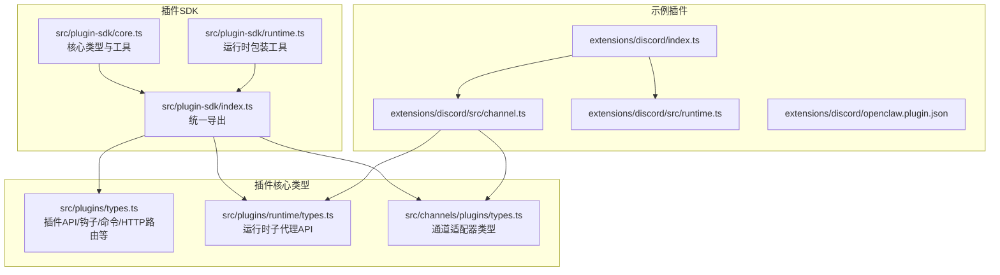
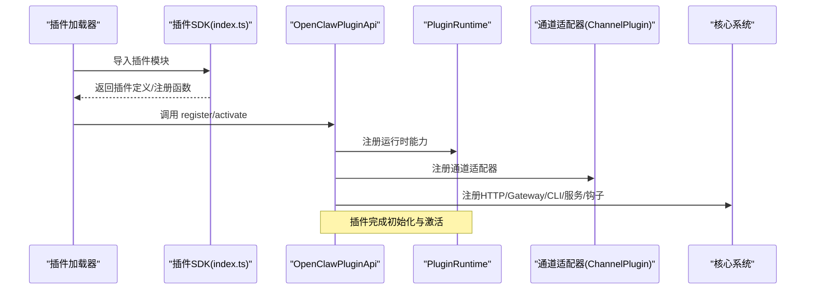
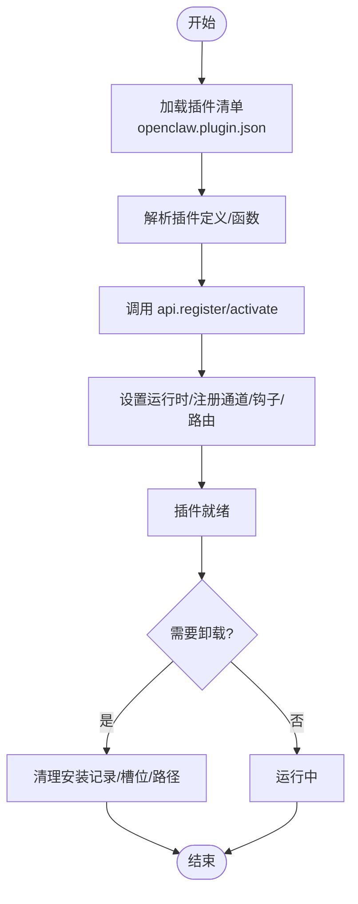
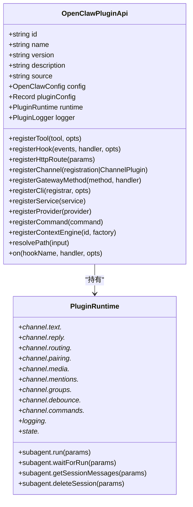
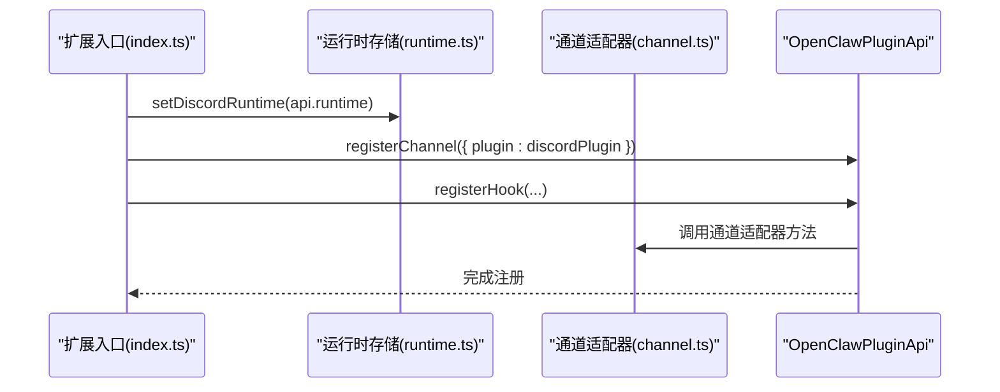
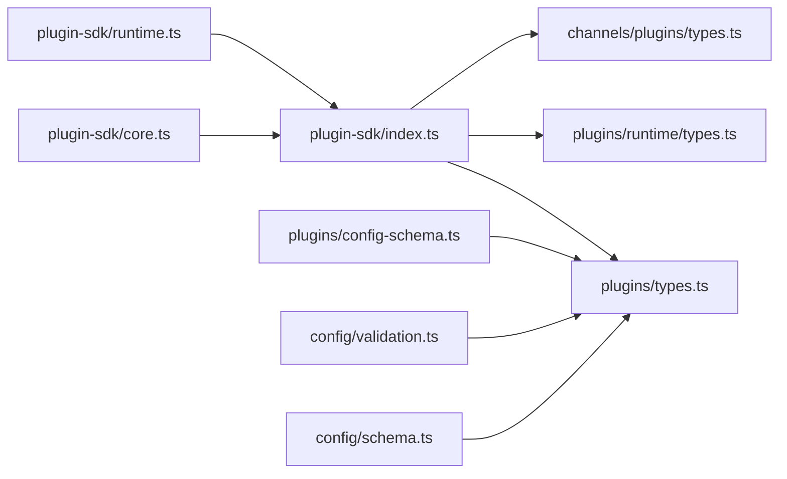

# 插件SDK API

## 目录
1. [简介](#简介)
2. [项目结构](#项目结构)
3. [核心组件](#核心组件)
4. [架构总览](#架构总览)
5. [详细组件分析](#详细组件分析)
6. [依赖关系分析](#依赖关系分析)
7. [性能考量](#性能考量)
8. [故障排查指南](#故障排查指南)
9. [结论](#结论)
10. [附录](#附录)

## 简介
本文件为 OpenClaw 插件SDK的完整API参考文档，覆盖Runtime API、工具API、配置API以及插件生命周期管理。内容基于仓库中的插件SDK导出入口、插件类型定义、运行时类型、通道适配器类型、以及具体插件实现（以Discord为例）进行整理与归纳，并辅以可视化图示帮助理解。

## 项目结构
插件SDK位于 src/plugin-sdk 目录，通过 src/plugin-sdk/index.ts 统一导出对外API；插件核心类型定义在 src/plugins/types.ts；通道适配器类型在 src/channels/plugins/types.ts；运行时类型在 src/plugins/runtime/types.ts；实际插件示例位于 extensions/* 下（以 Discord 插件为代表）。

**图表来源**
- [index.ts](file://src/plugin-sdk/index.ts#L1-L812)
- [core.ts](file://src/plugin-sdk/core.ts#L1-L37)
- [runtime.ts](file://src/plugin-sdk/runtime.ts#L1-L45)
- [types.ts](file://src/plugins/types.ts#L1-L893)
- [runtime/types.ts](file://src/plugins/runtime/types.ts#L1-L64)
- [types.ts](file://src/channels/plugins/types.ts#L1-L66)
- [index.ts](file://extensions/discord/index.ts#L1-L20)
- [channel.ts](file://extensions/discord/src/channel.ts#L1-L463)
- [runtime.ts](file://extensions/discord/src/runtime.ts#L1-L7)
- [openclaw.plugin.json](file://extensions/discord/openclaw.plugin.json#L1-L10)

**章节来源**
- [index.ts](file://src/plugin-sdk/index.ts#L1-L812)
- [plugin-sdk.md](file://docs/refactor/plugin-sdk.md#L1-L215)

## 核心组件
- 插件API（OpenClawPluginApi）
  - 提供注册工具、钩子、HTTP路由、通道、网关方法、CLI、服务、提供商、自定义命令、上下文引擎等能力。
  - 包含运行时访问入口 runtime，以及日志、配置、路径解析等辅助能力。
- 运行时（PluginRuntime）
  - 子代理运行能力：run、waitForRun、getSessionMessages、deleteSession。
  - 通道能力：文本分块、回复派发、路由、配对、媒体、提及、群组策略、防抖、命令授权等。
  - 日志与状态：日志开关、子目录解析。
- 通道适配器类型（ChannelPlugin 及其适配器）
  - 认证、命令、配置、目录、解析、提权、网关、群组、心跳、登出、消息发送、安全、设置、状态、流式传输、线程、工具发送等。
- 配置Schema（OpenClawPluginConfigSchema）
  - 支持 safeParse、parse、validate、uiHints、jsonSchema 等。
- 生命周期钩子（PluginHookName）
  - 涵盖模型解析、提示构建、代理开始、LLM输入输出、会话、消息收发、工具调用、子代理生命周期、网关启停等。

**章节来源**
- [types.ts](file://src/plugins/types.ts#L263-L306)
- [runtime/types.ts](file://src/plugins/runtime/types.ts#L51-L63)
- [types.ts](file://src/channels/plugins/types.ts#L7-L65)
- [config-schema.ts](file://src/plugins/config-schema.ts#L1-L34)
- [types.ts](file://src/plugins/types.ts#L321-L372)

## 架构总览
下图展示了插件SDK与核心系统、通道适配器、运行时的关系，以及插件在生命周期中如何被加载、激活并执行。

**图表来源**
- [index.ts](file://src/plugin-sdk/index.ts#L1-L812)
- [types.ts](file://src/plugins/types.ts#L248-L261)
- [types.ts](file://src/plugins/types.ts#L263-L306)

## 详细组件分析

### 插件API（OpenClawPluginApi）
- 能力概览
  - 工具注册：registerTool(tool, opts?)
  - 钩子注册：registerHook(events, handler, opts?)
  - HTTP路由注册：registerHttpRoute(params)
  - 通道注册：registerChannel(registration|ChannelPlugin)
  - 网关方法注册：registerGatewayMethod(method, handler)
  - CLI注册：registerCli(registrar, opts?)
  - 服务注册：registerService(service)
  - 提供商注册：registerProvider(provider)
  - 自定义命令注册：registerCommand(command)
  - 上下文引擎注册：registerContextEngine(id, factory)
  - 路径解析：resolvePath(input)
  - 生命周期钩子：on(hookName, handler, opts?)
- 关键上下文
  - id/name/version/description/source/config/pluginConfig/runtime/logger
- 典型用法
  - 在 register 中设置运行时、注册通道、注册钩子与HTTP路由。
  - 使用 runtime 访问通道能力与子代理运行能力。

**章节来源**
- [types.ts](file://src/plugins/types.ts#L263-L306)

### 运行时（PluginRuntime）
- 子代理运行
  - run(params)：启动子代理会话或运行
  - waitForRun(params)：等待运行结果
  - getSessionMessages(params)：获取会话消息
  - deleteSession(params)：删除会话
- 通道能力
  - 文本：chunkMarkdownText、resolveTextChunkLimit、hasControlCommand
  - 回复：dispatchReplyWithBufferedBlockDispatcher、可选Teams风格派发器
  - 路由：resolveAgentRoute
  - 配对：buildPairingReply、readAllowFromStore、upsertPairingRequest
  - 媒体：fetchRemoteMedia、saveMediaBuffer
  - 提及：buildMentionRegexes、matchesMentionPatterns
  - 群组：resolveGroupPolicy、resolveRequireMention
  - 防抖：createInboundDebouncer、resolveInboundDebounceMs
  - 命令：resolveCommandAuthorizedFromAuthorizers
- 日志与状态
  - shouldLogVerbose、getChildLogger
  - resolveStateDir

**章节来源**
- [runtime/types.ts](file://src/plugins/runtime/types.ts#L8-L63)
- [plugin-sdk.md](file://docs/refactor/plugin-sdk.md#L48-L145)

### 通道适配器类型（ChannelPlugin 及其适配器）
- 适配器集合
  - ChannelAuthAdapter、ChannelCommandAdapter、ChannelConfigAdapter、ChannelDirectoryAdapter、ChannelResolverAdapter、ChannelElevatedAdapter、ChannelGatewayAdapter、ChannelGroupAdapter、ChannelHeartbeatAdapter、ChannelLogoutAdapter、ChannelOutboundAdapter、ChannelPairingAdapter、ChannelSecurityAdapter、ChannelSetupAdapter、ChannelStatusAdapter、ChannelStreamingAdapter、ChannelThreadingAdapter、ChannelToolSend
- 核心实体
  - ChannelAccountSnapshot、ChannelAccountState、ChannelAgentTool、ChannelCapabilities、ChannelDirectoryEntry、ChannelGatewayContext、ChannelGroupContext、ChannelId、ChannelLogSink、ChannelMeta、ChannelOutboundContext、ChannelOutboundTargetMode、ChannelPollContext、ChannelPollResult、ChannelResolveKind、ChannelResolveResult、ChannelSecurityContext、ChannelSetupInput、ChannelStatusIssue、ChannelThreadingContext、ChannelThreadingToolContext、ChannelToolSend、BaseProbeResult、BaseTokenResolution
- 通道插件（ChannelPlugin）
  - 包含 meta、onboarding、pairing、capabilities、streaming、reload、configSchema、config、security、groups、mentions、threading、agentPrompt、messaging、directory、resolver、actions、setup、outbound、status、gateway 等字段。

**章节来源**
- [types.ts](file://src/channels/plugins/types.ts#L7-L65)

### 配置API（OpenClawPluginConfigSchema）
- 能力
  - safeParse(value)：返回 &#123;success, data?, error?&#125;
  - parse(value)：直接解析
  - validate(value)：返回 &#123;ok, value?, errors?&#125;
  - uiHints：字段UI提示
  - jsonSchema：JSON Schema
- 空Schema工厂
  - emptyPluginConfigSchema()：用于无配置插件，校验空对象或undefined。

**章节来源**
- [config-schema.ts](file://src/plugins/config-schema.ts#L1-L34)

### 生命周期钩子（PluginHookName）
- 钩子清单
  - before_model_resolve、before_prompt_build、before_agent_start、llm_input、llm_output、agent_end、before_compaction、after_compaction、before_reset、message_received、message_sending、message_sent、before_tool_call、after_tool_call、tool_result_persist、before_message_write、session_start、session_end、subagent_spawning、subagent_delivery_target、subagent_spawned、subagent_ended、gateway_start、gateway_stop
- 事件与结果类型
  - 各钩子对应事件与结果类型，如 before_prompt_build 的事件包含 prompt 与 messages，结果可修改系统提示与上下文。

**章节来源**
- [types.ts](file://src/plugins/types.ts#L321-L372)
- [types.ts](file://src/plugins/types.ts#L422-L442)

### 插件生命周期管理
- 初始化
  - 插件模块导出定义或函数，调用 api.register 或 api.activate 完成注册。
- 加载
  - 通过插件加载器读取 openclaw.plugin.json（如 Discord），解析 id、channels、configSchema 等元信息。
- 激活
  - 在 activate 阶段设置运行时、注册通道、钩子、HTTP路由等。
- 卸载
  - 通过卸载流程清理安装记录、内存槽位、加载路径等（参考插件卸载逻辑）。
- 错误处理
  - 配置校验失败时，收集 issues 与 warnings；运行时异常通过 runtime.error/log 输出。

**图表来源**
- [openclaw.plugin.json](file://extensions/discord/openclaw.plugin.json#L1-L10)
- [index.ts](file://extensions/discord/index.ts#L7-L17)
- [types.ts](file://src/plugins/types.ts#L248-L261)

**章节来源**
- [openclaw.plugin.json](file://extensions/discord/openclaw.plugin.json#L1-L10)
- [index.ts](file://extensions/discord/index.ts#L1-L20)
- [types.ts](file://src/plugins/types.ts#L248-L261)

### 代码级类图（SDK与运行时）

**图表来源**
- [types.ts](file://src/plugins/types.ts#L263-L306)
- [runtime/types.ts](file://src/plugins/runtime/types.ts#L51-L63)

### 示例：Discord 插件
- 插件入口
  - index.ts：导出插件定义，注册运行时、通道、子代理钩子。
- 通道适配器
  - channel.ts：实现 ChannelPlugin，包含 onboarding、pairing、capabilities、config、security、groups、mentions、threading、agentPrompt、messaging、directory、resolver、actions、setup、outbound、status、gateway 等。
- 运行时存储
  - runtime.ts：通过 createPluginRuntimeStore 创建全局运行时存储，set/get 方法管理运行时实例。

**图表来源**
- [index.ts](file://extensions/discord/index.ts#L1-L20)
- [runtime.ts](file://extensions/discord/src/runtime.ts#L1-L7)
- [channel.ts](file://extensions/discord/src/channel.ts#L74-L463)

**章节来源**
- [index.ts](file://extensions/discord/index.ts#L1-L20)
- [runtime.ts](file://extensions/discord/src/runtime.ts#L1-L7)
- [channel.ts](file://extensions/discord/src/channel.ts#L1-L463)

## 依赖关系分析
- SDK导出层
  - index.ts 统一导出类型、工具、通道适配器、运行时、配置Schema、HTTP/Webhook工具等。
- 插件核心
  - types.ts 定义 OpenClawPluginApi、PluginHookName、PluginRuntime 等核心类型。
- 通道适配器
  - chanel 插件类型在 types.ts 中定义，具体适配器在各通道目录中实现。
- 运行时
  - runtime.ts 提供运行时包装工具，兼容日志与退出行为。
- 配置Schema
  - config-schema.ts 提供空Schema工厂；validation.ts 与 schema.ts 负责配置合并与校验。

**图表来源**
- [index.ts](file://src/plugin-sdk/index.ts#L1-L812)
- [types.ts](file://src/plugins/types.ts#L1-L893)
- [runtime/types.ts](file://src/plugins/runtime/types.ts#L1-L64)
- [types.ts](file://src/channels/plugins/types.ts#L1-L66)
- [core.ts](file://src/plugin-sdk/core.ts#L1-L37)
- [runtime.ts](file://src/plugin-sdk/runtime.ts#L1-L45)
- [config-schema.ts](file://src/plugins/config-schema.ts#L1-L34)
- [validation.ts](file://src/config/validation.ts#L549-L604)
- [schema.ts](file://src/config/schema.ts#L298-L324)

**章节来源**
- [index.ts](file://src/plugin-sdk/index.ts#L1-L812)
- [types.ts](file://src/plugins/types.ts#L1-L893)
- [runtime/types.ts](file://src/plugins/runtime/types.ts#L1-L64)
- [types.ts](file://src/channels/plugins/types.ts#L1-L66)
- [core.ts](file://src/plugin-sdk/core.ts#L1-L37)
- [runtime.ts](file://src/plugin-sdk/runtime.ts#L1-L45)
- [config-schema.ts](file://src/plugins/config-schema.ts#L1-L34)
- [validation.ts](file://src/config/validation.ts#L549-L604)
- [schema.ts](file://src/config/schema.ts#L298-L324)

## 性能考量
- 运行时日志与退出
  - 通过 createLoggerBackedRuntime 将日志与退出行为桥接到插件日志器，避免阻塞与资源泄漏。
- 防抖与批处理
  - inboundDebouncer 可减少高频消息处理开销，适合通道消息聚合。
- 文本分块与媒体处理
  - 文本分块与媒体保存限制可避免超限请求与磁盘压力。
- 子代理运行
  - waitForRun 提供超时控制，避免长时间阻塞。

**章节来源**
- [runtime.ts](file://src/plugin-sdk/runtime.ts#L9-L44)
- [runtime/types.ts](file://src/plugins/runtime/types.ts#L10-L29)

## 故障排查指南
- 配置校验失败
  - 使用 validateJsonSchemaValue 对插件配置进行校验，收集 issues 与 warnings；允许值会在错误信息中提示。
- 插件禁用但存在配置
  - 当插件被禁用但仍提供配置时，会生成警告，提示配置未生效。
- 插件清单问题
  - openclaw.plugin.json 缺失或字段不合法会导致加载失败，需检查 id、channels、configSchema 等。
- 运行时未初始化
  - 通过 createPluginRuntimeStore 获取运行时前需确保已 setRuntime，否则抛出错误。

**章节来源**
- [config.plugin-validation.test.ts](file://src/config/config.plugin-validation.test.ts#L210-L249)
- [validation.ts](file://src/config/validation.ts#L565-L596)
- [openclaw.plugin.json](file://extensions/discord/openclaw.plugin.json#L1-L10)
- [runtime-store.ts](file://src/plugin-sdk/runtime-store.ts#L1-L26)

## 结论
OpenClaw 插件SDK通过清晰的API边界与稳定的运行时抽象，实现了通道适配器、工具、钩子、HTTP路由、CLI与服务的统一注册机制。配合严格的配置Schema与生命周期钩子，开发者可以快速构建稳定、可维护的插件。建议在开发中遵循以下原则：
- 使用 SDK 类型与工具，避免直接导入 src/**。
- 在 register/activate 中完成运行时与通道注册。
- 利用配置Schema与校验工具保证配置正确性。
- 通过钩子扩展提示构建、工具调用、消息处理等关键流程。

## 附录
- 插件开发步骤
  - 定义插件清单（openclaw.plugin.json）
  - 实现插件入口（index.ts），注册运行时与通道
  - 实现 ChannelPlugin，覆盖所需适配器
  - 注册钩子、HTTP路由、CLI与服务
  - 使用 runtime 访问通道能力与子代理运行能力
- 数据交换格式
  - 配置采用 JSON Schema，支持 uiHints 与校验
  - 通道消息与回复采用标准化 payload 结构（见通道适配器类型）