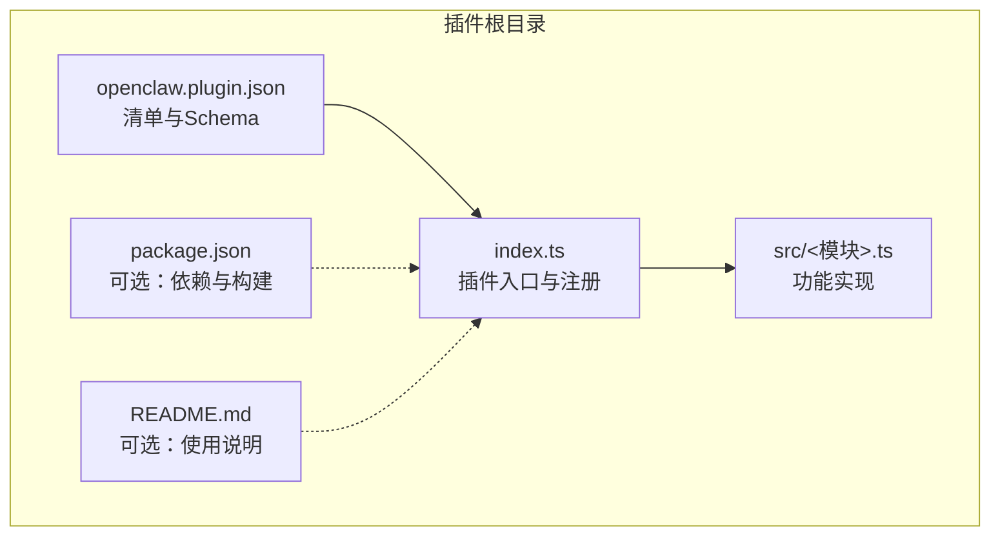
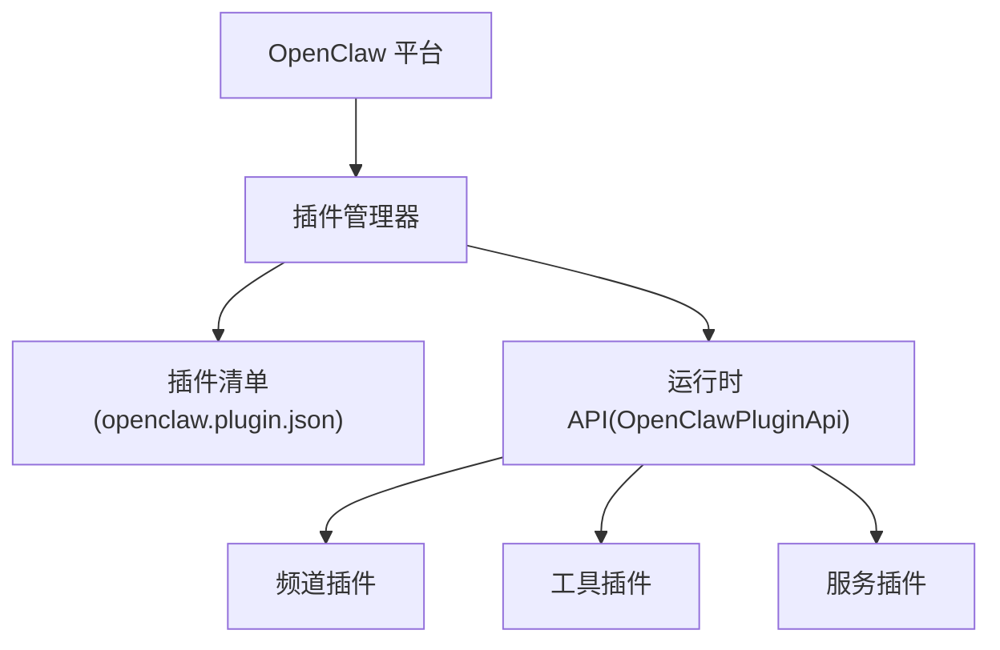
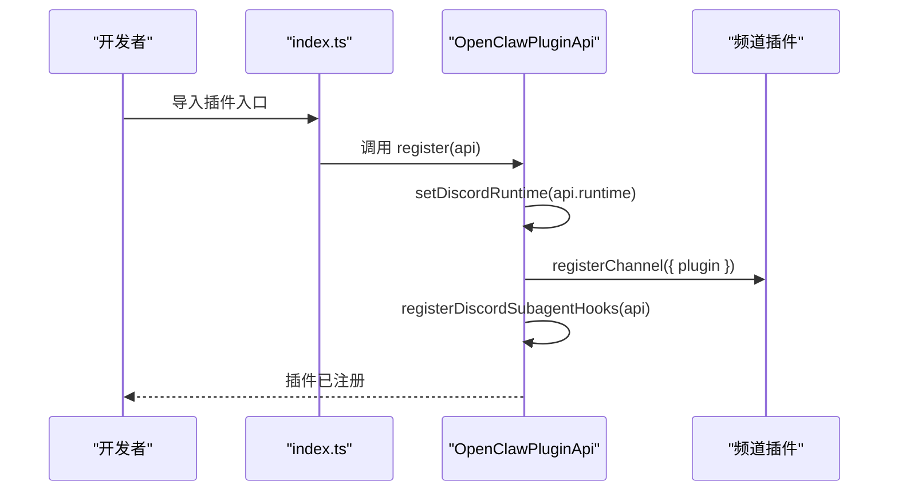
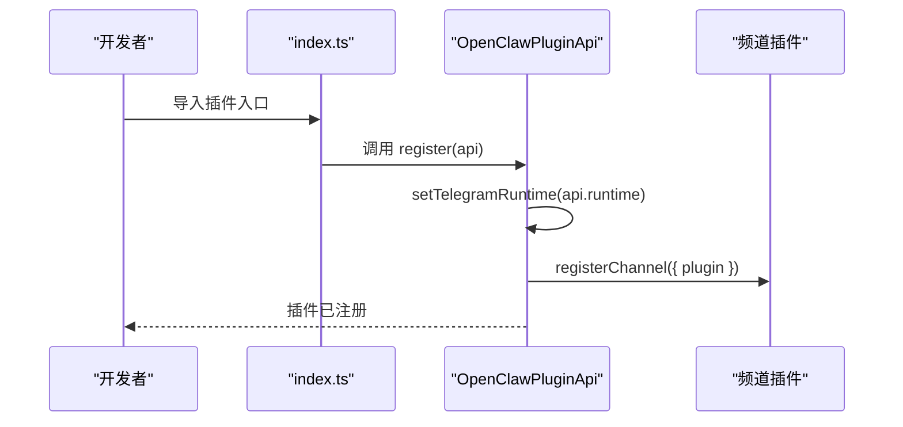
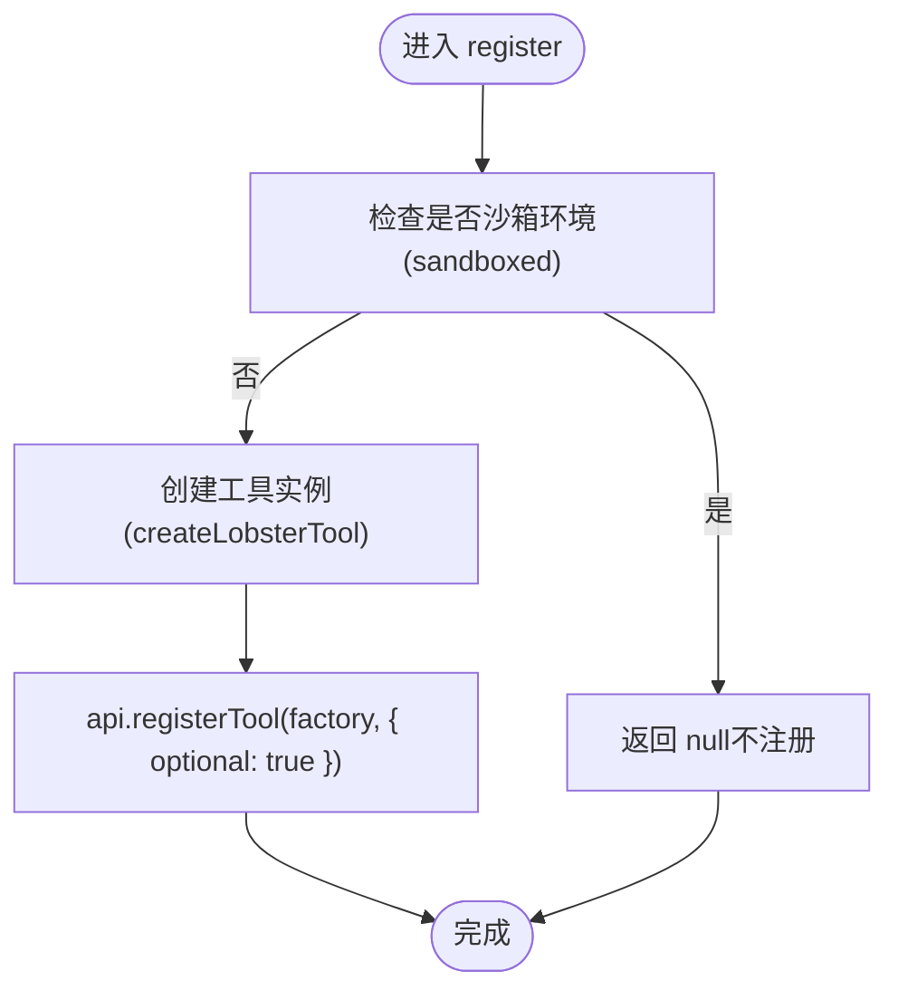
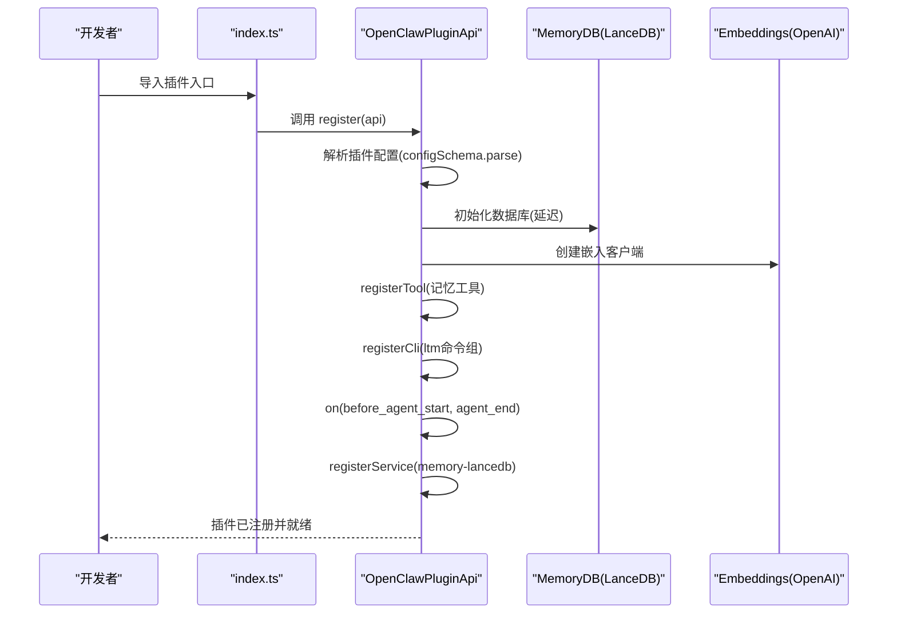
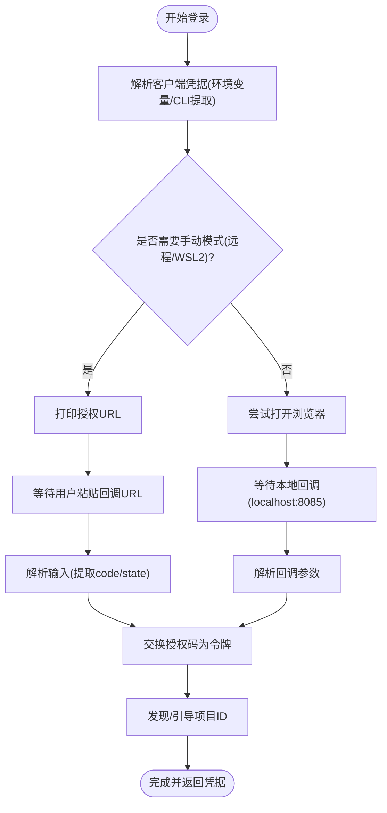
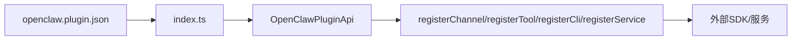

# 插件开发指南

## 目录
1. [简介](#简介)
2. [项目结构](#项目结构)
3. [核心组件](#核心组件)
4. [架构总览](#架构总览)
5. [详细组件分析](#详细组件分析)
6. [依赖关系分析](#依赖关系分析)
7. [性能考虑](#性能考虑)
8. [故障排查指南](#故障排查指南)
9. [结论](#结论)
10. [附录](#附录)

## 简介
本指南面向希望在 OpenClaw 平台上开发插件的开发者，覆盖从项目初始化、目录与配置结构、Manifest 编写规范，到注册与运行时集成、测试与发布全流程。文档同时提供多种类型插件（频道适配器、工具插件、认证插件）的实现参考，并总结最佳实践与常见问题。

## 项目结构
OpenClaw 的插件生态位于仓库根目录下的 extensions 子目录中，每个插件以独立子目录存在，包含：
- openclaw.plugin.json：插件清单与配置 Schema
- index.ts：插件入口与注册逻辑
- src/：插件功能实现（按职责拆分）
- package.json（部分插件）：依赖与构建元信息
- README.md（部分插件）：使用说明与特性介绍

下图展示典型插件目录结构与其关键文件：

图表来源
- [extensions/discord/index.ts](file://extensions/discord/index.ts#L1-L20)
- [extensions/discord/openclaw.plugin.json](file://extensions/discord/openclaw.plugin.json#L1-L10)

章节来源
- [README.md](file://README.md#L1-L560)

## 核心组件
- 插件清单（openclaw.plugin.json）
  - 必填字段：id、configSchema
  - 可选字段：kind、channels、providers、skills、name、description、uiHints、version
  - 清单用于严格校验配置，缺失或非法将阻断安装与运行
- 插件入口（index.ts）
  - 导出插件对象或函数，定义 id、name、description、configSchema
  - 在 register 回调中通过 api.registerChannel / api.registerTool / api.registerCli / api.registerService 完成注册
- 运行时 API
  - OpenClawPluginApi 提供注册接口、事件钩子、日志、路径解析、插件配置访问等能力

章节来源
- [docs/plugins/manifest.md](file://docs/plugins/manifest.md#L1-L76)
- [extensions/discord/index.ts](file://extensions/discord/index.ts#L1-L20)
- [extensions/telegram/index.ts](file://extensions/telegram/index.ts#L1-L18)
- [extensions/lobster/index.ts](file://extensions/lobster/index.ts#L1-L19)
- [extensions/memory-lancedb/index.ts](file://extensions/memory-lancedb/index.ts#L292-L679)

## 架构总览
OpenClaw 插件系统通过 Manifest 驱动的严格配置校验与运行时注册机制，将不同类型的插件（频道、工具、服务等）统一接入平台控制面。下图给出高层交互视图：

图表来源
- [docs/plugins/manifest.md](file://docs/plugins/manifest.md#L1-L76)
- [extensions/discord/index.ts](file://extensions/discord/index.ts#L12-L16)
- [extensions/memory-lancedb/index.ts](file://extensions/memory-lancedb/index.ts#L299-L675)

## 详细组件分析

### 组件A：频道适配器插件（Discord）
- 功能定位
  - 作为频道适配器，负责与 Discord 通道进行消息收发与事件处理
- Manifest 关键点
  - id：discord
  - channels：["discord"]
  - configSchema：空对象（无额外配置）
- 注册流程
  - 在 register 中设置运行时、注册频道插件、注册子代理钩子
- 典型行为
  - 通过 api.registerChannel 将频道插件接入平台
  - 通过 api.on(...) 注册生命周期钩子（如 before_agent_start）

图表来源
- [extensions/discord/index.ts](file://extensions/discord/index.ts#L12-L16)

章节来源
- [extensions/discord/openclaw.plugin.json](file://extensions/discord/openclaw.plugin.json#L1-L10)
- [extensions/discord/index.ts](file://extensions/discord/index.ts#L1-L20)

### 组件B：频道适配器插件（Telegram）
- 功能定位
  - 作为频道适配器，负责与 Telegram 通道进行消息收发与事件处理
- Manifest 关键点
  - id：telegram
  - channels：["telegram"]
  - configSchema：空对象（无额外配置）
- 注册流程
  - 在 register 中设置运行时、注册频道插件

图表来源
- [extensions/telegram/index.ts](file://extensions/telegram/index.ts#L11-L14)

章节来源
- [extensions/telegram/openclaw.plugin.json](file://extensions/telegram/openclaw.plugin.json#L1-L10)
- [extensions/telegram/index.ts](file://extensions/telegram/index.ts#L1-L18)

### 组件C：工具插件（Lobster）
- 功能定位
  - 提供一个“可恢复审批”的工作流工具，仅在非沙箱环境下可用
- Manifest 关键点
  - id：lobster
  - name、description：显示信息
  - configSchema：空对象（无额外配置）
- 注册流程
  - 在 register 中通过 api.registerTool 注册工具工厂
  - 工具工厂根据上下文（sandboxed）决定是否返回工具实例

图表来源
- [extensions/lobster/index.ts](file://extensions/lobster/index.ts#L8-L18)

章节来源
- [extensions/lobster/openclaw.plugin.json](file://extensions/lobster/openclaw.plugin.json#L1-L11)
- [extensions/lobster/index.ts](file://extensions/lobster/index.ts#L1-L19)

### 组件D：内存插件（Memory-LanceDB）
- 功能定位
  - 基于 LanceDB 的长期记忆存储与检索，支持自动捕获与召回
- Manifest 关键点
  - id：memory-lancedb
  - kind：memory（通过 plugins.slots.memory 选择）
  - uiHints：为配置字段提供标签、占位符、敏感标记与帮助文本
  - configSchema：定义 embedding（apiKey、model、baseUrl、dimensions）、dbPath、autoCapture、autoRecall、captureMaxChars 等
- 注册流程
  - 在 register 中：
    - 解析配置、初始化数据库与嵌入模型
    - 注册三个工具：memory_recall、memory_store、memory_forget
    - 注册 CLI 命令组 ltm
    - 注册生命周期钩子：before_agent_start（自动召回）、agent_end（自动捕获）
    - 注册服务 memory-lancedb（启动/停止日志）
- 关键实现要点
  - 数据库延迟初始化、表不存在时自动创建
  - 向量相似度搜索与去重策略
  - 捕获规则与提示注入防护
  - CLI 命令输出结构化结果

图表来源
- [extensions/memory-lancedb/index.ts](file://extensions/memory-lancedb/index.ts#L299-L675)

章节来源
- [extensions/memory-lancedb/openclaw.plugin.json](file://extensions/memory-lancedb/openclaw.plugin.json#L1-L89)
- [extensions/memory-lancedb/index.ts](file://extensions/memory-lancedb/index.ts#L1-L679)

### 组件E：认证插件（Google Gemini CLI OAuth）
- 功能定位
  - 为 Google Gemini CLI 提供 OAuth 登录流程，支持本地/远程环境自动切换
- 关键流程
  - 解析客户端凭据（环境变量或从已安装的 gemini CLI 提取）
  - 生成 PKCE 参数并构建授权 URL
  - 本地回调服务器等待授权码，或手动粘贴回调 URL
  - 交换授权码为访问令牌与刷新令牌，查询用户邮箱与项目 ID
  - 探测或引导项目（Tier/Project 发现与 Onboard）
- 错误处理
  - 端口占用回退至手动模式
  - VPC-SC 影响检测与降级处理
  - 超时与状态不匹配错误

图表来源
- [extensions/google-gemini-cli-auth/oauth.ts](file://extensions/google-gemini-cli-auth/oauth.ts#L659-L735)

章节来源
- [extensions/google-gemini-cli-auth/oauth.ts](file://extensions/google-gemini-cli-auth/oauth.ts#L1-L735)

## 依赖关系分析
- 插件与平台
  - 插件通过 Manifest 与运行时 API 与平台解耦；Manifest 决定可见性与校验规则
- 插件内部模块
  - 频道插件：依赖运行时设置与频道实现模块
  - 工具插件：依赖运行时工具注册接口与上下文判断
  - 认证插件：依赖网络请求与本地回调服务
- 外部依赖
  - 记忆插件依赖 LanceDB 与 OpenAI SDK；需注意平台绑定与加载失败处理

图表来源
- [extensions/discord/index.ts](file://extensions/discord/index.ts#L12-L16)
- [extensions/memory-lancedb/index.ts](file://extensions/memory-lancedb/index.ts#L300-L360)

章节来源
- [extensions/discord/index.ts](file://extensions/discord/index.ts#L1-L20)
- [extensions/telegram/index.ts](file://extensions/telegram/index.ts#L1-L18)
- [extensions/lobster/index.ts](file://extensions/lobster/index.ts#L1-L19)
- [extensions/memory-lancedb/index.ts](file://extensions/memory-lancedb/index.ts#L1-L679)

## 性能考虑
- 延迟初始化
  - 记忆插件对数据库连接采用延迟初始化，避免启动时阻塞
- 向量搜索优化
  - 使用向量相似度阈值过滤低质量召回，限制返回条数
- 捕获策略
  - 对消息长度、内容特征与提示注入风险进行过滤，减少无效写入
- I/O 与序列化
  - 结果集剥离向量字段以避免不可克隆类型带来的序列化开销

章节来源
- [extensions/memory-lancedb/index.ts](file://extensions/memory-lancedb/index.ts#L69-L101)
- [extensions/memory-lancedb/index.ts](file://extensions/memory-lancedb/index.ts#L116-L140)
- [extensions/memory-lancedb/index.ts](file://extensions/memory-lancedb/index.ts#L242-L269)
- [extensions/memory-lancedb/index.ts](file://extensions/memory-lancedb/index.ts#L344-L351)

## 故障排查指南
- Manifest 校验失败
  - 症状：安装或启用时报错，Doctor 报告插件错误
  - 排查：确认 openclaw.plugin.json 是否存在于插件根目录；确保 configSchema 有效且与实际配置一致
- 未知频道/提供商 ID
  - 症状：channels.* 或 providers.* 中出现未声明的 ID
  - 排查：在 Manifest 的 channels/providers 字段中显式声明
- 插件禁用但配置仍存在
  - 症状：插件被禁用，配置保留但 Doctor 报警告
  - 处理：移除或迁移配置，或重新启用插件
- 认证插件异常
  - 症状：端口占用、回调失败、状态不匹配
  - 处理：切换至手动模式；检查授权 URL 与回调参数；确认环境变量与 Gemini CLI 安装状态

章节来源
- [docs/plugins/manifest.md](file://docs/plugins/manifest.md#L53-L76)
- [extensions/google-gemini-cli-auth/oauth.ts](file://extensions/google-gemini-cli-auth/oauth.ts#L392-L396)
- [extensions/google-gemini-cli-auth/oauth.ts](file://extensions/google-gemini-cli-auth/oauth.ts#L681-L733)

## 结论
OpenClaw 插件体系以 Manifest 为核心，结合严格的配置校验与丰富的运行时 API，为开发者提供了清晰的扩展边界。通过遵循本文档的结构、清单与注册规范，并参考示例插件的实现模式，可以高效地开发出高质量的频道适配器、工具与认证类插件。

## 附录

### A. 插件清单编写规范速查
- 必填
  - id：插件唯一标识
  - configSchema：JSON Schema（即使为空也必须提供）
- 常用可选
  - kind：插件类型（如 memory、context-engine）
  - channels：声明注册的频道 ID 列表
  - providers：声明注册的提供商 ID 列表
  - skills：相对插件根目录的技能目录列表
  - name、description：显示名称与描述
  - uiHints：配置字段的标签、占位符、敏感标记与帮助文本
  - version：版本号（信息用途）

章节来源
- [docs/plugins/manifest.md](file://docs/plugins/manifest.md#L18-L46)

### B. 开发工作流（从零到上线）
- 初始化
  - 在 extensions 下新建子目录，创建 openclaw.plugin.json 与 index.ts
- 编写清单与 Schema
  - 明确 id、kind、channels/providers、skills 等字段
  - 实现 configSchema 并保证与实际配置一致
- 实现注册逻辑
  - 在 register 中完成频道/工具/CLI/服务注册
  - 如需外部依赖，提供构建与兼容说明
- 测试
  - 单元测试与集成测试（参考现有插件的测试文件）
  - Doctor 检查与配置校验
- 调试
  - 使用日志与 Doctor 输出定位问题
  - 针对认证插件，验证本地回调与手动模式
- 发布
  - 更新版本号与变更说明
  - 提交 PR 并通过 CI 校验

章节来源
- [extensions/discord/index.ts](file://extensions/discord/index.ts#L1-L20)
- [extensions/telegram/index.ts](file://extensions/telegram/index.ts#L1-L18)
- [extensions/lobster/index.ts](file://extensions/lobster/index.ts#L1-L19)
- [extensions/memory-lancedb/index.ts](file://extensions/memory-lancedb/index.ts#L1-L679)
- [extensions/google-gemini-cli-auth/oauth.ts](file://extensions/google-gemini-cli-auth/oauth.ts#L1-L735)