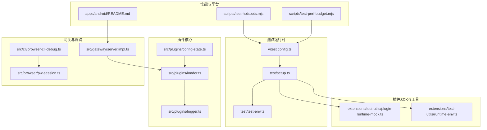
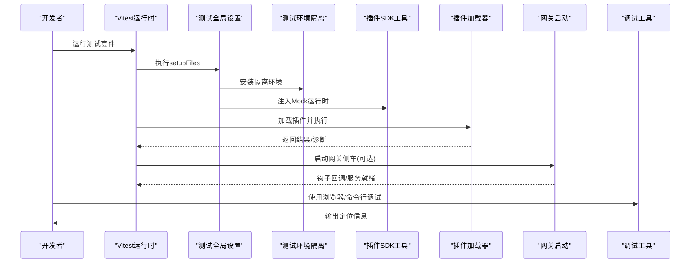
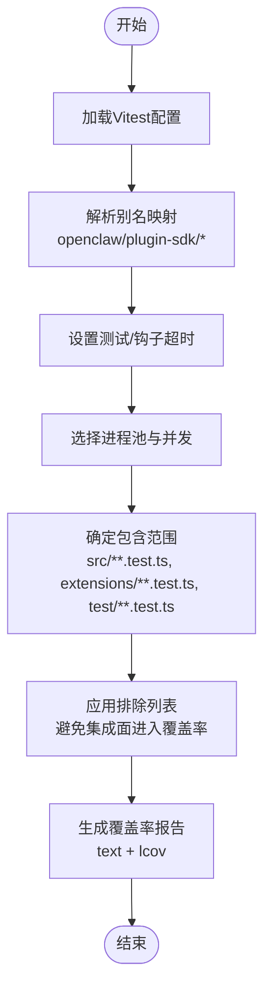
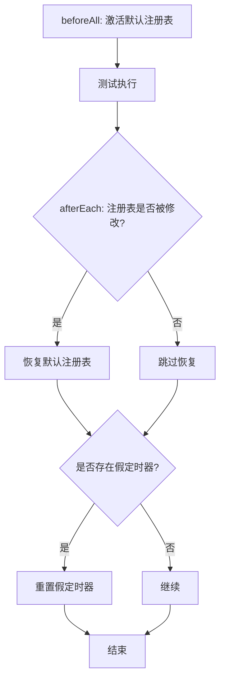
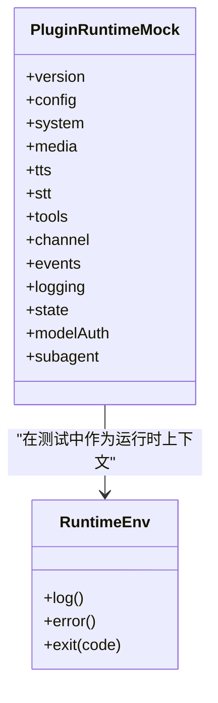
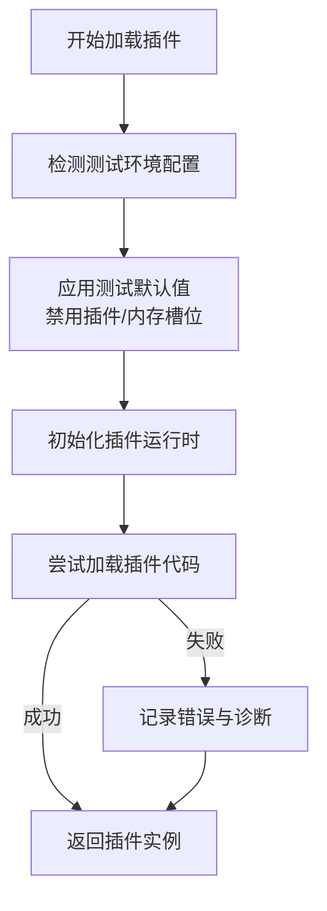
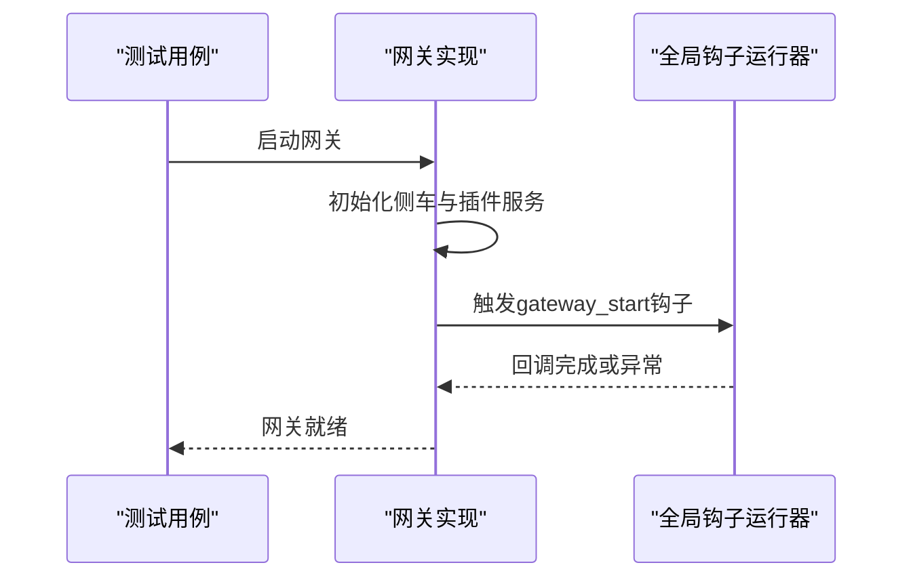
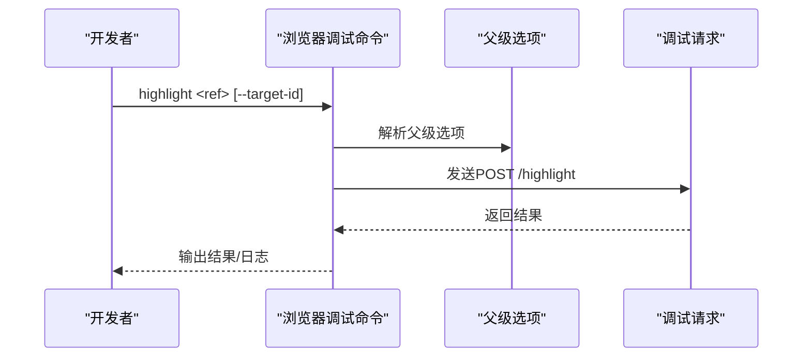
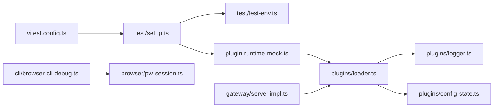

# 插件测试和调试

## 目录
1. [简介](#简介)
2. [项目结构](#项目结构)
3. [核心组件](#核心组件)
4. [架构总览](#架构总览)
5. [详细组件分析](#详细组件分析)
6. [依赖关系分析](#依赖关系分析)
7. [性能考量](#性能考量)
8. [故障排查指南](#故障排查指南)
9. [结论](#结论)
10. [附录](#附录)

## 简介
本指南面向OpenClaw插件开发者与维护者，系统化阐述插件测试与调试策略与实践，覆盖单元测试、集成测试、端到端测试与“真实环境”（Live）测试；解释日志记录、断点调试、性能分析与回归定位方法；提供测试环境搭建、测试数据与模拟对象准备、测试覆盖率分析与常见问题处理流程。文档同时给出发布前质量保证流程与检查清单，帮助团队在变更频繁的插件生态中保持稳定性与可维护性。

## 项目结构
OpenClaw采用多包工作区与分层模块组织，测试体系以Vitest为核心，结合扩展（extensions）与应用（apps）目录中的插件样例，形成从单体单元到端到端的完整测试金字塔。关键测试相关目录与文件如下：
- 测试运行时与配置：vitest.config.ts、test/setup.ts、test/test-env.ts
- 插件SDK与测试工具：extensions/test-utils 下的插件运行时Mock与运行环境封装
- 插件加载与诊断：src/plugins 下的加载器、日志桥接与配置默认值
- 网关侧启动与钩子：src/gateway/server.impl.ts
- 调试与浏览器控制：src/cli/browser-cli-debug.ts、src/browser/pw-session.ts
- 性能与热点分析：scripts/test-hotspots.mjs、scripts/test-perf-budget.mjs
- 平台特定测试：apps/android/README.md
- 常见问题与修复：docs/debug/node-issue.md

**图表来源**
- [vitest.config.ts](file://vitest.config.ts#L57-L203)
- [test/setup.ts](file://test/setup.ts#L1-L195)
- [test/test-env.ts](file://test/test-env.ts#L54-L148)
- [extensions/test-utils/plugin-runtime-mock.ts](file://extensions/test-utils/plugin-runtime-mock.ts#L35-L272)
- [extensions/test-utils/runtime-env.ts](file://extensions/test-utils/runtime-env.ts#L1-L12)
- [src/plugins/config-state.ts](file://src/plugins/config-state.ts#L137-L173)
- [src/plugins/logger.ts](file://src/plugins/logger.ts#L1-L17)
- [src/plugins/loader.ts](file://src/plugins/loader.ts#L256-L298)
- [src/gateway/server.impl.ts](file://src/gateway/server.impl.ts#L924-L947)
- [src/cli/browser-cli-debug.ts](file://src/cli/browser-cli-debug.ts#L53-L96)
- [src/browser/pw-session.ts](file://src/browser/pw-session.ts#L343-L713)
- [scripts/test-hotspots.mjs](file://scripts/test-hotspots.mjs#L54-L83)
- [scripts/test-perf-budget.mjs](file://scripts/test-perf-budget.mjs#L98-L127)
- [apps/android/README.md](file://apps/android/README.md#L70-L132)

**章节来源**
- [vitest.config.ts](file://vitest.config.ts#L57-L203)
- [test/setup.ts](file://test/setup.ts#L1-L195)
- [test/test-env.ts](file://test/test-env.ts#L54-L148)

## 核心组件
- 测试运行时与配置
  - Vitest全局配置：包含别名映射、超时、并发、覆盖率阈值与排除规则，确保测试稳定与覆盖率聚焦核心源码。
  - 全局设置：安装测试环境隔离、注册插件默认注册表、统一清理假定时器，避免跨文件污染。
  - 测试环境隔离：通过临时HOME与XDG目录、清理敏感环境变量，避免真实状态与密钥泄漏。
- 插件SDK测试工具
  - 运行时Mock：提供深度合并的插件运行时Mock，覆盖config、system、media、tts、stt、tools、channel、events、logging、state、modelAuth、subagent等子域，便于在单元测试中替换真实实现。
  - 运行环境封装：提供日志、错误输出与进程退出的Mock接口，便于断言插件内部行为。
- 插件加载与诊断
  - 配置默认值：在测试环境下自动禁用插件或设置内存槽位为“none”，避免真实资源占用。
  - 日志桥接：将底层日志转发至插件日志接口，统一输出风格。
  - 加载器错误记录：捕获插件初始化异常，生成诊断条目并写入注册表，便于定位失败插件与原因。

**章节来源**
- [vitest.config.ts](file://vitest.config.ts#L71-L203)
- [test/setup.ts](file://test/setup.ts#L182-L195)
- [test/test-env.ts](file://test/test-env.ts#L54-L148)
- [extensions/test-utils/plugin-runtime-mock.ts](file://extensions/test-utils/plugin-runtime-mock.ts#L35-L272)
- [extensions/test-utils/runtime-env.ts](file://extensions/test-utils/runtime-env.ts#L1-L12)
- [src/plugins/config-state.ts](file://src/plugins/config-state.ts#L137-L173)
- [src/plugins/logger.ts](file://src/plugins/logger.ts#L1-L17)
- [src/plugins/loader.ts](file://src/plugins/loader.ts#L256-L298)

## 架构总览
下图展示测试与调试在OpenClaw中的整体交互：测试运行时负责执行用例与覆盖率统计；测试环境隔离保障安全；插件SDK工具提供Mock能力；插件加载器与网关启动共同构成集成与端到端场景；调试工具链支持浏览器与命令行层面的定位。

**图表来源**
- [vitest.config.ts](file://vitest.config.ts#L81-L100)
- [test/setup.ts](file://test/setup.ts#L182-L195)
- [test/test-env.ts](file://test/test-env.ts#L54-L148)
- [extensions/test-utils/plugin-runtime-mock.ts](file://extensions/test-utils/plugin-runtime-mock.ts#L35-L272)
- [src/plugins/loader.ts](file://src/plugins/loader.ts#L256-L298)
- [src/gateway/server.impl.ts](file://src/gateway/server.impl.ts#L924-L947)
- [src/cli/browser-cli-debug.ts](file://src/cli/browser-cli-debug.ts#L53-L96)

## 详细组件分析

### 组件A：测试运行时与配置
- 覆盖率策略：仅统计src内实际被测试覆盖的文件，排除扩展、应用、测试自身与入口脚手架，确保阈值稳定且聚焦核心逻辑。
- 排除规则：大量集成面与交互面（如agents、channels、gateway、browser等）被排除，由端到端/手动验证替代，降低单元测试负担。
- 超时与并发：针对Windows与CI环境调整钩子超时与最大worker数；vmForks池提升并行效率。
- 包含范围：默认包含src、extensions与test下的测试文件，UI相关控制器与视图也纳入测试范围。

**图表来源**
- [vitest.config.ts](file://vitest.config.ts#L57-L203)

**章节来源**
- [vitest.config.ts](file://vitest.config.ts#L57-L203)

### 组件B：测试环境隔离与全局设置
- 全局设置：在beforeAll阶段激活默认插件注册表，在afterEach阶段恢复默认注册表并重置假定时器，避免跨文件污染。
- 环境隔离：临时HOME与XDG路径，清理敏感环境变量（如各平台令牌），Windows下强制使用默认状态目录，确保测试不触碰真实配置与状态。
- 测试夹具：提供通道插件桩、默认注册表与发送适配器，便于在单元测试中快速构造插件上下文。

**图表来源**
- [test/setup.ts](file://test/setup.ts#L182-L195)
- [test/test-env.ts](file://test/test-env.ts#L54-L148)

**章节来源**
- [test/setup.ts](file://test/setup.ts#L182-L195)
- [test/test-env.ts](file://test/test-env.ts#L54-L148)

### 组件C：插件SDK测试工具（Mock）
- Mock设计：通过深度合并策略允许部分覆盖，避免对大型对象树进行冗余定义；提供日志、错误、退出、命令执行、媒体处理、TTS/STT、工具注册、会话与路由、提及与反应、分组策略、防抖与命令授权等子域的Mock。
- 使用建议：在单元测试中优先注入Mock运行时，断言其调用次数与参数；对需要真实行为的场景，使用最小化覆盖策略逐步替换。

**图表来源**
- [extensions/test-utils/plugin-runtime-mock.ts](file://extensions/test-utils/plugin-runtime-mock.ts#L35-L272)
- [extensions/test-utils/runtime-env.ts](file://extensions/test-utils/runtime-env.ts#L1-L12)

**章节来源**
- [extensions/test-utils/plugin-runtime-mock.ts](file://extensions/test-utils/plugin-runtime-mock.ts#L35-L272)
- [extensions/test-utils/runtime-env.ts](file://extensions/test-utils/runtime-env.ts#L1-L12)

### 组件D：插件加载与诊断
- 配置默认值：在测试环境中自动禁用插件或设置内存槽位为“none”，避免真实资源占用与副作用。
- 日志桥接：将底层日志转发至插件日志接口，统一输出风格，便于在测试中断言。
- 加载器错误记录：捕获插件初始化异常，生成诊断条目并写入注册表，便于定位失败插件与原因。

**图表来源**
- [src/plugins/config-state.ts](file://src/plugins/config-state.ts#L137-L173)
- [src/plugins/logger.ts](file://src/plugins/logger.ts#L1-L17)
- [src/plugins/loader.ts](file://src/plugins/loader.ts#L256-L298)

**章节来源**
- [src/plugins/config-state.ts](file://src/plugins/config-state.ts#L137-L173)
- [src/plugins/logger.ts](file://src/plugins/logger.ts#L1-L17)
- [src/plugins/loader.ts](file://src/plugins/loader.ts#L256-L298)

### 组件E：网关启动与钩子（集成/端到端）
- 网关启动：在非最小测试模式下启动侧车服务与插件服务，并在启动后触发gateway_start钩子；异常会被捕获并记录警告，避免阻断测试。
- 集成要点：通过钩子机制验证插件生命周期事件；在端到端场景中，结合真实通道与会话行为进行验证。

**图表来源**
- [src/gateway/server.impl.ts](file://src/gateway/server.impl.ts#L924-L947)

**章节来源**
- [src/gateway/server.impl.ts](file://src/gateway/server.impl.ts#L924-L947)

### 组件F：调试工具链（浏览器与命令行）
- 浏览器调试命令：提供高亮元素、查询目标、过滤与配置等命令，通过调试请求与父级选项组合，实现对前端快照与元素的交互式调试。
- Playwright会话管理：封装连接、重试、缓存与断开监听，确保CDP连接稳定与资源释放。

**图表来源**
- [src/cli/browser-cli-debug.ts](file://src/cli/browser-cli-debug.ts#L53-L96)

**章节来源**
- [src/cli/browser-cli-debug.ts](file://src/cli/browser-cli-debug.ts#L53-L96)
- [src/browser/pw-session.ts](file://src/browser/pw-session.ts#L343-L713)

## 依赖关系分析
- 测试运行时依赖全局设置与环境隔离，确保测试稳定性与安全性。
- 插件SDK工具依赖Vitest的Mock能力，为插件提供可控的运行时上下文。
- 插件加载器依赖日志桥接与配置默认值，保证在测试中不会产生真实副作用。
- 网关启动依赖插件注册表与钩子运行器，形成集成与端到端验证闭环。
- 调试工具链依赖浏览器控制与Playwright会话，支撑前端与通道层调试。

**图表来源**
- [vitest.config.ts](file://vitest.config.ts#L57-L203)
- [test/setup.ts](file://test/setup.ts#L1-L195)
- [test/test-env.ts](file://test/test-env.ts#L54-L148)
- [extensions/test-utils/plugin-runtime-mock.ts](file://extensions/test-utils/plugin-runtime-mock.ts#L35-L272)
- [src/plugins/loader.ts](file://src/plugins/loader.ts#L256-L298)
- [src/plugins/logger.ts](file://src/plugins/logger.ts#L1-L17)
- [src/plugins/config-state.ts](file://src/plugins/config-state.ts#L137-L173)
- [src/gateway/server.impl.ts](file://src/gateway/server.impl.ts#L924-L947)
- [src/cli/browser-cli-debug.ts](file://src/cli/browser-cli-debug.ts#L53-L96)
- [src/browser/pw-session.ts](file://src/browser/pw-session.ts#L343-L713)

**章节来源**
- [vitest.config.ts](file://vitest.config.ts#L57-L203)
- [test/setup.ts](file://test/setup.ts#L1-L195)
- [test/test-env.ts](file://test/test-env.ts#L54-L148)
- [extensions/test-utils/plugin-runtime-mock.ts](file://extensions/test-utils/plugin-runtime-mock.ts#L35-L272)
- [src/plugins/loader.ts](file://src/plugins/loader.ts#L256-L298)
- [src/plugins/logger.ts](file://src/plugins/logger.ts#L1-L17)
- [src/plugins/config-state.ts](file://src/plugins/config-state.ts#L137-L173)
- [src/gateway/server.impl.ts](file://src/gateway/server.impl.ts#L924-L947)
- [src/cli/browser-cli-debug.ts](file://src/cli/browser-cli-debug.ts#L53-L96)
- [src/browser/pw-session.ts](file://src/browser/pw-session.ts#L343-L713)

## 性能考量
- 性能热点识别：通过test-hotspots脚本读取Vitest报告，按文件维度统计耗时并排序，快速定位最慢文件。
- 性能预算：通过test-perf-budget脚本设定最大墙钟时间或基于基线的回归阈值，防止测试总时长膨胀。
- 并发与池策略：根据平台与CI环境调整最大worker数与进程池类型，平衡吞吐与稳定性。
- 覆盖率聚焦：排除集成面与交互面，减少单元测试的外部依赖与不确定性，提高测试稳定性与可重复性。

**章节来源**
- [scripts/test-hotspots.mjs](file://scripts/test-hotspots.mjs#L54-L83)
- [scripts/test-perf-budget.mjs](file://scripts/test-perf-budget.mjs#L98-L127)
- [vitest.config.ts](file://vitest.config.ts#L71-L203)

## 故障排查指南
- Node + tsx “__name is not a function”崩溃
  - 症状：Node 25.x + tsx 导入时出现函数命名辅助缺失导致的TypeError。
  - 处理：回退到Bun或使用tsc watch + 编译产物运行；确认Node LTS版本兼容性；必要时禁用esbuild keepNames或升级tsx。
- 浏览器调试
  - 使用浏览器调试命令高亮元素、过滤与目标选择；结合Playwright会话管理，确保CDP连接稳定与断开清理。
- 网关启动异常
  - 关注gateway_start钩子的异常捕获与日志输出，避免阻断测试；检查插件注册表与侧车服务状态。
- 测试环境泄漏
  - 确保afterEach恢复默认注册表与假定时器；检查临时HOME与XDG路径清理；避免真实密钥进入测试环境。

**章节来源**
- [docs/debug/node-issue.md](file://docs/debug/node-issue.md#L1-L86)
- [src/cli/browser-cli-debug.ts](file://src/cli/browser-cli-debug.ts#L53-L96)
- [src/browser/pw-session.ts](file://src/browser/pw-session.ts#L343-L713)
- [src/gateway/server.impl.ts](file://src/gateway/server.impl.ts#L924-L947)
- [test/setup.ts](file://test/setup.ts#L182-L195)
- [test/test-env.ts](file://test/test-env.ts#L54-L148)

## 结论
通过完善的测试运行时配置、严格的环境隔离、丰富的插件SDK测试工具与稳健的调试链路，OpenClaw为插件开发提供了从单元到端到端的全栈测试保障。配合性能热点与预算工具，可在CI与本地高效定位问题并维持高质量交付节奏。建议在日常开发中遵循本文档的策略与流程，确保插件变更的稳定性与可维护性。

## 附录
- 测试策略与命令速查
  - 单元/集成：pnpm test
  - 端到端：pnpm test:e2e
  - 真实环境（Live）：pnpm test:live
  - 覆盖率门禁：pnpm test:coverage
  - Android节点能力扫描：pnpm android:test:integration
- 发布前质量保证流程与检查清单
  - 本地全量测试：构建、检查与测试三步走
  - 覆盖率门禁：确保核心src目录覆盖率达标
  - 端到端冒烟：关键网关与通道行为验证
  - Live回归：关键模型与工具调用验证
  - 性能预算：总时长与热点文件控制
  - 文档与脚本：文档链接检查与脚本可用性验证

**章节来源**
- [docs/help/testing.md](file://docs/help/testing.md#L21-L37)
- [apps/android/README.md](file://apps/android/README.md#L70-L132)