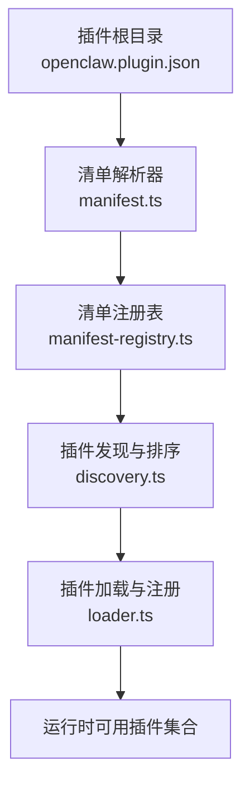
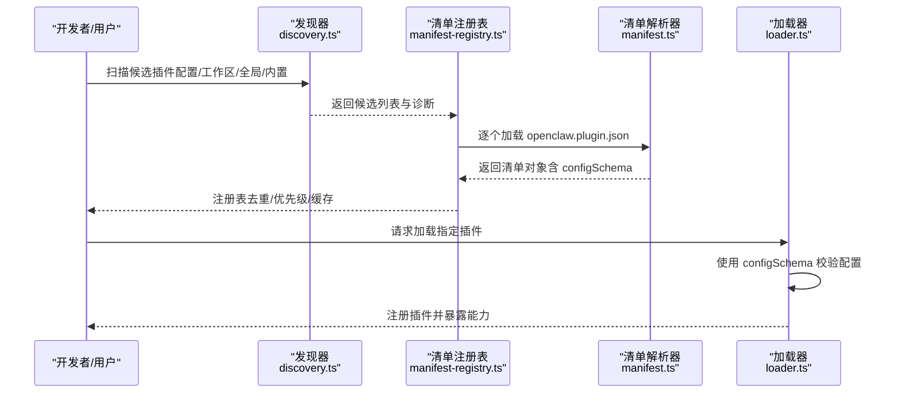
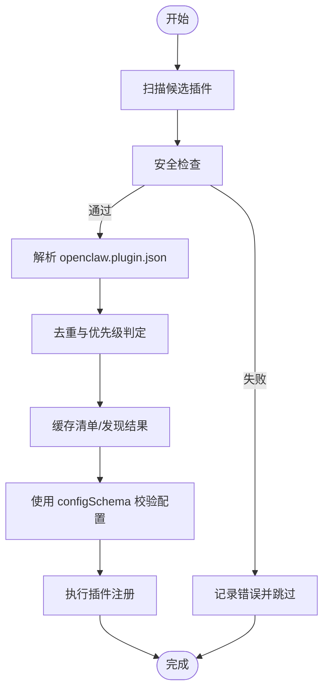
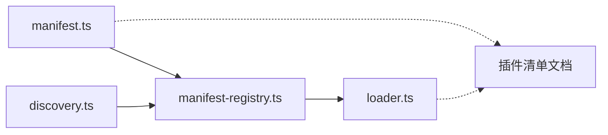

# 插件清单配置

## 目录
1. [简介](#简介)
2. [项目结构](#项目结构)
3. [核心组件](#核心组件)
4. [架构总览](#架构总览)
5. [详细组件分析](#详细组件分析)
6. [依赖关系分析](#依赖关系分析)
7. [性能考量](#性能考量)
8. [故障排查指南](#故障排查指南)
9. [结论](#结论)
10. [附录](#附录)

## 简介
本指南面向插件作者与运维人员，系统性讲解 OpenClaw 插件清单配置（openclaw.plugin.json）的完整规范与最佳实践。内容涵盖：
- 清单文件结构与字段定义（必需/可选）
- JSON Schema 编写方法与校验规则
- UI 提示配置（uiHints）
- 插件发现与注册流程（含优先级、安全检查、缓存）
- 各类插件（频道、工具、认证、内存等）的清单示例
- 插件 ID 规范、权限与依赖管理

## 项目结构
OpenClaw 将插件清单与插件源码分离：清单位于插件根目录的 openclaw.plugin.json，插件代码通常为 TypeScript/JavaScript 模块。系统通过清单完成“发现+配置校验”，再按需加载插件模块。

图表来源
- [src/plugins/manifest.ts](file://src/plugins/manifest.ts#L45-L119)
- [src/plugins/manifest-registry.ts](file://src/plugins/manifest-registry.ts#L135-L261)
- [src/plugins/discovery.ts](file://src/plugins/discovery.ts#L68-L84)
- [src/plugins/loader.ts](file://src/plugins/loader.ts#L769-L820)

章节来源
- [docs/tools/plugin.md](file://docs/tools/plugin.md#L228-L304)
- [src/plugins/manifest.ts](file://src/plugins/manifest.ts#L8-L22)

## 核心组件
- 清单模型与解析
  - 定义清单字段类型、默认值处理、边界路径安全读取
  - 关键点：必需字段 id、configSchema；可选字段 kind、channels、providers、skills、name、description、version、uiHints
- 清单注册表
  - 基于候选插件构建去重、优先级与缓存的注册表
  - 关键点：origin 排序（config > workspace > global > bundled）、重复 id 警告、schema 缓存键
- 发现与缓存
  - 支持多来源扫描（配置路径、工作区、全局、内置），并提供发现/清单缓存
- 加载与注册
  - 使用清单中的 configSchema 对插件配置进行严格校验，再执行插件注册逻辑

章节来源
- [src/plugins/manifest.ts](file://src/plugins/manifest.ts#L11-L22)
- [src/plugins/manifest-registry.ts](file://src/plugins/manifest-registry.ts#L15-L45)
- [src/plugins/discovery.ts](file://src/plugins/discovery.ts#L68-L84)
- [src/plugins/loader.ts](file://src/plugins/loader.ts#L769-L820)

## 架构总览
下图展示从发现到加载的关键流程与数据流：

图表来源
- [src/plugins/discovery.ts](file://src/plugins/discovery.ts#L68-L84)
- [src/plugins/manifest-registry.ts](file://src/plugins/manifest-registry.ts#L135-L261)
- [src/plugins/manifest.ts](file://src/plugins/manifest.ts#L45-L119)
- [src/plugins/loader.ts](file://src/plugins/loader.ts#L769-L820)

## 详细组件分析

### 清单字段定义与校验规则
- 必需字段
  - id：插件唯一标识，字符串，去空白后不能为空
  - configSchema：JSON Schema 对象，用于配置校验
- 可选字段
  - kind：插件类别（如 memory、context-engine）
  - channels：该插件注册的频道 id 列表
  - providers：该插件注册的模型提供商 id 列表
  - skills：相对插件根目录的技能目录数组
  - name/description/version：元信息
  - uiHints：UI 字段提示（标签、占位符、敏感标记、高级选项等）
- 校验行为
  - 未知 channels.&lt;id&gt; 或未知插件 id 引用均视为错误
  - 缺失或损坏清单/Schema 导致验证失败，Doctor 报错
  - 插件禁用但配置存在时保留配置并发出警告

章节来源
- [docs/plugins/manifest.md](file://docs/plugins/manifest.md#L18-L76)
- [src/plugins/manifest.ts](file://src/plugins/manifest.ts#L81-L119)
- [src/plugins/manifest-registry.ts](file://src/plugins/manifest-registry.ts#L170-L201)

### JSON Schema 编写方法
- 基本要求
  - 每个插件必须提供 JSON Schema，即使为空也必须显式声明
  - Schema 在配置读取/写入阶段验证，不进入运行时
- 结构建议
  - 使用 type: object + additionalProperties: false 控制键集合
  - 为复杂嵌套配置（如 provider 子对象）分别定义子 Schema
  - 使用 enum、pattern、minimum/maximum 等约束保证输入合法性
- 示例参考
  - 语音通话插件的完整 Schema 包含 provider、号码格式、超时参数、隧道与实时流等多层配置
  - 频道/认证/内存等插件的最小 Schema 仅包含基础对象结构

章节来源
- [docs/plugins/manifest.md](file://docs/plugins/manifest.md#L47-L56)
- [extensions/voice-call/openclaw.plugin.json](file://extensions/voice-call/openclaw.plugin.json#L162-L599)

### UI 提示配置（uiHints）
- 作用
  - 为控制界面渲染提供字段标签、占位符、帮助文本、敏感标记与高级选项标记
  - OpenClaw 会在运行时合并插件提供的 uiHints
- 建议
  - 对密钥类字段设置 sensitive: true
  - 对复杂配置使用 advanced: true 隐藏在高级面板
  - 为关键字段提供简短 help 文案

章节来源
- [docs/tools/plugin.md](file://docs/tools/plugin.md#L427-L459)
- [extensions/voice-call/openclaw.plugin.json](file://extensions/voice-call/openclaw.plugin.json#L3-L161)

### 插件发现与注册流程
- 发现阶段
  - 顺序扫描：配置路径 > 工作区扩展 > 全局扩展 > 内置扩展
  - 安全检查：拒绝硬链接、越界路径、世界可写目录、可疑所有权
- 注册阶段
  - 去重与优先级：相同 id 时按 origin 优先级选择第一个
  - 缓存：清单与发现结果支持短期缓存，提升启动性能
- 加载阶段
  - 使用 configSchema 校验配置，再调用插件注册函数
  - 记录诊断信息（错误/警告）

图表来源
- [src/plugins/discovery.ts](file://src/plugins/discovery.ts#L68-L84)
- [src/plugins/manifest-registry.ts](file://src/plugins/manifest-registry.ts#L170-L251)
- [src/plugins/loader.ts](file://src/plugins/loader.ts#L769-L820)

章节来源
- [docs/tools/plugin.md](file://docs/tools/plugin.md#L228-L304)
- [src/plugins/manifest-registry.ts](file://src/plugins/manifest-registry.ts#L15-L45)

### 插件 ID 规范与权限声明
- 默认 ID 来源
  - 包装包：使用 package.json 的 name
  - 单文件：使用文件名（不含扩展名）
  - 若导出 id，则以导出为准，但需与配置 id 一致
- 权限与依赖
  - 插件在运行时被视为可信代码，按需访问核心运行时辅助能力
  - 依赖原生模块时，需在文档中明确构建步骤与包管理器白名单要求

章节来源
- [docs/tools/plugin.md](file://docs/tools/plugin.md#L347-L356)
- [docs/tools/plugin.md](file://docs/tools/plugin.md#L78-L79)

### 插件槽位与排他性
- 支持的排他槽位
  - memory：选择当前内存插件（none 表示禁用）
  - contextEngine：选择上下文引擎插件（默认 legacy）
- 多个插件声明相同 kind 时，仅被选中的插件生效

章节来源
- [docs/tools/plugin.md](file://docs/tools/plugin.md#L393-L416)

### 各类插件清单示例

#### 频道插件（Telegram/Discord/Matrix/Feishu）
- 特征：声明 channels 数组，指向该插件注册的频道 id
- 示例字段
  - id、channels、configSchema（通常为空对象 Schema）

章节来源
- [extensions/telegram/openclaw.plugin.json](file://extensions/telegram/openclaw.plugin.json#L1-L10)
- [extensions/discord/openclaw.plugin.json](file://extensions/discord/openclaw.plugin.json#L1-L10)
- [extensions/matrix/openclaw.plugin.json](file://extensions/matrix/openclaw.plugin.json#L1-L10)
- [extensions/feishu/openclaw.plugin.json](file://extensions/feishu/openclaw.plugin.json#L1-L11)

#### 认证插件（Google Gemini CLI）
- 特征：声明 providers 数组，注册模型提供商认证流程
- 示例字段
  - id、providers、configSchema

章节来源
- [extensions/google-gemini-cli-auth/openclaw.plugin.json](file://extensions/google-gemini-cli-auth/openclaw.plugin.json#L1-L10)

#### 工具/通用插件（Lobster）
- 特征：提供名称与描述，无频道/提供商声明
- 示例字段
  - id、name、description、configSchema

章节来源
- [extensions/lobster/openclaw.plugin.json](file://extensions/lobster/openclaw.plugin.json#L1-L11)

#### 内存插件（Memory Core）
- 特征：声明 kind: "memory"，作为内存插件槽位的实现
- 示例字段
  - id、kind、configSchema

章节来源
- [extensions/memory-core/openclaw.plugin.json](file://extensions/memory-core/openclaw.plugin.json#L1-L10)

#### 语音通话插件（Voice Call）
- 特征：完整 Schema，覆盖提供商、号码、隧道、实时流、TTS/STT、超时与并发等
- 示例字段
  - id、uiHints、configSchema（多层嵌套对象与枚举约束）

章节来源
- [extensions/voice-call/openclaw.plugin.json](file://extensions/voice-call/openclaw.plugin.json#L1-L601)

## 依赖关系分析
- 组件耦合
  - manifest.ts 为入口，负责清单解析与基本校验
  - manifest-registry.ts 依赖 discovery.ts 的候选集，构建注册表并处理重复与优先级
  - loader.ts 依赖注册表中的清单与 Schema，执行配置校验与插件注册
- 外部依赖
  - JSON Schema 由上层配置校验器使用（不在本仓库直接可见）
  - 运行时 API 由插件在注册阶段暴露（见插件文档）

图表来源
- [src/plugins/manifest.ts](file://src/plugins/manifest.ts#L45-L119)
- [src/plugins/manifest-registry.ts](file://src/plugins/manifest-registry.ts#L135-L261)
- [src/plugins/discovery.ts](file://src/plugins/discovery.ts#L68-L84)
- [src/plugins/loader.ts](file://src/plugins/loader.ts#L769-L820)

章节来源
- [src/plugins/manifest.ts](file://src/plugins/manifest.ts#L1-L199)
- [src/plugins/manifest-registry.ts](file://src/plugins/manifest-registry.ts#L1-L262)
- [src/plugins/discovery.ts](file://src/plugins/discovery.ts#L1-L84)
- [src/plugins/loader.ts](file://src/plugins/loader.ts#L769-L828)

## 性能考量
- 缓存策略
  - 发现缓存：通过环境变量控制 TTL，默认极短窗口，适合启动阶段合并多次扫描
  - 清单缓存：基于候选路径与工作区构建缓存键，避免重复解析
- 环境变量
  - OPENCLAW_PLUGIN_DISCOVERY_CACHE_MS：发现缓存 TTL
  - OPENCLAW_PLUGIN_MANIFEST_CACHE_MS：清单缓存 TTL
  - OPENCLAW_DISABLE_PLUGIN_DISCOVERY_CACHE / OPENCLAW_DISABLE_PLUGIN_MANIFEST_CACHE：禁用缓存
- 建议
  - 开发调试时可禁用缓存以便快速迭代
  - 生产环境保持默认缓存以降低启动抖动

章节来源
- [docs/tools/plugin.md](file://docs/tools/plugin.md#L219-L227)
- [src/plugins/discovery.ts](file://src/plugins/discovery.ts#L45-L66)
- [src/plugins/manifest-registry.ts](file://src/plugins/manifest-registry.ts#L56-L77)

## 故障排查指南
- 常见问题与定位
  - 清单缺失：manifest not found
  - 路径不安全：越界/硬链接/世界可写目录
  - Schema 缺失：缺少 configSchema
  - 未知插件 ID：plugins.entries/allow/deny/slots 中引用了未发现的 id
  - 重复 ID：同一 id 多个来源，后者可能被覆盖
- 诊断输出
  - 错误级别：manifest 解析失败、注册失败
  - 警告级别：id 不匹配、重复 id、未跟踪加载插件、禁用插件仍保留配置
- 建议操作
  - 使用 Doctor 命令查看诊断
  - 检查 plugins.entries.&lt;id&gt; 是否与清单 id 一致
  - 确认 channels.&lt;id&gt; 与插件清单声明一致
  - 如需禁用插件，保留配置并观察警告

章节来源
- [src/plugins/manifest.ts](file://src/plugins/manifest.ts#L56-L88)
- [src/plugins/manifest-registry.ts](file://src/plugins/manifest-registry.ts#L170-L201)
- [src/plugins/loader.ts](file://src/plugins/loader.ts#L775-L800)
- [docs/plugins/manifest.md](file://docs/plugins/manifest.md#L53-L63)

## 结论
OpenClaw 的插件体系以清单为核心，通过严格的 JSON Schema 实现“先发现、先校验”的安全模式。作者只需在 openclaw.plugin.json 中清晰定义字段与 UI 提示，即可获得稳定的配置体验与良好的运行时集成。遵循本文档的字段规范、Schema 设计与发现/注册流程，可显著降低集成成本与维护风险。

## 附录

### 字段速查表
- 必需
  - id：字符串，非空
  - configSchema：对象，JSON Schema
- 可选
  - kind：字符串（如 memory、context-engine）
  - channels：字符串数组（频道 id）
  - providers：字符串数组（提供商 id）
  - skills：字符串数组（技能目录）
  - name/description/version：字符串
  - uiHints：对象，字段级 UI 提示

章节来源
- [docs/plugins/manifest.md](file://docs/plugins/manifest.md#L18-L46)
- [src/plugins/manifest.ts](file://src/plugins/manifest.ts#L11-L22)