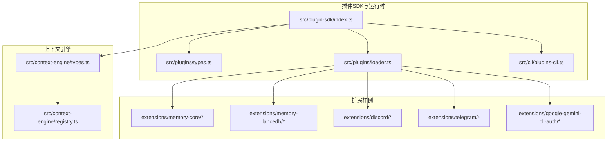
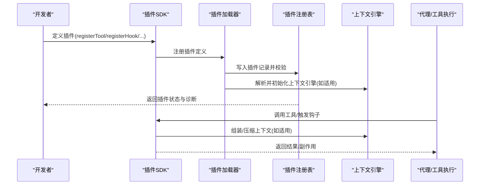
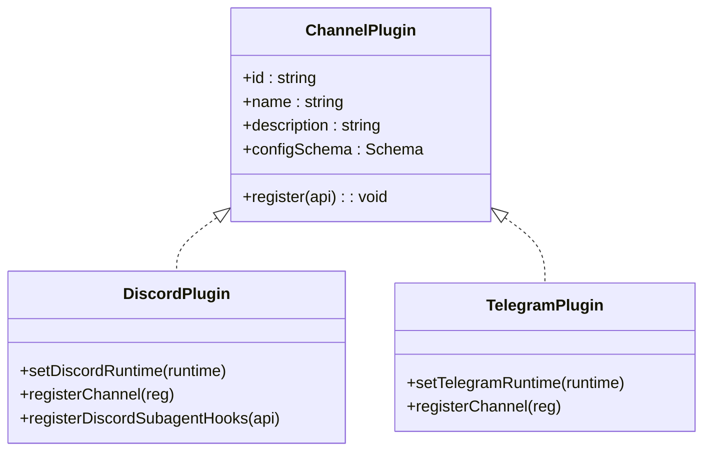
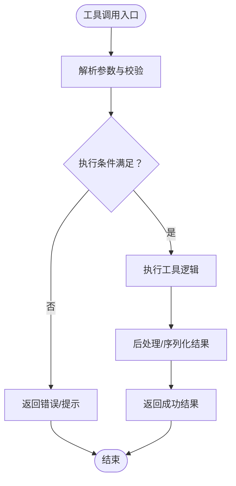
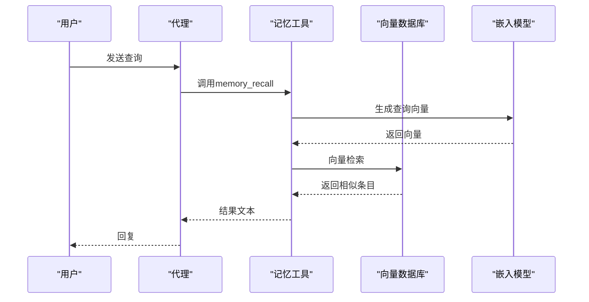
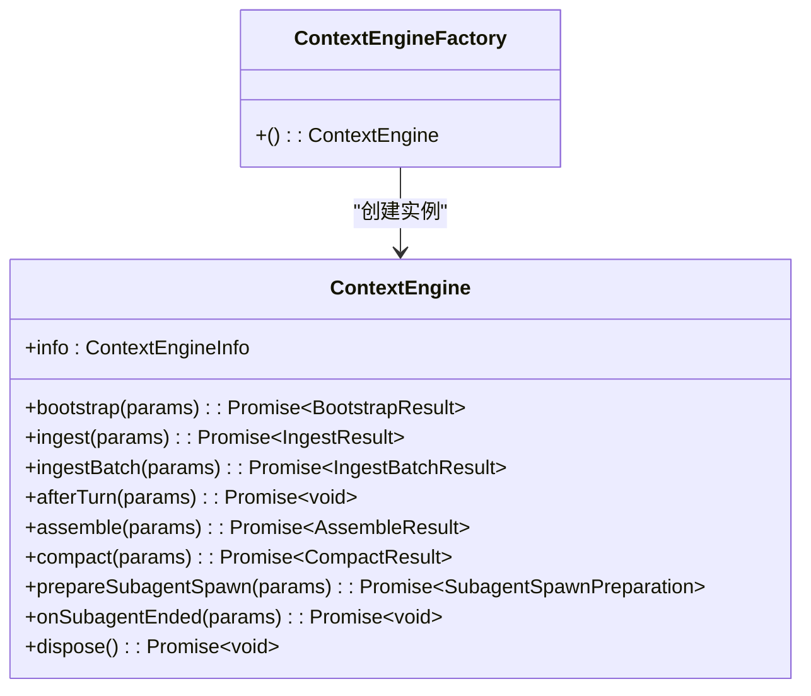
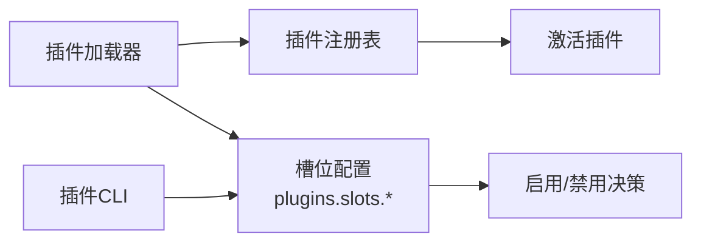

# 插件类型和示例

## 目录
1. [引言](#引言)
2. [项目结构](#项目结构)
3. [核心组件](#核心组件)
4. [架构总览](#架构总览)
5. [详细组件分析](#详细组件分析)
6. [依赖关系分析](#依赖关系分析)
7. [性能考量](#性能考量)
8. [故障排查指南](#故障排查指南)
9. [结论](#结论)
10. [附录](#附录)

## 引言
本文件面向OpenClaw插件开发者，系统化梳理插件类型与实现范式，覆盖以下主题：
- 插件类型：频道适配器插件、工具插件、认证插件、内存插件、上下文引擎插件等
- 每类插件的职责边界、典型用法与可选能力
- 渐进式实现示例：从“最小可用”到“生产级”
- 开发模式与最佳实践：代码组织、错误处理、性能优化、安全与可维护性
- 常见模式与设计原则：如何选择合适插件类型与实现方式

## 项目结构
OpenClaw采用“插件即扩展”的架构，插件通过统一的SDK注册与生命周期管理，按类型划分职责：
- 插件SDK与运行时：集中于src/plugin-sdk与src/plugins
- 上下文引擎：独立模块src/context-engine，支持可插拔的上下文管理
- 扩展样例：extensions目录下包含多种官方扩展，涵盖频道、内存、认证等类型

图示来源
- [src/plugin-sdk/index.ts](file://src/plugin-sdk/index.ts#L1-L130)
- [src/plugins/types.ts](file://src/plugins/types.ts#L1-L120)
- [src/context-engine/types.ts](file://src/context-engine/types.ts#L1-L60)
- [src/context-engine/registry.ts](file://src/context-engine/registry.ts#L35-L85)
- [src/plugins/loader.ts](file://src/plugins/loader.ts#L769-L820)
- [src/cli/plugins-cli.ts](file://src/cli/plugins-cli.ts#L122-L154)

章节来源
- [src/plugin-sdk/index.ts](file://src/plugin-sdk/index.ts#L1-L130)
- [src/plugins/types.ts](file://src/plugins/types.ts#L1-L120)

## 核心组件
- 插件API与类型
  - OpenClawPluginApi：插件注册入口，提供registerTool、registerHook、registerHttpRoute、registerChannel、registerGatewayMethod、registerCli、registerService、registerProvider、registerCommand、registerContextEngine等能力
  - PluginKind：当前支持"memory"与"context-engine"
  - 钩子体系：before_model_resolve、before_prompt_build、before_agent_start、llm_input、llm_output、agent_end、before_compaction、after_compaction、before_reset、message_received、message_sending、message_sent、before_tool_call、after_tool_call、tool_result_persist、before_message_write、session_start、session_end、subagent_spawning、subagent_delivery_target、subagent_spawned、subagent_ended、gateway_start、gateway_stop等
- 运行时与SDK
  - 插件SDK导出大量工具函数与类型，如通道配置、回复派发、媒体加载、SSRF防护、持久化去重、键控队列、Webhook目标解析等
  - 插件运行时（PluginRuntime）提供通道、日志、状态、命令授权、去抖、媒体下载与保存、提及匹配、分组策略、路由解析等能力

章节来源
- [src/plugins/types.ts](file://src/plugins/types.ts#L38-L306)
- [docs/zh-CN/refactor/plugin-sdk.md](file://docs/zh-CN/refactor/plugin-sdk.md#L52-L152)

## 架构总览
OpenClaw插件系统围绕“插件注册—配置—激活—运行时调用—生命周期钩子”展开，上下文引擎作为可插拔组件参与会话上下文组装与压缩。

图示来源
- [src/plugins/loader.ts](file://src/plugins/loader.ts#L769-L820)
- [src/context-engine/registry.ts](file://src/context-engine/registry.ts#L69-L85)
- [src/plugins/types.ts](file://src/plugins/types.ts#L263-L306)

## 详细组件分析

### 频道适配器插件（Channel Adapter）
- 职责
  - 将OpenClaw抽象的通道消息映射到具体平台（Discord、Telegram等）
  - 提供账户解析、消息发送、线程/群组策略、提及匹配、去抖、媒体处理等能力
- 典型实现
  - Discord频道插件：在register中设置运行时、注册频道插件、注册子代理相关钩子
  - Telegram频道插件：在register中设置运行时、注册频道插件
- 配置与清单
  - openclaw.plugin.json声明id、channels等元数据；空配置schema表示无需额外配置
- 示例路径
  - [extensions/discord/index.ts](file://extensions/discord/index.ts#L1-L20)
  - [extensions/telegram/index.ts](file://extensions/telegram/index.ts#L1-L18)
  - [extensions/discord/openclaw.plugin.json](file://extensions/discord/openclaw.plugin.json#L1-L10)
  - [extensions/telegram/openclaw.plugin.json](file://extensions/telegram/openclaw.plugin.json#L1-L10)

图示来源
- [extensions/discord/index.ts](file://extensions/discord/index.ts#L7-L17)
- [extensions/telegram/index.ts](file://extensions/telegram/index.ts#L6-L15)

章节来源
- [extensions/discord/index.ts](file://extensions/discord/index.ts#L1-L20)
- [extensions/telegram/index.ts](file://extensions/telegram/index.ts#L1-L18)
- [extensions/discord/openclaw.plugin.json](file://extensions/discord/openclaw.plugin.json#L1-L10)
- [extensions/telegram/openclaw.plugin.json](file://extensions/telegram/openclaw.plugin.json#L1-L10)

### 工具插件（Agent Tool）
- 职责
  - 向代理暴露可调用工具，支持参数校验、异步执行、结果格式化
- 典型实现
  - memory-core：注册memory_search与memory_get工具，使用runtime.tools提供的工厂方法
  - memory-lancedb：注册memory_recall、memory_store、memory_forget工具，结合向量检索与CLI命令
- 示例路径
  - [extensions/memory-core/index.ts](file://extensions/memory-core/index.ts#L1-L39)
  - [extensions/memory-lancedb/index.ts](file://extensions/memory-lancedb/index.ts#L314-L494)

图示来源
- [extensions/memory-lancedb/index.ts](file://extensions/memory-lancedb/index.ts#L324-L358)

章节来源
- [extensions/memory-core/index.ts](file://extensions/memory-core/index.ts#L10-L35)
- [extensions/memory-lancedb/index.ts](file://extensions/memory-lancedb/index.ts#L314-L494)

### 认证插件（Provider Auth）
- 职责
  - 为模型提供商或外部服务提供认证流程（OAuth、API Key、设备码等），生成凭据并可返回默认模型
- 典型实现
  - google-gemini-cli-auth：声明提供商id，空配置schema
- 示例路径
  - [extensions/google-gemini-cli-auth/openclaw.plugin.json](file://extensions/google-gemini-cli-auth/openclaw.plugin.json#L1-L10)

章节来源
- [extensions/google-gemini-cli-auth/openclaw.plugin.json](file://extensions/google-gemini-cli-auth/openclaw.plugin.json#L1-L10)

### 内存插件（Memory）
- 职责
  - 提供长期记忆能力：检索、存储、遗忘；可选自动捕获与自动回忆；支持CLI命令
- 典型实现
  - memory-core：基于文件的搜索与获取工具，CLI命令
  - memory-lancedb：基于LanceDB的向量检索、OpenAI嵌入、自动捕获/回忆、生命周期钩子、服务注册
- 配置与清单
  - memory-core：空schema
  - memory-lancedb：包含embedding、dbPath、autoCapture、autoRecall、captureMaxChars等字段
- 示例路径
  - [extensions/memory-core/openclaw.plugin.json](file://extensions/memory-core/openclaw.plugin.json#L1-L10)
  - [extensions/memory-lancedb/openclaw.plugin.json](file://extensions/memory-lancedb/openclaw.plugin.json#L1-L89)
  - [extensions/memory-core/index.ts](file://extensions/memory-core/index.ts#L1-L39)
  - [extensions/memory-lancedb/index.ts](file://extensions/memory-lancedb/index.ts#L292-L679)

图示来源
- [extensions/memory-lancedb/index.ts](file://extensions/memory-lancedb/index.ts#L314-L360)
- [extensions/memory-lancedb/index.ts](file://extensions/memory-lancedb/index.ts#L116-L140)

章节来源
- [extensions/memory-core/openclaw.plugin.json](file://extensions/memory-core/openclaw.plugin.json#L1-L10)
- [extensions/memory-lancedb/openclaw.plugin.json](file://extensions/memory-lancedb/openclaw.plugin.json#L1-L89)
- [extensions/memory-core/index.ts](file://extensions/memory-core/index.ts#L1-L39)
- [extensions/memory-lancedb/index.ts](file://extensions/memory-lancedb/index.ts#L292-L679)

### 上下文引擎插件（Context Engine）
- 职责
  - 管理会话上下文的引导、摄入、组装、压缩、子代理准备与清理
- 接口要点
  - 必需：bootstrap、ingest、assemble、compact
  - 可选：ingestBatch、afterTurn、prepareSubagentSpawn、onSubagentEnded、dispose
- 解析与注册
  - 通过插件槽位选择（config.plugins.slots.contextEngine），注册表按id解析工厂
- 示例路径
  - [src/context-engine/types.ts](file://src/context-engine/types.ts#L68-L169)
  - [src/context-engine/registry.ts](file://src/context-engine/registry.ts#L35-L85)

图示来源
- [src/context-engine/types.ts](file://src/context-engine/types.ts#L68-L169)
- [src/context-engine/registry.ts](file://src/context-engine/registry.ts#L35-L85)

章节来源
- [src/context-engine/types.ts](file://src/context-engine/types.ts#L1-L169)
- [src/context-engine/registry.ts](file://src/context-engine/registry.ts#L35-L85)

### 服务与HTTP路由（Service & HTTP Route）
- 服务（Service）
  - 用于启动/停止后台任务或资源（如数据库连接、定时器）
  - 在插件register中通过api.registerService注册
- HTTP路由（HTTP Route）
  - 支持精确匹配或前缀匹配，可选择由网关或插件自身鉴权
  - 通过api.registerHttpRoute注册
- 示例路径
  - [src/plugins/types.ts](file://src/plugins/types.ts#L237-L241)
  - [src/plugins/types.ts](file://src/plugins/types.ts#L213-L219)

章节来源
- [src/plugins/types.ts](file://src/plugins/types.ts#L213-L241)

### 钩子（Hook）与生命周期
- 钩子类型
  - 代理生命周期：before_model_resolve、before_prompt_build、before_agent_start、llm_input、llm_output、agent_end
  - 会话与消息：before_compaction、after_compaction、before_reset、message_received、message_sending、message_sent、before_message_write
  - 工具调用：before_tool_call、after_tool_call、tool_result_persist
  - 子代理：subagent_spawning、subagent_delivery_target、subagent_spawned、subagent_ended
  - 网关：gateway_start、gateway_stop
- 使用方式
  - 通过api.on注册事件处理器，按需修改prompt、阻断工具调用、注入上下文、记录结果等
- 示例路径
  - [src/plugins/types.ts](file://src/plugins/types.ts#L321-L372)
  - [extensions/memory-lancedb/index.ts](file://extensions/memory-lancedb/index.ts#L546-L572)
  - [extensions/memory-lancedb/index.ts](file://extensions/memory-lancedb/index.ts#L574-L658)

章节来源
- [src/plugins/types.ts](file://src/plugins/types.ts#L321-L372)
- [extensions/memory-lancedb/index.ts](file://extensions/memory-lancedb/index.ts#L546-L572)
- [extensions/memory-lancedb/index.ts](file://extensions/memory-lancedb/index.ts#L574-L658)

## 依赖关系分析
- 插件加载与槽位选择
  - 加载器根据插件kind与槽位配置决定启用/禁用，确保同一时间仅有一个memory或context-engine生效
  - CLI提供对插件槽位的选择与警告输出
- 插件注册表
  - 加载器构建注册表，记录插件状态、来源与诊断信息，并在缓存命中时激活

图示来源
- [src/plugins/loader.ts](file://src/plugins/loader.ts#L769-L820)
- [src/cli/plugins-cli.ts](file://src/cli/plugins-cli.ts#L122-L154)

章节来源
- [src/plugins/loader.ts](file://src/plugins/loader.ts#L769-L820)
- [src/cli/plugins-cli.ts](file://src/cli/plugins-cli.ts#L122-L154)

## 性能考量
- 工具调用
  - 参数校验前置，避免无效调用；结果序列化前剔除不可克隆结构（如TypedArray）
  - 对高成本操作采用懒执行与并发控制（参考SDK中的键控队列与并发工具）
- 上下文引擎
  - assemble/compact应考虑token预算与阈值，必要时强制压缩以降低开销
  - afterTurn阶段进行批量摄入与后台压缩决策，减少主流程阻塞
- 媒体与网络
  - 媒体下载与保存限制大小，避免内存溢出
  - SSRF防护与HTTPS白名单策略，防止内部网络探测与私网访问
- 日志与可观测性
  - 使用运行时日志接口，区分级别；在关键路径埋点，便于定位瓶颈

章节来源
- [extensions/memory-lancedb/index.ts](file://extensions/memory-lancedb/index.ts#L344-L351)
- [src/plugin-sdk/index.ts](file://src/plugin-sdk/index.ts#L442-L458)
- [src/plugin-sdk/index.ts](file://src/plugin-sdk/index.ts#L418-L448)

## 故障排查指南
- 插件未加载或被禁用
  - 检查插件槽位配置是否正确，确认唯一memory或context-engine生效
  - 查看加载器诊断信息，关注“memory slot未找到/非memory”“高优先级覆盖”等提示
- 认证失败
  - 确认ProviderAuthMethod的run返回的凭据与configPatch正确
  - 检查凭据作用域与刷新逻辑
- 工具执行异常
  - 校验参数schema与必填项；捕获并记录异常，返回可读错误
  - 对向量检索/存储等外部依赖进行降级与容错
- 上下文组装问题
  - 检查token预算与阈值设置；确认afterTurn与compaction流程未被阻断
- 日志与调试
  - 使用运行时日志接口输出关键路径信息；开启详细日志以辅助定位

章节来源
- [src/plugins/loader.ts](file://src/plugins/loader.ts#L775-L800)
- [src/plugins/types.ts](file://src/plugins/types.ts#L114-L132)
- [extensions/memory-lancedb/index.ts](file://extensions/memory-lancedb/index.ts#L654-L656)

## 结论
OpenClaw插件系统通过统一SDK与清晰的类型边界，为开发者提供了强大的扩展能力。不同类型的插件各司其职：频道适配器负责平台对接，工具插件提供推理外延能力，认证插件保障凭据安全，内存与上下文引擎提升长期交互质量。遵循本文的渐进式示例与最佳实践，可在保证性能与可维护性的前提下快速构建高质量插件。

## 附录
- 渐进式示例清单
  - 频道适配器：从空配置schema起步，逐步接入账户解析、线程策略与媒体处理
  - 工具插件：先实现单个工具，再引入参数校验、并发与结果序列化
  - 认证插件：从简单API Key起步，扩展OAuth与凭据刷新
  - 内存插件：从文件存储起步，引入向量检索与自动捕获/回忆
  - 上下文引擎：从基础assemble/compact起步，扩展批量摄入与子代理生命周期管理
- 设计原则
  - 单一职责：每个插件聚焦一类能力
  - 可配置性：通过openclaw.plugin.json暴露UI提示与Schema
  - 可观测性：在关键路径记录日志与指标
  - 安全性：输入校验、SSRF防护、敏感信息脱敏
  - 可测试性：拆分核心逻辑为纯函数，提供Mock运行时