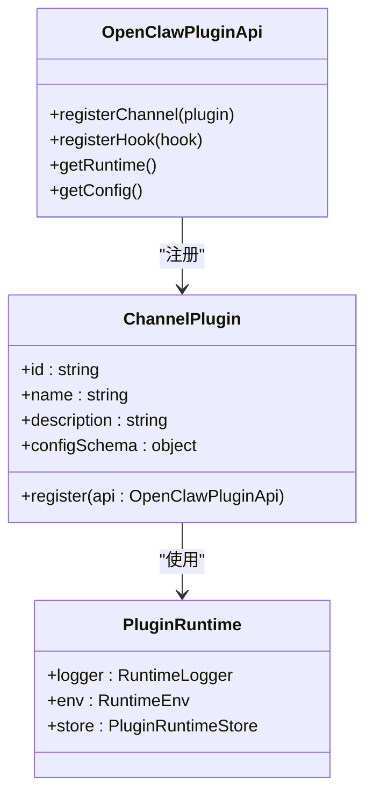
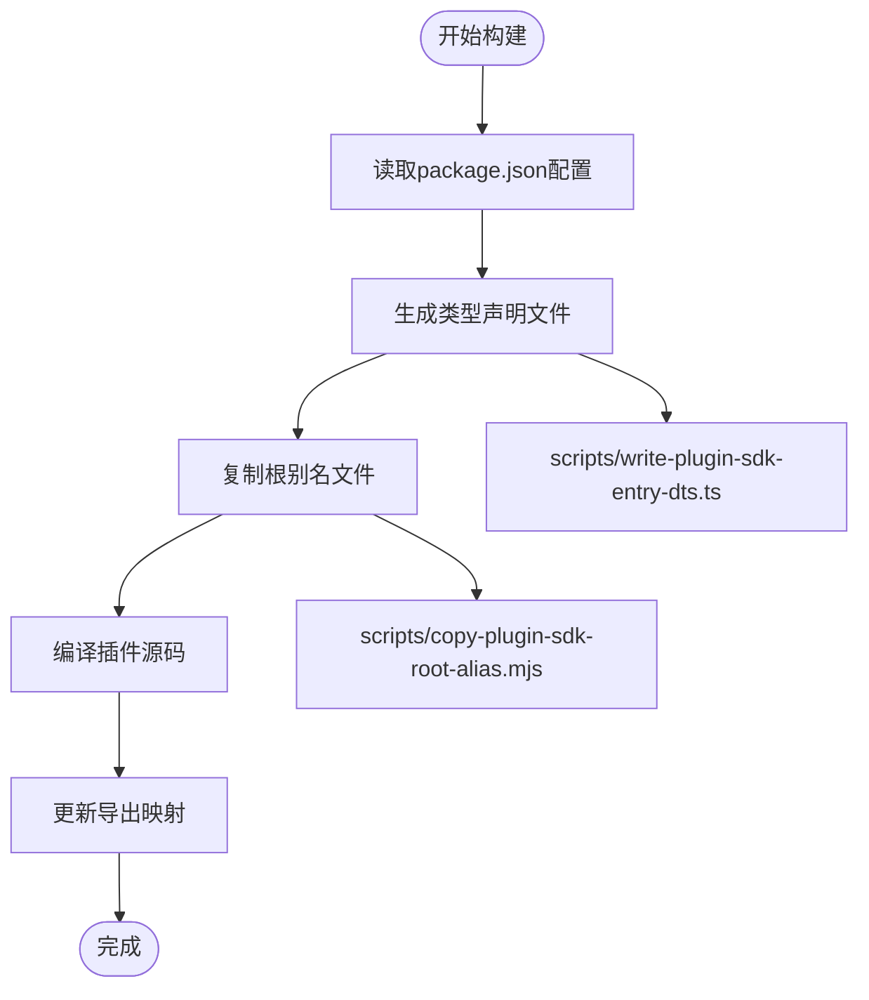
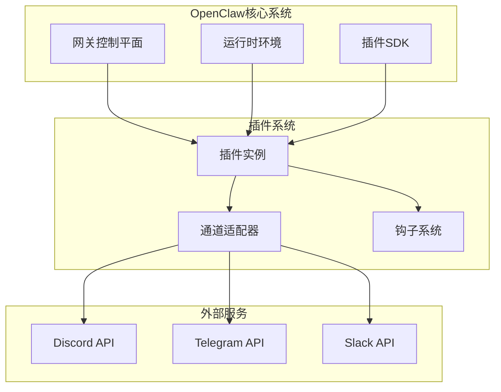
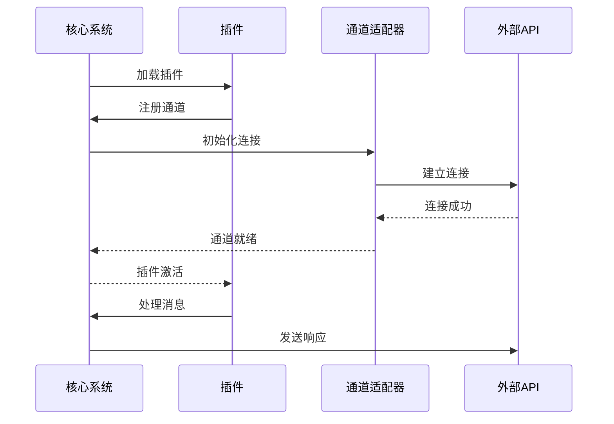
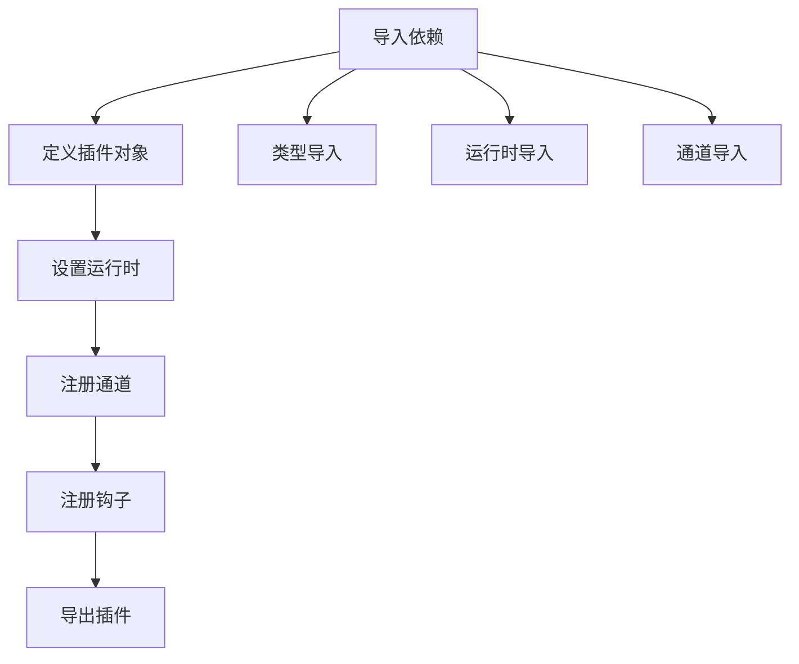
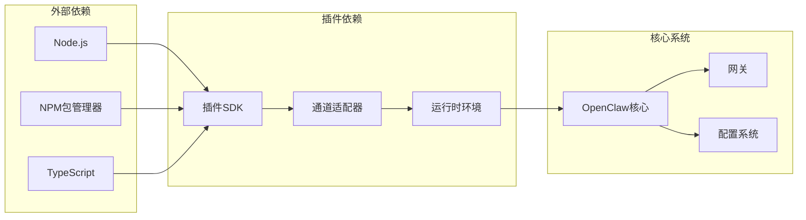

# 插件项目创建


## 目录
1. [简介](#简介)
2. [项目结构](#项目结构)
3. [核心组件](#核心组件)
4. [架构概览](#架构概览)
5. [详细组件分析](#详细组件分析)
6. [依赖关系分析](#依赖关系分析)
7. [性能考虑](#性能考虑)
8. [故障排除指南](#故障排除指南)
9. [结论](#结论)
10. [附录](#附录)

## 简介

OpenClaw是一个可扩展的多渠道AI网关平台，支持通过插件系统集成各种通信渠道。本文档提供了完整的插件项目创建指南，包括标准目录结构、配置文件设置、构建脚本以及开发环境搭建。

OpenClaw插件系统基于模块化设计，允许开发者为不同的通信渠道（如Discord、Telegram、Slack等）创建专门的插件。每个插件都遵循统一的结构和接口规范，确保与OpenClaw核心系统的无缝集成。

## 项目结构

OpenClaw项目采用分层的目录组织结构，专门为插件开发提供了清晰的框架：

```mermaid
graph TB
subgraph "根目录结构"
Root[根目录]
Extensions[extensions/] 存放所有插件
Src[src/] 核心源码
Scripts[scripts/] 构建脚本
Assets[assets/] 资源文件
Docs[docs/] 文档
end
subgraph "插件标准结构"
PluginDir[插件目录]
IndexTs[index.ts] 入口文件
PluginJson[openclaw.plugin.json] 插件配置
PackageJson[package.json] 包配置
SrcDir[src/] 源码目录
end
Extensions --> PluginDir
PluginDir --> IndexTs
PluginDir --> PluginJson
PluginDir --> PackageJson
PluginDir --> SrcDir
```

**图表来源**
- [extensions/discord/openclaw.plugin.json](file://extensions/discord/openclaw.plugin.json#L1-L10)
- [extensions/discord/package.json](file://extensions/discord/package.json#L1-L12)

### 目录结构规范

每个OpenClaw插件项目必须包含以下标准文件和目录：

1. **入口文件** (`index.ts`): 插件的主要入口点
2. **插件配置** (`openclaw.plugin.json`): 插件元数据和配置定义
3. **包配置** (`package.json`): NPM包配置和依赖声明
4. **源码目录** (`src/`): 插件的具体实现代码

**章节来源**
- [extensions/discord/openclaw.plugin.json](file://extensions/discord/openclaw.plugin.json#L1-L10)
- [extensions/discord/package.json](file://extensions/discord/package.json#L1-L12)

## 核心组件

OpenClaw插件系统的核心组件包括插件SDK、构建工具链和运行时环境。

### 插件SDK架构



**图表来源**
- [src/plugin-sdk/index.ts](file://src/plugin-sdk/index.ts#L96-L124)

### 构建系统组件

OpenClaw使用现代化的构建工具链来处理插件的编译和打包：



**图表来源**
- [scripts/write-plugin-sdk-entry-dts.ts](file://scripts/write-plugin-sdk-entry-dts.ts#L1-L61)
- [scripts/copy-plugin-sdk-root-alias.mjs](file://scripts/copy-plugin-sdk-root-alias.mjs#L1-L11)

**章节来源**
- [src/plugin-sdk/index.ts](file://src/plugin-sdk/index.ts#L1-L812)
- [scripts/write-plugin-sdk-entry-dts.ts](file://scripts/write-plugin-sdk-entry-dts.ts#L1-L61)

## 架构概览

OpenClaw插件系统采用松耦合的设计模式，通过标准化的接口实现插件与核心系统的交互。



**图表来源**
- [extensions/discord/index.ts](file://extensions/discord/index.ts#L1-L20)
- [src/plugin-sdk/index.ts](file://src/plugin-sdk/index.ts#L1-L812)

### 插件生命周期



**图表来源**
- [extensions/discord/index.ts](file://extensions/discord/index.ts#L12-L16)

## 详细组件分析

### 插件配置文件分析

每个插件都需要一个标准的配置文件来定义其元数据和行为。

#### openclaw.plugin.json 结构

| 字段 | 类型 | 必需 | 描述 |
|------|------|------|------|
| id | string | 是 | 插件唯一标识符 |
| channels | string[] | 是 | 支持的通道列表 |
| configSchema | object | 否 | 配置验证模式 |

#### package.json 配置

| 字段 | 类型 | 必需 | 描述 |
|------|------|------|------|
| name | string | 是 | NPM包名称 |
| version | string | 是 | 版本号 |
| type | string | 是 | 模块类型（module） |
| openclaw.extensions | string[] | 是 | 扩展入口点 |

**章节来源**
- [extensions/discord/openclaw.plugin.json](file://extensions/discord/openclaw.plugin.json#L1-L10)
- [extensions/discord/package.json](file://extensions/discord/package.json#L1-L12)

### 插件入口文件结构

插件的入口文件是整个插件的核心，负责初始化和注册插件功能。



**图表来源**
- [extensions/discord/index.ts](file://extensions/discord/index.ts#L1-L20)

### 插件开发模板

以下是一个完整的插件开发模板，展示了标准的插件结构：

```typescript
// index.ts - 插件入口文件模板
import type { OpenClawPluginApi } from "openclaw/plugin-sdk/<channel>";
import { emptyPluginConfigSchema } from "openclaw/plugin-sdk/<channel>";
import { <channel>Plugin } from "./src/channel.js";
import { set<Channel>Runtime } from "./src/runtime.js";
import { register<Channel>SubagentHooks } from "./src/subagent-hooks.js";

const plugin = {
  id: "<channel>",
  name: "<Channel> 插件",
  description: "<Channel> 通道插件",
  configSchema: emptyPluginConfigSchema(),
  register(api: OpenClawPluginApi) {
    set<Channel>Runtime(api.runtime);
    api.registerChannel({ plugin: <channel>Plugin });
    register<Channel>SubagentHooks(api);
  },
};

export default plugin;
```

**章节来源**
- [extensions/discord/index.ts](file://extensions/discord/index.ts#L1-L20)

## 依赖关系分析

OpenClaw插件系统的依赖关系相对简单，主要围绕插件SDK和核心运行时环境。



**图表来源**
- [package.json](file://package.json#L335-L411)

### 开发工具链

OpenClaw使用多种开发工具来确保代码质量和构建效率：

| 工具 | 用途 | 版本要求 |
|------|------|----------|
| Node.js | 运行时环境 | >= 22.12.0 |
| pnpm | 包管理器 | 10.23.0 |
| TypeScript | 类型检查 | ^5.9.3 |
| tsdown | 类型声明生成 | 0.21.0 |
| tsx | TypeScript执行器 | ^4.21.0 |

**章节来源**
- [package.json](file://package.json#L416-L420)
- [README.md](file://README.md#L52-L59)

## 性能考虑

在开发OpenClaw插件时，需要特别关注以下几个性能方面：

### 内存管理
- 合理使用缓存机制
- 及时清理不再使用的资源
- 避免内存泄漏

### 并发处理
- 使用异步操作避免阻塞
- 实现适当的并发限制
- 处理错误情况下的资源释放

### 网络优化
- 实现重试机制
- 处理网络超时
- 优化API调用频率

## 故障排除指南

### 常见问题及解决方案

#### 插件无法加载
1. 检查 `openclaw.plugin.json` 文件格式
2. 验证 `package.json` 中的 `openclaw.extensions` 配置
3. 确认入口文件路径正确

#### 运行时错误
1. 检查 Node.js 版本是否满足要求
2. 验证插件SDK版本兼容性
3. 查看详细的错误日志信息

#### 构建失败
1. 确认 TypeScript 编译配置正确
2. 检查依赖包版本冲突
3. 验证构建脚本权限

**章节来源**
- [package.json](file://package.json#L217-L334)

## 结论

OpenClaw插件系统为开发者提供了一个强大而灵活的框架，用于创建各种通信渠道的集成插件。通过遵循本文档提供的标准结构和最佳实践，开发者可以快速创建高质量的插件，并与OpenClaw生态系统无缝集成。

关键要点包括：
- 遵循标准的插件目录结构
- 正确配置插件元数据文件
- 利用插件SDK提供的完整功能集
- 遵守性能和安全最佳实践

## 附录

### 快速开始模板

创建新插件的最小化步骤：

1. 创建插件目录：`extensions/<channel>/`
2. 添加配置文件：`openclaw.plugin.json`
3. 创建包配置：`package.json`
4. 实现入口文件：`index.ts`
5. 添加源码目录：`src/`

### 参考文档

- [OpenClaw官方文档](https://docs.openclaw.ai)
- [插件开发指南](https://docs.openclaw.ai/plugins)
- [插件SDK参考](https://docs.openclaw.ai/reference/plugin-sdk)