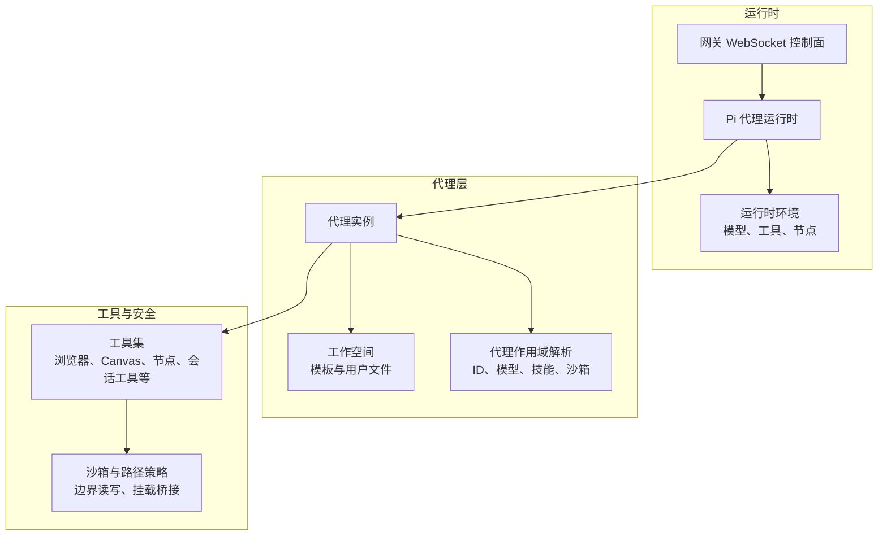
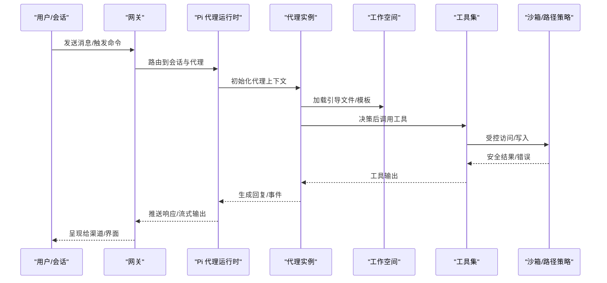
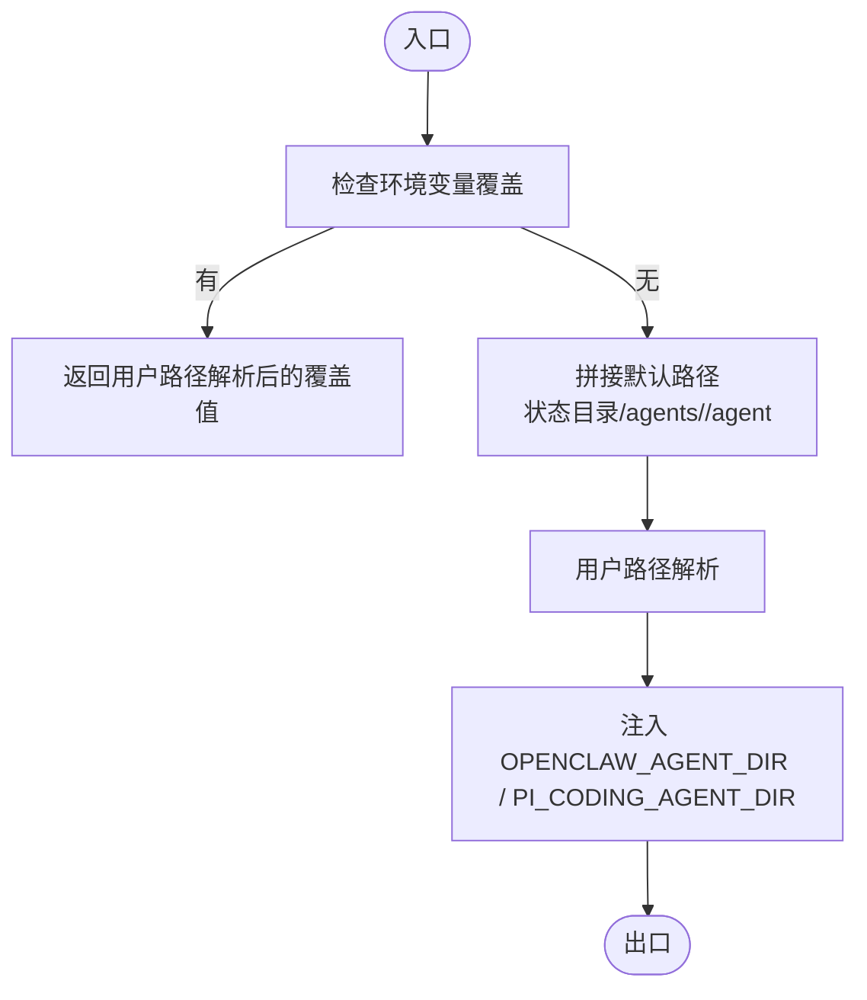
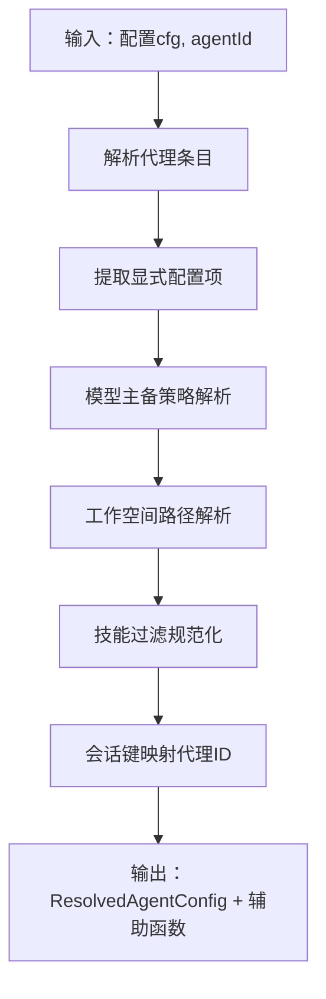
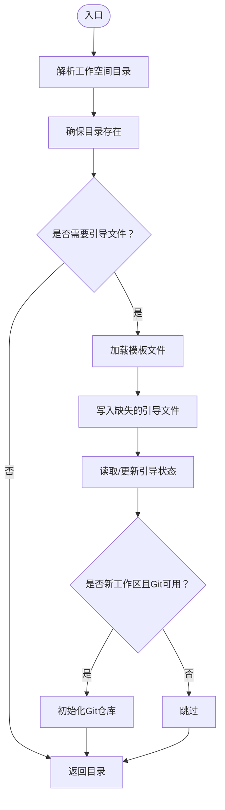
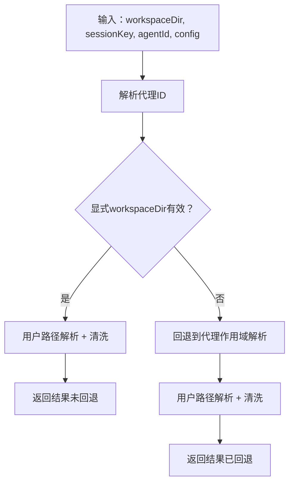
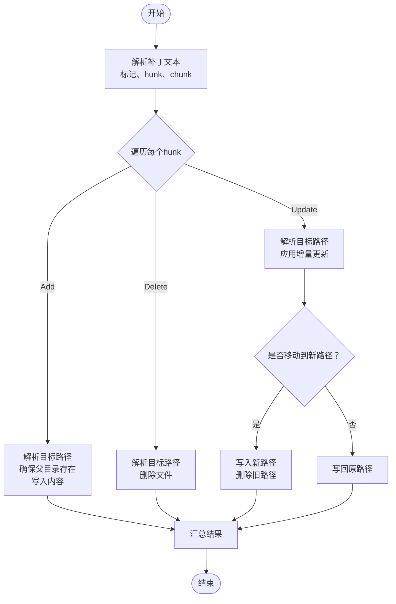
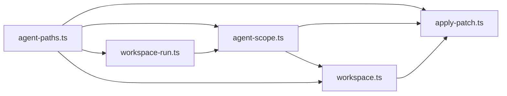

# 代理系统

## 目录
1. [简介](#简介)
2. [项目结构](#项目结构)
3. [核心组件](#核心组件)
4. [架构总览](#架构总览)
5. [详细组件分析](#详细组件分析)
6. [依赖关系分析](#依赖关系分析)
7. [性能考量](#性能考量)
8. [故障排查指南](#故障排查指南)
9. [结论](#结论)
10. [附录](#附录)

## 简介
本文件面向OpenClaw代理系统的开发者与维护者，系统性阐述AI代理的设计理念、架构模式与实现细节，覆盖代理生命周期、状态管理、内存机制、代理循环（agent loop）的工作原理（思考、决策、工具调用、行动执行）、代理工作空间（workspace）的组织与上下文管理、权限控制与沙箱机制、以及配置与定制化最佳实践。文中所有技术要点均基于仓库源码与官方文档进行提炼与可视化呈现，便于读者快速理解并扩展代理能力。

## 项目结构
OpenClaw是一个多平台、多通道、可扩展的个人AI助手系统，核心围绕“网关（Gateway）+ 会话（Session）+ 代理（Agent）+ 工具（Tools）+ 工作空间（Workspace）”构建。代理运行于Pi Agent Core之上，通过网关提供的RPC与事件通道与外部世界交互；工作空间承载系统提示词、技能与临时状态；沙箱与路径策略保障在开放工具链下的安全边界。

图示来源
- [README.md](file://README.md#L185-L212)
- [agent-scope.ts](file://src/agents/agent-scope.ts#L118-L145)
- [workspace.ts](file://src/agents/workspace.ts#L12-L44)

章节来源
- [README.md](file://README.md#L185-L212)

## 核心组件
- 代理路径与环境：负责解析默认代理目录、注入环境变量，确保代理运行时的目录一致性与可发现性。
- 代理作用域：解析代理ID、默认代理、会话键映射、模型主备策略、工作空间与技能过滤、沙箱配置等。
- 工作空间：提供默认工作空间根目录、模板加载、边界安全读取、引导文件（AGENTS/SOUL/TOOLS/IDENTITY/USER/HEARTBEAT/BOOTSTRAP/MEMORY）管理、Git初始化与引导状态追踪。
- 运行期工作空间解析：根据会话键与显式参数解析最终工作空间目录，并进行回退与安全清洗。
- 补丁应用工具：以受控方式在工作空间内应用补丁，支持边界检查、沙箱桥接、增量更新与移动重定位。

章节来源
- [agent-paths.ts](file://src/agents/agent-paths.ts#L6-L25)
- [agent-scope.ts](file://src/agents/agent-scope.ts#L118-L145)
- [workspace.ts](file://src/agents/workspace.ts#L12-L44)
- [workspace-run.ts](file://src/agents/workspace-run.ts#L74-L116)
- [apply-patch.ts](file://src/agents/apply-patch.ts#L85-L123)

## 架构总览
下图展示从会话到代理、工作空间与工具的端到端调用链路，以及安全边界与路径策略的作用点。

图示来源
- [README.md](file://README.md#L185-L212)
- [workspace.ts](file://src/agents/workspace.ts#L498-L555)
- [apply-patch.ts](file://src/agents/apply-patch.ts#L229-L276)

## 详细组件分析

### 组件A：代理路径与环境（agent-paths）
- 设计目标：统一代理目录解析与环境注入，避免硬编码路径，支持通过环境变量覆盖默认位置。
- 关键职责：
  - 解析默认代理目录：优先使用环境变量覆盖，否则落盘到状态目录下的agents/&lt;agentId&gt;/agent。
  - 注入环境变量：OPENCLAW_AGENT_DIR 与 PI_CODING_AGENT_DIR 同步设置，确保下游工具可发现。
- 安全与兼容性：对空字节进行清理，避免路径解析异常；路径解析遵循用户家目录与用户路径解析规则。

图示来源
- [agent-paths.ts](file://src/agents/agent-paths.ts#L6-L25)

章节来源
- [agent-paths.ts](file://src/agents/agent-paths.ts#L6-L25)

### 组件B：代理作用域（agent-scope）
- 设计目标：集中管理代理配置解析、模型主备策略、工作空间与技能过滤、会话键到代理ID的映射。
- 关键职责：
  - 列举与去重代理ID，确定默认代理。
  - 从配置中解析代理显式配置（名称、工作空间、模型、技能、心跳、身份、子代理、沙箱、工具等）。
  - 模型主备策略：显式优先，其次全局默认；支持覆盖禁用全局回退。
  - 工作空间解析：优先代理配置，其次全局默认，最后回退到状态目录下的独立工作区。
  - 技能过滤：规范化技能白名单/黑名单。
  - 会话键解析：支持显式代理ID、会话键中的代理ID、默认代理。
- 安全与健壮性：路径标准化与大小写归一化（跨平台），严格路径比较与归属判断。

图示来源
- [agent-scope.ts](file://src/agents/agent-scope.ts#L118-L145)
- [agent-scope.ts](file://src/agents/agent-scope.ts#L256-L272)
- [agent-scope.ts](file://src/agents/agent-scope.ts#L147-L152)

章节来源
- [agent-scope.ts](file://src/agents/agent-scope.ts#L118-L145)
- [agent-scope.ts](file://src/agents/agent-scope.ts#L256-L272)
- [agent-scope.ts](file://src/agents/agent-scope.ts#L147-L152)

### 组件C：工作空间（workspace）
- 设计目标：提供安全、可引导、可扩展的代理工作空间，承载系统提示词与技能模板，支持Git初始化与引导状态追踪。
- 关键职责：
  - 默认工作空间根目录解析：支持按配置文件档位（profile）区分不同工作区。
  - 模板加载：内置模板（AGENTS/SOUL/TOOLS/IDENTITY/USER/HEARTBEAT/BOOTSTRAP/MEMORY）按需加载并去除前置元信息。
  - 边界安全读取：通过边界文件打开器限制访问范围，缓存文件内容以避免读取到过期内容。
  - 引导文件管理：缺失即写入模板，记录引导状态（种子时间、完成时间），支持Git初始化。
  - 额外引导文件：支持glob模式匹配，仅允许受控的引导文件名，返回诊断信息。
- 安全与健壮性：严格的文件名白名单、最大文件大小限制、边界读取、inode/dev/大小/修改时间组合的身份标识缓存。

图示来源
- [workspace.ts](file://src/agents/workspace.ts#L321-L459)
- [workspace.ts](file://src/agents/workspace.ts#L498-L555)
- [workspace.ts](file://src/agents/workspace.ts#L575-L655)

章节来源
- [workspace.ts](file://src/agents/workspace.ts#L12-L44)
- [workspace.ts](file://src/agents/workspace.ts#L321-L459)
- [workspace.ts](file://src/agents/workspace.ts#L498-L555)
- [workspace.ts](file://src/agents/workspace.ts#L575-L655)

### 组件D：运行期工作空间解析（workspace-run）
- 设计目标：在一次运行中根据会话键与显式参数解析最终工作空间目录，处理回退与安全清洗。
- 关键职责：
  - 解析代理ID：支持显式传入、会话键解析、默认代理回退。
  - 解析工作空间：显式字符串优先，否则回退到代理作用域解析的工作空间。
  - 安全清洗：对路径进行格式字符清洗，记录警告日志。
- 输出：包含最终工作空间目录、是否回退、回退原因、代理ID及其来源。

图示来源
- [workspace-run.ts](file://src/agents/workspace-run.ts#L74-L116)

章节来源
- [workspace-run.ts](file://src/agents/workspace-run.ts#L25-L68)
- [workspace-run.ts](file://src/agents/workspace-run.ts#L74-L116)

### 组件E：补丁应用工具（apply-patch）
- 设计目标：在工作空间内安全地应用补丁，支持边界限制、沙箱桥接、增量更新与移动重定位。
- 关键职责：
  - 补丁格式解析：识别添加、删除、更新三类hunk，支持移动到新路径。
  - 文件操作策略：根据是否沙箱模式选择不同的文件操作实现（本地FS或沙箱桥接）。
  - 边界与路径策略：在工作空间范围内进行读写，严格校验路径别名策略，防止越权。
  - 增量更新：对更新hunk进行上下文匹配与行级变更应用。
- 输出：补丁应用摘要（新增、修改、删除文件列表）与人类可读文本。

图示来源
- [apply-patch.ts](file://src/agents/apply-patch.ts#L125-L189)
- [apply-patch.ts](file://src/agents/apply-patch.ts#L229-L276)
- [apply-patch.ts](file://src/agents/apply-patch.ts#L351-L495)

章节来源
- [apply-patch.ts](file://src/agents/apply-patch.ts#L85-L123)
- [apply-patch.ts](file://src/agents/apply-patch.ts#L125-L189)
- [apply-patch.ts](file://src/agents/apply-patch.ts#L229-L276)
- [apply-patch.ts](file://src/agents/apply-patch.ts#L351-L495)

## 依赖关系分析
- 代理路径依赖配置路径解析与会话键常量，用于确定默认代理目录与环境变量注入。
- 代理作用域依赖配置模型输入解析、会话键解析、工作空间解析与技能过滤模块，形成代理配置的中心枢纽。
- 工作空间依赖边界文件读取、家目录解析、进程执行（Git）与模板目录解析，提供安全的引导与读取能力。
- 运行期工作空间解析依赖代理作用域解析与会话键分类，确保每次运行都能得到稳定的代理ID与工作空间。
- 补丁应用工具依赖边界文件读取、路径别名策略、沙箱路径断言与文件写入安全策略，确保在工作空间内的受控变更。

图示来源
- [agent-paths.ts](file://src/agents/agent-paths.ts#L1-L26)
- [agent-scope.ts](file://src/agents/agent-scope.ts#L1-L16)
- [workspace.ts](file://src/agents/workspace.ts#L1-L11)
- [workspace-run.ts](file://src/agents/workspace-run.ts#L1-L13)
- [apply-patch.ts](file://src/agents/apply-patch.ts#L1-L13)

章节来源
- [agent-paths.ts](file://src/agents/agent-paths.ts#L1-L26)
- [agent-scope.ts](file://src/agents/agent-scope.ts#L1-L16)
- [workspace.ts](file://src/agents/workspace.ts#L1-L11)
- [workspace-run.ts](file://src/agents/workspace-run.ts#L1-L13)
- [apply-patch.ts](file://src/agents/apply-patch.ts#L1-L13)

## 性能考量
- 文件缓存与边界读取：工作空间读取采用inode/dev/大小/修改时间组合的身份标识缓存，避免重复读取与过期内容；同时限制单文件最大字节数，降低内存占用。
- 路径解析与标准化：在Windows平台进行大小写归一化，在非存在路径上保留符号链接语义，减少不必要的真实化开销。
- 补丁应用的增量更新：仅对差异块进行上下文匹配与行级替换，减少大文件写入成本。
- Git初始化惰性：仅在新工作区且Git可用时初始化，避免不必要的进程调用。

## 故障排查指南
- 代理目录解析失败：检查环境变量覆盖是否为空字节或非法字符，确认用户路径解析结果。
- 工作空间读取异常：查看边界读取返回的原因（路径、校验、IO），确认文件名是否在受控白名单内，关注最大文件大小限制。
- 补丁应用报错：核对补丁格式标记、hunk头与上下文标记是否正确；若涉及移动，请确认目标路径在工作空间范围内。
- 引导状态不一致：检查引导状态文件是否存在、版本是否匹配，必要时重新生成引导文件或迁移历史。

章节来源
- [agent-paths.ts](file://src/agents/agent-paths.ts#L18-L25)
- [workspace.ts](file://src/agents/workspace.ts#L56-L88)
- [apply-patch.ts](file://src/agents/apply-patch.ts#L398-L409)
- [workspace.ts](file://src/agents/workspace.ts#L231-L248)

## 结论
OpenClaw代理系统通过“代理路径与环境—代理作用域—工作空间—运行期解析—工具与安全”的分层设计，实现了在开放工具链下的可控代理生命周期与上下文管理。代理循环（思考、决策、工具调用、行动执行）依托工作空间模板与受控工具集完成，权限与安全通过边界读取、路径策略与沙箱机制共同保障。配置与定制化方面，代理ID、模型主备、工作空间与技能过滤均可灵活调整，满足从个人到团队的多样化需求。

## 附录
- 最佳实践清单
  - 使用会话键规范代理ID，避免硬编码代理ID。
  - 在工作空间内进行所有持久化操作，严格遵守边界读写与路径策略。
  - 对补丁应用进行最小化变更与充分测试，优先使用增量更新。
  - 启用Git初始化与引导状态追踪，便于审计与迁移。
  - 通过代理作用域配置模型主备策略，确保在不同负载与模型可用性下的稳定性。