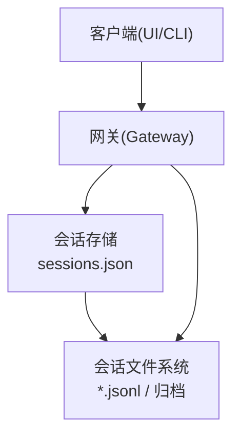
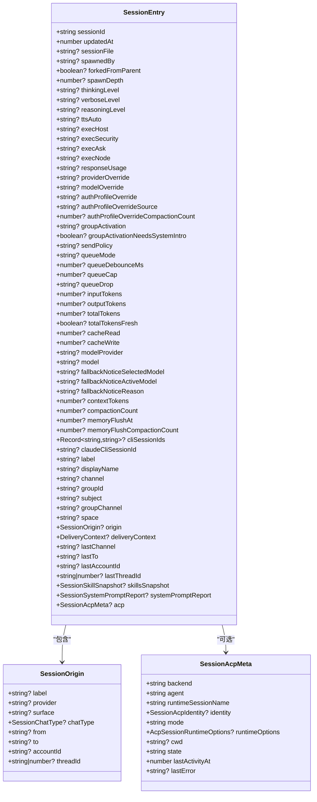
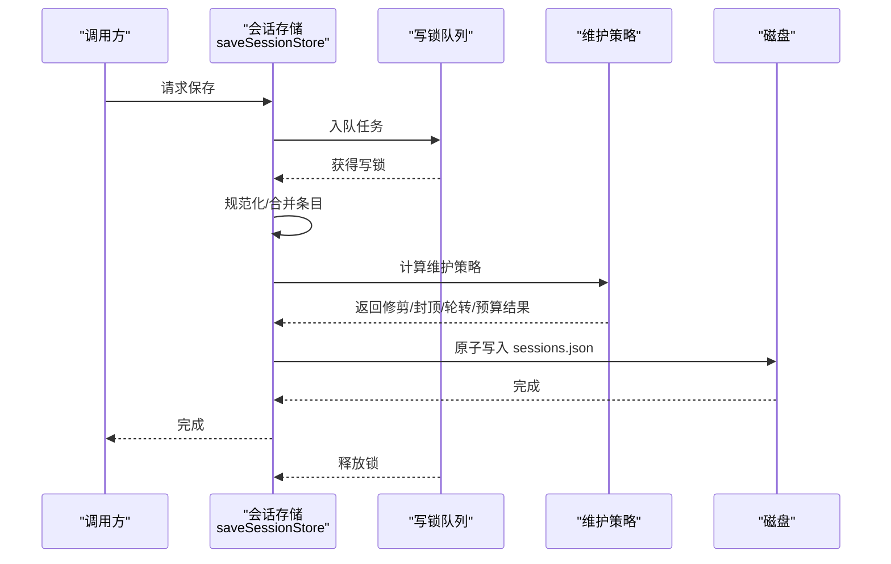
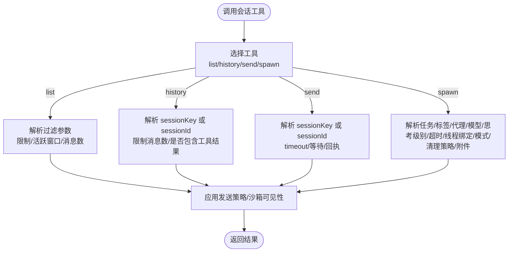
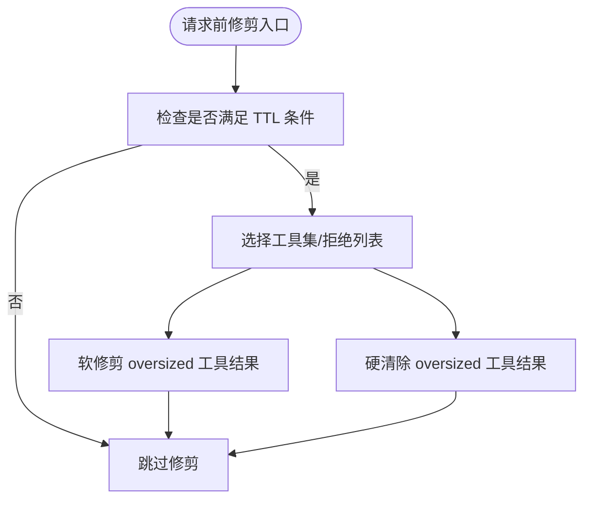
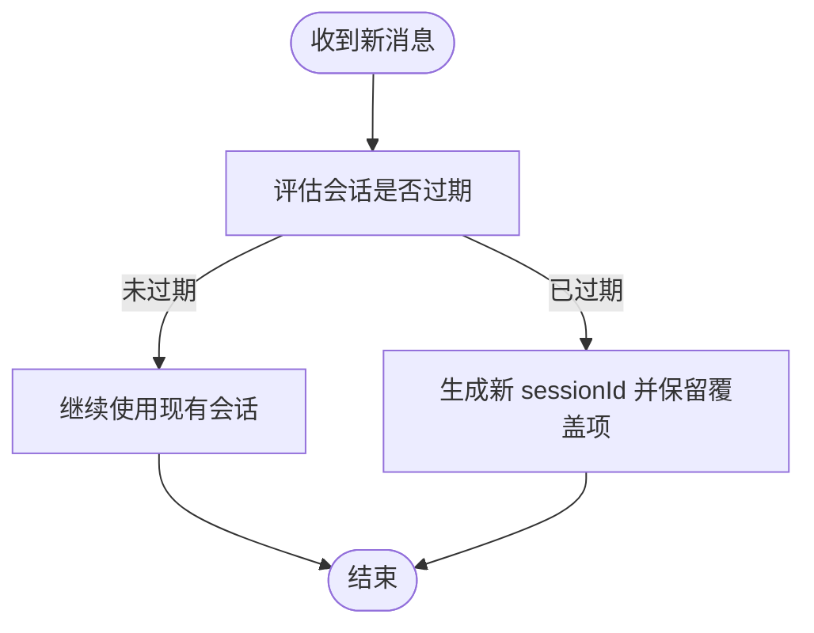
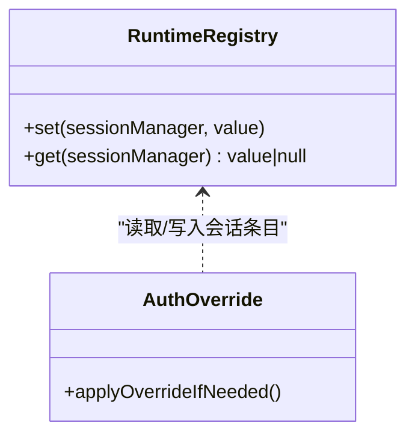
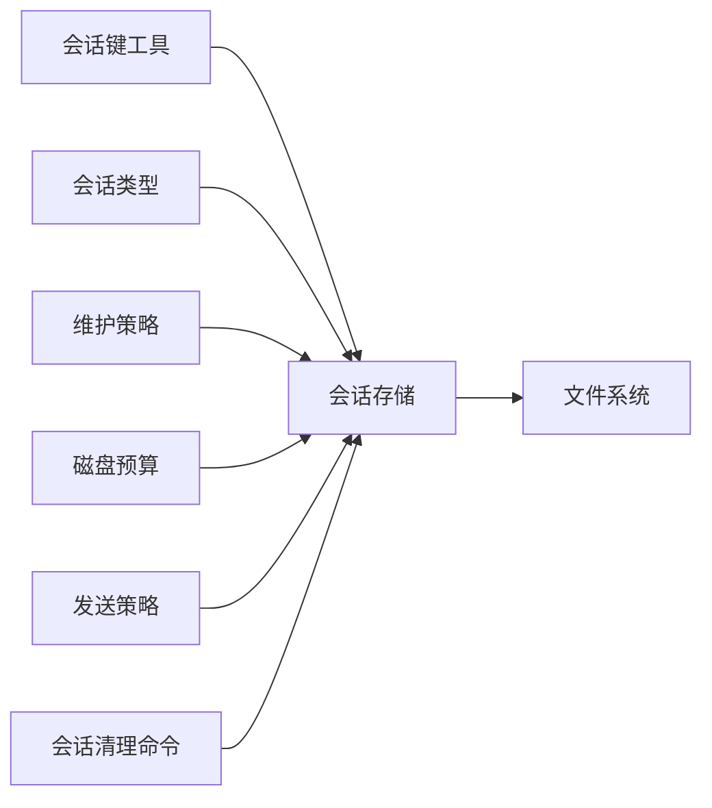

# 会话管理

## 目录
1. [简介](#简介)
2. [项目结构](#项目结构)
3. [核心组件](#核心组件)
4. [架构总览](#架构总览)
5. [详细组件分析](#详细组件分析)
6. [依赖关系分析](#依赖关系分析)
7. [性能考量](#性能考量)
8. [故障排除指南](#故障排除指南)
9. [结论](#结论)
10. [附录](#附录)

## 简介
本文件系统性阐述 OpenClaw 会话管理系统：从会话概念与生命周期、会话工具扩展、修剪与维护策略、持久化与恢复、隔离与权限控制，到配置与调优最佳实践，并提供实际使用案例与故障排除建议。目标是帮助开发者与运维人员在多用户、多通道、多后端场景下，稳定地管理会话并保障一致性与可靠性。

## 项目结构
围绕会话管理的关键目录与文件：
- 概念与文档：会话管理、会话工具、会话修剪等概念文档
- 会话键解析与类型定义：会话键工具、发送策略、会话 ID 校验
- 会话存储与维护：会话存储读写、缓存、锁队列、维护策略、磁盘预算
- 命令行清理：会话清理命令与预览/执行流程
- 生命周期与重置：会话重置策略与触发
- 运行时注册表与映射：会话管理器运行时注册表、ACPI 会话映射与重置

```mermaid
graph TB
subgraph "概念与文档"
D1["会话管理<br/>docs/concepts/session.md"]
D2["会话工具<br/>docs/concepts/session-tool.md"]
D3["会话修剪<br/>docs/concepts/session-pruning.md"]
end
subgraph "会话键与策略"
K1["会话键工具<br/>src/sessions/session-key-utils.ts"]
K2["发送策略<br/>src/sessions/send-policy.ts"]
K3["会话 ID 校验<br/>src/sessions/session-id.ts"]
end
subgraph "存储与维护"
S1["会话类型定义<br/>src/config/sessions/types.ts"]
S2["会话存储<br/>src/config/sessions/store.ts"]
S3["维护策略<br/>src/config/sessions/store-maintenance.ts"]
S4["磁盘预算<br/>src/config/sessions/disk-budget.ts"]
end
subgraph "命令与运行时"
C1["会话清理命令<br/>src/commands/sessions-cleanup.ts"]
R1["会话管理器运行时注册表<br/>src/agents/pi-extensions/session-manager-runtime-registry.ts"]
M1["ACPI 会话映射/重置<br/>src/acp/session-mapper.ts"]
O1["认证配置覆盖<br/>src/agents/auth-profiles/session-override.ts"]
L1["自动回复会话更新<br/>src/auto-reply/reply/session.ts"]
end
D1 --> S2
D2 --> S2
D3 --> S2
K1 --> S2
K2 --> S2
S1 --> S2
S3 --> S2
S4 --> S2
C1 --> S2
R1 --> S2
M1 --> S2
O1 --> S2
L1 --> S2
```

**图表来源**
- [docs/concepts/session.md](file://docs/concepts/session.md#L1-L311)
- [docs/concepts/session-tool.md](file://docs/concepts/session-tool.md#L1-L224)
- [docs/concepts/session-pruning.md](file://docs/concepts/session-pruning.md#L1-L122)
- [src/sessions/session-key-utils.ts](file://src/sessions/session-key-utils.ts#L1-L133)
- [src/sessions/send-policy.ts](file://src/sessions/send-policy.ts#L1-L124)
- [src/sessions/session-id.ts](file://src/sessions/session-id.ts#L1-L6)
- [src/config/sessions/types.ts](file://src/config/sessions/types.ts#L1-L376)
- [src/config/sessions/store.ts](file://src/config/sessions/store.ts#L1-L884)
- [src/config/sessions/store-maintenance.ts](file://src/config/sessions/store-maintenance.ts#L1-L328)
- [src/config/sessions/disk-budget.ts](file://src/config/sessions/disk-budget.ts#L1-L376)
- [src/commands/sessions-cleanup.ts](file://src/commands/sessions-cleanup.ts#L52-L202)
- [src/agents/pi-extensions/session-manager-runtime-registry.ts](file://src/agents/pi-extensions/session-manager-runtime-registry.ts#L1-L29)
- [src/acp/session-mapper.ts](file://src/acp/session-mapper.ts#L38-L98)
- [src/agents/auth-profiles/session-override.ts](file://src/agents/auth-profiles/session-override.ts#L130-L151)
- [src/auto-reply/reply/session.ts](file://src/auto-reply/reply/session.ts#L528-L564)

**章节来源**
- [docs/concepts/session.md](file://docs/concepts/session.md#L1-L311)
- [docs/concepts/session-tool.md](file://docs/concepts/session-tool.md#L1-L224)
- [docs/concepts/session-pruning.md](file://docs/concepts/session-pruning.md#L1-L122)

## 核心组件
- 会话键解析与分类：支持解析 agent 域会话键、推导聊天类型、识别 cron/subagent/Acp 等特殊键、提取线程父键等
- 会话类型与字段：统一的 SessionEntry 结构，包含模型、令牌统计、发送策略、派生上下文、ACPI 元信息等
- 会话存储与缓存：原子写入、缓存 TTL、锁队列串行化、维护策略（修剪、封顶、轮转）、磁盘预算
- 维护与清理：按时间/数量修剪、封顶、归档/清理旧归档、轮转 sessions.json、磁盘预算强制清理
- 会话工具：列出、历史、跨会话发送、子代理派生，以及沙箱可见性与安全策略
- 会话修剪：针对 Anthropic 缓存 TTL 的工具结果修剪，减少上下文膨胀
- 生命周期与重置：按日/空闲/类型/通道重置策略，支持触发词与重置映射
- 运行时注册表与映射：会话管理器运行时注册表；ACPI 会话标签/键解析与必要时重置

**章节来源**
- [src/sessions/session-key-utils.ts](file://src/sessions/session-key-utils.ts#L1-L133)
- [src/config/sessions/types.ts](file://src/config/sessions/types.ts#L68-L167)
- [src/config/sessions/store.ts](file://src/config/sessions/store.ts#L1-L884)
- [src/config/sessions/store-maintenance.ts](file://src/config/sessions/store-maintenance.ts#L1-L328)
- [src/config/sessions/disk-budget.ts](file://src/config/sessions/disk-budget.ts#L1-L376)
- [docs/concepts/session-tool.md](file://docs/concepts/session-tool.md#L1-L224)
- [docs/concepts/session-pruning.md](file://docs/concepts/session-pruning.md#L1-L122)
- [src/config/sessions/reset.ts](file://src/config/sessions/reset.ts#L84-L120)
- [src/agents/pi-extensions/session-manager-runtime-registry.ts](file://src/agents/pi-extensions/session-manager-runtime-registry.ts#L1-L29)
- [src/acp/session-mapper.ts](file://src/acp/session-mapper.ts#L38-L98)

## 架构总览
OpenClaw 以“网关为主”的会话架构：会话状态由网关持有，客户端仅查询与展示；会话存储采用 JSON 文件与磁盘预算控制；维护策略在写入路径执行；会话工具提供跨会话能力并受发送策略与沙箱可见性约束。

**图表来源**
- [docs/concepts/session.md](file://docs/concepts/session.md#L57-L72)
- [src/config/sessions/store.ts](file://src/config/sessions/store.ts#L340-L509)

## 详细组件分析

### 会话键与类型
- 键解析：支持 agent 域键解析、大小写不敏感、兼容遗留键；推导聊天类型（direct/group/channel/unknown）
- 特殊键识别：cron、subagent、Acp、线程父键提取
- 会话 ID 校验：正则校验标准 UUID 格式
- 类型定义：SessionEntry 字段覆盖模型、令牌统计、发送策略、派生上下文、ACPI 元信息、技能快照、系统提示报告等

**图表来源**
- [src/config/sessions/types.ts](file://src/config/sessions/types.ts#L68-L167)
- [src/config/sessions/types.ts](file://src/config/sessions/types.ts#L14-L36)
- [src/config/sessions/types.ts](file://src/config/sessions/types.ts#L38-L49)

**章节来源**
- [src/sessions/session-key-utils.ts](file://src/sessions/session-key-utils.ts#L1-L133)
- [src/sessions/session-id.ts](file://src/sessions/session-id.ts#L1-L6)
- [src/config/sessions/types.ts](file://src/config/sessions/types.ts#L1-L376)

### 会话存储与维护
- 读写与缓存：支持缓存 TTL、序列化缓存、对象缓存；加载时对空文件/锁文件做回退重试
- 写入锁队列：基于 Promise 队列串行化写入，避免竞态；支持超时与过期检测
- 维护策略：按时间修剪、按数量封顶、归档/清理旧归档、轮转 sessions.json
- 磁盘预算：在高水位阈值下，优先删除未被引用的归档与历史文件，再删除最旧条目，保护活跃会话
- 原子写入：Windows 下带重试；非 Windows 使用原子写入并更新缓存

**图表来源**
- [src/config/sessions/store.ts](file://src/config/sessions/store.ts#L511-L533)
- [src/config/sessions/store.ts](file://src/config/sessions/store.ts#L695-L727)
- [src/config/sessions/store.ts](file://src/config/sessions/store.ts#L340-L509)
- [src/config/sessions/store-maintenance.ts](file://src/config/sessions/store-maintenance.ts#L150-L259)
- [src/config/sessions/disk-budget.ts](file://src/config/sessions/disk-budget.ts#L188-L375)

**章节来源**
- [src/config/sessions/store.ts](file://src/config/sessions/store.ts#L195-L270)
- [src/config/sessions/store.ts](file://src/config/sessions/store.ts#L340-L509)
- [src/config/sessions/store-maintenance.ts](file://src/config/sessions/store-maintenance.ts#L150-L259)
- [src/config/sessions/disk-budget.ts](file://src/config/sessions/disk-budget.ts#L188-L375)

### 会话工具与扩展
- 工具集：sessions_list、sessions_history、sessions_send、sessions_spawn
- 可见性与沙箱：默认 tree（当前+子会话），沙箱可硬性限制为 spawned/all
- 发送策略：基于规则的通道/聊天类型/前缀匹配，支持运行时覆盖
- 跨会话消息：支持等待完成/超时/失败处理，支持 ping-pong 与公告步骤

**图表来源**
- [docs/concepts/session-tool.md](file://docs/concepts/session-tool.md#L29-L224)
- [src/sessions/send-policy.ts](file://src/sessions/send-policy.ts#L53-L123)

**章节来源**
- [docs/concepts/session-tool.md](file://docs/concepts/session-tool.md#L1-L224)
- [src/sessions/send-policy.ts](file://src/sessions/send-policy.ts#L1-L124)

### 会话修剪（上下文瘦身）
- 目标：在每次 LLM 调用前修剪旧工具结果，不重写磁盘历史
- 条件：仅在 Anthropic API 场景且超过 TTL 时生效
- 行为：软修剪（保留头尾并标注）与硬清除（替换占位符）
- 与压缩区分：压缩是持久化摘要，修剪是请求级瞬时清理

**图表来源**
- [docs/concepts/session-pruning.md](file://docs/concepts/session-pruning.md#L13-L77)

**章节来源**
- [docs/concepts/session-pruning.md](file://docs/concepts/session-pruning.md#L1-L122)

### 生命周期与重置
- 重置策略：按日（atHour）与空闲（idleMinutes）两种模式，二者取先到期者
- 类型/通道覆盖：按 direct/group/thread 与通道维度覆盖
- 触发词：/new 与 /reset（及自定义列表），支持切换模型
- ACP 映射：支持标签/键解析与必要时重置

**图表来源**
- [docs/concepts/session.md](file://docs/concepts/session.md#L207-L217)
- [src/config/sessions/reset.ts](file://src/config/sessions/reset.ts#L84-L120)
- [src/acp/session-mapper.ts](file://src/acp/session-mapper.ts#L38-L98)

**章节来源**
- [docs/concepts/session.md](file://docs/concepts/session.md#L207-L217)
- [src/config/sessions/reset.ts](file://src/config/sessions/reset.ts#L84-L120)
- [src/acp/session-mapper.ts](file://src/acp/session-mapper.ts#L38-L98)

### 运行时注册表与认证覆盖
- 会话管理器运行时注册表：以对象身份为键的弱映射，确保实例稳定性
- 认证配置覆盖：根据比较条件决定是否持久化覆盖项与更新时间戳

**图表来源**
- [src/agents/pi-extensions/session-manager-runtime-registry.ts](file://src/agents/pi-extensions/session-manager-runtime-registry.ts#L1-L29)
- [src/agents/auth-profiles/session-override.ts](file://src/agents/auth-profiles/session-override.ts#L130-L151)

**章节来源**
- [src/agents/pi-extensions/session-manager-runtime-registry.ts](file://src/agents/pi-extensions/session-manager-runtime-registry.ts#L1-L29)
- [src/agents/auth-profiles/session-override.ts](file://src/agents/auth-profiles/session-override.ts#L130-L151)

### 自动回复与会话更新
- 新建/重置会话时清零相关计数并保留覆盖项
- 更新会话存储时应用维护策略并发出警告/统计回调

**章节来源**
- [src/auto-reply/reply/session.ts](file://src/auto-reply/reply/session.ts#L528-L564)
- [src/config/sessions/store.ts](file://src/config/sessions/store.ts#L353-L392)

## 依赖关系分析
- 低耦合：会话键工具、发送策略、类型定义独立于存储实现
- 强内聚：存储模块聚合缓存、锁队列、维护策略、磁盘预算
- 外部依赖：文件系统、配置加载、日志子系统
- 循环依赖：未发现直接循环；各模块通过接口契约交互

**图表来源**
- [src/sessions/session-key-utils.ts](file://src/sessions/session-key-utils.ts#L1-L133)
- [src/sessions/send-policy.ts](file://src/sessions/send-policy.ts#L1-L124)
- [src/config/sessions/types.ts](file://src/config/sessions/types.ts#L1-L376)
- [src/config/sessions/store.ts](file://src/config/sessions/store.ts#L1-L884)
- [src/config/sessions/store-maintenance.ts](file://src/config/sessions/store-maintenance.ts#L1-L328)
- [src/config/sessions/disk-budget.ts](file://src/config/sessions/disk-budget.ts#L1-L376)
- [src/commands/sessions-cleanup.ts](file://src/commands/sessions-cleanup.ts#L52-L202)

**章节来源**
- [src/config/sessions/store.ts](file://src/config/sessions/store.ts#L1-L884)

## 性能考量
- 写入路径开销：大型 sessions.json 与大量历史文件会增加写入延迟
- 维护成本：高 maxEntries、长 pruneAfter、启用磁盘预算但未设合理封顶，会显著增加维护成本
- 建议：
  - 生产环境使用 enforce 模式自动限流
  - 同时设置时间与数量限制，避免单一维度失效
  - 合理设置 maxDiskBytes 与 highWaterBytes，建议高水位为上限的 80%
  - 使用 dry-run 预览清理影响，再执行 enforce
  - 对频繁活跃会话传入 active-key 以避免误删

**章节来源**
- [docs/concepts/session.md](file://docs/concepts/session.md#L101-L120)

## 故障排除指南
- 会话清理预览与执行
  - 预览：dry-run + json 输出，查看将被修剪/封顶/预算移除的条目
  - 执行：enforce 模式应用实际清理
- 维护警告
  - 当 activeSessionKey 存在时，warn-only 模式会避免删除活跃会话
  - 通过回调获取维护统计，定位瓶颈
- 磁盘预算告警
  - 超出高水位后，优先删除未被引用的历史文件与归档，再删除最旧条目
  - 若仍超限，检查是否遗漏了引用或存在异常大文件
- 写入失败
  - Windows 下重试与回退；非 Windows 下原子写入失败需检查权限与磁盘空间
- 锁队列超时
  - 调整超时/过期参数，或减少并发写入

**章节来源**
- [src/commands/sessions-cleanup.ts](file://src/commands/sessions-cleanup.ts#L158-L202)
- [src/config/sessions/store.ts](file://src/config/sessions/store.ts#L353-L392)
- [src/config/sessions/disk-budget.ts](file://src/config/sessions/disk-budget.ts#L227-L244)
- [src/config/sessions/store.ts](file://src/config/sessions/store.ts#L464-L508)
- [src/config/sessions/store.ts](file://src/config/sessions/store.ts#L695-L727)

## 结论
OpenClaw 的会话管理以“网关为主、客户端只读”为核心设计，结合强健的存储与维护策略、灵活的会话工具与安全策略、以及完善的生命周期与重置机制，能够在多用户、多通道、多后端环境下稳定运行。通过合理的配置与调优，可有效控制内存与磁盘占用，提升整体性能与可靠性。

## 附录

### 实际使用案例
- 多用户共享收件箱：将 dmScope 设为 per-channel-peer 或更高隔离级别，防止上下文泄露
- 大规模部署：启用 enforce 模式并设置 maxDiskBytes + highWaterBytes，定期执行清理
- 跨会话协作：使用 sessions_send 在不同会话间传递消息，配合发送策略与沙箱可见性控制

**章节来源**
- [docs/concepts/session.md](file://docs/concepts/session.md#L19-L55)
- [docs/concepts/session-tool.md](file://docs/concepts/session-tool.md#L78-L106)