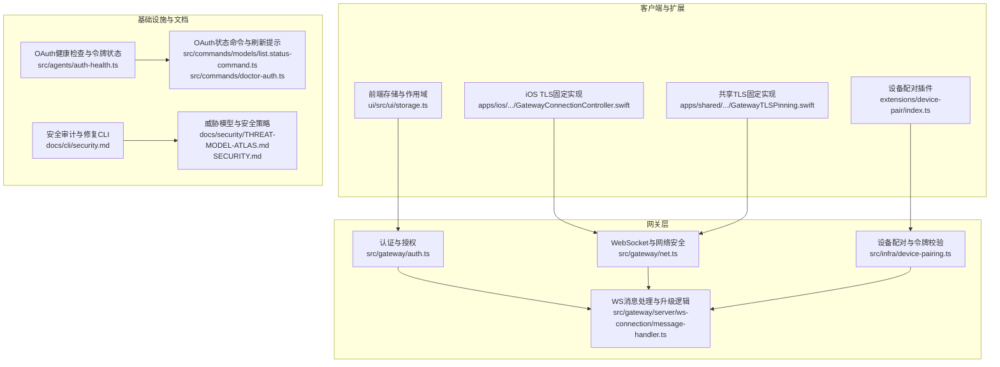
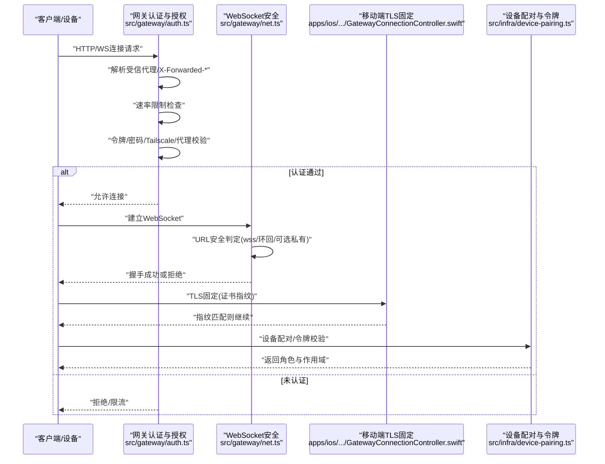
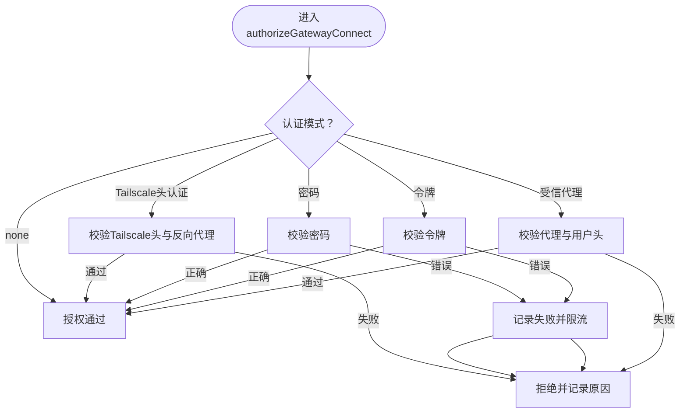
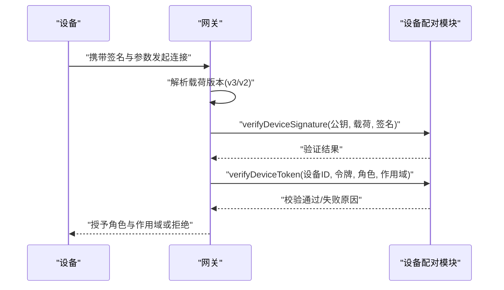
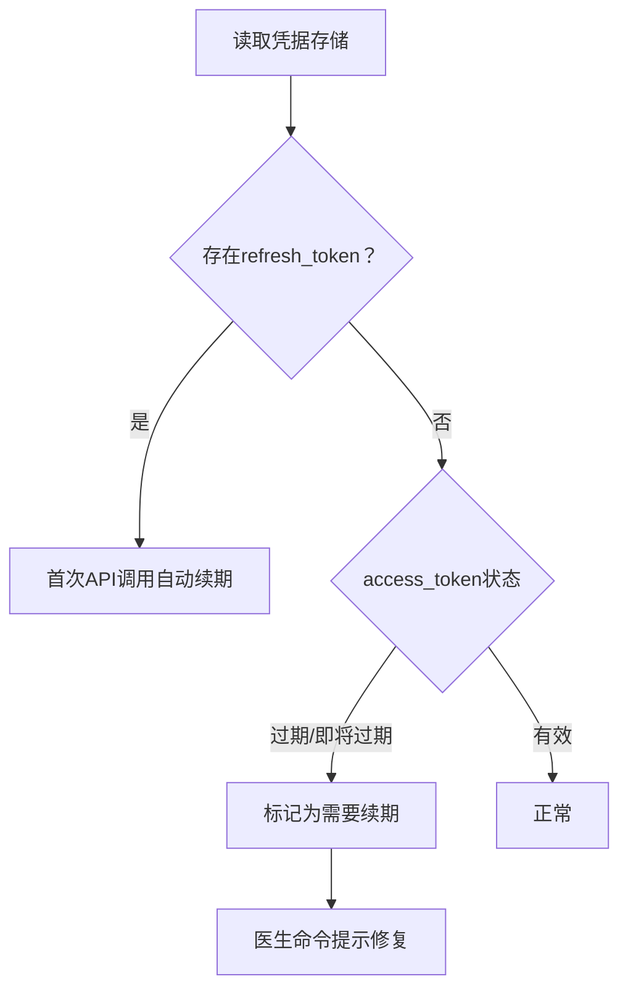
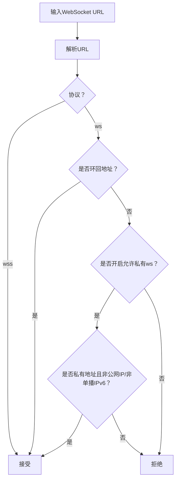
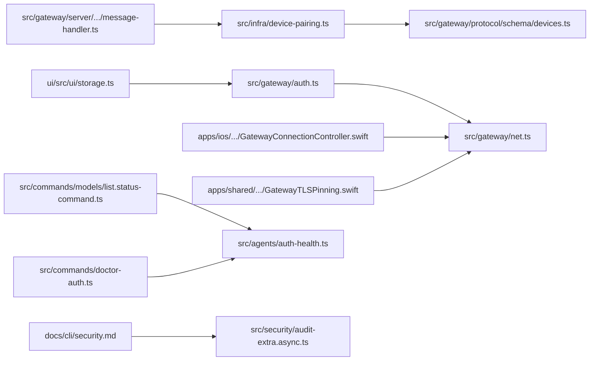

# 安全模型

## 目录
1. [引言](#引言)
2. [项目结构](#项目结构)
3. [核心组件](#核心组件)
4. [架构总览](#架构总览)
5. [详细组件分析](#详细组件分析)
6. [依赖关系分析](#依赖关系分析)
7. [性能考量](#性能考量)
8. [故障排查指南](#故障排查指南)
9. [结论](#结论)
10. [附录](#附录)

## 引言
本文件面向OpenClaw的安全模型，系统化阐述其安全架构与威胁模型，覆盖身份认证、授权与数据保护；OAuth集成策略与第三方服务访问管理；设备配对与信任建立（含签名验证与本地信任策略）；网络安全（WebSocket安全、TLS配置与防火墙建议）；敏感数据处理与存储（API密钥与用户信息）；以及安全配置最佳实践（令牌管理、会话安全与访问控制）。同时提供安全审计与监控实施方案，帮助管理员持续维护系统安全。

## 项目结构
OpenClaw安全相关能力主要分布在以下区域：
- 网关层：认证与授权、网络与连接安全、设备配对与令牌校验
- 基础设施：设备配对状态持久化、令牌生成与校验、临时目录与文件权限
- 客户端与扩展：移动端TLS固定、浏览器端存储与网关令牌作用域
- 文档与CLI：威胁模型、安全策略与审计工具
- 插件与通道：设备配对流程与QR码等接入方式

图表来源
- [src/gateway/auth.ts](file://src/gateway/auth.ts#L217-L485)
- [src/gateway/net.ts](file://src/gateway/net.ts#L411-L422)
- [src/infra/device-pairing.ts](file://src/infra/device-pairing.ts#L470-L508)
- [src/gateway/server/ws-connection/message-handler.ts](file://src/gateway/server/ws-connection/message-handler.ts#L165-L234)
- [apps/ios/Sources/Gateway/GatewayConnectionController.swift](file://apps/ios/Sources/Gateway/GatewayConnectionController.swift#L993-L1071)
- [apps/shared/OpenClawKit/Sources/OpenClawKit/GatewayTLSPinning.swift](file://apps/shared/OpenClawKit/Sources/OpenClawKit/GatewayTLSPinning.swift#L66-L87)
- [ui/src/ui/storage.ts](file://ui/src/ui/storage.ts#L35-L70)
- [extensions/device-pair/index.ts](file://extensions/device-pair/index.ts#L396-L431)
- [src/agents/auth-health.ts](file://src/agents/auth-health.ts#L165-L197)
- [src/commands/models/list.status-command.ts](file://src/commands/models/list.status-command.ts#L259-L278)
- [src/commands/doctor-auth.ts](file://src/commands/doctor-auth.ts#L286-L309)
- [docs/cli/security.md](file://docs/cli/security.md#L1-L72)
- [docs/security/THREAT-MODEL-ATLAS.md](file://docs/security/THREAT-MODEL-ATLAS.md#L1-L604)
- [SECURITY.md](file://SECURITY.md#L1-L286)

章节来源
- [docs/security/README.md](file://docs/security/README.md#L1-L18)
- [docs/security/THREAT-MODEL-ATLAS.md](file://docs/security/THREAT-MODEL-ATLAS.md#L1-L604)
- [SECURITY.md](file://SECURITY.md#L1-L286)

## 核心组件
- 身份认证与授权
  - 支持模式：无认证、共享密钥令牌、密码、受信代理转发、Tailscale头认证（仅WS控制界面）
  - 速率限制：按共享密钥作用域进行失败计数与重试冷却
  - 受信代理：基于HTTP头提取用户并可限定允许用户列表
  - 本地直连判定：结合X-Forwarded-*与环回地址判断
- 设备配对与令牌
  - 配对状态：待批准请求、已批准设备、令牌集合（含角色、作用域、创建/轮换/撤销/使用时间）
  - 令牌校验：基于设备公钥签名与请求参数的哈希比对，支持多版本载荷
  - 作用域与角色：支持作用域推导与兼容性检查
- 网络与传输安全
  - WebSocket URL安全判定：默认仅允许wss与环回地址的ws；可选允许私有地址
  - 移动端TLS固定：通过证书指纹比对防止中间人攻击
- OAuth与第三方服务
  - OAuth健康度：过期/即将过期检测与自动刷新（具备refresh_token时）
  - OAuth状态命令与医生命令：列出过期/即将过期凭据并引导修复
- 安全审计与监控
  - CLI审计：扫描常见风险（日志脱敏、文件权限、代理配置、沙箱设置等），支持JSON输出与自动修复
  - 威胁模型：MITRE ATLAS驱动的系统化威胁识别与缓解建议

章节来源
- [src/gateway/auth.ts](file://src/gateway/auth.ts#L217-L485)
- [src/gateway/net.ts](file://src/gateway/net.ts#L411-L422)
- [src/gateway/net.test.ts](file://src/gateway/net.test.ts#L408-L490)
- [src/infra/device-pairing.ts](file://src/infra/device-pairing.ts#L32-L77)
- [src/gateway/server/ws-connection/message-handler.ts](file://src/gateway/server/ws-connection/message-handler.ts#L165-L234)
- [apps/ios/Sources/Gateway/GatewayConnectionController.swift](file://apps/ios/Sources/Gateway/GatewayConnectionController.swift#L993-L1071)
- [apps/shared/OpenClawKit/Sources/OpenClawKit/GatewayTLSPinning.swift](file://apps/shared/OpenClawKit/Sources/OpenClawKit/GatewayTLSPinning.swift#L66-L87)
- [src/agents/auth-health.ts](file://src/agents/auth-health.ts#L165-L197)
- [src/commands/models/list.status-command.ts](file://src/commands/models/list.status-command.ts#L259-L278)
- [src/commands/doctor-auth.ts](file://src/commands/doctor-auth.ts#L286-L309)
- [docs/cli/security.md](file://docs/cli/security.md#L1-L72)
- [docs/security/THREAT-MODEL-ATLAS.md](file://docs/security/THREAT-MODEL-ATLAS.md#L1-L604)

## 架构总览
下图展示OpenClaw安全架构的关键交互：客户端发起连接，网关进行认证与授权，必要时触发设备配对与令牌校验；移动端执行TLS固定；WebSocket URL遵循安全策略；OAuth凭据由健康检查与医生命令维护。

图表来源
- [src/gateway/auth.ts](file://src/gateway/auth.ts#L378-L485)
- [src/gateway/net.ts](file://src/gateway/net.ts#L411-L422)
- [apps/ios/Sources/Gateway/GatewayConnectionController.swift](file://apps/ios/Sources/Gateway/GatewayConnectionController.swift#L993-L1071)
- [src/infra/device-pairing.ts](file://src/infra/device-pairing.ts#L470-L508)

## 详细组件分析

### 身份认证与授权
- 模式选择与优先级：受信代理 > Tailscale头认证（WS控制界面）> 令牌 > 密码 > 默认令牌
- 速率限制：失败尝试计入，成功后重置；支持自定义作用域
- 受信代理：要求指定用户头与可选允许用户列表；缺失或不匹配即拒绝
- 本地直连：仅在环回且无不可信转发时视为本地直连，用于区分登录行为
- Tailscale头认证：仅在WS控制界面启用，需校验反向代理与Whois一致性

图表来源
- [src/gateway/auth.ts](file://src/gateway/auth.ts#L378-L485)

章节来源
- [src/gateway/auth.ts](file://src/gateway/auth.ts#L217-L485)

### 设备配对与信任建立
- 配对状态与令牌
  - 待批准请求：包含设备标识、公钥、显示名、平台、设备族、角色/作用域、远程IP、静默标志等
  - 已批准设备：保存公钥、平台、设备族、角色/作用域、令牌集合
  - 令牌结构：包含token、角色、作用域、创建/轮换/撤销/最后使用时间
- 签名验证与载荷版本
  - 支持v3与v2两种载荷版本，分别构建签名载荷并用设备公钥验证
- 作用域与角色
  - 角色与作用域支持归一化与兼容性检查，作用域存在传递性推导
- 令牌校验流程
  - 校验设备是否已配对、角色是否存在、令牌是否撤销、签名是否匹配、作用域是否允许，并更新最后使用时间

图表来源
- [src/gateway/server/ws-connection/message-handler.ts](file://src/gateway/server/ws-connection/message-handler.ts#L165-L234)
- [src/infra/device-pairing.ts](file://src/infra/device-pairing.ts#L470-L508)
- [src/gateway/protocol/schema/devices.ts](file://src/gateway/protocol/schema/devices.ts#L38-L67)
- [src/gateway/server-methods/devices.ts](file://src/gateway/server-methods/devices.ts#L1-L32)

章节来源
- [src/infra/device-pairing.ts](file://src/infra/device-pairing.ts#L14-L77)
- [src/gateway/server/ws-connection/message-handler.ts](file://src/gateway/server/ws-connection/message-handler.ts#L165-L234)
- [src/gateway/protocol/schema/devices.ts](file://src/gateway/protocol/schema/devices.ts#L38-L67)
- [src/gateway/server-methods/devices.ts](file://src/gateway/server-methods/devices.ts#L24-L32)

### OAuth集成策略与第三方服务访问
- OAuth健康度
  - 检测access_token过期/即将过期；若存在refresh_token，则首次调用自动续期，不再警告过期
- OAuth状态命令
  - 列出各提供商的OAuth/Token配置数量，汇总健康状态
- 医生命令
  - 发现过期/即将过期/缺失的OAuth凭据，询问是否刷新（静态令牌需重新授权）

图表来源
- [src/agents/auth-health.ts](file://src/agents/auth-health.ts#L165-L197)
- [src/commands/models/list.status-command.ts](file://src/commands/models/list.status-command.ts#L259-L278)
- [src/commands/doctor-auth.ts](file://src/commands/doctor-auth.ts#L286-L309)

章节来源
- [src/agents/auth-health.ts](file://src/agents/auth-health.ts#L165-L197)
- [src/commands/models/list.status-command.ts](file://src/commands/models/list.status-command.ts#L259-L278)
- [src/commands/doctor-auth.ts](file://src/commands/doctor-auth.ts#L286-L309)

### 网络安全：WebSocket与TLS
- WebSocket URL安全
  - 默认仅允许wss与环回地址的ws；可通过可选开关允许私有地址，但公网IP与非单播IPv6仍拒绝
- 移动端TLS固定
  - iOS与共享SDK实现证书链抓取与SHA-256指纹计算，握手阶段取消挑战并比对指纹
- 前端存储与作用域
  - 将网关令牌按“协议+主机+路径”作用域存储于会话存储，避免跨域污染

图表来源
- [src/gateway/net.ts](file://src/gateway/net.ts#L411-L422)
- [src/gateway/net.test.ts](file://src/gateway/net.test.ts#L408-L490)
- [apps/ios/Sources/Gateway/GatewayConnectionController.swift](file://apps/ios/Sources/Gateway/GatewayConnectionController.swift#L993-L1071)
- [apps/shared/OpenClawKit/Sources/OpenClawKit/GatewayTLSPinning.swift](file://apps/shared/OpenClawKit/Sources/OpenClawKit/GatewayTLSPinning.swift#L66-L87)
- [ui/src/ui/storage.ts](file://ui/src/ui/storage.ts#L35-L70)

章节来源
- [src/gateway/net.ts](file://src/gateway/net.ts#L411-L422)
- [src/gateway/net.test.ts](file://src/gateway/net.test.ts#L408-L490)
- [apps/ios/Sources/Gateway/GatewayConnectionController.swift](file://apps/ios/Sources/Gateway/GatewayConnectionController.swift#L993-L1071)
- [apps/shared/OpenClawKit/Sources/OpenClawKit/GatewayTLSPinning.swift](file://apps/shared/OpenClawKit/Sources/OpenClawKit/GatewayTLSPinning.swift#L66-L87)
- [ui/src/ui/storage.ts](file://ui/src/ui/storage.ts#L35-L70)

### 敏感数据处理与存储
- 日志与文件权限
  - 审计工具扫描sessions.json与日志文件是否对其他用户可读，建议调整为0600
- OAuth凭据
  - CLI审计会提示将logging.redactSensitive从off提升到tools级别，减少敏感信息泄露
- API密钥掩码
  - 提供通用API Key掩码工具，避免直接输出原始密钥

章节来源
- [src/security/audit-extra.async.ts](file://src/security/audit-extra.async.ts#L1069-L1127)
- [docs/cli/security.md](file://docs/cli/security.md#L58-L72)
- [src/utils/mask-api-key.test.ts](file://src/utils/mask-api-key.test.ts#L1-L20)

### 安全配置最佳实践
- 网关绑定与暴露
  - 推荐默认绑定环回地址，控制界面仅在可信网络内启用
  - 不要将网关直接暴露至公网，除非使用SSH隧道或Tailscale等受控通道
- 认证与授权
  - 使用令牌或密码模式，避免无认证
  - 受信代理模式需明确用户头与允许用户列表
- OAuth与令牌管理
  - 保持refresh_token以实现自动续期
  - 定期运行医生命令检查并修复过期/即将过期凭据
- 文件与日志
  - 严格限制state/config与敏感文件权限
  - 启用日志敏感信息脱敏
- 沙箱与工具策略
  - 对高风险工具与节点命令启用沙箱与严格策略
  - 通道白名单使用稳定ID而非易变名称/邮箱/标签

章节来源
- [SECURITY.md](file://SECURITY.md#L205-L243)
- [docs/cli/security.md](file://docs/cli/security.md#L17-L42)
- [src/commands/doctor-auth.ts](file://src/commands/doctor-auth.ts#L286-L309)

### 安全审计与监控
- CLI审计
  - 支持普通与深度审计，输出JSON便于CI策略检查
  - 常见发现：日志脱敏关闭、文件权限宽松、代理配置缺失、沙箱设置不当等
  - 自动修复：收紧权限、切换日志脱敏级别、调整群组策略等
- 威胁模型
  - MITRE ATLAS框架下的系统化威胁识别与缓解建议
  - 关注点：初始访问（令牌窃取、配对代码拦截）、执行（提示注入、工具参数注入）、持久化（恶意技能安装）、发现与采集（会话数据提取、凭证收割）、影响（未授权命令执行、资源耗尽）

章节来源
- [docs/cli/security.md](file://docs/cli/security.md#L17-L72)
- [src/security/audit.test.ts](file://src/security/audit.test.ts#L593-L643)
- [src/commands/status.command.ts](file://src/commands/status.command.ts#L473-L508)
- [docs/security/THREAT-MODEL-ATLAS.md](file://docs/security/THREAT-MODEL-ATLAS.md#L1-L604)

## 依赖关系分析
- 组件耦合
  - 网关认证依赖速率限制器与代理配置；WebSocket安全依赖URL解析与地址判定
  - 设备配对依赖签名验证与令牌生成；OAuth健康检查依赖凭据存储与过期时间
- 外部依赖
  - iOS与共享SDK的TLS固定实现依赖系统证书链与加密库
- 潜在循环依赖
  - 当前模块间以函数调用为主，未见明显循环导入

图表来源
- [src/gateway/auth.ts](file://src/gateway/auth.ts#L217-L485)
- [src/gateway/net.ts](file://src/gateway/net.ts#L411-L422)
- [src/gateway/server/ws-connection/message-handler.ts](file://src/gateway/server/ws-connection/message-handler.ts#L165-L234)
- [src/infra/device-pairing.ts](file://src/infra/device-pairing.ts#L470-L508)
- [src/gateway/protocol/schema/devices.ts](file://src/gateway/protocol/schema/devices.ts#L38-L67)
- [apps/ios/Sources/Gateway/GatewayConnectionController.swift](file://apps/ios/Sources/Gateway/GatewayConnectionController.swift#L993-L1071)
- [apps/shared/OpenClawKit/Sources/OpenClawKit/GatewayTLSPinning.swift](file://apps/shared/OpenClawKit/Sources/OpenClawKit/GatewayTLSPinning.swift#L66-L87)
- [ui/src/ui/storage.ts](file://ui/src/ui/storage.ts#L35-L70)
- [src/commands/models/list.status-command.ts](file://src/commands/models/list.status-command.ts#L259-L278)
- [src/agents/auth-health.ts](file://src/agents/auth-health.ts#L165-L197)
- [src/commands/doctor-auth.ts](file://src/commands/doctor-auth.ts#L286-L309)
- [docs/cli/security.md](file://docs/cli/security.md#L1-L72)
- [src/security/audit-extra.async.ts](file://src/security/audit-extra.async.ts#L1069-L1127)

章节来源
- [src/gateway/auth.ts](file://src/gateway/auth.ts#L217-L485)
- [src/gateway/net.ts](file://src/gateway/net.ts#L411-L422)
- [src/gateway/server/ws-connection/message-handler.ts](file://src/gateway/server/ws-connection/message-handler.ts#L165-L234)
- [src/infra/device-pairing.ts](file://src/infra/device-pairing.ts#L470-L508)
- [apps/ios/Sources/Gateway/GatewayConnectionController.swift](file://apps/ios/Sources/Gateway/GatewayConnectionController.swift#L993-L1071)
- [apps/shared/OpenClawKit/Sources/OpenClawKit/GatewayTLSPinning.swift](file://apps/shared/OpenClawKit/Sources/OpenClawKit/GatewayTLSPinning.swift#L66-L87)
- [ui/src/ui/storage.ts](file://ui/src/ui/storage.ts#L35-L70)
- [src/commands/models/list.status-command.ts](file://src/commands/models/list.status-command.ts#L259-L278)
- [src/agents/auth-health.ts](file://src/agents/auth-health.ts#L165-L197)
- [src/commands/doctor-auth.ts](file://src/commands/doctor-auth.ts#L286-L309)
- [docs/cli/security.md](file://docs/cli/security.md#L1-L72)
- [src/security/audit-extra.async.ts](file://src/security/audit-extra.async.ts#L1069-L1127)

## 性能考量
- 速率限制与重试：合理设置重试冷却，避免暴力破解与资源消耗
- WebSocket安全判定：URL解析与地址判定为轻量操作，建议在连接早期快速失败
- 设备配对状态：异步锁与原子写入确保并发安全，避免频繁磁盘IO
- OAuth续期：首次调用自动续期，减少重复刷新开销

## 故障排查指南
- WebSocket连接被拒
  - 检查URL是否为wss或环回ws；如需私有地址，确认未使用公网IP或非单播IPv6
  - 参考测试用例定位具体拒绝场景
- 认证失败
  - 确认令牌/密码正确；查看速率限制状态；检查受信代理配置与用户头
- OAuth过期
  - 运行医生命令检查并修复；确保refresh_token存在
- 文件权限问题
  - 使用审计CLI查看sessions.json与日志文件权限，按建议调整

章节来源
- [src/gateway/net.test.ts](file://src/gateway/net.test.ts#L408-L490)
- [src/gateway/auth.ts](file://src/gateway/auth.ts#L415-L485)
- [src/commands/doctor-auth.ts](file://src/commands/doctor-auth.ts#L286-L309)
- [src/security/audit-extra.async.ts](file://src/security/audit-extra.async.ts#L1069-L1127)

## 结论
OpenClaw的安全模型以“个人助理”信任模型为核心，默认将网关视为受信操作者边界，强调设备配对、令牌校验、OAuth健康度与网络传输安全。通过MITRE ATLAS威胁模型指导风险识别与缓解，配合CLI审计与自动修复，形成闭环的安全治理。建议管理员遵循最小暴露原则、严格权限控制与定期审计，确保系统在可控边界内安全运行。

## 附录
- 威胁模型与贡献指南
  - 威胁模型文档与贡献流程参见安全文档目录
- 设备配对插件
  - 设备配对插件支持QR码等接入方式，简化配对流程

章节来源
- [docs/security/README.md](file://docs/security/README.md#L1-L18)
- [docs/security/THREAT-MODEL-ATLAS.md](file://docs/security/THREAT-MODEL-ATLAS.md#L1-L604)
- [docs/security/CONTRIBUTING-THREAT-MODEL.md](file://docs/security/CONTRIBUTING-THREAT-MODEL.md#L1-L91)
- [extensions/device-pair/index.ts](file://extensions/device-pair/index.ts#L396-L431)