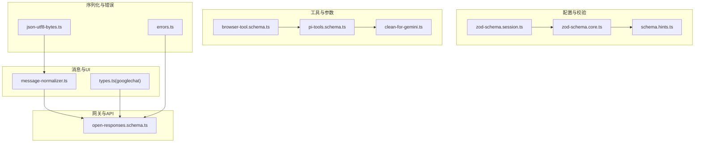
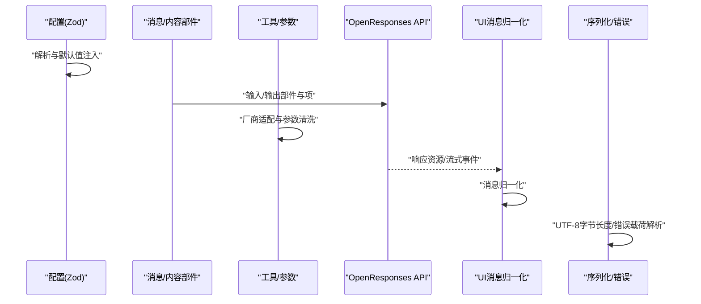
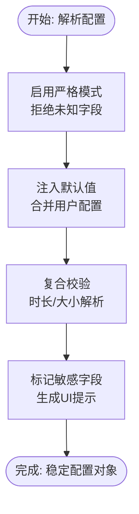
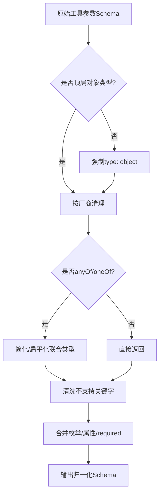
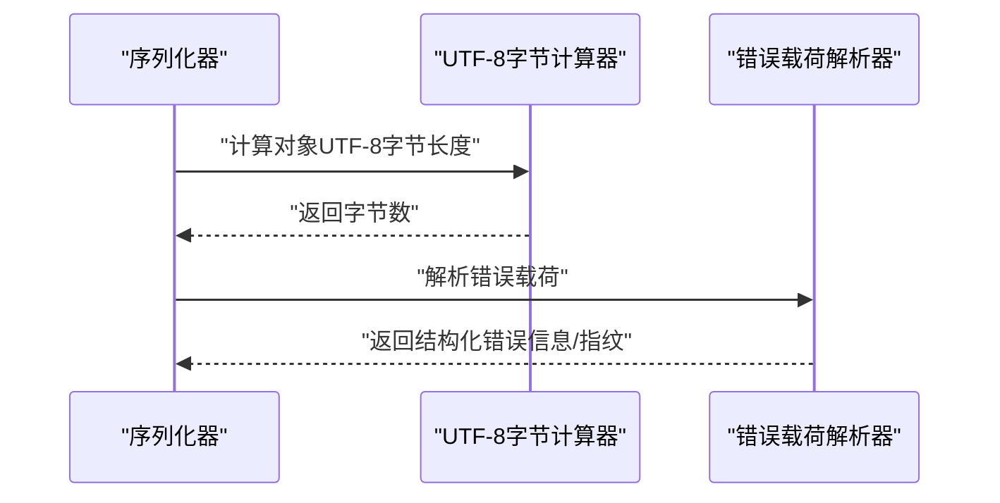
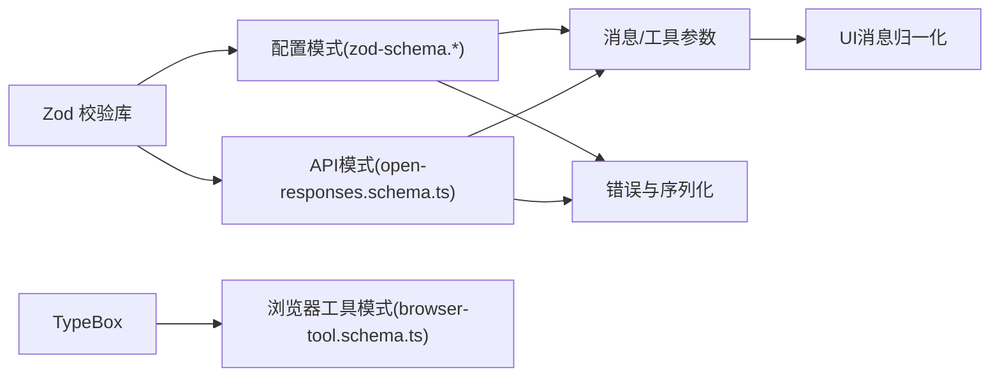

# 数据模型

## 目录
1. [简介](#简介)
2. [项目结构](#项目结构)
3. [核心组件](#核心组件)
4. [架构总览](#架构总览)
5. [详细组件分析](#详细组件分析)
6. [依赖关系分析](#依赖关系分析)
7. [性能考量](#性能考量)
8. [故障排查指南](#故障排查指南)
9. [结论](#结论)
10. [附录](#附录)

## 简介
本文件为 OpenClaw 的数据模型技术参考，聚焦于以下方面：
- 配置模式设计与 Zod 校验：系统通过 Zod 定义严格的配置模式，覆盖会话、消息、命令、模型、TTS、媒体理解等子系统，并在解析阶段进行强约束校验与默认值注入。
- 消息格式与内容部件：统一的消息内容部件（文本、输出文本、图片、文件）以及消息项、函数调用、推理片段、引用项等，确保跨渠道与跨协议的一致表达。
- 工具定义与参数规范化：针对不同模型厂商（如 Gemini、xAI、OpenAI 等）对 JSON Schema 的差异，提供工具参数的清洗与归一化策略。
- API 响应结构：定义 OpenResponses API 的请求体、资源对象、流式事件类型，明确状态枚举与计费用量结构。
- 序列化与一致性：提供 UTF-8 字节长度计算工具，保障跨组件间数据体积与编码一致性；并给出错误载荷解析与指纹化策略。
- 迁移与版本兼容：通过严格字段校验、默认值策略与兼容性标记，降低配置变更带来的破坏性风险。

## 项目结构
围绕数据模型的关键目录与文件如下：
- 配置模式与校验：src/config 下的 zod-schema.* 文件定义了会话、核心配置、敏感信息、提示词等模式。
- 网关与 API：src/gateway 下的 open-responses.schema.ts 定义了 OpenResponses API 的输入、输出与流式事件。
- 工具与参数清洗：src/agents 下的 pi-tools.schema.ts、browser-tool.schema.ts 与 schema/clean-for-gemini.ts 提供工具参数的标准化与厂商适配。
- UI 与消息归一化：ui/src/ui/chat/message-normalizer.ts 将后端消息归一化为前端一致结构。
- 错误与序列化：src/agents/pi-embedded-helpers/errors.ts 提供错误载荷解析；src/infra/json-utf8-bytes.ts 提供字节长度计算。

图表来源
- [zod-schema.session.ts](file://src/config/zod-schema.session.ts#L1-L215)
- [zod-schema.core.ts](file://src/config/zod-schema.core.ts#L1-L732)
- [open-responses.schema.ts](file://src/gateway/open-responses.schema.ts#L1-L362)
- [pi-tools.schema.ts](file://src/agents/pi-tools.schema.ts#L1-L208)
- [browser-tool.schema.ts](file://src/agents/tools/browser-tool.schema.ts#L1-L139)
- [clean-for-gemini.ts](file://src/agents/schema/clean-for-gemini.ts#L1-L416)
- [message-normalizer.ts](file://ui/src/ui/chat/message-normalizer.ts#L1-L36)
- [types.ts](file://extensions/googlechat/src/types.ts#L1-L73)
- [json-utf8-bytes.ts](file://src/infra/json-utf8-bytes.ts#L1-L7)
- [errors.ts](file://src/agents/pi-embedded-helpers/errors.ts#L465-L575)

章节来源
- [zod-schema.session.ts](file://src/config/zod-schema.session.ts#L1-L215)
- [zod-schema.core.ts](file://src/config/zod-schema.core.ts#L1-L732)
- [open-responses.schema.ts](file://src/gateway/open-responses.schema.ts#L1-L362)
- [pi-tools.schema.ts](file://src/agents/pi-tools.schema.ts#L1-L208)
- [browser-tool.schema.ts](file://src/agents/tools/browser-tool.schema.ts#L1-L139)
- [clean-for-gemini.ts](file://src/agents/schema/clean-for-gemini.ts#L1-L416)
- [message-normalizer.ts](file://ui/src/ui/chat/message-normalizer.ts#L1-L36)
- [types.ts](file://extensions/googlechat/src/types.ts#L1-L73)
- [json-utf8-bytes.ts](file://src/infra/json-utf8-bytes.ts#L1-L7)
- [errors.ts](file://src/agents/pi-embedded-helpers/errors.ts#L465-L575)

## 核心组件
- 配置模式与校验
  - 会话配置：包含作用域、重置策略、发送策略、线程绑定、维护策略等，均以 Zod 严格模式定义并支持默认值注入。
  - 核心配置：涵盖模型提供方、模型定义、兼容性标记、TTS 配置、队列与入站防抖、媒体理解、链接理解、可执行后端等。
  - 敏感信息与 UI 提示：通过注册敏感字段与路径映射，生成 UI 建议与安全提示。
- 消息与内容部件
  - 输入文本、输出文本、输入图片（URL/base64）、输入文件（URL/base64）等部件，以及消息项、函数调用、函数输出、推理片段、引用项等。
- 工具定义与参数
  - 函数型工具定义，以及浏览器工具的扁平化参数模式，满足不同模型厂商对 JSON Schema 的约束。
- API 响应结构
  - 请求体、响应资源、状态枚举、输出项、计费用量、流式事件类型等。
- 序列化与一致性
  - UTF-8 字节长度计算，错误载荷解析与指纹化，保障跨组件数据一致性与可观测性。

章节来源
- [zod-schema.session.ts](file://src/config/zod-schema.session.ts#L26-L144)
- [zod-schema.core.ts](file://src/config/zod-schema.core.ts#L206-L263)
- [open-responses.schema.ts](file://src/gateway/open-responses.schema.ts#L16-L206)
- [pi-tools.schema.ts](file://src/agents/pi-tools.schema.ts#L66-L199)
- [browser-tool.schema.ts](file://src/agents/tools/browser-tool.schema.ts#L88-L139)
- [json-utf8-bytes.ts](file://src/infra/json-utf8-bytes.ts#L1-L7)
- [errors.ts](file://src/agents/pi-embedded-helpers/errors.ts#L465-L575)

## 架构总览
下图展示数据模型在系统中的交互关系：配置层通过 Zod 校验生成稳定的运行时结构；消息与工具参数经由清洗与归一化，最终进入网关 API；UI 层负责将后端消息归一化为一致结构；序列化与错误处理贯穿各组件。

图表来源
- [zod-schema.session.ts](file://src/config/zod-schema.session.ts#L26-L144)
- [open-responses.schema.ts](file://src/gateway/open-responses.schema.ts#L16-L206)
- [pi-tools.schema.ts](file://src/agents/pi-tools.schema.ts#L66-L199)
- [message-normalizer.ts](file://ui/src/ui/chat/message-normalizer.ts#L11-L36)
- [json-utf8-bytes.ts](file://src/infra/json-utf8-bytes.ts#L1-L7)
- [errors.ts](file://src/agents/pi-embedded-helpers/errors.ts#L494-L535)

## 详细组件分析

### 配置模式与Zod校验
- 设计原则
  - 使用严格模式（strict）确保未知字段被拒绝；通过 default 注入合理的默认行为。
  - 对时间、大小、枚举、嵌套对象进行细粒度约束，并在 superRefine 中进行复合校验（如时长与容量解析）。
  - 将敏感字段通过 register(sensitive) 标记，配合 UI 提示与日志脱敏。
- 关键要点
  - 会话重置策略：支持按天与空闲两种模式，允许指定小时与分钟阈值。
  - 发送策略：基于通道的允许/拒绝规则，支持全局与按通道维度配置。
  - 维护策略：支持裁剪、轮转、保留期、磁盘上限与高水位等，均进行单位解析与范围校验。
  - 类型模式：typingMode 支持多种模式，测试用例覆盖合法与非法值。
- 实践建议
  - 在新增配置字段时，优先采用 strict 并提供默认值，避免运行时缺省导致的歧义。
  - 对涉及外部资源的字段（如超时、大小）使用 superRefine 进行解析与校验。

图表来源
- [zod-schema.session.ts](file://src/config/zod-schema.session.ts#L85-L141)
- [zod-schema.core.ts](file://src/config/zod-schema.core.ts#L150-L181)
- [schema.hints.ts](file://src/config/schema.hints.ts#L203-L233)
- [zod-schema.typing-mode.test.ts](file://src/config/zod-schema.typing-mode.test.ts#L5-L14)

章节来源
- [zod-schema.session.ts](file://src/config/zod-schema.session.ts#L26-L144)
- [zod-schema.core.ts](file://src/config/zod-schema.core.ts#L150-L181)
- [schema.hints.ts](file://src/config/schema.hints.ts#L203-L233)
- [schema.hints.test.ts](file://src/config/schema.hints.test.ts#L36-L57)
- [zod-schema.typing-mode.test.ts](file://src/config/zod-schema.typing-mode.test.ts#L5-L14)

### 消息格式与内容部件
- 内容部件
  - 文本类：输入文本、输出文本。
  - 图片类：支持 URL 与 base64，限定媒体类型与数据最小长度。
  - 文件类：支持 URL 与 base64，包含可选文件名与媒体类型。
- 消息项与函数调用
  - 消息项：角色（system/developer/user/assistant）与字符串或部件数组的内容。
  - 函数调用：调用 ID、名称与参数（字符串）。
  - 函数输出：调用 ID 与输出字符串。
  - 推理片段：支持内容、加密内容与摘要。
  - 引用项：通过 ID 引用已存在项。
- 流式事件
  - 响应生命周期事件：created/in_progress/completed/failed。
  - 输出项事件：added/done。
  - 文本增量事件：content_part 与 output_text 的增量与完成事件。

```mermaid
classDiagram
class ContentPart {
+type
+text
+source
}
class MessageItem {
+type
+role
+content
}
class FunctionCallItem {
+type
+id
+call_id
+name
+arguments
}
class FunctionCallOutputItem {
+type
+call_id
+output
}
class ReasoningItem {
+type
+content
+encrypted_content
+summary
}
class ItemReferenceItem {
+type
+id
}
class ResponseResource {
+id
+object
+created_at
+status
+model
+output
+usage
}
class StreamingEvent {
+type
}
ContentPart <|-- InputTextContentPart
ContentPart <|-- OutputTextContentPart
ContentPart <|-- InputImageContentPart
ContentPart <|-- InputFileContentPart
MessageItem <|-- ItemParam
FunctionCallItem <|-- ItemParam
FunctionCallOutputItem <|-- ItemParam
ReasoningItem <|-- ItemParam
ItemReferenceItem <|-- ItemParam
ResponseResource --> OutputItem
StreamingEvent <|-- ResponseCreatedEvent
StreamingEvent <|-- ResponseInProgressEvent
StreamingEvent <|-- ResponseCompletedEvent
StreamingEvent <|-- ResponseFailedEvent
StreamingEvent <|-- OutputItemAddedEvent
StreamingEvent <|-- OutputItemDoneEvent
StreamingEvent <|-- ContentPartAddedEvent
StreamingEvent <|-- ContentPartDoneEvent
StreamingEvent <|-- OutputTextDeltaEvent
StreamingEvent <|-- OutputTextDoneEvent
```

图表来源
- [open-responses.schema.ts](file://src/gateway/open-responses.schema.ts#L16-L206)
- [open-responses.schema.ts](file://src/gateway/open-responses.schema.ts#L224-L281)
- [open-responses.schema.ts](file://src/gateway/open-responses.schema.ts#L287-L361)

章节来源
- [open-responses.schema.ts](file://src/gateway/open-responses.schema.ts#L16-L206)
- [open-responses.schema.ts](file://src/gateway/open-responses.schema.ts#L224-L281)
- [open-responses.schema.ts](file://src/gateway/open-responses.schema.ts#L287-L361)

### 工具定义与参数规范化
- 工具参数清洗
  - 针对不同模型厂商的 JSON Schema 限制，提供清洗与归一化策略：
    - Gemini：剔除不支持的关键字，处理 anyOf/oneOf，必要时扁平化联合类型。
    - xAI：剔除验证约束关键字。
    - OpenAI：要求顶层为对象类型，否则强制添加 type: "object"。
- 参数归一化流程
  - 合并枚举值、提取公共属性、推导 required 列表、应用厂商特定清理。
  - 最终输出可在所有受支持的模型上稳定使用。

图表来源
- [pi-tools.schema.ts](file://src/agents/pi-tools.schema.ts#L66-L199)
- [clean-for-gemini.ts](file://src/agents/schema/clean-for-gemini.ts#L210-L366)

章节来源
- [pi-tools.schema.ts](file://src/agents/pi-tools.schema.ts#L66-L199)
- [clean-for-gemini.ts](file://src/agents/schema/clean-for-gemini.ts#L1-L416)

### API方法的参数与返回值规范
- 请求体 CreateResponseBody
  - 必填：model、input（字符串或部件数组）。
  - 可选：instructions、tools、tool_choice、stream、max_output_tokens、max_tool_calls、user、metadata、store、previous_response_id、reasoning、truncation 等。
- 响应资源 ResponseResource
  - 必填：id、object、created_at、status、model、output、usage。
  - 可选：error。
- 计费用量 Usage
  - 必填：input_tokens、output_tokens、total_tokens。
- 流式事件 StreamingEvent
  - 多种事件类型，覆盖响应生命周期、输出项与内容部件的增量与完成事件。

章节来源
- [open-responses.schema.ts](file://src/gateway/open-responses.schema.ts#L181-L206)
- [open-responses.schema.ts](file://src/gateway/open-responses.schema.ts#L264-L281)
- [open-responses.schema.ts](file://src/gateway/open-responses.schema.ts#L256-L262)
- [open-responses.schema.ts](file://src/gateway/open-responses.schema.ts#L351-L361)

### 数据序列化与反序列化机制
- UTF-8 字节长度
  - 提供通用的 jsonUtf8Bytes 工具，优先使用 JSON.stringify，失败时回退到 String 转换，确保在循环引用等异常情况下仍能估算字节数。
- 错误载荷解析
  - 从原始字符串中解析可能的 JSON 错误载荷，支持带 HTTP 状态码前缀的场景，并生成稳定指纹用于去重与追踪。

图表来源
- [json-utf8-bytes.ts](file://src/infra/json-utf8-bytes.ts#L1-L7)
- [json-utf8-bytes.test.ts](file://src/infra/json-utf8-bytes.test.ts#L1-L16)
- [errors.ts](file://src/agents/pi-embedded-helpers/errors.ts#L494-L535)

章节来源
- [json-utf8-bytes.ts](file://src/infra/json-utf8-bytes.ts#L1-L7)
- [json-utf8-bytes.test.ts](file://src/infra/json-utf8-bytes.test.ts#L1-L16)
- [errors.ts](file://src/agents/pi-embedded-helpers/errors.ts#L494-L535)

### 数据迁移与版本兼容策略
- 字段兼容性
  - 通过 strict 模式与默认值策略，确保新增字段不会破坏现有配置。
  - 对于废弃字段（如 resetByType.dm），保留向后兼容并在注释中标明替代方案。
- 单位与范围
  - 使用 parseDurationMs 与 parseByteSize 进行统一解析，避免字符串格式不一致导致的运行时问题。
- 模型兼容标记
  - ModelCompatSchema 提供对不同模型能力的标记，便于在调用链路中做条件分支与降级。

章节来源
- [zod-schema.session.ts](file://src/config/zod-schema.session.ts#L44-L46)
- [zod-schema.session.ts](file://src/config/zod-schema.session.ts#L85-L141)
- [zod-schema.core.ts](file://src/config/zod-schema.core.ts#L185-L204)

### 实际数据示例与验证规则
- 配置示例（会话）
  - 包含作用域、重置模式、维护策略、发送策略等字段，严格遵循 Zod 模式并通过测试用例覆盖合法/非法值。
- 消息示例（内容部件）
  - 文本、图片（URL/base64）、文件（URL/base64）等部件，以及消息项、函数调用、推理片段等。
- 工具参数示例（浏览器工具）
  - 扁平化参数模式，避免深层 anyOf 导致的厂商校验失败；支持多种动作与目标。
- 错误载荷示例
  - 支持带 HTTP 状态码前缀的字符串，自动识别并解析为结构化错误对象，生成稳定指纹。

章节来源
- [zod-schema.session.ts](file://src/config/zod-schema.session.ts#L26-L144)
- [open-responses.schema.ts](file://src/gateway/open-responses.schema.ts#L16-L206)
- [browser-tool.schema.ts](file://src/agents/tools/browser-tool.schema.ts#L88-L139)
- [errors.ts](file://src/agents/pi-embedded-helpers/errors.ts#L494-L535)

## 依赖关系分析
- 组件耦合
  - 配置层（zod-schema.*）为系统提供稳定的输入契约，其他模块（消息、工具、网关）均依赖其定义。
  - 工具参数清洗模块（pi-tools.schema.ts 与 clean-for-gemini.ts）独立于具体模型实现，仅依赖 Zod 与类型工具。
  - UI 层通过 message-normalizer.ts 与后端消息结构解耦，统一归一化为前端可用的消息对象。
- 外部依赖
  - Zod 作为核心校验库，贯穿配置与 API 定义。
  - TypeBox 用于构建浏览器工具的参数模式（browser-tool.schema.ts）。

图表来源
- [zod-schema.session.ts](file://src/config/zod-schema.session.ts#L1-L215)
- [open-responses.schema.ts](file://src/gateway/open-responses.schema.ts#L1-L362)
- [browser-tool.schema.ts](file://src/agents/tools/browser-tool.schema.ts#L1-L139)
- [message-normalizer.ts](file://ui/src/ui/chat/message-normalizer.ts#L1-L36)

章节来源
- [zod-schema.session.ts](file://src/config/zod-schema.session.ts#L1-L215)
- [open-responses.schema.ts](file://src/gateway/open-responses.schema.ts#L1-L362)
- [browser-tool.schema.ts](file://src/agents/tools/browser-tool.schema.ts#L1-L139)
- [message-normalizer.ts](file://ui/src/ui/chat/message-normalizer.ts#L1-L36)

## 性能考量
- 校验开销
  - Zod 的严格模式与 superRefine 在启动与配置更新时带来一次性成本；建议在配置加载阶段集中执行，避免频繁重复校验。
- 序列化成本
  - UTF-8 字节长度计算在大对象上可能产生额外开销，建议仅在需要统计或限流时调用。
- 清洗策略
  - 工具参数清洗涉及递归遍历与扁平化，建议缓存厂商适配结果，减少重复计算。

## 故障排查指南
- 配置校验失败
  - 检查字段类型与范围（如时长、大小、枚举），确认是否符合 parseDurationMs/parseByteSize 的格式要求。
  - 对于敏感字段，确认已在 schema.hints.ts 中注册并生成 UI 提示。
- 工具参数不生效
  - 确认是否满足目标模型的 JSON Schema 限制（如 OpenAI 要求顶层对象类型）。
  - 使用 normalizeToolParameters 或 cleanToolSchemaForGemini 进行清洗与归一化。
- 消息解析异常
  - 使用 message-normalizer.ts 将后端消息归一化为前端一致结构，检查 role 与 content 类型。
- 错误载荷识别
  - 使用 errors.ts 的解析与指纹化功能，快速定位重复错误并进行聚合。

章节来源
- [schema.hints.ts](file://src/config/schema.hints.ts#L203-L233)
- [pi-tools.schema.ts](file://src/agents/pi-tools.schema.ts#L66-L199)
- [message-normalizer.ts](file://ui/src/ui/chat/message-normalizer.ts#L11-L36)
- [errors.ts](file://src/agents/pi-embedded-helpers/errors.ts#L494-L535)

## 结论
OpenClaw 的数据模型通过 Zod 严格模式与默认值策略，确保配置层的稳定性与可演进性；通过内容部件与消息项的统一建模，实现跨渠道与跨协议的一致表达；借助工具参数清洗与厂商适配，提升工具在多模型平台上的可用性；结合序列化与错误处理机制，保障跨组件间的数据一致性与可观测性。建议在扩展新功能时遵循现有模式，优先使用 strict 与默认值，确保配置与 API 的长期兼容。

## 附录
- 相关类型与接口
  - ContentPart、MessageItem、FunctionCallItem、FunctionCallOutputItem、ReasoningItem、ItemReferenceItem、ResponseResource、StreamingEvent 等。
- UI 与消息
  - UI 层通过 message-normalizer.ts 归一化消息，便于渲染与交互。
- 渠道类型
  - Google Chat 的空间、用户、线程、附件、标注、消息、事件、反应等类型定义。

章节来源
- [open-responses.schema.ts](file://src/gateway/open-responses.schema.ts#L85-L145)
- [open-responses.schema.ts](file://src/gateway/open-responses.schema.ts#L254-L281)
- [message-normalizer.ts](file://ui/src/ui/chat/message-normalizer.ts#L1-L36)
- [types.ts](file://extensions/googlechat/src/types.ts#L1-L73)