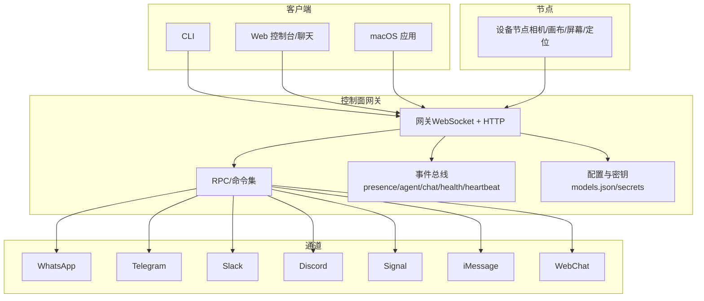
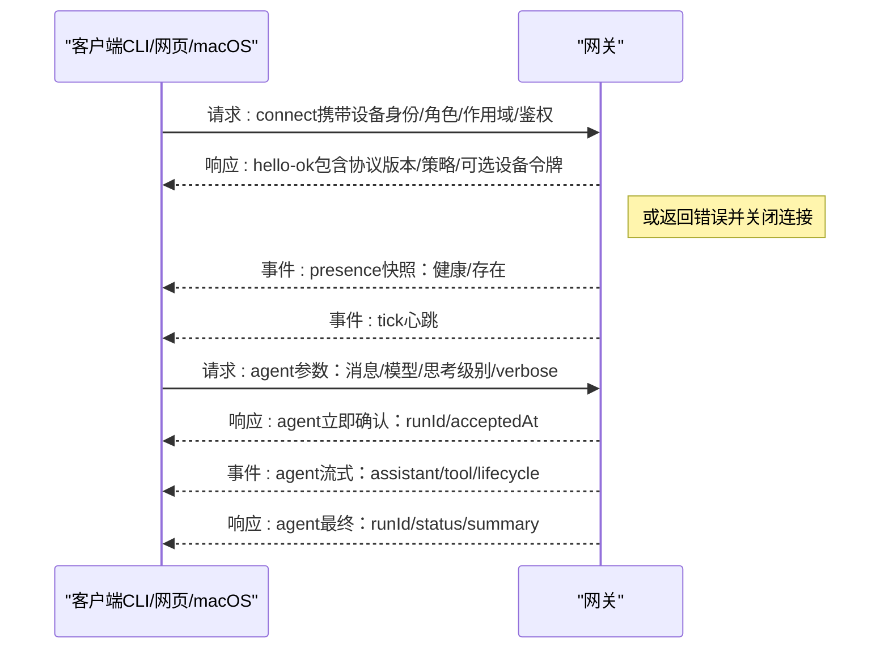
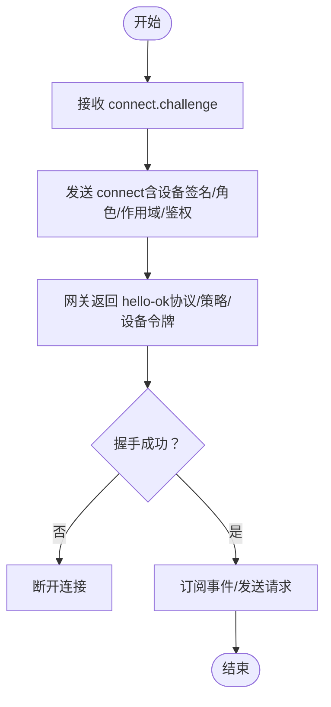
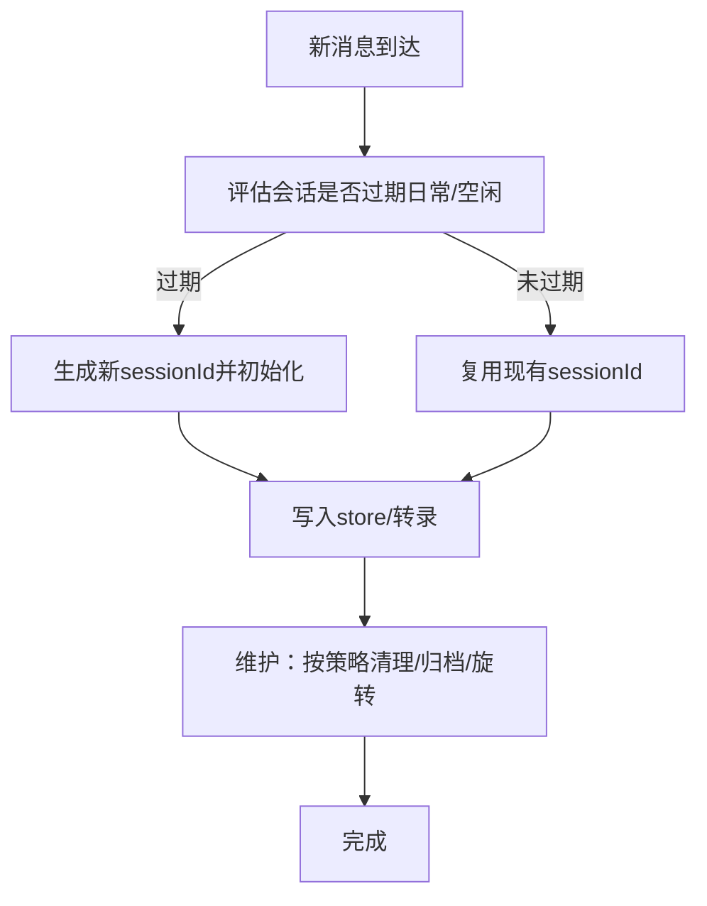
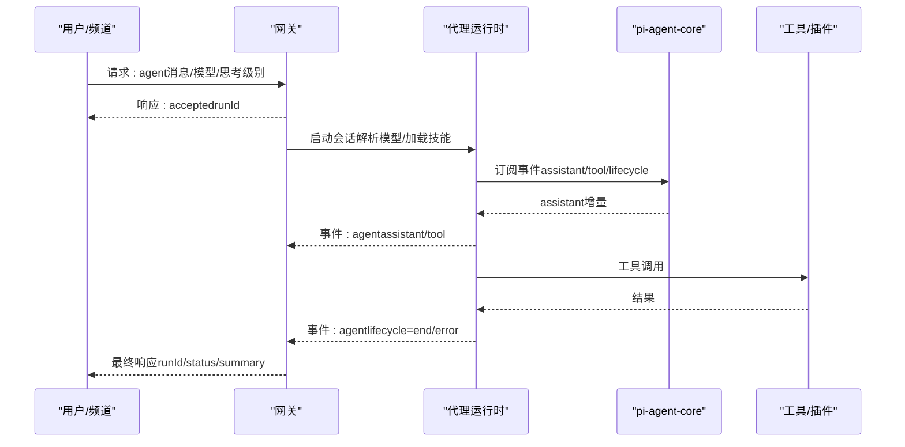
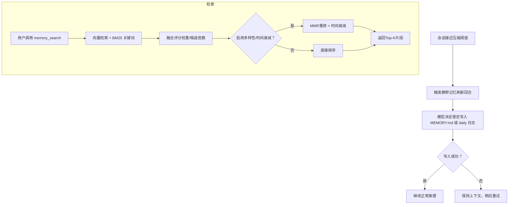
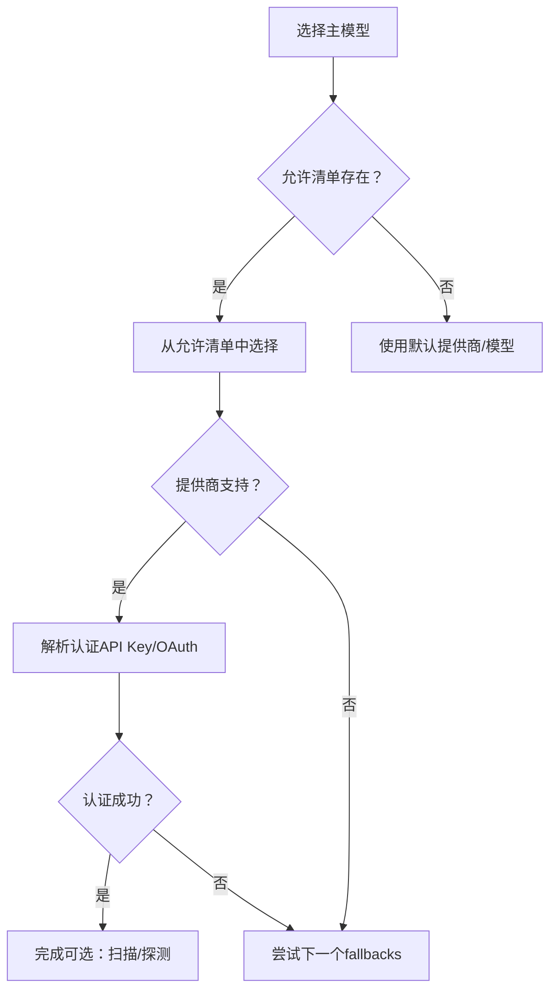
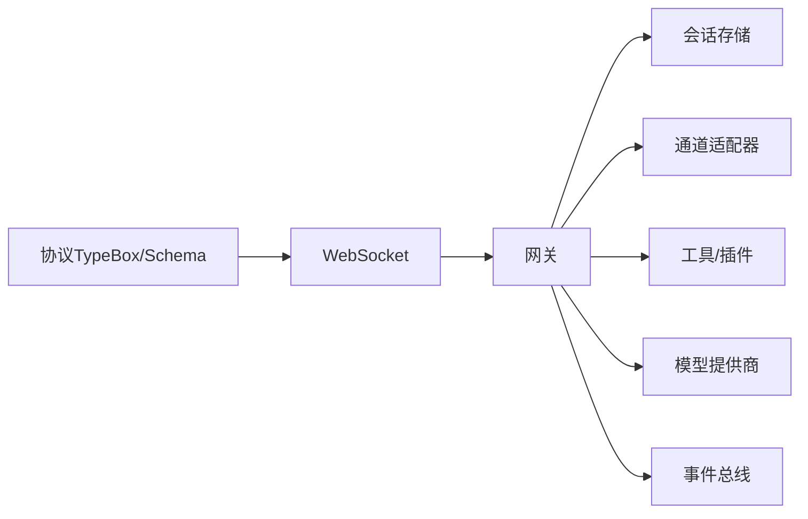

# 核心概念

## 目录
1. [引言](#引言)
2. [项目结构](#项目结构)
3. [核心组件](#核心组件)
4. [架构总览](#架构总览)
5. [详细组件分析](#详细组件分析)
6. [依赖关系分析](#依赖关系分析)
7. [性能考量](#性能考量)
8. [故障排查指南](#故障排查指南)
9. [结论](#结论)
10. [附录](#附录)

## 引言
本文件面向OpenClaw的核心概念与实现，聚焦以下主题：
- 网关架构与WebSocket协议设计：单一路由与控制平面、节点与客户端角色、握手与鉴权、事件流与幂等性。
- 控制平面如何协调各子系统：会话管理、通道路由、工具与插件、消息发送与回执、远程访问与安全。
- AI代理系统设计理念：工作区契约、引导文件注入、技能加载、工具调用、流式输出与块级回复。
- 模型提供商集成策略：内置与自定义提供商、密钥轮换、失败回退、扫描与别名。
- 代理循环（agent loop）工作机制：入口点、队列与并发、提示组装、钩子、流式输出、压缩与重试、超时与早停。
- 实例与图示：连接生命周期、代理运行序列、内存检索流程、模型选择与回退。

## 项目结构
OpenClaw以“网关（WebSocket控制面）+ 多通道接入 + 本地/设备节点 + 工具与技能”的分层架构组织。核心要点：
- 网关作为单一控制平面，承载会话、通道、工具、事件与HTTP API（含OpenAI兼容接口）。
- 客户端（CLI/网页/桌面应用）与节点（macOS/iOS/Android/headless）通过WebSocket连接网关。
- 通道适配器（WhatsApp/Telegram/Slack/Discord/Signal/iMessage/WebChat等）在网关内统一编排。
- 代理运行时基于嵌入式pi-mono，结合工作区、技能与工具，完成推理、工具调用与流式回复。

章节来源
- file://README.md#L185-L239
- file://docs/concepts/architecture.md#L12-L58

## 核心组件
- 网关（Daemon）
  - 维护提供商连接，暴露类型化WS API（请求/响应/服务器推送事件），校验帧合法性，发出presence/agent/chat/health/heartbeat/cron等事件。
- 客户端（mac应用/CLI/网页）
  - 单连接，发送请求（health/status/send/agent/system-presence），订阅事件（tick/agent/presence/shutdown）。
- 节点（macOS/iOS/Android/headless）
  - 连接同一WS服务器，声明role: node，提供能力清单（caps/commands/权限），用于本地动作（canvas/camera/screen/location/system.run/system.notify）。
- WebChat
  - 使用网关WS API拉取历史与发送消息；在远端部署下通过SSH/Tailscale隧道连接。

章节来源
- file://docs/concepts/architecture.md#L29-L58
- file://docs/gateway/protocol.md#L10-L21

## 架构总览
网关是OpenClaw的“产品即助手”，控制平面负责：
- 会话与状态：按主键/群组/通道/账号隔离，维护store与JSONL转录。
- 通道与路由：统一接入多渠道，按策略进行入站路由与出站投递。
- 工具与插件：内置工具集与可扩展插件生态，支持沙箱与权限控制。
- 事件与可观测：心跳、健康、存在性、代理事件、定时任务等。
- 远程与安全：Tailscale/SSH隧道、令牌/密码认证、设备身份与签名、TLS指纹。

章节来源
- file://docs/concepts/architecture.md#L59-L78
- file://docs/gateway/protocol.md#L22-L91

## 详细组件分析

### 网关与WebSocket协议
- 传输与帧格式
  - 文本帧，JSON载荷；首个帧必须是connect。
  - 请求：&#123;type:"req", id, method, params&#125; → &#123;type:"res", id, ok, payload|error&#125;
  - 事件：&#123;type:"event", event, payload, seq?, stateVersion?&#125;
- 握手与鉴权
  - 先收到connect.challenge，再提交connect（含min/max协议号、客户端信息、角色/作用域/能力/命令/权限、鉴权、设备签名）。
  - 若设置OPENCLAW_GATEWAY_TOKEN或--token，connect.params.auth.token必须匹配否则断开。
  - 设备身份要求：稳定设备指纹+公钥+签名+时间戳+随机数；本地（loopback/网关主机尾网地址）可自动批准。
- 幂等性与去重
  - 对副作用方法（如send/agent）需要幂等键，服务端保留短期去重缓存。
- 角色与作用域
  - operator：控制面客户端（CLI/UI/自动化）；node：能力宿主（相机/画布/屏幕/定位/系统命令）。
  - operator常见作用域：read/write/admin/approvals/pairing。
  - node声明caps/commands/permissions，网关侧允许列表生效。

章节来源
- file://docs/gateway/protocol.md#L17-L134
- file://docs/gateway/protocol.md#L135-L261

### 会话管理（Session）
- 主键与隔离
  - 主对话默认使用agent:&lt;agentId&gt;:&lt;mainKey&gt;（默认main），DM按dmScope策略隔离（main/per-peer/per-channel-peer/per-account-channel-peer）。
  - 群组/频道独立键：agent:&lt;agentId&gt;:&lt;channel&gt;:group:&lt;id&gt;或agent:&lt;agentId&gt;:&lt;channel&gt;:channel:&lt;id&gt;。
- 存储与转录
  - store：~/.openclaw/agents/&lt;agentId&gt;/sessions/sessions.json（映射sessionKey→&#123;sessionId, 更新时间,...&#125;）。
  - 转录：~/.openclaw/agents/&lt;agentId&gt;/sessions/&lt;SessionId&gt;.jsonl。
- 维护与清理
  - 支持模式：warn/enforce；按时间窗口、条目上限、store大小、归档保留期等策略清理。
- 重置策略
  - 日常重置（默认4:00本地时间）与空闲重置（可选），二者先到期者生效；支持按类型/按通道覆盖。
- 发送策略
  - 基于规则的阻断/放行（按通道/聊天类型/键前缀），支持运行时覆盖。

章节来源
- file://docs/concepts/session.md#L10-L73
- file://docs/concepts/session.md#L74-L120
- file://docs/concepts/session.md#L177-L218

### 代理循环（Agent Loop）
- 入口
  - 网关RPC：agent与agent.wait；CLI：agent命令。
- 执行路径
  1) agent RPC校验参数、解析会话、持久化元数据，立即返回&#123;runId, acceptedAt&#125;。
  2) agentCommand运行代理：解析模型/思考/verbose默认值、加载技能快照、调用runEmbeddedPiAgent。
  3) runEmbeddedPiAgent：按会话键与全局队列串行化运行、构建pi会话、订阅事件、超时中止、返回结果与用量。
  4) subscribeEmbeddedPiSession桥接事件到OpenClaw agent流：tool/assistant/lifecycle。
  5) agent.wait使用waitForAgentJob等待lifecycle end/error，返回状态与时间戳。
- 队列与并发
  - 按会话键串行，必要时经全局队列；避免工具/会话竞态，保持历史一致性。
- 提示组装与系统提示
  - 由OpenClaw基础提示、技能提示、引导上下文与每轮覆盖组成；考虑模型上下文限制与压缩预留。
- 流式与部分回复
  - 来自pi-agent-core的assistant增量；块级流可在text_end或message_end发出；推理流可单独或作为块回复。
- 工具执行与消息工具
  - 工具开始/更新/结束事件在tool流；工具结果在写入前做尺寸与图像裁剪；消息类工具去重。
- 压缩与重试
  - 自动压缩触发后可能重试；重试时内存缓冲与工具摘要重置，避免重复输出。
- 超时与早停
  - agent.wait默认30s（仅等待）；代理运行默认600s；可被AbortSignal、网关断开或RPC超时打断。

章节来源
- file://docs/concepts/agent-loop.md#L18-L50
- file://docs/concepts/agent-loop.md#L51-L96
- file://docs/concepts/agent-loop.md#L97-L149

### AI代理系统（工作区与技能）
- 工作区契约
  - 单一agent工作目录（agents.defaults.workspace）作为工具与上下文的唯一工作目录；沙箱非main会话可覆盖为会话级工作区。
- 引导文件注入
  - AGENTS.md/SOUL.md/TOOLS.md/BOOTSTRAP.md/IDENTITY.md/USER.md在新会话首回合注入；缺失文件以占位符替代；可禁用首次创建。
- 内置工具
  - 系统读/执行/编辑/写入等核心工具始终可用，受工具策略约束；apply_patch可选且受管控。
- 技能加载
  - 三处来源（打包/托管/工作区），后者优先；可通过配置/环境门控。
- 会话存储
  - JSONL转录位于~/.openclaw/agents/&lt;agentId&gt;/sessions/&lt;SessionId&gt;.jsonl；不读取旧版Pi/Tau目录。
- 流式与块级回复
  - 块级流默认关闭；可通过配置调整边界与合并策略；verbose工具摘要在开始即发。

章节来源
- file://docs/concepts/agent.md#L12-L48
- file://docs/concepts/agent.md#L49-L72
- file://docs/concepts/agent.md#L73-L105

### 记忆系统（Workspace + 搜索）
- 文件布局
  - 默认两层：memory/YYYY-MM-DD.md（日志，仅今日/昨日读取）、MEMORY.md（可选，仅主私会话加载）。
- 工具
  - memory_search：语义召回片段；memory_get：读取指定Markdown文件/行范围。
- 自动记忆刷新（预压缩提醒）
  - 当会话接近自动压缩，触发静默代理回合，提醒模型在上下文压缩前写入持久记忆；默认静默（NO_REPLY），可配置系统/用户提示。
- 向量检索与混合搜索
  - 默认启用；可选sqlite-vec加速；支持BM25关键词与向量相似度融合；可开启MMR多样性与时间衰减。
- 会话记忆检索（实验）
  - 可索引会话转录并通过memory_search检索；异步增量同步，结果仅片段。
- 本地嵌入与回退
  - 本地模型自动下载；失败时可回退至远程提供商；支持批量索引（OpenAI/Gemini）。

章节来源
- file://docs/concepts/memory.md#L17-L51
- file://docs/concepts/memory.md#L52-L91
- file://docs/concepts/memory.md#L92-L267
- file://docs/concepts/memory.md#L268-L451
- file://docs/concepts/memory.md#L452-L741

### 模型提供商集成策略
- 快速规则
  - 模型引用格式：provider/model；agents.defaults.models作为允许清单；CLI：onboard/models list/set。
- 密钥轮换
  - 支持多级轮换（OPENCLAW_LIVE_* > 环境变量列表/编号键 > 主键），仅在速率限制错误时重试下一个密钥。
- 内置提供商（无需models.providers配置）
  - OpenAI、Anthropic、OpenAI Code（Codex）、OpenCode Zen、Google Gemini（API Key）、Google Vertex/Antigravity/Gemini CLI（OAuth插件）、Z.AI/GLM、Vercel AI Gateway、Kilo Gateway、OpenRouter、xAI、Mistral、Groq、Cerebras、GitHub Copilot、Hugging Face Inference等。
- 自定义/代理提供商
  - 通过models.providers（或models.json）添加自定义/兼容端点；可配置baseUrl/api/模型列表/兼容参数。
- CLI示例
  - onboard、models set/list/status等。

章节来源
- file://docs/concepts/model-providers.md#L14-L33
- file://docs/concepts/model-providers.md#L34-L167
- file://docs/concepts/model-providers.md#L168-L460
- file://docs/concepts/models.md#L16-L36

### 会话工具（Agent to Agent）
- 工具集合
  - sessions_list、sessions_history、sessions_send、sessions_spawn。
- 键模型
  - main键为literal "main"；群组键agent:&lt;agentId&gt;:&lt;channel&gt;:group:&lt;id&gt;；cron键cron:&lt;job.id>；hook键hook:&lt;uuid&gt;；node键node-&lt;nodeId&gt;。
- sessions_list
  - 支持过滤（kind/limit/activeMinutes/messageLimit），当sandboxed时默认仅可见spawn树。
- sessions_history
  - 获取单会话转录，可包含工具消息。
- sessions_send
  - 在另一会话发送消息，支持fire-and-forget或等待完成；完成后进行回环确认与公告步骤；可注入跨会话上下文。
- sessions_spawn
  - 在隔离会话中派生子代理运行，支持线程绑定、超时、附件挂载、沙箱继承与可见性控制；完成后公告结果。
- 可见性与沙箱
  - 默认tools.sessions.visibility为tree；沙箱可硬性限制为spawned/all。

章节来源
- file://docs/concepts/session-tool.md#L12-L28
- file://docs/concepts/session-tool.md#L29-L61
- file://docs/concepts/session-tool.md#L62-L77
- file://docs/concepts/session-tool.md#L78-L106
- file://docs/concepts/session-tool.md#L144-L185
- file://docs/concepts/session-tool.md#L186-L224

### 控制平面运维与安全
- 运行时模型
  - 单进程常驻，多路复用端口（WS控制/RPC、HTTP API、控制UI、钩子）；默认loopback绑定；默认需鉴权。
- 端口与绑定优先级
  - CLI/环境变量/配置；默认端口18789。
- 热重载模式
  - off/hot/restart/hybrid（默认）。
- 远程访问
  - 推荐Tailscale/VPN；SSH隧道；隧道内仍需鉴权。
- 安全与诊断
  - 无效/非connect帧拒绝并关闭；优雅关闭前广播shutdown事件；常见失败签名与修复建议。

章节来源
- file://docs/gateway/index.md#L68-L93
- file://docs/gateway/index.md#L108-L124
- file://docs/gateway/index.md#L216-L245

## 依赖关系分析
- 组件耦合
  - 网关对通道适配器、工具/插件、会话存储、模型提供商、事件总线强耦合；客户端/节点通过协议弱耦合。
- 外部依赖
  - WebSocket（文本帧/JSON）、JSON Schema（协议校验）、SQLite（会话与内存索引）、可选sqlite-vec加速、外部模型API（OpenAI/Anthropic/自定义）。
- 循环依赖
  - 无直接循环；代理运行时通过回调与事件解耦。
- 接口契约
  - TypeBox定义协议，生成JSON Schema与Swift模型；方法作用域与设备签名规则明确。

章节来源
- file://docs/concepts/architecture.md#L111-L116
- file://docs/gateway/protocol.md#L191-L199

## 性能考量
- 会话与转录
  - 大store写入延迟风险：合理设置维护策略（时间/数量/磁盘预算），避免高水位与过多归档。
- 流式与块级回复
  - 块级流默认关闭；根据通道特性与网络条件调整边界与合并策略，减少碎片与抖动。
- 模型与回退
  - 主模型选择更强更稳；低风险任务使用回退模型；合理配置图像模型回退。
- 内存检索
  - 启用sqlite-vec可显著提升向量查询；BM25+向量融合与MMR/时间衰减可改善召回质量与新鲜度。

## 故障排查指南
- 连接失败
  - 未鉴权绑定loopback外地址、端口冲突、配置为remote模式但未设置本地信任、auth不匹配。
- 事件丢失
  - 事件不重放；出现gap需刷新health/system-presence后再继续。
- 会话异常
  - 重置策略导致上下文丢失；检查daily/resetByType/resetByChannel配置；必要时手动清理store条目。
- 远程访问
  - Tailscale/SSH隧道需正确转发端口；隧道内仍需鉴权。

章节来源
- file://docs/gateway/index.md#L235-L245

## 结论
OpenClaw以“网关+协议+会话+通道+工具+模型”的清晰分层，实现了本地优先、安全可控、可扩展的个人AI助手平台。其核心优势在于：
- 单一控制面统一编排多通道与多节点；
- 明确的协议与设备身份体系保障安全与可审计；
- 以会话为中心的状态管理与维护策略；
- 可插拔的工具与技能生态；
- 多提供商模型集成与稳健的回退策略；
- 严谨的代理循环与流式输出，兼顾实时性与一致性。

## 附录
- 快速启动与健康检查
  - 启动：openclaw gateway --port 18789；健康：openclaw gateway status；日志：openclaw logs --follow。
- 远程访问
  - Tailscale Serve/Funnel或SSH隧道；隧道内仍需鉴权。
- 模型与提供商
  - onboard/models list/set/status；支持密钥轮换与失败回退；可扫描免费模型并探测工具/图像支持。

章节来源
- file://docs/gateway/index.md#L27-L67
- file://docs/gateway/index.md#L108-L124
- file://docs/concepts/models.md#L116-L138
- file://docs/concepts/model-providers.md#L451-L460