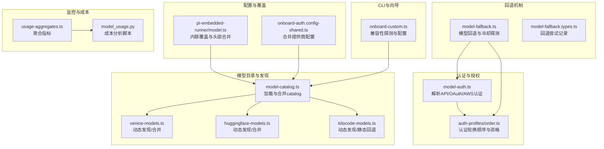
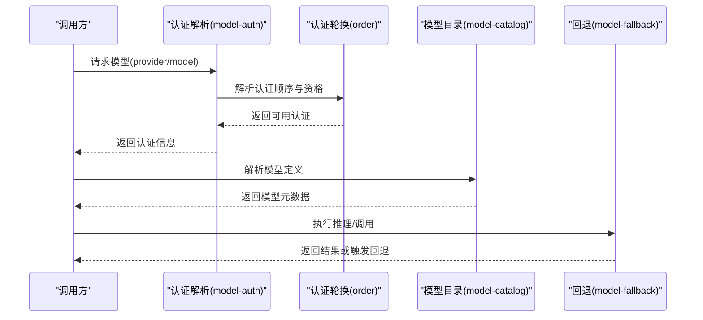
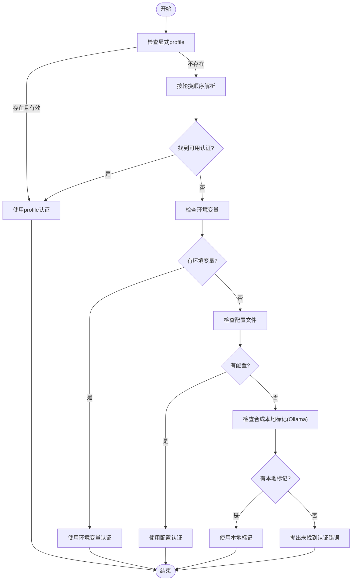
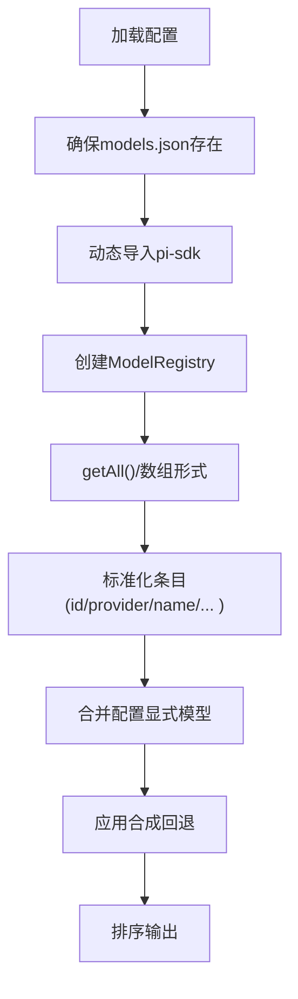
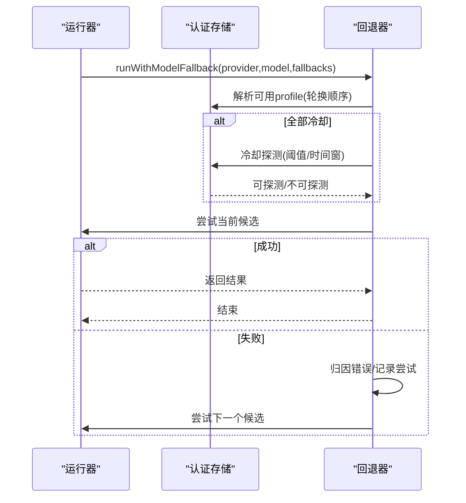
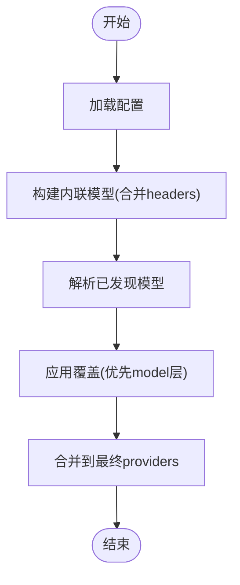
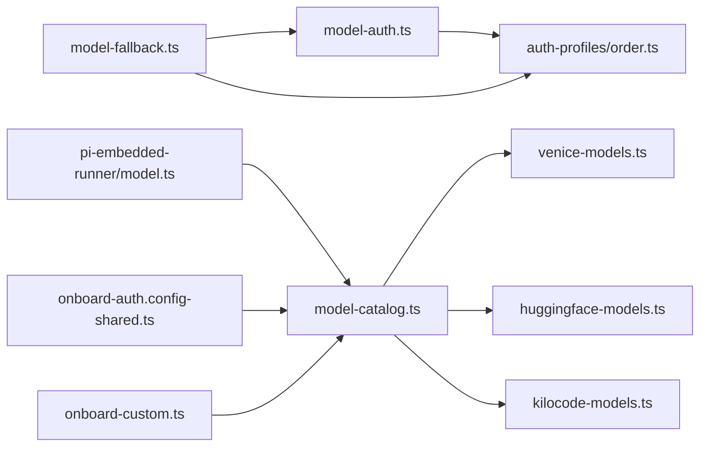

# 模型提供商

## 目录
1. [简介](#简介)
2. [项目结构](#项目结构)
3. [核心组件](#核心组件)
4. [架构总览](#架构总览)
5. [详细组件分析](#详细组件分析)
6. [依赖关系分析](#依赖关系分析)
7. [性能考量](#性能考量)
8. [故障排除指南](#故障排除指南)
9. [结论](#结论)
10. [附录](#附录)

## 简介
本文件面向OpenClaw模型提供商集成，系统化阐述统一接口抽象、多提供商支持策略、模型发现与选择、配置管理（含API密钥轮换）、回退机制（认证轮换与模型回退）、认证与授权（凭据轮换、权限验证、访问控制），并给出OpenAI、Anthropic、Google等主流提供商的集成要点与实践建议。同时提供性能监控、成本控制与故障排除的实操指南。

## 项目结构
围绕“模型提供商”的关键代码分布在以下模块：
- 认证与授权：解析与选择API密钥或OAuth令牌、AWS SDK认证、认证存储与轮换
- 回退机制：按配置链路与错误类型进行模型回退与探测
- 模型目录与发现：内置catalog与动态发现、自定义提供商注入
- 配置合并与覆盖：基于配置文件与内联配置的模型属性合并
- CLI与向导：一键onboard、兼容性探测、模型列表与设置
- 成本与监控：使用聚合与趋势追踪脚本

图示来源
- [src/agents/model-auth.ts](file://src/agents/model-auth.ts#L166-L269)
- [src/agents/auth-profiles/order.ts](file://src/agents/auth-profiles/order.ts#L30-L65)
- [src/agents/model-fallback.ts](file://src/agents/model-fallback.ts#L502-L715)
- [src/agents/model-catalog.ts](file://src/agents/model-catalog.ts#L193-L278)
- [src/agents/venice-models.ts](file://src/agents/venice-models.ts#L632-L680)
- [src/agents/huggingface-models.ts](file://src/agents/huggingface-models.ts#L196-L230)
- [src/agents/kilocode-models.ts](file://src/agents/kilocode-models.ts#L158-L190)
- [src/agents/pi-embedded-runner/model.ts](file://src/agents/pi-embedded-runner/model.ts#L141-L160)
- [src/commands/onboard-auth.config-shared.ts](file://src/commands/onboard-auth.config-shared.ts#L119-L213)
- [src/commands/onboard-custom.ts](file://src/commands/onboard-custom.ts#L700-L743)
- [src/shared/usage-aggregates.ts](file://src/shared/usage-aggregates.ts#L68-L109)
- [skills/model-usage/scripts/model_usage.py](file://skills/model-usage/scripts/model_usage.py#L96-L164)

章节来源
- [src/agents/model-auth.ts](file://src/agents/model-auth.ts#L1-L390)
- [src/agents/model-fallback.ts](file://src/agents/model-fallback.ts#L1-L769)
- [src/agents/model-catalog.ts](file://src/agents/model-catalog.ts#L1-L310)
- [src/agents/venice-models.ts](file://src/agents/venice-models.ts#L632-L680)
- [src/agents/huggingface-models.ts](file://src/agents/huggingface-models.ts#L196-L230)
- [src/agents/kilocode-models.ts](file://src/agents/kilocode-models.ts#L158-L190)
- [src/agents/pi-embedded-runner/model.ts](file://src/agents/pi-embedded-runner/model.ts#L67-L160)
- [src/commands/onboard-auth.config-shared.ts](file://src/commands/onboard-auth.config-shared.ts#L119-L213)
- [src/commands/onboard-custom.ts](file://src/commands/onboard-custom.ts#L700-L743)
- [src/shared/usage-aggregates.ts](file://src/shared/usage-aggregates.ts#L68-L109)
- [skills/model-usage/scripts/model_usage.py](file://skills/model-usage/scripts/model_usage.py#L96-L164)

## 核心组件
- 统一认证入口：resolveApiKeyForProvider负责按优先级解析API Key/OAuth/自定义配置/本地代理标记，并返回认证模式与来源
- 认证轮换与资格：resolveAuthProfileOrder与resolveAuthProfileEligibility决定轮换顺序、是否可用、冷却状态
- 模型目录与发现：loadModelCatalog加载内置catalog，结合动态发现与配置合并；venice/huggingface/kilocode等提供器实现各自发现逻辑
- 模型回退：runWithModelFallback按fallback链路与错误类型进行回退，支持冷却探测与失败摘要
- 配置合并与覆盖：applyConfiguredProviderOverrides与buildInlineProviderModels对内联与配置中的模型属性进行合并与覆盖
- CLI向导：onboard-custom对自定义端点进行兼容性探测，自动识别OpenAI/Anthropic风格端点

章节来源
- [src/agents/model-auth.ts](file://src/agents/model-auth.ts#L166-L269)
- [src/agents/auth-profiles/order.ts](file://src/agents/auth-profiles/order.ts#L30-L65)
- [src/agents/model-catalog.ts](file://src/agents/model-catalog.ts#L193-L278)
- [src/agents/model-fallback.ts](file://src/agents/model-fallback.ts#L502-L715)
- [src/agents/pi-embedded-runner/model.ts](file://src/agents/pi-embedded-runner/model.ts#L67-L160)
- [src/commands/onboard-custom.ts](file://src/commands/onboard-custom.ts#L700-L743)

## 架构总览
OpenClaw通过“统一认证+模型目录+回退策略”的三层架构实现多提供商支持：
- 统一认证层：集中解析API Key/OAuth/AWS，支持多认证源与轮换
- 模型目录层：内置catalog与动态发现，支持自定义提供商注入与合并
- 回退策略层：先认证轮换，再模型回退，结合冷却探测与失败归因

图示来源
- [src/agents/model-auth.ts](file://src/agents/model-auth.ts#L166-L269)
- [src/agents/auth-profiles/order.ts](file://src/agents/auth-profiles/order.ts#L30-L65)
- [src/agents/model-catalog.ts](file://src/agents/model-catalog.ts#L193-L278)
- [src/agents/model-fallback.ts](file://src/agents/model-fallback.ts#L502-L715)

## 详细组件分析

### 组件A：统一认证与授权（model-auth）
- 多源解析：优先级为显式profile→认证轮换→环境变量→配置文件→合成本地标记（如Ollama）
- AWS SDK支持：自动检测Bearer Token、Access/Secret Key、Profile或默认链
- 错误提示：当找不到任何认证源时，提供清晰的错误信息与指引路径

图示来源
- [src/agents/model-auth.ts](file://src/agents/model-auth.ts#L166-L269)

章节来源
- [src/agents/model-auth.ts](file://src/agents/model-auth.ts#L166-L269)
- [src/agents/auth-profiles/order.ts](file://src/agents/auth-profiles/order.ts#L30-L65)

### 组件B：模型发现与目录（model-catalog + 动态发现）
- 内置catalog：通过pi-sdk加载discovered models，合并配置中显式提供的模型
- 动态发现：venice/huggingface/kilocode分别从远端API获取模型清单，合并catalog元数据，失败时回退到静态catalog
- 合并策略：避免重复条目，保留配置显式项

图示来源
- [src/agents/model-catalog.ts](file://src/agents/model-catalog.ts#L193-L278)
- [src/agents/venice-models.ts](file://src/agents/venice-models.ts#L632-L680)
- [src/agents/huggingface-models.ts](file://src/agents/huggingface-models.ts#L196-L230)
- [src/agents/kilocode-models.ts](file://src/agents/kilocode-models.ts#L158-L190)

章节来源
- [src/agents/model-catalog.ts](file://src/agents/model-catalog.ts#L193-L278)
- [src/agents/venice-models.ts](file://src/agents/venice-models.ts#L632-L680)
- [src/agents/huggingface-models.ts](file://src/agents/huggingface-models.ts#L196-L230)
- [src/agents/kilocode-models.ts](file://src/agents/kilocode-models.ts#L158-L190)

### 组件C：模型回退与冷却探测（model-fallback）
- 两阶段失败处理：先在同一provider内轮换认证，再按fallback链路回退模型
- 冷却探测：针对速率限制/过载/余额不足等场景，在冷却到期前后进行探测，避免盲目重试
- 失败归因：将未知错误归类为可回退/不可回退，记录每次尝试的错误原因与状态码

图示来源
- [src/agents/model-fallback.ts](file://src/agents/model-fallback.ts#L502-L715)
- [src/agents/auth-profiles/order.ts](file://src/agents/auth-profiles/order.ts#L30-L65)

章节来源
- [src/agents/model-fallback.ts](file://src/agents/model-fallback.ts#L502-L715)
- [src/agents/model-fallback.types.ts](file://src/agents/model-fallback.types.ts#L1-L15)
- [docs/concepts/model-failover.md](file://docs/concepts/model-failover.md#L1-L153)

### 组件D：配置合并与覆盖（内联与配置）
- 内联覆盖：根据providerId/modelId合并provider层与model层的baseUrl/api/headers等
- 配置合并：在onboard流程中将catalog模型与现有配置合并，生成最终providers配置

图示来源
- [src/agents/pi-embedded-runner/model.ts](file://src/agents/pi-embedded-runner/model.ts#L67-L160)
- [src/commands/onboard-auth.config-shared.ts](file://src/commands/onboard-auth.config-shared.ts#L119-L213)

章节来源
- [src/agents/pi-embedded-runner/model.ts](file://src/agents/pi-embedded-runner/model.ts#L67-L160)
- [src/commands/onboard-auth.config-shared.ts](file://src/commands/onboard-auth.config-shared.ts#L119-L213)

### 组件E：CLI与向导（onboard-custom）
- 自定义端点兼容性探测：优先OpenAI风格，再Anthropic风格，失败时引导用户确认或重试
- 一键配置：结合providers配置与默认模型，快速完成提供商接入

章节来源
- [src/commands/onboard-custom.ts](file://src/commands/onboard-custom.ts#L700-L743)
- [docs/concepts/model-providers.md](file://docs/concepts/model-providers.md#L1-L460)

## 依赖关系分析
- 认证依赖于认证存储与轮换规则，回退依赖于认证状态与错误归因
- 模型目录依赖于pi-sdk与本地models.json，动态发现失败时回退至静态catalog
- 配置合并依赖于内联覆盖与onboard合并策略

图示来源
- [src/agents/model-auth.ts](file://src/agents/model-auth.ts#L166-L269)
- [src/agents/auth-profiles/order.ts](file://src/agents/auth-profiles/order.ts#L30-L65)
- [src/agents/model-fallback.ts](file://src/agents/model-fallback.ts#L502-L715)
- [src/agents/model-catalog.ts](file://src/agents/model-catalog.ts#L193-L278)
- [src/agents/venice-models.ts](file://src/agents/venice-models.ts#L632-L680)
- [src/agents/huggingface-models.ts](file://src/agents/huggingface-models.ts#L196-L230)
- [src/agents/kilocode-models.ts](file://src/agents/kilocode-models.ts#L158-L190)
- [src/agents/pi-embedded-runner/model.ts](file://src/agents/pi-embedded-runner/model.ts#L67-L160)
- [src/commands/onboard-auth.config-shared.ts](file://src/commands/onboard-auth.config-shared.ts#L119-L213)
- [src/commands/onboard-custom.ts](file://src/commands/onboard-custom.ts#L700-L743)

章节来源
- [src/agents/model-auth.ts](file://src/agents/model-auth.ts#L166-L269)
- [src/agents/model-fallback.ts](file://src/agents/model-fallback.ts#L502-L715)
- [src/agents/model-catalog.ts](file://src/agents/model-catalog.ts#L193-L278)

## 性能考量
- 会话粘性：同一会话固定认证profile以保持上游缓存热，减少冷启动开销
- 探测节流：冷却探测有最小间隔与容量限制，避免频繁探测造成额外负载
- 上下文溢出保护：对可能的上下文溢出错误不进行模型回退，直接上抛以避免更差结果
- 成本与延迟聚合：通过usage-aggregates与model_usage脚本统计每日/模型维度成本与延迟，辅助优化

章节来源
- [docs/concepts/model-failover.md](file://docs/concepts/model-failover.md#L56-L110)
- [src/agents/model-fallback.ts](file://src/agents/model-fallback.ts#L644-L654)
- [src/shared/usage-aggregates.ts](file://src/shared/usage-aggregates.ts#L68-L109)
- [skills/model-usage/scripts/model_usage.py](file://skills/model-usage/scripts/model_usage.py#L96-L164)

## 故障排除指南
- 认证问题
  - 未找到认证：检查profile是否存在、provider匹配、模式兼容与冷却状态
  - 多认证源冲突：使用显式profile或会话覆盖锁定单一认证
- 回退问题
  - 速率限制/过载：等待冷却或启用探测；余额不足：禁用该profile并轮换
  - 模型不存在：回退链中存在“model_not_found”时会记录并提示
- 发现问题
  - 动态发现失败：回退到静态catalog；检查网络与端点可达性
- CLI问题
  - 自定义端点探测失败：确认OpenAI/Anthropic风格请求是否被支持，必要时手动指定兼容性

章节来源
- [src/agents/model-auth.ts](file://src/agents/model-auth.ts#L260-L269)
- [src/agents/model-fallback.ts](file://src/agents/model-fallback.ts#L542-L500)
- [src/agents/venice-models.ts](file://src/agents/venice-models.ts#L632-L641)
- [src/commands/onboard-custom.ts](file://src/commands/onboard-custom.ts#L700-L743)

## 结论
OpenClaw通过统一认证、模型目录与回退策略，实现了对多提供商的稳健支持。其认证轮换与模型回退机制在保障高可用的同时，提供了可观测的成本与性能指标，便于持续优化与排障。

## 附录

### 主要提供商集成要点
- OpenAI
  - 认证：OPENAI_API_KEY；支持OPENCLAW_LIVE_*单次覆盖、OPENAI_API_KEYS/OPENAI_API_KEY_*轮换
  - 传输：默认WebSocket优先+SSE回退；可通过模型参数覆盖
  - CLI：openclaw onboard --auth-choice openai-api-key
- Anthropic
  - 认证：ANTHROPIC_API_KEY或setup-token；推荐API Key而非订阅token
  - CLI：openclaw models auth paste-token --provider anthropic
- Google Gemini
  - 认证：GEMINI_API_KEY；支持GOOGLE_API_KEY回退；轮换键名同上
  - CLI：openclaw onboard --auth-choice gemini-api-key
- 自定义/代理
  - 通过models.providers配置baseUrl/api/models，支持OpenAI/Anthropic兼容端点
  - CLI：openclaw onboard --auth-choice &lt;provider&gt;-api-key 或自定义端点探测

章节来源
- [docs/concepts/model-providers.md](file://docs/concepts/model-providers.md#L39-L167)

### 认证与授权最佳实践
- 使用认证轮换：为每个provider维护多个profile，避免单点故障
- 显式锁定：在会话中使用profile覆盖，避免轮换导致的不稳定
- 权限最小化：仅授予必要的作用域与权限，定期轮换密钥
- 监控与告警：结合usage-aggregates与model_usage脚本，建立成本与延迟阈值告警

章节来源
- [docs/concepts/model-failover.md](file://docs/concepts/model-failover.md#L18-L153)
- [src/shared/usage-aggregates.ts](file://src/shared/usage-aggregates.ts#L68-L109)
- [skills/model-usage/scripts/model_usage.py](file://skills/model-usage/scripts/model_usage.py#L96-L164)