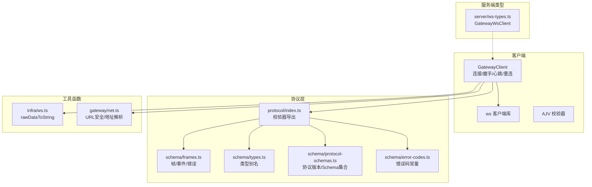
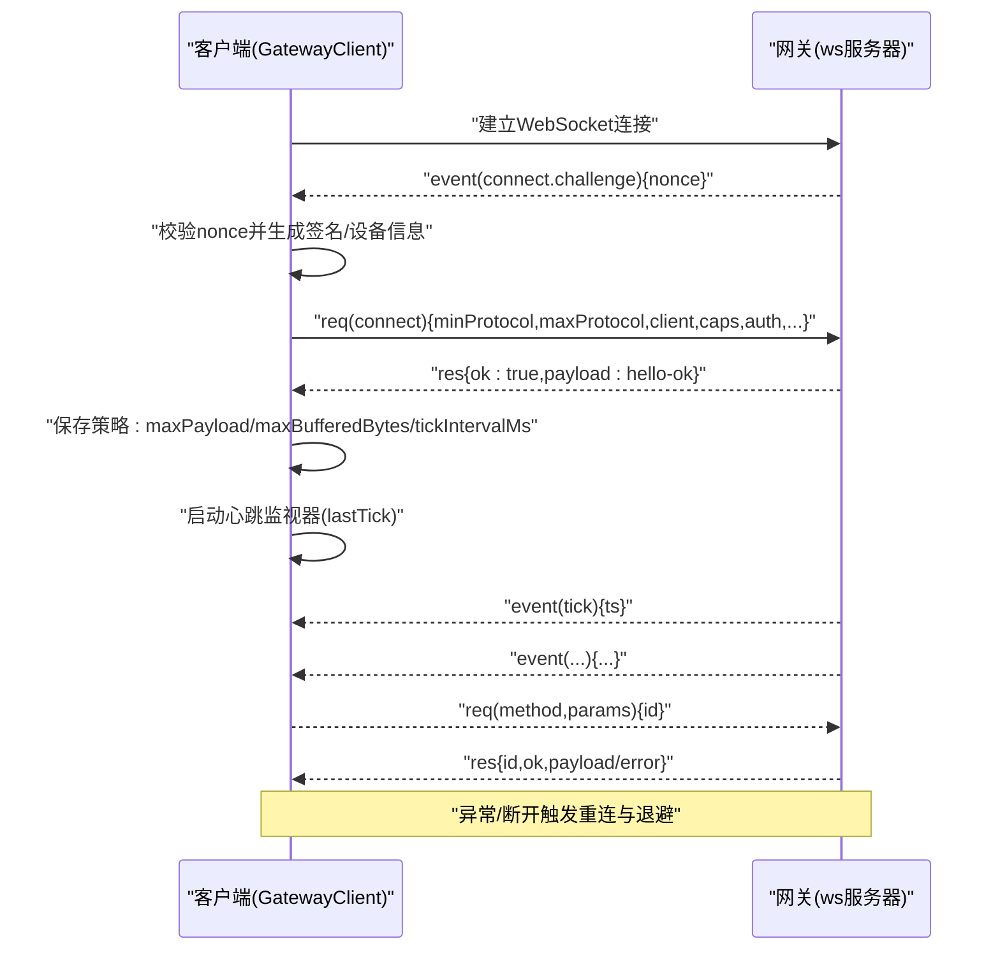
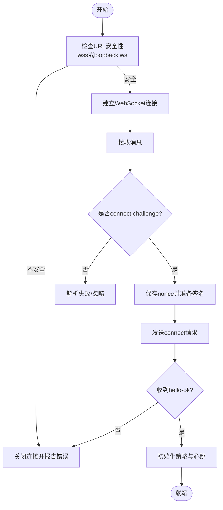
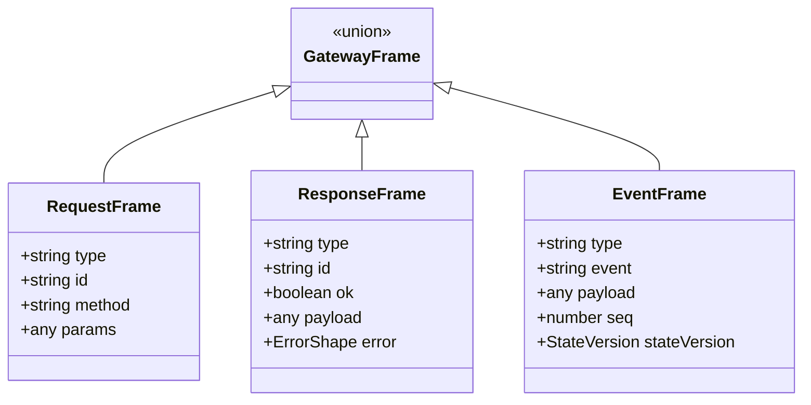
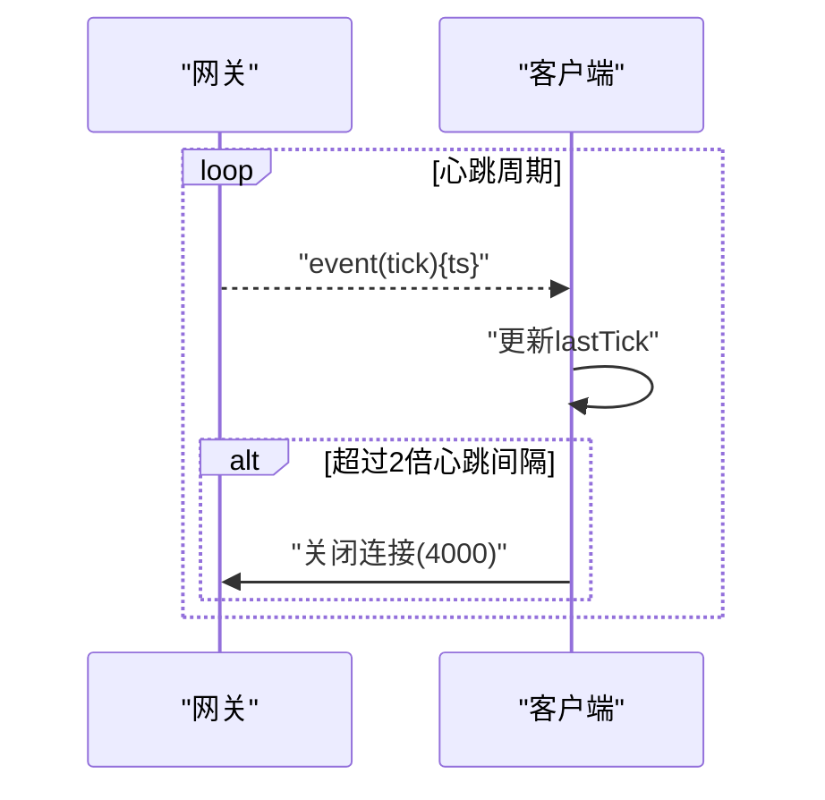
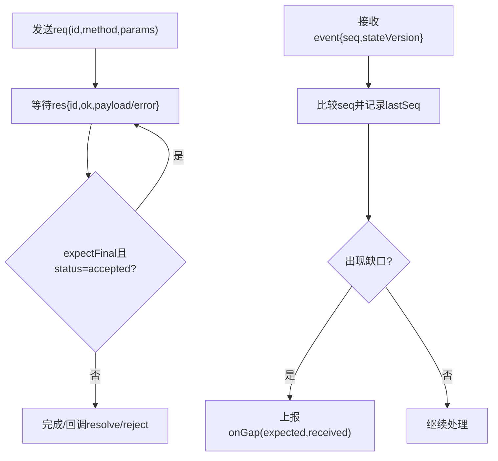
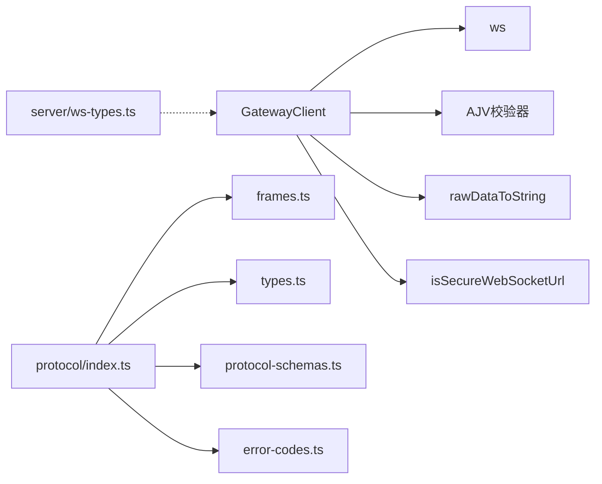

# WebSocket协议实现

## 目录
1. [简介](#简介)
2. [项目结构](#项目结构)
3. [核心组件](#核心组件)
4. [架构总览](#架构总览)
5. [详细组件分析](#详细组件分析)
6. [依赖关系分析](#依赖关系分析)
7. [性能考量](#性能考量)
8. [故障排查指南](#故障排查指南)
9. [结论](#结论)
10. [附录](#附录)

## 简介
本文件为 OpenClaw 的 WebSocket 协议实现提供系统化、可操作的 API 文档与技术说明。内容覆盖连接建立流程、消息帧格式、事件类型、状态同步机制、错误码定义、协议版本管理与向后兼容策略、客户端实现要点、消息序列图、调试工具使用以及连接管理、重连机制、流量控制与安全防护。

## 项目结构
OpenClaw 的 WebSocket 协议实现主要由以下模块构成：
- 客户端侧：GatewayClient 负责连接、握手、消息编解码、请求/响应处理、心跳检测、重连与安全校验。
- 协议层：基于 TypeBox 的 Schema 定义，统一描述连接参数、帧结构、事件与错误模型，并通过 AJV 校验器进行运行时验证。
- 服务端类型：定义网关 WebSocket 客户端上下文数据结构。
- 工具函数：RawData 到字符串转换、URL 安全性检查、网络地址解析与代理信任判定。

**图表来源**
- [src/gateway/client.ts](file://src/gateway/client.ts#L1-L531)
- [src/gateway/protocol/index.ts](file://src/gateway/protocol/index.ts#L1-L673)
- [src/gateway/protocol/schema/frames.ts](file://src/gateway/protocol/schema/frames.ts#L1-L164)
- [src/gateway/protocol/schema/types.ts](file://src/gateway/protocol/schema/types.ts#L1-L132)
- [src/gateway/protocol/schema/protocol-schemas.ts](file://src/gateway/protocol/schema/protocol-schemas.ts#L1-L302)
- [src/gateway/protocol/schema/error-codes.ts](file://src/gateway/protocol/schema/error-codes.ts#L1-L24)
- [src/gateway/server/ws-types.ts](file://src/gateway/server/ws-types.ts#L1-L14)
- [src/infra/ws.ts](file://src/infra/ws.ts#L1-L22)
- [src/gateway/net.ts](file://src/gateway/net.ts#L411-L457)

**章节来源**
- [src/gateway/client.ts](file://src/gateway/client.ts#L1-L531)
- [src/gateway/protocol/index.ts](file://src/gateway/protocol/index.ts#L1-L673)
- [src/gateway/protocol/schema/frames.ts](file://src/gateway/protocol/schema/frames.ts#L1-L164)
- [src/gateway/protocol/schema/types.ts](file://src/gateway/protocol/schema/types.ts#L1-L132)
- [src/gateway/protocol/schema/protocol-schemas.ts](file://src/gateway/protocol/schema/protocol-schemas.ts#L1-L302)
- [src/gateway/protocol/schema/error-codes.ts](file://src/gateway/protocol/schema/error-codes.ts#L1-L24)
- [src/gateway/server/ws-types.ts](file://src/gateway/server/ws-types.ts#L1-L14)
- [src/infra/ws.ts](file://src/infra/ws.ts#L1-L22)
- [src/gateway/net.ts](file://src/gateway/net.ts#L411-L457)

## 核心组件
- GatewayClient：WebSocket 客户端，负责握手挑战、连接参数发送、事件与响应处理、序列号校验、心跳监控、重连退避、TLS 指纹校验与安全策略。
- 协议校验器：基于 AJV 的编译校验器，确保所有入站/出站帧符合 Schema。
- 帧与事件：统一的 req/res/event 三类帧，事件帧支持 seq 与 stateVersion，用于顺序与状态同步。
- 错误模型：标准化的 ErrorShape，包含 code、message、details、retryable、retryAfterMs。
- 服务端类型：GatewayWsClient 描述服务端持有的客户端上下文（socket、connect 参数、connId 等）。

**章节来源**
- [src/gateway/client.ts](file://src/gateway/client.ts#L86-L531)
- [src/gateway/protocol/index.ts](file://src/gateway/protocol/index.ts#L253-L458)
- [src/gateway/protocol/schema/frames.ts](file://src/gateway/protocol/schema/frames.ts#L125-L164)
- [src/gateway/protocol/schema/error-codes.ts](file://src/gateway/protocol/schema/error-codes.ts#L1-L24)
- [src/gateway/server/ws-types.ts](file://src/gateway/server/ws-types.ts#L4-L13)

## 架构总览
下图展示客户端与网关之间的交互：握手挑战、连接确认、事件流、心跳检测与重连机制。

**图表来源**
- [src/gateway/client.ts](file://src/gateway/client.ts#L360-L431)
- [src/gateway/protocol/schema/frames.ts](file://src/gateway/protocol/schema/frames.ts#L20-L112)

**章节来源**
- [src/gateway/client.ts](file://src/gateway/client.ts#L108-L222)
- [src/gateway/protocol/schema/frames.ts](file://src/gateway/protocol/schema/frames.ts#L20-L112)

## 详细组件分析

### 连接建立与握手
- URL 安全性检查：默认仅允许 wss://；loopback 地址允许 ws://；可通过环境变量开启受信私有网络的 ws://。
- 握手挑战：服务端发送 connect.challenge，包含 nonce；客户端收到后必须在超时前完成连接请求。
- 连接参数：包含协议版本范围、客户端标识、能力列表、权限、认证方式（共享令牌/密码/设备令牌）、设备签名等。
- 连接确认：服务端返回 hello-ok，包含协议版本、服务器信息、特性清单、快照、策略与可选的授权信息。

**图表来源**
- [src/gateway/client.ts](file://src/gateway/client.ts#L113-L142)
- [src/gateway/client.ts](file://src/gateway/client.ts#L360-L376)
- [src/gateway/client.ts](file://src/gateway/client.ts#L328-L357)
- [src/gateway/protocol/schema/frames.ts](file://src/gateway/protocol/schema/frames.ts#L20-L112)
- [src/gateway/net.ts](file://src/gateway/net.ts#L411-L457)

**章节来源**
- [src/gateway/client.ts](file://src/gateway/client.ts#L113-L142)
- [src/gateway/client.ts](file://src/gateway/client.ts#L360-L376)
- [src/gateway/client.ts](file://src/gateway/client.ts#L328-L357)
- [src/gateway/protocol/schema/frames.ts](file://src/gateway/protocol/schema/frames.ts#L20-L112)
- [src/gateway/net.ts](file://src/gateway/net.ts#L411-L457)

### 消息格式与帧结构
- 请求帧(req)：type=req、id、method、params（可选）。
- 响应帧(res)：type=res、id、ok、payload（可选）、error（可选）。
- 事件帧(event)：type=event、event、payload（可选）、seq（可选）、stateVersion（可选）。
- 统一帧联合类型：GatewayFrame，通过 discriminator 字段区分类型，便于代码生成与类型安全。

**图表来源**
- [src/gateway/protocol/schema/frames.ts](file://src/gateway/protocol/schema/frames.ts#L125-L164)

**章节来源**
- [src/gateway/protocol/schema/frames.ts](file://src/gateway/protocol/schema/frames.ts#L125-L164)
- [src/gateway/protocol/schema/types.ts](file://src/gateway/protocol/schema/types.ts#L7-L12)

### 事件类型与实时交互
- 心跳事件(tick)：服务端周期性发送，客户端记录 lastTick 并按策略检测超时。
- 关闭事件(shutdown)：包含重启预期时间等信息。
- 其他事件：由服务端推送，客户端通过 onEvent 回调分发。

**图表来源**
- [src/gateway/client.ts](file://src/gateway/client.ts#L453-L475)
- [src/gateway/protocol/schema/frames.ts](file://src/gateway/protocol/schema/frames.ts#L5-L18)

**章节来源**
- [src/gateway/client.ts](file://src/gateway/client.ts#L453-L475)
- [src/gateway/protocol/schema/frames.ts](file://src/gateway/protocol/schema/frames.ts#L5-L18)

### 请求/响应与状态同步
- 请求/响应：客户端以 UUID 生成请求 ID，等待对应响应；若响应中 status=accepted，则继续等待最终结果。
- 序列号(seq)：事件帧携带 seq，客户端跟踪 lastSeq 并上报丢包缺口。
- 状态版本(stateVersion)：事件帧携带 stateVersion，用于客户端与服务端状态一致性校验与增量同步。

**图表来源**
- [src/gateway/client.ts](file://src/gateway/client.ts#L390-L411)
- [src/gateway/client.ts](file://src/gateway/client.ts#L377-L383)

**章节来源**
- [src/gateway/client.ts](file://src/gateway/client.ts#L390-L411)
- [src/gateway/client.ts](file://src/gateway/client.ts#L377-L383)

### 错误码与错误模型
- 错误形状(ErrorShape)：包含 code、message、details、retryable、retryAfterMs。
- 常见错误码：未关联、未配对、代理超时、请求无效、服务不可用等。
- 响应错误：当 res.ok=false 时，使用 error 字段描述错误详情。

**章节来源**
- [src/gateway/protocol/schema/error-codes.ts](file://src/gateway/protocol/schema/error-codes.ts#L1-L24)
- [src/gateway/protocol/schema/frames.ts](file://src/gateway/protocol/schema/frames.ts#L114-L123)

### 协议版本管理与向后兼容
- 协议版本：PROTOCOL_VERSION=3，客户端通过 ConnectParams 的 minProtocol/maxProtocol 指定版本范围。
- 向后兼容：服务端返回 hello-ok 中的 protocol 字段指示实际使用的协议版本；客户端据此调整行为与策略。
- Schema 集合：ProtocolSchemas 统一导出所有 Schema，配合 AJV 校验器保证消息结构正确性。

**章节来源**
- [src/gateway/protocol/schema/protocol-schemas.ts](file://src/gateway/protocol/schema/protocol-schemas.ts#L299-L302)
- [src/gateway/protocol/schema/frames.ts](file://src/gateway/protocol/schema/frames.ts#L71-L112)
- [src/gateway/protocol/index.ts](file://src/gateway/protocol/index.ts#L559-L564)

### 客户端实现要点与示例
- 连接选项：支持 URL、令牌/密码、设备令牌、实例 ID、客户端名称/显示名、平台、设备家族、角色、作用域、能力、命令、权限、路径环境变量、最小/最大协议版本、TLS 指纹等。
- 安全策略：强制 wss:// 或 loopback ws://；可选受信私有网络；TLS 指纹校验；设备签名与公钥。
- 心跳与重连：心跳间隔来自策略；超时则主动关闭；指数退避重连。
- 事件与回调：onEvent、onHelloOk、onConnectError、onClose、onGap。

**章节来源**
- [src/gateway/client.ts](file://src/gateway/client.ts#L44-L73)
- [src/gateway/client.ts](file://src/gateway/client.ts#L113-L142)
- [src/gateway/client.ts](file://src/gateway/client.ts#L453-L475)
- [src/gateway/client.ts](file://src/gateway/client.ts#L433-L444)

### 测试与调试工具
- 单元测试：验证握手挑战缺失、消息解析失败、WebSocket 错误事件等边界场景。
- macOS/iOS 测试支持：构造 hello-ok 响应帧，提取请求 ID，辅助端到端测试。
- 调试建议：启用日志、观察心跳超时、检查 TLS 指纹、验证序列号缺口与状态版本。

**章节来源**
- [src/agents/openai-ws-connection.test.ts](file://src/agents/openai-ws-connection.test.ts#L617-L648)
- [apps/macos/Tests/OpenClawIPCTests/GatewayWebSocketTestSupport.swift](file://apps/macos/Tests/OpenClawIPCTests/GatewayWebSocketTestSupport.swift#L31-L71)
- [apps/shared/OpenClawKit/Tests/OpenClawKitTests/GatewayNodeSessionTests.swift](file://apps/shared/OpenClawKit/Tests/OpenClawKitTests/GatewayNodeSessionTests.swift#L104-L152)

## 依赖关系分析
- 客户端依赖 ws 客户端库、AJV 校验器、RawData 转换工具、URL 安全性检查与网络工具。
- 协议层依赖 TypeBox Schema 与 AJV，统一导出类型别名与校验器。
- 服务端类型与客户端无直接耦合，但通过帧结构与策略保持一致。

**图表来源**
- [src/gateway/client.ts](file://src/gateway/client.ts#L1-L36)
- [src/gateway/protocol/index.ts](file://src/gateway/protocol/index.ts#L1-L251)
- [src/gateway/protocol/schema/frames.ts](file://src/gateway/protocol/schema/frames.ts#L1-L10)
- [src/gateway/protocol/schema/types.ts](file://src/gateway/protocol/schema/types.ts#L1-L2)
- [src/gateway/protocol/schema/protocol-schemas.ts](file://src/gateway/protocol/schema/protocol-schemas.ts#L1-L11)
- [src/gateway/protocol/schema/error-codes.ts](file://src/gateway/protocol/schema/error-codes.ts#L1-L1)
- [src/gateway/server/ws-types.ts](file://src/gateway/server/ws-types.ts#L1-L2)
- [src/infra/ws.ts](file://src/infra/ws.ts#L1-L2)
- [src/gateway/net.ts](file://src/gateway/net.ts#L411-L416)

**章节来源**
- [src/gateway/client.ts](file://src/gateway/client.ts#L1-L36)
- [src/gateway/protocol/index.ts](file://src/gateway/protocol/index.ts#L1-L251)
- [src/gateway/protocol/schema/frames.ts](file://src/gateway/protocol/schema/frames.ts#L1-L10)
- [src/gateway/protocol/schema/types.ts](file://src/gateway/protocol/schema/types.ts#L1-L2)
- [src/gateway/protocol/schema/protocol-schemas.ts](file://src/gateway/protocol/schema/protocol-schemas.ts#L1-L11)
- [src/gateway/protocol/schema/error-codes.ts](file://src/gateway/protocol/schema/error-codes.ts#L1-L1)
- [src/gateway/server/ws-types.ts](file://src/gateway/server/ws-types.ts#L1-L2)
- [src/infra/ws.ts](file://src/infra/ws.ts#L1-L2)
- [src/gateway/net.ts](file://src/gateway/net.ts#L411-L416)

## 性能考量
- 心跳检测：根据策略设置心跳间隔，避免长时间静默导致资源占用。
- 重连退避：初始 1 秒，上限 30 秒，减少风暴式重连。
- 流量控制：服务端策略包含 maxPayload 与 maxBufferedBytes，客户端据此限制单次载荷大小与缓冲字节数。
- 解析与校验：使用 AJV 编译校验器，降低运行时开销；RawData 转换统一编码处理。

[本节为通用指导，无需特定文件来源]

## 故障排查指南
- URL 不安全：ws:// 非 loopback 会被拒绝，需使用 wss:// 或受信私有网络。
- 握手挑战超时：服务端未在时限内收到 connect，检查网络延迟与服务端负载。
- 设备令牌不匹配：服务端关闭连接并清除本地缓存的设备令牌，需重新配对。
- TLS 指纹不匹配：检查指纹配置与证书链一致性。
- 心跳超时：超过两倍心跳间隔未收到 tick，客户端主动关闭连接。
- 消息解析失败：非 JSON 或缺少 type 字段，检查客户端/服务端版本兼容性。

**章节来源**
- [src/gateway/client.ts](file://src/gateway/client.ts#L113-L142)
- [src/gateway/client.ts](file://src/gateway/client.ts#L185-L211)
- [src/gateway/client.ts](file://src/gateway/client.ts#L471-L473)
- [src/agents/openai-ws-connection.test.ts](file://src/agents/openai-ws-connection.test.ts#L617-L648)

## 结论
OpenClaw 的 WebSocket 协议通过严格的 Schema 定义与 AJV 校验、清晰的帧结构、完善的事件与错误模型、安全的 URL 与 TLS 策略、以及稳健的心跳与重连机制，实现了高可靠、可扩展的实时通信基础。客户端只需遵循握手流程、正确处理事件与响应、维护心跳与序列号，即可与网关稳定交互。

[本节为总结，无需特定文件来源]

## 附录

### 帧字段与含义速查
- req
  - type: "req"
  - id: 请求唯一标识
  - method: 方法名
  - params: 参数对象（可选）
- res
  - type: "res"
  - id: 对应请求 id
  - ok: 是否成功
  - payload: 成功时返回的数据（可选）
  - error: 失败时的错误描述（可选）
- event
  - type: "event"
  - event: 事件名
  - payload: 事件载荷（可选）
  - seq: 事件序号（可选）
  - stateVersion: 状态版本（可选）

**章节来源**
- [src/gateway/protocol/schema/frames.ts](file://src/gateway/protocol/schema/frames.ts#L125-L164)

### 安全与合规要点
- 强制 TLS：除 loopback 外，禁止明文传输敏感信息。
- 受信代理：仅在明确信任的代理链路下才使用 X-Real-IP。
- 设备签名：设备连接需提供公钥、签名与 nonce，防止中间人攻击。
- TLS 指纹：可选严格校验远端证书指纹，进一步降低 MITM 风险。

**章节来源**
- [src/gateway/net.ts](file://src/gateway/net.ts#L411-L457)
- [src/gateway/client.ts](file://src/gateway/client.ts#L144-L170)