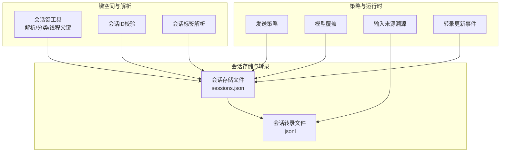
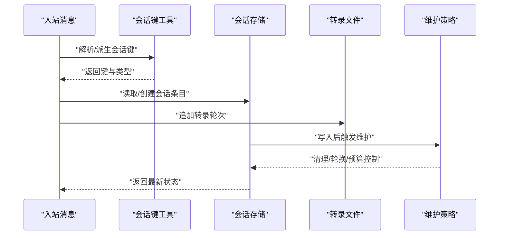
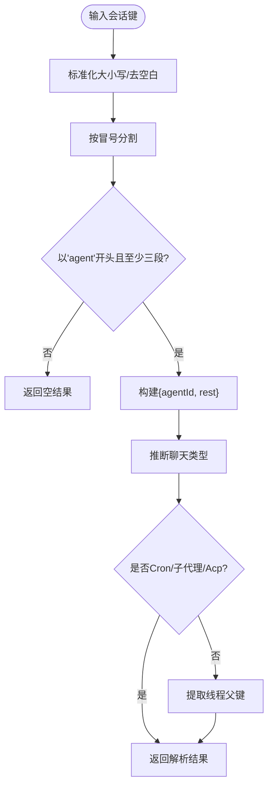
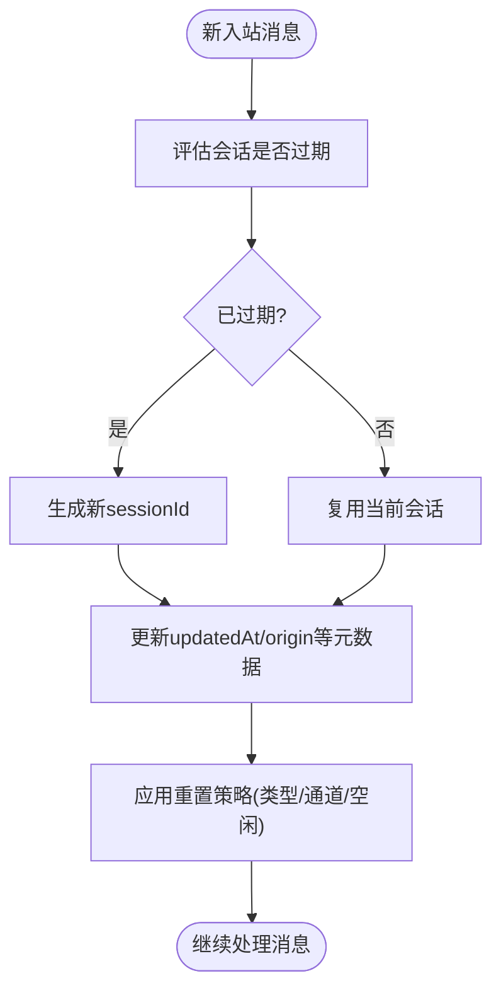
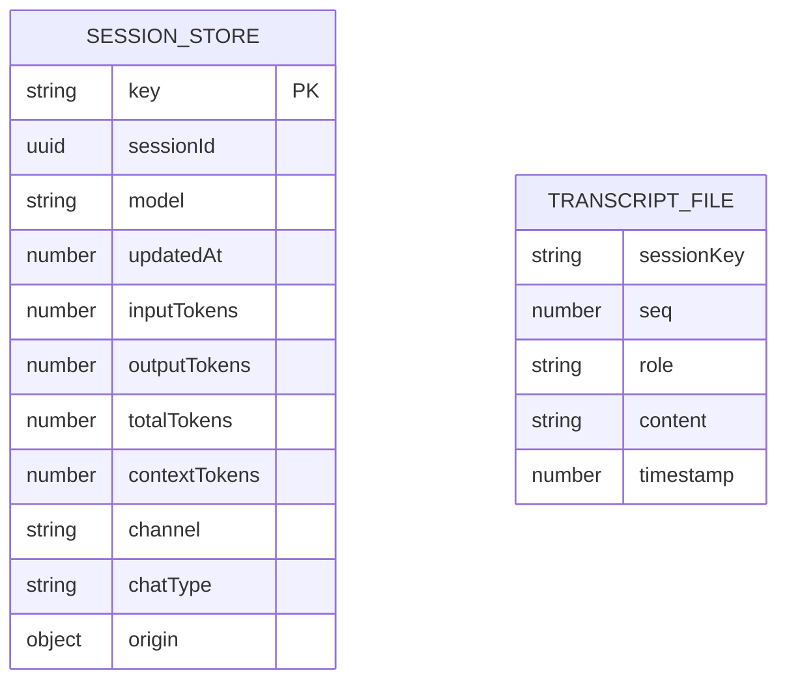
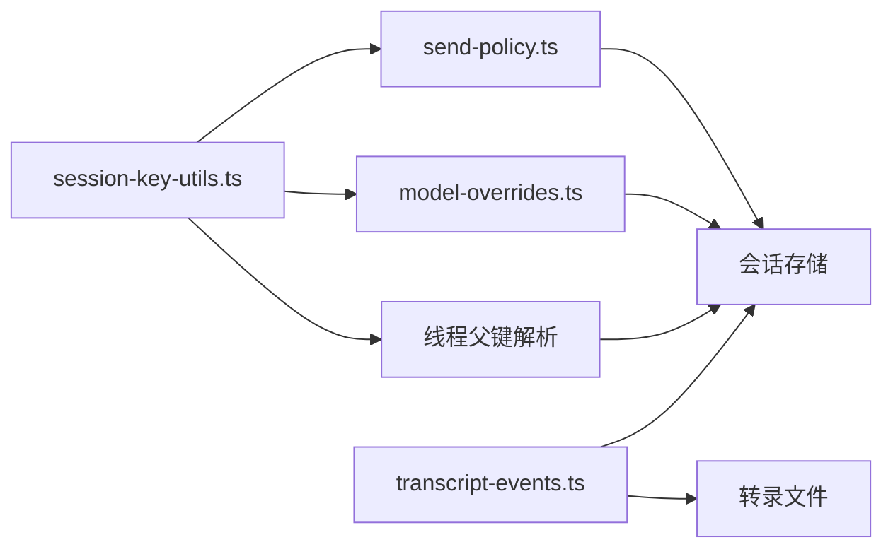

# 会话状态管理

## 目录
1. [引言](#引言)
2. [项目结构](#项目结构)
3. [核心组件](#核心组件)
4. [架构总览](#架构总览)
5. [详细组件分析](#详细组件分析)
6. [依赖关系分析](#依赖关系分析)
7. [性能考量](#性能考量)
8. [故障排查指南](#故障排查指南)
9. [结论](#结论)
10. [附录](#附录)

## 引言
本技术文档围绕 OpenClaw 的会话状态管理进行系统性梳理，重点覆盖会话生命周期（创建、激活、维护、销毁）、会话键值管理、状态持久化、并发访问控制、数据结构与存储格式、查询优化策略、多通道会话同步与一致性保障、监控指标与性能调优、故障恢复与数据完整性检查等主题。文档以仓库内现有概念文档与源码实现为依据，结合 CLI 使用说明，帮助开发者与运维人员在不同规模部署中稳定地管理会话状态。

## 项目结构
OpenClaw 将“会话”视为“代理维度”的状态容器，会话键采用统一的“代理作用域”前缀，配合通道、聊天类型、线程等维度形成可解析的键空间。会话状态由“会话存储文件”和“转录文件”两部分组成，前者记录键到元信息的映射，后者按时间顺序记录对话轮次。维护策略通过配置项控制，支持按时间、数量、磁盘预算等维度进行清理与轮换。

图表来源
- [src/sessions/session-key-utils.ts](file://src/sessions/session-key-utils.ts#L1-L133)
- [src/sessions/session-id.ts](file://src/sessions/session-id.ts#L1-L6)
- [src/sessions/session-label.ts](file://src/sessions/session-label.ts#L1-L21)
- [src/sessions/send-policy.ts](file://src/sessions/send-policy.ts#L1-L124)
- [src/sessions/model-overrides.ts](file://src/sessions/model-overrides.ts#L1-L113)
- [src/sessions/input-provenance.ts](file://src/sessions/input-provenance.ts#L1-L82)
- [src/sessions/transcript-events.ts](file://src/sessions/transcript-events.ts#L1-L30)

章节来源
- [docs/concepts/session.md](file://docs/concepts/session.md#L64-L72)
- [docs/concepts/session.md](file://docs/concepts/session.md#L189-L206)

## 核心组件
- 会话键工具：负责将“代理作用域键”标准化、解析聊天类型、识别 Cron/子代理/Acp 等特殊键、提取线程父键等。
- 会话 ID 校验：对字符串是否为合法 UUID 进行快速判定。
- 会话标签解析：限制标签长度并校验合法性，避免异常输入污染 UI 元数据。
- 发送策略：基于配置规则与运行时上下文（键、渠道、聊天类型）决定允许或拒绝发送。
- 模型覆盖：在会话条目上应用模型/提供商覆盖，并同步清理过期的运行时字段与上下文窗口缓存。
- 输入来源溯源：为用户消息附加“输入来源”元数据，支持跨会话交互与审计。
- 转录事件：提供转录文件变更的发布/订阅机制，便于外部监听器响应状态变化。

章节来源
- [src/sessions/session-key-utils.ts](file://src/sessions/session-key-utils.ts#L1-L133)
- [src/sessions/session-id.ts](file://src/sessions/session-id.ts#L1-L6)
- [src/sessions/session-label.ts](file://src/sessions/session-label.ts#L1-L21)
- [src/sessions/send-policy.ts](file://src/sessions/send-policy.ts#L1-L124)
- [src/sessions/model-overrides.ts](file://src/sessions/model-overrides.ts#L1-L113)
- [src/sessions/input-provenance.ts](file://src/sessions/input-provenance.ts#L1-L82)
- [src/sessions/transcript-events.ts](file://src/sessions/transcript-events.ts#L1-L30)

## 架构总览
下图展示从“入站消息”到“会话状态写入/读取”的关键路径，以及维护与清理流程如何在写入路径触发。

图表来源
- [docs/concepts/session.md](file://docs/concepts/session.md#L74-L120)
- [src/sessions/session-key-utils.ts](file://src/sessions/session-key-utils.ts#L1-L133)
- [src/sessions/transcript-events.ts](file://src/sessions/transcript-events.ts#L1-L30)

## 详细组件分析

### 会话键值管理与解析
- 键规范化：统一小写、去除多余空白，确保比较与路由稳定。
- 聊天类型推断：根据键片段识别 direct/group/channel/thread/topic 等类型，兼容历史键形态。
- 特殊键识别：识别 Cron 任务、子代理、Acp 等键前缀，用于差异化处理。
- 线程父键解析：从“话题/线程”键中提取父级会话键，支撑多层线程的会话树。
- 历史兼容：保留对 legacy 键的识别，确保迁移期间不丢失会话语义。

图表来源
- [src/sessions/session-key-utils.ts](file://src/sessions/session-key-utils.ts#L12-L59)
- [src/sessions/session-key-utils.ts](file://src/sessions/session-key-utils.ts#L61-L95)
- [src/sessions/session-key-utils.ts](file://src/sessions/session-key-utils.ts#L112-L132)

章节来源
- [src/sessions/session-key-utils.ts](file://src/sessions/session-key-utils.ts#L1-L133)
- [docs/concepts/session.md](file://docs/concepts/session.md#L189-L206)

### 会话生命周期管理
- 复用与到期：会话在未过期前复用；到期评估发生在下一次入站消息到达时。
- 重置策略：支持“每日重置”“空闲重置”，二者取较早者生效；支持按类型与按通道覆盖。
- 手动重置：发送特定指令可强制新建会话 ID；也可直接删除存储键或转录文件后由下一条消息重建。
- 隔离策略：多账号/多通道共享主键时，可通过标识映射与隔离模式避免上下文泄露。

图表来源
- [docs/concepts/session.md](file://docs/concepts/session.md#L207-L217)

章节来源
- [docs/concepts/session.md](file://docs/concepts/session.md#L207-L217)

### 状态持久化与存储格式
- 存储位置：每个代理拥有独立的会话存储文件与转录文件；群组/频道/话题使用独立文件。
- 存储结构：存储文件为“键到条目”的映射，条目包含会话 ID、更新时间、令牌统计、来源元数据等；删除条目安全，会在需要时按需重建。
- 维护策略：写入路径触发维护，支持预览/执行两种模式；按时间、数量、磁盘预算等维度清理与轮换。

图表来源
- [docs/concepts/session.md](file://docs/concepts/session.md#L64-L72)
- [docs/concepts/session.md](file://docs/concepts/session.md#L74-L120)

章节来源
- [docs/concepts/session.md](file://docs/concepts/session.md#L64-L72)
- [docs/concepts/session.md](file://docs/concepts/session.md#L74-L120)

### 并发访问控制
- 写锁与并发：在分布式/多进程场景下，应采用文件级写锁或集中式锁服务保护会话存储写入，避免竞态导致的损坏。
- 事件驱动更新：通过转录事件发布器通知外部监听器，避免轮询带来的竞争条件。
- 读写分离：UI 客户端应从网关读取会话列表与令牌统计，避免本地文件解析造成不一致。

章节来源
- [src/sessions/transcript-events.ts](file://src/sessions/transcript-events.ts#L1-L30)
- [docs/concepts/session.md](file://docs/concepts/session.md#L57-L62)

### 查询优化策略
- 键空间设计：统一的“agent:&lt;agentId&gt;:...”前缀便于范围扫描与过滤；聊天类型与线程标记可加速筛选。
- 元数据索引：在客户端侧维护内存索引（如按渠道/类型/活跃度），减少全量遍历成本。
- 维护窗口：利用维护策略在写入路径批量清理，避免大表查询时的抖动。

章节来源
- [src/sessions/session-key-utils.ts](file://src/sessions/session-key-utils.ts#L37-L59)
- [docs/concepts/session.md](file://docs/concepts/session.md#L74-L120)

### 多通道会话同步与一致性
- 会话键映射：通过配置项控制 DM 的分组策略（主键、按对端、按通道+对端、按账户+通道+对端），并支持标识映射以合并同一人的跨通道会话。
- 来源元数据：每条会话记录来源标签、提供商、账号、线程等信息，便于 UI 解释与审计。
- 线程一致性：线程键提取父键，确保父子会话状态与转录的正确归属。

章节来源
- [docs/concepts/session.md](file://docs/concepts/session.md#L10-L56)
- [docs/concepts/session.md](file://docs/concepts/session.md#L295-L311)
- [src/sessions/session-key-utils.ts](file://src/sessions/session-key-utils.ts#L112-L132)

### 发送策略与运行时覆盖
- 规则匹配：支持按渠道、聊天类型、键前缀（原始/剥离代理前缀）匹配，逐条规则决策，最终回退到默认动作。
- 运行时覆盖：单个会话可临时覆盖发送策略，Owner 可通过指令切换“允许/禁止/继承”。

章节来源
- [src/sessions/send-policy.ts](file://src/sessions/send-policy.ts#L53-L124)
- [docs/concepts/session.md](file://docs/concepts/session.md#L219-L245)

### 模型覆盖与上下文窗口一致性
- 覆盖应用：当选择新的模型/提供商时，清除过期的运行时模型字段与上下文窗口缓存，确保状态显示与实际一致。
- 认证资料覆盖：可同时设置认证资料覆盖及其来源，清理相关计数字段以避免误导。

章节来源
- [src/sessions/model-overrides.ts](file://src/sessions/model-overrides.ts#L9-L113)

### 输入来源溯源与跨会话交互
- 消息注入：为用户消息附加输入来源元数据，支持“跨会话”来源的识别与审计。
- 互操作：通过来源元数据可追踪消息的来源会话、渠道与工具，便于调试与合规。

章节来源
- [src/sessions/input-provenance.ts](file://src/sessions/input-provenance.ts#L50-L82)

### 转录事件与外部集成
- 发布/订阅：提供转录更新事件接口，监听器可在转录文件变更时执行后续动作（如刷新 UI、触发备份）。
- 错误隔离：回调内部异常被捕获，不影响主流程。

章节来源
- [src/sessions/transcript-events.ts](file://src/sessions/transcript-events.ts#L16-L29)

## 依赖关系分析
- 会话键工具被发送策略、模型覆盖、线程父键解析等模块广泛依赖，是键空间与类型推断的核心。
- 维护策略与存储文件耦合紧密，写入路径触发清理与轮换，影响整体写入延迟。
- 转录事件作为横切关注点，被 UI、备份、诊断等模块消费。

图表来源
- [src/sessions/session-key-utils.ts](file://src/sessions/session-key-utils.ts#L1-L133)
- [src/sessions/send-policy.ts](file://src/sessions/send-policy.ts#L1-L124)
- [src/sessions/model-overrides.ts](file://src/sessions/model-overrides.ts#L1-L113)
- [src/sessions/transcript-events.ts](file://src/sessions/transcript-events.ts#L1-L30)

章节来源
- [src/sessions/session-key-utils.ts](file://src/sessions/session-key-utils.ts#L1-L133)
- [src/sessions/send-policy.ts](file://src/sessions/send-policy.ts#L1-L124)
- [src/sessions/model-overrides.ts](file://src/sessions/model-overrides.ts#L1-L113)
- [src/sessions/transcript-events.ts](file://src/sessions/transcript-events.ts#L1-L30)

## 性能考量
- 维护成本：大规模会话存储在写入路径执行维护，主要成本来自高上限、长保留期、大量归档与磁盘预算启用。
- 优化建议：
  - 在生产环境使用“强制”模式自动限流增长；
  - 同时设置时间与数量限制，避免单一维度失效；
  - 对于大部署启用磁盘预算并设置合理“高位水位”；
  - 使用“活动键保护”参数在手动清理时避免误删活跃会话；
  - 客户端侧建立内存索引，减少全量扫描。

章节来源
- [docs/concepts/session.md](file://docs/concepts/session.md#L101-L120)
- [docs/cli/sessions.md](file://docs/cli/sessions.md#L48-L100)

## 故障排查指南
- 列举与诊断：
  - 使用 CLI 列出会话、聚合多代理、筛选活跃会话、打印 JSON 摘要；
  - 使用“清理预演”验证影响范围后再执行强制清理；
  - 通过网关调用获取远端会话列表，避免本地文件不一致。
- 常见问题定位：
  - 会话未按预期重置：检查重置策略（每日/空闲/类型/通道覆盖）与触发词；
  - 发送被意外阻止：检查发送策略规则与运行时覆盖；
  - 上下文窗口不一致：确认模型覆盖是否生效，必要时清理过期运行时字段；
  - 跨通道会话未合并：检查标识映射与隔离模式配置。

章节来源
- [docs/cli/sessions.md](file://docs/cli/sessions.md#L10-L105)
- [docs/concepts/session.md](file://docs/concepts/session.md#L279-L294)

## 结论
OpenClaw 的会话状态管理以“代理作用域键”为核心，结合清晰的生命周期策略、可配置的维护与清理机制、以及面向多通道与线程的键解析能力，实现了在多场景下的可扩展与可维护性。通过事件驱动与严格的来源元数据记录，系统在一致性与可观测性方面具备良好基础。建议在生产环境中启用强制维护策略、合理设置磁盘预算与高位水位，并通过 CLI 与网关接口进行持续监控与治理。

## 附录
- 会话键命名规范与类型推断参考：[docs/concepts/session.md](file://docs/concepts/session.md#L189-L206)
- 维护与清理 CLI 使用：[docs/cli/sessions.md](file://docs/cli/sessions.md#L48-L100)
- 会话存储与转录结构参考：[docs/concepts/session.md](file://docs/concepts/session.md#L64-L72)