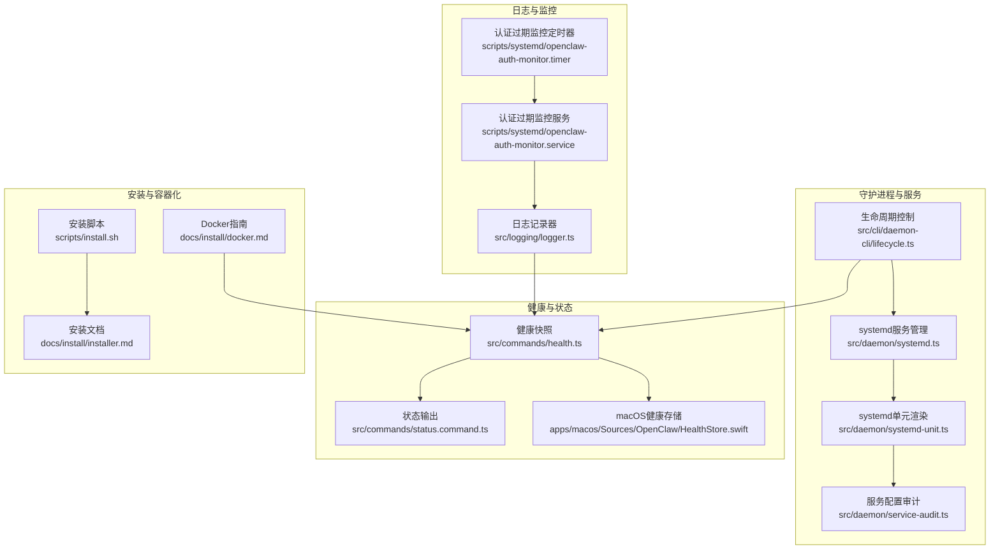
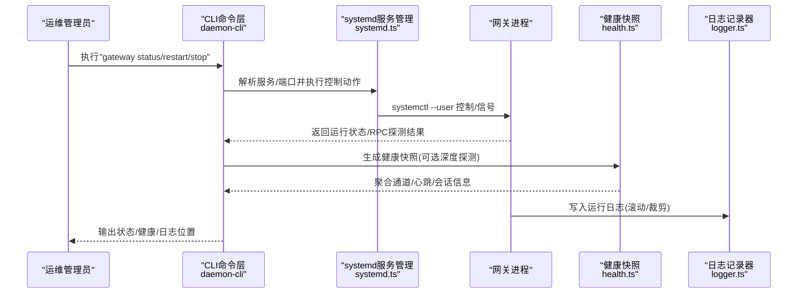
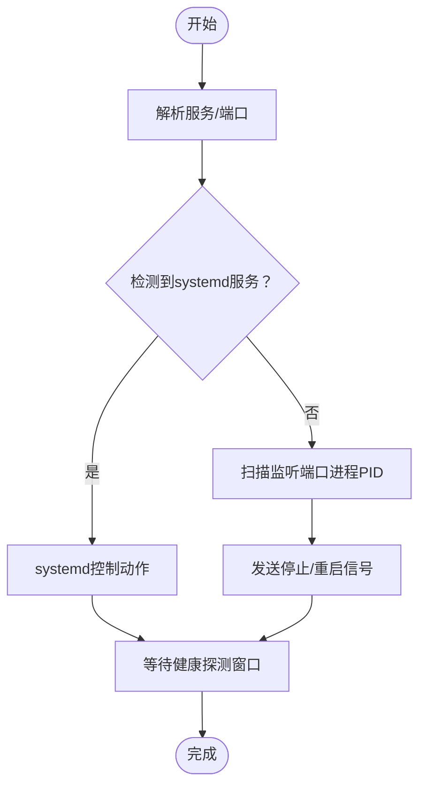
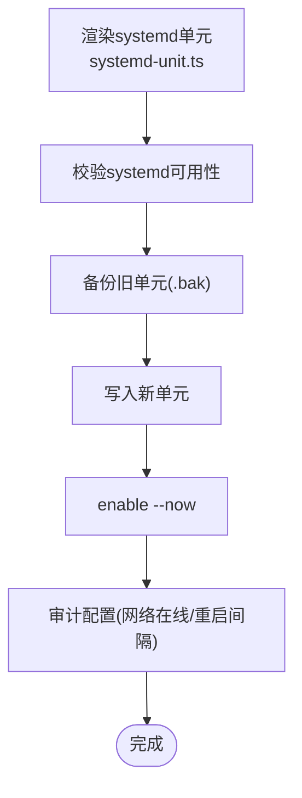
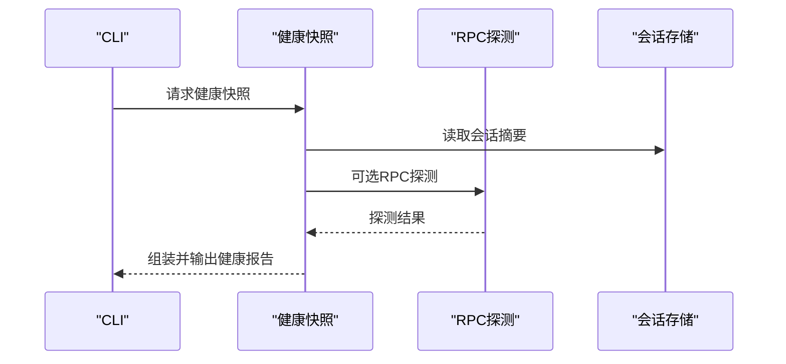
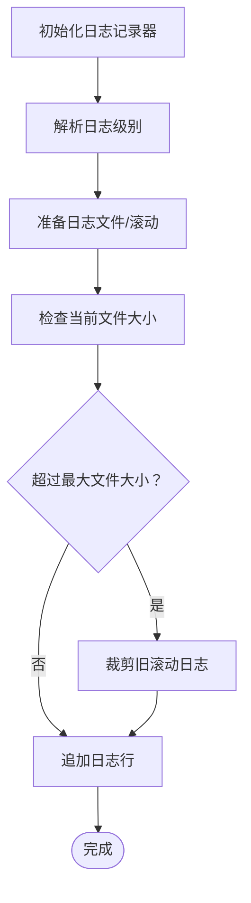
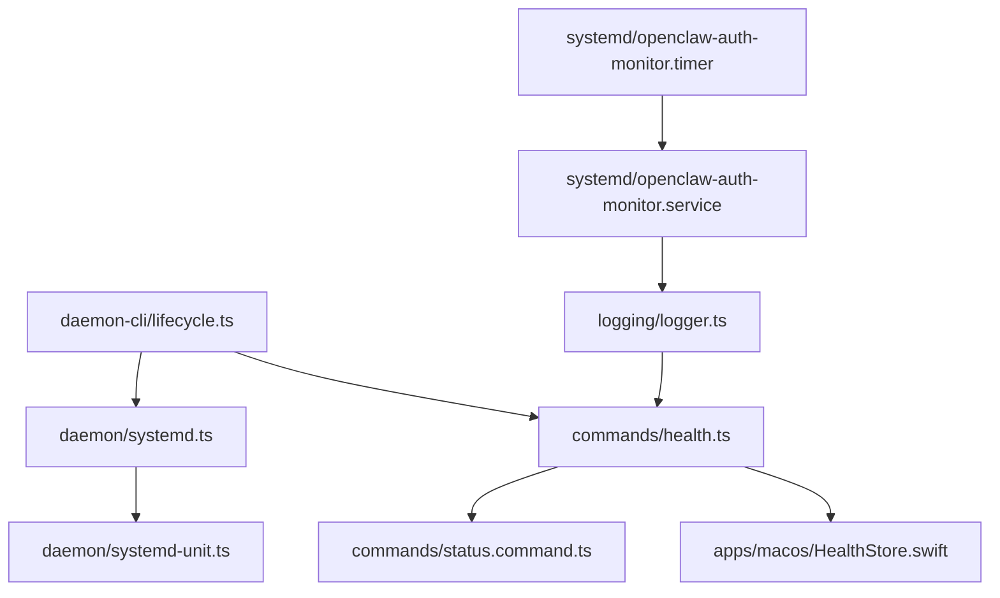
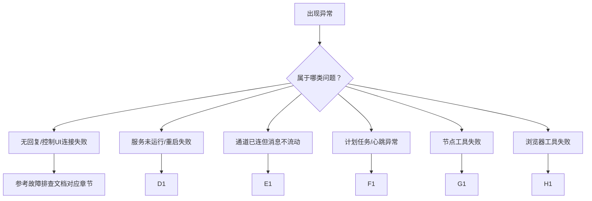

# 网关运维管理

## 目录
1. [简介](#简介)
2. [项目结构](#项目结构)
3. [核心组件](#核心组件)
4. [架构总览](#架构总览)
5. [详细组件分析](#详细组件分析)
6. [依赖关系分析](#依赖关系分析)
7. [性能考量](#性能考量)
8. [故障排查指南](#故障排查指南)
9. [结论](#结论)
10. [附录](#附录)

## 简介
本指南面向OpenClaw网关的运维工程师，覆盖守护进程的部署与管理（含systemd用户服务）、开机自启、进程监控与健康检查、启动/优雅关闭/重启流程、日志与性能监控、资源使用与告警、故障诊断与应急响应、备份恢复与版本升级、容量规划与性能调优，以及运维自动化脚本与监控仪表板配置建议。内容基于仓库中的代码实现与文档，确保可操作性与可追溯性。

## 项目结构
围绕网关运维的关键目录与文件：
- 守护进程与服务管理：src/daemon、src/cli/daemon-cli
- 健康检查与状态：src/commands/health.ts、src/commands/status.command.ts、apps/macos/Sources/OpenClaw/HealthStore.swift
- 日志与滚动：src/logging/logger.ts
- systemd单元与审计：src/daemon/systemd.ts、src/daemon/systemd-unit.ts、src/daemon/service-audit.ts
- 运维自动化与安装：scripts/systemd/*、scripts/install.sh、docs/install/*
- 故障排查：docs/gateway/troubleshooting.md、docs/help/troubleshooting.md

图表来源
- [src/cli/daemon-cli/lifecycle.ts](file://src/cli/daemon-cli/lifecycle.ts#L151-L228)
- [src/daemon/systemd.ts](file://src/daemon/systemd.ts#L541-L604)
- [src/daemon/systemd-unit.ts](file://src/daemon/systemd-unit.ts#L38-L87)
- [src/daemon/service-audit.ts](file://src/daemon/service-audit.ts#L124-L173)
- [src/commands/health.ts](file://src/commands/health.ts#L348-L673)
- [src/commands/status.command.ts](file://src/commands/status.command.ts#L318-L358)
- [apps/macos/Sources/OpenClaw/HealthStore.swift](file://apps/macos/Sources/OpenClaw/HealthStore.swift#L147-L163)
- [src/logging/logger.ts](file://src/logging/logger.ts#L115-L233)
- [scripts/systemd/openclaw-auth-monitor.service](file://scripts/systemd/openclaw-auth-monitor.service#L1-L15)
- [scripts/systemd/openclaw-auth-monitor.timer](file://scripts/systemd/openclaw-auth-monitor.timer#L1-L11)
- [scripts/install.sh](file://scripts/install.sh#L1-L800)
- [docs/install/installer.md](file://docs/install/installer.md#L1-L406)
- [docs/install/docker.md](file://docs/install/docker.md#L1-L800)

章节来源
- [src/cli/daemon-cli/lifecycle.ts](file://src/cli/daemon-cli/lifecycle.ts#L151-L228)
- [src/daemon/systemd.ts](file://src/daemon/systemd.ts#L541-L604)
- [src/daemon/systemd-unit.ts](file://src/daemon/systemd-unit.ts#L38-L87)
- [src/daemon/service-audit.ts](file://src/daemon/service-audit.ts#L124-L173)
- [src/commands/health.ts](file://src/commands/health.ts#L348-L673)
- [src/commands/status.command.ts](file://src/commands/status.command.ts#L318-L358)
- [apps/macos/Sources/OpenClaw/HealthStore.swift](file://apps/macos/Sources/OpenClaw/HealthStore.swift#L147-L163)
- [src/logging/logger.ts](file://src/logging/logger.ts#L115-L233)
- [scripts/systemd/openclaw-auth-monitor.service](file://scripts/systemd/openclaw-auth-monitor.service#L1-L15)
- [scripts/systemd/openclaw-auth-monitor.timer](file://scripts/systemd/openclaw-auth-monitor.timer#L1-L11)
- [scripts/install.sh](file://scripts/install.sh#L1-L800)
- [docs/install/installer.md](file://docs/install/installer.md#L1-L406)
- [docs/install/docker.md](file://docs/install/docker.md#L1-L800)

## 核心组件
- 守护进程生命周期与服务控制
  - 支持通过systemd用户服务进行安装、启动、停止、重启与卸载；若未检测到服务管理器，则回退到向进程发送信号的方式进行重启或停止。
  - 提供“无服务管理器”的重启/停止路径，便于在非systemd环境中进行优雅重启与进程级控制。
- systemd服务管理与单元渲染
  - 自动构建并写入systemd用户服务单元，包含工作目录、环境变量、重启策略、超时等关键参数。
  - 检测并校验服务单元配置（如网络在线目标、重启间隔等），提供审计报告以指导优化。
- 健康检查与状态观测
  - 生成健康快照，聚合通道、会话、心跳等指标，并支持RPC探测与深度扫描。
  - macOS端对健康探针失败进行语义化描述，辅助快速定位超时或状态异常。
- 日志与滚动
  - 支持按级别与文件大小滚动，自动清理旧日志，避免磁盘膨胀。
- 运维自动化与安装
  - 提供多平台安装脚本与文档，支持非交互式安装、CI集成与容器化部署。
  - Docker指南涵盖容器化网关、沙箱、健康检查端点与持久化策略。

章节来源
- [src/cli/daemon-cli/lifecycle.ts](file://src/cli/daemon-cli/lifecycle.ts#L151-L228)
- [src/daemon/systemd.ts](file://src/daemon/systemd.ts#L451-L580)
- [src/daemon/systemd-unit.ts](file://src/daemon/systemd-unit.ts#L38-L87)
- [src/daemon/service-audit.ts](file://src/daemon/service-audit.ts#L124-L173)
- [src/commands/health.ts](file://src/commands/health.ts#L348-L673)
- [apps/macos/Sources/OpenClaw/HealthStore.swift](file://apps/macos/Sources/OpenClaw/HealthStore.swift#L147-L163)
- [src/logging/logger.ts](file://src/logging/logger.ts#L115-L233)
- [scripts/install.sh](file://scripts/install.sh#L1-L800)
- [docs/install/docker.md](file://docs/install/docker.md#L469-L495)

## 架构总览
下图展示从运维命令到服务管理、健康检查与日志的端到端流程：

图表来源
- [src/cli/daemon-cli/register-service-commands.ts](file://src/cli/daemon-cli/register-service-commands.ts#L38-L68)
- [src/cli/daemon-cli/lifecycle.ts](file://src/cli/daemon-cli/lifecycle.ts#L202-L228)
- [src/daemon/systemd.ts](file://src/daemon/systemd.ts#L541-L580)
- [src/commands/health.ts](file://src/commands/health.ts#L348-L373)
- [src/logging/logger.ts](file://src/logging/logger.ts#L115-L184)

## 详细组件分析

### 生命周期与优雅重启
- 无服务管理器回退：当无法通过systemd控制时，根据监听端口解析进程PID，发送SIGTERM停止或SIGUSR1触发重启。
- 重启等待与健康探测：重启后等待固定时间窗口进行健康尝试，确保服务可用后再返回成功。

图表来源
- [src/cli/daemon-cli/lifecycle.ts](file://src/cli/daemon-cli/lifecycle.ts#L151-L228)
- [src/daemon/systemd.ts](file://src/daemon/systemd.ts#L541-L580)

章节来源
- [src/cli/daemon-cli/lifecycle.ts](file://src/cli/daemon-cli/lifecycle.ts#L151-L228)
- [src/daemon/systemd.ts](file://src/daemon/systemd.ts#L541-L580)

### systemd服务安装与配置
- 单元渲染：自动拼装ExecStart、工作目录、环境变量、重启策略、超时等字段。
- 安装流程：校验systemd可用性，备份旧单元，写入新单元，启用开机自启。
- 配置审计：检查After/Wants网络在线目标、RestartSec是否符合推荐值，输出建议。

图表来源
- [src/daemon/systemd-unit.ts](file://src/daemon/systemd-unit.ts#L38-L87)
- [src/daemon/systemd.ts](file://src/daemon/systemd.ts#L451-L580)
- [src/daemon/service-audit.ts](file://src/daemon/service-audit.ts#L124-L173)

章节来源
- [src/daemon/systemd-unit.ts](file://src/daemon/systemd-unit.ts#L38-L87)
- [src/daemon/systemd.ts](file://src/daemon/systemd.ts#L451-L580)
- [src/daemon/service-audit.ts](file://src/daemon/service-audit.ts#L124-L173)

### 健康检查与状态观测
- 健康快照：聚合代理、通道、会话、心跳等信息，支持RPC探测与深度扫描。
- 状态输出：格式化显示心跳周期、最近心跳、会话存储路径等。
- macOS端语义化：将探针错误映射为“超时/状态未知/失败”等可读描述。

图表来源
- [src/commands/health.ts](file://src/commands/health.ts#L348-L673)
- [src/commands/status.command.ts](file://src/commands/status.command.ts#L318-L358)
- [apps/macos/Sources/OpenClaw/HealthStore.swift](file://apps/macos/Sources/OpenClaw/HealthStore.swift#L147-L163)

章节来源
- [src/commands/health.ts](file://src/commands/health.ts#L348-L673)
- [src/commands/status.command.ts](file://src/commands/status.command.ts#L318-L358)
- [apps/macos/Sources/OpenClaw/HealthStore.swift](file://apps/macos/Sources/OpenClaw/HealthStore.swift#L147-L163)

### 日志管理与滚动
- 文件级别与大小控制：按最小级别过滤，超过阈值滚动，清理旧日志。
- 外部传输：支持附加外部传输器，便于集中化日志收集。

图表来源
- [src/logging/logger.ts](file://src/logging/logger.ts#L115-L233)

章节来源
- [src/logging/logger.ts](file://src/logging/logger.ts#L115-L233)

### 认证过期监控与告警
- systemd服务：一次性任务，执行认证过期检查脚本。
- systemd定时器：每30分钟触发一次，支持开机延迟与持久化。
- 环境变量：可通过环境变量配置告警提前小时数与通知渠道。

图表来源
- [scripts/systemd/openclaw-auth-monitor.timer](file://scripts/systemd/openclaw-auth-monitor.timer#L1-L11)
- [scripts/systemd/openclaw-auth-monitor.service](file://scripts/systemd/openclaw-auth-monitor.service#L1-L15)

章节来源
- [scripts/systemd/openclaw-auth-monitor.timer](file://scripts/systemd/openclaw-auth-monitor.timer#L1-L11)
- [scripts/systemd/openclaw-auth-monitor.service](file://scripts/systemd/openclaw-auth-monitor.service#L1-L15)

### 安装与容器化部署
- 安装脚本：多平台自动检测、Node安装、包管理器选择、非交互模式与调试输出。
- 容器化：Docker Compose一键启动、健康检查端点、持久化卷与扩展依赖预装、沙箱与浏览器镜像构建。

章节来源
- [scripts/install.sh](file://scripts/install.sh#L1-L800)
- [docs/install/installer.md](file://docs/install/installer.md#L1-L406)
- [docs/install/docker.md](file://docs/install/docker.md#L1-L800)

## 依赖关系分析
- CLI命令依赖服务管理模块进行systemd控制；健康快照依赖RPC探测与会话存储；日志模块贯穿所有子系统。
- systemd审计依赖单元解析与systemctl输出解析；认证监控服务依赖定时器与环境变量。

图表来源
- [src/cli/daemon-cli/lifecycle.ts](file://src/cli/daemon-cli/lifecycle.ts#L151-L228)
- [src/daemon/systemd.ts](file://src/daemon/systemd.ts#L541-L580)
- [src/daemon/systemd-unit.ts](file://src/daemon/systemd-unit.ts#L38-L87)
- [src/commands/health.ts](file://src/commands/health.ts#L348-L673)
- [src/commands/status.command.ts](file://src/commands/status.command.ts#L318-L358)
- [apps/macos/Sources/OpenClaw/HealthStore.swift](file://apps/macos/Sources/OpenClaw/HealthStore.swift#L147-L163)
- [src/logging/logger.ts](file://src/logging/logger.ts#L115-L233)
- [scripts/systemd/openclaw-auth-monitor.service](file://scripts/systemd/openclaw-auth-monitor.service#L1-L15)
- [scripts/systemd/openclaw-auth-monitor.timer](file://scripts/systemd/openclaw-auth-monitor.timer#L1-L11)

章节来源
- [src/cli/daemon-cli/lifecycle.ts](file://src/cli/daemon-cli/lifecycle.ts#L151-L228)
- [src/daemon/systemd.ts](file://src/daemon/systemd.ts#L541-L580)
- [src/daemon/systemd-unit.ts](file://src/daemon/systemd-unit.ts#L38-L87)
- [src/commands/health.ts](file://src/commands/health.ts#L348-L673)
- [src/commands/status.command.ts](file://src/commands/status.command.ts#L318-L358)
- [apps/macos/Sources/OpenClaw/HealthStore.swift](file://apps/macos/Sources/OpenClaw/HealthStore.swift#L147-L163)
- [src/logging/logger.ts](file://src/logging/logger.ts#L115-L233)
- [scripts/systemd/openclaw-auth-monitor.service](file://scripts/systemd/openclaw-auth-monitor.service#L1-L15)
- [scripts/systemd/openclaw-auth-monitor.timer](file://scripts/systemd/openclaw-auth-monitor.timer#L1-L11)

## 性能考量
- 启动与重启
  - systemd默认重启间隔为5秒，保证快速恢复；超时参数合理设置，避免长时间不可用。
  - 重启后健康探测窗口需覆盖典型冷启动时间，避免误判。
- 日志滚动
  - 设置合理的最大文件大小与滚动策略，避免频繁IO与磁盘占用过高。
- Docker容器
  - 使用HEALTHCHECK与就绪探针，结合编排系统的自动重启/替换能力。
  - 持久化卷与缓存目录分离，避免容器重建导致数据丢失。
- 沙箱与浏览器
  - 浏览器容器默认图形硬核参数可按需放宽，但需评估安全影响；限制渲染进程数量以平衡性能与稳定性。

[本节为通用指导，无需特定文件来源]

## 故障排查指南
- 快速三步法
  - 运行状态、服务状态、RPC探测、通道状态、日志跟踪。
- 深入排查手册
  - 针对“无回复”、“控制UI连接失败”、“服务未运行”、“通道已连但消息不流动”、“计划任务与心跳”、“节点工具失败”、“浏览器工具失败”等场景提供命令阶梯与常见签名。
- 升级后异常
  - 检查绑定与认证策略变更、设备身份状态变化、服务配置一致性，必要时强制重新安装服务元数据。

图表来源
- [docs/help/troubleshooting.md](file://docs/help/troubleshooting.md#L68-L298)
- [docs/gateway/troubleshooting.md](file://docs/gateway/troubleshooting.md#L14-L367)

章节来源
- [docs/help/troubleshooting.md](file://docs/help/troubleshooting.md#L13-L36)
- [docs/gateway/troubleshooting.md](file://docs/gateway/troubleshooting.md#L14-L367)

## 结论
通过systemd用户服务、健康快照与日志滚动，OpenClaw提供了可靠的网关运维基座。配合认证过期监控、容器化与沙箱能力，可在不同环境下实现高可用与可维护性。建议在生产中启用systemd开机自启、定期审计服务单元、配置健康探测与日志滚动策略，并建立标准化的故障排查流程与升级演练。

[本节为总结，无需特定文件来源]

## 附录

### 部署与开机自启
- 使用CLI安装并启用systemd服务，确保After/Wants网络在线目标与重启间隔符合推荐值。
- 如需非systemd环境，使用无服务管理器回退路径进行停止/重启。

章节来源
- [src/cli/daemon-cli/register-service-commands.ts](file://src/cli/daemon-cli/register-service-commands.ts#L38-L68)
- [src/daemon/systemd.ts](file://src/daemon/systemd.ts#L582-L604)
- [src/daemon/service-audit.ts](file://src/daemon/service-audit.ts#L124-L173)
- [src/cli/daemon-cli/lifecycle.ts](file://src/cli/daemon-cli/lifecycle.ts#L151-L228)

### 启动/优雅关闭/重启
- 启动：systemd加载单元并启动进程，等待健康探测。
- 关闭：发送SIGTERM，等待TimeoutStopSec内退出。
- 重启：systemd重启或无服务管理器时发送SIGUSR1触发优雅重启。

章节来源
- [src/daemon/systemd-unit.ts](file://src/daemon/systemd-unit.ts#L38-L87)
- [src/daemon/systemd.ts](file://src/daemon/systemd.ts#L541-L580)
- [src/cli/daemon-cli/lifecycle.ts](file://src/cli/daemon-cli/lifecycle.ts#L151-L228)

### 健康检查与监控
- 使用健康快照命令获取聚合指标；macOS端对探针失败进行语义化描述。
- Docker容器内置健康检查端点与HEALTHCHECK，便于编排系统自动恢复。

章节来源
- [src/commands/health.ts](file://src/commands/health.ts#L348-L673)
- [apps/macos/Sources/OpenClaw/HealthStore.swift](file://apps/macos/Sources/OpenClaw/HealthStore.swift#L147-L163)
- [docs/install/docker.md](file://docs/install/docker.md#L469-L495)

### 日志管理
- 配置日志级别与最大文件大小，启用滚动与旧日志裁剪。
- 将日志输出到文件并结合外部传输器实现集中化采集。

章节来源
- [src/logging/logger.ts](file://src/logging/logger.ts#L115-L233)

### 认证过期监控与告警
- 部署认证过期监控服务与定时器，按需配置告警提前小时数与通知渠道。
- 通过环境变量调整行为，满足不同运维场景。

章节来源
- [scripts/systemd/openclaw-auth-monitor.service](file://scripts/systemd/openclaw-auth-monitor.service#L1-L15)
- [scripts/systemd/openclaw-auth-monitor.timer](file://scripts/systemd/openclaw-auth-monitor.timer#L1-L11)

### 容器化与沙箱
- 使用Docker Compose一键启动，配置持久化卷与扩展依赖。
- 启用沙箱隔离工具执行，限制网络与权限，按需放宽安全限制。

章节来源
- [docs/install/docker.md](file://docs/install/docker.md#L1-L800)

### 安装与升级
- 使用安装脚本进行多平台安装，支持非交互与CI集成。
- 升级后遵循故障排查手册，重点检查绑定/认证策略与设备身份状态。

章节来源
- [scripts/install.sh](file://scripts/install.sh#L1-L800)
- [docs/install/installer.md](file://docs/install/installer.md#L1-L406)
- [docs/gateway/troubleshooting.md](file://docs/gateway/troubleshooting.md#L294-L367)