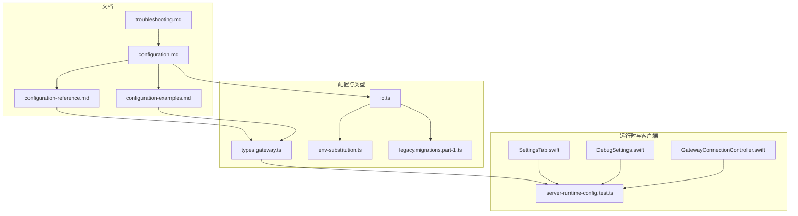
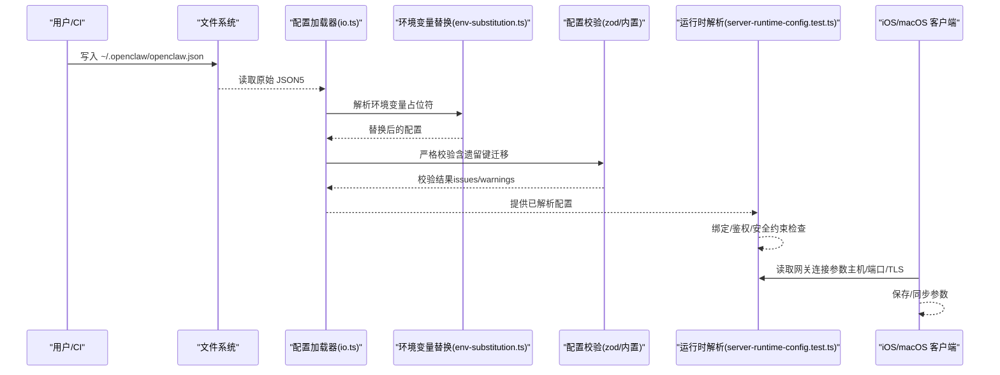
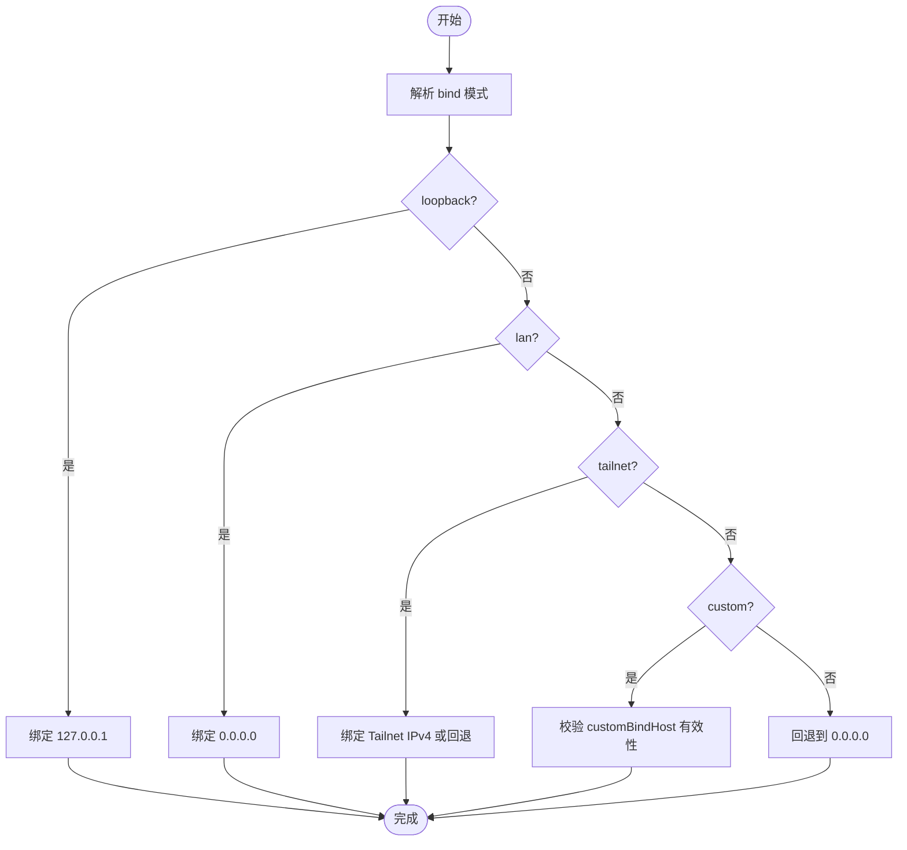
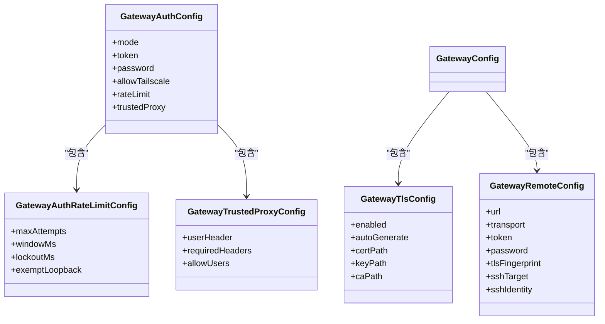
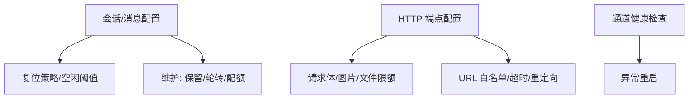
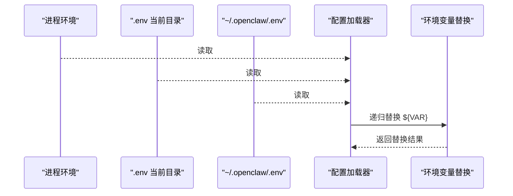
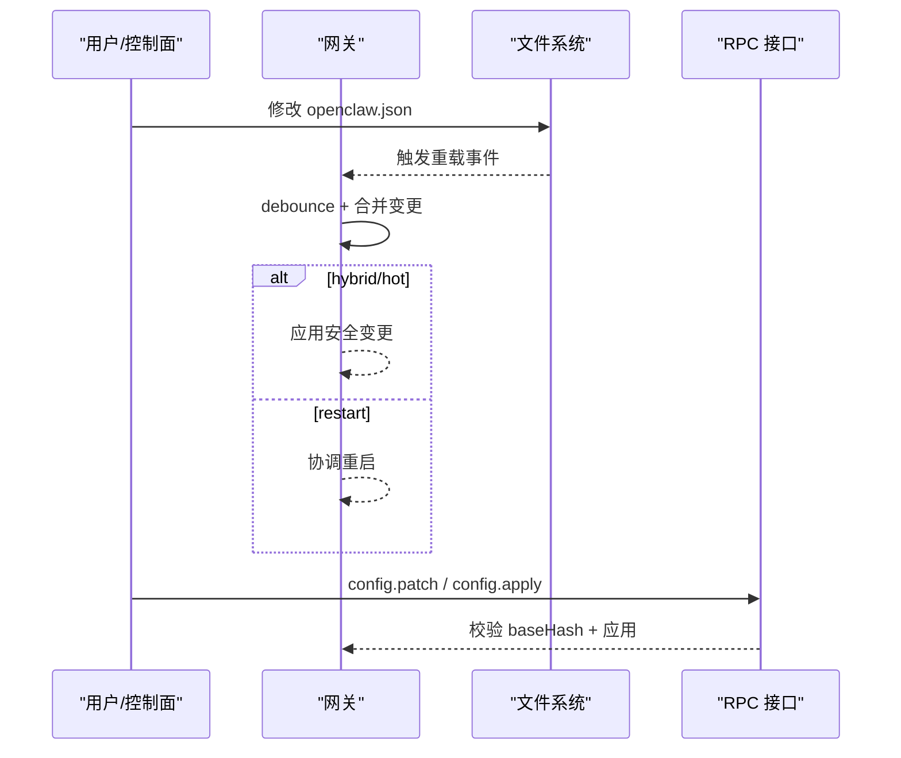
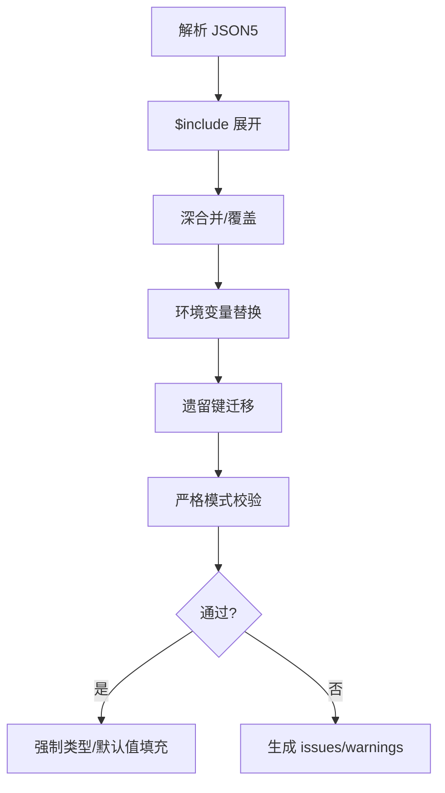
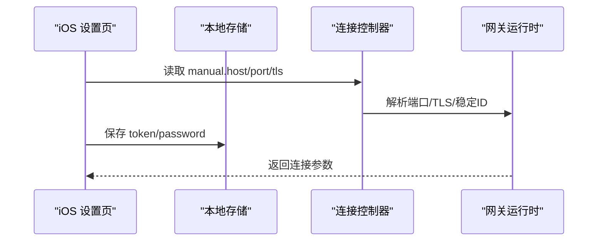
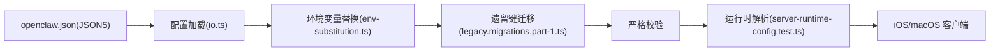

# 网关配置管理

## 目录
1. [简介](#简介)
2. [项目结构](#项目结构)
3. [核心组件](#核心组件)
4. [架构总览](#架构总览)
5. [详细组件分析](#详细组件分析)
6. [依赖关系分析](#依赖关系分析)
7. [性能考量](#性能考量)
8. [故障排除指南](#故障排除指南)
9. [结论](#结论)
10. [附录](#附录)

## 简介
本指南面向 OpenClaw 网关的配置管理，系统性讲解网络与安全、性能与超时、热重载与动态更新、环境变量与密钥注入、配置验证与迁移策略，并提供多场景模板与最佳实践。读者可据此在本地、容器或云平台中稳定部署并高效运维 OpenClaw 网关。

## 项目结构
围绕“网关配置”的关键文档与代码位置如下：
- 文档层：配置总览、参考手册、示例与排障
- 类型与校验：网关配置类型定义、环境变量替换、配置加载与校验
- 运行时约束：绑定与鉴权的运行时解析与限制
- 客户端集成：iOS/macOS 客户端对网关配置项的读取与同步
- 兼容与迁移：旧版键名迁移与兼容处理

**图表来源**
- [docs/gateway/configuration.md](file://docs/gateway/configuration.md#L1-L547)
- [docs/gateway/configuration-reference.md](file://docs/gateway/configuration-reference.md#L1-L800)
- [docs/gateway/configuration-examples.md](file://docs/gateway/configuration-examples.md#L1-L638)
- [src/config/types.gateway.ts](file://src/config/types.gateway.ts#L369-L417)
- [src/config/io.ts](file://src/config/io.ts#L707-L972)
- [src/config/env-substitution.ts](file://src/config/env-substitution.ts#L1-L49)
- [src/config/legacy.migrations.part-1.ts](file://src/config/legacy.migrations.part-1.ts#L97-L200)
- [src/gateway/server-runtime-config.test.ts](file://src/gateway/server-runtime-config.test.ts#L70-L202)
- [apps/ios/Sources/Settings/SettingsTab.swift](file://apps/ios/Sources/Settings/SettingsTab.swift#L457-L483)
- [apps/ios/Sources/Gateway/GatewayConnectionController.swift](file://apps/ios/Sources/Gateway/GatewayConnectionController.swift#L317-L342)
- [apps/macos/Sources/OpenClaw/DebugSettings.swift](file://apps/macos/Sources/OpenClaw/DebugSettings.swift#L174-L185)
- [docs/gateway/troubleshooting.md](file://docs/gateway/troubleshooting.md#L1-L367)

**章节来源**
- [docs/gateway/configuration.md](file://docs/gateway/configuration.md#L1-L547)
- [docs/gateway/configuration-reference.md](file://docs/gateway/configuration-reference.md#L1-L800)
- [docs/gateway/configuration-examples.md](file://docs/gateway/configuration-examples.md#L1-L638)

## 核心组件
- 网关配置类型与字段
  - 端口、绑定模式、控制 UI、鉴权、TLS、HTTP 端点、节点与工具访问控制、健康检查周期等
- 配置加载与校验
  - 支持 JSON5、$include、环境变量替换、严格模式校验、遗留键迁移
- 运行时约束
  - 绑定模式与鉴权模式的互斥与安全限制（如非回环绑定必须配置鉴权）
- 动态更新
  - 热重载策略（hybrid/hot/restart/off）、变更合并与重启协调
- 客户端集成
  - iOS/macOS 客户端读取与保存网关连接参数（主机、端口、TLS）

**章节来源**
- [src/config/types.gateway.ts](file://src/config/types.gateway.ts#L369-L417)
- [src/config/io.ts](file://src/config/io.ts#L707-L972)
- [src/gateway/server-runtime-config.test.ts](file://src/gateway/server-runtime-config.test.ts#L70-L202)
- [apps/ios/Sources/Settings/SettingsTab.swift](file://apps/ios/Sources/Settings/SettingsTab.swift#L457-L483)
- [apps/ios/Sources/Gateway/GatewayConnectionController.swift](file://apps/ios/Sources/Gateway/GatewayConnectionController.swift#L317-L342)
- [apps/macos/Sources/OpenClaw/DebugSettings.swift](file://apps/macos/Sources/OpenClaw/DebugSettings.swift#L174-L185)

## 架构总览
下图展示“配置文件—类型定义—加载校验—运行时解析—客户端集成”的整体流程。

**图表来源**
- [src/config/io.ts](file://src/config/io.ts#L707-L972)
- [src/config/env-substitution.ts](file://src/config/env-substitution.ts#L1-L49)
- [src/gateway/server-runtime-config.test.ts](file://src/gateway/server-runtime-config.test.ts#L70-L202)
- [apps/ios/Sources/Gateway/GatewayConnectionController.swift](file://apps/ios/Sources/Gateway/GatewayConnectionController.swift#L317-L342)

## 详细组件分析

### 网络与绑定（bind/port/control UI）
- 绑定模式
  - auto/lan/loopback/custom/tailnet；默认 loopback（127.0.0.1），支持自定义 IP（customBindHost）
- 控制 UI
  - basePath、allowedOrigins、允许不安全认证开关、禁用设备身份校验等
- 端口
  - 默认 18789；WS 与 HTTP 复用同一端口

**图表来源**
- [src/config/types.gateway.ts](file://src/config/types.gateway.ts#L369-L417)
- [src/gateway/server-runtime-config.test.ts](file://src/gateway/server-runtime-config.test.ts#L70-L202)

**章节来源**
- [src/config/types.gateway.ts](file://src/config/types.gateway.ts#L369-L417)
- [src/gateway/server-runtime-config.test.ts](file://src/gateway/server-runtime-config.test.ts#L70-L202)

### 安全配置（鉴权、证书、代理信任）
- 鉴权模式
  - none/token/password/trusted-proxy；默认 token
  - trusted-proxy 需要 trustedProxies 列表与用户标识头
- 速率限制
  - 最大失败次数、滑动窗口、封禁时长、回环豁免
- 证书与 TLS
  - 自动签发自签名证书、PEM 路径、CA Bundle
- 反向代理信任
  - x-forwarded-for 优先，可选 x-real-ip 回退
- 远程网关
  - 支持 ssh/direct 传输、TLS 指纹校验、凭据

**图表来源**
- [src/config/types.gateway.ts](file://src/config/types.gateway.ts#L150-L203)

**章节来源**
- [src/config/types.gateway.ts](file://src/config/types.gateway.ts#L150-L203)

### 性能参数与超时（会话、消息、HTTP）
- 会话与消息
  - 会话复位策略、维护与磁盘配额、打字间隔、发送策略
- HTTP 端点
  - /v1/chat/completions 与 /v1/responses 的请求体大小、图片/文件限额、URL 获取白名单、超时与重定向限制
- 通道健康检查
  - 周期性检查并自动重启异常通道

**图表来源**
- [src/config/types.gateway.ts](file://src/config/types.gateway.ts#L214-L346)

**章节来源**
- [src/config/types.gateway.ts](file://src/config/types.gateway.ts#L214-L346)

### 环境变量与密钥注入
- 环境变量来源
  - 进程环境、当前目录 .env、全局 ~/.openclaw/.env；不会覆盖已有环境变量
- 环境变量替换
  - 支持 $&#123;VAR_NAME&#125;，仅匹配大写命名；缺失抛错或收集警告；可转义 $$&#123;VAR&#125;
- 密钥引用
  - SecretRef 支持 env/file/exec；部分字段支持 SecretInput

**图表来源**
- [src/config/io.ts](file://src/config/io.ts#L707-L972)
- [src/config/env-substitution.ts](file://src/config/env-substitution.ts#L1-L49)

**章节来源**
- [src/config/io.ts](file://src/config/io.ts#L707-L972)
- [src/config/env-substitution.ts](file://src/config/env-substitution.ts#L1-L49)

### 配置热重载与动态更新
- 热重载模式
  - hybrid（默认，安全变更即时应用，关键变更自动重启）、hot（仅安全变更）、restart（每次变更重启）、off（禁用监听）
- 重载策略
  - debounceMs（默认 300ms）；变更合并与重启节流
- RPC 更新
  - config.apply（整包替换）、config.patch（部分合并）；带 baseHash 校验与重启延迟控制

**图表来源**
- [docs/gateway/configuration.md](file://docs/gateway/configuration.md#L349-L447)

**章节来源**
- [docs/gateway/configuration.md](file://docs/gateway/configuration.md#L349-L447)

### 配置验证与默认值
- 严格校验
  - 未知键拒绝启动；doctor 命令定位问题；支持 --fix 自动修复
- 默认值
  - 端口 18789、绑定 loopback、HTTP 端点默认关闭、聊天补全默认禁用等
- 兼容与迁移
  - 旧键迁移（如 gateway.token → gateway.auth.token）、字段别名与自动规范化

**图表来源**
- [src/config/io.ts](file://src/config/io.ts#L707-L972)
- [src/config/legacy.migrations.part-1.ts](file://src/config/legacy.migrations.part-1.ts#L97-L200)

**章节来源**
- [src/config/io.ts](file://src/config/io.ts#L707-L972)
- [src/config/legacy.migrations.part-1.ts](file://src/config/legacy.migrations.part-1.ts#L97-L200)

### 客户端集成与参数同步
- iOS
  - 监听 manual gateway 参数变化，同步端口与 TLS 判定
  - 保存 token/password 到本地存储
- macOS
  - Debug 设置中显示网关状态
- 通用
  - 通过运行时解析与控制 UI 共享的参数进行连接

**图表来源**
- [apps/ios/Sources/Settings/SettingsTab.swift](file://apps/ios/Sources/Settings/SettingsTab.swift#L457-L483)
- [apps/ios/Sources/Gateway/GatewayConnectionController.swift](file://apps/ios/Sources/Gateway/GatewayConnectionController.swift#L317-L342)
- [apps/macos/Sources/OpenClaw/DebugSettings.swift](file://apps/macos/Sources/OpenClaw/DebugSettings.swift#L174-L185)

**章节来源**
- [apps/ios/Sources/Settings/SettingsTab.swift](file://apps/ios/Sources/Settings/SettingsTab.swift#L457-L483)
- [apps/ios/Sources/Gateway/GatewayConnectionController.swift](file://apps/ios/Sources/Gateway/GatewayConnectionController.swift#L317-L342)
- [apps/macos/Sources/OpenClaw/DebugSettings.swift](file://apps/macos/Sources/OpenClaw/DebugSettings.swift#L174-L185)

## 依赖关系分析
- 配置文件依赖
  - JSON5 语法与 $include；严格校验与遗留键迁移
- 运行时依赖
  - 绑定模式与鉴权模式强耦合；非回环绑定必须配置鉴权
- 客户端依赖
  - iOS/macOS 读取网关运行时参数并持久化凭据

**图表来源**
- [src/config/io.ts](file://src/config/io.ts#L707-L972)
- [src/config/env-substitution.ts](file://src/config/env-substitution.ts#L1-L49)
- [src/config/legacy.migrations.part-1.ts](file://src/config/legacy.migrations.part-1.ts#L97-L200)
- [src/gateway/server-runtime-config.test.ts](file://src/gateway/server-runtime-config.test.ts#L70-L202)

**章节来源**
- [src/config/io.ts](file://src/config/io.ts#L707-L972)
- [src/config/env-substitution.ts](file://src/config/env-substitution.ts#L1-L49)
- [src/config/legacy.migrations.part-1.ts](file://src/config/legacy.migrations.part-1.ts#L97-L200)
- [src/gateway/server-runtime-config.test.ts](file://src/gateway/server-runtime-config.test.ts#L70-L202)

## 性能考量
- 热重载抖动控制
  - debounceMs 降低频繁变更导致的抖动
- 请求体与媒体限额
  - 通过 HTTP 端点配置限制资源消耗
- 通道健康检查
  - 定期重启异常通道，避免长期不可用
- 会话维护
  - 通过磁盘配额与轮转策略控制存储占用

[本节为通用指导，无需特定文件引用]

## 故障排除指南
- 常见症状与命令梯
  - 使用 status/gateway status/logs/doctor/channels status 排查
- 控制 UI 连接问题
  - URL、鉴权模式、设备身份要求、nonce/signature 流程
- 服务未运行
  - 检查 mode/local 开关、端口冲突、绑定与鉴权不匹配
- 升级后异常
  - 鉴权与 URL 行为变更、绑定与鉴权护栏收紧、配对与设备身份状态变化

**章节来源**
- [docs/gateway/troubleshooting.md](file://docs/gateway/troubleshooting.md#L1-L367)

## 结论
通过严格的配置校验、灵活的热重载与动态更新、完善的环境变量与密钥注入机制，以及清晰的运行时安全约束，OpenClaw 网关可在多种部署环境中实现高可用与易运维。建议结合本文模板与最佳实践，按需启用 TLS、限定鉴权模式、合理设置热重载与健康检查，并在生产环境采用反向代理与受信代理链路。

## 附录

### 配置文件格式与示例
- 格式
  - JSON5（支持注释与尾随逗号）
- 示例
  - 快速起步、扩展示例、多平台、安全 DM 模式、OAuth 与 API Key 失败回退、本地模型等

**章节来源**
- [docs/gateway/configuration-examples.md](file://docs/gateway/configuration-examples.md#L1-L638)

### 网关配置字段速览（节选）
- 网关
  - port、mode、bind、customBindHost、controlUi、auth、tailscale、remote、reload、tls、http、nodes、trustedProxies、allowRealIpFallback、tools、channelHealthCheckMinutes
- 鉴权
  - mode、token、password、allowTailscale、rateLimit、trustedProxy
- TLS
  - enabled、autoGenerate、certPath、keyPath、caPath
- HTTP 端点
  - /v1/chat/completions 与 /v1/responses 的请求体大小、媒体限额、URL 白名单、超时与重定向限制

**章节来源**
- [src/config/types.gateway.ts](file://src/config/types.gateway.ts#L369-L417)

### 运行时参数摘要（来自诊断工具）
- 包含 path、exists、valid、issues、legacyIssues、gateway（mode/bind/port/controlUiEnabled/basePath/authMode/remote 等）、discovery（wideAreaEnabled）

**章节来源**
- [src/commands/gateway-status/helpers.ts](file://src/commands/gateway-status/helpers.ts#L27-L81)