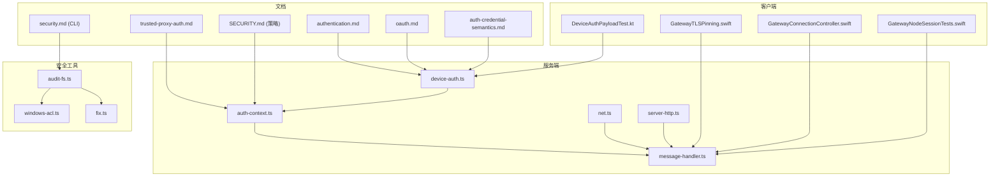
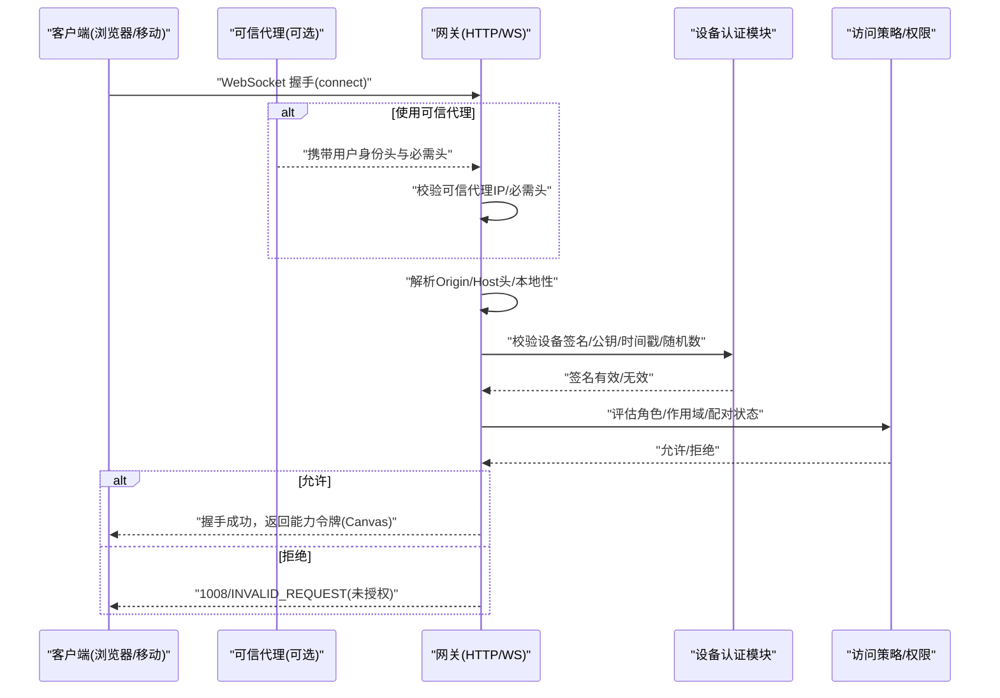
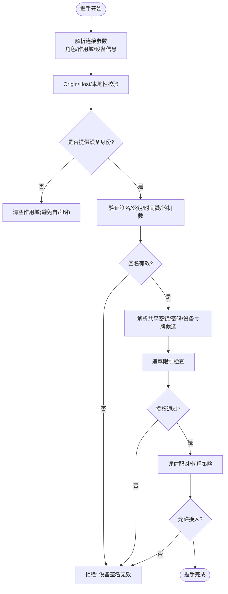
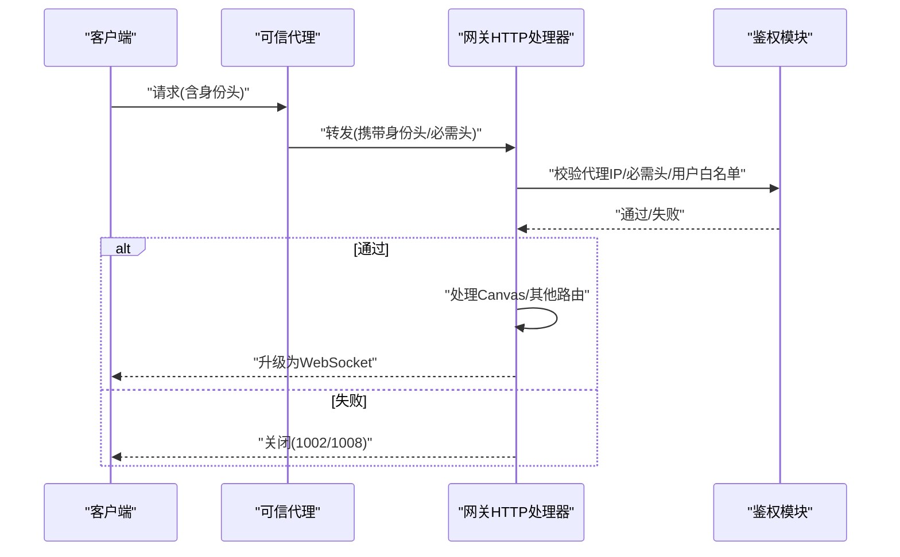
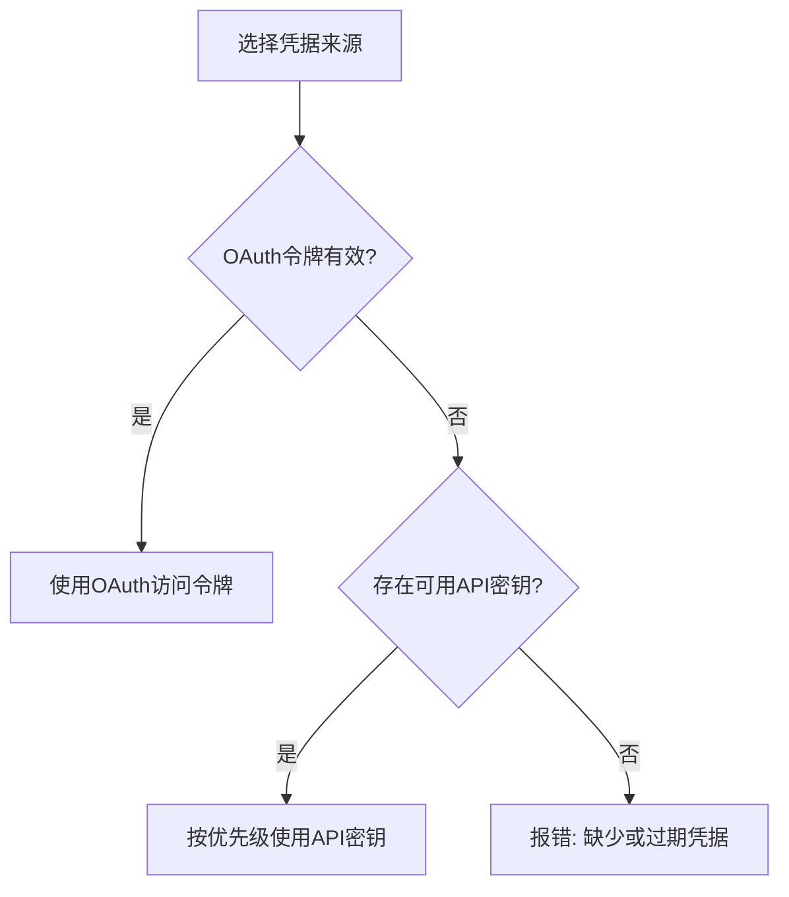
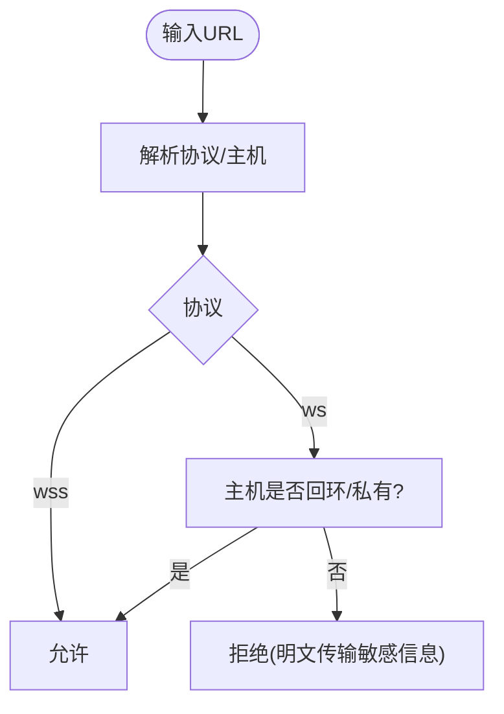
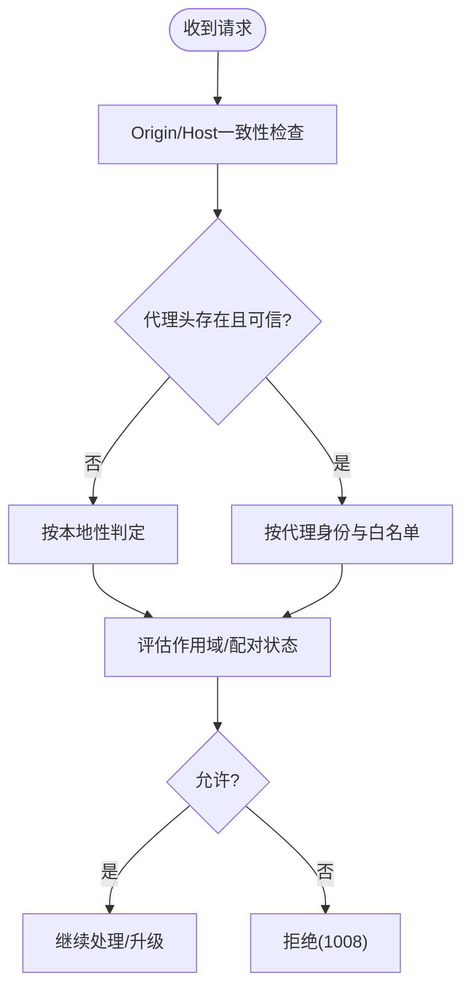
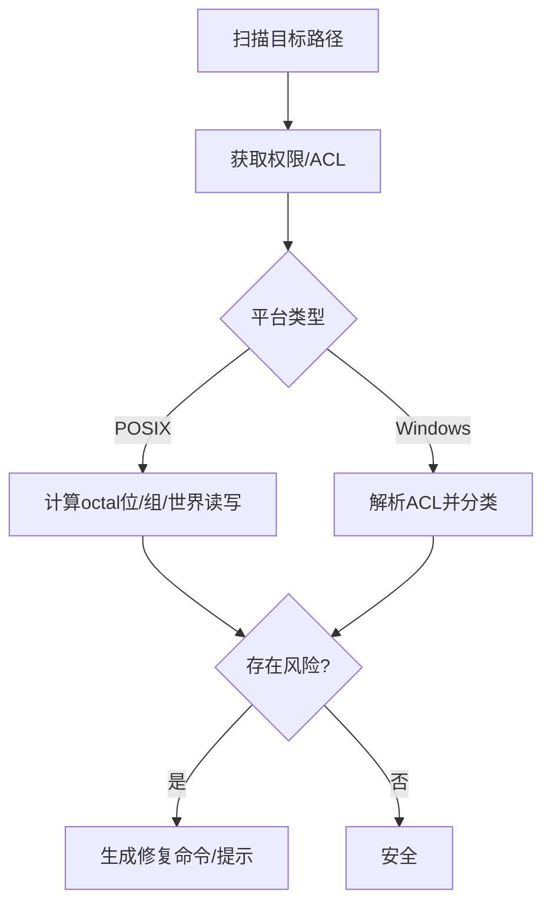
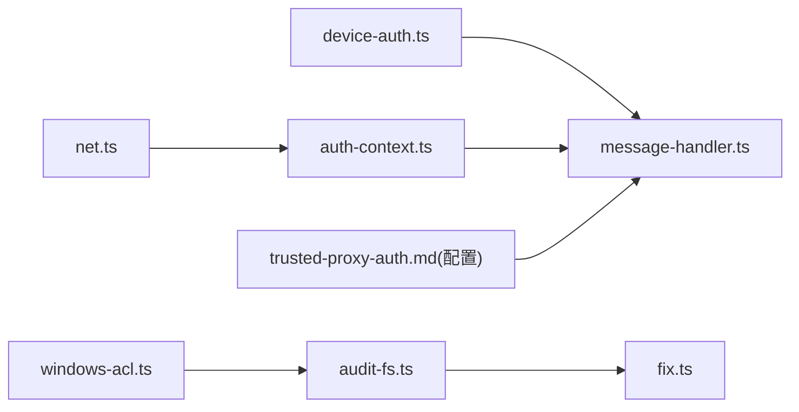

# 认证与安全

## 目录
1. [简介](#简介)
2. [项目结构](#项目结构)
3. [核心组件](#核心组件)
4. [架构总览](#架构总览)
5. [详细组件分析](#详细组件分析)
6. [依赖关系分析](#依赖关系分析)
7. [性能考量](#性能考量)
8. [故障排查指南](#故障排查指南)
9. [结论](#结论)
10. [附录](#附录)

## 简介
本文件面向OpenClaw网关的认证与安全机制，系统化阐述多类认证模式（API密钥、OAuth、设备认证）的实现原理与配置方法；解释凭据优先级与轮换策略；梳理访问控制、权限校验与安全路径检查；覆盖WebSocket连接安全、消息传输与防重放等安全要点；并提供安全审计、异常检测与威胁响应方案，帮助运维与开发人员在不同部署场景下建立稳健的安全基线。

## 项目结构
围绕认证与安全的关键文档与代码分布如下：
- 文档侧：认证与OAuth流程、可信代理认证、安全审计CLI、信任模型与合规指引
- 代码侧：设备认证载荷构建、WebSocket握手与鉴权上下文、网络地址与来源判定、文件权限审计与修复、客户端TLS固定与证书指纹

图表来源
- [docs/gateway/authentication.md](file://docs/gateway/authentication.md#L1-L180)
- [docs/concepts/oauth.md](file://docs/concepts/oauth.md#L1-L159)
- [docs/gateway/trusted-proxy-auth.md](file://docs/gateway/trusted-proxy-auth.md#L1-L330)
- [docs/auth-credential-semantics.md](file://docs/auth-credential-semantics.md#L1-L46)
- [docs/cli/security.md](file://docs/cli/security.md#L1-L72)
- [SECURITY.md](file://SECURITY.md#L1-L286)
- [src/gateway/device-auth.ts](file://src/gateway/device-auth.ts#L1-L55)
- [src/gateway/server/ws-connection/auth-context.ts](file://src/gateway/server/ws-connection/auth-context.ts#L1-L219)
- [src/gateway/server/ws-connection/message-handler.ts](file://src/gateway/server/ws-connection/message-handler.ts#L1-L800)
- [src/gateway/net.ts](file://src/gateway/net.ts#L1-L457)
- [src/gateway/server-http.ts](file://src/gateway/server-http.ts#L818-L842)
- [src/security/audit-fs.ts](file://src/security/audit-fs.ts#L1-L207)
- [src/security/windows-acl.ts](file://src/security/windows-acl.ts#L246-L306)
- [src/security/fix.ts](file://src/security/fix.ts#L110-L163)
- [apps/ios/Sources/Gateway/GatewayConnectionController.swift](file://apps/ios/Sources/Gateway/GatewayConnectionController.swift#L1028-L1071)
- [apps/shared/OpenClawKit/Sources/OpenClawKit/GatewayTLSPinning.swift](file://apps/shared/OpenClawKit/Sources/OpenClawKit/GatewayTLSPinning.swift#L66-L87)
- [apps/android/app/src/test/java/ai/openclaw/app/gateway/DeviceAuthPayloadTest.kt](file://apps/android/app/src/test/java/ai/openclaw/app/gateway/DeviceAuthPayloadTest.kt#L1-L35)
- [apps/shared/OpenClawKit/Tests/OpenClawKitTests/GatewayNodeSessionTests.swift](file://apps/shared/OpenClawKit/Tests/OpenClawKitTests/GatewayNodeSessionTests.swift#L41-L102)

章节来源
- [docs/gateway/authentication.md](file://docs/gateway/authentication.md#L1-L180)
- [docs/concepts/oauth.md](file://docs/concepts/oauth.md#L1-L159)
- [docs/gateway/trusted-proxy-auth.md](file://docs/gateway/trusted-proxy-auth.md#L1-L330)
- [docs/auth-credential-semantics.md](file://docs/auth-credential-semantics.md#L1-L46)
- [docs/cli/security.md](file://docs/cli/security.md#L1-L72)
- [SECURITY.md](file://SECURITY.md#L1-L286)

## 核心组件
- 设备认证载荷与签名验证：定义v2/v3设备认证载荷格式，支持平台/设备家族元数据归一化，用于WebSocket握手时的身份绑定与权限校验。
- WebSocket握手与鉴权上下文：解析共享密钥/密码、设备令牌候选、可信代理身份，执行速率限制与授权决策，结合Origin校验与本地性判断。
- 网络来源与地址判定：解析X-Forwarded-For/X-Real-IP，判定可信代理，识别本地/私有/回环地址，保障来源可信与最小暴露面。
- 安全审计与权限检查：对状态目录、凭据文件进行权限扫描与修复建议；在Windows上基于ACL进行细粒度读写检查。
- 可信代理认证：将网关认证委托给反向代理，通过受信IP白名单、用户身份头与可选的必需头进行授权，并对WebSocket升级进行前置校验。
- OAuth与API密钥：提供OAuth令牌交换、存储与刷新流程；API密钥轮换与优先级策略；凭据语义与探针输出稳定原因码。
- 客户端TLS固定与证书指纹：在移动端与通用SDK中实现服务器证书固定与指纹比对，降低中间人风险。

章节来源
- [src/gateway/device-auth.ts](file://src/gateway/device-auth.ts#L1-L55)
- [src/gateway/server/ws-connection/auth-context.ts](file://src/gateway/server/ws-connection/auth-context.ts#L1-L219)
- [src/gateway/server/ws-connection/message-handler.ts](file://src/gateway/server/ws-connection/message-handler.ts#L1-L800)
- [src/gateway/net.ts](file://src/gateway/net.ts#L1-L457)
- [src/security/audit-fs.ts](file://src/security/audit-fs.ts#L1-L207)
- [src/security/windows-acl.ts](file://src/security/windows-acl.ts#L246-L306)
- [src/security/fix.ts](file://src/security/fix.ts#L110-L163)
- [docs/gateway/trusted-proxy-auth.md](file://docs/gateway/trusted-proxy-auth.md#L1-L330)
- [docs/concepts/oauth.md](file://docs/concepts/oauth.md#L1-L159)
- [docs/gateway/authentication.md](file://docs/gateway/authentication.md#L1-L180)
- [docs/auth-credential-semantics.md](file://docs/auth-credential-semantics.md#L1-L46)
- [apps/ios/Sources/Gateway/GatewayConnectionController.swift](file://apps/ios/Sources/Gateway/GatewayConnectionController.swift#L1028-L1071)
- [apps/shared/OpenClawKit/Sources/OpenClawKit/GatewayTLSPinning.swift](file://apps/shared/OpenClawKit/Sources/OpenClawKit/GatewayTLSPinning.swift#L66-L87)

## 架构总览
下图展示从浏览器/移动客户端到网关的认证与安全交互路径，包括Origin校验、可信代理、设备令牌与共享密钥的协同决策，以及WebSocket升级前的HTTP鉴权与Canvas能力令牌签发。

图表来源
- [src/gateway/server/ws-connection/message-handler.ts](file://src/gateway/server/ws-connection/message-handler.ts#L363-L747)
- [src/gateway/server/ws-connection/auth-context.ts](file://src/gateway/server/ws-connection/auth-context.ts#L75-L154)
- [src/gateway/net.ts](file://src/gateway/net.ts#L400-L457)
- [docs/gateway/trusted-proxy-auth.md](file://docs/gateway/trusted-proxy-auth.md#L30-L90)
- [src/gateway/server-http.ts](file://src/gateway/server-http.ts#L818-L842)

## 详细组件分析

### 组件A：设备认证与握手流程
- 载荷版本：v3优先，兼容v2；支持平台与设备家族元数据归一化，避免大小写与非ASCII干扰。
- 签名验证：根据设备公钥验证握手载荷签名，确保消息完整性与不可否认性。
- 随机数与时间窗口：使用一次性nonce与时间偏差容忍，抵御重放与时钟漂移。
- 速率限制：针对设备令牌与共享密钥分别施加速率限制，防止暴力破解。
- 权限绑定：若未提供设备身份，清空作用域以避免自声明权限；仅在可信代理或已配对设备场景下授予作用域。

图表来源
- [src/gateway/server/ws-connection/message-handler.ts](file://src/gateway/server/ws-connection/message-handler.ts#L497-L747)
- [src/gateway/server/ws-connection/auth-context.ts](file://src/gateway/server/ws-connection/auth-context.ts#L156-L218)
- [src/gateway/device-auth.ts](file://src/gateway/device-auth.ts#L1-L55)

章节来源
- [src/gateway/device-auth.ts](file://src/gateway/device-auth.ts#L1-L55)
- [src/gateway/server/ws-connection/auth-context.ts](file://src/gateway/server/ws-connection/auth-context.ts#L1-L219)
- [src/gateway/server/ws-connection/message-handler.ts](file://src/gateway/server/ws-connection/message-handler.ts#L1-L800)

### 组件B：可信代理认证与WebSocket升级
- 代理模式：将网关认证委托给可信反向代理，仅允许来自配置的代理IP；代理负责用户身份注入与会话策略。
- 必需头校验：可配置必需头（如JWT），确保代理正确转发并覆盖客户端伪造。
- 升级前鉴权：在WebSocket升级前对Canvas路由与代理身份进行鉴权，失败则直接关闭连接。
- 配置清单：bind模式、trustedProxies、userHeader、requiredHeaders、allowUsers等。

图表来源
- [docs/gateway/trusted-proxy-auth.md](file://docs/gateway/trusted-proxy-auth.md#L30-L90)
- [src/gateway/server-http.ts](file://src/gateway/server-http.ts#L818-L842)

章节来源
- [docs/gateway/trusted-proxy-auth.md](file://docs/gateway/trusted-proxy-auth.md#L1-L330)
- [src/gateway/server-http.ts](file://src/gateway/server-http.ts#L818-L842)

### 组件C：OAuth与API密钥认证
- OAuth：支持PKCE授权码流程，令牌存储于每Agent的auth-profiles.json，支持多账户与按会话/全局路由。
- API密钥：支持单键覆盖、多键列表、环境变量优先级与去重；仅在配额/速率限制错误时自动重试下一密钥。
- 凭据语义：明确过期时间、引用解析、稳定原因码，doctor与status探针输出一致。

图表来源
- [docs/concepts/oauth.md](file://docs/concepts/oauth.md#L1-L159)
- [docs/gateway/authentication.md](file://docs/gateway/authentication.md#L123-L139)
- [docs/auth-credential-semantics.md](file://docs/auth-credential-semantics.md#L1-L46)

章节来源
- [docs/concepts/oauth.md](file://docs/concepts/oauth.md#L1-L159)
- [docs/gateway/authentication.md](file://docs/gateway/authentication.md#L1-L180)
- [docs/auth-credential-semantics.md](file://docs/auth-credential-semantics.md#L1-L46)

### 组件D：WebSocket URL安全与传输加密
- 默认策略：仅回环地址允许明文ws://；私有/公网ws://默认拒绝，避免CWE-319风险。
- 可选放宽：在严格受控的私有网络覆盖场景可开启allowPrivateWs，但不推荐。
- TLS固定：客户端实现证书固定与指纹比对，降低中间人风险。

图表来源
- [src/gateway/net.ts](file://src/gateway/net.ts#L411-L457)
- [apps/ios/Sources/Gateway/GatewayConnectionController.swift](file://apps/ios/Sources/Gateway/GatewayConnectionController.swift#L1028-L1071)
- [apps/shared/OpenClawKit/Sources/OpenClawKit/GatewayTLSPinning.swift](file://apps/shared/OpenClawKit/Sources/OpenClawKit/GatewayTLSPinning.swift#L66-L87)

章节来源
- [src/gateway/net.ts](file://src/gateway/net.ts#L400-L457)
- [apps/ios/Sources/Gateway/GatewayConnectionController.swift](file://apps/ios/Sources/Gateway/GatewayConnectionController.swift#L1028-L1071)
- [apps/shared/OpenClawKit/Sources/OpenClawKit/GatewayTLSPinning.swift](file://apps/shared/OpenClawKit/Sources/OpenClawKit/GatewayTLSPinning.swift#L66-L87)

### 组件E：访问控制、权限与安全路径检查
- Origin/Host校验：在无代理或特定客户端场景强制Origin/Host一致性，防止跨站冒用。
- 本地性判定：结合X-Forwarded-*与trustedProxies，避免代理绕过导致的本地性误判。
- 作用域绑定：未提供设备身份时清空作用域；仅在可信代理或已配对场景授予。
- Canvas能力令牌：签发短期能力令牌，限定访问范围与有效期。

图表来源
- [src/gateway/server/ws-connection/message-handler.ts](file://src/gateway/server/ws-connection/message-handler.ts#L497-L532)
- [src/gateway/net.ts](file://src/gateway/net.ts#L156-L185)

章节来源
- [src/gateway/server/ws-connection/message-handler.ts](file://src/gateway/server/ws-connection/message-handler.ts#L1-L800)
- [src/gateway/net.ts](file://src/gateway/net.ts#L1-L457)

### 组件F：凭据轮换与失效管理
- API密钥轮换：支持OPENCLAW_LIVE_*单键覆盖、多键列表、通配符键；仅在配额/速率限制错误时自动切换；最终返回最后一次尝试的错误。
- OAuth刷新：按文件锁并发安全地刷新，更新存储的凭据；支持多账户与按会话/全局路由。
- 凭据语义：明确过期时间、引用解析、稳定原因码，doctor/status探针输出一致。

章节来源
- [docs/gateway/authentication.md](file://docs/gateway/authentication.md#L123-L139)
- [docs/concepts/oauth.md](file://docs/concepts/oauth.md#L112-L122)
- [docs/auth-credential-semantics.md](file://docs/auth-credential-semantics.md#L12-L46)

### 组件G：安全审计与异常检测
- 文件权限审计：对状态目录与敏感文件进行POSIX权限或Windows ACL检查，识别世界/组可读写风险。
- 修复建议：提供chmod或icacls命令模板，支持自动修复（--fix）。
- CLI审计：提供openclaw security audit，输出严重级别与修复建议，支持JSON输出便于CI集成。

图表来源
- [src/security/audit-fs.ts](file://src/security/audit-fs.ts#L62-L142)
- [src/security/windows-acl.ts](file://src/security/windows-acl.ts#L246-L306)
- [src/security/fix.ts](file://src/security/fix.ts#L110-L163)
- [docs/cli/security.md](file://docs/cli/security.md#L17-L72)

章节来源
- [src/security/audit-fs.ts](file://src/security/audit-fs.ts#L1-L207)
- [src/security/windows-acl.ts](file://src/security/windows-acl.ts#L246-L306)
- [src/security/fix.ts](file://src/security/fix.ts#L110-L163)
- [docs/cli/security.md](file://docs/cli/security.md#L1-L72)

## 依赖关系分析
- 组件耦合
  - 设备认证模块被握手处理器依赖，用于签名验证与载荷版本判定。
  - 网络模块为鉴权与Origin校验提供来源判定与本地性判断。
  - 可信代理配置影响鉴权决策与WebSocket升级路径。
  - 安全审计工具独立运行，但其结果驱动配置修正与加固。
- 外部依赖
  - 反向代理（Pomerium/Caddy/nginx/oauth2-proxy/Traefik）作为可信边界的一部分。
  - 移动端与通用SDK的TLS固定与证书指纹校验。

图表来源
- [src/gateway/net.ts](file://src/gateway/net.ts#L1-L457)
- [src/gateway/server/ws-connection/auth-context.ts](file://src/gateway/server/ws-connection/auth-context.ts#L1-L219)
- [src/gateway/server/ws-connection/message-handler.ts](file://src/gateway/server/ws-connection/message-handler.ts#L1-L800)
- [src/gateway/device-auth.ts](file://src/gateway/device-auth.ts#L1-L55)
- [src/security/audit-fs.ts](file://src/security/audit-fs.ts#L1-L207)
- [src/security/windows-acl.ts](file://src/security/windows-acl.ts#L246-L306)
- [src/security/fix.ts](file://src/security/fix.ts#L110-L163)

章节来源
- [src/gateway/net.ts](file://src/gateway/net.ts#L1-L457)
- [src/gateway/server/ws-connection/auth-context.ts](file://src/gateway/server/ws-connection/auth-context.ts#L1-L219)
- [src/gateway/server/ws-connection/message-handler.ts](file://src/gateway/server/ws-connection/message-handler.ts#L1-L800)
- [src/gateway/device-auth.ts](file://src/gateway/device-auth.ts#L1-L55)
- [src/security/audit-fs.ts](file://src/security/audit-fs.ts#L1-L207)
- [src/security/windows-acl.ts](file://src/security/windows-acl.ts#L246-L306)
- [src/security/fix.ts](file://src/security/fix.ts#L110-L163)

## 性能考量
- 速率限制：对共享密钥与设备令牌分别施加速率限制，避免高频探测；合理设置阈值与冷却时间。
- 握手链路：尽量减少不必要的磁盘IO（凭据刷新）与网络往返（代理校验），优先缓存可信代理与Canvas能力令牌。
- 平台差异：Windows ACL解析与POSIX权限检查可能带来额外开销，建议批量扫描与定期审计而非实时逐项检查。

## 故障排查指南
- 可信代理相关
  - 代理来源不可信：确认trustedProxies配置与实际容器/负载均衡IP一致。
  - 用户身份头缺失：检查代理是否正确转发userHeader与必需头。
  - WebSocket仍失败：确认代理支持WebSocket升级且在升级阶段传递身份头。
- 设备认证相关
  - 设备签名无效：核对公钥、签名、时间戳与随机数。
  - 设备令牌不匹配：检查速率限制触发与失败记录。
- 权限与安全
  - openclaw security audit发现高危：按建议修复权限或调整配置。
  - WebSocket URL不安全：仅在受控私网场景启用allowPrivateWs。

章节来源
- [docs/gateway/trusted-proxy-auth.md](file://docs/gateway/trusted-proxy-auth.md#L276-L330)
- [src/gateway/server/ws-connection/auth-context.ts](file://src/gateway/server/ws-connection/auth-context.ts#L180-L218)
- [src/gateway/server/ws-connection/message-handler.ts](file://src/gateway/server/ws-connection/message-handler.ts#L662-L724)
- [docs/cli/security.md](file://docs/cli/security.md#L17-L72)

## 结论
OpenClaw在网关层提供了分层的安全机制：以设备认证与Origin/本地性校验为基础，结合可信代理与Canvas能力令牌，形成“代理负责身份、网关负责权限”的协作模型。配合OAuth与API密钥的灵活凭据管理、严格的WebSocket传输策略与持续的安全审计，可在个人助理与多租户场景下满足不同安全需求。建议在生产环境中优先采用HTTPS与可信代理，严格限制bind与暴露面，并通过CLI审计与权限修复工具保持配置健康。

## 附录
- 最佳实践
  - 始终使用HTTPS与可信代理；避免将网关直接暴露至公网。
  - 严格配置trustedProxies与allowUsers；启用必需头并验证代理行为。
  - 对状态目录与凭据文件执行最小权限原则；定期运行openclaw security audit。
  - 在受控私网场景谨慎启用allowPrivateWs；默认拒绝公网明文ws://。
- 合规与信任模型
  - 明确个人助理信任模型，避免将多用户共享视为多租户边界。
  - 对插件与扩展代码保持最小信任，严格工具策略与沙箱设置。

章节来源
- [SECURITY.md](file://SECURITY.md#L88-L170)
- [docs/gateway/trusted-proxy-auth.md](file://docs/gateway/trusted-proxy-auth.md#L129-L136)
- [docs/cli/security.md](file://docs/cli/security.md#L17-L72)