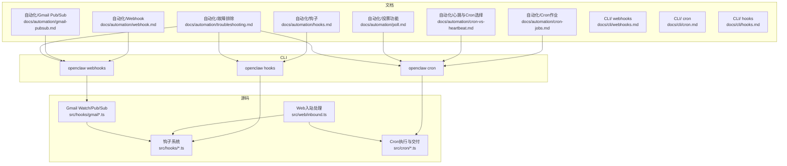
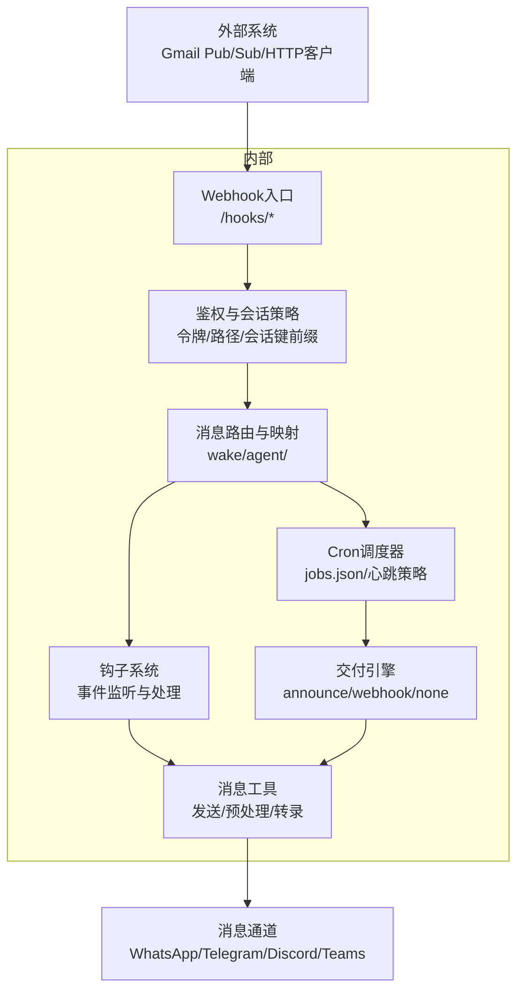
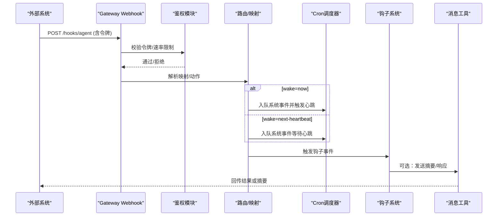
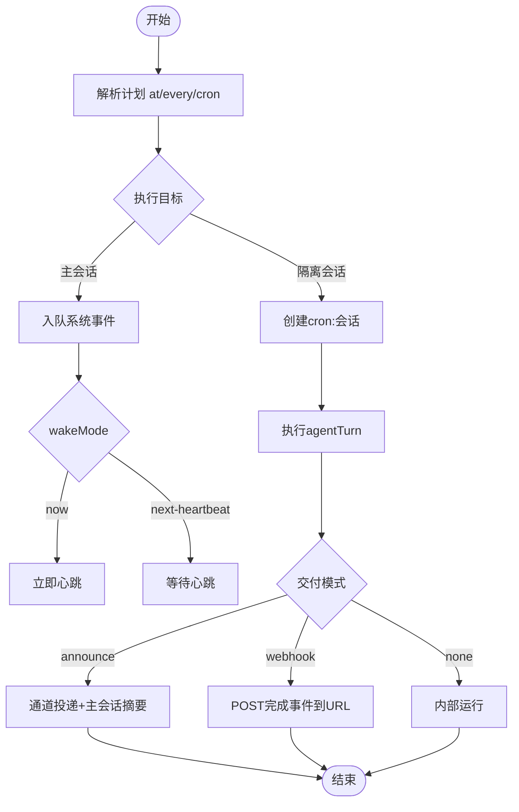
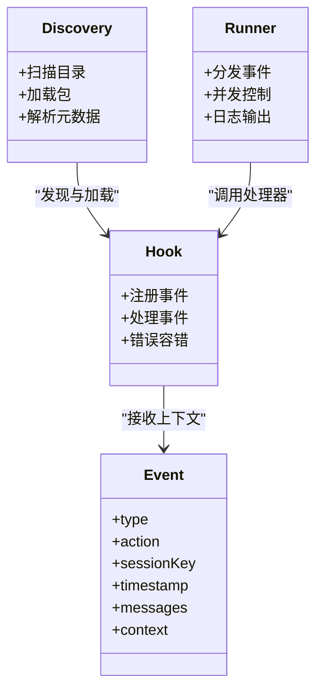
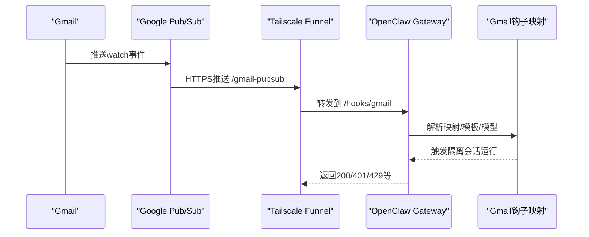
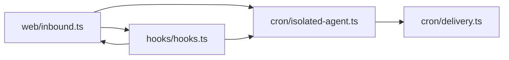

# 自动化和集成

## 目录
1. [引言](#引言)
2. [项目结构](#项目结构)
3. [核心组件](#核心组件)
4. [架构总览](#架构总览)
5. [详细组件分析](#详细组件分析)
6. [依赖关系分析](#依赖关系分析)
7. [性能考量](#性能考量)
8. [故障排除指南](#故障排除指南)
9. [结论](#结论)
10. [附录](#附录)

## 引言
本技术文档面向OpenClaw自动化与集成系统，聚焦以下主题：
- Webhook机制：事件订阅、消息格式、安全校验与外部触发链路
- Cron作业系统：定时任务创建、调度策略、执行监控与交付
- 钩子系统（Hooks）：架构、内置与自定义钩子、事件处理流程与扩展
- 外部服务集成：以Gmail Pub/Sub为例的完整流水线
- 工作流设计模式与最佳实践：心跳与Cron的选择、会话隔离与主会话运行
- 监控、日志与故障排除：可观测性与排障路径

## 项目结构
OpenClaw在“文档/CLI/源码”三个层面提供了完整的自动化与集成能力：
- 文档层：自动化指南、CLI参考、故障排除
- CLI层：openclaw hooks、openclaw cron、openclaw webhooks 等命令
- 源码层：钩子发现与执行、Cron调度与交付、Web入站处理、Gmail Watch与Pub/Sub桥接

图表来源
- [docs/automation/webhook.md](file://docs/automation/webhook.md#L1-L216)
- [docs/automation/cron-jobs.md](file://docs/automation/cron-jobs.md#L1-L686)
- [docs/automation/hooks.md](file://docs/automation/hooks.md#L1-L1050)
- [docs/automation/gmail-pubsub.md](file://docs/automation/gmail-pubsub.md#L1-L257)
- [docs/automation/cron-vs-heartbeat.md](file://docs/automation/cron-vs-heartbeat.md#L1-L287)
- [docs/automation/poll.md](file://docs/automation/poll.md#L1-L87)
- [docs/automation/troubleshooting.md](file://docs/automation/troubleshooting.md#L1-L123)
- [docs/cli/webhooks.md](file://docs/cli/webhooks.md#L1-L26)
- [docs/cli/cron.md](file://docs/cli/cron.md#L1-L78)
- [docs/cli/hooks.md](file://docs/cli/hooks.md#L1-L319)
- [src/hooks/hooks.ts](file://src/hooks/hooks.ts)
- [src/cron/isolated-agent.ts](file://src/cron/isolated-agent.ts)
- [src/cron/delivery.ts](file://src/cron/delivery.ts)
- [src/web/inbound.ts](file://src/web/inbound.ts)
- [src/hooks/gmail.ts](file://src/hooks/gmail.ts)
- [src/hooks/gmail-watcher.ts](file://src/hooks/gmail-watcher.ts)
- [src/hooks/gmail-watcher-lifecycle.ts](file://src/hooks/gmail-watcher-lifecycle.ts)

章节来源
- [docs/automation/webhook.md](file://docs/automation/webhook.md#L1-L216)
- [docs/automation/cron-jobs.md](file://docs/automation/cron-jobs.md#L1-L686)
- [docs/automation/hooks.md](file://docs/automation/hooks.md#L1-L1050)
- [docs/automation/gmail-pubsub.md](file://docs/automation/gmail-pubsub.md#L1-L257)
- [docs/automation/cron-vs-heartbeat.md](file://docs/automation/cron-vs-heartbeat.md#L1-L287)
- [docs/automation/poll.md](file://docs/automation/poll.md#L1-L87)
- [docs/automation/troubleshooting.md](file://docs/automation/troubleshooting.md#L1-L123)
- [docs/cli/webhooks.md](file://docs/cli/webhooks.md#L1-L26)
- [docs/cli/cron.md](file://docs/cli/cron.md#L1-L78)
- [docs/cli/hooks.md](file://docs/cli/hooks.md#L1-L319)

## 核心组件
- Webhook入口与安全
  - 启用与鉴权：令牌校验、路径与白名单、会话键策略
  - 端点：/hooks/wake、/hooks/agent、/hooks/&lt;name&gt; 映射
  - 响应与速率限制：200/401/429/400/413
- Cron调度与交付
  - 存储与历史：jobs.json、runs/&lt;jobId&gt;.jsonl、会话保留
  - 执行模型：主会话（systemEvent）与隔离会话（agentTurn）
  - 交付模式：announce、webhook、none；心跳唤醒策略
- 钩子系统（Hooks）
  - 发现与安装：工作区/托管/内置三层目录；支持包安装与链接
  - 事件类型：command、session、agent、gateway、message
  - 内置钩子：session-memory、bootstrap-extra-files、command-logger、boot-md
- Gmail Pub/Sub集成
  - 预设映射与模板；可选JS/TS转换模块；Tailscale Funnel暴露推送端点
  - 自动启动与续期；可配置默认模型与思考级别
- 投票（Poll）工具
  - 支持Telegram/WhatsApp/Discord/MS Teams；参数差异与渠道特性

章节来源
- [docs/automation/webhook.md](file://docs/automation/webhook.md#L13-L216)
- [docs/automation/cron-jobs.md](file://docs/automation/cron-jobs.md#L70-L686)
- [docs/automation/hooks.md](file://docs/automation/hooks.md#L79-L800)
- [docs/automation/gmail-pubsub.md](file://docs/automation/gmail-pubsub.md#L9-L257)
- [docs/automation/poll.md](file://docs/automation/poll.md#L9-L87)

## 架构总览
下图展示了从外部系统到OpenClaw内部自动化执行的关键路径：Webhook入口、Cron调度器、消息通道与钩子系统协同。

图表来源
- [docs/automation/webhook.md](file://docs/automation/webhook.md#L42-L158)
- [docs/automation/cron-jobs.md](file://docs/automation/cron-jobs.md#L135-L222)
- [docs/automation/hooks.md](file://docs/automation/hooks.md#L240-L380)
- [src/web/inbound.ts](file://src/web/inbound.ts)
- [src/cron/delivery.ts](file://src/cron/delivery.ts)
- [src/cron/isolated-agent.ts](file://src/cron/isolated-agent.ts)

## 详细组件分析

### Webhook机制
- 订阅与路由
  - /hooks/wake：向主会话入队系统事件并可立即触发心跳
  - /hooks/agent：隔离会话运行，支持模型/思考级别覆盖、交付目标与超时控制
  - /hooks/&lt;name&gt;：通过hooks.presets与hooks.mappings进行动态路由与模板化
- 安全与鉴权
  - 必须携带令牌（Authorization头或x-openclaw-token），拒绝查询串令牌
  - 速率限制与重复认证失败保护
- 会话键策略
  - 默认禁止请求级覆盖；推荐固定defaultSessionKey并限制允许前缀
- 响应与示例
  - 200/401/429/400/413；提供curl示例与模型覆盖

图表来源
- [docs/automation/webhook.md](file://docs/automation/webhook.md#L42-L158)
- [docs/automation/cron-jobs.md](file://docs/automation/cron-jobs.md#L135-L167)
- [src/web/inbound.ts](file://src/web/inbound.ts)

章节来源
- [docs/automation/webhook.md](file://docs/automation/webhook.md#L13-L216)

### Cron作业系统
- 存储与历史
  - jobs.json持久化；runs/&lt;jobId&gt;.jsonl记录运行历史；会话保留与日志修剪
- 执行模型
  - 主会话：enqueue系统事件，按wakeMode触发心跳
  - 隔离会话：独立cron:&lt;jobId&gt;会话，可直接announce或webhook交付
- 交付策略
  - announce：直接通道投递并简要摘要至主会话
  - webhook：POST完成事件到指定URL（可带Bearer令牌）
  - none：仅内部运行
- 调度与重试
  - at/every/cron三种计划；顶层stagger窗口与每job精确时间控制
  - 重试策略：瞬时错误指数回退；永久错误禁用；一次性任务成功后删除或禁用

图表来源
- [docs/automation/cron-jobs.md](file://docs/automation/cron-jobs.md#L113-L222)
- [src/cron/isolated-agent.ts](file://src/cron/isolated-agent.ts)
- [src/cron/delivery.ts](file://src/cron/delivery.ts)

章节来源
- [docs/automation/cron-jobs.md](file://docs/automation/cron-jobs.md#L70-L686)

### 钩子系统（Hooks）
- 发现与安装
  - 三层目录：工作区hooks > 托管hooks > 内置钩子
  - 支持npm包安装与本地链接；严格路径解析与依赖安装策略
- 事件模型
  - command/new/reset/stop
  - session/compact:before/after
  - agent/bootstrap
  - gateway/startup
  - message/received/transcribed/preprocessed/sent
- 内置钩子
  - session-memory：/new时保存会话快照
  - bootstrap-extra-files：注入额外引导文件
  - command-logger：审计命令日志
  - boot-md：网关启动时执行BOOT.md
- 最佳实践
  - 保持处理器轻量、错误容错、事件早过滤、使用具体事件键

图表来源
- [docs/automation/hooks.md](file://docs/automation/hooks.md#L79-L380)
- [src/hooks/hooks.ts](file://src/hooks/hooks.ts)

章节来源
- [docs/automation/hooks.md](file://docs/automation/hooks.md#L1-L1050)
- [docs/cli/hooks.md](file://docs/cli/hooks.md#L1-L319)

### Gmail Pub/Sub集成
- 流水线
  - Gmail Watch -> Pub/Sub推送 -> gog gmail watch serve -> OpenClaw /hooks/gmail
- 配置要点
  - 启用hooks.presets: ["gmail"] 或自定义mapping
  - 可设置hooks.gmail默认模型/思考级别
  - 使用Tailscale Funnel作为受信公网入口
- 自动化
  - Gateway可自动启动gog watch serve并续期
  - 支持wizard一键配置与运行

图表来源
- [docs/automation/gmail-pubsub.md](file://docs/automation/gmail-pubsub.md#L9-L257)
- [docs/automation/webhook.md](file://docs/automation/webhook.md#L132-L158)
- [src/hooks/gmail.ts](file://src/hooks/gmail.ts)
- [src/hooks/gmail-watcher.ts](file://src/hooks/gmail-watcher.ts)
- [src/hooks/gmail-watcher-lifecycle.ts](file://src/hooks/gmail-watcher-lifecycle.ts)
- [src/hooks/gmail-setup-utils.ts](file://src/hooks/gmail-setup-utils.ts)

章节来源
- [docs/automation/gmail-pubsub.md](file://docs/automation/gmail-pubsub.md#L1-L257)

### 心跳与Cron选择指南
- 决策依据
  - 是否需要精确时间、是否需要会话隔离、是否可批量检查、是否需要不同模型
- 组合策略
  - 心跳负责例行检查与上下文感知；Cron负责精确时间与隔离任务
- 成本与规模
  - 批量检查降低token开销；隔离Cron可选用更便宜模型

章节来源
- [docs/automation/cron-vs-heartbeat.md](file://docs/automation/cron-vs-heartbeat.md#L1-L287)

### 投票（Poll）工具
- 支持渠道与差异
  - Telegram：2-10选项、时长秒级、匿名/公开
  - WhatsApp：2-12选项、多选数限制
  - Discord：2-10选项、时长小时级、多选
  - MS Teams：自适应卡片，需网关在线记录投票
- CLI与RPC接口
  - openclaw message poll 与 poll RPC方法

章节来源
- [docs/automation/poll.md](file://docs/automation/poll.md#L1-L87)
- [docs/cli/cron.md](file://docs/cli/cron.md#L77-L87)

## 依赖关系分析
- Webhook依赖
  - Web入站处理（src/web/inbound.ts）对接鉴权与路由
  - Cron与钩子系统共同消费Webhook触发的事件
- Cron依赖
  - 交付引擎（src/cron/delivery.ts）与隔离执行（src/cron/isolated-agent.ts）
  - 心跳策略（src/cron/heartbeat-policy.ts）影响主会话模式
- 钩子系统依赖
  - 事件上下文（command/session/message）由Web与Cron共同产生
  - 消息工具（src/web/inbound.ts）为钩子提供消息发送能力

图表来源
- [src/web/inbound.ts](file://src/web/inbound.ts)
- [src/hooks/hooks.ts](file://src/hooks/hooks.ts)
- [src/cron/isolated-agent.ts](file://src/cron/isolated-agent.ts)
- [src/cron/delivery.ts](file://src/cron/delivery.ts)

章节来源
- [src/web/inbound.ts](file://src/web/inbound.ts)
- [src/hooks/hooks.ts](file://src/hooks/hooks.ts)
- [src/cron/isolated-agent.ts](file://src/cron/isolated-agent.ts)
- [src/cron/delivery.ts](file://src/cron/delivery.ts)

## 性能考量
- Cron高负载
  - 控制会话保留窗口与运行日志大小，避免IO与清理压力
  - 将噪声任务放入隔离模式并合理设置交付规则
- 心跳与批处理
  - 将多项检查合并到HEARTBEAT.md，减少API调用与token消耗
- 钩子处理器
  - 异步后台处理，避免阻塞命令处理流程

## 故障排除指南
- 基础排查命令
  - openclaw status/gateway status/logs --follow/doctor/channels status --probe
- Cron未触发
  - 检查cron状态、列表与最近运行；关注“scheduler disabled”“timer tick failed”“not-due”等信号
- Cron已触发但无交付
  - 检查交付模式/目标；通道探针确认凭据与权限
- 心跳被抑制
  - 检查activeHours、用户时区与队列占用情况
- 时间与时区
  - cron at不带时区按UTC；heartbeat activeHours按配置解析；注意主机时区变更影响

章节来源
- [docs/automation/troubleshooting.md](file://docs/automation/troubleshooting.md#L1-L123)

## 结论
OpenClaw通过Webhook、Cron与钩子系统构建了灵活而强大的自动化与集成框架。结合心跳与Cron的组合使用，可在成本、时效与上下文感知之间取得平衡。Gmail Pub/Sub等外部服务可通过预设映射与安全策略无缝接入。遵循本文的最佳实践与排障路径，可显著提升系统的稳定性与可观测性。

## 附录
- CLI速查
  - openclaw webhooks：Gmail Pub/Sub助手
  - openclaw cron：作业增删改查、手动运行与历史查看
  - openclaw hooks：钩子列表、启用/禁用、安装与更新
- 相关文档
  - Webhook与Cron、心跳与Cron选择、故障排除、投票功能

章节来源
- [docs/cli/webhooks.md](file://docs/cli/webhooks.md#L1-L26)
- [docs/cli/cron.md](file://docs/cli/cron.md#L1-L78)
- [docs/cli/hooks.md](file://docs/cli/hooks.md#L1-L319)