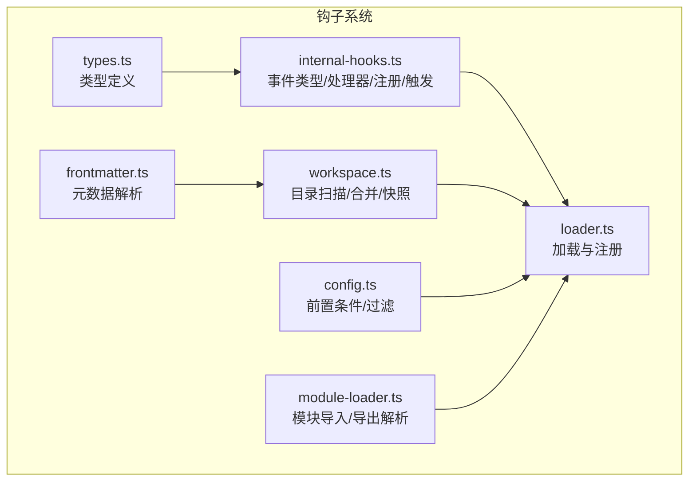
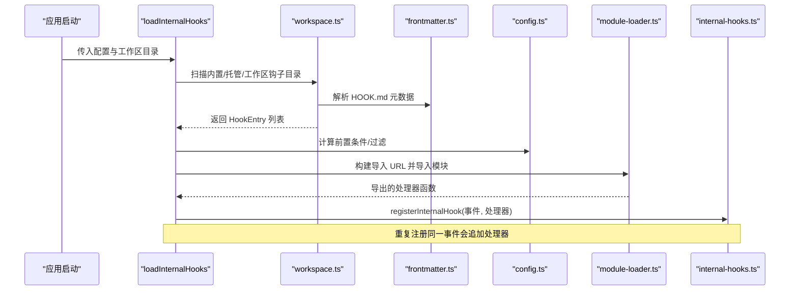
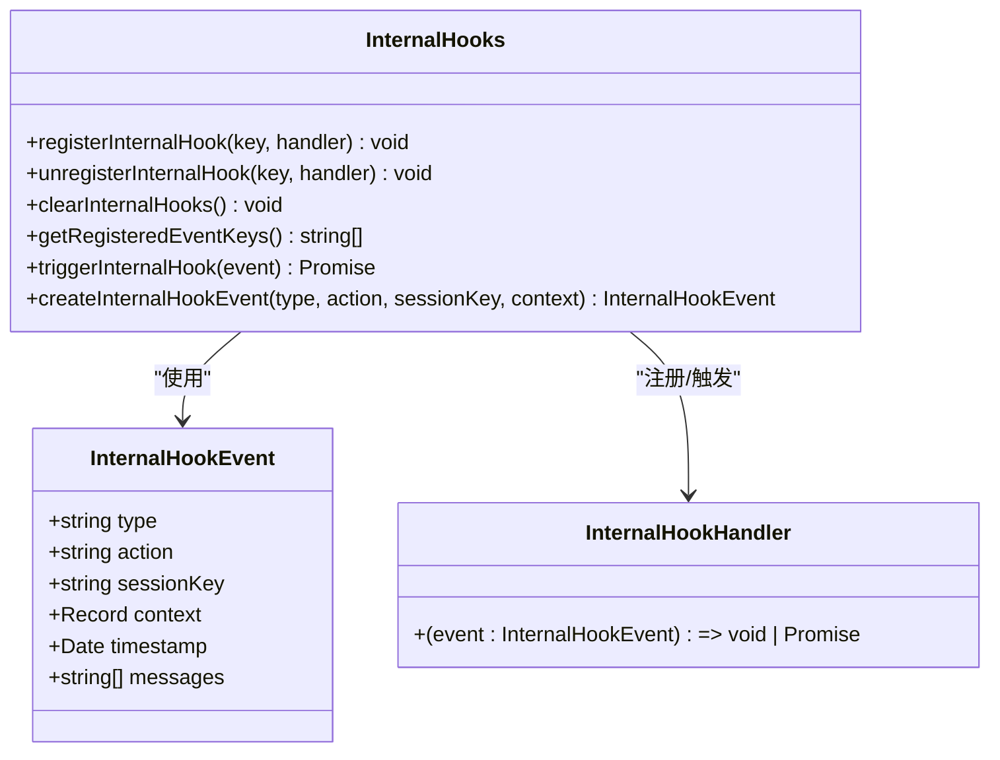
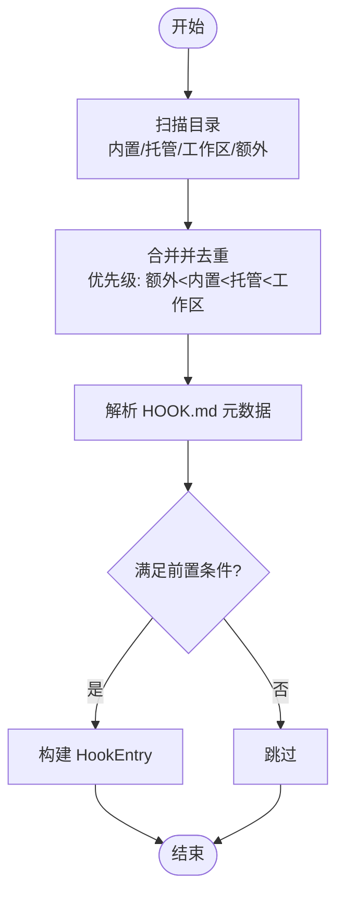
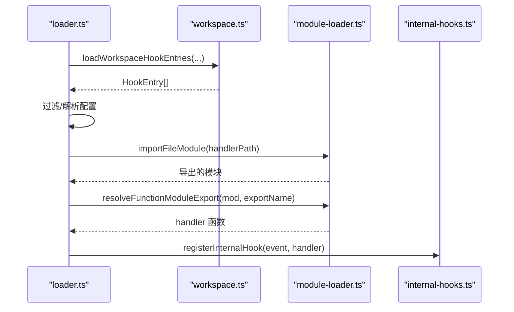
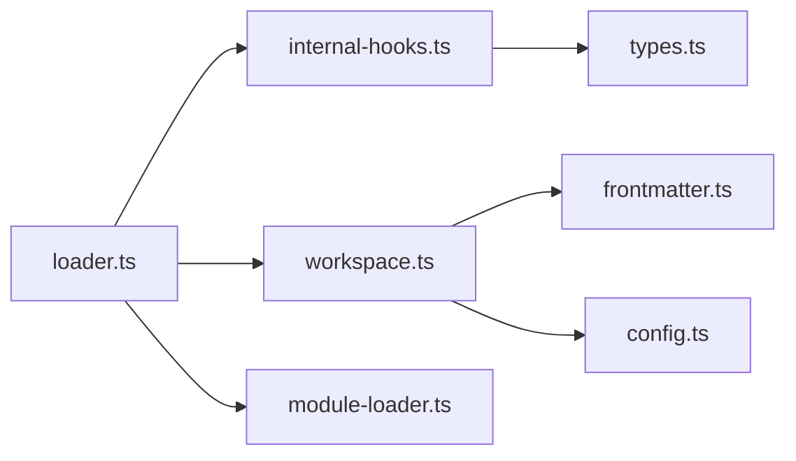
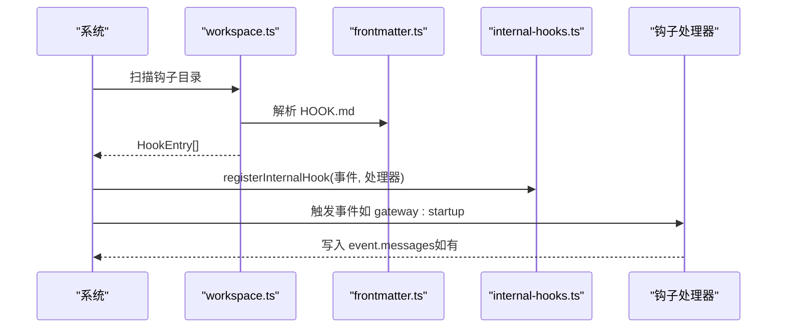

# 钩子系统

## 目录
1. [简介](#简介)
2. [项目结构](#项目结构)
3. [核心组件](#核心组件)
4. [架构总览](#架构总览)
5. [组件详解](#组件详解)
6. [依赖关系分析](#依赖关系分析)
7. [性能考量](#性能考量)
8. [故障排查指南](#故障排查指南)
9. [结论](#结论)
10. [附录](#附录)

## 简介
本文件为 OpenClaw 钩子系统的技术文档，面向开发者与高级用户，系统性阐述钩子的设计架构、扩展机制与运行时行为。内容涵盖：
- 钩子注册、事件触发与生命周期管理
- 内置钩子（消息钩子、系统钩子、业务钩子）的功能与使用方式
- 自定义钩子的开发流程（接口定义、实现规范、测试方法）
- 钩子模块的加载机制与依赖管理
- 配置、参数传递与返回值处理
- 性能优化建议与最佳实践
- 常见使用场景与参考路径

## 项目结构
钩子系统位于 src/hooks 目录，采用“目录发现 + 元数据驱动 + 运行时注册”的设计：
- 类型与事件模型：定义钩子事件类型、上下文、处理器签名等
- 加载器：从工作区、托管区、内置区扫描钩子，解析元数据并动态导入
- 配置与前置条件：根据配置、环境变量、二进制依赖、平台等决定钩子是否可被加载
- 模块加载：统一的模块导入与导出解析工具
- 内置钩子：随应用分发的示例钩子，展示事件类型与典型用法

图表来源
- [src/hooks/internal-hooks.ts](file://src/hooks/internal-hooks.ts#L1-L422)
- [src/hooks/types.ts](file://src/hooks/types.ts#L1-L68)
- [src/hooks/loader.ts](file://src/hooks/loader.ts#L1-L210)
- [src/hooks/workspace.ts](file://src/hooks/workspace.ts#L1-L381)
- [src/hooks/config.ts](file://src/hooks/config.ts#L1-L85)
- [src/hooks/frontmatter.ts](file://src/hooks/frontmatter.ts#L1-L82)
- [src/hooks/module-loader.ts](file://src/hooks/module-loader.ts#L1-L47)

章节来源
- [src/hooks/hooks.ts](file://src/hooks/hooks.ts#L1-L15)
- [src/hooks/internal-hooks.ts](file://src/hooks/internal-hooks.ts#L1-L422)
- [src/hooks/types.ts](file://src/hooks/types.ts#L1-L68)
- [src/hooks/loader.ts](file://src/hooks/loader.ts#L1-L210)
- [src/hooks/workspace.ts](file://src/hooks/workspace.ts#L1-L381)
- [src/hooks/config.ts](file://src/hooks/config.ts#L1-L85)
- [src/hooks/frontmatter.ts](file://src/hooks/frontmatter.ts#L1-L82)
- [src/hooks/module-loader.ts](file://src/hooks/module-loader.ts#L1-L47)

## 核心组件
- 事件与处理器
  - 事件类型：命令、会话、代理、网关、消息
  - 事件结构：包含类型、动作、会话键、时间戳、上下文、消息数组
  - 处理器签名：接收事件对象，返回 void 或 Promise&lt;void&gt;
- 注册与触发
  - 支持按通用事件类型或具体事件:动作两种粒度注册
  - 触发时先执行通用类型处理器，再执行具体事件处理器
  - 错误捕获与日志记录，不影响其他处理器执行
- 类型与工具
  - 定义 HookInstallSpec、OpenClawHookMetadata、Hook、HookEntry、HookEligibilityContext、HookSnapshot 等
  - 提供事件构造器、事件类型判定辅助函数

章节来源
- [src/hooks/internal-hooks.ts](file://src/hooks/internal-hooks.ts#L13-L174)
- [src/hooks/internal-hooks.ts](file://src/hooks/internal-hooks.ts#L214-L288)
- [src/hooks/internal-hooks.ts](file://src/hooks/internal-hooks.ts#L298-L312)
- [src/hooks/internal-hooks.ts](file://src/hooks/internal-hooks.ts#L346-L421)
- [src/hooks/types.ts](file://src/hooks/types.ts#L1-L68)

## 架构总览
钩子系统通过“目录扫描 + 元数据解析 + 动态导入 + 条件注册”完成全生命周期管理。

图表来源
- [src/hooks/loader.ts](file://src/hooks/loader.ts#L42-L201)
- [src/hooks/workspace.ts](file://src/hooks/workspace.ts#L230-L300)
- [src/hooks/frontmatter.ts](file://src/hooks/frontmatter.ts#L47-L69)
- [src/hooks/config.ts](file://src/hooks/config.ts#L63-L84)
- [src/hooks/module-loader.ts](file://src/hooks/module-loader.ts#L19-L46)
- [src/hooks/internal-hooks.ts](file://src/hooks/internal-hooks.ts#L214-L219)

## 组件详解

### 事件与处理器模型
- 事件类型与上下文
  - 命令、会话、代理、网关、消息等类型
  - 消息类事件包含发送/接收、转录、预处理等细分动作
- 事件结构
  - 包含 type、action、sessionKey、context、timestamp、messages 数组
  - messages 可由处理器写入，用于向用户推送提示
- 处理器注册与触发
  - registerInternalHook(eventKey, handler)
  - triggerInternalHook(event) 会按“通用类型 → 具体事件”的顺序调用处理器
  - clearInternalHooks/getRegisteredEventKeys 便于调试与测试

图表来源
- [src/hooks/internal-hooks.ts](file://src/hooks/internal-hooks.ts#L159-L174)
- [src/hooks/internal-hooks.ts](file://src/hooks/internal-hooks.ts#L214-L288)
- [src/hooks/internal-hooks.ts](file://src/hooks/internal-hooks.ts#L298-L312)

章节来源
- [src/hooks/internal-hooks.ts](file://src/hooks/internal-hooks.ts#L13-L174)
- [src/hooks/internal-hooks.ts](file://src/hooks/internal-hooks.ts#L214-L288)
- [src/hooks/internal-hooks.ts](file://src/hooks/internal-hooks.ts#L298-L312)

### 目录扫描与钩子发现
- 扫描范围
  - 内置钩子目录（随应用分发）
  - 托管钩子目录（用户共享）
  - 工作区钩子目录（最高优先级）
  - 额外目录（可通过配置注入）
- 合并与优先级
  - 合并策略：额外目录 &lt; 内置 &lt; 托管 &lt; 工作区；同名以高优先级覆盖
- 元数据解析
  - 读取 HOOK.md 的 YAML 前言块，解析名称、描述、事件列表、安装信息、前置条件等
  - 解析调用策略（启用/禁用）

图表来源
- [src/hooks/workspace.ts](file://src/hooks/workspace.ts#L230-L300)
- [src/hooks/frontmatter.ts](file://src/hooks/frontmatter.ts#L47-L69)
- [src/hooks/config.ts](file://src/hooks/config.ts#L63-L84)

章节来源
- [src/hooks/workspace.ts](file://src/hooks/workspace.ts#L136-L194)
- [src/hooks/workspace.ts](file://src/hooks/workspace.ts#L196-L228)
- [src/hooks/workspace.ts](file://src/hooks/workspace.ts#L230-L300)
- [src/hooks/frontmatter.ts](file://src/hooks/frontmatter.ts#L21-L69)
- [src/hooks/config.ts](file://src/hooks/config.ts#L63-L84)

### 动态加载与注册
- 边界安全
  - 使用边界文件读取与 realpath 校验，防止越界访问
- 导入策略
  - 对工作区/托管钩子启用缓存破坏（基于时间戳），确保修改即时生效
  - 默认模块导入，支持显式导出名或回退到默认导出
- 注册流程
  - 逐条事件注册处理器
  - 记录成功/失败日志，便于诊断

图表来源
- [src/hooks/loader.ts](file://src/hooks/loader.ts#L76-L128)
- [src/hooks/module-loader.ts](file://src/hooks/module-loader.ts#L19-L46)
- [src/hooks/internal-hooks.ts](file://src/hooks/internal-hooks.ts#L214-L219)

章节来源
- [src/hooks/loader.ts](file://src/hooks/loader.ts#L42-L201)
- [src/hooks/module-loader.ts](file://src/hooks/module-loader.ts#L1-L47)
- [src/hooks/internal-hooks.ts](file://src/hooks/internal-hooks.ts#L214-L219)

### 配置与前置条件
- 配置项
  - hooks.internal.enabled：总开关
  - hooks.internal.entries.&#123;hookKey&#125;.enabled：单个钩子开关
  - hooks.internal.load.extraDirs：额外扫描目录
- 前置条件评估
  - 平台/操作系统、二进制依赖、环境变量、配置路径等
  - 支持“至少满足任一二进制”等组合判断

章节来源
- [src/hooks/config.ts](file://src/hooks/config.ts#L24-L37)
- [src/hooks/config.ts](file://src/hooks/config.ts#L39-L61)
- [src/hooks/config.ts](file://src/hooks/config.ts#L63-L84)

### 内置钩子概览与使用
- session-memory：在 /new 或 /reset 时保存会话摘要到内存文件
- command-logger：集中记录命令事件到 JSONL 日志
- boot-md：网关启动后执行 BOOT.md
- 事件类型与要求详见各 HOOK.md 与内置说明

章节来源
- [src/hooks/bundled/README.md](file://src/hooks/bundled/README.md#L1-L224)
- [src/hooks/bundled/session-memory/HOOK.md](file://src/hooks/bundled/session-memory/HOOK.md#L1-L110)
- [src/hooks/bundled/command-logger/HOOK.md](file://src/hooks/bundled/command-logger/HOOK.md#L1-L123)
- [src/hooks/bundled/boot-md/HOOK.md](file://src/hooks/bundled/boot-md/HOOK.md#L1-L21)

## 依赖关系分析
- 组件耦合
  - internal-hooks.ts 作为事件内核，被 loader.ts 与 workspace.ts 间接依赖
  - frontmatter.ts 与 workspace.ts 协作解析元数据
  - module-loader.ts 为 loader.ts 提供模块导入能力
  - config.ts 为筛选与前置条件评估提供统一入口
- 外部依赖
  - Node.js 文件系统与 URL 工具
  - 边界文件读取与路径校验工具（由基础设施层提供）

图表来源
- [src/hooks/loader.ts](file://src/hooks/loader.ts#L1-L210)
- [src/hooks/workspace.ts](file://src/hooks/workspace.ts#L1-L381)
- [src/hooks/frontmatter.ts](file://src/hooks/frontmatter.ts#L1-L82)
- [src/hooks/config.ts](file://src/hooks/config.ts#L1-L85)
- [src/hooks/module-loader.ts](file://src/hooks/module-loader.ts#L1-L47)
- [src/hooks/internal-hooks.ts](file://src/hooks/internal-hooks.ts#L1-L422)
- [src/hooks/types.ts](file://src/hooks/types.ts#L1-L68)

章节来源
- [src/hooks/loader.ts](file://src/hooks/loader.ts#L1-L210)
- [src/hooks/workspace.ts](file://src/hooks/workspace.ts#L1-L381)
- [src/hooks/frontmatter.ts](file://src/hooks/frontmatter.ts#L1-L82)
- [src/hooks/config.ts](file://src/hooks/config.ts#L1-L85)
- [src/hooks/module-loader.ts](file://src/hooks/module-loader.ts#L1-L47)
- [src/hooks/internal-hooks.ts](file://src/hooks/internal-hooks.ts#L1-L422)
- [src/hooks/types.ts](file://src/hooks/types.ts#L1-L68)

## 性能考量
- 按需加载与缓存破坏
  - 工作区/托管钩子启用缓存破坏，避免频繁热更新带来的开销
  - 内置钩子通常无需破坏缓存，提升启动速度
- 事件触发成本
  - 触发时按通用类型与具体事件两层遍历，处理器数量较多时应控制注册规模
  - 异步处理器串行执行，注意避免阻塞
- I/O 与边界检查
  - 扫描与读取 HOOK.md 时进行边界检查，避免越界导致的异常与重复 I/O
- 建议
  - 将重型逻辑异步化，必要时拆分为多个细粒度钩子
  - 在高频事件（如消息流）中谨慎使用阻塞操作
  - 使用日志与指标监控钩子执行耗时与错误率

[本节为通用指导，不直接分析特定文件]

## 故障排查指南
- 常见问题
  - 钩子未加载：检查 hooks.internal.enabled 与单钩子 enabled；确认前置条件满足
  - 越界访问：边界文件读取失败会记录错误，检查钩子目录与路径
  - 导出非函数：模块导出必须为函数，否则忽略该钩子
  - 事件无处理器：确认事件键拼写正确（type:action）
- 排查步骤
  - 查看钩子加载日志（包含已注册事件与处理器数量）
  - 使用快照功能列出当前可用钩子及其事件
  - 临时禁用其他钩子定位冲突
  - 检查 HOOK.md 元数据与 handler 导出

章节来源
- [src/hooks/loader.ts](file://src/hooks/loader.ts#L84-L88)
- [src/hooks/loader.ts](file://src/hooks/loader.ts#L103-L106)
- [src/hooks/workspace.ts](file://src/hooks/workspace.ts#L302-L324)

## 结论
OpenClaw 钩子系统通过清晰的事件模型、严格的边界安全与灵活的元数据驱动，提供了可扩展、可观测且易于维护的扩展点。内置钩子展示了消息、系统与业务场景的典型用法，开发者可据此快速实现自定义钩子，并结合配置与前置条件实现跨平台、按需启用的运行时行为。

[本节为总结，不直接分析特定文件]

## 附录

### 钩子开发流程（自定义钩子）
- 目录结构
  - HOOK.md：元数据与文档（事件、前置条件、安装信息等）
  - handler.ts/js：默认导出或指定命名导出的处理器函数
- 实现规范
  - 处理器签名：接收 InternalHookEvent，返回 void/Promise&lt;void&gt;
  - 上下文使用：通过 event.context 获取事件相关数据
  - 消息推送：向 event.messages 写入字符串以通知用户
- 测试方法
  - 将钩子放入工作区 hooks 目录
  - 重启网关并启用钩子
  - 触发对应事件，观察日志与输出

章节来源
- [src/hooks/bundled/README.md](file://src/hooks/bundled/README.md#L63-L112)
- [src/hooks/bundled/README.md](file://src/hooks/bundled/README.md#L176-L224)

### 钩子配置与参数传递
- 配置位置
  - hooks.internal.enabled：全局开关
  - hooks.internal.entries.&#123;hookKey&#125;.enabled：单钩子开关
  - hooks.internal.load.extraDirs：额外扫描目录
- 参数传递
  - 事件上下文：通过 event.context 注入
  - 钩子配置：通过钩子自身 frontmatter 中的配置字段（如 session-memory 的 messages）
- 返回值处理
  - 处理器不返回值；若需反馈，写入 event.messages

章节来源
- [src/hooks/bundled/session-memory/HOOK.md](file://src/hooks/bundled/session-memory/HOOK.md#L58-L81)
- [src/hooks/bundled/README.md](file://src/hooks/bundled/README.md#L141-L161)
- [src/hooks/internal-hooks.ts](file://src/hooks/internal-hooks.ts#L159-L172)

### 生命周期与事件序列
- 生命周期阶段
  - 发现与解析：扫描目录 → 读取 HOOK.md → 解析元数据 → 过滤前置条件
  - 加载与注册：导入模块 → 解析导出 → 注册事件处理器
  - 运行时触发：事件发生 → 查找处理器 → 依次执行
- 典型事件序列（网关启动）
  - 扫描内置钩子目录
  - 解析 boot-md 元数据
  - 注册 gateway:startup 处理器
  - 网关启动后触发事件，执行 BOOT.md

图表来源
- [src/hooks/workspace.ts](file://src/hooks/workspace.ts#L230-L300)
- [src/hooks/frontmatter.ts](file://src/hooks/frontmatter.ts#L47-L69)
- [src/hooks/internal-hooks.ts](file://src/hooks/internal-hooks.ts#L270-L288)