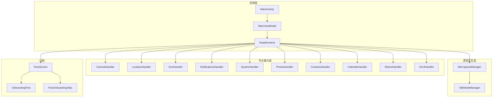
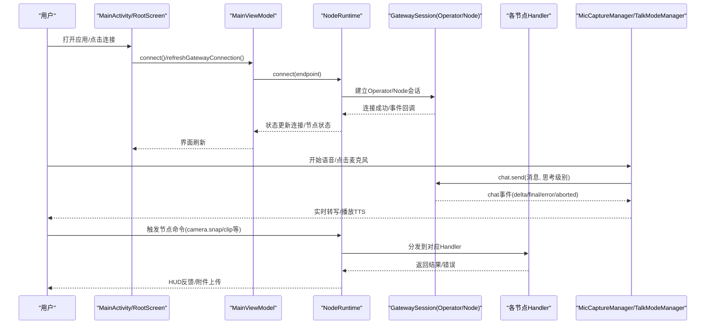
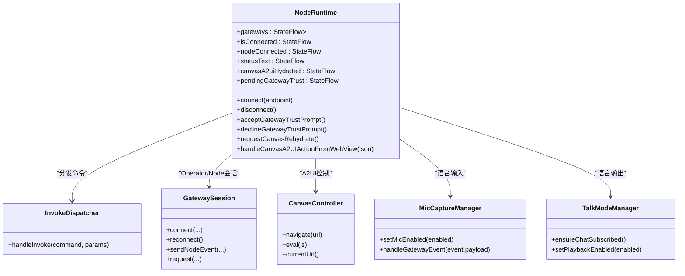
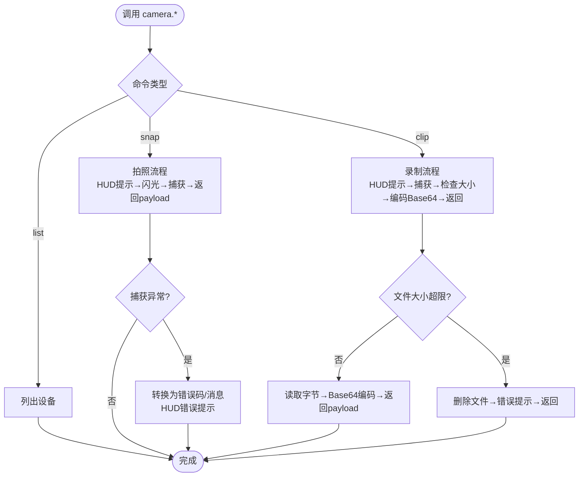
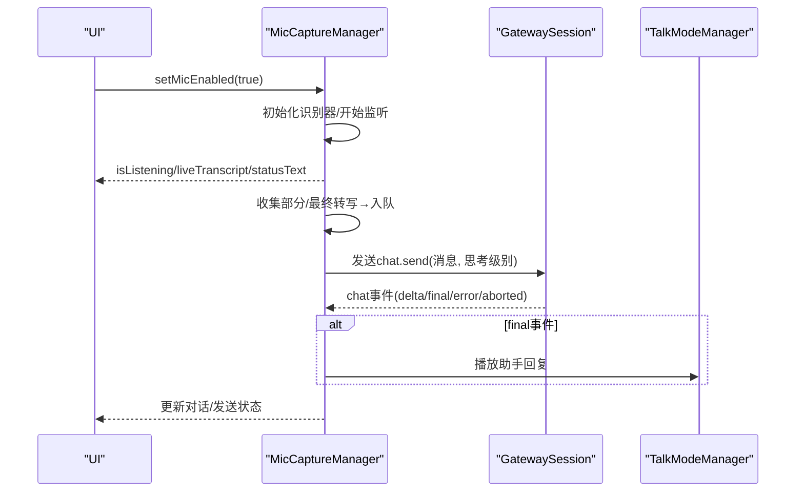
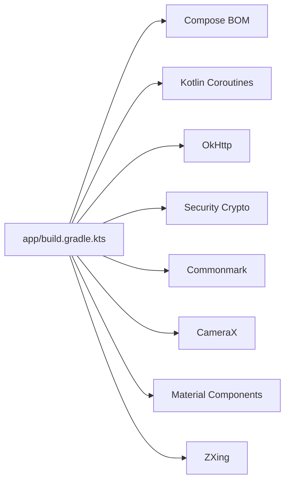

# Android节点概述

## 目录
1. [引言](#引言)
2. [项目结构](#项目结构)
3. [核心组件](#核心组件)
4. [架构总览](#架构总览)
5. [详细组件分析](#详细组件分析)
6. [依赖关系分析](#依赖关系分析)
7. [性能考虑](#性能考虑)
8. [故障排除指南](#故障排除指南)
9. [结论](#结论)

## 引言
本概述面向OpenClaw生态系统的Android节点应用，旨在帮助读者快速理解该应用在OpenClaw中的角色与定位：作为连接用户与OpenClaw网关（Gateway）的移动节点，负责设备能力调用、实时语音交互、屏幕内容（Canvas）展示与控制，并通过安全的TLS指纹验证机制保障连接信任。应用采用现代Android技术栈（Kotlin、Jetpack Compose），强调可维护性与可扩展性，支持端到端的权限请求与运行时状态管理。

## 项目结构
Android节点应用位于apps/android目录，采用标准Android Gradle项目结构，核心源码集中在app/src/main/java/ai/openclaw/app下，包含应用入口、运行时管理、节点能力处理、语音交互、UI等模块。

图表来源
- [apps/android/app/src/main/java/ai/openclaw/app/MainActivity.kt](file://apps/android/app/src/main/java/ai/openclaw/app/MainActivity.kt#L1-L64)
- [apps/android/app/src/main/java/ai/openclaw/app/MainViewModel.kt](file://apps/android/app/src/main/java/ai/openclaw/app/MainViewModel.kt#L1-L203)
- [apps/android/app/src/main/java/ai/openclaw/app/NodeRuntime.kt](file://apps/android/app/src/main/java/ai/openclaw/app/NodeRuntime.kt#L1-L923)
- [apps/android/app/src/main/java/ai/openclaw/app/node/CameraHandler.kt](file://apps/android/app/src/main/java/ai/openclaw/app/node/CameraHandler.kt#L1-L176)
- [apps/android/app/src/main/java/ai/openclaw/app/voice/MicCaptureManager.kt](file://apps/android/app/src/main/java/ai/openclaw/app/voice/MicCaptureManager.kt#L1-L574)
- [apps/android/app/src/main/java/ai/openclaw/app/ui/RootScreen.kt](file://apps/android/app/src/main/java/ai/openclaw/app/ui/RootScreen.kt#L1-L21)

章节来源
- [apps/android/README.md](file://apps/android/README.md#L1-L229)
- [apps/android/app/build.gradle.kts](file://apps/android/app/build.gradle.kts#L1-L214)

## 核心组件
- 应用入口与生命周期
  - NodeApp：应用Application，初始化NodeRuntime并启用严格模式（调试构建）。
  - MainActivity：设置Compose UI、权限请求器、前台服务启动时机，绑定MainViewModel。
  - MainViewModel：集中暴露NodeRuntime的状态流与操作方法，供UI订阅与调用。
- 运行时核心（NodeRuntime）
  - 负责网关发现、TLS指纹校验、连接管理、会话状态、Canvas A2UI交互、语音/相机/位置/短信等节点能力分发。
  - 内部聚合多个Handler（如CameraHandler、LocationHandler、SmsHandler等）与管理器（MicCaptureManager、TalkModeManager）。
- 节点能力处理
  - CameraHandler：实现camera.*命令（列表、拍照、录制），内置payload大小限制与HUD反馈。
  - 其他Handler：覆盖位置、通知、系统、照片、联系人、日历、运动、短信等节点命令。
- 语音交互
  - MicCaptureManager：基于Android SpeechRecognizer的语音转写、队列化发送、事件驱动的对话记录与超时控制。
  - TalkModeManager：与Operator会话联动的TTS播放与订阅管理。
- UI层
  - RootScreen：根据onboarding完成状态切换到引导流程或主标签页。
  - OnboardingFlow：新用户首次使用向导。
  - PostOnboardingTabs：主功能标签页（连接、聊天、语音、屏幕等）。

章节来源
- [apps/android/app/src/main/java/ai/openclaw/app/NodeApp.kt](file://apps/android/app/src/main/java/ai/openclaw/app/NodeApp.kt#L1-L27)
- [apps/android/app/src/main/java/ai/openclaw/app/MainActivity.kt](file://apps/android/app/src/main/java/ai/openclaw/app/MainActivity.kt#L1-L64)
- [apps/android/app/src/main/java/ai/openclaw/app/MainViewModel.kt](file://apps/android/app/src/main/java/ai/openclaw/app/MainViewModel.kt#L1-L203)
- [apps/android/app/src/main/java/ai/openclaw/app/NodeRuntime.kt](file://apps/android/app/src/main/java/ai/openclaw/app/NodeRuntime.kt#L1-L923)
- [apps/android/app/src/main/java/ai/openclaw/app/node/CameraHandler.kt](file://apps/android/app/src/main/java/ai/openclaw/app/node/CameraHandler.kt#L1-L176)
- [apps/android/app/src/main/java/ai/openclaw/app/voice/MicCaptureManager.kt](file://apps/android/app/src/main/java/ai/openclaw/app/voice/MicCaptureManager.kt#L1-L574)
- [apps/android/app/src/main/java/ai/openclaw/app/ui/RootScreen.kt](file://apps/android/app/src/main/java/ai/openclaw/app/ui/RootScreen.kt#L1-L21)

## 架构总览
Android节点在OpenClaw生态中扮演“移动节点”的角色，负责：
- 设备能力代理：将本地硬件/系统能力映射为OpenClaw协议命令，经由网关转发至Operator或云端模型。
- 实时交互：通过MicCaptureManager与TalkModeManager实现语音输入输出，支持流式回复与TTS播放。
- 屏幕内容（Canvas）：通过A2UI协议在WebView中渲染与交互，支持自动重载与错误提示。
- 安全连接：基于DNS-SD网关发现与TLS指纹校验，确保首次连接的信任建立。

图表来源
- [apps/android/app/src/main/java/ai/openclaw/app/MainActivity.kt](file://apps/android/app/src/main/java/ai/openclaw/app/MainActivity.kt#L1-L64)
- [apps/android/app/src/main/java/ai/openclaw/app/MainViewModel.kt](file://apps/android/app/src/main/java/ai/openclaw/app/MainViewModel.kt#L1-L203)
- [apps/android/app/src/main/java/ai/openclaw/app/NodeRuntime.kt](file://apps/android/app/src/main/java/ai/openclaw/app/NodeRuntime.kt#L1-L923)
- [apps/android/app/src/main/java/ai/openclaw/app/voice/MicCaptureManager.kt](file://apps/android/app/src/main/java/ai/openclaw/app/voice/MicCaptureManager.kt#L1-L574)

## 详细组件分析

### NodeRuntime：运行时中枢
- 职责
  - 网关发现与自动连接：支持手动配置与上次发现的稳定ID自动连接；仅对已存储TLS指纹的网关进行自动连接。
  - 会话管理：维护Operator与Node两条会话，分别处理聊天与节点命令。
  - 能力分发：通过InvokeDispatcher将节点命令路由到具体Handler。
  - Canvas A2UI：支持自动导航到A2UI主机、重加载与错误提示。
  - 语音集成：MicCaptureManager与TalkModeManager的协调，保证TTS与STT的同步。
- 关键状态
  - 连接状态、节点状态、状态文本、服务器名称与远端地址、主会话键、Canvas A2UI状态等。
- 安全与信任
  - 首次TLS指纹探测与用户确认，存储指纹后方可自动连接。

图表来源
- [apps/android/app/src/main/java/ai/openclaw/app/NodeRuntime.kt](file://apps/android/app/src/main/java/ai/openclaw/app/NodeRuntime.kt#L1-L923)

章节来源
- [apps/android/app/src/main/java/ai/openclaw/app/NodeRuntime.kt](file://apps/android/app/src/main/java/ai/openclaw/app/NodeRuntime.kt#L1-L923)

### CameraHandler：相机能力
- 功能
  - 列出可用相机设备。
  - 拍照：触发HUD提示、闪光灯脉冲、捕获图像并返回payload。
  - 录制：支持含音频/不含音频两种模式，限制最大payload大小，超限则删除临时文件并报错。
- 错误处理
  - 将异常转换为统一的错误码与消息，同时通过HUD反馈给用户。
- 性能与体验
  - 在调试构建下记录详细日志，便于问题定位。

图表来源
- [apps/android/app/src/main/java/ai/openclaw/app/node/CameraHandler.kt](file://apps/android/app/src/main/java/ai/openclaw/app/node/CameraHandler.kt#L1-L176)

章节来源
- [apps/android/app/src/main/java/ai/openclaw/app/node/CameraHandler.kt](file://apps/android/app/src/main/java/ai/openclaw/app/node/CameraHandler.kt#L1-L176)

### MicCaptureManager：语音输入与事件处理
- 流程
  - 权限检查与识别器初始化。
  - 会话中持续接收部分/最终转写，累积为完整句子后入队。
  - 当网关可用且无发送任务时，从队列取出消息发送至Operator会话。
  - 基于chat事件（delta/final/error/aborted）更新对话记录与TTS播放。
  - 设置超时与冷却逻辑，避免重复发送与资源占用。
- 状态与UI
  - 提供麦克风开关、静音状态、实时转写、输入音量、发送中等状态流，供UI订阅。

图表来源
- [apps/android/app/src/main/java/ai/openclaw/app/voice/MicCaptureManager.kt](file://apps/android/app/src/main/java/ai/openclaw/app/voice/MicCaptureManager.kt#L1-L574)

章节来源
- [apps/android/app/src/main/java/ai/openclaw/app/voice/MicCaptureManager.kt](file://apps/android/app/src/main/java/ai/openclaw/app/voice/MicCaptureManager.kt#L1-L574)

### UI层：RootScreen与引导流程
- RootScreen根据onboardingCompleted决定显示OnboardingFlow还是PostOnboardingTabs。
- MainActivity负责权限请求、保持屏幕常亮策略、前台服务启动时机等。

章节来源
- [apps/android/app/src/main/java/ai/openclaw/app/ui/RootScreen.kt](file://apps/android/app/src/main/java/ai/openclaw/app/ui/RootScreen.kt#L1-L21)
- [apps/android/app/src/main/java/ai/openclaw/app/MainActivity.kt](file://apps/android/app/src/main/java/ai/openclaw/app/MainActivity.kt#L1-L64)

## 依赖关系分析
- 构建与工具链
  - Gradle插件：Android Application、Ktlint、Compose编译器、Serialization。
  - Kotlin编译目标：JVM 17。
  - Compose BOM统一版本管理。
- 第三方库
  - Jetpack Compose（Material3、Navigation）、Coroutines、OkHttp、Security Crypto、Commonmark、CameraX、ZXing等。
- 资源与打包
  - 包含OpenClawKit资源目录，NDK支持多ABI，发布构建启用混淆与资源压缩。

图表来源
- [apps/android/app/build.gradle.kts](file://apps/android/app/build.gradle.kts#L1-L214)

章节来源
- [apps/android/app/build.gradle.kts](file://apps/android/app/build.gradle.kts#L1-L214)

## 性能考虑
- 启动与热路径
  - 使用宏基准脚本与热区分析脚本进行低噪声启动测量与热点提取。
  - Live Edit与Apply Changes支持快速迭代（物理机调试）。
- 运行时优化
  - Canvas A2UI状态变更时及时清理与重置，避免无效渲染。
  - 语音输入队列化与超时控制，减少网络抖动影响。
- 资源与体积
  - 多ABI原生库按需保留，发布构建启用混淆与资源压缩，减小APK体积。

章节来源
- [apps/android/README.md](file://apps/android/README.md#L70-L141)

## 故障排除指南
- 连接问题
  - “未验证网关TLS指纹”：首次连接会弹出信任提示，确认后存储指纹并自动连接。
  - “节点离线/Operator离线”：检查网关状态与网络连通性，必要时重新连接。
- Canvas A2UI
  - “画布不可达/需要重载”：在Screen标签页主动请求重载，或确保节点连接后自动重试。
  - “后台画布不可用”：保持应用前台与Screen标签页激活。
- 语音问题
  - “语音回复超时”：检查网关连接与网络稳定性，重试队列中的轮次。
  - “麦克风权限不足”：在设置中授予录音权限。
- 相机问题
  - “拍摄/录制失败”：检查相机权限与设备可用性；录制过大将被拒绝并删除临时文件。

章节来源
- [apps/android/README.md](file://apps/android/README.md#L165-L224)
- [apps/android/app/src/main/java/ai/openclaw/app/NodeRuntime.kt](file://apps/android/app/src/main/java/ai/openclaw/app/NodeRuntime.kt#L442-L491)
- [apps/android/app/src/main/java/ai/openclaw/app/node/CameraHandler.kt](file://apps/android/app/src/main/java/ai/openclaw/app/node/CameraHandler.kt#L124-L134)

## 结论
Android节点应用以NodeRuntime为核心，围绕OpenClaw协议实现了设备能力代理、实时语音交互与Canvas A2UI展示，并通过严格的TLS信任流程与完善的错误处理保障安全性与稳定性。其模块化设计便于扩展新的节点能力与优化现有流程，适合在OpenClaw生态中作为移动端的统一接入点。