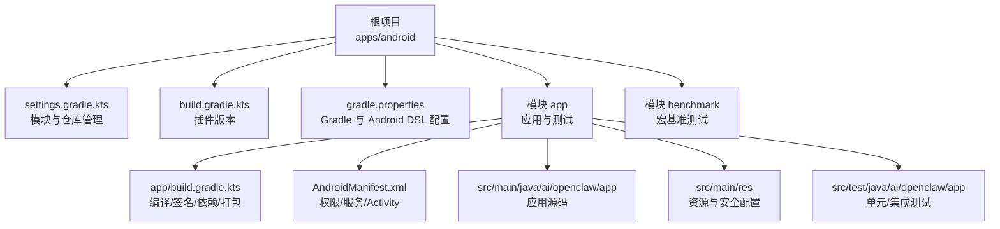
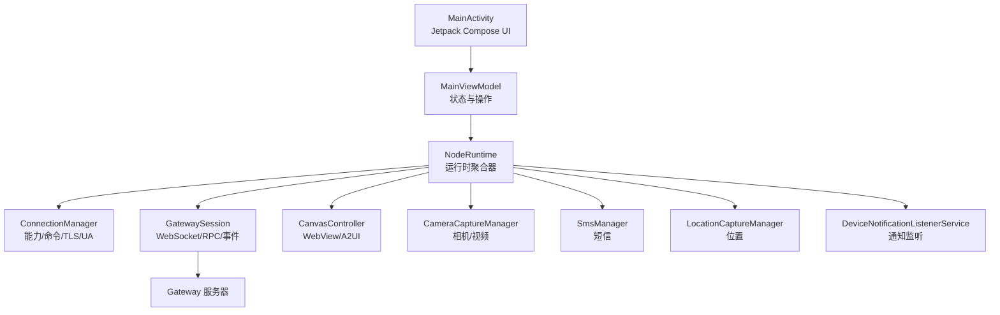
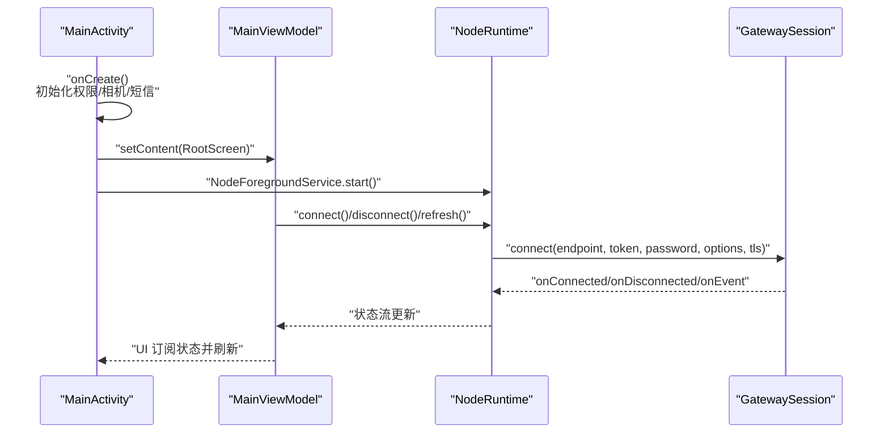
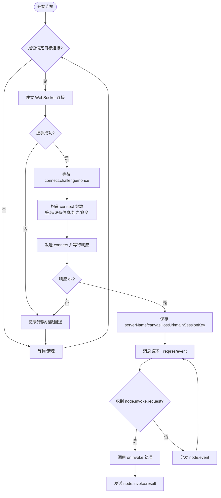
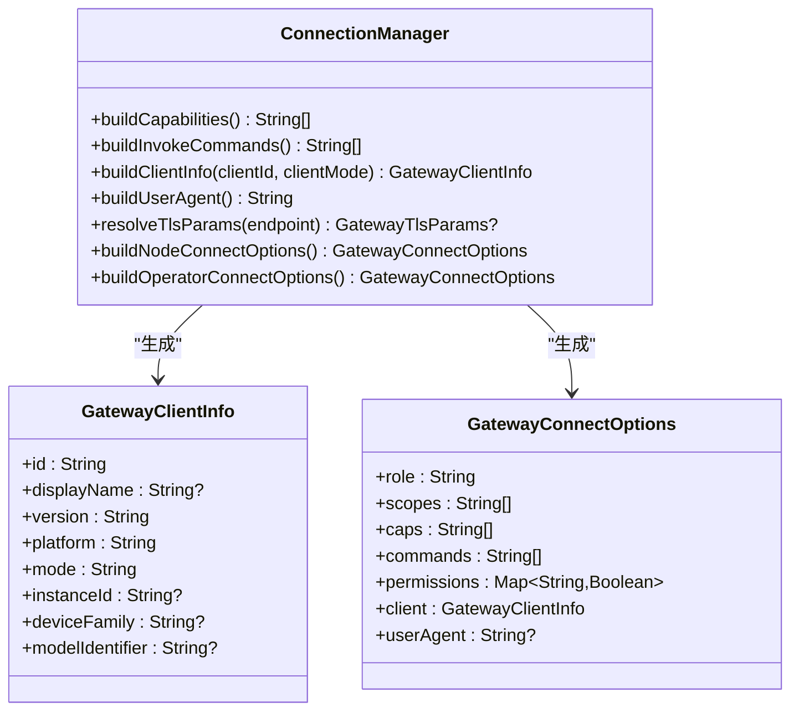
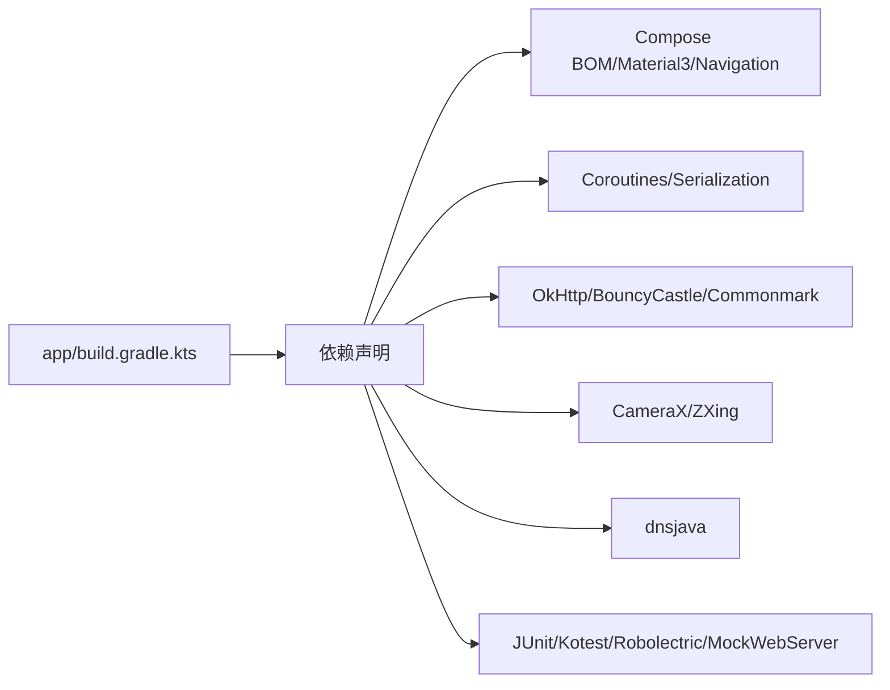

# 开发指南

## 目录
1. [简介](#简介)
2. [项目结构](#项目结构)
3. [核心组件](#核心组件)
4. [架构总览](#架构总览)
5. [详细组件分析](#详细组件分析)
6. [依赖分析](#依赖分析)
7. [性能考虑](#性能考虑)
8. [故障排查指南](#故障排查指南)
9. [结论](#结论)
10. [附录](#附录)

## 简介
本指南面向在 OpenClaw 生态中开发 Android 节点应用（Node）的工程师，覆盖开发环境搭建、代码结构与模块划分、开发流程、代码规范、测试与调试、性能优化、构建与发布等全链路内容。Android 节点应用基于 Kotlin + Jetpack Compose，通过 WebSocket 与网关（Gateway）进行连接与命令调用，并提供聊天、语音、相机、位置、通知监听等能力。

## 项目结构
Android 节点应用位于 apps/android 目录，采用 Gradle 多模块结构，包含应用模块 app 与基准测试模块 benchmark；settings.gradle.kts 统一管理仓库源与模块包含；根级 build.gradle.kts 配置插件版本；app/build.gradle.kts 定义编译目标、签名、依赖与打包规则；AndroidManifest.xml 声明权限与服务；style.md 提供 UI 设计风格基线。

图表来源
- [apps/android/settings.gradle.kts](file://apps/android/settings.gradle.kts#L1-L20)
- [apps/android/build.gradle.kts](file://apps/android/build.gradle.kts#L1-L8)
- [apps/android/gradle.properties](file://apps/android/gradle.properties#L1-L10)
- [apps/android/app/build.gradle.kts](file://apps/android/app/build.gradle.kts#L1-L214)
- [apps/android/app/src/main/AndroidManifest.xml](file://apps/android/app/src/main/AndroidManifest.xml#L1-L77)

章节来源
- [apps/android/README.md](file://apps/android/README.md#L1-L229)
- [apps/android/settings.gradle.kts](file://apps/android/settings.gradle.kts#L1-L20)
- [apps/android/build.gradle.kts](file://apps/android/build.gradle.kts#L1-L8)
- [apps/android/gradle.properties](file://apps/android/gradle.properties#L1-L10)
- [apps/android/app/build.gradle.kts](file://apps/android/app/build.gradle.kts#L1-L214)
- [apps/android/app/src/main/AndroidManifest.xml](file://apps/android/app/src/main/AndroidManifest.xml#L1-L77)

## 核心组件
- 应用入口与生命周期
  - NodeApp：Application，初始化运行时 NodeRuntime，并在 Debug 构建启用 StrictMode。
  - MainActivity：设置 Compose 内容、启动前台服务、处理权限请求与屏幕常亮。
  - MainViewModel：集中暴露状态流与操作接口，协调 Canvas、Camera、SMS、网关连接、聊天等子系统。
- 网关通信
  - GatewaySession：封装 WebSocket 连接、鉴权挑战、RPC 请求/响应、事件分发、invoke 回调、TLS 参数解析与 Canvas URL 规范化。
  - ConnectionManager：根据设备能力与用户配置生成客户端信息、能力列表、命令列表、User-Agent、TLS 参数。
- 权限与安全
  - AndroidManifest.xml 声明网络、定位、相机、录音、通知、短信、日历、联系人等权限。
  - SecurePrefs（未展开）用于加密持久化网关认证状态。
- UI 与交互
  - style.md 提供设计令牌、排版、布局、按钮、表单、多步流程、可访问性与架构约束。
  - Jetpack Compose 屏幕：OnboardingFlow、RootScreen、ConnectTabScreen、SettingsSheet、VoiceTabScreen、CanvasScreen 等。

章节来源
- [apps/android/app/src/main/java/ai/openclaw/app/NodeApp.kt](file://apps/android/app/src/main/java/ai/openclaw/app/NodeApp.kt#L1-L27)
- [apps/android/app/src/main/java/ai/openclaw/app/MainActivity.kt](file://apps/android/app/src/main/java/ai/openclaw/app/MainActivity.kt#L1-L64)
- [apps/android/app/src/main/java/ai/openclaw/app/MainViewModel.kt](file://apps/android/app/src/main/java/ai/openclaw/app/MainViewModel.kt#L1-L203)
- [apps/android/app/src/main/java/ai/openclaw/app/gateway/GatewaySession.kt](file://apps/android/app/src/main/java/ai/openclaw/app/gateway/GatewaySession.kt#L1-L761)
- [apps/android/app/src/main/java/ai/openclaw/app/node/ConnectionManager.kt](file://apps/android/app/src/main/java/ai/openclaw/app/node/ConnectionManager.kt#L1-L157)
- [apps/android/app/src/main/AndroidManifest.xml](file://apps/android/app/src/main/AndroidManifest.xml#L1-L77)
- [apps/android/style.md](file://apps/android/style.md#L1-L114)

## 架构总览
下图展示 Android 节点应用从 UI 到网关的核心交互路径：MainActivity 通过 MainViewModel 控制 NodeRuntime，NodeRuntime 使用 GatewaySession 建立/维护与 Gateway 的 WebSocket 连接，处理 connect 挑战、鉴权、事件与 node.invoke 请求，同时结合 ConnectionManager 生成客户端信息与能力/命令清单。

图表来源
- [apps/android/app/src/main/java/ai/openclaw/app/MainActivity.kt](file://apps/android/app/src/main/java/ai/openclaw/app/MainActivity.kt#L1-L64)
- [apps/android/app/src/main/java/ai/openclaw/app/MainViewModel.kt](file://apps/android/app/src/main/java/ai/openclaw/app/MainViewModel.kt#L1-L203)
- [apps/android/app/src/main/java/ai/openclaw/app/NodeApp.kt](file://apps/android/app/src/main/java/ai/openclaw/app/NodeApp.kt#L1-L27)
- [apps/android/app/src/main/java/ai/openclaw/app/gateway/GatewaySession.kt](file://apps/android/app/src/main/java/ai/openclaw/app/gateway/GatewaySession.kt#L1-L761)
- [apps/android/app/src/main/java/ai/openclaw/app/node/ConnectionManager.kt](file://apps/android/app/src/main/java/ai/openclaw/app/node/ConnectionManager.kt#L1-L157)

## 详细组件分析

### 组件一：MainActivity 与 MainViewModel
- MainActivity 负责：
  - 初始化权限请求器与相机/短信权限绑定；
  - 生命周期内控制 Keep Awake；
  - 渲染 RootScreen 并延后启动前台服务以降低首帧开销。
- MainViewModel 将 NodeRuntime 的状态流与操作方法暴露给 UI，统一管理 Canvas、Camera、SMS、网关连接、聊天会话等。

图表来源
- [apps/android/app/src/main/java/ai/openclaw/app/MainActivity.kt](file://apps/android/app/src/main/java/ai/openclaw/app/MainActivity.kt#L1-L64)
- [apps/android/app/src/main/java/ai/openclaw/app/MainViewModel.kt](file://apps/android/app/src/main/java/ai/openclaw/app/MainViewModel.kt#L1-L203)
- [apps/android/app/src/main/java/ai/openclaw/app/gateway/GatewaySession.kt](file://apps/android/app/src/main/java/ai/openclaw/app/gateway/GatewaySession.kt#L1-L761)

章节来源
- [apps/android/app/src/main/java/ai/openclaw/app/MainActivity.kt](file://apps/android/app/src/main/java/ai/openclaw/app/MainActivity.kt#L1-L64)
- [apps/android/app/src/main/java/ai/openclaw/app/MainViewModel.kt](file://apps/android/app/src/main/java/ai/openclaw/app/MainViewModel.kt#L1-L203)

### 组件二：GatewaySession（WebSocket/RPC/事件）
- 关键职责
  - 连接管理：自动重连、指数回退、连接超时、Ping 保活；
  - 鉴权与挑战：接收 connect.challenge，签发设备签名，发送 connect 请求；
  - RPC 调用：请求/响应映射、超时处理、错误归一化；
  - 事件分发：node.invoke.request 分发到业务处理器，node.event 透传上层；
  - Canvas URL 规范化：根据连接协议与端口修正 canvasHostUrl，支持 capability 刷新；
  - TLS 参数：支持手动强制 TLS、存储指纹、TXT 提示与 TOFU 策略。
- 数据结构与复杂度
  - pending 映射：并发请求去重与结果回填，O(1) 查找与删除；
  - 连接循环：指数回退时间 O(a^attempt)，最大延迟受控；
  - JSON 解析：按需解析，避免重复序列化。

图表来源
- [apps/android/app/src/main/java/ai/openclaw/app/gateway/GatewaySession.kt](file://apps/android/app/src/main/java/ai/openclaw/app/gateway/GatewaySession.kt#L1-L761)

章节来源
- [apps/android/app/src/main/java/ai/openclaw/app/gateway/GatewaySession.kt](file://apps/android/app/src/main/java/ai/openclaw/app/gateway/GatewaySession.kt#L1-L761)

### 组件三：ConnectionManager（能力/命令/TLS/UA）
- 作用
  - 根据设备能力与用户配置生成：
    - 能力列表（capabilities）
    - 可调用命令列表（commands）
    - 客户端信息（GatewayClientInfo）
    - User-Agent 字符串
    - TLS 参数（含指纹、强制 TLS、TOFU 策略）
- 设计要点
  - 手动连接优先使用存储指纹或强制 TLS；
  - 发现连接优先使用存储指纹，避免被 TXT 指纹误导；
  - 调试构建追加标识，便于区分版本。

图表来源
- [apps/android/app/src/main/java/ai/openclaw/app/node/ConnectionManager.kt](file://apps/android/app/src/main/java/ai/openclaw/app/node/ConnectionManager.kt#L1-L157)

章节来源
- [apps/android/app/src/main/java/ai/openclaw/app/node/ConnectionManager.kt](file://apps/android/app/src/main/java/ai/openclaw/app/node/ConnectionManager.kt#L1-L157)

### 组件四：UI 风格与架构约束（style.md）
- 设计方向：简洁、高可读性、确定性流程、渐进披露；
- 核心令牌：背景/表面/边框/文本/强调色/成功/警告；
- 排版与间距：Manrope 字体、8/10/12/14/20dp 基础间距；
- 按钮与表单：主次动作明确、图标尺寸与可读性；
- 可访问性：最小触摸目标、高对比度、有意义的 contentDescription；
- 架构规则：UI 状态在 MainViewModel，Composable 输入状态、输出回调，副作用显式化。

章节来源
- [apps/android/style.md](file://apps/android/style.md#L1-L114)

## 依赖分析
- Gradle 插件与版本
  - Android Application/Test 插件、Kotlin Compose 插件、Serialization 插件、ktlint 插件；
  - 版本集中在根 build.gradle.kts 中统一声明。
- 依赖矩阵（节选）
  - Compose BOM、Material3、Navigation、Core KTX、Lifecycle、Activity-Compose、Webkit；
  - OkHttp、BouncyCastle、Commonmark、CameraX、ZXing、dnsjava；
  - 测试：JUnit、Kotest、Robolectric、MockWebServer。
- 打包与签名
  - 支持 release 签名配置，开启混淆与资源收缩；
  - 输出文件名包含版本名与构建类型；
  - 排除部分 META-INF 与调试产物。

图表来源
- [apps/android/app/build.gradle.kts](file://apps/android/app/build.gradle.kts#L155-L209)

章节来源
- [apps/android/build.gradle.kts](file://apps/android/build.gradle.kts#L1-L8)
- [apps/android/app/build.gradle.kts](file://apps/android/app/build.gradle.kts#L1-L214)

## 性能考虑
- 启动与帧时序
  - 使用宏基准任务测量冷启动与帧时序，报告输出至 benchmark/build/reports/androidTests/connected/；
  - 提供低噪声的启动基准与热点提取脚本，支持本地快照对比与 perf.data 采集。
- 运行时优化
  - Debug 构建启用 StrictMode，帮助发现主线程违规；
  - 首帧后启动前台服务，减少冷启动路径开销；
  - 保持 Compose UI 状态在 ViewModel，避免重组抖动；
  - 合理使用协程与 Mutex 保护写通道，避免竞态。
- 打包与瘦身
  - release 构建启用混淆与资源收缩；
  - 排除无用 META-INF 与调试产物；
  - 多 ABI 支持，Native 库体积小。

章节来源
- [apps/android/README.md](file://apps/android/README.md#L59-L92)
- [apps/android/app/src/main/java/ai/openclaw/app/NodeApp.kt](file://apps/android/app/src/main/java/ai/openclaw/app/NodeApp.kt#L1-L27)
- [apps/android/app/build.gradle.kts](file://apps/android/app/build.gradle.kts#L74-L125)

## 故障排查指南
- 连接与配对
  - 确认 Gateway 已启动并可达，Android 应用已连接且节点状态显示已配对；
  - 如出现“需要配对”，在网关侧批准最新待处理设备请求；
  - A2UI 主机不可达：确保 Gateway Canvas Host 正常并可达，保持应用在 Screen 标签页，应用会在首次 A2UI 不可达时自动刷新一次。
- 权限相关
  - 若 A2UI 或 Canvas 命令失败，检查应用前台运行与 Screen 标签页激活；
  - 为期望通过的权限（相机/麦克风/位置/通知监听/位置）授予运行时权限；
  - 交互式系统弹窗未处理前不要开始测试。
- USB 仅测试（无需局域网）
  - 使用 adb reverse 将设备 localhost:18789 转发到本机；
  - 在 Connect → Manual 中填写 127.0.0.1:18789，关闭 TLS。
- 集成测试前置条件
  - 确保 Gateway 可达、应用已连接、Canvas Host 可达、已批准配对；
  - 保持应用前台且 Screen 标签页激活；
  - 可通过环境变量覆盖网关地址/凭据/节点标识。

章节来源
- [apps/android/README.md](file://apps/android/README.md#L112-L224)

## 结论
本指南从工程化视角梳理了 OpenClaw Android 节点应用的开发与运维要点：清晰的模块边界、稳定的网关通信协议、完善的 UI 风格与可访问性约束、严格的测试与性能保障机制。遵循本文档可快速上手开发、高效迭代并高质量交付。

## 附录

### 开发环境与工具
- Android Studio 打开 apps/android；
- Gradle 与 Android SDK 自动检测（默认 ~/Library/Android/sdk），可通过 ANDROID_SDK_ROOT/ANDROID_HOME 覆盖；
- 依赖安装与 Gradle 同步由 AS 自动完成。

章节来源
- [apps/android/README.md](file://apps/android/README.md#L22-L56)

### 构建与发布
- 构建与安装
  - Debug 构建：./gradlew :app:assembleDebug、:app:installDebug；
  - 单元测试：:app:testDebugUnitTest；
  - 集成测试：pnpm android:test:integration（需满足前置条件）。
- 宏基准测试
  - ./gradlew :benchmark:connectedDebugAndroidTest，报告位于 benchmark/build/reports/androidTests/connected/。
- 性能基准脚本
  - perf-startup-benchmark.sh、perf-startup-hotspots.sh，支持快照对比与热点分析。
- 发布签名
  - 通过 OPENCLAW_ANDROID_STORE_FILE/PASSWORD/KEY_ALIAS/KEY_PASSWORD 配置本地签名；
  - release 构建开启混淆与资源收缩，输出文件名包含版本与构建类型。

章节来源
- [apps/android/README.md](file://apps/android/README.md#L26-L92)
- [apps/android/app/build.gradle.kts](file://apps/android/app/build.gradle.kts#L16-L31)
- [apps/android/app/build.gradle.kts](file://apps/android/app/build.gradle.kts#L74-L125)

### 代码规范与质量
- Kotlin 代码格式与检查
  - pnpm android:lint / android:format；
  - Gradle 任务：ktlintCheck / ktlintFormat；
  - Android 资源/框架检查：pnpm android:lint:android；
  - Gradle 任务：lintDebug。
- 通用规则
  - 所有警告视为错误；
  - 排除无关告警项；
  - 使用 Compose BOM 管理版本。

章节来源
- [apps/android/README.md](file://apps/android/README.md#L35-L56)
- [apps/android/app/build.gradle.kts](file://apps/android/app/build.gradle.kts#L111-L125)
- [apps/android/app/build.gradle.kts](file://apps/android/app/build.gradle.kts#L147-L153)

### 权限清单与用途
- 网络与通知：INTERNET、ACCESS_NETWORK_STATE、FOREGROUND_SERVICE、FOREGROUND_SERVICE_DATA_SYNC、POST_NOTIFICATIONS；
- Wi-Fi 与定位：NEARBY_WIFI_DEVICES（不用于定位）、ACCESS_FINE_LOCATION、ACCESS_COARSE_LOCATION；
- 摄像头与录音：CAMERA、RECORD_AUDIO；
- 短信与媒体：SEND_SMS、READ_MEDIA_IMAGES、READ_MEDIA_VISUAL_USER_SELECTED、READ_EXTERNAL_STORAGE（&lt;=32）、READ_CONTACTS、WRITE_CONTACTS、READ_CALENDAR、WRITE_CALENDAR；
- 其他硬件：ACTIVITY_RECOGNITION；
- 功能特性：相机、电话（可选硬件）。

章节来源
- [apps/android/app/src/main/AndroidManifest.xml](file://apps/android/app/src/main/AndroidManifest.xml#L1-L77)