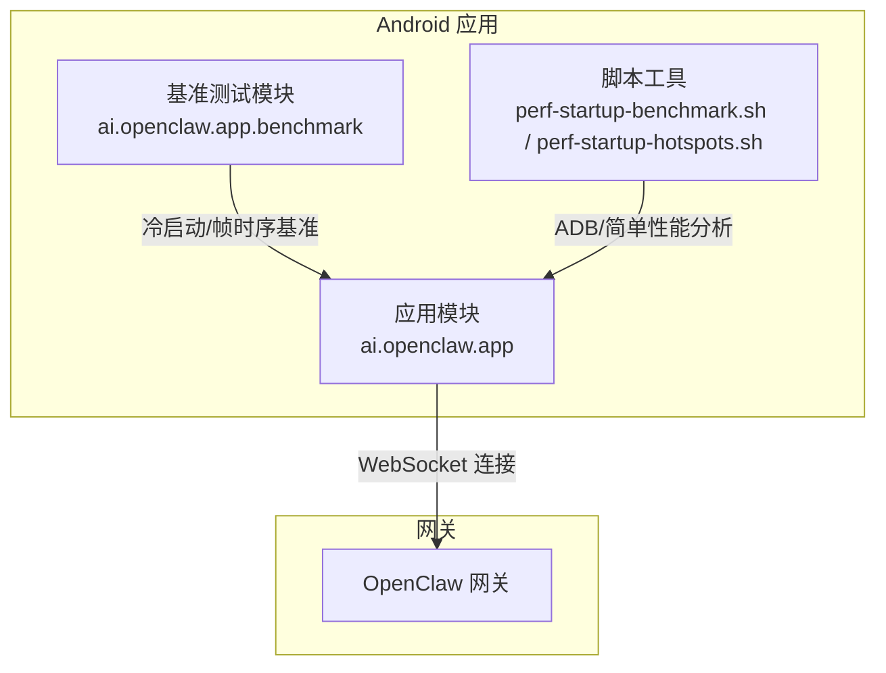
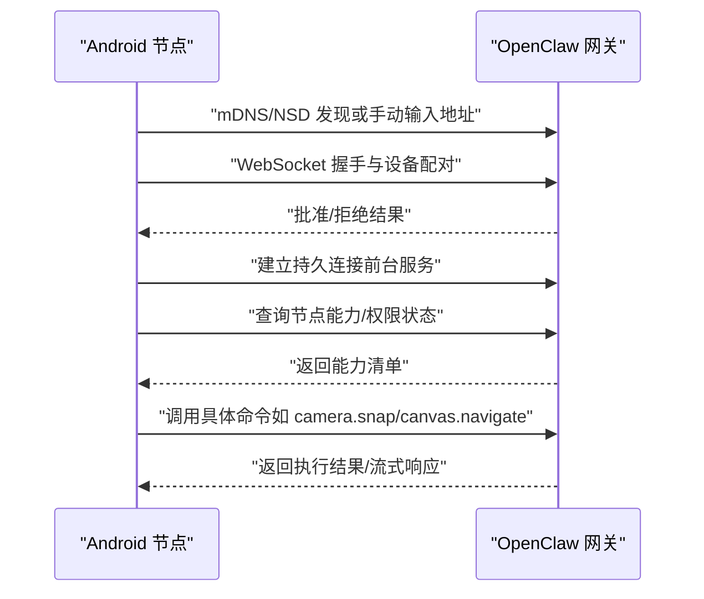
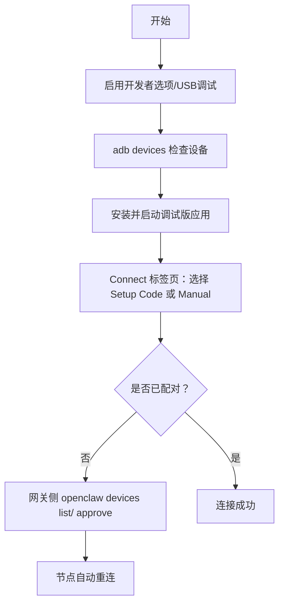
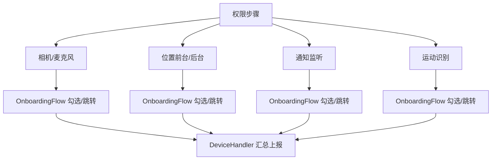
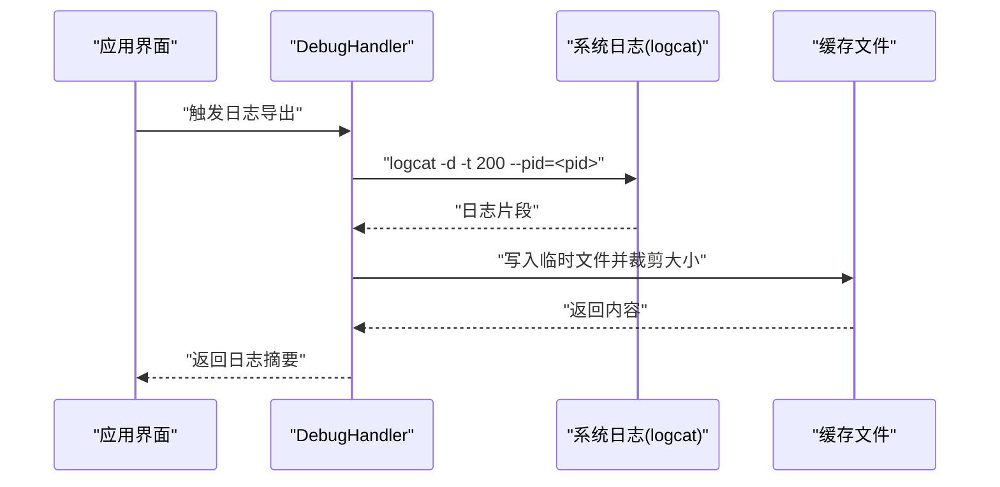
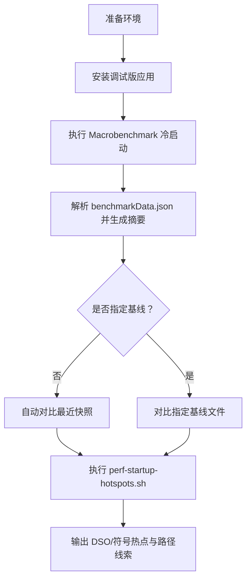
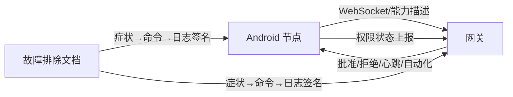

# 故障排除和维护

## 目录
1. [简介](#简介)
2. [项目结构](#项目结构)
3. [核心组件](#核心组件)
4. [架构总览](#架构总览)
5. [详细组件分析](#详细组件分析)
6. [依赖关系分析](#依赖关系分析)
7. [性能考量](#性能考量)
8. [故障排除指南](#故障排除指南)
9. [结论](#结论)
10. [附录](#附录)

## 简介
本文件面向OpenClaw Android节点应用（Node）的运维与维护，提供系统化的故障排除与维护流程，覆盖连接问题、功能异常、性能问题与兼容性问题；并给出日志收集、错误分析与调试技巧，性能监控与基准测试方法（含启动时间测试与性能热点分析），以及应用维护最佳实践（更新策略、数据备份与安全检查）与紧急恢复方案。

## 项目结构
Android节点应用位于apps/android目录，包含应用模块、基准测试模块与脚本工具。应用通过WebSocket与网关通信，使用前台服务维持连接，并在设备权限、通知监听、相机/麦克风等能力上进行严格管控。文档层提供了平台说明、故障排除与节点工具的运行手册。

图表来源
- [apps/android/README.md](file://apps/android/README.md#L59-L92)
- [apps/android/benchmark/src/main/java/ai/openclaw/app/benchmark/StartupMacrobenchmark.kt](file://apps/android/benchmark/src/main/java/ai/openclaw/app/benchmark/StartupMacrobenchmark.kt#L24-L36)
- [apps/android/scripts/perf-startup-benchmark.sh](file://apps/android/scripts/perf-startup-benchmark.sh#L62-L82)

章节来源
- [apps/android/README.md](file://apps/android/README.md#L1-L229)

## 核心组件
- 连接与配对：Android节点通过mDNS/NSD或手动模式连接网关，首次配对后自动重连；支持前台服务常驻。
- 权限与能力：相机、麦克风、位置、通知监听、运动识别等权限在引导流程中申请与校验。
- 调试与日志：DebugHandler在调试构建中导出日志与设备信息；全局日志系统统一格式化输出。
- 性能基准：Macrobenchmark提供冷启动与滚动帧时序指标；脚本封装了启动时间统计与热点分析。

章节来源
- [apps/android/README.md](file://apps/android/README.md#L143-L224)
- [apps/android/app/src/main/java/ai/openclaw/app/node/DebugHandler.kt](file://apps/android/app/src/main/java/ai/openclaw/app/node/DebugHandler.kt#L72-L95)
- [apps/android/app/src/main/java/ai/openclaw/app/node/DeviceHandler.kt](file://apps/android/app/src/main/java/ai/openclaw/app/node/DeviceHandler.kt#L110-L168)
- [apps/android/app/src/main/java/ai/openclaw/app/ui/OnboardingFlow.kt](file://apps/android/app/src/main/java/ai/openclaw/app/ui/OnboardingFlow.kt#L1308-L1623)
- [src/logger.ts](file://src/logger.ts#L1-L85)

## 架构总览
Android节点与网关之间的交互遵循“发现/配对—连接—命令调用—能力执行”的闭环。Android侧负责权限管理、前台服务保活与UI交互；网关侧负责身份验证、通道路由与资源调度。

图表来源
- [docs/platforms/android.md](file://docs/platforms/android.md#L24-L105)
- [apps/android/README.md](file://apps/android/README.md#L143-L163)

## 详细组件分析

### 组件A：连接与配对（Connect/Pair）
- 连接路径：支持Setup Code、Manual与后台自动重连；若发现不可用则回退到上次发现的网关或手动配置。
- 配对流程：网关侧devices list/ approve，节点侧前台服务保持在线。
- 兼容性要点：不同网络（LAN/Tailscale）下DNS-SD策略差异，必要时使用Wide-Area Bonjour或手动端口映射。

图表来源
- [apps/android/README.md](file://apps/android/README.md#L93-L132)
- [docs/platforms/android.md](file://docs/platforms/android.md#L73-L105)

章节来源
- [apps/android/README.md](file://apps/android/README.md#L143-L163)
- [docs/platforms/android.md](file://docs/platforms/android.md#L24-L105)

### 组件B：权限与能力（Permissions/Capabilities）
- 权限矩阵：相机、麦克风、位置、通知监听、运动识别等；不同Android版本存在API差异与权限分组变化。
- 引导流程：OnboardingFlow集中处理权限勾选与跳转设置页面；节点侧DeviceHandler汇总权限状态并上报。
- 前台限制：canvas/camera/screen类命令仅前台可用，需确保应用处于前台且保持活跃。

图表来源
- [apps/android/app/src/main/java/ai/openclaw/app/ui/OnboardingFlow.kt](file://apps/android/app/src/main/java/ai/openclaw/app/ui/OnboardingFlow.kt#L1308-L1623)
- [apps/android/app/src/main/java/ai/openclaw/app/node/DeviceHandler.kt](file://apps/android/app/src/main/java/ai/openclaw/app/node/DeviceHandler.kt#L130-L168)
- [docs/nodes/troubleshooting.md](file://docs/nodes/troubleshooting.md#L37-L49)

章节来源
- [apps/android/app/src/main/java/ai/openclaw/app/ui/OnboardingFlow.kt](file://apps/android/app/src/main/java/ai/openclaw/app/ui/OnboardingFlow.kt#L1308-L1623)
- [apps/android/app/src/main/java/ai/openclaw/app/node/DeviceHandler.kt](file://apps/android/app/src/main/java/ai/openclaw/app/node/DeviceHandler.kt#L130-L168)
- [docs/nodes/troubleshooting.md](file://docs/nodes/troubleshooting.md#L37-L91)

### 组件C：调试与日志（Debug/Logging）
- DebugHandler：在调试构建中导出当前进程PID、线程名、内存占用、运行时长、SDK版本与设备型号，并抓取logcat片段。
- 日志系统：统一格式化输出，支持子系统前缀、文件落盘与控制台时间戳；错误对象提取名称/代码用于诊断。
- 网关侧日志：对错误值进行截断与编码，避免敏感信息泄露。

图表来源
- [apps/android/app/src/main/java/ai/openclaw/app/node/DebugHandler.kt](file://apps/android/app/src/main/java/ai/openclaw/app/node/DebugHandler.kt#L72-L95)

章节来源
- [apps/android/app/src/main/java/ai/openclaw/app/node/DebugHandler.kt](file://apps/android/app/src/main/java/ai/openclaw/app/node/DebugHandler.kt#L72-L95)
- [src/logger.ts](file://src/logger.ts#L1-L85)
- [src/gateway/ws-log.ts](file://src/gateway/ws-log.ts#L102-L142)
- [src/infra/errors.ts](file://src/infra/errors.ts#L1-L52)

### 组件D：性能基准与热点分析（Benchmark/Hotspots）
- 冷启动基准：Macrobenchmark仅运行StartupMacrobenchmark#coldStartup（10次迭代），输出中位数/最小/最大/变异系数，并保存带时间戳的结果快照。
- 热点分析：脚本确保调试版已安装，捕获MainActivity启动阶段的CPU profile（simpleperf），输出DSO/符号热点与关键路径线索。
- 性能预算：可结合test-perf-budget对回归阈值进行判定。

图表来源
- [apps/android/scripts/perf-startup-benchmark.sh](file://apps/android/scripts/perf-startup-benchmark.sh#L62-L124)
- [apps/android/benchmark/src/main/java/ai/openclaw/app/benchmark/StartupMacrobenchmark.kt](file://apps/android/benchmark/src/main/java/ai/openclaw/app/benchmark/StartupMacrobenchmark.kt#L24-L36)
- [apps/android/scripts/perf-startup-hotspots.sh](file://apps/android/scripts/perf-startup-hotspots.sh#L1-L64)
- [scripts/test-perf-budget.mjs](file://scripts/test-perf-budget.mjs#L98-L127)

章节来源
- [apps/android/README.md](file://apps/android/README.md#L59-L92)
- [apps/android/scripts/perf-startup-benchmark.sh](file://apps/android/scripts/perf-startup-benchmark.sh#L1-L124)
- [apps/android/benchmark/src/main/java/ai/openclaw/app/benchmark/StartupMacrobenchmark.kt](file://apps/android/benchmark/src/main/java/ai/openclaw/app/benchmark/StartupMacrobenchmark.kt#L1-L76)
- [apps/android/scripts/perf-startup-hotspots.sh](file://apps/android/scripts/perf-startup-hotspots.sh#L1-L64)
- [scripts/test-perf-budget.mjs](file://scripts/test-perf-budget.mjs#L98-L127)

## 依赖关系分析
- Android应用依赖网关协议与能力描述；权限状态影响命令可用性；前台服务决定Canvas/Camera/Screen等能力是否可执行。
- 文档层提供从“症状—命令阶梯—常见签名”的诊断路径，便于快速定位问题根因。

图表来源
- [docs/help/troubleshooting.md](file://docs/help/troubleshooting.md#L68-L88)
- [docs/gateway/troubleshooting.md](file://docs/gateway/troubleshooting.md#L14-L24)
- [docs/nodes/troubleshooting.md](file://docs/nodes/troubleshooting.md#L13-L29)

章节来源
- [docs/help/troubleshooting.md](file://docs/help/troubleshooting.md#L68-L88)
- [docs/gateway/troubleshooting.md](file://docs/gateway/troubleshooting.md#L14-L24)
- [docs/nodes/troubleshooting.md](file://docs/nodes/troubleshooting.md#L13-L29)

## 性能考量
- 启动时间测试：使用Macrobenchmark冷启动指标（中位数/最小/最大/变异系数）评估稳定性与回归。
- 帧时序测试：在启动后滚动页面测量帧时序，评估UI流畅度。
- 热点分析：通过simpleperf采集启动阶段CPU profile，定位热点函数与关键路径（Compose/MainActivity/WebView）。
- 回归预算：以wall time阈值与基线回归百分比作为性能回归判定依据。

章节来源
- [apps/android/README.md](file://apps/android/README.md#L59-L92)
- [apps/android/scripts/perf-startup-benchmark.sh](file://apps/android/scripts/perf-startup-benchmark.sh#L80-L91)
- [apps/android/scripts/perf-startup-hotspots.sh](file://apps/android/scripts/perf-startup-hotspots.sh#L87-L91)
- [scripts/test-perf-budget.mjs](file://scripts/test-perf-budget.mjs#L98-L127)

## 故障排除指南

### 连接问题
- 症状与排查
  - 网关无法被发现：确认mDNS/NSD可用或切换到手动模式；若跨网络，使用Wide-Area Bonjour或adb reverse隧道。
  - 连接失败/认证错误：核对URL/端口/协议（TLS）、令牌/密码与认证模式一致性；检查设备身份挑战流程。
  - 自动重连失败：检查前台服务状态与通知权限；确认节点显示为已配对且在线。
- 快速命令
  - 使用“连接→手动”输入主机与端口；在网关侧批准设备请求；确认节点状态与能力描述。
- 常见日志签名
  - 设备身份/nonce相关错误、未授权循环、连接失败提示。

章节来源
- [apps/android/README.md](file://apps/android/README.md#L112-L132)
- [docs/platforms/android.md](file://docs/platforms/android.md#L24-L105)
- [docs/gateway/troubleshooting.md](file://docs/gateway/troubleshooting.md#L91-L137)
- [docs/help/troubleshooting.md](file://docs/help/troubleshooting.md#L121-L147)

### 功能异常（节点工具）
- 症状与排查
  - Canvas/相机/屏幕命令失败：检查前台状态；确保应用在前台且保持活跃。
  - 权限缺失：相机/麦克风/位置/通知监听/运动识别未授予；在引导流程中重新授权。
  - 执行审批/白名单：system.run需要显式审批或允许列表匹配。
- 快速命令
  - 在网关侧查看节点状态与能力描述；检查exec审批与白名单；必要时重新配对与授权。
- 常见日志签名
  - NODE_BACKGROUND_UNAVAILABLE、*_PERMISSION_REQUIRED、SYSTEM_RUN_DENIED等。

章节来源
- [docs/nodes/troubleshooting.md](file://docs/nodes/troubleshooting.md#L37-L91)
- [apps/android/app/src/main/java/ai/openclaw/app/node/DeviceHandler.kt](file://apps/android/app/src/main/java/ai/openclaw/app/node/DeviceHandler.kt#L130-L168)
- [apps/android/app/src/main/java/ai/openclaw/app/ui/OnboardingFlow.kt](file://apps/android/app/src/main/java/ai/openclaw/app/ui/OnboardingFlow.kt#L1308-L1623)

### 性能问题
- 启动时间异常
  - 使用perf-startup-benchmark.sh获取冷启动指标；与最近快照比较；必要时对比指定基线。
  - 若出现显著波动，使用perf-startup-hotspots.sh采集simpleperf数据，定位热点。
- 回归判定
  - 结合test-perf-budget.mjs对wall time阈值与基线回归进行判定，避免性能回退。
- UI卡顿
  - 使用帧时序基准评估滚动流畅度；优化布局与渲染路径（Compose/WebView）。

章节来源
- [apps/android/README.md](file://apps/android/README.md#L59-L92)
- [apps/android/scripts/perf-startup-benchmark.sh](file://apps/android/scripts/perf-startup-benchmark.sh#L80-L124)
- [apps/android/scripts/perf-startup-hotspots.sh](file://apps/android/scripts/perf-startup-hotspots.sh#L87-L91)
- [scripts/test-perf-budget.mjs](file://scripts/test-perf-budget.mjs#L98-L127)

### 兼容性问题
- Android版本差异
  - 13+：新增权限与特性（如媒体读取、通知监听）；注意权限分组与动态授权。
  - 12及以下：可能仍需粗粒度位置权限；NSD扫描依赖精确位置。
- 设备差异
  - 部分设备在启动阶段存在渲染线程问题，基准测试会自动跳过；可在其他设备复测。
- 网络差异
  - LAN/Tailscale跨网段场景建议使用Wide-Area Bonjour或adb reverse；避免mDNS穿越。

章节来源
- [apps/android/README.md](file://apps/android/README.md#L165-L174)
- [apps/android/benchmark/src/main/java/ai/openclaw/app/benchmark/StartupMacrobenchmark.kt](file://apps/android/benchmark/src/main/java/ai/openclaw/app/benchmark/StartupMacrobenchmark.kt#L62-L75)
- [docs/platforms/android.md](file://docs/platforms/android.md#L64-L71)

### 日志收集与错误分析
- 应用侧
  - DebugHandler在调试构建中抓取logcat片段并裁剪大小，避免过大输出；同时输出进程/线程/内存/运行时长等上下文。
  - 全局日志系统统一格式化输出，支持子系统前缀与文件落盘；错误对象提取name/code辅助诊断。
- 网关侧
  - 对错误值进行截断与编码，避免敏感信息泄露；配合CLI doctor/status/probe快速定位服务与通道状态。
- 建议流程
  - 出现问题先运行status/gateway status/logs --follow/doctor；再根据症状选择更具体的命令与日志签名。

章节来源
- [apps/android/app/src/main/java/ai/openclaw/app/node/DebugHandler.kt](file://apps/android/app/src/main/java/ai/openclaw/app/node/DebugHandler.kt#L72-L95)
- [src/logger.ts](file://src/logger.ts#L1-L85)
- [src/gateway/ws-log.ts](file://src/gateway/ws-log.ts#L102-L142)
- [docs/help/troubleshooting.md](file://docs/help/troubleshooting.md#L13-L35)

### 调试技巧
- 开发者选项与USB调试：确保设备授权与信任提示已接受；必要时重新插拔。
- Live Edit/Apply Changes：在Android Studio中对Compose UI进行热更新；结构性修改需全量重装。
- Canvas热重载：确保网关canvas host可达且应用在Screen标签页保持活跃。
- 设备隧道：使用adb reverse将本地端口转发至设备，实现无LAN依赖的联调。

章节来源
- [apps/android/README.md](file://apps/android/README.md#L134-L141)
- [apps/android/README.md](file://apps/android/README.md#L112-L132)

### 维护最佳实践
- 更新策略
  - 升级后优先运行doctor与status，检查配置漂移与认证/绑定约束变更；必要时强制重装服务元数据。
  - 使用dev配置隔离状态，快速复现与回滚。
- 数据备份与安全
  - 重要配置与凭据由网关侧管理；应用侧加密持久化网关连接态；定期导出诊断快照（benchmarkData.json）。
  - 清理原始流日志与临时文件，避免敏感信息留存。
- 安全检查
  - 核对权限授予范围与最小化原则；定期审查exec审批与白名单；关注设备身份与nonce流程。

章节来源
- [docs/gateway/troubleshooting.md](file://docs/gateway/troubleshooting.md#L294-L360)
- [docs/help/debugging.md](file://docs/help/debugging.md#L49-L106)
- [apps/android/README.md](file://apps/android/README.md#L59-L92)

### 紧急恢复与数据修复
- 紧急恢复
  - 网关不可达：检查bind/auth策略与端口占用；必要时重启服务或更换端口。
  - 节点离线：确认前台服务与通知权限；在网关侧devices list/ approve后重试。
  - Canvas/A2UI不可达：确保网关canvas host运行且可达；保持应用在Screen标签页；必要时重连。
- 数据修复
  - 性能回归：使用perf-startup-benchmark.sh对比快照，定位回归版本；hotspots分析热点函数。
  - 日志清理：删除临时日志与原始流日志，避免磁盘膨胀与隐私风险。
  - 配置回滚：使用dev配置快速恢复默认设置，再逐步迁移变更项。

章节来源
- [docs/gateway/troubleshooting.md](file://docs/gateway/troubleshooting.md#L139-L167)
- [docs/nodes/troubleshooting.md](file://docs/nodes/troubleshooting.md#L92-L107)
- [apps/android/scripts/perf-startup-benchmark.sh](file://apps/android/scripts/perf-startup-benchmark.sh#L80-L124)

## 结论
通过规范的连接与配对流程、严格的权限与能力管控、完善的日志与调试机制、系统性的性能基准与热点分析，以及严谨的维护与应急恢复策略，OpenClaw Android节点应用能够在多变的设备与网络环境中保持稳定运行。建议团队在日常运维中坚持“先诊断、后修复、再验证”的流程，并持续用基准测试与日志签名驱动质量改进。

## 附录
- 常用命令速查
  - 连接与配对：status、gateway status、devices list/approve、logs --follow、doctor
  - 节点工具：nodes status/describe、approvals get、pairing list
  - 性能基准：connectedDebugAndroidTest（Macrobenchmark）、perf-startup-benchmark.sh、perf-startup-hotspots.sh
- 关键文档索引
  - 平台说明：docs/platforms/android.md
  - 故障排除枢纽：docs/help/troubleshooting.md
  - 网关深度排障：docs/gateway/troubleshooting.md
  - 节点工具排障：docs/nodes/troubleshooting.md