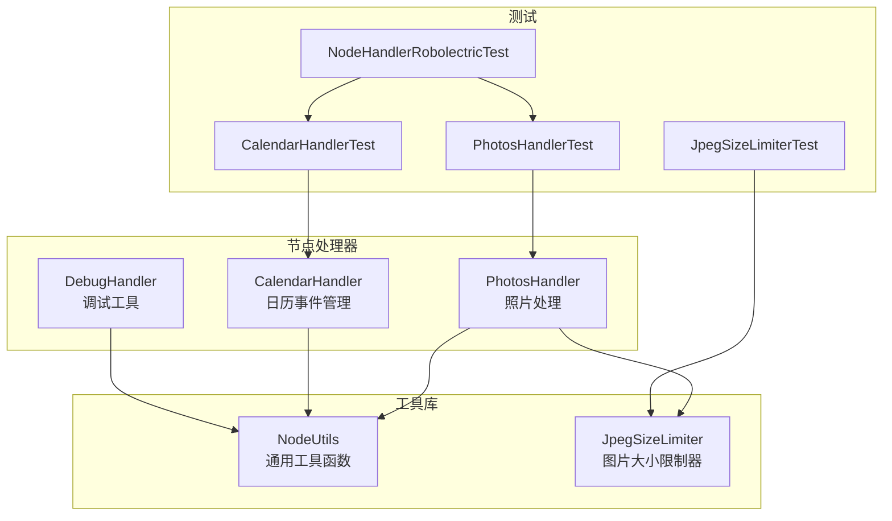
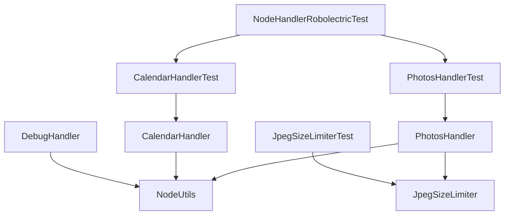
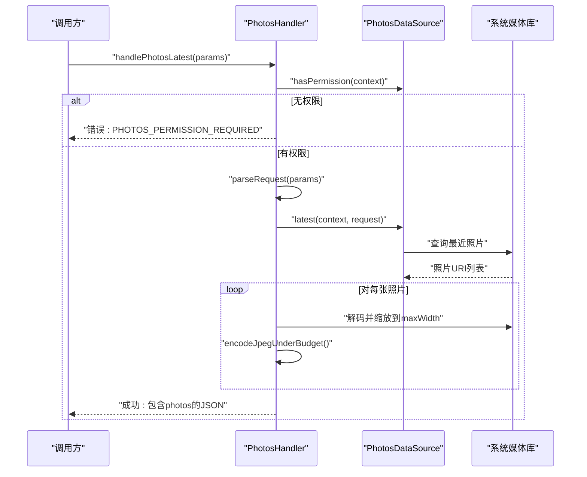
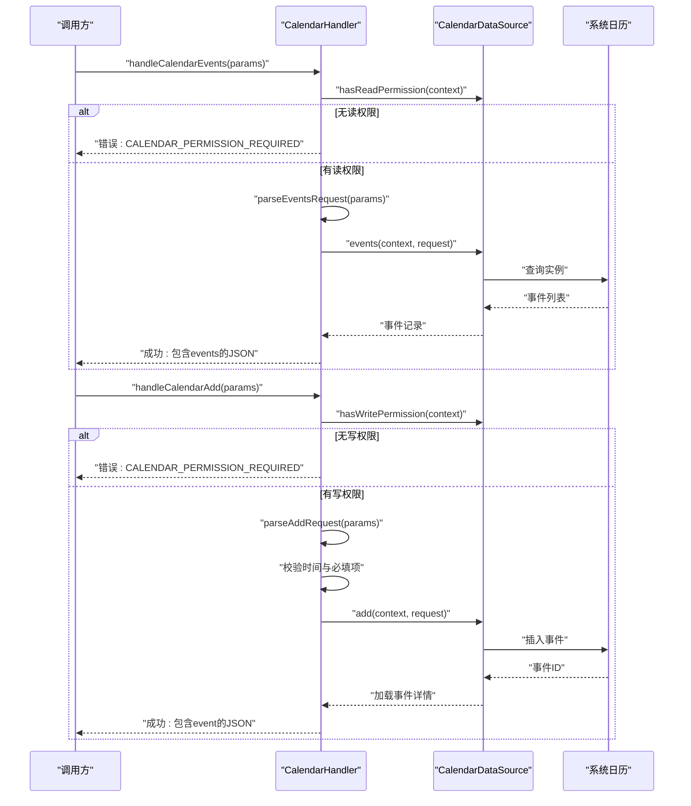
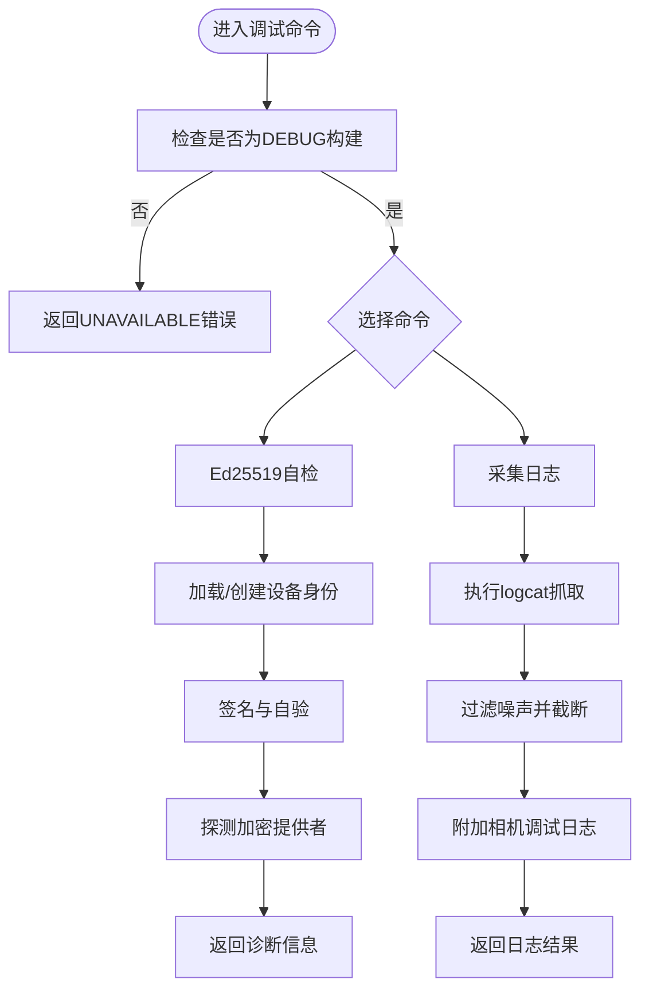
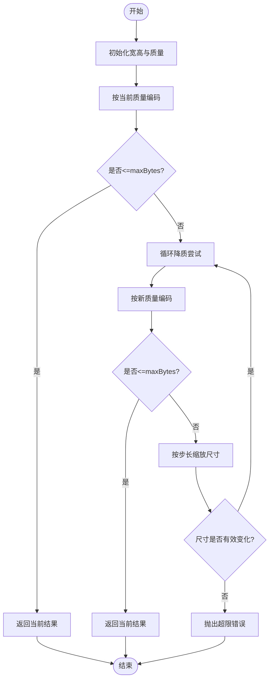
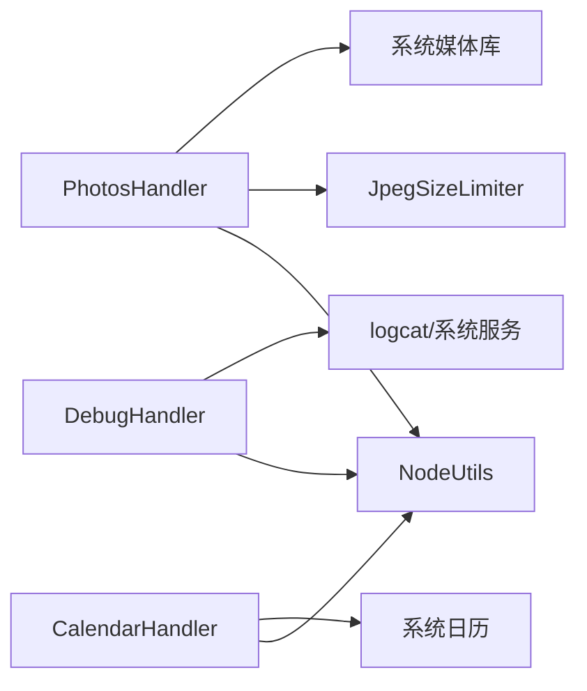

# 实用工具模块

## 目录
1. [简介](#简介)
2. [项目结构](#项目结构)
3. [核心组件](#核心组件)
4. [架构总览](#架构总览)
5. [详细组件分析](#详细组件分析)
6. [依赖关系分析](#依赖关系分析)
7. [性能考虑](#性能考虑)
8. [故障排查指南](#故障排查指南)
9. [结论](#结论)

## 简介
本文件面向 OpenClaw Android 节点应用的“实用工具模块”，系统性梳理并解释以下关键能力：
- 照片处理：图片选择、解码、缩放、压缩与上传（以 Base64 字符串形式）的完整流程与约束。
- 日历事件管理：事件查询、新增、权限校验与错误映射。
- 调试工具：设备标识与签名自检、日志采集等仅在调试构建中可用的功能。
- 图片大小限制器：基于质量与尺寸迭代压缩的稳健算法。
- 通用工具函数：JSON 参数解析、颜色解析、错误码提取等。

目标是帮助开发者快速理解各模块职责、数据流与边界条件，并提供可操作的优化建议与排障指引。

## 项目结构
实用工具模块位于 Android 应用的节点层，采用按功能分层的组织方式：
- 节点处理器：PhotosHandler、CalendarHandler、DebugHandler
- 工具库：NodeUtils、JpegSizeLimiter
- 测试：针对各处理器的单元测试与 Robolectric 集成测试基类

图表来源
- [apps/android/app/src/main/java/ai/openclaw/app/node/PhotosHandler.kt](file://apps/android/app/src/main/java/ai/openclaw/app/node/PhotosHandler.kt#L208-L289)
- [apps/android/app/src/main/java/ai/openclaw/app/node/CalendarHandler.kt](file://apps/android/app/src/main/java/ai/openclaw/app/node/CalendarHandler.kt#L228-L384)
- [apps/android/app/src/main/java/ai/openclaw/app/node/DebugHandler.kt](file://apps/android/app/src/main/java/ai/openclaw/app/node/DebugHandler.kt#L9-L119)
- [apps/android/app/src/main/java/ai/openclaw/app/node/NodeUtils.kt](file://apps/android/app/src/main/java/ai/openclaw/app/node/NodeUtils.kt#L1-L85)
- [apps/android/app/src/main/java/ai/openclaw/app/node/JpegSizeLimiter.kt](file://apps/android/app/src/main/java/ai/openclaw/app/node/JpegSizeLimiter.kt#L14-L62)
- [apps/android/app/src/test/java/ai/openclaw/app/node/PhotosHandlerTest.kt](file://apps/android/app/src/test/java/ai/openclaw/app/node/PhotosHandlerTest.kt#L1-L72)
- [apps/android/app/src/test/java/ai/openclaw/app/node/CalendarHandlerTest.kt](file://apps/android/app/src/test/java/ai/openclaw/app/node/CalendarHandlerTest.kt#L1-L111)
- [apps/android/app/src/test/java/ai/openclaw/app/node/JpegSizeLimiterTest.kt](file://apps/android/app/src/test/java/ai/openclaw/app/node/JpegSizeLimiterTest.kt#L1-L47)
- [apps/android/app/src/test/java/ai/openclaw/app/node/NodeHandlerRobolectricTest.kt](file://apps/android/app/src/test/java/ai/openclaw/app/node/NodeHandlerRobolectricTest.kt#L1-L11)

章节来源
- [apps/android/app/src/main/java/ai/openclaw/app/node/PhotosHandler.kt](file://apps/android/app/src/main/java/ai/openclaw/app/node/PhotosHandler.kt#L1-L289)
- [apps/android/app/src/main/java/ai/openclaw/app/node/CalendarHandler.kt](file://apps/android/app/src/main/java/ai/openclaw/app/node/CalendarHandler.kt#L1-L385)
- [apps/android/app/src/main/java/ai/openclaw/app/node/DebugHandler.kt](file://apps/android/app/src/main/java/ai/openclaw/app/node/DebugHandler.kt#L1-L119)
- [apps/android/app/src/main/java/ai/openclaw/app/node/NodeUtils.kt](file://apps/android/app/src/main/java/ai/openclaw/app/node/NodeUtils.kt#L1-L85)
- [apps/android/app/src/main/java/ai/openclaw/app/node/JpegSizeLimiter.kt](file://apps/android/app/src/main/java/ai/openclaw/app/node/JpegSizeLimiter.kt#L1-L62)

## 核心组件
- PhotosHandler：负责从系统相册获取最新照片，按请求参数进行缩放与 JPEG 压缩，确保输出满足 Base64 长度预算；支持权限检查与错误返回。
- CalendarHandler：负责日历事件的查询与新增，含权限校验、时间范围解析、日历选择策略与错误码映射。
- DebugHandler：仅在调试构建中启用，提供设备标识与签名自检、日志采集等诊断能力。
- JpegSizeLimiter：独立的图片压缩算法，通过逐步降低质量与缩放尺寸，将字节大小控制在上限以内。
- NodeUtils：提供 JSON 参数解析、颜色解析、错误码提取等通用工具，统一处理边界输入。

章节来源
- [apps/android/app/src/main/java/ai/openclaw/app/node/PhotosHandler.kt](file://apps/android/app/src/main/java/ai/openclaw/app/node/PhotosHandler.kt#L208-L289)
- [apps/android/app/src/main/java/ai/openclaw/app/node/CalendarHandler.kt](file://apps/android/app/src/main/java/ai/openclaw/app/node/CalendarHandler.kt#L228-L384)
- [apps/android/app/src/main/java/ai/openclaw/app/node/DebugHandler.kt](file://apps/android/app/src/main/java/ai/openclaw/app/node/DebugHandler.kt#L9-L119)
- [apps/android/app/src/main/java/ai/openclaw/app/node/JpegSizeLimiter.kt](file://apps/android/app/src/main/java/ai/openclaw/app/node/JpegSizeLimiter.kt#L14-L62)
- [apps/android/app/src/main/java/ai/openclaw/app/node/NodeUtils.kt](file://apps/android/app/src/main/java/ai/openclaw/app/node/NodeUtils.kt#L1-L85)

## 架构总览
下图展示节点处理器与工具库之间的交互关系及调用方向：

图表来源
- [apps/android/app/src/main/java/ai/openclaw/app/node/PhotosHandler.kt](file://apps/android/app/src/main/java/ai/openclaw/app/node/PhotosHandler.kt#L208-L289)
- [apps/android/app/src/main/java/ai/openclaw/app/node/CalendarHandler.kt](file://apps/android/app/src/main/java/ai/openclaw/app/node/CalendarHandler.kt#L228-L384)
- [apps/android/app/src/main/java/ai/openclaw/app/node/DebugHandler.kt](file://apps/android/app/src/main/java/ai/openclaw/app/node/DebugHandler.kt#L9-L119)
- [apps/android/app/src/main/java/ai/openclaw/app/node/NodeUtils.kt](file://apps/android/app/src/main/java/ai/openclaw/app/node/NodeUtils.kt#L1-L85)
- [apps/android/app/src/main/java/ai/openclaw/app/node/JpegSizeLimiter.kt](file://apps/android/app/src/main/java/ai/openclaw/app/node/JpegSizeLimiter.kt#L14-L62)
- [apps/android/app/src/test/java/ai/openclaw/app/node/PhotosHandlerTest.kt](file://apps/android/app/src/test/java/ai/openclaw/app/node/PhotosHandlerTest.kt#L1-L72)
- [apps/android/app/src/test/java/ai/openclaw/app/node/CalendarHandlerTest.kt](file://apps/android/app/src/test/java/ai/openclaw/app/node/CalendarHandlerTest.kt#L1-L111)
- [apps/android/app/src/test/java/ai/openclaw/app/node/JpegSizeLimiterTest.kt](file://apps/android/app/src/test/java/ai/openclaw/app/node/JpegSizeLimiterTest.kt#L1-L47)
- [apps/android/app/src/test/java/ai/openclaw/app/node/NodeHandlerRobolectricTest.kt](file://apps/android/app/src/test/java/ai/openclaw/app/node/NodeHandlerRobolectricTest.kt#L1-L11)

## 详细组件分析

### 照片处理：PhotosHandler
- 功能要点
  - 权限前置检查：若未授予相册访问权限，直接返回错误码。
  - 请求解析：支持 limit、maxWidth、quality 三个参数，默认值与取值范围均有约束。
  - 数据源抽象：通过 PhotosDataSource 接口隔离系统实现，便于测试与替换。
  - 解码与缩放：先计算 inSampleSize 进行采样解码，再按需等比缩放至目标宽度。
  - 压缩与预算控制：使用 JPEG 压缩，优先尝试当前质量；若仍超预算则逐步降质或缩小尺寸，最多尝试若干轮。
  - 输出格式：返回 JSON 对象，包含每张照片的格式、Base64、宽高与可选创建时间。
- 错误处理
  - 权限不足、非法请求、系统不可用等均映射到明确的错误码与消息。
- 性能与内存
  - 采样解码避免 OOM；预算驱动的压缩策略减少不必要的大图传输。
  - Base64 长度预算与 JPEG 质量范围共同保证网络传输效率。

图表来源
- [apps/android/app/src/main/java/ai/openclaw/app/node/PhotosHandler.kt](file://apps/android/app/src/main/java/ai/openclaw/app/node/PhotosHandler.kt#L214-L255)
- [apps/android/app/src/main/java/ai/openclaw/app/node/PhotosHandler.kt](file://apps/android/app/src/main/java/ai/openclaw/app/node/PhotosHandler.kt#L100-L173)
- [apps/android/app/src/main/java/ai/openclaw/app/node/PhotosHandler.kt](file://apps/android/app/src/main/java/ai/openclaw/app/node/PhotosHandler.kt#L175-L205)

章节来源
- [apps/android/app/src/main/java/ai/openclaw/app/node/PhotosHandler.kt](file://apps/android/app/src/main/java/ai/openclaw/app/node/PhotosHandler.kt#L208-L289)
- [apps/android/app/src/test/java/ai/openclaw/app/node/PhotosHandlerTest.kt](file://apps/android/app/src/test/java/ai/openclaw/app/node/PhotosHandlerTest.kt#L1-L72)

### 日历事件管理：CalendarHandler
- 功能要点
  - 查询：支持 startISO、endISO、limit 参数；默认一周范围与默认条数。
  - 新增：支持标题、起止时间、是否全天、地点、备注、日历 ID 或名称；自动解析默认日历。
  - 权限：分别校验读写权限；无权限直接返回错误码。
  - 错误映射：将特定异常映射为更精确的错误码（如 CALENDAR_NOT_FOUND）。
- 数据模型
  - CalendarEventsRequest、CalendarAddRequest、CalendarEventRecord 结构清晰，便于序列化与跨层传递。
- 安全与健壮性
  - 时间合法性校验（结束必须晚于开始）。
  - 日历存在性校验与默认日历回退策略。

图表来源
- [apps/android/app/src/main/java/ai/openclaw/app/node/CalendarHandler.kt](file://apps/android/app/src/main/java/ai/openclaw/app/node/CalendarHandler.kt#L234-L263)
- [apps/android/app/src/main/java/ai/openclaw/app/node/CalendarHandler.kt](file://apps/android/app/src/main/java/ai/openclaw/app/node/CalendarHandler.kt#L265-L307)
- [apps/android/app/src/main/java/ai/openclaw/app/node/CalendarHandler.kt](file://apps/android/app/src/main/java/ai/openclaw/app/node/CalendarHandler.kt#L71-L111)
- [apps/android/app/src/main/java/ai/openclaw/app/node/CalendarHandler.kt](file://apps/android/app/src/main/java/ai/openclaw/app/node/CalendarHandler.kt#L113-L133)

章节来源
- [apps/android/app/src/main/java/ai/openclaw/app/node/CalendarHandler.kt](file://apps/android/app/src/main/java/ai/openclaw/app/node/CalendarHandler.kt#L228-L384)
- [apps/android/app/src/test/java/ai/openclaw/app/node/CalendarHandlerTest.kt](file://apps/android/app/src/test/java/ai/openclaw/app/node/CalendarHandlerTest.kt#L1-L111)

### 调试工具：DebugHandler
- 能力概览
  - Ed25519 自检：加载/创建设备身份，生成测试签名并验证，同时探测可用的加密提供者。
  - 日志采集：通过 logcat 抓取当前进程日志，过滤噪声并截断输出长度，附带相机调试日志。
  - 构建区分：仅在调试构建中启用，发布构建直接拒绝。
- 使用场景
  - 快速定位设备身份与签名问题。
  - 收集运行时日志辅助排障。

图表来源
- [apps/android/app/src/main/java/ai/openclaw/app/node/DebugHandler.kt](file://apps/android/app/src/main/java/ai/openclaw/app/node/DebugHandler.kt#L14-L70)
- [apps/android/app/src/main/java/ai/openclaw/app/node/DebugHandler.kt](file://apps/android/app/src/main/java/ai/openclaw/app/node/DebugHandler.kt#L72-L119)

章节来源
- [apps/android/app/src/main/java/ai/openclaw/app/node/DebugHandler.kt](file://apps/android/app/src/main/java/ai/openclaw/app/node/DebugHandler.kt#L1-L119)

### 图片大小限制器：JpegSizeLimiter
- 算法思路
  - 先按起始质量编码，若已达标直接返回；否则在限定次数内先降质后缩放，逐步逼近上限。
  - 缩放步长与最小尺寸保护，防止过度缩小导致图像不可读。
  - 若最终仍超限，抛出明确错误提示。
- 关键参数
  - 初始宽高、起始质量、最大字节数、最小质量、最小尺寸、缩放步长、最大尝试次数等。
- 测试覆盖
  - 大图压缩到限制内、小图保持原状等场景。

图表来源
- [apps/android/app/src/main/java/ai/openclaw/app/node/JpegSizeLimiter.kt](file://apps/android/app/src/main/java/ai/openclaw/app/node/JpegSizeLimiter.kt#L15-L60)

章节来源
- [apps/android/app/src/main/java/ai/openclaw/app/node/JpegSizeLimiter.kt](file://apps/android/app/src/main/java/ai/openclaw/app/node/JpegSizeLimiter.kt#L1-L62)
- [apps/android/app/src/test/java/ai/openclaw/app/node/JpegSizeLimiterTest.kt](file://apps/android/app/src/test/java/ai/openclaw/app/node/JpegSizeLimiterTest.kt#L1-L47)

### 通用工具函数：NodeUtils
- JSON 参数解析：提供安全的字符串到对象解析、整型/浮点/布尔/字符串读取与容错。
- 颜色解析：支持十六进制 ARGB 颜色解析，统一默认色常量。
- 错误处理：从 Throwable 中提取明确的错误码与消息，兼容显式代码与前缀化消息。
- 主会话键：规范化主会话键，确保一致性。

章节来源
- [apps/android/app/src/main/java/ai/openclaw/app/node/NodeUtils.kt](file://apps/android/app/src/main/java/ai/openclaw/app/node/NodeUtils.kt#L1-L85)

## 依赖关系分析
- 组件耦合
  - PhotosHandler 依赖 NodeUtils 的 JSON 解析与 JpegSizeLimiter 的压缩策略。
  - CalendarHandler 依赖 NodeUtils 的 JSON 解析与系统日历 API。
  - DebugHandler 依赖设备身份存储与系统日志工具。
- 外部依赖
  - Android 系统媒体库与日历 API。
  - Kotlin 序列化 JSON。
- 潜在风险
  - 系统 API 版本差异可能影响行为（如权限模型、日历字段）。
  - 大图解码与压缩对内存占用敏感，需配合预算策略与采样解码。

图表来源
- [apps/android/app/src/main/java/ai/openclaw/app/node/PhotosHandler.kt](file://apps/android/app/src/main/java/ai/openclaw/app/node/PhotosHandler.kt#L208-L289)
- [apps/android/app/src/main/java/ai/openclaw/app/node/CalendarHandler.kt](file://apps/android/app/src/main/java/ai/openclaw/app/node/CalendarHandler.kt#L228-L384)
- [apps/android/app/src/main/java/ai/openclaw/app/node/DebugHandler.kt](file://apps/android/app/src/main/java/ai/openclaw/app/node/DebugHandler.kt#L9-L119)

## 性能考虑
- 照片处理
  - 采样解码（inSampleSize）显著降低内存峰值，避免 OOM。
  - 预算驱动的压缩策略优先降质，再缩放，兼顾画质与体积。
  - 合理设置 maxWidth 与 quality，可在保证体验的同时降低传输成本。
- 日历查询
  - 使用实例查询接口并限制排序与数量，避免全表扫描。
  - 起止时间尽量精确，减少无效数据传输。
- 调试工具
  - 日志采集限制行数与总长度，避免阻塞主线程。
  - 仅在 DEBUG 构建启用，避免生产环境性能损耗。
- 通用优化
  - 使用 NodeUtils 的解析函数统一处理边界输入，减少重复判断。
  - 在批量处理时复用对象与缓冲区，降低 GC 压力。

## 故障排查指南
- 照片处理
  - 权限问题：确认已授予相册访问权限；若缺失，返回 PHOTOS_PERMISSION_REQUIRED。
  - 输入非法：JSON 不是对象或字段类型不匹配，返回 INVALID_REQUEST。
  - 系统不可用：底层媒体库异常，返回 PHOTOS_UNAVAILABLE。
  - 建议：在测试中模拟权限缺失与非法 JSON 场景，确保错误码稳定。
- 日历事件
  - 权限问题：读写权限缺失分别返回 CALENDAR_PERMISSION_REQUIRED。
  - 时间非法：结束时间早于开始时间，返回 CALENDAR_INVALID。
  - 日历不存在：指定 ID 或名称的日历不存在，返回 CALENDAR_NOT_FOUND。
  - 建议：在测试中覆盖权限缺失、时间非法与日历不存在等分支。
- 调试工具
  - 发布构建：返回 UNAVAILABLE，属预期行为。
  - 加密提供者：若 Ed25519 不可用，记录提供者列表与失败原因，便于定位环境问题。
  - 日志采集：若 logcat 执行失败，返回错误信息并提示重试。
- 通用
  - 使用 NodeUtils 的错误提取函数，统一错误码与消息格式，便于前端处理。

章节来源
- [apps/android/app/src/main/java/ai/openclaw/app/node/PhotosHandler.kt](file://apps/android/app/src/main/java/ai/openclaw/app/node/PhotosHandler.kt#L214-L255)
- [apps/android/app/src/main/java/ai/openclaw/app/node/CalendarHandler.kt](file://apps/android/app/src/main/java/ai/openclaw/app/node/CalendarHandler.kt#L234-L307)
- [apps/android/app/src/main/java/ai/openclaw/app/node/DebugHandler.kt](file://apps/android/app/src/main/java/ai/openclaw/app/node/DebugHandler.kt#L14-L119)
- [apps/android/app/src/main/java/ai/openclaw/app/node/NodeUtils.kt](file://apps/android/app/src/main/java/ai/openclaw/app/node/NodeUtils.kt#L71-L75)

## 结论
实用工具模块围绕“照片处理、日历管理、调试工具”三大能力，提供了清晰的职责划分与稳健的错误处理策略。通过预算驱动的压缩算法与严格的参数校验，既保障了用户体验，也兼顾了性能与稳定性。建议在后续迭代中持续完善边界场景测试与日志可观测性，进一步提升模块的鲁棒性与可维护性。