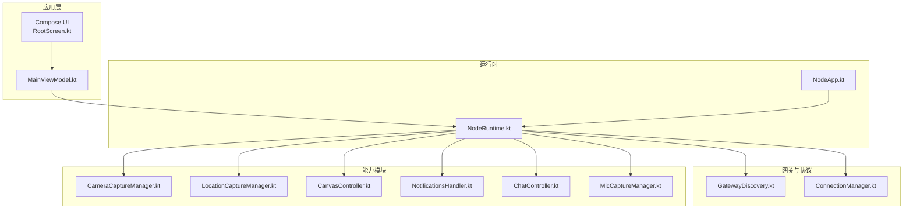
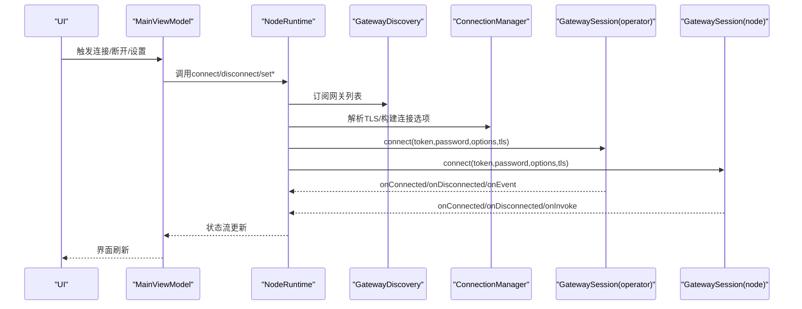
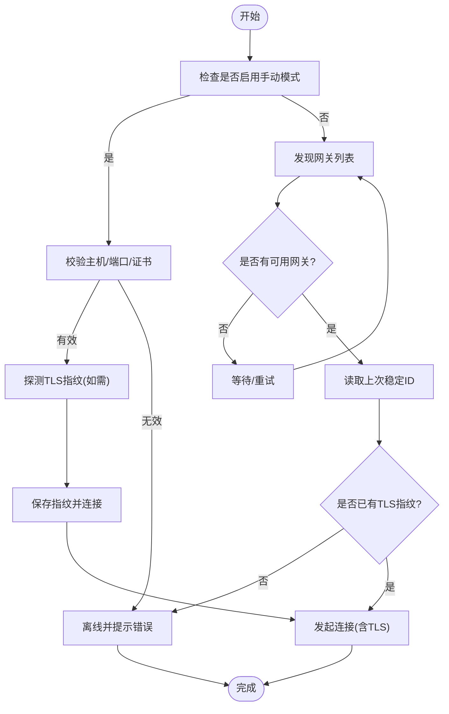
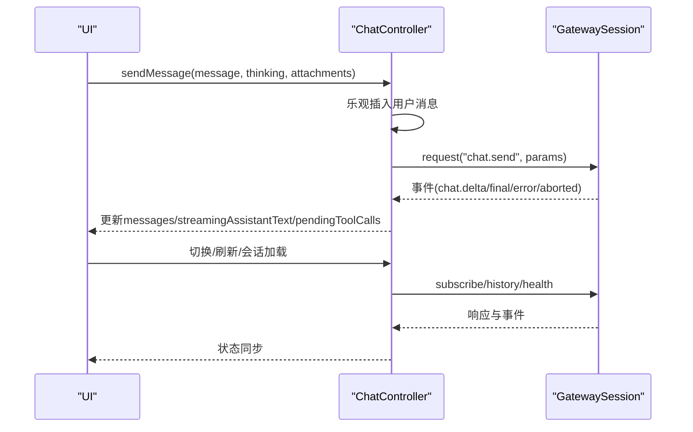
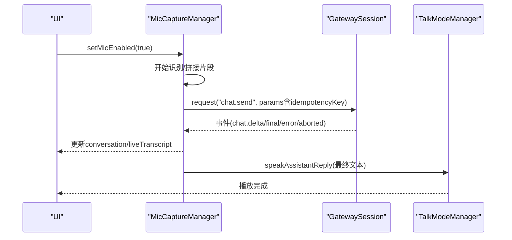
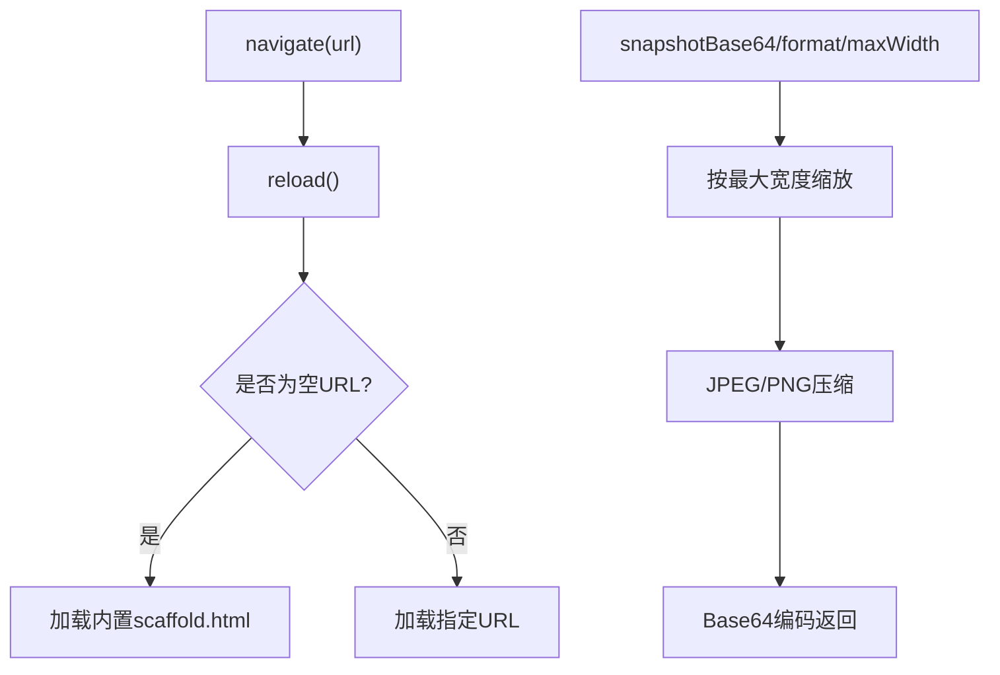
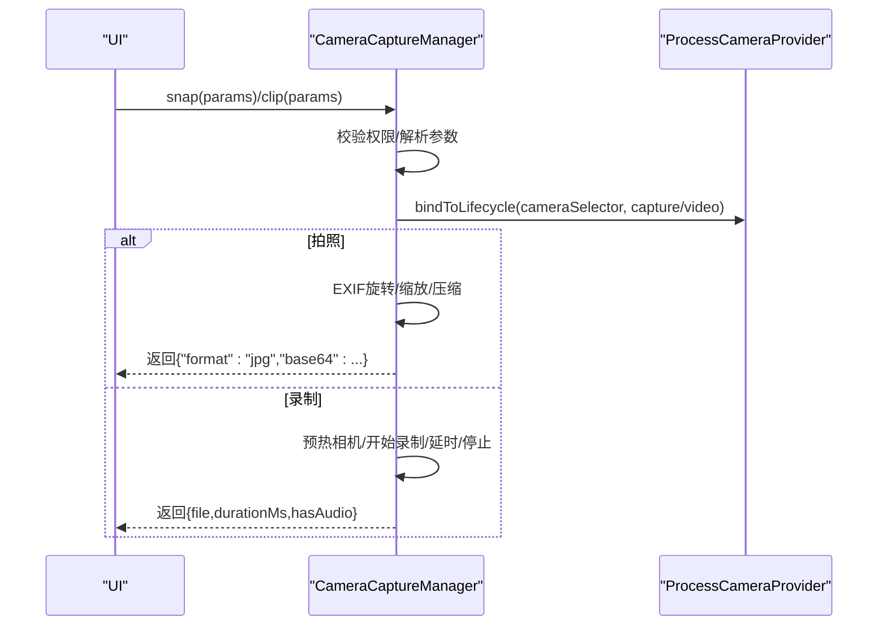
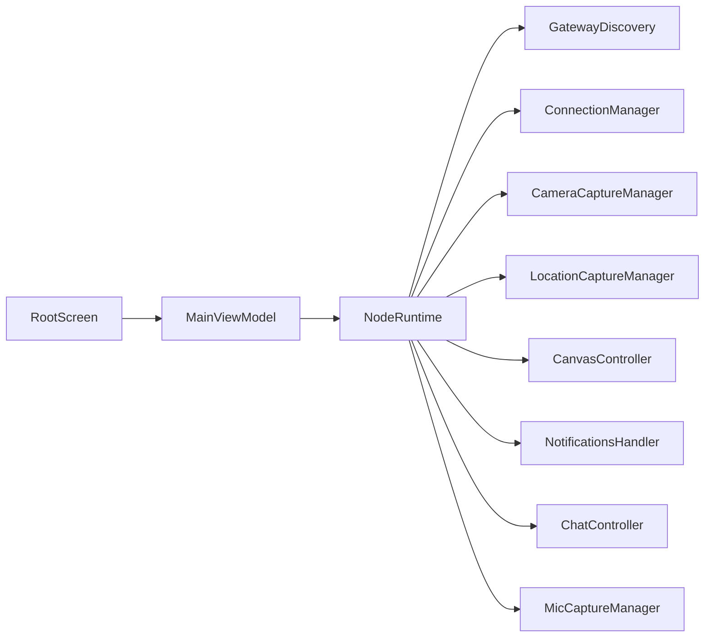

# 核心功能模块

## 目录
1. [简介](#简介)
2. [项目结构](#项目结构)
3. [核心组件](#核心组件)
4. [架构总览](#架构总览)
5. [详细组件分析](#详细组件分析)
6. [依赖关系分析](#依赖关系分析)
7. [性能考虑](#性能考虑)
8. [故障排查指南](#故障排查指南)
9. [结论](#结论)

## 简介
本文件面向OpenClaw Android节点应用，系统性梳理并解释核心功能模块的设计与实现，覆盖连接管理、聊天界面、语音功能、Canvas共享、相机控制、屏幕录制、位置信息、通知管理等。文档从架构设计、关键实现、用户交互流程、模块协作与数据流等方面进行深入解析，并提供使用示例与最佳实践，帮助开发者理解与扩展各功能模块。

## 项目结构
Android端采用Kotlin语言与Jetpack Compose UI，核心运行时在NodeRuntime中集中编排，通过MainViewModel暴露状态与操作入口；网关发现与TLS信任由GatewayDiscovery与ConnectionManager负责；各能力模块（相机、位置、通知、Canvas）以独立管理器形式接入Invoke分发链路；语音模块包含麦克风采集与TTS播放两条并行管线。

图表来源
- [NodeApp.kt](file://apps/android/app/src/main/java/ai/openclaw/app/NodeApp.kt#L1-L27)
- [NodeRuntime.kt](file://apps/android/app/src/main/java/ai/openclaw/app/NodeRuntime.kt#L44-L300)
- [GatewayDiscovery.kt](file://apps/android/app/src/main/java/ai/openclaw/app/gateway/GatewayDiscovery.kt#L46-L120)
- [ConnectionManager.kt](file://apps/android/app/src/main/java/ai/openclaw/app/node/ConnectionManager.kt#L13-L157)
- [CameraCaptureManager.kt](file://apps/android/app/src/main/java/ai/openclaw/app/node/CameraCaptureManager.kt#L44-L160)
- [LocationCaptureManager.kt](file://apps/android/app/src/main/java/ai/openclaw/app/node/LocationCaptureManager.kt#L19-L62)
- [CanvasController.kt](file://apps/android/app/src/main/java/ai/openclaw/app/node/CanvasController.kt#L26-L120)
- [NotificationsHandler.kt](file://apps/android/app/src/main/java/ai/openclaw/app/node/NotificationsHandler.kt#L43-L116)
- [ChatController.kt](file://apps/android/app/src/main/java/ai/openclaw/app/chat/ChatController.kt#L21-L120)
- [MicCaptureManager.kt](file://apps/android/app/src/main/java/ai/openclaw/app/voice/MicCaptureManager.kt#L39-L120)

章节来源
- [NodeApp.kt](file://apps/android/app/src/main/java/ai/openclaw/app/NodeApp.kt#L1-L27)
- [NodeRuntime.kt](file://apps/android/app/src/main/java/ai/openclaw/app/NodeRuntime.kt#L44-L300)
- [RootScreen.kt](file://apps/android/app/src/main/java/ai/openclaw/app/ui/RootScreen.kt#L10-L21)

## 核心组件
- 应用入口与运行时
  - NodeApp：应用生命周期初始化与懒加载NodeRuntime。
  - NodeRuntime：全局运行时，聚合网关会话、能力管理器、状态流与事件处理。
  - MainViewModel：向UI暴露状态流与操作方法，桥接运行时与UI。
- 连接管理
  - GatewayDiscovery：基于DNS-SD与可选广域域名的网关发现，维护本地与远端网关列表与状态文本。
  - ConnectionManager：构建连接选项、客户端信息、UA、能力与命令清单，解析TLS参数。
- 能力模块
  - CameraCaptureManager：拍照、视频录制、设备枚举、EXIF旋转与压缩。
  - LocationCaptureManager：定位获取与缓存策略、权限校验、时间戳格式化。
  - CanvasController：WebView承载的Canvas渲染、导航、调试状态注入、快照导出。
  - NotificationsHandler：系统通知监听服务封装、快照读取、动作执行。
  - ChatController：会话加载/切换、消息发送、健康检查、工具调用挂起队列。
  - MicCaptureManager：语音识别、会话拼接、排队发送、TTS回放、事件驱动的状态机。

章节来源
- [NodeApp.kt](file://apps/android/app/src/main/java/ai/openclaw/app/NodeApp.kt#L6-L25)
- [NodeRuntime.kt](file://apps/android/app/src/main/java/ai/openclaw/app/NodeRuntime.kt#L44-L300)
- [MainViewModel.kt](file://apps/android/app/src/main/java/ai/openclaw/app/MainViewModel.kt#L13-L25)
- [GatewayDiscovery.kt](file://apps/android/app/src/main/java/ai/openclaw/app/gateway/GatewayDiscovery.kt#L46-L120)
- [ConnectionManager.kt](file://apps/android/app/src/main/java/ai/openclaw/app/node/ConnectionManager.kt#L13-L157)
- [CameraCaptureManager.kt](file://apps/android/app/src/main/java/ai/openclaw/app/node/CameraCaptureManager.kt#L44-L160)
- [LocationCaptureManager.kt](file://apps/android/app/src/main/java/ai/openclaw/app/node/LocationCaptureManager.kt#L19-L62)
- [CanvasController.kt](file://apps/android/app/src/main/java/ai/openclaw/app/node/CanvasController.kt#L26-L120)
- [NotificationsHandler.kt](file://apps/android/app/src/main/java/ai/openclaw/app/node/NotificationsHandler.kt#L43-L116)
- [ChatController.kt](file://apps/android/app/src/main/java/ai/openclaw/app/chat/ChatController.kt#L21-L120)
- [MicCaptureManager.kt](file://apps/android/app/src/main/java/ai/openclaw/app/voice/MicCaptureManager.kt#L39-L120)

## 架构总览
OpenClaw Android节点采用“运行时集中编排 + 模块化能力管理”的架构：
- NodeRuntime作为中枢，持有多个能力管理器实例，统一调度与状态发布。
- 网关侧通过GatewaySession建立两路连接：operator（UI侧）与node（节点侧），分别承担不同职责。
- InvokeDispatcher将来自网关的invoke请求路由到对应能力处理器，实现“能力即接口”。
- UI通过MainViewModel订阅状态流，触发运行时操作。

图表来源
- [NodeRuntime.kt](file://apps/android/app/src/main/java/ai/openclaw/app/NodeRuntime.kt#L220-L292)
- [GatewayDiscovery.kt](file://apps/android/app/src/main/java/ai/openclaw/app/gateway/GatewayDiscovery.kt#L92-L120)
- [ConnectionManager.kt](file://apps/android/app/src/main/java/ai/openclaw/app/node/ConnectionManager.kt#L128-L150)

## 详细组件分析

### 连接管理
- 网关发现
  - 使用DNS-SD发现本地网关，同时支持通过环境变量配置的广域域名进行反查，合并结果并排序展示。
  - 维护状态文本，反映本地与广域发现结果数量与RCODE。
- TLS与信任
  - 首次连接若需要TLS指纹验证，先探测指纹并弹出信任提示，存储后重连。
  - 后续连接优先使用已存储指纹，避免中间人风险。
- 自动连接策略
  - 当存在上次发现的稳定ID且已保存TLS指纹时，自动尝试连接；手动模式下仅在TLS允许且指纹存在时才自动连接。

图表来源
- [GatewayDiscovery.kt](file://apps/android/app/src/main/java/ai/openclaw/app/gateway/GatewayDiscovery.kt#L92-L120)
- [NodeRuntime.kt](file://apps/android/app/src/main/java/ai/openclaw/app/NodeRuntime.kt#L709-L744)
- [ConnectionManager.kt](file://apps/android/app/src/main/java/ai/openclaw/app/node/ConnectionManager.kt#L152-L156)

章节来源
- [GatewayDiscovery.kt](file://apps/android/app/src/main/java/ai/openclaw/app/gateway/GatewayDiscovery.kt#L46-L193)
- [NodeRuntime.kt](file://apps/android/app/src/main/java/ai/openclaw/app/NodeRuntime.kt#L709-L744)
- [ConnectionManager.kt](file://apps/android/app/src/main/java/ai/openclaw/app/node/ConnectionManager.kt#L13-L157)

### 聊天界面
- 会话与消息
  - 支持会话加载/切换、历史拉取、思考级别设置、健康检查轮询。
  - 发送消息采用幂等键，乐观插入用户消息，等待最终态更新。
- 工具调用
  - 订阅agent.stream.tool事件，维护挂起工具调用队列，按阶段start/result推进UI。
- 错误与中断
  - seqGap与事件流中断时清理挂起任务并提示刷新；错误态显示错误信息并清空流式文本。

图表来源
- [ChatController.kt](file://apps/android/app/src/main/java/ai/openclaw/app/chat/ChatController.kt#L112-L204)
- [ChatController.kt](file://apps/android/app/src/main/java/ai/openclaw/app/chat/ChatController.kt#L228-L397)

章节来源
- [ChatController.kt](file://apps/android/app/src/main/java/ai/openclaw/app/chat/ChatController.kt#L21-L538)

### 语音功能
- 录音与发送
  - MicCaptureManager使用系统SpeechRecognizer进行连续录音，自动拼接句子片段，进入队列后在网关可用时发送。
  - 发送前生成idempotencyKey并提前写入pendingRunId，确保事件到达时能正确匹配。
- 事件驱动
  - 监听chat事件，根据runId匹配当前轮次，实时更新助手回复（流式/最终/错误/中止）。
- TTS回放
  - 在非TalkMode全量TTS模式下，收到最终回复后异步触发TTS播放，避免重复播报。

图表来源
- [MicCaptureManager.kt](file://apps/android/app/src/main/java/ai/openclaw/app/voice/MicCaptureManager.kt#L310-L344)
- [MicCaptureManager.kt](file://apps/android/app/src/main/java/ai/openclaw/app/voice/MicCaptureManager.kt#L140-L181)
- [NodeRuntime.kt](file://apps/android/app/src/main/java/ai/openclaw/app/NodeRuntime.kt#L325-L353)

章节来源
- [MicCaptureManager.kt](file://apps/android/app/src/main/java/ai/openclaw/app/voice/MicCaptureManager.kt#L39-L574)
- [NodeRuntime.kt](file://apps/android/app/src/main/java/ai/openclaw/app/NodeRuntime.kt#L309-L323)

### Canvas共享
- 渲染与导航
  - CanvasController通过WebView加载默认scaffold或指定URL，支持调试状态注入与页面完成回调。
- 快照导出
  - 提供PNG/JPEG快照导出，支持质量与最大宽度限制，内部对位图进行缩放与压缩。
- 与A2UI联动
  - 运行时在节点连接成功后尝试自动导航至A2UI地址；支持请求Canvas重载与超时处理。

图表来源
- [CanvasController.kt](file://apps/android/app/src/main/java/ai/openclaw/app/node/CanvasController.kt#L67-L120)
- [CanvasController.kt](file://apps/android/app/src/main/java/ai/openclaw/app/node/CanvasController.kt#L166-L180)
- [NodeRuntime.kt](file://apps/android/app/src/main/java/ai/openclaw/app/NodeRuntime.kt#L425-L432)

章节来源
- [CanvasController.kt](file://apps/android/app/src/main/java/ai/openclaw/app/node/CanvasController.kt#L26-L273)
- [NodeRuntime.kt](file://apps/android/app/src/main/java/ai/openclaw/app/NodeRuntime.kt#L442-L491)

### 相机控制
- 设备与权限
  - 列举可用摄像头设备，解析facing/deviceId，必要时请求相机与麦克风权限。
- 拍照
  - 读取EXIF方向并旋转，按最大宽度缩放，使用JpegSizeLimiter控制5MB上限，返回JSON负载。
- 录制
  - 使用最低质量以减小文件体积，预览+录制绑定生命周期，延时后停止并等待完成事件，超时或失败时清理临时文件。

图表来源
- [CameraCaptureManager.kt](file://apps/android/app/src/main/java/ai/openclaw/app/node/CameraCaptureManager.kt#L97-L160)
- [CameraCaptureManager.kt](file://apps/android/app/src/main/java/ai/openclaw/app/node/CameraCaptureManager.kt#L162-L266)

章节来源
- [CameraCaptureManager.kt](file://apps/android/app/src/main/java/ai/openclaw/app/node/CameraCaptureManager.kt#L44-L420)

### 屏幕录制
- 录制策略
  - 采用最低质量以降低带宽与存储压力；录制前绑定预览以激活编码器；延时后停止并等待完成事件。
- 失败处理
  - 超时或完成事件含错时删除临时文件并抛出异常，确保资源回收。

章节来源
- [CameraCaptureManager.kt](file://apps/android/app/src/main/java/ai/openclaw/app/node/CameraCaptureManager.kt#L162-L266)

### 位置信息
- 缓存优先与时效
  - 优先返回满足maxAge的最近已知位置；否则在超时内请求当前定位，支持GPS/网络多源。
- 权限与错误
  - 校验粗/精定位权限；无可用提供者或无法获取定位时抛出明确错误。

章节来源
- [LocationCaptureManager.kt](file://apps/android/app/src/main/java/ai/openclaw/app/node/LocationCaptureManager.kt#L19-L118)

### 通知管理
- 快照与动作
  - 通过系统通知监听服务读取快照，必要时请求重新绑定；支持open/dismiss/reply动作执行。
- 参数校验
  - 对key/action/replyText进行严格校验，非法请求返回标准错误码与消息。

章节来源
- [NotificationsHandler.kt](file://apps/android/app/src/main/java/ai/openclaw/app/node/NotificationsHandler.kt#L43-L162)

## 依赖关系分析
- 运行时耦合
  - NodeRuntime聚合所有能力管理器并通过InvokeDispatcher统一调度，保持高内聚低耦合。
- 网络与安全
  - ConnectionManager集中构建连接参数与TLS策略，GatewayDiscovery提供可信网关来源。
- UI与状态
  - MainViewModel仅暴露StateFlow与操作方法，UI通过收集状态流响应变化，降低耦合度。

图表来源
- [NodeRuntime.kt](file://apps/android/app/src/main/java/ai/openclaw/app/NodeRuntime.kt#L44-L166)
- [MainViewModel.kt](file://apps/android/app/src/main/java/ai/openclaw/app/MainViewModel.kt#L13-L25)
- [RootScreen.kt](file://apps/android/app/src/main/java/ai/openclaw/app/ui/RootScreen.kt#L10-L21)

章节来源
- [NodeRuntime.kt](file://apps/android/app/src/main/java/ai/openclaw/app/NodeRuntime.kt#L44-L166)
- [MainViewModel.kt](file://apps/android/app/src/main/java/ai/openclaw/app/MainViewModel.kt#L13-L25)

## 性能考虑
- I/O与协程
  - 所有耗时操作（相机、定位、网络）均在IO线程池执行，避免阻塞主线程。
- 资源回收
  - 录制失败与超时路径主动删除临时文件，释放位图资源。
- 压缩与传输
  - 图像压缩采用JpegSizeLimiter，限制Base64编码后的payload大小；视频采用最低质量策略。
- 状态更新
  - 使用StateFlow与distinctUntilChanged减少UI重绘次数。

## 故障排查指南
- 网络连接
  - 若出现“无可用网关”或“TLS指纹不匹配”，检查GatewayDiscovery状态文本与ConnectionManager的TLS解析逻辑。
- 语音识别
  - ERROR_AUDIO/ERROR_SERVER等错误通常需要重启识别会话；确认麦克风权限与语言包可用性。
- 相机录制
  - ERROR_NO_VALID_DATA常见于未绑定预览导致编码器无数据，确保绑定Preview后再开始录制。
- 通知服务
  - 若通知不可用，检查系统通知监听服务授权与连接状态，必要时触发rebind。

章节来源
- [GatewayDiscovery.kt](file://apps/android/app/src/main/java/ai/openclaw/app/gateway/GatewayDiscovery.kt#L175-L193)
- [ConnectionManager.kt](file://apps/android/app/src/main/java/ai/openclaw/app/node/ConnectionManager.kt#L152-L156)
- [MicCaptureManager.kt](file://apps/android/app/src/main/java/ai/openclaw/app/voice/MicCaptureManager.kt#L505-L546)
- [CameraCaptureManager.kt](file://apps/android/app/src/main/java/ai/openclaw/app/node/CameraCaptureManager.kt#L202-L266)
- [NotificationsHandler.kt](file://apps/android/app/src/main/java/ai/openclaw/app/node/NotificationsHandler.kt#L118-L124)

## 结论
OpenClaw Android节点应用通过NodeRuntime实现能力模块的统一编排与状态管理，结合GatewaySession与InvokeDispatcher形成清晰的“能力即接口”模型。各模块在权限、性能与可靠性方面均有明确策略，配合UI状态流实现平滑的用户交互体验。建议在扩展新能力时遵循现有Invoke分发与状态管理模式，确保一致的架构风格与可维护性。