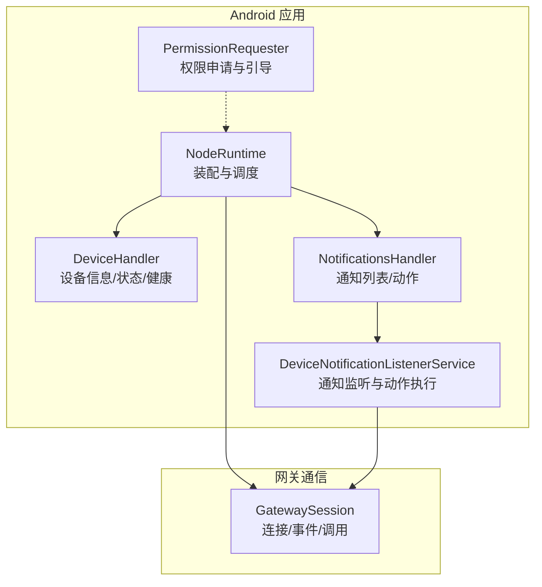
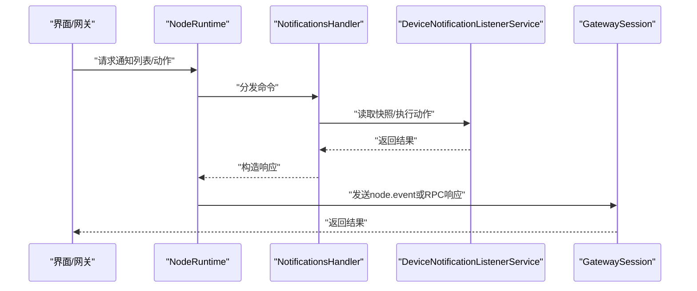
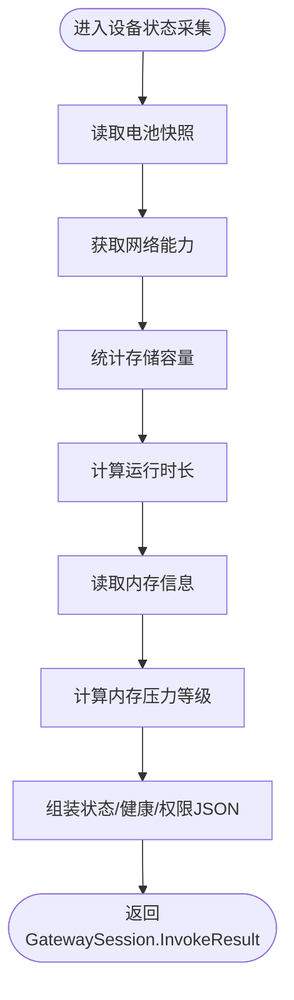
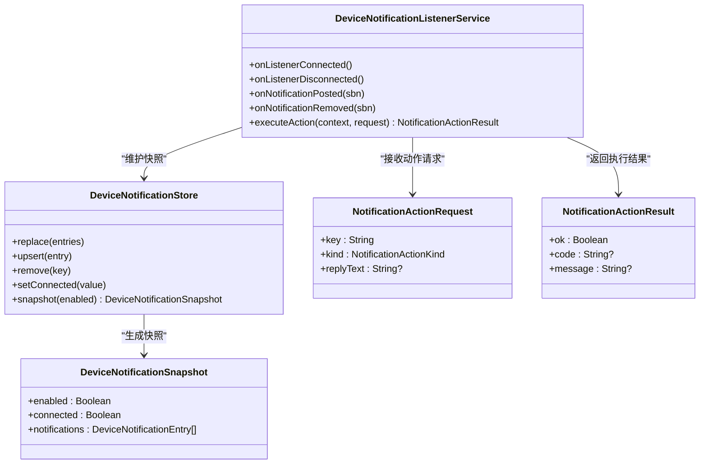
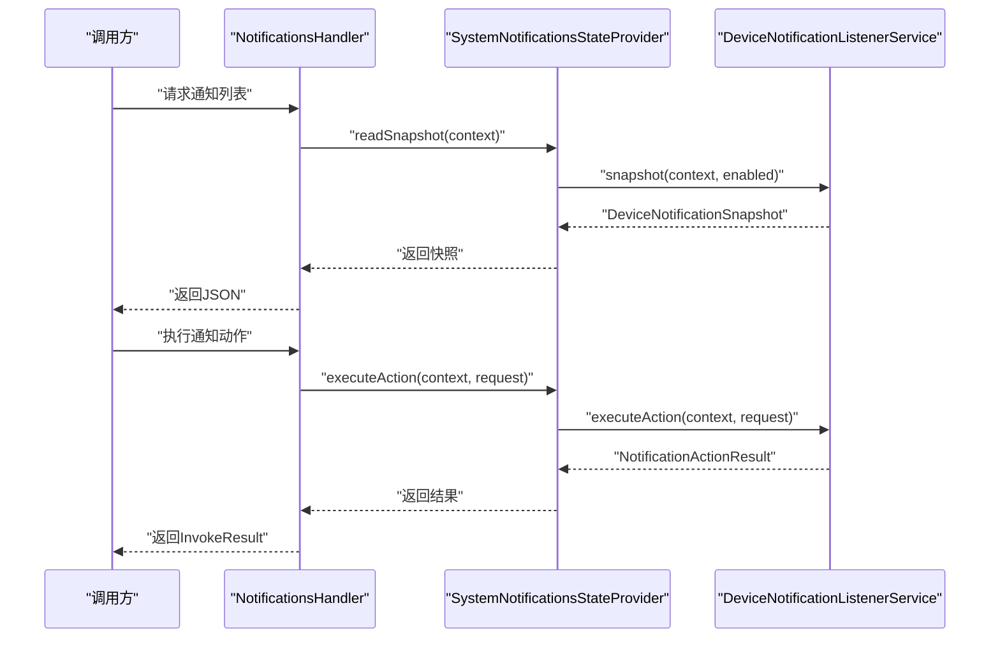
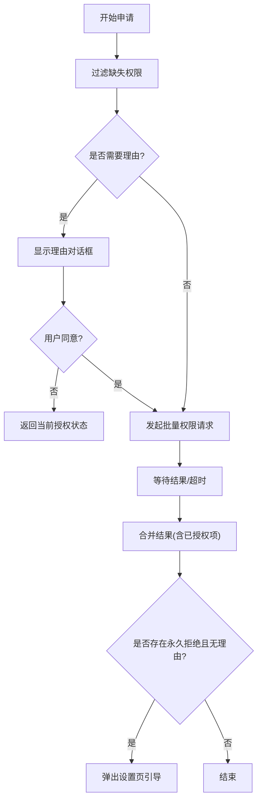
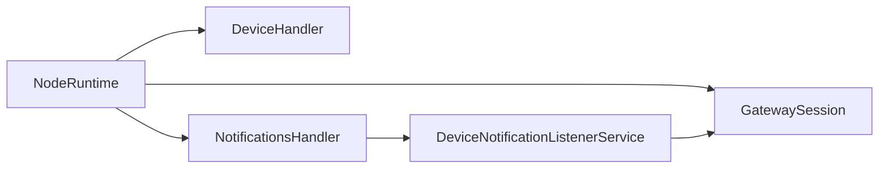

# 设备集成

## 目录
1. [简介](#简介)
2. [项目结构](#项目结构)
3. [核心组件](#核心组件)
4. [架构总览](#架构总览)
5. [组件详解](#组件详解)
6. [依赖关系分析](#依赖关系分析)
7. [性能考量](#性能考量)
8. [故障排查指南](#故障排查指南)
9. [结论](#结论)
10. [附录](#附录)

## 简介
本文件面向OpenClaw Android节点应用的“设备集成”能力，聚焦以下目标：
- 深入解析DeviceHandler的设备管理功能：设备信息收集、硬件能力检测、设备状态监控与健康度评估。
- 详述DeviceNotificationListenerService的通知监听机制与NotificationsHandler的通知处理流程。
- 提供设备兼容性检查、权限申请与系统版本适配的实现方案。
- 覆盖通知权限管理、隐私合规与跨设备同步的技术细节。

## 项目结构
Android节点应用采用模块化设计，设备相关能力集中在node包下，并通过NodeRuntime统一装配到网关会话中，形成“设备能力采集—事件上报—命令分发”的闭环。

图表来源
- [apps/android/app/src/main/java/ai/openclaw/app/NodeRuntime.kt](file://apps/android/app/src/main/java/ai/openclaw/app/NodeRuntime.kt#L87-L93)
- [apps/android/app/src/main/java/ai/openclaw/app/node/DeviceHandler.kt](file://apps/android/app/src/main/java/ai/openclaw/app/node/DeviceHandler.kt#L26-L50)
- [apps/android/app/src/main/java/ai/openclaw/app/node/NotificationsHandler.kt](file://apps/android/app/src/main/java/ai/openclaw/app/node/NotificationsHandler.kt#L43-L47)
- [apps/android/app/src/main/java/ai/openclaw/app/node/DeviceNotificationListenerService.kt](file://apps/android/app/src/main/java/ai/openclaw/app/node/DeviceNotificationListenerService.kt#L128-L149)
- [apps/android/app/src/main/java/ai/openclaw/app/gateway/GatewaySession.kt](file://apps/android/app/src/main/java/ai/openclaw/app/gateway/GatewaySession.kt#L139-L160)

章节来源
- [apps/android/app/src/main/java/ai/openclaw/app/NodeRuntime.kt](file://apps/android/app/src/main/java/ai/openclaw/app/NodeRuntime.kt#L87-L93)
- [apps/android/app/src/main/AndroidManifest.xml](file://apps/android/app/src/main/AndroidManifest.xml#L43-L55)

## 核心组件
- DeviceHandler：负责设备信息、状态、权限与健康度的采集与输出，统一以JSON格式返回给网关侧。
- NotificationsHandler：封装通知列表查询与动作执行的入口，内部委托系统通知监听服务完成实际操作。
- DeviceNotificationListenerService：系统级通知监听服务，维护通知快照、事件派发与动作执行（打开、清除、回复）。
- PermissionRequester：统一的权限申请与引导流程，支持理由说明、设置页跳转与超时控制。
- NodeRuntime：应用运行时，负责各处理器实例化、网关会话建立、事件转发与命令分发。
- GatewaySession：与网关的WebSocket通信层，支持事件上报、RPC调用与命令分发。

章节来源
- [apps/android/app/src/main/java/ai/openclaw/app/node/DeviceHandler.kt](file://apps/android/app/src/main/java/ai/openclaw/app/node/DeviceHandler.kt#L26-L50)
- [apps/android/app/src/main/java/ai/openclaw/app/node/NotificationsHandler.kt](file://apps/android/app/src/main/java/ai/openclaw/app/node/NotificationsHandler.kt#L43-L47)
- [apps/android/app/src/main/java/ai/openclaw/app/node/DeviceNotificationListenerService.kt](file://apps/android/app/src/main/java/ai/openclaw/app/node/DeviceNotificationListenerService.kt#L128-L149)
- [apps/android/app/src/main/java/ai/openclaw/app/PermissionRequester.kt](file://apps/android/app/src/main/java/ai/openclaw/app/PermissionRequester.kt#L22-L85)
- [apps/android/app/src/main/java/ai/openclaw/app/NodeRuntime.kt](file://apps/android/app/src/main/java/ai/openclaw/app/NodeRuntime.kt#L87-L93)
- [apps/android/app/src/main/java/ai/openclaw/app/gateway/GatewaySession.kt](file://apps/android/app/src/main/java/ai/openclaw/app/gateway/GatewaySession.kt#L139-L160)

## 架构总览
设备集成的端到端流程如下：
- 设备侧通过DeviceHandler定期或按需采集设备信息、状态与健康度。
- 通过GatewaySession将设备状态与事件上报至网关。
- 用户在网关侧触发通知相关命令，由NotificationsHandler解析参数并委派DeviceNotificationListenerService执行具体动作。
- DeviceNotificationListenerService在系统层面监听通知变化，维护本地快照并执行打开、清除、回复等操作。

图表来源
- [apps/android/app/src/main/java/ai/openclaw/app/NodeRuntime.kt](file://apps/android/app/src/main/java/ai/openclaw/app/NodeRuntime.kt#L294-L300)
- [apps/android/app/src/main/java/ai/openclaw/app/node/NotificationsHandler.kt](file://apps/android/app/src/main/java/ai/openclaw/app/node/NotificationsHandler.kt#L49-L116)
- [apps/android/app/src/main/java/ai/openclaw/app/node/DeviceNotificationListenerService.kt](file://apps/android/app/src/main/java/ai/openclaw/app/node/DeviceNotificationListenerService.kt#L257-L272)
- [apps/android/app/src/main/java/ai/openclaw/app/gateway/GatewaySession.kt](file://apps/android/app/src/main/java/ai/openclaw/app/gateway/GatewaySession.kt#L139-L160)

## 组件详解

### DeviceHandler：设备信息/状态/健康/权限采集
- 设备信息（handleDeviceInfo）：设备名称、型号标识、系统版本、应用版本与构建号、区域语言等。
- 设备状态（handleDeviceStatus）：电池状态与电量、低功耗模式、热状态、存储总量/可用/已用、网络连通性与接口类型、运行时长。
- 健康度（handleDeviceHealth）：内存压力等级、总/可用/已用内存、低内存标记、电池状态/充电类型/温度/电流、省电/Doze模式、安全补丁级别。
- 权限状态（handleDevicePermissions）：相机、麦克风、位置、短信、通知监听、通知、相册、通讯录、日历、运动识别等权限的授予状态与是否可再次提示。
- 关键映射与计算：
  - 电池状态与充电类型映射，热状态分级，内存压力等级阈值划分，网络状态与接口类型识别。
  - 存储空间基于StatFs计算，网络接口通过NetworkCapabilities判断。
- 兼容性要点：
  - 针对Android 13+的媒体读取权限与通知权限分别处理。
  - 位置权限同时支持精确与粗略权限。
  - 短信权限依赖设备是否具备电话功能。

图表来源
- [apps/android/app/src/main/java/ai/openclaw/app/node/DeviceHandler.kt](file://apps/android/app/src/main/java/ai/openclaw/app/node/DeviceHandler.kt#L52-L108)
- [apps/android/app/src/main/java/ai/openclaw/app/node/DeviceHandler.kt](file://apps/android/app/src/main/java/ai/openclaw/app/node/DeviceHandler.kt#L227-L286)
- [apps/android/app/src/main/java/ai/openclaw/app/node/DeviceHandler.kt](file://apps/android/app/src/main/java/ai/openclaw/app/node/DeviceHandler.kt#L130-L225)

章节来源
- [apps/android/app/src/main/java/ai/openclaw/app/node/DeviceHandler.kt](file://apps/android/app/src/main/java/ai/openclaw/app/node/DeviceHandler.kt#L26-L50)
- [apps/android/app/src/test/java/ai/openclaw/app/node/DeviceHandlerTest.kt](file://apps/android/app/src/test/java/ai/openclaw/app/node/DeviceHandlerTest.kt#L20-L148)

### DeviceNotificationListenerService：通知监听与动作执行
- 快照与存储：
  - 使用线程安全的DeviceNotificationStore维护通知列表，支持替换、插入、删除与连接状态标记。
  - onNotificationPosted/onNotificationRemoved更新本地快照，并向NodeRuntime注册的事件通道发出“notifications.changed”事件。
- 动作执行策略：
  - 打开：解析通知的contentIntent并触发；若无则返回不可用错误。
  - 清除：仅对可清除通知有效；失败时返回失败错误。
  - 回复：从通知actions中提取带RemoteInput的action，填充回复文本后通过actionIntent发送。
- 可用性保障：
  - 在executeAction前校验通知监听权限与服务连接状态，否则返回明确错误码。
  - 对“清除”动作要求通知必须可清除，避免对ongoing/受保护通知进行操作。

图表来源
- [apps/android/app/src/main/java/ai/openclaw/app/node/DeviceNotificationListenerService.kt](file://apps/android/app/src/main/java/ai/openclaw/app/node/DeviceNotificationListenerService.kt#L80-L126)
- [apps/android/app/src/main/java/ai/openclaw/app/node/DeviceNotificationListenerService.kt](file://apps/android/app/src/main/java/ai/openclaw/app/node/DeviceNotificationListenerService.kt#L128-L149)
- [apps/android/app/src/main/java/ai/openclaw/app/node/DeviceNotificationListenerService.kt](file://apps/android/app/src/main/java/ai/openclaw/app/node/DeviceNotificationListenerService.kt#L257-L279)

章节来源
- [apps/android/app/src/main/java/ai/openclaw/app/node/DeviceNotificationListenerService.kt](file://apps/android/app/src/main/java/ai/openclaw/app/node/DeviceNotificationListenerService.kt#L128-L196)
- [apps/android/app/src/main/java/ai/openclaw/app/node/DeviceNotificationListenerService.kt](file://apps/android/app/src/main/java/ai/openclaw/app/node/DeviceNotificationListenerService.kt#L257-L376)

### NotificationsHandler：通知列表与动作处理
- 列表查询（handleNotificationsList）：
  - 优先读取快照；当启用但未连接时触发服务重绑定。
  - 将快照序列化为包含enabled、connected、count与通知数组的JSON。
- 动作执行（handleNotificationsActions）：
  - 参数校验：key必填、action取值限定、回复动作需携带replyText。
  - 委托SystemNotificationsStateProvider执行动作，捕获错误并转换为GatewaySession.InvokeResult。
- 状态提供器抽象：
  - SystemNotificationsStateProvider直接委托DeviceNotificationListenerService完成读取、重绑定与动作执行。

图表来源
- [apps/android/app/src/main/java/ai/openclaw/app/node/NotificationsHandler.kt](file://apps/android/app/src/main/java/ai/openclaw/app/node/NotificationsHandler.kt#L49-L116)
- [apps/android/app/src/main/java/ai/openclaw/app/node/NotificationsHandler.kt](file://apps/android/app/src/main/java/ai/openclaw/app/node/NotificationsHandler.kt#L21-L41)
- [apps/android/app/src/main/java/ai/openclaw/app/node/DeviceNotificationListenerService.kt](file://apps/android/app/src/main/java/ai/openclaw/app/node/DeviceNotificationListenerService.kt#L247-L272)

章节来源
- [apps/android/app/src/main/java/ai/openclaw/app/node/NotificationsHandler.kt](file://apps/android/app/src/main/java/ai/openclaw/app/node/NotificationsHandler.kt#L43-L160)
- [apps/android/app/src/test/java/ai/openclaw/app/node/NotificationsHandlerTest.kt](file://apps/android/app/src/test/java/ai/openclaw/app/node/NotificationsHandlerTest.kt#L24-L259)

### 权限申请与系统版本适配
- 权限申请流程（PermissionRequester）：
  - 多权限批量申请，支持理由对话框与设置页引导。
  - 超时控制与合并结果：即使launcher遗漏某些权限，仍以当前授权状态为准。
  - 对永久拒绝且无理由的情况，弹出设置页引导用户手动开启。
- 版本适配要点：
  - Android 13+媒体读取权限与通知权限分离。
  - 存储权限在Android 13之前使用READ_EXTERNAL_STORAGE。
  - 位置权限同时支持ACCESS_FINE_LOCATION与ACCESS_COARSE_LOCATION。
  - 短信权限依赖设备是否具备电话功能（FEATURE_TELEPHONY）。
- 权限状态展示：
  - DeviceHandler在权限JSON中提供“status”与“promptable”字段，便于前端/网关侧呈现。

图表来源
- [apps/android/app/src/main/java/ai/openclaw/app/PermissionRequester.kt](file://apps/android/app/src/main/java/ai/openclaw/app/PermissionRequester.kt#L33-L85)

章节来源
- [apps/android/app/src/main/java/ai/openclaw/app/PermissionRequester.kt](file://apps/android/app/src/main/java/ai/openclaw/app/PermissionRequester.kt#L22-L134)
- [apps/android/app/src/main/java/ai/openclaw/app/node/DeviceHandler.kt](file://apps/android/app/src/main/java/ai/openclaw/app/node/DeviceHandler.kt#L130-L225)

### 通知权限管理与隐私合规
- 通知监听权限：
  - 通过NotificationManager.isNotificationListenerAccessGranted校验；未授权时，NotificationsHandler与DeviceNotificationListenerService均返回明确错误码。
- 文本裁剪与隐私：
  - sanitizeNotificationText对标题/正文/子文本进行去空白与长度限制，避免泄露敏感信息。
- 事件上报：
  - DeviceNotificationListenerService在通知新增/移除时，向NodeRuntime注册的事件通道发送“notifications.changed”，payload包含关键字段如变更类型、包名、时间戳等，便于网关侧做最小化传输与审计。

章节来源
- [apps/android/app/src/main/java/ai/openclaw/app/node/DeviceNotificationListenerService.kt](file://apps/android/app/src/main/java/ai/openclaw/app/node/DeviceNotificationListenerService.kt#L19-L22)
- [apps/android/app/src/main/java/ai/openclaw/app/node/DeviceNotificationListenerService.kt](file://apps/android/app/src/main/java/ai/openclaw/app/node/DeviceNotificationListenerService.kt#L151-L196)
- [apps/android/app/src/main/java/ai/openclaw/app/NodeRuntime.kt](file://apps/android/app/src/main/java/ai/openclaw/app/NodeRuntime.kt#L294-L300)

### 跨设备同步的技术细节
- 通知键唯一性：优先使用通知key，若为空则回退为“包名:通知ID:发布时间”，确保跨设备一致性。
- 连接状态与重绑定：当通知监听服务断开或未连接时，NotificationsHandler会请求服务重绑定，保证后续动作执行的可靠性。
- 网关侧事件驱动：通过GatewaySession.sendNodeEvent将通知变更事件推送到网关，便于多端协同与状态对齐。

章节来源
- [apps/android/app/src/main/java/ai/openclaw/app/node/DeviceNotificationListenerService.kt](file://apps/android/app/src/main/java/ai/openclaw/app/node/DeviceNotificationListenerService.kt#L208-L228)
- [apps/android/app/src/main/java/ai/openclaw/app/node/NotificationsHandler.kt](file://apps/android/app/src/main/java/ai/openclaw/app/node/NotificationsHandler.kt#L118-L124)
- [apps/android/app/src/main/java/ai/openclaw/app/gateway/GatewaySession.kt](file://apps/android/app/src/main/java/ai/openclaw/app/gateway/GatewaySession.kt#L139-L160)

## 依赖关系分析
- NodeRuntime装配DeviceHandler与NotificationsHandler，并将DeviceNotificationListenerService的事件通过GatewaySession转发至网关。
- NotificationsHandler依赖DeviceNotificationListenerService提供的快照与动作执行能力。
- DeviceHandler独立于网关事件，通过GatewaySession.InvokeResult返回设备状态/健康/权限等静态信息。
- 权限申请由PermissionRequester在UI层触发，DeviceHandler负责权限状态的只读展示。

图表来源
- [apps/android/app/src/main/java/ai/openclaw/app/NodeRuntime.kt](file://apps/android/app/src/main/java/ai/openclaw/app/NodeRuntime.kt#L87-L93)
- [apps/android/app/src/main/java/ai/openclaw/app/node/NotificationsHandler.kt](file://apps/android/app/src/main/java/ai/openclaw/app/node/NotificationsHandler.kt#L43-L47)
- [apps/android/app/src/main/java/ai/openclaw/app/node/DeviceNotificationListenerService.kt](file://apps/android/app/src/main/java/ai/openclaw/app/node/DeviceNotificationListenerService.kt#L230-L240)
- [apps/android/app/src/main/java/ai/openclaw/app/gateway/GatewaySession.kt](file://apps/android/app/src/main/java/ai/openclaw/app/gateway/GatewaySession.kt#L139-L160)

章节来源
- [apps/android/app/src/main/java/ai/openclaw/app/NodeRuntime.kt](file://apps/android/app/src/main/java/ai/openclaw/app/NodeRuntime.kt#L294-L300)

## 性能考量
- 通知快照存储采用线程安全的LinkedHashMap，按时间倒序维护，避免频繁全量扫描。
- 网络与存储统计仅在必要时读取，减少I/O与系统调用开销。
- 内存压力等级基于可用内存占比快速判定，避免复杂计算。
- 通知动作执行使用异步回调与异常捕获，避免阻塞主线程。

## 故障排查指南
- 通知监听未启用：
  - 现象：返回“NOTIFICATIONS_DISABLED”错误。
  - 处理：引导用户在系统设置中开启通知访问权限。
- 通知监听服务未连接：
  - 现象：返回“NOTIFICATIONS_UNAVAILABLE”错误。
  - 处理：触发服务重绑定或重启应用后重试。
- 通知不存在或不可清除：
  - 现象：返回“NOTIFICATION_NOT_FOUND”或“NOTIFICATION_NOT_CLEARABLE”错误。
  - 处理：确认通知key正确且目标通知允许清除。
- 回复文本缺失：
  - 现象：返回“INVALID_REQUEST”错误。
  - 处理：为回复动作提供非空replyText。
- 设备权限不足：
  - 现象：权限状态为“denied”，promptable为false。
  - 处理：通过PermissionRequester发起权限申请或引导至设置页。

章节来源
- [apps/android/app/src/main/java/ai/openclaw/app/node/DeviceNotificationListenerService.kt](file://apps/android/app/src/main/java/ai/openclaw/app/node/DeviceNotificationListenerService.kt#L257-L376)
- [apps/android/app/src/main/java/ai/openclaw/app/node/NotificationsHandler.kt](file://apps/android/app/src/main/java/ai/openclaw/app/node/NotificationsHandler.kt#L54-L116)
- [apps/android/app/src/main/java/ai/openclaw/app/PermissionRequester.kt](file://apps/android/app/src/main/java/ai/openclaw/app/PermissionRequester.kt#L87-L114)

## 结论
OpenClaw Android节点应用通过DeviceHandler与DeviceNotificationListenerService实现了对设备信息、状态、健康度与通知的全面采集与控制，并借助NotificationsHandler与GatewaySession构建了可靠的事件上报与命令执行链路。配合PermissionRequester与系统权限模型，应用在不同Android版本上实现了良好的兼容性与用户体验。通知权限管理与文本裁剪策略有助于满足隐私合规要求，而跨设备同步的关键在于通知键的稳定与事件的最小化上报。

## 附录
- 权限清单与服务声明参考：
  - 通知监听服务、FileProvider、前台服务类型等在AndroidManifest中集中声明。
- 测试覆盖：
  - DeviceHandler与NotificationsHandler均有单元测试，验证输出结构、边界条件与错误路径。

章节来源
- [apps/android/app/src/main/AndroidManifest.xml](file://apps/android/app/src/main/AndroidManifest.xml#L43-L55)
- [apps/android/app/src/test/java/ai/openclaw/app/node/DeviceHandlerTest.kt](file://apps/android/app/src/test/java/ai/openclaw/app/node/DeviceHandlerTest.kt#L20-L148)
- [apps/android/app/src/test/java/ai/openclaw/app/node/NotificationsHandlerTest.kt](file://apps/android/app/src/test/java/ai/openclaw/app/node/NotificationsHandlerTest.kt#L24-L259)