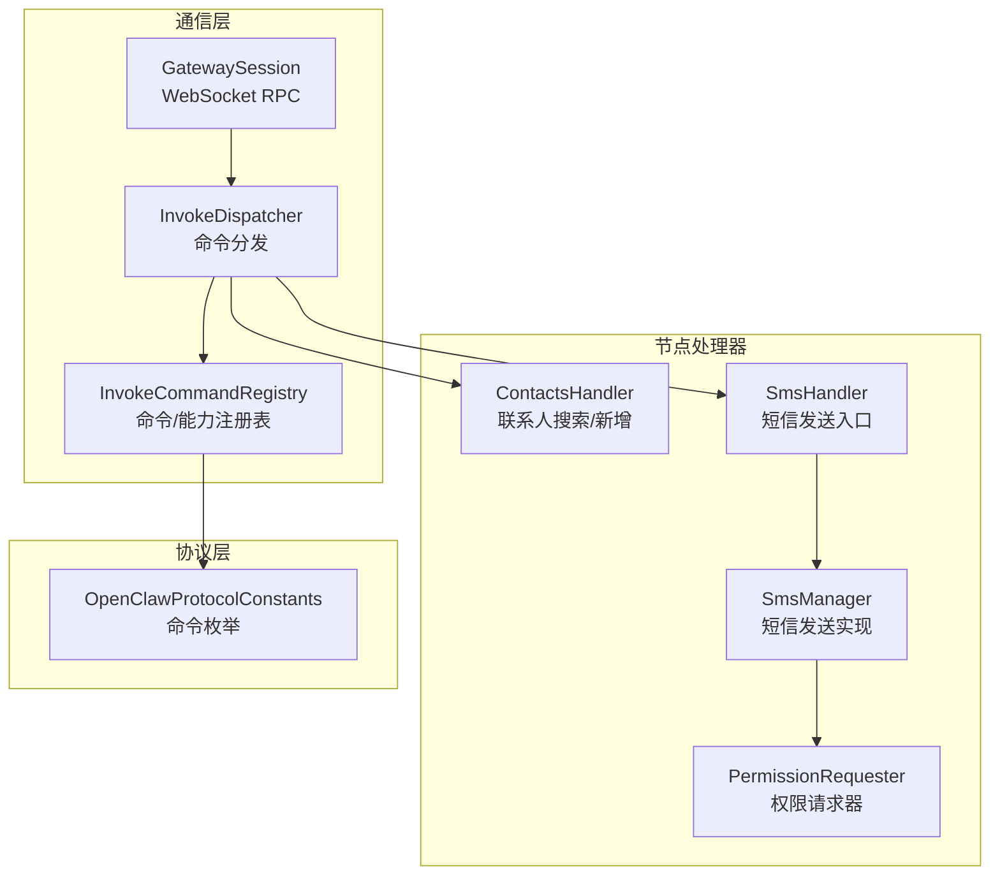
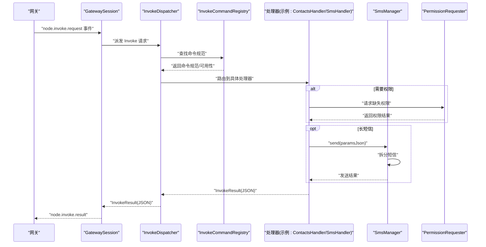
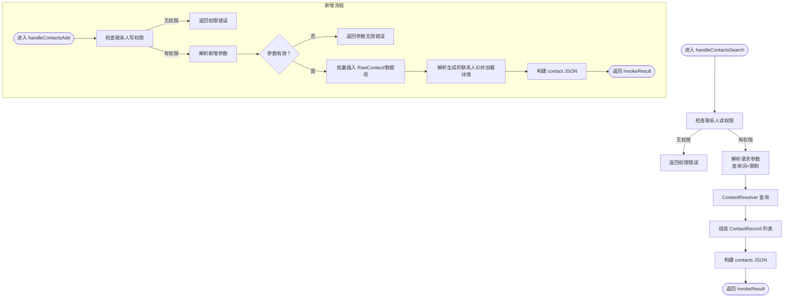
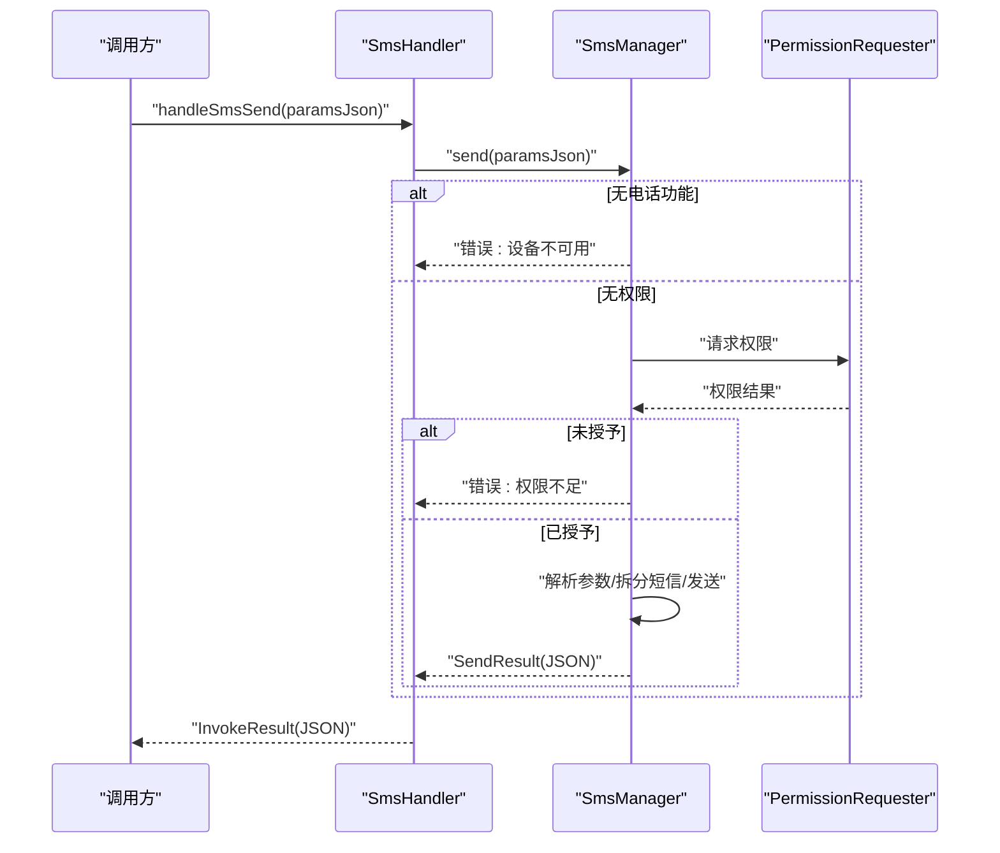
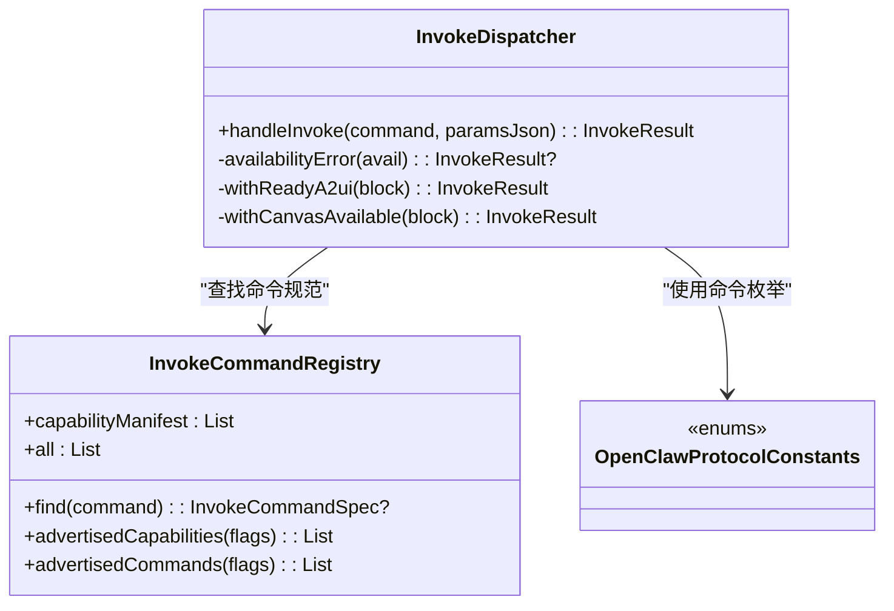
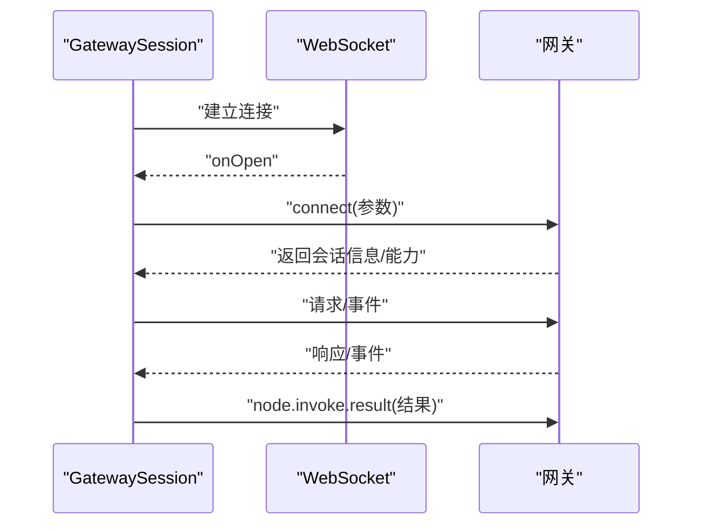
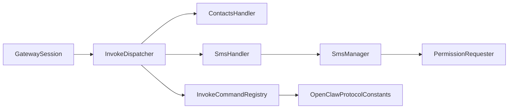

# 通信模块

## 目录
1. [简介](#简介)
2. [项目结构](#项目结构)
3. [核心组件](#核心组件)
4. [架构总览](#架构总览)
5. [详细组件分析](#详细组件分析)
6. [依赖关系分析](#依赖关系分析)
7. [性能考量](#性能考量)
8. [故障排查指南](#故障排查指南)
9. [结论](#结论)
10. [附录](#附录)

## 简介
本文件面向OpenClaw Android节点应用的通信模块，聚焦以下能力：
- 联系人管理：联系人同步、搜索与过滤（ContactsHandler）
- 短信处理：短信发送、权限校验与错误封装（SmsHandler、SmsManager）
- 命令分发与注册：InvokeDispatcher的命令路由与InvokeCommandRegistry的命令/能力清单
- 通信协议与消息序列化：基于WebSocket的RPC模型、请求/响应与事件流
- 异步处理：协程驱动的连接管理、请求等待与超时控制
- 安全与隐私：TLS握手、设备签名、权限请求与最小授权原则

## 项目结构
通信模块位于Android应用侧，围绕“网关会话（GatewaySession）—命令分发（InvokeDispatcher）—具体处理器（Handlers）”的层次组织，协议常量统一定义命令命名空间。

图表来源
- [apps/android/app/src/main/java/ai/openclaw/app/gateway/GatewaySession.kt](file://apps/android/app/src/main/java/ai/openclaw/app/gateway/GatewaySession.kt#L55-L761)
- [apps/android/app/src/main/java/ai/openclaw/app/node/InvokeDispatcher.kt](file://apps/android/app/src/main/java/ai/openclaw/app/node/InvokeDispatcher.kt#L16-L275)
- [apps/android/app/src/main/java/ai/openclaw/app/node/InvokeCommandRegistry.kt](file://apps/android/app/src/main/java/ai/openclaw/app/node/InvokeCommandRegistry.kt#L57-L235)
- [apps/android/app/src/main/java/ai/openclaw/app/node/ContactsHandler.kt](file://apps/android/app/src/main/java/ai/openclaw/app/node/ContactsHandler.kt#L296-L431)
- [apps/android/app/src/main/java/ai/openclaw/app/node/SmsHandler.kt](file://apps/android/app/src/main/java/ai/openclaw/app/node/SmsHandler.kt#L5-L20)
- [apps/android/app/src/main/java/ai/openclaw/app/node/SmsManager.kt](file://apps/android/app/src/main/java/ai/openclaw/app/node/SmsManager.kt#L20-L231)
- [apps/android/app/src/main/java/ai/openclaw/app/protocol/OpenClawProtocolConstants.kt](file://apps/android/app/src/main/java/ai/openclaw/app/protocol/OpenClawProtocolConstants.kt#L3-L140)
- [apps/android/app/src/main/java/ai/openclaw/app/PermissionRequester.kt](file://apps/android/app/src/main/java/ai/openclaw/app/PermissionRequester.kt)

章节来源
- [apps/android/app/src/main/java/ai/openclaw/app/gateway/GatewaySession.kt](file://apps/android/app/src/main/java/ai/openclaw/app/gateway/GatewaySession.kt#L55-L761)
- [apps/android/app/src/main/java/ai/openclaw/app/node/InvokeDispatcher.kt](file://apps/android/app/src/main/java/ai/openclaw/app/node/InvokeDispatcher.kt#L16-L275)
- [apps/android/app/src/main/java/ai/openclaw/app/node/InvokeCommandRegistry.kt](file://apps/android/app/src/main/java/ai/openclaw/app/node/InvokeCommandRegistry.kt#L57-L235)
- [apps/android/app/src/main/java/ai/openclaw/app/protocol/OpenClawProtocolConstants.kt](file://apps/android/app/src/main/java/ai/openclaw/app/protocol/OpenClawProtocolConstants.kt#L3-L140)

## 核心组件
- GatewaySession：负责与网关建立WebSocket连接、发起RPC请求、处理事件、管理会话生命周期与TLS配置；支持“node.invoke.request”事件触发本地命令执行，并回传结果。
- InvokeDispatcher：根据命令名查表（InvokeCommandRegistry），进行前台可用性、能力可用性检查后，将请求路由到对应处理器（如ContactsHandler、SmsHandler等）。
- InvokeCommandRegistry：集中维护所有命令规范（名称、是否需前台、可用性条件）与节点能力清单（如相机、短信、位置等），并按运行时标志动态筛选可宣告的能力与命令。
- ContactsHandler：封装联系人读写权限检查、联系人查询与新增，使用系统ContentProvider进行批量操作，返回标准化JSON。
- SmsHandler/SmsManager：封装短信发送流程，含参数解析、权限校验、长短信拆分、结果序列化与错误码映射。
- PermissionRequester：用于在运行时向用户申请必要权限（如短信、联系人、电话等）。

章节来源
- [apps/android/app/src/main/java/ai/openclaw/app/gateway/GatewaySession.kt](file://apps/android/app/src/main/java/ai/openclaw/app/gateway/GatewaySession.kt#L55-L761)
- [apps/android/app/src/main/java/ai/openclaw/app/node/InvokeDispatcher.kt](file://apps/android/app/src/main/java/ai/openclaw/app/node/InvokeDispatcher.kt#L16-L275)
- [apps/android/app/src/main/java/ai/openclaw/app/node/InvokeCommandRegistry.kt](file://apps/android/app/src/main/java/ai/openclaw/app/node/InvokeCommandRegistry.kt#L57-L235)
- [apps/android/app/src/main/java/ai/openclaw/app/node/ContactsHandler.kt](file://apps/android/app/src/main/java/ai/openclaw/app/node/ContactsHandler.kt#L296-L431)
- [apps/android/app/src/main/java/ai/openclaw/app/node/SmsHandler.kt](file://apps/android/app/src/main/java/ai/openclaw/app/node/SmsHandler.kt#L5-L20)
- [apps/android/app/src/main/java/ai/openclaw/app/node/SmsManager.kt](file://apps/android/app/src/main/java/ai/openclaw/app/node/SmsManager.kt#L20-L231)
- [apps/android/app/src/main/java/ai/openclaw/app/PermissionRequester.kt](file://apps/android/app/src/main/java/ai/openclaw/app/PermissionRequester.kt)

## 架构总览
下图展示从网关到节点处理器的完整调用链路与数据流。

图表来源
- [apps/android/app/src/main/java/ai/openclaw/app/gateway/GatewaySession.kt](file://apps/android/app/src/main/java/ai/openclaw/app/gateway/GatewaySession.kt#L523-L585)
- [apps/android/app/src/main/java/ai/openclaw/app/node/InvokeDispatcher.kt](file://apps/android/app/src/main/java/ai/openclaw/app/node/InvokeDispatcher.kt#L41-L169)
- [apps/android/app/src/main/java/ai/openclaw/app/node/InvokeCommandRegistry.kt](file://apps/android/app/src/main/java/ai/openclaw/app/node/InvokeCommandRegistry.kt#L200-L233)
- [apps/android/app/src/main/java/ai/openclaw/app/node/ContactsHandler.kt](file://apps/android/app/src/main/java/ai/openclaw/app/node/ContactsHandler.kt#L302-L371)
- [apps/android/app/src/main/java/ai/openclaw/app/node/SmsHandler.kt](file://apps/android/app/src/main/java/ai/openclaw/app/node/SmsHandler.kt#L8-L18)
- [apps/android/app/src/main/java/ai/openclaw/app/node/SmsManager.kt](file://apps/android/app/src/main/java/ai/openclaw/app/node/SmsManager.kt#L142-L202)
- [apps/android/app/src/main/java/ai/openclaw/app/PermissionRequester.kt](file://apps/android/app/src/main/java/ai/openclaw/app/PermissionRequester.kt)

## 详细组件分析

### 联系人管理：ContactsHandler
- 权限与数据源
  - 通过系统权限检查决定是否允许读取/写入联系人。
  - 使用系统ContentResolver与ContentProviderOperation进行批量插入与查询。
- 搜索与过滤
  - 支持关键词模糊匹配与限制返回条数，默认上限与范围约束。
  - 查询排序采用显示名大小写不敏感升序。
- 新增联系人
  - 支持设置姓名（名/姓/显示名）、组织机构、多个手机号与邮箱。
  - 使用批量操作原子性地创建RawContact及各类数据项。
- 结果序列化
  - 将联系人信息序列化为标准JSON对象，字段包含标识符、姓名、组织、电话与邮箱列表。

图表来源
- [apps/android/app/src/main/java/ai/openclaw/app/node/ContactsHandler.kt](file://apps/android/app/src/main/java/ai/openclaw/app/node/ContactsHandler.kt#L55-L294)
- [apps/android/app/src/main/java/ai/openclaw/app/node/ContactsHandler.kt](file://apps/android/app/src/main/java/ai/openclaw/app/node/ContactsHandler.kt#L302-L371)
- [apps/android/app/src/main/java/ai/openclaw/app/node/ContactsHandler.kt](file://apps/android/app/src/main/java/ai/openclaw/app/node/ContactsHandler.kt#L412-L422)

章节来源
- [apps/android/app/src/main/java/ai/openclaw/app/node/ContactsHandler.kt](file://apps/android/app/src/main/java/ai/openclaw/app/node/ContactsHandler.kt#L296-L431)

### 短信处理：SmsHandler 与 SmsManager
- 参数解析与校验
  - 必须提供目标号码与短信文本；空参数或字段缺失将返回错误。
- 发送策略
  - 若设备不具备电话功能则直接失败。
  - 若缺少发送短信权限，尝试通过PermissionRequester申请；若仍无权限则失败。
  - 使用Android SmsManager进行短信拆分（长短信）与发送。
- 结果与错误
  - 成功返回包含目标号码与成功标记的JSON；失败返回带错误码与消息的JSON。
  - 错误码覆盖权限不足、设备不可用、未知异常等场景。

图表来源
- [apps/android/app/src/main/java/ai/openclaw/app/node/SmsHandler.kt](file://apps/android/app/src/main/java/ai/openclaw/app/node/SmsHandler.kt#L8-L18)
- [apps/android/app/src/main/java/ai/openclaw/app/node/SmsManager.kt](file://apps/android/app/src/main/java/ai/openclaw/app/node/SmsManager.kt#L142-L202)
- [apps/android/app/src/main/java/ai/openclaw/app/PermissionRequester.kt](file://apps/android/app/src/main/java/ai/openclaw/app/PermissionRequester.kt)

章节来源
- [apps/android/app/src/main/java/ai/openclaw/app/node/SmsHandler.kt](file://apps/android/app/src/main/java/ai/openclaw/app/node/SmsHandler.kt#L5-L20)
- [apps/android/app/src/main/java/ai/openclaw/app/node/SmsManager.kt](file://apps/android/app/src/main/java/ai/openclaw/app/node/SmsManager.kt#L20-L231)

### 命令分发与注册：InvokeDispatcher 与 InvokeCommandRegistry
- 命令注册
  - 维护命令清单与能力清单，包含前台要求与可用性条件（如相机启用、位置启用、短信可用、运动传感器可用、调试构建）。
- 分发逻辑
  - 先查表获取命令规范，再做前台与可用性检查，最后路由到具体处理器。
  - 对于A2UI相关命令，额外确保A2UI宿主可达并刷新能力。
- 协议常量
  - 命令以“命名空间.动作”的形式定义，例如“sms.send”、“contacts.search/add”等。

图表来源
- [apps/android/app/src/main/java/ai/openclaw/app/node/InvokeCommandRegistry.kt](file://apps/android/app/src/main/java/ai/openclaw/app/node/InvokeCommandRegistry.kt#L57-L235)
- [apps/android/app/src/main/java/ai/openclaw/app/node/InvokeDispatcher.kt](file://apps/android/app/src/main/java/ai/openclaw/app/node/InvokeDispatcher.kt#L41-L275)
- [apps/android/app/src/main/java/ai/openclaw/app/protocol/OpenClawProtocolConstants.kt](file://apps/android/app/src/main/java/ai/openclaw/app/protocol/OpenClawProtocolConstants.kt#L3-L140)

章节来源
- [apps/android/app/src/main/java/ai/openclaw/app/node/InvokeDispatcher.kt](file://apps/android/app/src/main/java/ai/openclaw/app/node/InvokeDispatcher.kt#L16-L275)
- [apps/android/app/src/main/java/ai/openclaw/app/node/InvokeCommandRegistry.kt](file://apps/android/app/src/main/java/ai/openclaw/app/node/InvokeCommandRegistry.kt#L57-L235)
- [apps/android/app/src/main/java/ai/openclaw/app/protocol/OpenClawProtocolConstants.kt](file://apps/android/app/src/main/java/ai/openclaw/app/protocol/OpenClawProtocolConstants.kt#L3-L140)

### 通信协议与消息序列化
- 连接与认证
  - 通过WebSocket连接网关，发送“connect”请求，携带客户端信息、角色、作用域、权限与设备签名等。
  - 支持TLS参数注入，建立SSL Socket工厂与主机名校验器。
- RPC模型
  - 请求/响应帧包含类型、ID、方法与参数；支持超时控制与挂起队列。
  - “node.invoke.request”事件触发本地命令执行，随后回传“node.invoke.result”。
- 序列化
  - 使用Kotlinx Serialization进行JSON解析与编码，忽略未知字段以增强兼容性。
- 事件与心跳
  - 支持事件透传与Ping/Pong保活，断线重连指数退避。

图表来源
- [apps/android/app/src/main/java/ai/openclaw/app/gateway/GatewaySession.kt](file://apps/android/app/src/main/java/ai/openclaw/app/gateway/GatewaySession.kt#L241-L380)
- [apps/android/app/src/main/java/ai/openclaw/app/gateway/GatewaySession.kt](file://apps/android/app/src/main/java/ai/openclaw/app/gateway/GatewaySession.kt#L523-L585)

章节来源
- [apps/android/app/src/main/java/ai/openclaw/app/gateway/GatewaySession.kt](file://apps/android/app/src/main/java/ai/openclaw/app/gateway/GatewaySession.kt#L55-L761)

## 依赖关系分析
- 组件耦合
  - InvokeDispatcher对各处理器存在直接依赖，但通过命令枚举与注册表降低耦合度。
  - SmsManager依赖Android系统API与PermissionRequester，职责清晰。
- 外部依赖
  - Kotlinx Serialization用于JSON编解码。
  - OkHttp用于WebSocket通信与TLS配置。
  - Android系统API用于联系人与短信功能。
- 可能的循环依赖
  - 当前结构为单向依赖（会话→分发→处理器），未见循环。

图表来源
- [apps/android/app/src/main/java/ai/openclaw/app/gateway/GatewaySession.kt](file://apps/android/app/src/main/java/ai/openclaw/app/gateway/GatewaySession.kt#L55-L761)
- [apps/android/app/src/main/java/ai/openclaw/app/node/InvokeDispatcher.kt](file://apps/android/app/src/main/java/ai/openclaw/app/node/InvokeDispatcher.kt#L16-L275)
- [apps/android/app/src/main/java/ai/openclaw/app/node/InvokeCommandRegistry.kt](file://apps/android/app/src/main/java/ai/openclaw/app/node/InvokeCommandRegistry.kt#L57-L235)
- [apps/android/app/src/main/java/ai/openclaw/app/node/ContactsHandler.kt](file://apps/android/app/src/main/java/ai/openclaw/app/node/ContactsHandler.kt#L296-L431)
- [apps/android/app/src/main/java/ai/openclaw/app/node/SmsHandler.kt](file://apps/android/app/src/main/java/ai/openclaw/app/node/SmsHandler.kt#L5-L20)
- [apps/android/app/src/main/java/ai/openclaw/app/node/SmsManager.kt](file://apps/android/app/src/main/java/ai/openclaw/app/node/SmsManager.kt#L20-L231)
- [apps/android/app/src/main/java/ai/openclaw/app/protocol/OpenClawProtocolConstants.kt](file://apps/android/app/src/main/java/ai/openclaw/app/protocol/OpenClawProtocolConstants.kt#L3-L140)
- [apps/android/app/src/main/java/ai/openclaw/app/PermissionRequester.kt](file://apps/android/app/src/main/java/ai/openclaw/app/PermissionRequester.kt)

## 性能考量
- 连接与重连
  - 断线重连采用指数退避，最大延迟上限避免风暴。
- 请求超时
  - RPC请求默认超时与ACK确认超时均有限制，防止阻塞。
- 批量操作
  - 联系人新增使用批量操作减少往返次数。
- 长短信拆分
  - SmsManager自动拆分并发送，避免单次超长限制导致失败。

章节来源
- [apps/android/app/src/main/java/ai/openclaw/app/gateway/GatewaySession.kt](file://apps/android/app/src/main/java/ai/openclaw/app/gateway/GatewaySession.kt#L600-L635)
- [apps/android/app/src/main/java/ai/openclaw/app/gateway/GatewaySession.kt](file://apps/android/app/src/main/java/ai/openclaw/app/gateway/GatewaySession.kt#L757-L760)
- [apps/android/app/src/main/java/ai/openclaw/app/node/ContactsHandler.kt](file://apps/android/app/src/main/java/ai/openclaw/app/node/ContactsHandler.kt#L103-L160)
- [apps/android/app/src/main/java/ai/openclaw/app/node/SmsManager.kt](file://apps/android/app/src/main/java/ai/openclaw/app/node/SmsManager.kt#L169-L186)

## 故障排查指南
- 权限相关
  - 联系人/短信/电话权限缺失会导致相应操作失败。优先检查系统权限与运行时申请流程。
- 设备能力
  - 无电话功能或未启用相机/位置等能力时，对应命令会返回“不可用”错误。
- 网络与TLS
  - TLS指纹、握手失败或证书问题会导致连接异常；可通过回调查看稳定ID与指纹。
- 命令与参数
  - 未知命令或参数格式错误会返回“无效请求”；检查协议常量与参数结构。
- 结果解析
  - InvokeResult包含错误码与消息，便于定位问题；注意区分“权限不足”“设备不可用”“未知异常”。

章节来源
- [apps/android/app/src/main/java/ai/openclaw/app/node/ContactsHandler.kt](file://apps/android/app/src/main/java/ai/openclaw/app/node/ContactsHandler.kt#L302-L371)
- [apps/android/app/src/main/java/ai/openclaw/app/node/SmsManager.kt](file://apps/android/app/src/main/java/ai/openclaw/app/node/SmsManager.kt#L142-L202)
- [apps/android/app/src/main/java/ai/openclaw/app/node/InvokeDispatcher.kt](file://apps/android/app/src/main/java/ai/openclaw/app/node/InvokeDispatcher.kt#L215-L273)
- [apps/android/app/src/main/java/ai/openclaw/app/gateway/GatewaySession.kt](file://apps/android/app/src/main/java/ai/openclaw/app/gateway/GatewaySession.kt#L305-L343)

## 结论
该通信模块以清晰的分层与职责划分实现了Android节点与网关之间的可靠交互：
- 命令注册与分发保证了扩展性与一致性；
- 联系人与短信处理遵循最小权限与系统API最佳实践；
- 通信协议采用WebSocket与RPC模型，具备超时、重连与TLS安全保障；
- 在性能与可靠性方面通过批量操作、拆分策略与指数退避得到优化。

## 附录
- 命令命名空间参考
  - Canvas/CanvasA2UI/Camera/Location/Device/Notifications/System/Photos/Contacts/Calendar/Motion/Sms等命令均以“命名空间.动作”形式定义，便于跨平台一致识别与路由。

章节来源
- [apps/android/app/src/main/java/ai/openclaw/app/protocol/OpenClawProtocolConstants.kt](file://apps/android/app/src/main/java/ai/openclaw/app/protocol/OpenClawProtocolConstants.kt#L3-L140)