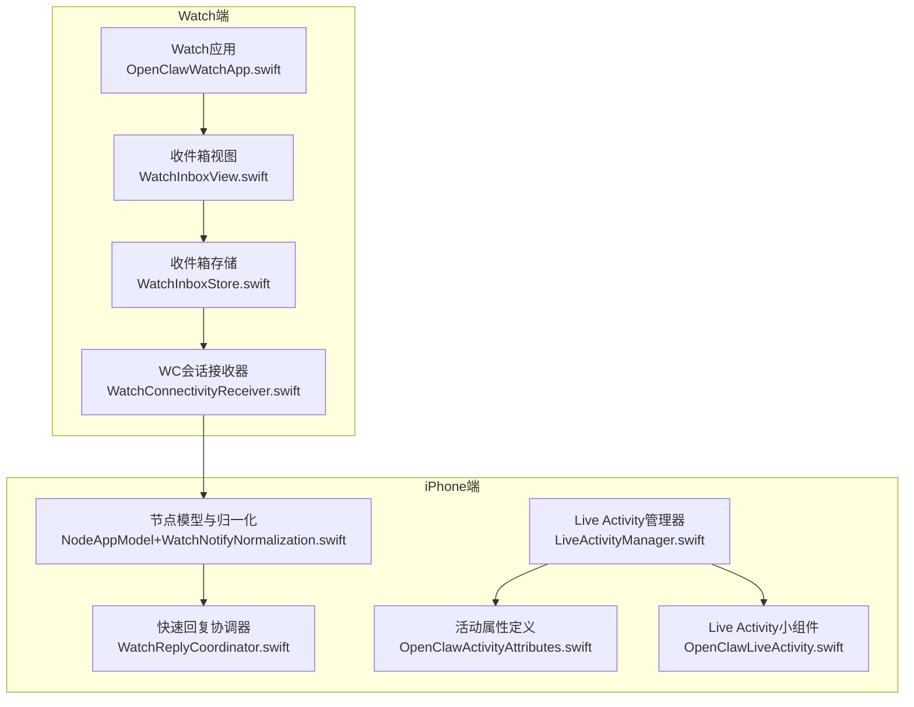
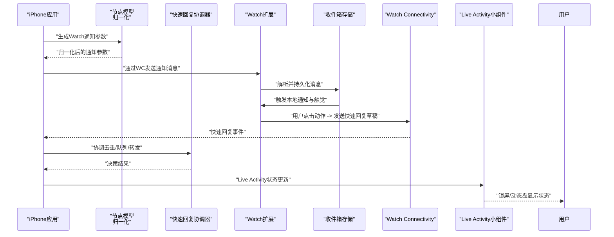
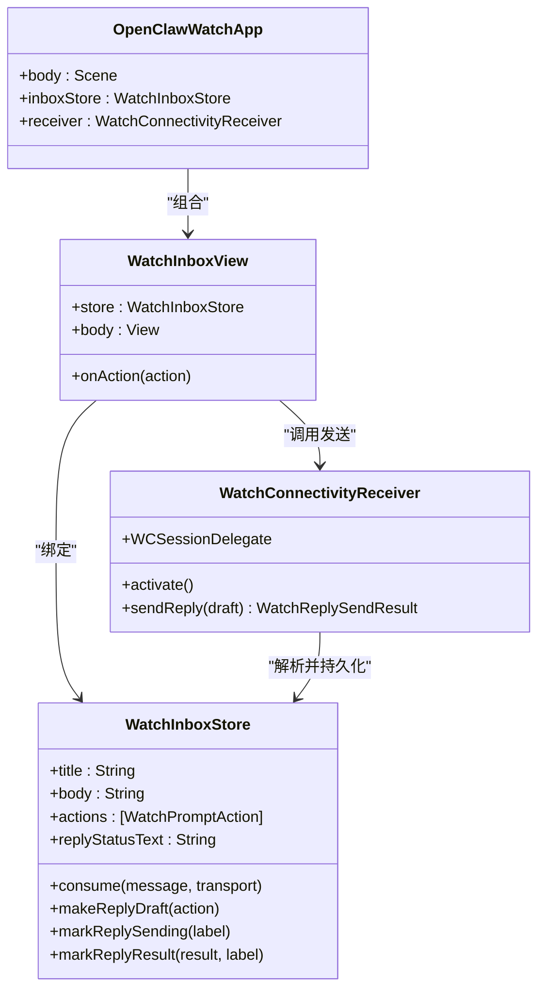
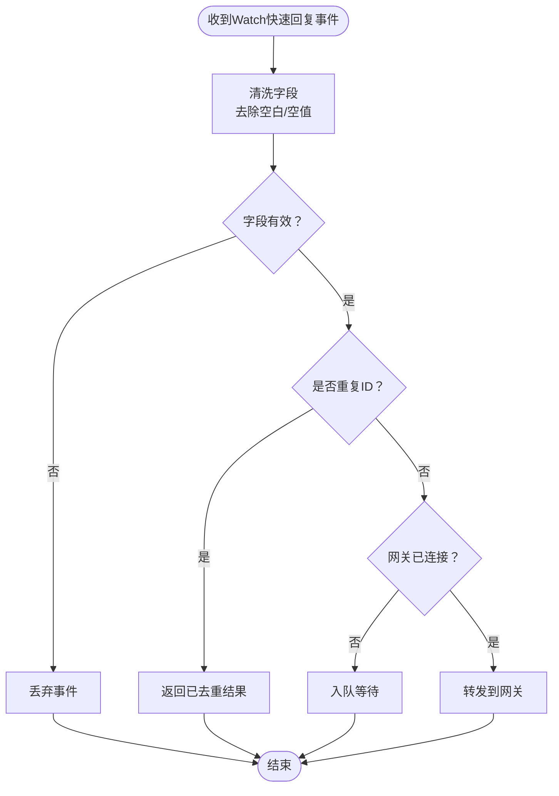
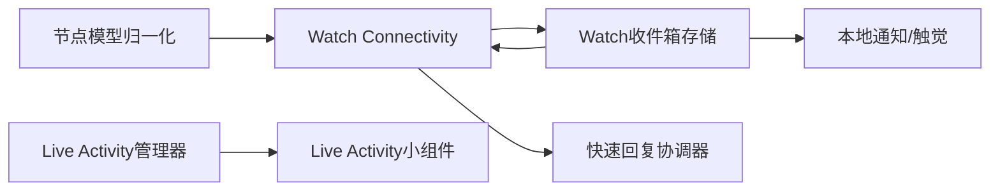

# Apple Watch集成


## 目录
1. [简介](#简介)
2. [项目结构](#项目结构)
3. [核心组件](#核心组件)
4. [架构总览](#架构总览)
5. [详细组件分析](#详细组件分析)
6. [依赖关系分析](#依赖关系分析)
7. [性能考虑](#性能考虑)
8. [故障排查指南](#故障排查指南)
9. [结论](#结论)
10. [附录](#附录)

## 简介
本文件面向OpenClaw iOS节点的Apple Watch集成，系统性阐述Watch应用与扩展的架构设计、与iPhone应用的协同机制、Live Activity的实现方式（活动状态显示、实时数据更新与用户交互），并提供安装配置指南与性能优化建议。目标是帮助开发者与运维人员快速理解并维护该集成。

## 项目结构
OpenClaw在iOS端围绕Watch构建了两部分：Watch应用扩展（Watch Extension）与Live Activity小组件扩展（Activity Widget）。前者负责接收来自iPhone的通知、展示可操作的快捷动作，并通过Watch Connectivity将“快速回复”指令回传给iPhone；后者负责在锁屏/控制中心展示连接状态与运行时信息。



**图表来源**
- [apps/ios/WatchExtension/Sources/OpenClawWatchApp.swift](file://apps/ios/WatchExtension/Sources/OpenClawWatchApp.swift#L1-L29)
- [apps/ios/WatchExtension/Sources/WatchInboxStore.swift](file://apps/ios/WatchExtension/Sources/WatchInboxStore.swift#L1-L231)
- [apps/ios/WatchExtension/Sources/WatchInboxView.swift](file://apps/ios/WatchExtension/Sources/WatchInboxView.swift#L1-L65)
- [apps/ios/WatchExtension/Sources/WatchConnectivityReceiver.swift](file://apps/ios/WatchExtension/Sources/WatchConnectivityReceiver.swift#L1-L237)
- [apps/ios/Sources/Model/NodeAppModel+WatchNotifyNormalization.swift](file://apps/ios/Sources/Model/NodeAppModel+WatchNotifyNormalization.swift#L1-L104)
- [apps/ios/Sources/Model/WatchReplyCoordinator.swift](file://apps/ios/Sources/Model/WatchReplyCoordinator.swift#L1-L47)
- [apps/ios/Sources/LiveActivity/LiveActivityManager.swift](file://apps/ios/Sources/LiveActivity/LiveActivityManager.swift#L1-L126)
- [apps/ios/Sources/LiveActivity/OpenClawActivityAttributes.swift](file://apps/ios/Sources/LiveActivity/OpenClawActivityAttributes.swift#L1-L46)
- [apps/ios/ActivityWidget/OpenClawLiveActivity.swift](file://apps/ios/ActivityWidget/OpenClawLiveActivity.swift#L1-L85)

**章节来源**
- [apps/ios/WatchExtension/Sources/OpenClawWatchApp.swift](file://apps/ios/WatchExtension/Sources/OpenClawWatchApp.swift#L1-L29)
- [apps/ios/ActivityWidget/OpenClawActivityWidgetBundle.swift](file://apps/ios/ActivityWidget/OpenClawActivityWidgetBundle.swift#L1-L10)

## 核心组件
- Watch应用与扩展
  - Watch应用入口负责初始化收件箱存储与WC接收器，并将用户点击的动作转换为“快速回复草稿”，随后通过WC发送到iPhone。
  - 收件箱存储负责解析与持久化来自iPhone的通知消息，触发本地通知与触觉反馈，并记录回复发送状态。
  - 视图层根据当前消息内容与可用动作渲染标题、正文、详情、快捷按钮与回复状态。
  - WC接收器负责会话激活、消息/用户信息/应用上下文的接收与解析，将通知消息交由收件箱存储处理。
- iPhone侧协调与Live Activity
  - 节点模型包含Watch通知参数的归一化逻辑，确保标题、正文、动作、优先级与风险之间的语义一致。
  - 快速回复协调器负责去重、队列化与转发策略，保证在网络不可达或网关未连接时的可靠投递。
  - Live Activity管理器负责启动、更新与清理Live Activity，向小组件提供动态岛与锁屏视图的数据源。

**章节来源**
- [apps/ios/WatchExtension/Sources/OpenClawWatchApp.swift](file://apps/ios/WatchExtension/Sources/OpenClawWatchApp.swift#L1-L29)
- [apps/ios/WatchExtension/Sources/WatchInboxStore.swift](file://apps/ios/WatchExtension/Sources/WatchInboxStore.swift#L1-L231)
- [apps/ios/WatchExtension/Sources/WatchInboxView.swift](file://apps/ios/WatchExtension/Sources/WatchInboxView.swift#L1-L65)
- [apps/ios/WatchExtension/Sources/WatchConnectivityReceiver.swift](file://apps/ios/WatchExtension/Sources/WatchConnectivityReceiver.swift#L1-L237)
- [apps/ios/Sources/Model/NodeAppModel+WatchNotifyNormalization.swift](file://apps/ios/Sources/Model/NodeAppModel+WatchNotifyNormalization.swift#L1-L104)
- [apps/ios/Sources/Model/WatchReplyCoordinator.swift](file://apps/ios/Sources/Model/WatchReplyCoordinator.swift#L1-L47)
- [apps/ios/Sources/LiveActivity/LiveActivityManager.swift](file://apps/ios/Sources/LiveActivity/LiveActivityManager.swift#L1-L126)

## 架构总览
下图展示了从iPhone到Watch再到iPhone的完整交互链路，以及Live Activity在锁屏与动态岛中的呈现。



**图表来源**
- [apps/ios/WatchExtension/Sources/WatchConnectivityReceiver.swift](file://apps/ios/WatchExtension/Sources/WatchConnectivityReceiver.swift#L55-L111)
- [apps/ios/WatchExtension/Sources/WatchInboxStore.swift](file://apps/ios/WatchExtension/Sources/WatchInboxStore.swift#L71-L106)
- [apps/ios/Sources/Model/WatchReplyCoordinator.swift](file://apps/ios/Sources/Model/WatchReplyCoordinator.swift#L15-L30)
- [apps/ios/Sources/LiveActivity/LiveActivityManager.swift](file://apps/ios/Sources/LiveActivity/LiveActivityManager.swift#L27-L66)
- [apps/ios/ActivityWidget/OpenClawLiveActivity.swift](file://apps/ios/ActivityWidget/OpenClawLiveActivity.swift#L5-L33)

## 详细组件分析

### Watch应用与扩展
- 应用入口
  - 初始化收件箱存储与WC接收器，首次进入时激活会话。
  - 将用户动作回调转换为“快速回复草稿”，标记发送中状态，异步发送后更新结果。
- 收件箱存储
  - 解析通知消息，去重（基于消息ID或内容哈希），持久化状态，触发本地通知与触觉反馈。
  - 提供“快速回复草稿”生成、发送中/结果状态标记与持久化。
- 视图层
  - 渲染标题、正文、详情、快捷动作按钮（支持取消/危险样式），禁用发送中状态下的交互。
- WC接收器
  - 支持sendMessage、transferUserInfo、applicationContext三种传输路径，统一解析为通知消息并交由存储处理。
  - 自动激活会话并等待激活完成，优先使用即时消息，失败则回退到用户信息传输。



**图表来源**
- [apps/ios/WatchExtension/Sources/OpenClawWatchApp.swift](file://apps/ios/WatchExtension/Sources/OpenClawWatchApp.swift#L4-L27)
- [apps/ios/WatchExtension/Sources/WatchInboxStore.swift](file://apps/ios/WatchExtension/Sources/WatchInboxStore.swift#L26-L69)
- [apps/ios/WatchExtension/Sources/WatchInboxView.swift](file://apps/ios/WatchExtension/Sources/WatchInboxView.swift#L3-L63)
- [apps/ios/WatchExtension/Sources/WatchConnectivityReceiver.swift](file://apps/ios/WatchExtension/Sources/WatchConnectivityReceiver.swift#L21-L39)

**章节来源**
- [apps/ios/WatchExtension/Sources/OpenClawWatchApp.swift](file://apps/ios/WatchExtension/Sources/OpenClawWatchApp.swift#L1-L29)
- [apps/ios/WatchExtension/Sources/WatchInboxStore.swift](file://apps/ios/WatchExtension/Sources/WatchInboxStore.swift#L1-L231)
- [apps/ios/WatchExtension/Sources/WatchInboxView.swift](file://apps/ios/WatchExtension/Sources/WatchInboxView.swift#L1-L65)
- [apps/ios/WatchExtension/Sources/WatchConnectivityReceiver.swift](file://apps/ios/WatchExtension/Sources/WatchConnectivityReceiver.swift#L1-L237)

### iPhone侧通知归一化与快速回复协调
- 通知参数归一化
  - 统一标题/正文/标识字段，自动补全快捷动作（如审批类场景的“同意/拒绝/打开iPhone/升级”等）。
  - 基于优先级与风险进行互推导，确保语义一致性。
- 快速回复协调器
  - 对缺失字段的事件直接丢弃；对重复ID去重；在网关未连接时入队；连接恢复后批量出队转发。
  - 提供重排首条事件的能力，以保障关键事件优先。



**图表来源**
- [apps/ios/Sources/Model/WatchReplyCoordinator.swift](file://apps/ios/Sources/Model/WatchReplyCoordinator.swift#L15-L30)
- [apps/ios/Sources/Model/NodeAppModel+WatchNotifyNormalization.swift](file://apps/ios/Sources/Model/NodeAppModel+WatchNotifyNormalization.swift#L24-L63)

**章节来源**
- [apps/ios/Sources/Model/NodeAppModel+WatchNotifyNormalization.swift](file://apps/ios/Sources/Model/NodeAppModel+WatchNotifyNormalization.swift#L1-L104)
- [apps/ios/Sources/Model/WatchReplyCoordinator.swift](file://apps/ios/Sources/Model/WatchReplyCoordinator.swift#L1-L47)

### Live Activity实现
- 活动属性与状态
  - 定义活动属性（代理名、会话键）与内容状态（文本、连接态、起始时间）。
  - 提供“连接中/空闲/断开”三态及对应颜色与图标。
- 管理器
  - 启动Live Activity前检查权限；若存在多个活动则保留最旧的一个并结束其余重复实例。
  - 提供状态切换方法：连接中、空闲、断开；内部通过Activity更新内容。
- 小组件
  - 锁屏视图展示状态圆点与文本；动态岛按展开区域显示不同信息；紧凑/最小模式适配空间。
  - 根据状态选择指示图标与颜色，连接中显示进度，断开显示红色，空闲绿色，运行中蓝色计时。

```mermaid
classDiagram
class LiveActivityManager {
-currentActivity : Activity
-activityStartDate : Date
+startActivity(agentName, sessionKey)
+handleConnecting()
+handleReconnect()
+handleDisconnect()
-hydrateCurrentAndPruneDuplicates()
-updateCurrent(state)
}
class OpenClawActivityAttributes {
+agentName : String
+sessionKey : String
class ContentState {
+statusText : String
+isIdle : Bool
+isDisconnected : Bool
+isConnecting : Bool
+startedAt : Date
}
}
class OpenClawLiveActivity {
+body : WidgetConfiguration
-lockScreenView(context)
-trailingView(state)
-statusDot(state)
}
LiveActivityManager --> OpenClawActivityAttributes : "创建/更新"
OpenClawLiveActivity --> OpenClawActivityAttributes : "读取状态"
```

**图表来源**
- [apps/ios/Sources/LiveActivity/LiveActivityManager.swift](file://apps/ios/Sources/LiveActivity/LiveActivityManager.swift#L7-L97)
- [apps/ios/Sources/LiveActivity/OpenClawActivityAttributes.swift](file://apps/ios/Sources/LiveActivity/OpenClawActivityAttributes.swift#L5-L16)
- [apps/ios/ActivityWidget/OpenClawLiveActivity.swift](file://apps/ios/ActivityWidget/OpenClawLiveActivity.swift#L5-L33)

**章节来源**
- [apps/ios/Sources/LiveActivity/LiveActivityManager.swift](file://apps/ios/Sources/LiveActivity/LiveActivityManager.swift#L1-L126)
- [apps/ios/Sources/LiveActivity/OpenClawActivityAttributes.swift](file://apps/ios/Sources/LiveActivity/OpenClawActivityAttributes.swift#L1-L46)
- [apps/ios/ActivityWidget/OpenClawLiveActivity.swift](file://apps/ios/ActivityWidget/OpenClawLiveActivity.swift#L1-L85)

### 数据模型与命令协议
- Watch命令与参数
  - 定义“watch.status”“watch.notify”两类命令。
  - 通知参数包含标题、正文、优先级/风险、提示ID、会话键、类型、详情、过期时间、动作列表等。
  - 风险与优先级枚举用于状态指示与触觉映射。
- 传输与解析
  - iPhone通过WC发送“watch.notify”负载，Watch端解析为通知消息并持久化。
  - 回复草稿包含回复ID、提示ID、动作ID、会话键、备注与发送时间戳。

**章节来源**
- [apps/shared/OpenClawKit/Sources/OpenClawKit/WatchCommands.swift](file://apps/shared/OpenClawKit/Sources/OpenClawKit/WatchCommands.swift#L1-L96)
- [apps/ios/WatchExtension/Sources/WatchConnectivityReceiver.swift](file://apps/ios/WatchExtension/Sources/WatchConnectivityReceiver.swift#L149-L191)
- [apps/ios/WatchExtension/Sources/WatchInboxStore.swift](file://apps/ios/WatchExtension/Sources/WatchInboxStore.swift#L12-L24)

## 依赖关系分析
- 组件耦合
  - Watch扩展内部通过WC接收器与iPhone侧解耦；通知解析与存储位于Watch端，回复发送回到iPhone侧处理。
  - iPhone侧通过协调器统一对快速回复事件进行去重与队列化，避免重复与丢失。
- 外部依赖
  - Watch Connectivity：消息/用户信息/应用上下文三通道。
  - ActivityKit：Live Activity生命周期与小组件渲染。
  - UserNotifications：本地通知与触觉反馈。
- 循环依赖
  - 无直接循环；数据流单向：iPhone -> Watch -> iPhone -> Widget。



**图表来源**
- [apps/ios/WatchExtension/Sources/WatchConnectivityReceiver.swift](file://apps/ios/WatchExtension/Sources/WatchConnectivityReceiver.swift#L194-L236)
- [apps/ios/WatchExtension/Sources/WatchInboxStore.swift](file://apps/ios/WatchExtension/Sources/WatchInboxStore.swift#L215-L229)
- [apps/ios/Sources/Model/WatchReplyCoordinator.swift](file://apps/ios/Sources/Model/WatchReplyCoordinator.swift#L1-L47)
- [apps/ios/Sources/LiveActivity/LiveActivityManager.swift](file://apps/ios/Sources/LiveActivity/LiveActivityManager.swift#L1-L126)
- [apps/ios/ActivityWidget/OpenClawLiveActivity.swift](file://apps/ios/ActivityWidget/OpenClawLiveActivity.swift#L1-L85)

**章节来源**
- [apps/ios/WatchExtension/Sources/WatchConnectivityReceiver.swift](file://apps/ios/WatchExtension/Sources/WatchConnectivityReceiver.swift#L1-L237)
- [apps/ios/WatchExtension/Sources/WatchInboxStore.swift](file://apps/ios/WatchExtension/Sources/WatchInboxStore.swift#L1-L231)
- [apps/ios/Sources/Model/WatchReplyCoordinator.swift](file://apps/ios/Sources/Model/WatchReplyCoordinator.swift#L1-L47)
- [apps/ios/Sources/LiveActivity/LiveActivityManager.swift](file://apps/ios/Sources/LiveActivity/LiveActivityManager.swift#L1-L126)

## 性能考虑
- 会话激活与等待
  - 在发送前确保会话已激活，最多等待短暂时间，避免立即失败导致的抖动。
- 传输路径选择
  - 优先使用即时消息；若不可达则回退到用户信息传输，保证可达性。
- 本地通知与触觉
  - 使用延迟触发的本地通知与按风险映射的触觉反馈，减少后台唤醒频率。
- Live Activity更新
  - 仅在状态变化时更新，避免频繁刷新；启动时清理重复实例，降低系统负担。
- 存储与去重
  - 收件箱存储对重复消息进行去重，避免重复通知与状态更新。

**章节来源**
- [apps/ios/WatchExtension/Sources/WatchConnectivityReceiver.swift](file://apps/ios/WatchExtension/Sources/WatchConnectivityReceiver.swift#L41-L53)
- [apps/ios/WatchExtension/Sources/WatchInboxStore.swift](file://apps/ios/WatchExtension/Sources/WatchInboxStore.swift#L71-L106)
- [apps/ios/Sources/LiveActivity/LiveActivityManager.swift](file://apps/ios/Sources/LiveActivity/LiveActivityManager.swift#L68-L90)

## 故障排查指南
- Watch无法收到通知
  - 检查会话是否已激活；确认iPhone端已发送“watch.notify”负载且字段有效。
  - 查看WC接收器是否正确解析负载并交由收件箱存储处理。
- 回复未送达
  - 若即时消息失败，检查是否回退到用户信息传输；确认协调器未丢弃事件。
  - 检查网关连接状态与队列情况。
- Live Activity不显示或异常
  - 确认系统权限已开启；检查管理器是否正确启动并更新状态。
  - 若存在重复实例，确认是否被清理。
- 通知重复或状态错乱
  - 检查收件箱存储的去重键生成逻辑与持久化状态。
  - 确认视图层在发送中状态下禁用交互。

**章节来源**
- [apps/ios/WatchExtension/Sources/WatchConnectivityReceiver.swift](file://apps/ios/WatchExtension/Sources/WatchConnectivityReceiver.swift#L194-L236)
- [apps/ios/WatchExtension/Sources/WatchInboxStore.swift](file://apps/ios/WatchExtension/Sources/WatchInboxStore.swift#L71-L106)
- [apps/ios/Sources/Model/WatchReplyCoordinator.swift](file://apps/ios/Sources/Model/WatchReplyCoordinator.swift#L15-L30)
- [apps/ios/Sources/LiveActivity/LiveActivityManager.swift](file://apps/ios/Sources/LiveActivity/LiveActivityManager.swift#L27-L66)

## 结论
OpenClaw的Apple Watch集成以Watch扩展为核心，通过Watch Connectivity实现iPhone与Watch之间的双向通信，并以Live Activity提供锁屏与动态岛的实时状态展示。整体设计强调可靠性（去重、队列、回退传输）、可维护性（清晰的职责分离与状态持久化）与用户体验（本地通知与触觉反馈）。配合本文的安装配置与性能优化建议，可稳定支撑生产环境使用。

## 附录

### 安装配置指南
- 设备配对与同步
  - 确保iPhone与Apple Watch已完成配对并登录同一Apple ID。
  - 在iPhone上安装OpenClaw iOS节点应用，并确保Watch应用随扩展同步安装。
- 通知设置
  - 在iPhone的“设置 > 通知 > OpenClaw”中启用“锁定屏幕”“横幅”“声音”等选项。
  - 在Watch的“设置 > 通知 > OpenClaw”中确认允许通知。
- Live Activity权限
  - 在iPhone的“设置 > 隐私与安全性 > 活动”中确保“活动”权限已开启。
  - 首次启动Live Activity时，系统会弹窗授权，需手动允许。

[本节为通用配置说明，无需特定文件引用]