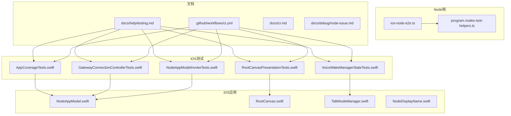
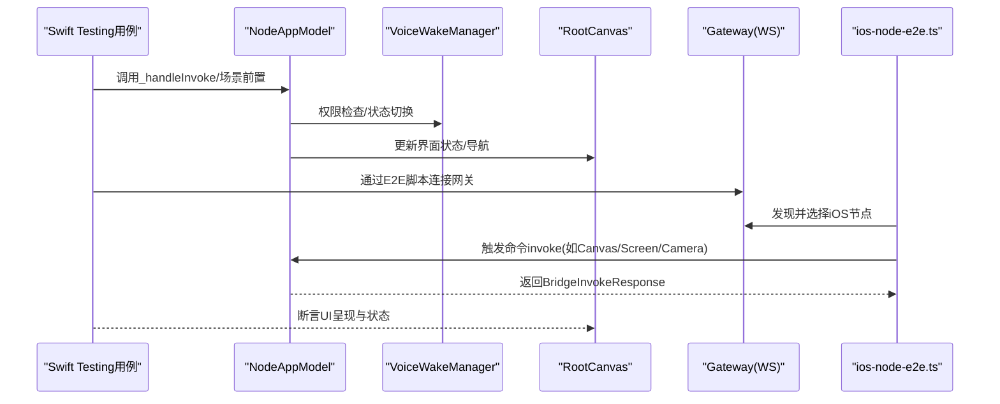
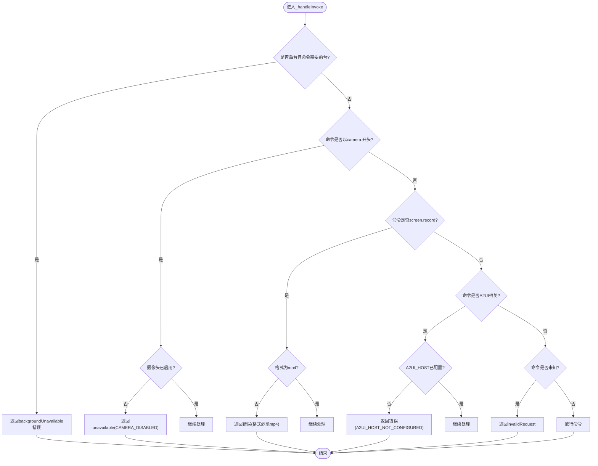
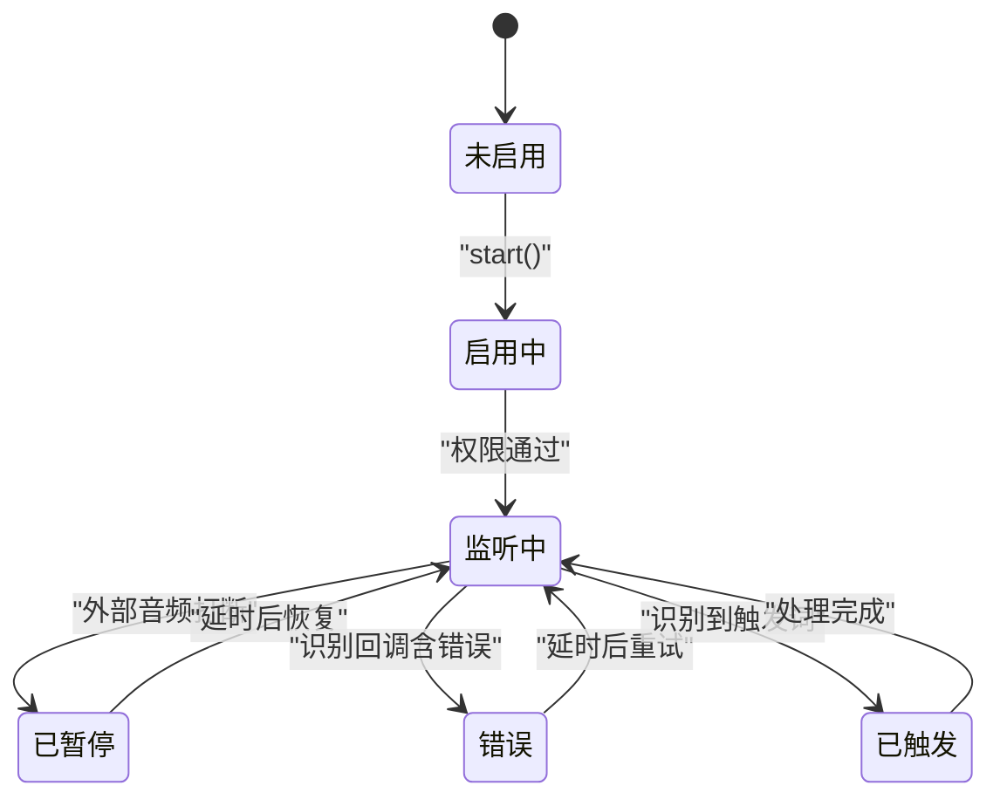
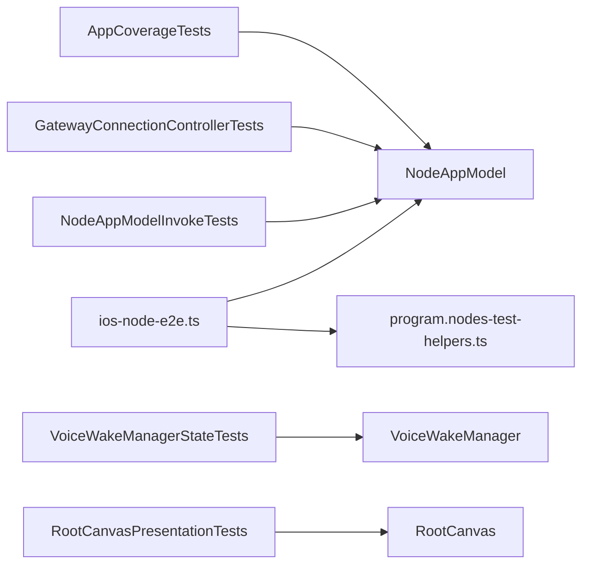

# 测试与调试

## 目录
1. [引言](#引言)
2. [项目结构](#项目结构)
3. [核心组件](#核心组件)
4. [架构总览](#架构总览)
5. [详细组件分析](#详细组件分析)
6. [依赖关系分析](#依赖关系分析)
7. [性能考量](#性能考量)
8. [故障排查指南](#故障排查指南)
9. [结论](#结论)
10. [附录](#附录)

## 引言
本文件面向OpenClaw iOS节点的测试与调试，系统化梳理测试架构、测试策略（单元测试、集成测试、UI测试）、测试用例设计思路与实现要点，并提供调试工具与技巧、测试环境搭建、持续集成与自动化测试配置指南。内容覆盖网络连接、Canvas功能、语音功能等关键路径，帮助开发者在本地与CI中高效定位问题并保障质量。

## 项目结构
iOS测试主要集中在apps/ios/Tests目录，采用Swift Testing框架组织用例；同时，Node侧提供iOS节点的端到端脚本与辅助测试工具，文档层提供测试与CI相关说明。

图表来源
- [apps/ios/Tests/AppCoverageTests.swift](file://apps/ios/Tests/AppCoverageTests.swift#L1-L32)
- [apps/ios/Tests/GatewayConnectionControllerTests.swift](file://apps/ios/Tests/GatewayConnectionControllerTests.swift#L1-L117)
- [apps/ios/Tests/NodeAppModelInvokeTests.swift](file://apps/ios/Tests/NodeAppModelInvokeTests.swift#L1-L528)
- [apps/ios/Tests/VoiceWakeManagerStateTests.swift](file://apps/ios/Tests/VoiceWakeManagerStateTests.swift#L1-L66)
- [apps/ios/Tests/RootCanvasPresentationTests.swift](file://apps/ios/Tests/RootCanvasPresentationTests.swift#L1-L41)
- [apps/ios/Sources/Model/NodeAppModel.swift](file://apps/ios/Sources/Model/NodeAppModel.swift#L703-L741)
- [apps/ios/Sources/Voice/TalkModeManager.swift](file://apps/ios/Sources/Voice/TalkModeManager.swift#L313-L336)
- [apps/ios/Sources/RootCanvas.swift](file://apps/ios/Sources/RootCanvas.swift#L1-L292)
- [apps/ios/Sources/Device/NodeDisplayName.swift](file://apps/ios/Sources/Device/NodeDisplayName.swift#L1-L48)
- [src/cli/program.nodes-test-helpers.ts](file://src/cli/program.nodes-test-helpers.ts#L1-L13)
- [scripts/dev/ios-node-e2e.ts](file://scripts/dev/ios-node-e2e.ts#L40-L86)
- [docs/help/testing.md](file://docs/help/testing.md#L1-L412)
- [.github/workflows/ci.yml](file://.github/workflows/ci.yml#L559-L718)
- [docs/ci.md](file://docs/ci.md#L1-L29)
- [docs/debug/node-issue.md](file://docs/debug/node-issue.md#L1-L86)

章节来源
- [apps/ios/Tests/AppCoverageTests.swift](file://apps/ios/Tests/AppCoverageTests.swift#L1-L32)
- [apps/ios/Tests/GatewayConnectionControllerTests.swift](file://apps/ios/Tests/GatewayConnectionControllerTests.swift#L1-L117)
- [apps/ios/Tests/NodeAppModelInvokeTests.swift](file://apps/ios/Tests/NodeAppModelInvokeTests.swift#L1-L528)
- [apps/ios/Tests/VoiceWakeManagerStateTests.swift](file://apps/ios/Tests/VoiceWakeManagerStateTests.swift#L1-L66)
- [apps/ios/Tests/RootCanvasPresentationTests.swift](file://apps/ios/Tests/RootCanvasPresentationTests.swift#L1-L41)
- [docs/help/testing.md](file://docs/help/testing.md#L1-L412)
- [.github/workflows/ci.yml](file://.github/workflows/ci.yml#L559-L718)

## 核心组件
- NodeAppModel：iOS节点的核心状态与命令处理中枢，负责网关连接、命令分发、前台后台限制、Canvas与屏幕录制等能力。
- GatewayConnectionController：负责显示名解析、能力集(capabilities)与命令集(currentCommands)生成、上一次连接信息加载与校验等。
- VoiceWakeManager：语音唤醒与语音识别回调处理，包含暂停/恢复、错误重试、触发词匹配与命令下发。
- RootCanvas：UI根视图，承载Canvas内容、语音唤醒提示、设置入口等。
- NodeDisplayName：设备名称与通用名称判定、默认名称选择与规范化。
- Node侧测试辅助：提供iOS节点列表与示例节点数据，便于测试与端到端脚本使用。
- 端到端脚本：从网关WebSocket客户端角度挑选iOS节点并执行测试用例序列。

章节来源
- [apps/ios/Sources/Model/NodeAppModel.swift](file://apps/ios/Sources/Model/NodeAppModel.swift#L703-L741)
- [apps/ios/Sources/Voice/TalkModeManager.swift](file://apps/ios/Sources/Voice/TalkModeManager.swift#L313-L336)
- [apps/ios/Sources/RootCanvas.swift](file://apps/ios/Sources/RootCanvas.swift#L1-L292)
- [apps/ios/Sources/Device/NodeDisplayName.swift](file://apps/ios/Sources/Device/NodeDisplayName.swift#L1-L48)
- [src/cli/program.nodes-test-helpers.ts](file://src/cli/program.nodes-test-helpers.ts#L1-L13)
- [scripts/dev/ios-node-e2e.ts](file://scripts/dev/ios-node-e2e.ts#L40-L86)

## 架构总览
下图展示iOS节点测试与调试的关键交互：Swift Testing用例驱动NodeAppModel与相关服务，验证命令处理、权限与状态机行为；Node侧脚本通过WebSocket连接网关，筛选iOS节点并执行端到端测试。

图表来源
- [apps/ios/Tests/NodeAppModelInvokeTests.swift](file://apps/ios/Tests/NodeAppModelInvokeTests.swift#L1-L528)
- [apps/ios/Sources/Model/NodeAppModel.swift](file://apps/ios/Sources/Model/NodeAppModel.swift#L703-L741)
- [apps/ios/Sources/Voice/TalkModeManager.swift](file://apps/ios/Sources/Voice/TalkModeManager.swift#L313-L336)
- [apps/ios/Sources/RootCanvas.swift](file://apps/ios/Sources/RootCanvas.swift#L1-L292)
- [scripts/dev/ios-node-e2e.ts](file://scripts/dev/ios-node-e2e.ts#L40-L86)

## 详细组件分析

### 组件A：NodeAppModel命令处理与权限控制
- 前台限制：后台执行Canvas/相机/屏幕录制等高敏感命令时拒绝并返回背景不可用错误。
- 摄像头禁用：当未启用摄像头权限时，拒绝相机命令并返回“CAMERA_DISABLED”错误。
- 屏幕录制格式校验：仅允许mp4格式，否则返回无效请求。
- A2UI主机缺失：当未配置A2UI主机时，A2UI相关命令失败并提示未配置。
- 未知命令：返回invalidRequest错误。
- 深链处理：在未连接或密钥不匹配时进行确认流程或阻断，防止滥用。

图表来源
- [apps/ios/Sources/Model/NodeAppModel.swift](file://apps/ios/Sources/Model/NodeAppModel.swift#L703-L741)
- [apps/ios/Tests/NodeAppModelInvokeTests.swift](file://apps/ios/Tests/NodeAppModelInvokeTests.swift#L1-L528)

章节来源
- [apps/ios/Sources/Model/NodeAppModel.swift](file://apps/ios/Sources/Model/NodeAppModel.swift#L703-L741)
- [apps/ios/Tests/NodeAppModelInvokeTests.swift](file://apps/ios/Tests/NodeAppModelInvokeTests.swift#L1-L528)

### 组件B：语音唤醒与识别状态机
- 权限请求：在模拟器外请求麦克风与语音识别权限，失败则记录状态文本。
- 外部音频打断：外部捕获开始时暂停监听，结束后延时恢复。
- 识别回调：错误时记录状态并自动重启；成功时提取触发词并下发命令。
- 状态断言：暂停/恢复循环、错误重试、命令下发顺序与状态文本。

图表来源
- [apps/ios/Sources/Voice/TalkModeManager.swift](file://apps/ios/Sources/Voice/TalkModeManager.swift#L313-L336)
- [apps/ios/Tests/VoiceWakeManagerStateTests.swift](file://apps/ios/Tests/VoiceWakeManagerStateTests.swift#L1-L66)

章节来源
- [apps/ios/Sources/Voice/TalkModeManager.swift](file://apps/ios/Sources/Voice/TalkModeManager.swift#L313-L336)
- [apps/ios/Tests/VoiceWakeManagerStateTests.swift](file://apps/ios/Tests/VoiceWakeManagerStateTests.swift#L1-L66)

### 组件C：UI呈现与快速设置逻辑
- 快速设置弹窗条件：未连接、无现有网关配置且发现网关时弹出；已连接或已有配置时不弹出。
- 与RootCanvas状态联动：根据网关连接状态、引导页状态、是否已展示过等综合判断。

章节来源
- [apps/ios/Tests/RootCanvasPresentationTests.swift](file://apps/ios/Tests/RootCanvasPresentationTests.swift#L1-L41)
- [apps/ios/Sources/RootCanvas.swift](file://apps/ios/Sources/RootCanvas.swift#L1-L292)

### 组件D：显示名解析与默认值
- 通用名称集合：包含“iOS Node”“iPhone Node”“iPad Node”等。
- 默认值：根据设备形态(phone/pad/default)返回对应默认名称。
- 归一化：若设备名包含iPhone/iPad/iOS字样则保留，否则回退默认值。

章节来源
- [apps/ios/Sources/Device/NodeDisplayName.swift](file://apps/ios/Sources/Device/NodeDisplayName.swift#L1-L48)

### 组件E：网关连接控制器与能力/命令集
- 显示名解析：缺失时写入默认值。
- 能力集：根据用户偏好(camera/location/voiceWake等)生成当前能力集合。
- 命令集：根据能力与模式生成当前命令集合；排除危险系统命令(run/which/exec approvals)。
- 上次连接：保存/加载上次手动连接信息，支持迁移与校验。

章节来源
- [apps/ios/Tests/GatewayConnectionControllerTests.swift](file://apps/ios/Tests/GatewayConnectionControllerTests.swift#L1-L117)

### 组件F：应用覆盖率与模拟器行为
- 背景态更新：场景切换至后台时isBackgrounded应为true。
- 模拟器语音唤醒：在模拟器上启动语音唤醒会报告“Simulator”并停止监听。

章节来源
- [apps/ios/Tests/AppCoverageTests.swift](file://apps/ios/Tests/AppCoverageTests.swift#L1-L32)

### 组件G：端到端脚本与iOS节点选择
- 错误格式化：统一将异常转为字符串，便于日志与报告。
- iOS节点选择：按connected过滤，再按nodeId/displayName/模糊匹配选择目标节点。
- WebSocket客户端：建立与网关的WS连接，等待打开后执行测试序列。

章节来源
- [scripts/dev/ios-node-e2e.ts](file://scripts/dev/ios-node-e2e.ts#L40-L86)

## 依赖关系分析
- 测试对被测对象的依赖：各Swift Testing用例直接依赖NodeAppModel、VoiceWakeManager、RootCanvas等；部分用例通过UserDefaults/KVC方式注入状态。
- Node侧辅助：program.nodes-test-helpers.ts提供示例iOS节点数据，供测试与脚本复用。
- 端到端脚本：依赖WebSocket客户端与Node侧节点枚举工具，用于在真实网关环境中挑选iOS节点执行命令。

图表来源
- [apps/ios/Tests/AppCoverageTests.swift](file://apps/ios/Tests/AppCoverageTests.swift#L1-L32)
- [apps/ios/Tests/GatewayConnectionControllerTests.swift](file://apps/ios/Tests/GatewayConnectionControllerTests.swift#L1-L117)
- [apps/ios/Tests/NodeAppModelInvokeTests.swift](file://apps/ios/Tests/NodeAppModelInvokeTests.swift#L1-L528)
- [apps/ios/Tests/VoiceWakeManagerStateTests.swift](file://apps/ios/Tests/VoiceWakeManagerStateTests.swift#L1-L66)
- [apps/ios/Tests/RootCanvasPresentationTests.swift](file://apps/ios/Tests/RootCanvasPresentationTests.swift#L1-L41)
- [src/cli/program.nodes-test-helpers.ts](file://src/cli/program.nodes-test-helpers.ts#L1-L13)
- [scripts/dev/ios-node-e2e.ts](file://scripts/dev/ios-node-e2e.ts#L40-L86)

章节来源
- [src/cli/program.nodes-test-helpers.ts](file://src/cli/program.nodes-test-helpers.ts#L1-L13)
- [scripts/dev/ios-node-e2e.ts](file://scripts/dev/ios-node-e2e.ts#L40-L86)

## 性能考量
- 单元测试优先：通过Swift Testing在本地快速验证命令处理、权限与状态机，避免昂贵的端到端开销。
- 集成测试边界：GatewayConnectionControllerTests覆盖能力/命令集生成与上次连接加载，减少UI层干扰。
- 端到端脚本：仅在必要时运行，结合Node侧辅助工具选择目标节点，降低随机性与失败率。
- CI资源：macOS作业合并TS测试与Swift lint/build/test，Windows作业分片并限制并发，平衡速度与稳定性。

## 故障排查指南
- Node + tsx “__name is not a function”崩溃
  - 现象：Node 25.x + tsx 导入时出现函数名助手缺失导致崩溃。
  - 临时方案：使用Bun或编译后运行；或降级tsx版本；或在Node LTS上验证。
  - 参考：[Node + tsx 崩溃文档](file://docs/debug/node-issue.md#L1-L86)

- iOS测试覆盖率门禁
  - 当前CI中iOS测试被显式忽略，但脚本包含覆盖率统计与门限逻辑；可在本地或后续CI启用时参考。
  - 参考：[CI工作流](file://.github/workflows/ci.yml#L559-L718)

- 网络连接与权限
  - 语音唤醒：在模拟器外需请求麦克风与语音识别权限；失败时记录状态文本。
  - Canvas/相机/屏幕命令：需在前台执行；未启用摄像头时拒绝命令。
  - 参考：[TalkModeManager](file://apps/ios/Sources/Voice/TalkModeManager.swift#L313-L336)、[NodeAppModel](file://apps/ios/Sources/Model/NodeAppModel.swift#L703-L741)

- 端到端调试
  - 使用ios-node-e2e.ts连接网关，选择iOS节点并执行命令序列；注意错误格式化与超时设置。
  - 参考：[端到端脚本](file://scripts/dev/ios-node-e2e.ts#L40-L86)

章节来源
- [docs/debug/node-issue.md](file://docs/debug/node-issue.md#L1-L86)
- [.github/workflows/ci.yml](file://.github/workflows/ci.yml#L559-L718)
- [apps/ios/Sources/Voice/TalkModeManager.swift](file://apps/ios/Sources/Voice/TalkModeManager.swift#L313-L336)
- [apps/ios/Sources/Model/NodeAppModel.swift](file://apps/ios/Sources/Model/NodeAppModel.swift#L703-L741)
- [scripts/dev/ios-node-e2e.ts](file://scripts/dev/ios-node-e2e.ts#L40-L86)

## 结论
本文基于仓库中的iOS测试与Node侧工具，构建了从单元测试到端到端验证的完整测试与调试体系。通过明确命令处理边界、权限与状态机行为、UI呈现规则以及CI与Node侧脚本配合，开发者可以在本地与CI中稳定地验证iOS节点在网络连接、Canvas与语音等关键功能上的正确性与鲁棒性。

## 附录

### 测试策略与用例设计
- 单元测试
  - NodeAppModel：命令解码/编码、会话键、后台限制、摄像头禁用、屏幕格式校验、A2UI主机缺失、未知命令、深链处理。
  - VoiceWakeManager：权限请求、暂停/恢复、识别回调错误与命令下发。
  - GatewayConnectionController：显示名解析、能力/命令集生成、上次连接加载与校验。
  - RootCanvas：快速设置弹窗条件。
  - AppCoverage：背景态更新、模拟器语音唤醒行为。
- 集成测试
  - 通过Node侧辅助工具与端到端脚本，结合网关WebSocket连接，验证iOS节点在真实环境中的表现。
- UI测试
  - 以RootCanvas为核心，验证不同状态下的呈现与交互。

章节来源
- [apps/ios/Tests/NodeAppModelInvokeTests.swift](file://apps/ios/Tests/NodeAppModelInvokeTests.swift#L1-L528)
- [apps/ios/Tests/VoiceWakeManagerStateTests.swift](file://apps/ios/Tests/VoiceWakeManagerStateTests.swift#L1-L66)
- [apps/ios/Tests/GatewayConnectionControllerTests.swift](file://apps/ios/Tests/GatewayConnectionControllerTests.swift#L1-L117)
- [apps/ios/Tests/RootCanvasPresentationTests.swift](file://apps/ios/Tests/RootCanvasPresentationTests.swift#L1-L41)
- [apps/ios/Tests/AppCoverageTests.swift](file://apps/ios/Tests/AppCoverageTests.swift#L1-L32)

### 测试环境搭建与持续集成
- 本地运行
  - Swift Testing：在Xcode或命令行运行apps/ios/Tests中的用例。
  - Node端到端：准备网关环境，运行ios-node-e2e.ts脚本。
- CI配置
  - 文档说明了CI作业范围与跳过策略，macOS作业合并TS与Swift检查，Windows作业分片执行。
  - iOS测试当前在CI中被忽略，可按需启用并设置覆盖率门限。
- 参考
  - [测试指南](file://docs/help/testing.md#L1-L412)
  - [CI工作流](file://.github/workflows/ci.yml#L1-L765)
  - [CI概览](file://docs/ci.md#L1-L29)

章节来源
- [docs/help/testing.md](file://docs/help/testing.md#L1-L412)
- [.github/workflows/ci.yml](file://.github/workflows/ci.yml#L1-L765)
- [docs/ci.md](file://docs/ci.md#L1-L29)