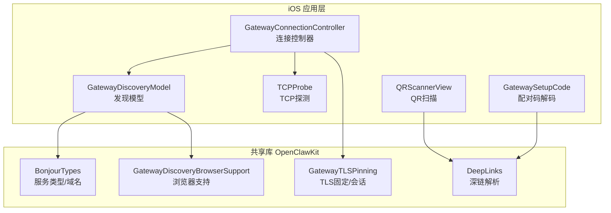
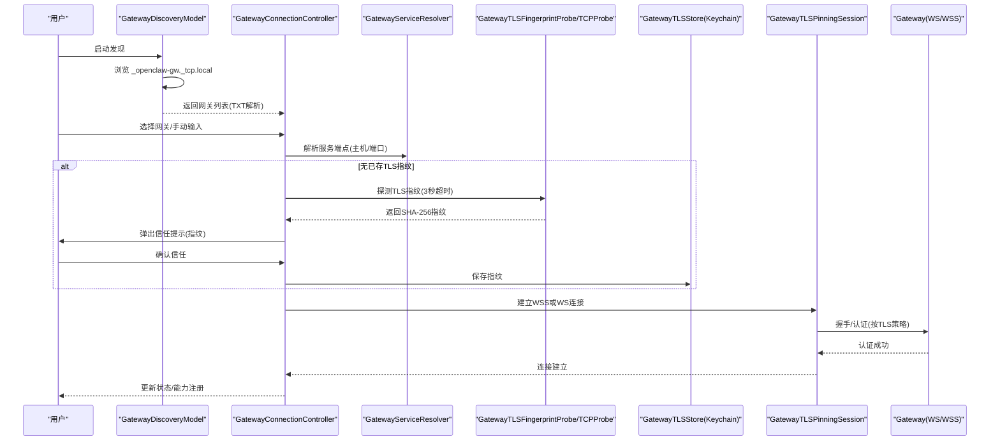
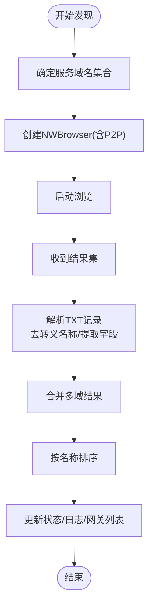
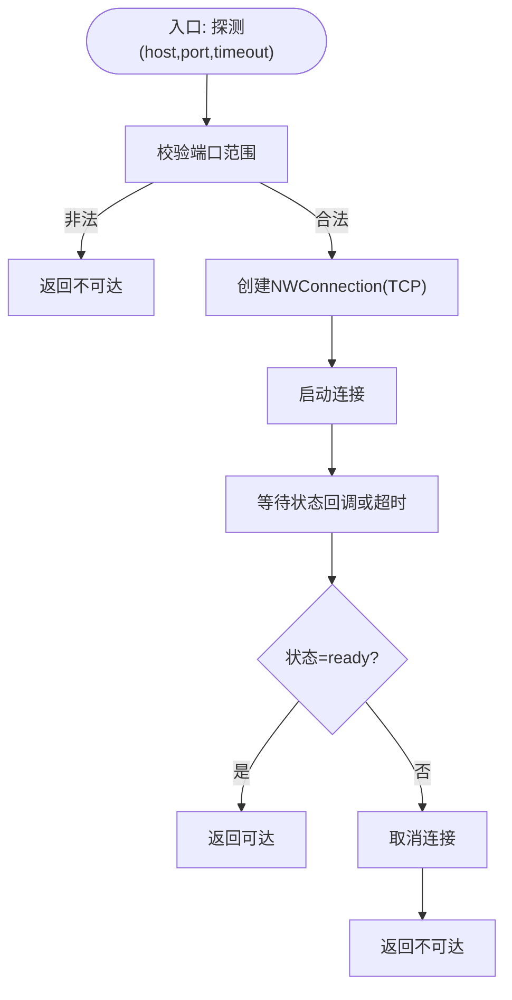
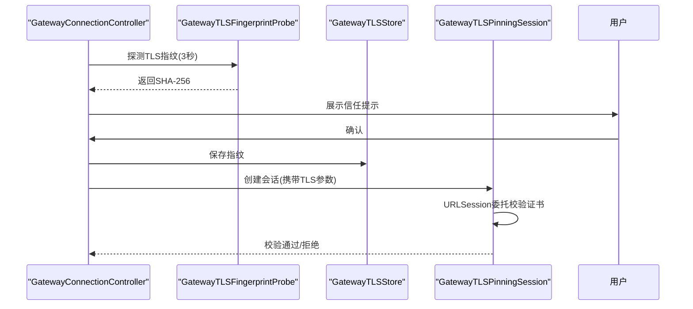
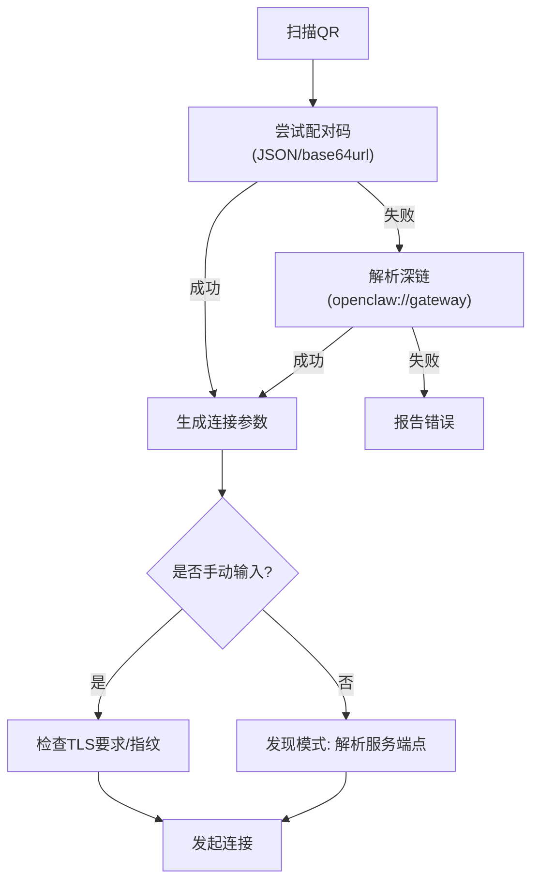
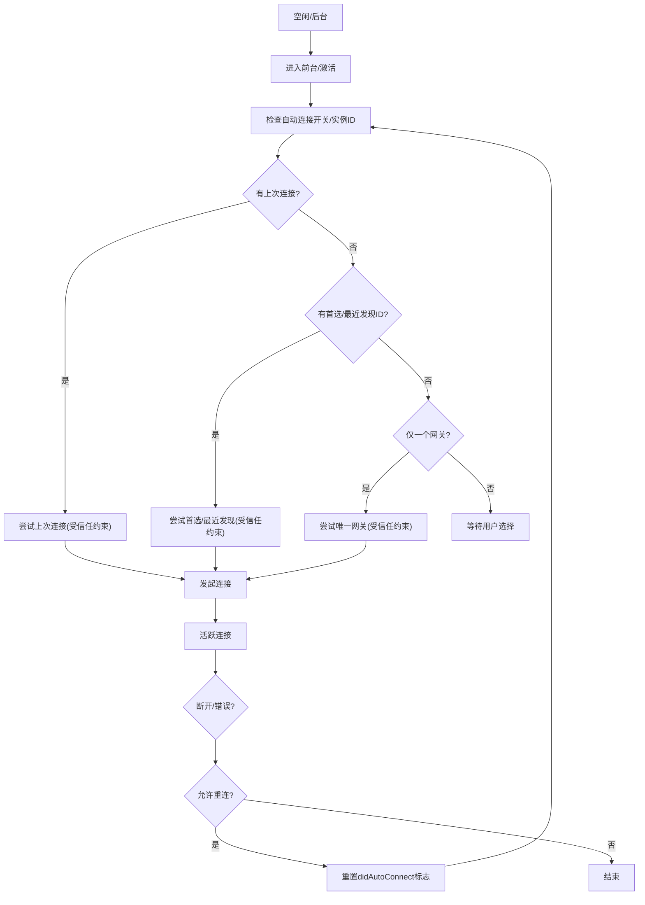
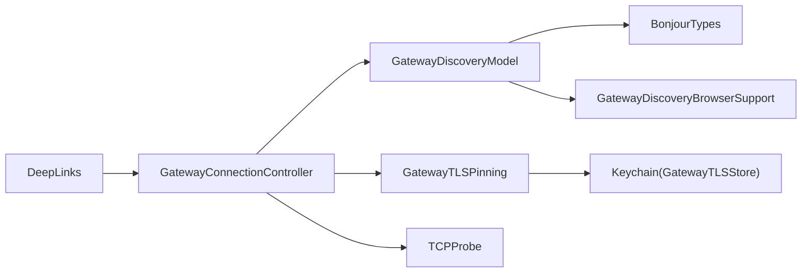

# 连接与配对

## 目录
1. [简介](#简介)
2. [项目结构](#项目结构)
3. [核心组件](#核心组件)
4. [架构总览](#架构总览)
5. [详细组件分析](#详细组件分析)
6. [依赖关系分析](#依赖关系分析)
7. [性能考量](#性能考量)
8. [故障排除指南](#故障排除指南)
9. [结论](#结论)
10. [附录](#附录)

## 简介
本文件面向OpenClaw iOS节点的“连接与配对”能力，系统性阐述以下内容：
- Bonjour网络发现机制：服务类型、域名、TXT记录解析与去转义。
- TCP探测连接过程：端口可达性检查与超时控制。
- 安全验证流程：TLS指纹固定（证书固定）、信任提示与用户确认。
- 设备配对码生成与验证：支持QR码扫描与手动输入两种方式。
- 连接状态监控、自动重连与超时处理策略。
- 故障排除：网络问题诊断、证书验证失败处理、常见错误定位。

## 项目结构
围绕iOS节点的连接与配对，主要涉及以下模块：
- 发现与浏览：Bonjour服务发现、TXT记录解析、状态文本生成。
- 连接控制器：自动连接、手动连接、信任提示、TLS参数构建与应用。
- 安全与TLS固定：证书指纹提取、Keychain存储、会话级校验。
- 配对与深链：QR码扫描、配对码解码、深链解析与连接。
- TCP探测：基于NWConnection的TCP端口可达性探测。

图表来源
- [apps/ios/Sources/Gateway/GatewayConnectionController.swift](file://apps/ios/Sources/Gateway/GatewayConnectionController.swift#L20-L1072)
- [apps/ios/Sources/Gateway/GatewayDiscoveryModel.swift](file://apps/ios/Sources/Gateway/GatewayDiscoveryModel.swift#L1-L182)
- [apps/ios/Sources/Gateway/TCPProbe.swift](file://apps/ios/Sources/Gateway/TCPProbe.swift#L1-L44)
- [apps/ios/Sources/Onboarding/QRScannerView.swift](file://apps/ios/Sources/Onboarding/QRScannerView.swift#L1-L97)
- [apps/ios/Sources/Gateway/GatewaySetupCode.swift](file://apps/ios/Sources/Gateway/GatewaySetupCode.swift#L1-L43)
- [apps/shared/OpenClawKit/Sources/OpenClawKit/BonjourTypes.swift](file://apps/shared/OpenClawKit/Sources/OpenClawKit/BonjourTypes.swift#L1-L41)
- [apps/shared/OpenClawKit/Sources/OpenClawKit/GatewayDiscoveryBrowserSupport.swift](file://apps/shared/OpenClawKit/Sources/OpenClawKit/GatewayDiscoveryBrowserSupport.swift#L1-L33)
- [apps/shared/OpenClawKit/Sources/OpenClawKit/GatewayTLSPinning.swift](file://apps/shared/OpenClawKit/Sources/OpenClawKit/GatewayTLSPinning.swift#L1-L138)
- [apps/shared/OpenClawKit/Sources/OpenClawKit/DeepLinks.swift](file://apps/shared/OpenClawKit/Sources/OpenClawKit/DeepLinks.swift#L1-L151)

章节来源
- [apps/ios/Sources/Gateway/GatewayConnectionController.swift](file://apps/ios/Sources/Gateway/GatewayConnectionController.swift#L20-L1072)
- [apps/ios/Sources/Gateway/GatewayDiscoveryModel.swift](file://apps/ios/Sources/Gateway/GatewayDiscoveryModel.swift#L1-L182)
- [apps/ios/Sources/Gateway/TCPProbe.swift](file://apps/ios/Sources/Gateway/TCPProbe.swift#L1-L44)
- [apps/ios/Sources/Onboarding/QRScannerView.swift](file://apps/ios/Sources/Onboarding/QRScannerView.swift#L1-L97)
- [apps/ios/Sources/Gateway/GatewaySetupCode.swift](file://apps/ios/Sources/Gateway/GatewaySetupCode.swift#L1-L43)
- [apps/shared/OpenClawKit/Sources/OpenClawKit/BonjourTypes.swift](file://apps/shared/OpenClawKit/Sources/OpenClawKit/BonjourTypes.swift#L1-L41)
- [apps/shared/OpenClawKit/Sources/OpenClawKit/GatewayDiscoveryBrowserSupport.swift](file://apps/shared/OpenClawKit/Sources/OpenClawKit/GatewayDiscoveryBrowserSupport.swift#L1-L33)
- [apps/shared/OpenClawKit/Sources/OpenClawKit/GatewayTLSPinning.swift](file://apps/shared/OpenClawKit/Sources/OpenClawKit/GatewayTLSPinning.swift#L1-L138)
- [apps/shared/OpenClawKit/Sources/OpenClawKit/DeepLinks.swift](file://apps/shared/OpenClawKit/Sources/OpenClawKit/DeepLinks.swift#L1-L151)

## 核心组件
- 连接控制器：负责自动/手动连接、信任提示、TLS参数构建、能力与权限注入、自动重连触发。
- 发现模型：通过NWBrowser进行Bonjour服务发现，解析TXT记录，维护网关列表与状态文本。
- TCP探测器：使用NWConnection进行TCP端口可达性探测，带超时保护。
- TLS固定：在首次连接时探测远端证书SHA-256指纹，保存至Keychain；后续连接严格比对。
- 配对与深链：支持QR码扫描（含配对码）与深链URL，解析后进入连接流程。
- Bonjour配置：服务类型、域名、宽域域名解析与规范化。

章节来源
- [apps/ios/Sources/Gateway/GatewayConnectionController.swift](file://apps/ios/Sources/Gateway/GatewayConnectionController.swift#L20-L1072)
- [apps/ios/Sources/Gateway/GatewayDiscoveryModel.swift](file://apps/ios/Sources/Gateway/GatewayDiscoveryModel.swift#L1-L182)
- [apps/ios/Sources/Gateway/TCPProbe.swift](file://apps/ios/Sources/Gateway/TCPProbe.swift#L1-L44)
- [apps/shared/OpenClawKit/Sources/OpenClawKit/GatewayTLSPinning.swift](file://apps/shared/OpenClawKit/Sources/OpenClawKit/GatewayTLSPinning.swift#L1-L138)
- [apps/shared/OpenClawKit/Sources/OpenClawKit/DeepLinks.swift](file://apps/shared/OpenClawKit/Sources/OpenClawKit/DeepLinks.swift#L1-L151)
- [apps/shared/OpenClawKit/Sources/OpenClawKit/BonjourTypes.swift](file://apps/shared/OpenClawKit/Sources/OpenClawKit/BonjourTypes.swift#L1-L41)

## 架构总览
下图展示从发现到连接的关键交互路径，包括Bonjour发现、服务解析、TLS指纹探测、信任确认与最终连接。

图表来源
- [apps/ios/Sources/Gateway/GatewayDiscoveryModel.swift](file://apps/ios/Sources/Gateway/GatewayDiscoveryModel.swift#L51-L100)
- [apps/ios/Sources/Gateway/GatewayConnectionController.swift](file://apps/ios/Sources/Gateway/GatewayConnectionController.swift#L95-L156)
- [apps/ios/Sources/Gateway/GatewayConnectionController.swift](file://apps/ios/Sources/Gateway/GatewayConnectionController.swift#L516-L538)
- [apps/ios/Sources/Gateway/GatewayConnectionController.swift](file://apps/ios/Sources/Gateway/GatewayConnectionController.swift#L1011-L1071)
- [apps/shared/OpenClawKit/Sources/OpenClawKit/GatewayTLSPinning.swift](file://apps/shared/OpenClawKit/Sources/OpenClawKit/GatewayTLSPinning.swift#L58-L115)
- [apps/shared/OpenClawKit/Sources/OpenClawKit/GatewayTLSPinning.swift](file://apps/shared/OpenClawKit/Sources/OpenClawKit/GatewayTLSPinning.swift#L19-L56)

## 详细组件分析

### Bonjour网络发现机制
- 服务类型与域名：使用标准服务类型与本地域，并支持通过环境变量配置宽域域名。
- 浏览器支持：封装NWBrowser创建与回调，启用P2P，主线程回调。
- TXT记录解析：对名称进行去转义，解析显示名、端口、TLS开关、指纹、CLI路径等字段。
- 状态文本：根据各域浏览器状态汇总生成可读状态。
- 去重与排序：合并多域结果并按名称排序，记录新增/移除。

图表来源
- [apps/shared/OpenClawKit/Sources/OpenClawKit/BonjourTypes.swift](file://apps/shared/OpenClawKit/Sources/OpenClawKit/BonjourTypes.swift#L3-L40)
- [apps/shared/OpenClawKit/Sources/OpenClawKit/GatewayDiscoveryBrowserSupport.swift](file://apps/shared/OpenClawKit/Sources/OpenClawKit/GatewayDiscoveryBrowserSupport.swift#L4-L32)
- [apps/ios/Sources/Gateway/GatewayDiscoveryModel.swift](file://apps/ios/Sources/Gateway/GatewayDiscoveryModel.swift#L51-L133)

章节来源
- [apps/shared/OpenClawKit/Sources/OpenClawKit/BonjourTypes.swift](file://apps/shared/OpenClawKit/Sources/OpenClawKit/BonjourTypes.swift#L1-L41)
- [apps/shared/OpenClawKit/Sources/OpenClawKit/GatewayDiscoveryBrowserSupport.swift](file://apps/shared/OpenClawKit/Sources/OpenClawKit/GatewayDiscoveryBrowserSupport.swift#L1-L33)
- [apps/ios/Sources/Gateway/GatewayDiscoveryModel.swift](file://apps/ios/Sources/Gateway/GatewayDiscoveryModel.swift#L1-L182)

### TCP探测连接过程
- 使用NWConnection发起TCP连接，监听状态变化。
- 超时控制：在指定时间后强制返回失败，避免无限等待。
- 端口范围校验：确保端口合法。
- 结果用于辅助判断目标可达性（例如在无TLS场景下的安全提示）。

图表来源
- [apps/ios/Sources/Gateway/TCPProbe.swift](file://apps/ios/Sources/Gateway/TCPProbe.swift#L5-L44)

章节来源
- [apps/ios/Sources/Gateway/TCPProbe.swift](file://apps/ios/Sources/Gateway/TCPProbe.swift#L1-L44)

### 安全验证流程（TLS固定）
- 首次连接：若未保存指纹，通过短时WebSocket探测获取远端证书SHA-256指纹。
- 用户确认：弹出信任提示，用户同意后将指纹持久化至Keychain。
- 后续连接：严格比对期望指纹，不匹配则拒绝连接。
- 会话委托：在URLSession委托中执行证书校验，支持TOFU策略（仅在允许且无指纹时生效）。

图表来源
- [apps/ios/Sources/Gateway/GatewayConnectionController.swift](file://apps/ios/Sources/Gateway/GatewayConnectionController.swift#L120-L136)
- [apps/ios/Sources/Gateway/GatewayConnectionController.swift](file://apps/ios/Sources/Gateway/GatewayConnectionController.swift#L1011-L1071)
- [apps/shared/OpenClawKit/Sources/OpenClawKit/GatewayTLSPinning.swift](file://apps/shared/OpenClawKit/Sources/OpenClawKit/GatewayTLSPinning.swift#L19-L56)
- [apps/shared/OpenClawKit/Sources/OpenClawKit/GatewayTLSPinning.swift](file://apps/shared/OpenClawKit/Sources/OpenClawKit/GatewayTLSPinning.swift#L58-L115)

章节来源
- [apps/ios/Sources/Gateway/GatewayConnectionController.swift](file://apps/ios/Sources/Gateway/GatewayConnectionController.swift#L100-L156)
- [apps/ios/Sources/Gateway/GatewayConnectionController.swift](file://apps/ios/Sources/Gateway/GatewayConnectionController.swift#L516-L538)
- [apps/ios/Sources/Gateway/GatewayConnectionController.swift](file://apps/ios/Sources/Gateway/GatewayConnectionController.swift#L1011-L1071)
- [apps/shared/OpenClawKit/Sources/OpenClawKit/GatewayTLSPinning.swift](file://apps/shared/OpenClawKit/Sources/OpenClawKit/GatewayTLSPinning.swift#L1-L138)

### 设备配对码生成与验证
- QR码扫描：使用VisionKit扫描QR，优先尝试作为“配对码”解析，否则回退为深链URL。
- 配对码解码：支持原生JSON与base64url(JSON)两种格式，提取host/port/tls/token/password等字段。
- 深链解析：支持openclaw://gateway?host=...&port=...&tls=...，并做本地回环限制。
- 手动输入：当无TLS或非本地回环时，禁止明文直连，必须先完成信任流程。

图表来源
- [apps/ios/Sources/Onboarding/QRScannerView.swift](file://apps/ios/Sources/Onboarding/QRScannerView.swift#L61-L84)
- [apps/ios/Sources/Gateway/GatewaySetupCode.swift](file://apps/ios/Sources/Gateway/GatewaySetupCode.swift#L12-L41)
- [apps/shared/OpenClawKit/Sources/OpenClawKit/DeepLinks.swift](file://apps/shared/OpenClawKit/Sources/OpenClawKit/DeepLinks.swift#L92-L150)

章节来源
- [apps/ios/Sources/Onboarding/QRScannerView.swift](file://apps/ios/Sources/Onboarding/QRScannerView.swift#L1-L97)
- [apps/ios/Sources/Gateway/GatewaySetupCode.swift](file://apps/ios/Sources/Gateway/GatewaySetupCode.swift#L1-L43)
- [apps/shared/OpenClawKit/Sources/OpenClawKit/DeepLinks.swift](file://apps/shared/OpenClawKit/Sources/OpenClawKit/DeepLinks.swift#L1-L151)

### 连接状态监控、自动重连与超时处理
- 自动连接：根据偏好设置与上次连接记录，在前台/后台切换时尝试自动连接。
- 自动重连：当检测到需要重连且未处于活动配置中时，重新触发连接流程。
- 超时与取消：Bonjour解析与TLS探测均设置超时，避免UI阻塞；NetService生命周期保持在主线程队列。
- 状态文本：聚合各域浏览器状态，输出可读状态字符串。

图表来源
- [apps/ios/Sources/Gateway/GatewayConnectionController.swift](file://apps/ios/Sources/Gateway/GatewayConnectionController.swift#L421-L429)
- [apps/ios/Sources/Gateway/GatewayConnectionController.swift](file://apps/ios/Sources/Gateway/GatewayConnectionController.swift#L308-L419)
- [apps/ios/Sources/Gateway/GatewayDiscoveryModel.swift](file://apps/ios/Sources/Gateway/GatewayDiscoveryModel.swift#L129-L133)

章节来源
- [apps/ios/Sources/Gateway/GatewayConnectionController.swift](file://apps/ios/Sources/Gateway/GatewayConnectionController.swift#L421-L429)
- [apps/ios/Sources/Gateway/GatewayConnectionController.swift](file://apps/ios/Sources/Gateway/GatewayConnectionController.swift#L308-L419)
- [apps/ios/Sources/Gateway/GatewayDiscoveryModel.swift](file://apps/ios/Sources/Gateway/GatewayDiscoveryModel.swift#L129-L133)

## 依赖关系分析
- 组件耦合
  - GatewayConnectionController依赖GatewayDiscoveryModel进行发现，依赖GatewayTLSPinning进行TLS固定，依赖TCPProbe进行端口探测。
  - OpenClawKit提供Bonjour类型、发现浏览器支持、TLS固定实现与深链解析。
- 外部依赖
  - Network框架用于Bonjour与TCP连接。
  - Security框架用于证书链与指纹计算。
  - Keychain用于持久化TLS指纹。
- 可能的循环依赖
  - 未见直接循环；发现模型与连接控制器通过观察者模式解耦。

图表来源
- [apps/ios/Sources/Gateway/GatewayConnectionController.swift](file://apps/ios/Sources/Gateway/GatewayConnectionController.swift#L20-L1072)
- [apps/ios/Sources/Gateway/GatewayDiscoveryModel.swift](file://apps/ios/Sources/Gateway/GatewayDiscoveryModel.swift#L1-L182)
- [apps/shared/OpenClawKit/Sources/OpenClawKit/BonjourTypes.swift](file://apps/shared/OpenClawKit/Sources/OpenClawKit/BonjourTypes.swift#L1-L41)
- [apps/shared/OpenClawKit/Sources/OpenClawKit/GatewayDiscoveryBrowserSupport.swift](file://apps/shared/OpenClawKit/Sources/OpenClawKit/GatewayDiscoveryBrowserSupport.swift#L1-L33)
- [apps/shared/OpenClawKit/Sources/OpenClawKit/GatewayTLSPinning.swift](file://apps/shared/OpenClawKit/Sources/OpenClawKit/GatewayTLSPinning.swift#L1-L138)
- [apps/shared/OpenClawKit/Sources/OpenClawKit/DeepLinks.swift](file://apps/shared/OpenClawKit/Sources/OpenClawKit/DeepLinks.swift#L1-L151)

章节来源
- [apps/ios/Sources/Gateway/GatewayConnectionController.swift](file://apps/ios/Sources/Gateway/GatewayConnectionController.swift#L20-L1072)
- [apps/ios/Sources/Gateway/GatewayDiscoveryModel.swift](file://apps/ios/Sources/Gateway/GatewayDiscoveryModel.swift#L1-L182)
- [apps/shared/OpenClawKit/Sources/OpenClawKit/BonjourTypes.swift](file://apps/shared/OpenClawKit/Sources/OpenClawKit/BonjourTypes.swift#L1-L41)
- [apps/shared/OpenClawKit/Sources/OpenClawKit/GatewayDiscoveryBrowserSupport.swift](file://apps/shared/OpenClawKit/Sources/OpenClawKit/GatewayDiscoveryBrowserSupport.swift#L1-L33)
- [apps/shared/OpenClawKit/Sources/OpenClawKit/GatewayTLSPinning.swift](file://apps/shared/OpenClawKit/Sources/OpenClawKit/GatewayTLSPinning.swift#L1-L138)
- [apps/shared/OpenClawKit/Sources/OpenClawKit/DeepLinks.swift](file://apps/shared/OpenClawKit/Sources/OpenClawKit/DeepLinks.swift#L1-L151)

## 性能考量
- Bonjour发现：多域并发浏览，主线程回调，避免阻塞UI；结果合并与排序在内存中完成，建议在设备数量较多时关注内存占用。
- TLS探测：短超时（默认3秒），避免长时间阻塞；WebSocket任务仅用于证书提取，不传输业务数据。
- TCP探测：轻量级连接，超时后立即取消，适合快速判断端口可达性。
- 自动重连：仅在必要时触发，避免重复连接循环；前台/后台切换时按需恢复。

## 故障排除指南
- 无法发现网关
  - 检查Bonjour服务类型与域名是否正确，确认本地网络权限已开启。
  - 查看状态文本与调试日志，确认各域浏览器状态。
- 证书验证失败
  - 若首次连接未保存指纹，先完成信任提示并保存；后续连接严格比对指纹。
  - 若误删或迁移，可在Keychain中检查对应稳定ID的条目是否存在。
- 明文连接被拒绝
  - 非本地回环地址禁止明文直连；请使用TLS或先完成信任流程。
- QR码/深链无效
  - 确认配对码为JSON或base64url(JSON)，字段完整；深链URL需符合规范并满足本地回环限制。
- 端口不可达
  - 使用TCP探测确认端口连通性；检查防火墙与网关配置。

章节来源
- [apps/ios/Sources/Gateway/GatewayDiscoveryModel.swift](file://apps/ios/Sources/Gateway/GatewayDiscoveryModel.swift#L129-L133)
- [apps/ios/Sources/Gateway/GatewayConnectionController.swift](file://apps/ios/Sources/Gateway/GatewayConnectionController.swift#L112-L118)
- [apps/ios/Sources/Gateway/GatewayConnectionController.swift](file://apps/ios/Sources/Gateway/GatewayConnectionController.swift#L172-L185)
- [apps/ios/Sources/Gateway/GatewayConnectionController.swift](file://apps/ios/Sources/Gateway/GatewayConnectionController.swift#L1011-L1071)
- [apps/ios/Sources/Onboarding/QRScannerView.swift](file://apps/ios/Sources/Onboarding/QRScannerView.swift#L61-L84)
- [apps/ios/Sources/Gateway/GatewaySetupCode.swift](file://apps/ios/Sources/Gateway/GatewaySetupCode.swift#L12-L41)
- [apps/shared/OpenClawKit/Sources/OpenClawKit/DeepLinks.swift](file://apps/shared/OpenClawKit/Sources/OpenClawKit/DeepLinks.swift#L135-L144)
- [apps/ios/Sources/Gateway/TCPProbe.swift](file://apps/ios/Sources/Gateway/TCPProbe.swift#L5-L44)

## 结论
OpenClaw iOS节点的连接与配对体系以Bonjour发现为基础，结合TCP可达性探测与严格的TLS指纹固定，确保在本地与广域网络场景下的安全连接。QR码与深链提供了便捷的配对入口，自动重连与状态监控提升了用户体验。遵循本文的故障排除步骤与最佳实践，可有效提升连接成功率与稳定性。

## 附录
- 关键流程参考路径
  - 发现与浏览：[apps/ios/Sources/Gateway/GatewayDiscoveryModel.swift](file://apps/ios/Sources/Gateway/GatewayDiscoveryModel.swift#L51-L100)
  - 连接控制器主流程：[apps/ios/Sources/Gateway/GatewayConnectionController.swift](file://apps/ios/Sources/Gateway/GatewayConnectionController.swift#L95-L156)
  - TLS指纹探测与会话：[apps/ios/Sources/Gateway/GatewayConnectionController.swift](file://apps/ios/Sources/Gateway/GatewayConnectionController.swift#L516-L538), [apps/shared/OpenClawKit/Sources/OpenClawKit/GatewayTLSPinning.swift](file://apps/shared/OpenClawKit/Sources/OpenClawKit/GatewayTLSPinning.swift#L58-L115)
  - QR与深链：[apps/ios/Sources/Onboarding/QRScannerView.swift](file://apps/ios/Sources/Onboarding/QRScannerView.swift#L61-L84), [apps/shared/OpenClawKit/Sources/OpenClawKit/DeepLinks.swift](file://apps/shared/OpenClawKit/Sources/OpenClawKit/DeepLinks.swift#L92-L150)
  - TCP探测：[apps/ios/Sources/Gateway/TCPProbe.swift](file://apps/ios/Sources/Gateway/TCPProbe.swift#L5-L44)