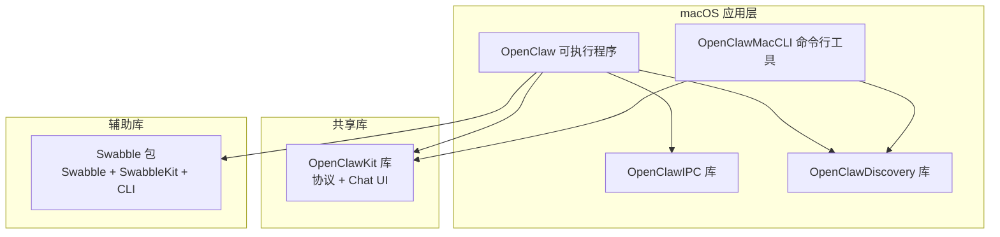
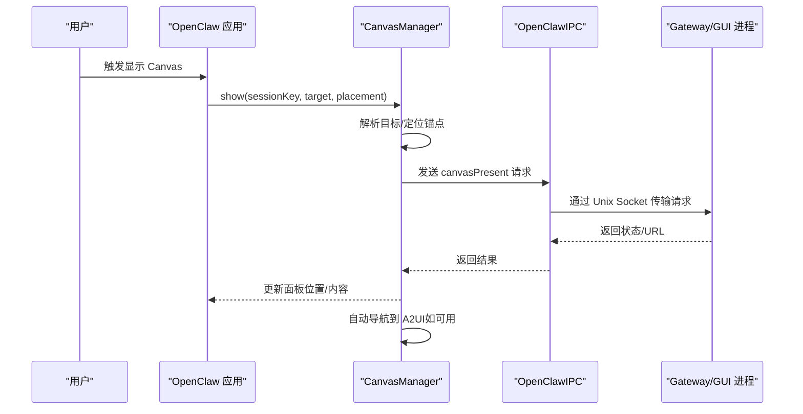
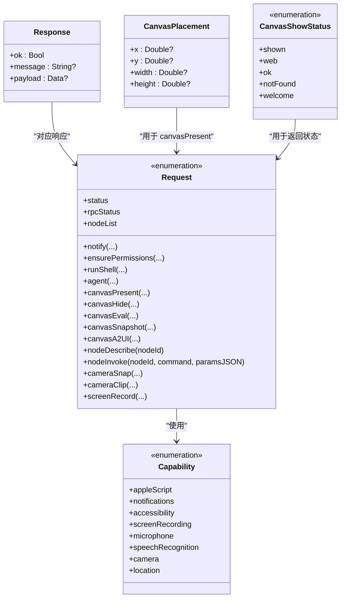
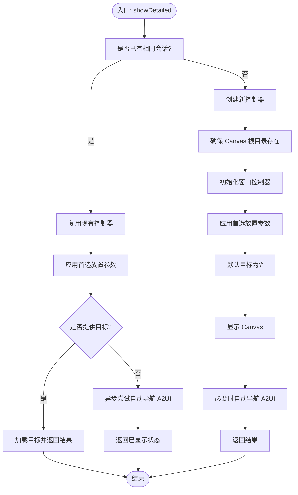
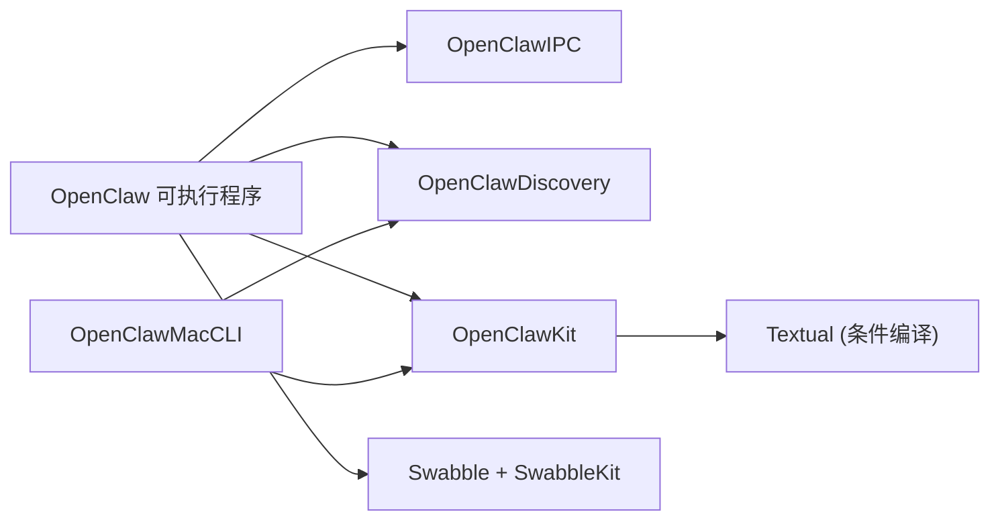

# 开发指南

## 目录
1. [简介](#简介)
2. [项目结构](#项目结构)
3. [核心组件](#核心组件)
4. [架构总览](#架构总览)
5. [详细组件分析](#详细组件分析)
6. [依赖关系分析](#依赖关系分析)
7. [性能考虑](#性能考虑)
8. [调试与故障排除](#调试与故障排除)
9. [结论](#结论)
10. [附录](#附录)

## 简介
本指南面向在 macOS 上开发 OpenClaw 应用的开发者，覆盖开发环境搭建、项目结构与构建流程、Swift Package Manager 使用与依赖管理、版本控制策略、代码规范、测试策略、持续集成配置、架构设计原则与模块划分、接口定义规范、调试技巧、性能优化以及发布流程最佳实践，并提供常见问题的解决方案与故障排除建议。

## 项目结构
OpenClaw 在 macOS 平台由多个 Swift 包组成，核心包括：
- macOS 应用包：提供菜单栏常驻、IPC 通信、Canvas 面板、命令行工具等能力
- 共享库包 OpenClawKit：跨平台协议与 UI 组件
- 辅助库 Swabble：通用工具与 CLI 能力
- 构建与打包脚本：用于本地开发、签名、公证、打包与更新分发

图表来源
- [apps/macos/Package.swift](file://apps/macos/Package.swift#L6-L92)
- [apps/shared/OpenClawKit/Package.swift](file://apps/shared/OpenClawKit/Package.swift#L5-L61)
- [Swabble/Package.swift](file://Swabble/Package.swift#L4-L55)

章节来源
- [apps/macos/Package.swift](file://apps/macos/Package.swift#L6-L92)
- [apps/shared/OpenClawKit/Package.swift](file://apps/shared/OpenClawKit/Package.swift#L5-L61)
- [Swabble/Package.swift](file://Swabble/Package.swift#L4-L55)

## 核心组件
- OpenClawIPC：定义跨进程通信请求/响应模型、权限能力枚举、Canvas 展示状态与放置参数等，提供统一的 IPC 接口与传输路径。
- OpenClaw：菜单栏常驻应用，负责 Canvas 面板展示、网关连接观察、A2UI 自动导航、调试面板状态刷新等。
- OpenClawDiscovery：设备发现与网络可达性辅助。
- OpenClawMacCLI：macOS 命令行工具，便于自动化与集成。
- OpenClawKit：跨 iOS/macOS 的协议与聊天 UI 组件库。
- Swabble：通用工具与 CLI，提供测试与命令行能力。

章节来源
- [apps/macos/Sources/OpenClawIPC/IPC.swift](file://apps/macos/Sources/OpenClawIPC/IPC.swift#L6-L416)
- [apps/macos/Sources/OpenClaw/CanvasManager.swift](file://apps/macos/Sources/OpenClaw/CanvasManager.swift#L8-L342)
- [apps/macos/Package.swift](file://apps/macos/Package.swift#L26-L92)
- [apps/shared/OpenClawKit/Package.swift](file://apps/shared/OpenClawKit/Package.swift#L20-L52)
- [Swabble/Package.swift](file://Swabble/Package.swift#L19-L55)

## 架构总览
OpenClaw macOS 应用采用“菜单栏 + IPC + Canvas 面板”的交互架构，通过 OpenClawIPC 与后端网关通信；CanvasManager 负责面板生命周期与自动导航；OpenClawKit 提供跨平台协议与 UI；Swabble 提供通用工具链支持。

图表来源
- [apps/macos/Sources/OpenClaw/CanvasManager.swift](file://apps/macos/Sources/OpenClaw/CanvasManager.swift#L32-L114)
- [apps/macos/Sources/OpenClawIPC/IPC.swift](file://apps/macos/Sources/OpenClawIPC/IPC.swift#L108-L136)
- [apps/macos/Sources/OpenClawIPC/IPC.swift](file://apps/macos/Sources/OpenClawIPC/IPC.swift#L410-L416)

## 详细组件分析

### 组件一：OpenClawIPC（IPC 协议与数据模型）
- 职责：定义请求类型（通知、权限检查、Shell 执行、Canvas 操作、节点调用、媒体采集等）、响应体、Canvas 展示状态与放置参数、传输通道路径。
- 关键点：
  - 使用 Sendable/StrictConcurrency 特性保证并发安全。
  - Request/Response 采用自定义 Codable 编解码，区分不同请求类型。
  - 控制通道使用用户目录下的 Unix Socket 路径，确保跨进程稳定通信。

图表来源
- [apps/macos/Sources/OpenClawIPC/IPC.swift](file://apps/macos/Sources/OpenClawIPC/IPC.swift#L6-L16)
- [apps/macos/Sources/OpenClawIPC/IPC.swift](file://apps/macos/Sources/OpenClawIPC/IPC.swift#L108-L136)
- [apps/macos/Sources/OpenClawIPC/IPC.swift](file://apps/macos/Sources/OpenClawIPC/IPC.swift#L140-L151)
- [apps/macos/Sources/OpenClawIPC/IPC.swift](file://apps/macos/Sources/OpenClawIPC/IPC.swift#L46-L58)
- [apps/macos/Sources/OpenClawIPC/IPC.swift](file://apps/macos/Sources/OpenClawIPC/IPC.swift#L62-L73)

章节来源
- [apps/macos/Sources/OpenClawIPC/IPC.swift](file://apps/macos/Sources/OpenClawIPC/IPC.swift#L6-L416)

### 组件二：CanvasManager（Canvas 面板生命周期与自动导航）
- 职责：管理 Canvas 面板的显示/隐藏、锚定位置、目标加载、自动导航至 A2UI、调试状态刷新。
- 关键点：
  - 单例模式，主线程访问，避免并发 UI 冲突。
  - 支持直接 URL、本地文件与会话内路由三种目标解析。
  - 从网关推送中提取 Canvas Host URL，自动导航到 A2UI。
  - 会话根目录位于应用支持目录下，确保隔离与可维护性。

图表来源
- [apps/macos/Sources/OpenClaw/CanvasManager.swift](file://apps/macos/Sources/OpenClaw/CanvasManager.swift#L32-L114)
- [apps/macos/Sources/OpenClaw/CanvasManager.swift](file://apps/macos/Sources/OpenClaw/CanvasManager.swift#L269-L293)
- [apps/macos/Sources/OpenClaw/CanvasManager.swift](file://apps/macos/Sources/OpenClaw/CanvasManager.swift#L295-L331)

章节来源
- [apps/macos/Sources/OpenClaw/CanvasManager.swift](file://apps/macos/Sources/OpenClaw/CanvasManager.swift#L8-L342)

### 组件三：AgentWorkspace（工作区引导与模板）
- 职责：工作区路径解析、空目录检测、模板生成与引导安全检查、默认模板加载。
- 关键点：
  - 仅当工作区为空或仅含模板文件时允许引导。
  - 模板包含 AGENTS.md、SOUL.md、IDENTITY.md、USER.md、BOOTSTRAP.md 等。
  - 支持从资源、开发目录与当前工作目录加载模板。

章节来源
- [apps/macos/Sources/OpenClaw/AgentWorkspace.swift](file://apps/macos/Sources/OpenClaw/AgentWorkspace.swift#L4-L343)

### 组件四：OpenClaw 应用与 CLI（菜单栏 + 命令行）
- 职责：菜单栏常驻、权限提示、Canvas 展示、Shell 执行、节点调用、RPC 状态查询等；CLI 工具用于自动化与集成。
- 关键点：
  - 通过 OpenClawIPC 发起请求并与网关通信。
  - 资源包含图标与设备模型，构建时复制到应用包。

章节来源
- [apps/macos/Package.swift](file://apps/macos/Package.swift#L42-L78)

## 依赖关系分析
- macOS 包依赖 OpenClawKit（协议与 UI）、Swabble（工具与 CLI）、MenuBarExtraAccess（菜单栏）、swift-subprocess（子进程）、swift-log（日志）、Sparkle（更新）、Peekaboo（桥接）。
- OpenClawKit 同时支持 iOS/macOS，提供协议与 Chat UI。
- Swabble 提供测试与 CLI 能力，便于独立验证与自动化。

图表来源
- [apps/macos/Package.swift](file://apps/macos/Package.swift#L42-L78)
- [apps/shared/OpenClawKit/Package.swift](file://apps/shared/OpenClawKit/Package.swift#L20-L52)
- [Swabble/Package.swift](file://Swabble/Package.swift#L19-L55)

章节来源
- [apps/macos/Package.swift](file://apps/macos/Package.swift#L17-L25)
- [apps/macos/Package.resolved](file://apps/macos/Package.resolved#L1-L132)
- [apps/shared/OpenClawKit/Package.swift](file://apps/shared/OpenClawKit/Package.swift#L16-L19)
- [Swabble/Package.swift](file://Swabble/Package.swift#L15-L18)

## 性能考虑
- 并发与线程模型
  - 使用 StrictConcurrency 与 Sendable 类型，避免跨线程共享可变状态。
  - CanvasManager 使用 @MainActor 限定 UI 访问，减少主线程阻塞。
- IPC 与 I/O
  - 控制通道使用 Unix Socket，避免网络开销；对大负载响应（如截图）注意异步处理。
- Canvas 渲染与导航
  - 优先使用本地文件与会话内路由，减少网络请求；自动导航仅在必要时触发。
- 日志与可观测性
  - 使用 swift-log 输出结构化日志，便于定位性能瓶颈。

[本节为通用指导，无需列出具体文件来源]

## 调试与故障排除
- 开发运行
  - 快速启动：使用脚本一键重启应用与网关。
  - 不同签名模式：支持无签名快速开发与正式签名两种方式。
- 打包与签名
  - 自动选择签名身份（Developer ID Application > Apple Distribution > Apple Development > 第一个可用），可配置允许 ad-hoc 签名或关闭时间戳。
  - 团队 ID 审计：签名后校验应用包内所有 Mach-O 的 Team ID，不一致则失败；可跳过审计以加速开发。
  - Sparkle 团队 ID 不匹配：开发阶段可临时禁用库验证以绕过加载限制。
- 打包与分发
  - 打包：生成 .app 并签名；公证与 DMG 制作；生成 Sparkle 更新源。
- 常见问题
  - TCC 权限未持久：无签名或 ad-hoc 签名导致权限不持久，建议使用正式签名。
  - Sparkle 加载失败：检查团队 ID 一致性或启用禁用库验证的开发开关。
  - Canvas 无法自动导航：确认网关推送的 Canvas Host URL 是否有效且面板可见。

章节来源
- [apps/macos/README.md](file://apps/macos/README.md#L3-L64)
- [scripts/restart-mac.sh](file://scripts/restart-mac.sh)
- [scripts/package-mac-app.sh](file://scripts/package-mac-app.sh)
- [scripts/codesign-mac-app.sh](file://scripts/codesign-mac-app.sh)
- [scripts/notarize-mac-artifact.sh](file://scripts/notarize-mac-artifact.sh)
- [scripts/create-dmg.sh](file://scripts/create-dmg.sh)
- [scripts/make_appcast.sh](file://scripts/make_appcast.sh)

## 结论
OpenClaw macOS 应用通过清晰的包结构与模块划分，结合严格的并发模型与 IPC 协议，实现了菜单栏常驻、Canvas 面板与网关的高效协同。借助 OpenClawKit 与 Swabble，应用具备良好的跨平台一致性与可扩展性。遵循本文的开发、测试与发布流程，可显著提升开发效率与质量。

[本节为总结性内容，无需列出具体文件来源]

## 附录

### A. 开发环境搭建与构建流程
- 环境要求
  - Xcode 与 Swift 工具链（Swift 6 语言模式）
  - macOS 15 或以上
- 本地开发
  - 使用脚本一键启动应用与网关，支持无签名快速开发与强制签名两种模式。
- 构建与打包
  - 通过 SPM 构建可执行程序与库；打包脚本完成签名、公证、DMG 制作与更新源生成。

章节来源
- [apps/macos/README.md](file://apps/macos/README.md#L3-L23)
- [scripts/restart-mac.sh](file://scripts/restart-mac.sh)
- [scripts/package-mac-app.sh](file://scripts/package-mac-app.sh)

### B. Swift Package Manager 使用与依赖管理
- 包清单
  - macOS 包声明产品与目标、平台最低版本、依赖来源与版本约束。
  - OpenClawKit 与 Swabble 作为远程包或本地相对路径依赖。
- 版本锁定
  - 使用 Package.resolved 锁定依赖版本，确保可重复构建。
- 语言模式
  - 启用 Swift 6 语言模式与严格并发特性。

章节来源
- [apps/macos/Package.swift](file://apps/macos/Package.swift#L6-L92)
- [apps/macos/Package.resolved](file://apps/macos/Package.resolved#L1-L132)
- [apps/shared/OpenClawKit/Package.swift](file://apps/shared/OpenClawKit/Package.swift#L5-L61)
- [Swabble/Package.swift](file://Swabble/Package.swift#L4-L55)

### C. 代码规范与测试策略
- 代码规范
  - 使用 Swift 6 语言模式与 StrictConcurrency，确保并发安全。
  - 使用 swift-format 与 swiftlint 统一格式与静态检查。
- 测试策略
  - 使用 Swift Testing 框架进行单元与集成测试。
  - macOS 包与 OpenClawKit 包均启用 SwiftTesting 实验特性。

章节来源
- [apps/macos/Package.swift](file://apps/macos/Package.swift#L30-L32)
- [apps/macos/Package.swift](file://apps/macos/Package.swift#L88-L91)
- [apps/shared/OpenClawKit/Package.swift](file://apps/shared/OpenClawKit/Package.swift#L57-L60)
- [Swabble/Package.swift](file://Swabble/Package.swift#L44-L47)

### D. 持续集成配置指南
- CI 工作流
  - 参考仓库中的 GitHub Actions 配置，按需扩展 macOS 构建、测试与打包步骤。
- 依赖缓存
  - 缓存 SPM 包与构建产物，缩短流水线时间。
- 多平台测试
  - 在 macOS 上运行 Swift Testing 测试套件，确保功能正确性。

[本节为通用指导，无需列出具体文件来源]

### E. 接口定义规范
- IPC 请求/响应
  - 使用统一的 Request/Response 枚举与结构体，明确字段语义与可选值。
  - Canvas 相关操作包含展示、隐藏、JavaScript 执行、快照与 A2UI 消息。
- 并发与线程
  - 所有跨线程共享的数据类型实现 Sendable，UI 相关逻辑在 @MainActor 中执行。

章节来源
- [apps/macos/Sources/OpenClawIPC/IPC.swift](file://apps/macos/Sources/OpenClawIPC/IPC.swift#L108-L136)
- [apps/macos/Sources/OpenClawIPC/IPC.swift](file://apps/macos/Sources/OpenClawIPC/IPC.swift#L140-L151)
- [apps/macos/Sources/OpenClaw/CanvasManager.swift](file://apps/macos/Sources/OpenClaw/CanvasManager.swift#L7-L20)

### F. 发布流程最佳实践
- 签名与公证
  - 自动选择签名身份；团队 ID 审核防止不一致；公证确保系统信任。
- 分发与更新
  - 生成 Sparkle 更新源，配合 DMG 制作与 appcast.xml。
- 安全策略
  - 通过脚本生成主机环境安全策略 Swift 文件，确保运行时权限最小化。

章节来源
- [apps/macos/README.md](file://apps/macos/README.md#L17-L64)
- [scripts/package-mac-app.sh](file://scripts/package-mac-app.sh)
- [scripts/notarize-mac-artifact.sh](file://scripts/notarize-mac-artifact.sh)
- [scripts/create-dmg.sh](file://scripts/create-dmg.sh)
- [scripts/make_appcast.sh](file://scripts/make_appcast.sh)
- [scripts/generate-host-env-security-policy-swift.mjs](file://scripts/generate-host-env-security-policy-swift.mjs)